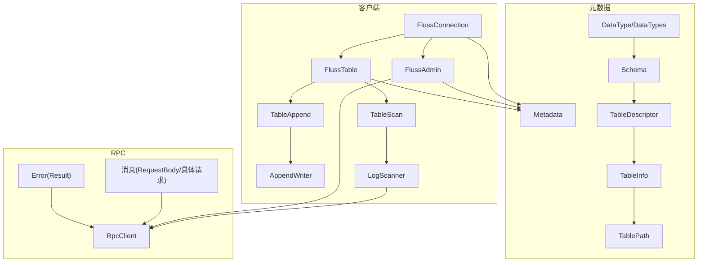
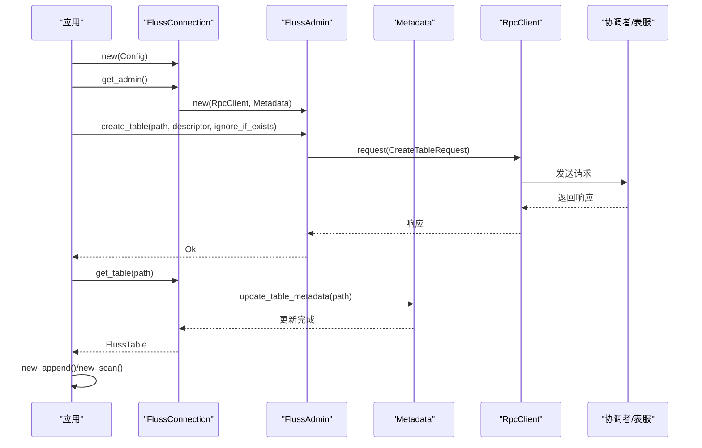
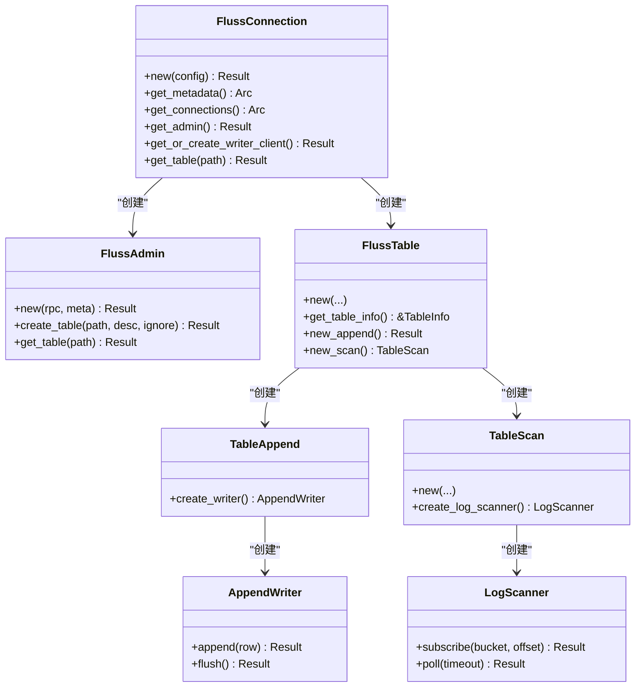
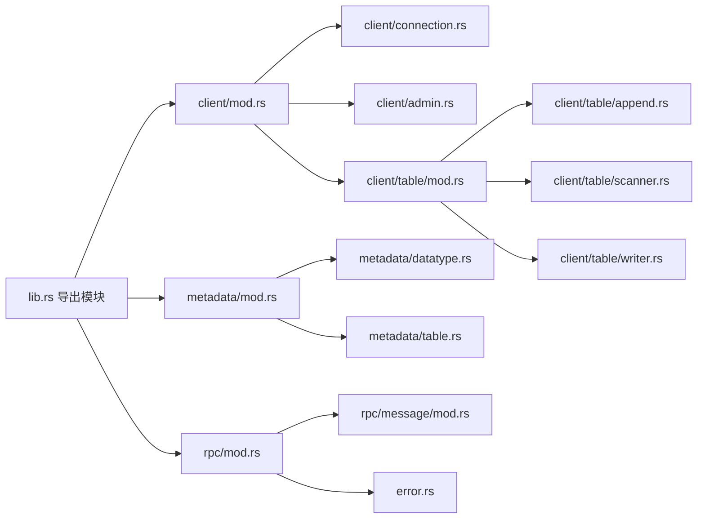

# API 参考

<cite>
**本文引用的文件**
- [lib.rs](file://crates/fluss/src/lib.rs)
- [Cargo.toml](file://crates/fluss/Cargo.toml)
- [client/mod.rs](file://crates/fluss/src/client/mod.rs)
- [client/connection.rs](file://crates/fluss/src/client/connection.rs)
- [client/admin.rs](file://crates/fluss/src/client/admin.rs)
- [client/table/mod.rs](file://crates/fluss/src/client/table/mod.rs)
- [client/table/append.rs](file://crates/fluss/src/client/table/append.rs)
- [client/table/scanner.rs](file://crates/fluss/src/client/table/scanner.rs)
- [client/table/writer.rs](file://crates/fluss/src/client/table/writer.rs)
- [metadata/mod.rs](file://crates/fluss/src/metadata/mod.rs)
- [metadata/datatype.rs](file://crates/fluss/src/metadata/datatype.rs)
- [metadata/table.rs](file://crates/fluss/src/metadata/table.rs)
- [rpc/mod.rs](file://crates/fluss/src/rpc/mod.rs)
- [rpc/message/mod.rs](file://crates/fluss/src/rpc/message/mod.rs)
- [error.rs](file://crates/fluss/src/error.rs)
</cite>

## 目录
1. [简介](#简介)
2. [项目结构](#项目结构)
3. [核心组件](#核心组件)
4. [架构总览](#架构总览)
5. [详细组件分析](#详细组件分析)
6. [依赖关系分析](#依赖关系分析)
7. [性能考量](#性能考量)
8. [故障排查指南](#故障排查指南)
9. [结论](#结论)
10. [附录](#附录)

## 简介
本文件为 Fluss Rust 客户端的完整 API 参考，覆盖以下核心模块与类型：
- 客户端入口与连接：FlussConnection
- 管理接口：FlussAdmin（用于建表、查表）
- 表操作：FlussTable、TableAppend、AppendWriter、TableScan、LogScanner
- 元数据与数据类型：Schema、TableDescriptor、TableInfo、TablePath、DataType、DataField、DataTypes 等
- RPC 消息与错误：RequestBody、各种请求/响应消息、统一错误类型

本参考以“从上到下”的方式组织，先给出高层 API 使用说明与流程图，再深入到具体类型与方法签名、参数与返回值、异常与注意事项。

## 项目结构
Fluss Rust 客户端采用按功能域分层的模块化组织：
- 根模块导出 client、metadata、record、row、rpc、config、error 等子模块
- client 子模块包含连接、管理、表操作、写入等
- metadata 子模块包含数据类型、表元数据、JSON 序列化等
- rpc 子模块包含消息协议、版本控制、传输与错误

图表来源
- [client/connection.rs](file://crates/fluss/src/client/connection.rs#L30-L82)
- [client/admin.rs](file://crates/fluss/src/client/admin.rs#L28-L93)
- [client/table/mod.rs](file://crates/fluss/src/client/table/mod.rs#L33-L66)
- [client/table/append.rs](file://crates/fluss/src/client/table/append.rs#L26-L69)
- [client/table/scanner.rs](file://crates/fluss/src/client/table/scanner.rs#L38-L108)
- [metadata/table.rs](file://crates/fluss/src/metadata/table.rs#L94-L144)
- [metadata/datatype.rs](file://crates/fluss/src/metadata/datatype.rs#L24-L44)
- [rpc/mod.rs](file://crates/fluss/src/rpc/mod.rs#L18-L31)
- [rpc/message/mod.rs](file://crates/fluss/src/rpc/message/mod.rs#L37-L65)
- [error.rs](file://crates/fluss/src/error.rs#L23-L50)

章节来源
- [lib.rs](file://crates/fluss/src/lib.rs#L18-L37)
- [client/mod.rs](file://crates/fluss/src/client/mod.rs#L18-L26)
- [metadata/mod.rs](file://crates/fluss/src/metadata/mod.rs#L18-L24)
- [rpc/mod.rs](file://crates/fluss/src/rpc/mod.rs#L18-L31)

## 核心组件
本节概述公共 API 的主要类型与职责，并给出调用序列图。

- FlussConnection
  - 负责建立与维护与协调者/服务器的连接，提供获取 Metadata、RpcClient、FlussAdmin、FlussTable 的能力
  - 关键方法
    - new(Config) -> Result<FlussConnection>
    - get_metadata() -> Arc<Metadata>
    - get_connections() -> Arc<RpcClient>
    - get_admin() -> Result<FlussAdmin>
    - get_or_create_writer_client() -> Result<Arc<WriterClient>>
    - get_table(&TablePath) -> Result<FlussTable<'_>>

- FlussAdmin
  - 通过协调者节点执行管理操作
  - 关键方法
    - new(Arc<RpcClient>, Arc<Metadata>) -> Result<FlussAdmin>
    - create_table(&TablePath, &TableDescriptor, ignore_if_exists: bool) -> Result<()>
    - get_table(&TablePath) -> Result<TableInfo>

- FlussTable
  - 基于 Metadata 获取表信息，构造写入与扫描对象
  - 关键方法
    - new(...) -> Self
    - get_table_info() -> &TableInfo
    - new_append() -> Result<TableAppend>
    - new_scan() -> TableScan

- TableAppend / AppendWriter
  - 写入接口
  - 关键方法
    - create_writer() -> AppendWriter
    - AppendWriter.append(GenericRow) -> Result<()>
    - AppendWriter.flush() -> Result<()>

- TableScan / LogScanner
  - 读取接口
  - 关键方法
    - new(...), create_log_scanner() -> LogScanner
    - LogScanner.subscribe(i32, i64) -> Result<()> 将桶与起始偏移关联
    - LogScanner.poll(Duration) -> Result<ScanRecords>

- 数据类型与模式
  - DataType、DataTypes、DataField、Schema、TableDescriptor、TableInfo、TablePath
  - 枚举：LogFormat、KvFormat

章节来源
- [client/connection.rs](file://crates/fluss/src/client/connection.rs#L37-L82)
- [client/admin.rs](file://crates/fluss/src/client/admin.rs#L34-L93)
- [client/table/mod.rs](file://crates/fluss/src/client/table/mod.rs#L41-L66)
- [client/table/append.rs](file://crates/fluss/src/client/table/append.rs#L45-L69)
- [client/table/scanner.rs](file://crates/fluss/src/client/table/scanner.rs#L53-L108)
- [metadata/datatype.rs](file://crates/fluss/src/metadata/datatype.rs#L649-L787)
- [metadata/table.rs](file://crates/fluss/src/metadata/table.rs#L94-L144)

## 架构总览
下面的时序图展示了典型“创建表”和“写入/读取”流程：

图表来源
- [client/connection.rs](file://crates/fluss/src/client/connection.rs#L37-L82)
- [client/admin.rs](file://crates/fluss/src/client/admin.rs#L34-L67)
- [rpc/message/mod.rs](file://crates/fluss/src/rpc/message/mod.rs#L37-L51)

## 详细组件分析

### FlussConnection
- 描述：客户端连接入口，负责管理 Metadata、RpcClient、WriterClient 单例，以及表句柄的获取
- 关键方法
  - new(Config) -> Result<FlussConnection>
    - 参数：Config（包含 bootstrap_server 等）
    - 返回：FlussConnection 实例
    - 异常：初始化失败（网络或元数据）
  - get_metadata() -> Arc<Metadata>
  - get_connections() -> Arc<RpcClient>
  - get_admin() -> Result<FlussAdmin>
  - get_or_create_writer_client() -> Result<Arc<WriterClient>>
  - get_table(&TablePath) -> Result<FlussTable<'_>>
    - 会先更新表元数据，再构造 FlussTable

章节来源
- [client/connection.rs](file://crates/fluss/src/client/connection.rs#L37-L82)

### FlussAdmin
- 描述：面向管理的客户端，通过协调者节点执行建表、查表等操作
- 关键方法
  - new(Arc<RpcClient>, Arc<Metadata>) -> Result<FlussAdmin>
  - create_table(&TablePath, &TableDescriptor, ignore_if_exists: bool) -> Result<()>
  - get_table(&TablePath) -> Result<TableInfo>
    - 返回包含表 ID、schema ID、表 JSON、时间戳等的 TableInfo

章节来源
- [client/admin.rs](file://crates/fluss/src/client/admin.rs#L34-L93)

### FlussTable
- 描述：表级操作入口，提供写入与扫描的工厂方法
- 关键方法
  - new(&FlussConnection, Arc<Metadata>, TableInfo) -> Self
  - get_table_info() -> &TableInfo
  - new_append() -> Result<TableAppend>
  - new_scan() -> TableScan

章节来源
- [client/table/mod.rs](file://crates/fluss/src/client/table/mod.rs#L41-L66)

### TableAppend 与 AppendWriter
- 描述：追加写入接口
- 关键方法
  - create_writer() -> AppendWriter
  - AppendWriter.append(GenericRow<'_>) -> Result<()>
  - AppendWriter.flush() -> Result<()>

章节来源
- [client/table/append.rs](file://crates/fluss/src/client/table/append.rs#L45-L69)

### TableScan 与 LogScanner
- 描述：日志扫描接口，支持订阅特定桶并轮询拉取
- 关键方法
  - new(&FlussConnection, TableInfo, Arc<Metadata>) -> Self
  - create_log_scanner() -> LogScanner
  - LogScanner.subscribe(i32, i64) -> Result<()>（绑定桶与起始偏移）
  - LogScanner.poll(Duration) -> Result<ScanRecords>

章节来源
- [client/table/scanner.rs](file://crates/fluss/src/client/table/scanner.rs#L53-L108)

### 数据类型与模式

#### DataType 与 DataTypes
- DataType 是一个枚举，覆盖布尔、整数、浮点、字符串、日期/时间/时间戳、字节、数组、映射、行等
- 常见方法
  - is_nullable() -> bool
  - as_non_nullable() -> Self
- DataTypes 提供便捷构造方法，如 boolean()、int()、string()、decimal(p, s)、timestamp_with_precision(p)、array(t)、map(k, v)、row(fields)、field(name, type) 等

章节来源
- [metadata/datatype.rs](file://crates/fluss/src/metadata/datatype.rs#L24-L94)
- [metadata/datatype.rs](file://crates/fluss/src/metadata/datatype.rs#L649-L787)

#### DataField
- 字段定义：name: String、data_type: DataType、description: Option<String>
- 工厂方法
  - new(name, data_type, description)
  - DataTypes.field(name, data_type)
  - DataTypes.field_with_description(name, data_type, description)

章节来源
- [metadata/datatype.rs](file://crates/fluss/src/metadata/datatype.rs#L790-L800)

#### Schema
- 结构：columns: Vec<Column>、primary_key: Option<PrimaryKey>、row_type: DataType（必须为 Row）
- 方法
  - builder() -> SchemaBuilder
  - columns() -> &[Column]
  - primary_key() -> Option<&PrimaryKey>
  - row_type() -> &DataType
  - primary_key_indexes() -> Vec<usize>
  - primary_key_column_names() -> Vec<&str>
  - column_names() -> Vec<&str>

章节来源
- [metadata/table.rs](file://crates/fluss/src/metadata/table.rs#L94-L144)

#### SchemaBuilder
- 链式构建器
  - with_row_type(&DataType) -> Self
  - column(name, data_type) -> Self
  - with_columns(columns) -> Self
  - with_comment(comment) -> Self
  - primary_key(column_names) -> Self
  - primary_key_named(constraint_name, column_names) -> Self
  - build() -> Result<Schema>

章节来源
- [metadata/table.rs](file://crates/fluss/src/metadata/table.rs#L146-L216)

#### TableDescriptor
- 结构：schema: Schema、properties: HashMap<String,String>、custom_properties: HashMap<String,String>、partition_keys: Vec<String>、comment: Option<String>、table_distribution: Option<TableDistribution>
- 方法
  - builder() -> TableDescriptorBuilder
  - schema() -> &Schema
  - bucket_keys() -> Vec<&str>
  - is_default_bucket_key() -> Result<bool>
  - is_partitioned() -> bool
  - has_primary_key() -> bool
  - partition_keys() -> &[String]
  - table_distribution() -> Option<&TableDistribution>
  - properties() -> &HashMap<String,String>
  - custom_properties() -> &HashMap<String,String>
  - replication_factor() -> Result<i32>
  - with_properties(HashMap) -> Self
  - with_replication_factor(i32) -> Self
  - with_bucket_count(i32) -> Self
  - comment() -> Option<&str>

章节来源
- [metadata/table.rs](file://crates/fluss/src/metadata/table.rs#L376-L486)

#### TableDescriptorBuilder
- 链式构建器
  - schema(Schema) -> Self
  - log_format(LogFormat) -> Self
  - kv_format(KvFormat) -> Self
  - property(key, value) -> Self
  - properties(map) -> Self
  - custom_property(key, value) -> Self
  - custom_properties(map) -> Self
  - partitioned_by(keys) -> Self
  - distributed_by(bucket_count?, bucket_keys) -> Self
  - comment(text) -> Self
  - build() -> Result<TableDescriptor>

章节来源
- [metadata/table.rs](file://crates/fluss/src/metadata/table.rs#L287-L374)

#### TableDistribution
- 结构：bucket_count: Option<i32>、bucket_keys: Vec<String>
- 方法
  - bucket_keys() -> &[String]
  - bucket_count() -> Option<i32>

章节来源
- [metadata/table.rs](file://crates/fluss/src/metadata/table.rs#L270-L285)

#### TableInfo
- 结构：table_path、table_id、schema_id、schema、row_type、primary_keys、physical_primary_keys、bucket_keys、partition_keys、num_buckets、properties、table_config、custom_properties、comment、created_time、modified_time
- 方法
  - row_type() -> &RowType
  - of(...) / new(...) 构造函数族
  - get_table_path() / get_table_id() / get_schema_id() / get_schema() / get_row_type()
  - has_primary_key() -> bool
  - get_primary_keys() -> &Vec<String>
  - get_physical_primary_keys() -> &[String]
  - has_bucket_key() -> bool
  - is_default_bucket_key() -> bool
  - get_bucket_keys() -> &[String]

章节来源
- [metadata/table.rs](file://crates/fluss/src/metadata/table.rs#L634-L800)

#### TablePath
- 结构：database: String、table: String
- 方法
  - new(db, tbl) -> Self
  - database() -> &str
  - table() -> &str

章节来源
- [metadata/table.rs](file://crates/fluss/src/metadata/table.rs#L603-L632)

#### 枚举：LogFormat、KvFormat
- LogFormat：ARROW、INDEXED
- KvFormat：INDEXED、COMPACTED
- 实现 Display

章节来源
- [metadata/table.rs](file://crates/fluss/src/metadata/table.rs#L567-L601)

### 类与关系图（代码级）

图表来源
- [client/connection.rs](file://crates/fluss/src/client/connection.rs#L37-L82)
- [client/admin.rs](file://crates/fluss/src/client/admin.rs#L34-L93)
- [client/table/mod.rs](file://crates/fluss/src/client/table/mod.rs#L41-L66)
- [client/table/append.rs](file://crates/fluss/src/client/table/append.rs#L45-L69)
- [client/table/scanner.rs](file://crates/fluss/src/client/table/scanner.rs#L53-L108)

## 依赖关系分析

图表来源
- [lib.rs](file://crates/fluss/src/lib.rs#L18-L37)
- [client/mod.rs](file://crates/fluss/src/client/mod.rs#L18-L26)
- [metadata/mod.rs](file://crates/fluss/src/metadata/mod.rs#L18-L24)
- [rpc/mod.rs](file://crates/fluss/src/rpc/mod.rs#L18-L31)

章节来源
- [Cargo.toml](file://crates/fluss/Cargo.toml#L25-L47)

## 性能考量
- 写入路径
  - AppendWriter.append 会封装为 WriteRecord 并交由 WriterClient 发送，随后等待结果处理
  - flush 用于强制发送缓冲区中的记录
- 读取路径
  - LogScanner.subscribe 绑定桶与偏移后，poll 会批量拉取日志并转换为 ScanRecords
  - fetch 请求中包含最大/最小字节数与等待时间配置，影响吞吐与延迟权衡
- 元数据与分区
  - get_table 会先更新表元数据，确保后续写入/读取使用最新拓扑
  - 分桶键与分区键的设置会影响数据分布与查询效率

[本节为通用指导，不直接分析具体文件]

## 故障排查指南
- 错误类型
  - Result<T> = Result<T, Error>
  - Error 包含：Io、InvalidTableError、JsonSerdeError、RpcError、RowConvertError、ArrowError、WriteError、IllegalArgument
- 常见问题定位
  - 建表失败：检查 TableDescriptor 的 schema、主键、分桶键与分区键是否冲突；replication_factor 是否可解析
  - 读取无数据：确认已调用 subscribe 并传入正确的桶号与起始偏移；检查高水位标记与当前偏移
  - 写入阻塞：检查 WriterClient 缓冲与 flush 策略；关注 RPC 层错误（RpcError）

章节来源
- [error.rs](file://crates/fluss/src/error.rs#L23-L50)
- [client/table/scanner.rs](file://crates/fluss/src/client/table/scanner.rs#L95-L107)
- [client/table/append.rs](file://crates/fluss/src/client/table/append.rs#L66-L68)

## 结论
本文档系统性梳理了 Fluss Rust 客户端的核心 API，覆盖连接、管理、表操作、读写与数据类型等关键模块。建议在实际使用中：
- 先通过 FlussConnection 获取 FlussAdmin 与 FlussTable
- 使用 TableDescriptorBuilder/SchemaBuilder 构建表结构
- 写入使用 AppendWriter，读取使用 LogScanner 并正确订阅桶
- 注意错误类型与异常分支，结合日志与元数据更新进行排错

[本节为总结性内容，不直接分析具体文件]

## 附录

### API 使用示例与注意事项（路径指引）
- 创建表
  - 步骤：构建 Schema/SchemaBuilder → 构建 TableDescriptor/TableDescriptorBuilder → 调用 FlussAdmin::create_table
  - 参考路径
    - [metadata/table.rs](file://crates/fluss/src/metadata/table.rs#L146-L216)
    - [metadata/table.rs](file://crates/fluss/src/metadata/table.rs#L287-L374)
    - [client/admin.rs](file://crates/fluss/src/client/admin.rs#L52-L67)
- 写入数据
  - 步骤：FlussConnection::get_table → FlussTable::new_append → AppendWriter::append/flush
  - 参考路径
    - [client/connection.rs](file://crates/fluss/src/client/connection.rs#L77-L81)
    - [client/table/mod.rs](file://crates/fluss/src/client/table/mod.rs#L56-L62)
    - [client/table/append.rs](file://crates/fluss/src/client/table/append.rs#L59-L68)
- 读取数据
  - 步骤：FlussConnection::get_table → FlussTable::new_scan → LogScanner::subscribe/poll
  - 参考路径
    - [client/table/scanner.rs](file://crates/fluss/src/client/table/scanner.rs#L95-L107)
    - [client/table/scanner.rs](file://crates/fluss/src/client/table/scanner.rs#L135-L173)

### 数据类型与模式要点
- DataType 支持多层级嵌套（如 Array、Map、Row），Row 必须由 DataField 组成
- Decimal 的精度与标度范围有限制，需满足约束
- 主键表的分桶键必须是主键且排除分区键
- 枚举 LogFormat/KvFormat 用于指定日志/键值格式

章节来源
- [metadata/datatype.rs](file://crates/fluss/src/metadata/datatype.rs#L337-L371)
- [metadata/table.rs](file://crates/fluss/src/metadata/table.rs#L487-L564)
- [metadata/table.rs](file://crates/fluss/src/metadata/table.rs#L567-L601)

### 版本信息与变更历史
- 当前版本与工作区版本由包配置提供
- 变更历史请参考仓库的提交记录与发布说明

章节来源
- [Cargo.toml](file://crates/fluss/Cargo.toml#L18-L23)