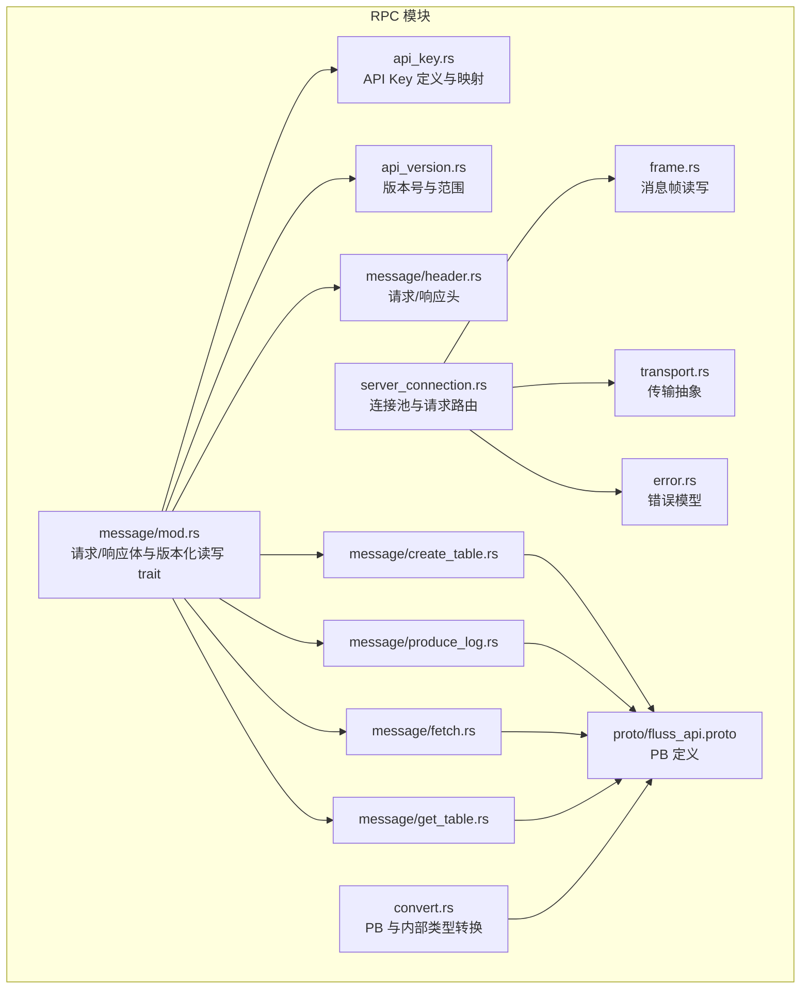
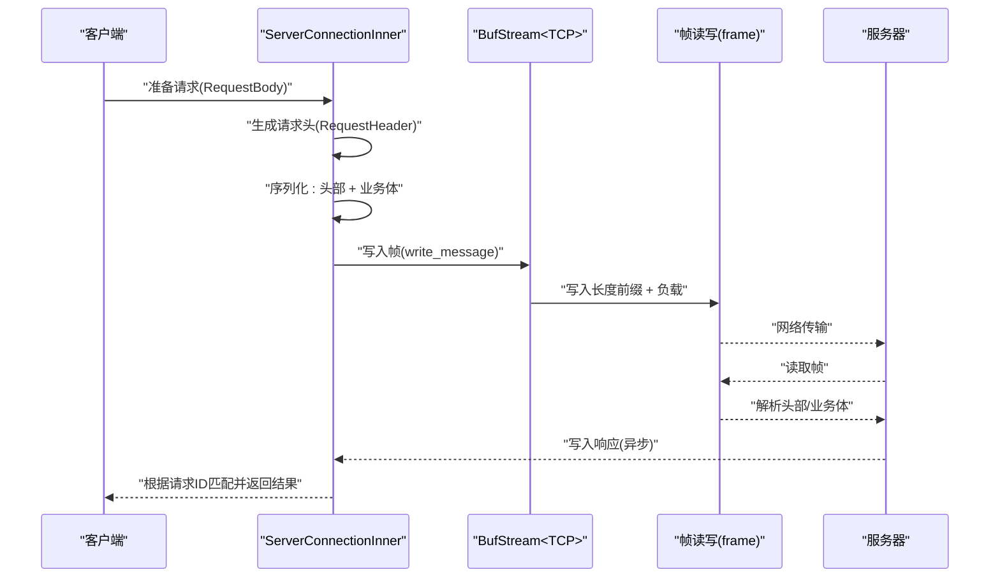
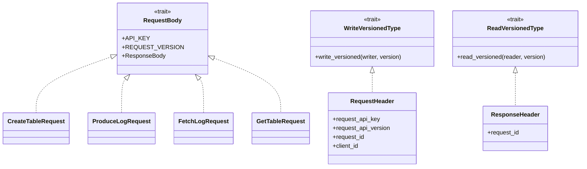
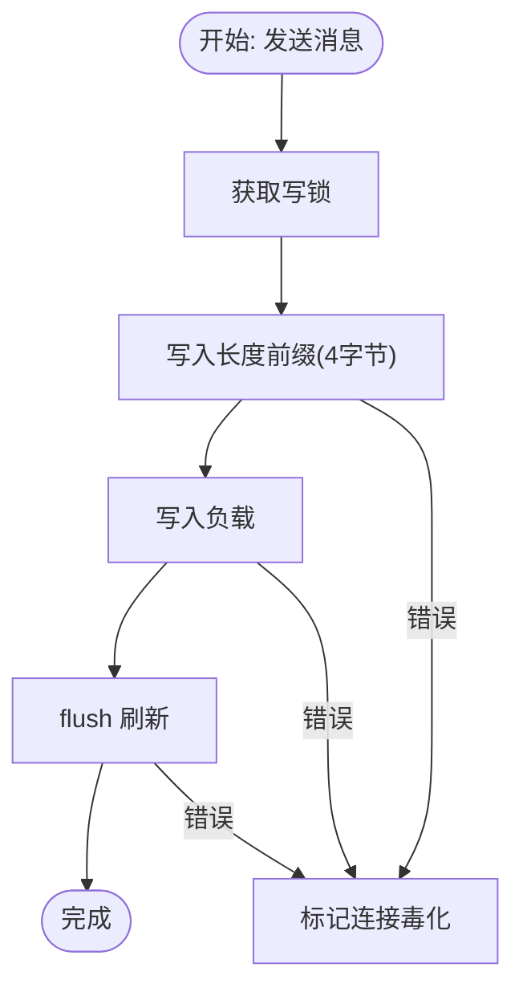
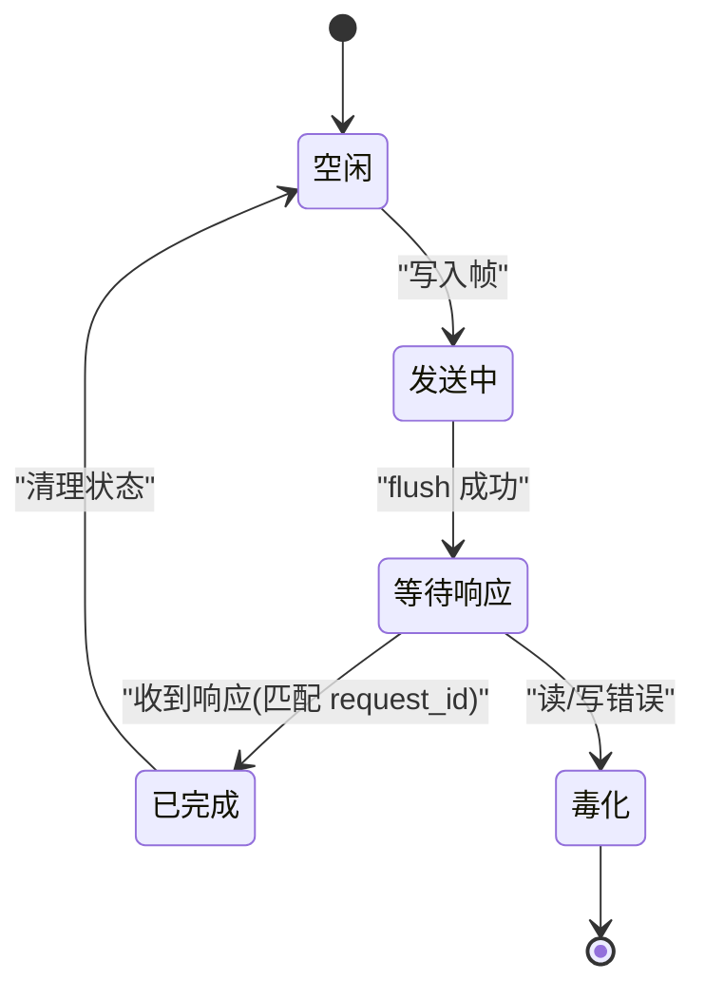
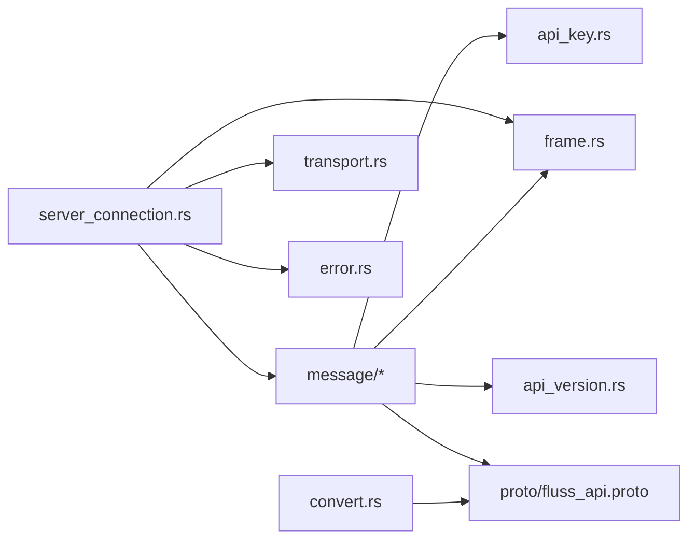

# RPC 通信 API

<cite>
**本文引用的文件**
- [crates/fluss/src/rpc/mod.rs](file://crates/fluss/src/rpc/mod.rs)
- [crates/fluss/src/rpc/api_key.rs](file://crates/fluss/src/rpc/api_key.rs)
- [crates/fluss/src/rpc/api_version.rs](file://crates/fluss/src/rpc/api_version.rs)
- [crates/fluss/src/rpc/message/mod.rs](file://crates/fluss/src/rpc/message/mod.rs)
- [crates/fluss/src/rpc/message/header.rs](file://crates/fluss/src/rpc/message/header.rs)
- [crates/fluss/src/rpc/message/create_table.rs](file://crates/fluss/src/rpc/message/create_table.rs)
- [crates/fluss/src/rpc/message/produce_log.rs](file://crates/fluss/src/rpc/message/produce_log.rs)
- [crates/fluss/src/rpc/message/fetch.rs](file://crates/fluss/src/rpc/message/fetch.rs)
- [crates/fluss/src/rpc/message/get_table.rs](file://crates/fluss/src/rpc/message/get_table.rs)
- [crates/fluss/src/rpc/frame.rs](file://crates/fluss/src/rpc/frame.rs)
- [crates/fluss/src/rpc/transport.rs](file://crates/fluss/src/rpc/transport.rs)
- [crates/fluss/src/rpc/server_connection.rs](file://crates/fluss/src/rpc/server_connection.rs)
- [crates/fluss/src/rpc/error.rs](file://crates/fluss/src/rpc/error.rs)
- [crates/fluss/src/rpc/convert.rs](file://crates/fluss/src/rpc/convert.rs)
- [crates/fluss/src/proto/fluss_api.proto](file://crates/fluss/src/proto/fluss_api.proto)
</cite>

## 目录
1. [简介](#简介)
2. [项目结构](#项目结构)
3. [核心组件](#核心组件)
4. [架构总览](#架构总览)
5. [详细组件分析](#详细组件分析)
6. [依赖关系分析](#依赖关系分析)
7. [性能与传输优化](#性能与传输优化)
8. [故障排查指南](#故障排查指南)
9. [结论](#结论)
10. [附录：RPC 调用示例与调试技巧](#附录rpc-调用示例与调试技巧)

## 简介
本文件系统化梳理 Fluss Rust 实现中的 RPC 通信 API，覆盖协议定义、消息编解码、传输层抽象、连接管理、版本与 API Key 管理、错误处理、以及协议升级与向后兼容策略。目标是帮助开发者快速理解并正确使用底层通信机制。

## 项目结构
RPC 子系统位于 crates/fluss/src/rpc 下，采用模块化设计：
- 协议与消息：api_key、api_version、message（含 header、各具体请求/响应类型）
- 传输与帧：frame（消息帧读写）、transport（TCP 传输封装）
- 连接与客户端：server_connection（连接池、请求-响应路由、取消安全发送）、error（统一错误模型）
- 编解码辅助：convert（PB 与内部类型转换）

图表来源
- [crates/fluss/src/rpc/mod.rs](file://crates/fluss/src/rpc/mod.rs#L18-L32)
- [crates/fluss/src/rpc/api_key.rs](file://crates/fluss/src/rpc/api_key.rs#L20-L55)
- [crates/fluss/src/rpc/api_version.rs](file://crates/fluss/src/rpc/api_version.rs#L18-L55)
- [crates/fluss/src/rpc/message/mod.rs](file://crates/fluss/src/rpc/message/mod.rs#L18-L98)
- [crates/fluss/src/rpc/message/header.rs](file://crates/fluss/src/rpc/message/header.rs#L32-L74)
- [crates/fluss/src/rpc/message/create_table.rs](file://crates/fluss/src/rpc/message/create_table.rs#L32-L63)
- [crates/fluss/src/rpc/message/produce_log.rs](file://crates/fluss/src/rpc/message/produce_log.rs#L31-L72)
- [crates/fluss/src/rpc/message/fetch.rs](file://crates/fluss/src/rpc/message/fetch.rs#L35-L57)
- [crates/fluss/src/rpc/message/get_table.rs](file://crates/fluss/src/rpc/message/get_table.rs#L29-L55)
- [crates/fluss/src/rpc/frame.rs](file://crates/fluss/src/rpc/frame.rs#L34-L107)
- [crates/fluss/src/rpc/transport.rs](file://crates/fluss/src/rpc/transport.rs#L26-L84)
- [crates/fluss/src/rpc/server_connection.rs](file://crates/fluss/src/rpc/server_connection.rs#L46-L403)
- [crates/fluss/src/rpc/error.rs](file://crates/fluss/src/rpc/error.rs#L23-L51)
- [crates/fluss/src/rpc/convert.rs](file://crates/fluss/src/rpc/convert.rs#L22-L44)
- [crates/fluss/src/proto/fluss_api.proto](file://crates/fluss/src/proto/fluss_api.proto#L22-L197)

章节来源
- [crates/fluss/src/rpc/mod.rs](file://crates/fluss/src/rpc/mod.rs#L18-L32)

## 核心组件
- API Key 与版本管理
  - API Key：用于标识请求类型，支持已知枚举与未知回退。
  - 版本：以 ApiVersion 包装 i16，提供最小/最大版本范围与显示格式。
- 消息与头部
  - 请求头包含 API Key、版本、请求 ID、可选客户端 ID；响应头包含请求 ID。
  - 所有消息实现版本化读写 trait，便于扩展多版本。
- 帧与传输
  - 帧：固定长度前缀（i32 大端）+ 负载；读写均带大小限制与错误处理。
  - 传输：当前为 TCP，封装为异步读写器，支持超时连接。
- 连接与客户端
  - RpcClient 维护按服务节点的连接池；ServerConnectionInner 负责请求-响应路由、取消安全发送、流毒化处理。
- 错误模型
  - 统一 RpcError，覆盖写入/读取帧错误、连接错误、流毒化、数据未完全读取等。

章节来源
- [crates/fluss/src/rpc/api_key.rs](file://crates/fluss/src/rpc/api_key.rs#L20-L55)
- [crates/fluss/src/rpc/api_version.rs](file://crates/fluss/src/rpc/api_version.rs#L18-L55)
- [crates/fluss/src/rpc/message/header.rs](file://crates/fluss/src/rpc/message/header.rs#L32-L74)
- [crates/fluss/src/rpc/message/mod.rs](file://crates/fluss/src/rpc/message/mod.rs#L37-L98)
- [crates/fluss/src/rpc/frame.rs](file://crates/fluss/src/rpc/frame.rs#L34-L107)
- [crates/fluss/src/rpc/transport.rs](file://crates/fluss/src/rpc/transport.rs#L26-L84)
- [crates/fluss/src/rpc/server_connection.rs](file://crates/fluss/src/rpc/server_connection.rs#L46-L403)
- [crates/fluss/src/rpc/error.rs](file://crates/fluss/src/rpc/error.rs#L23-L51)

## 架构总览
下图展示从客户端到服务器的完整 RPC 流程：客户端构造请求消息（含请求头与业务体），通过 ServerConnection 发送，服务器异步读取并路由响应，最终返回给对应请求通道。

图表来源
- [crates/fluss/src/rpc/server_connection.rs](file://crates/fluss/src/rpc/server_connection.rs#L233-L287)
- [crates/fluss/src/rpc/frame.rs](file://crates/fluss/src/rpc/frame.rs#L93-L106)
- [crates/fluss/src/rpc/message/header.rs](file://crates/fluss/src/rpc/message/header.rs#L44-L73)

## 详细组件分析

### 协议与消息模型
- 请求/响应体
  - RequestBody：每个请求类型需声明 API_KEY、REQUEST_VERSION，并提供对应的 ResponseBody 类型。
  - 版本化读写：WriteVersionedType/ReadVersionedType，结合 ApiVersion 参数进行序列化/反序列化。
- 具体消息
  - 创建表：CreateTableRequest/Response
  - 写入日志：ProduceLogRequest/Response
  - 获取表：GetTableRequest/Response
  - 拉取日志：FetchLogRequest/Response
- PB 定义
  - 所有消息体基于 proto2 定义，包含表路径、分桶、分区、元数据等字段。

图表来源
- [crates/fluss/src/rpc/message/mod.rs](file://crates/fluss/src/rpc/message/mod.rs#L37-L98)
- [crates/fluss/src/rpc/message/header.rs](file://crates/fluss/src/rpc/message/header.rs#L32-L74)
- [crates/fluss/src/rpc/message/create_table.rs](file://crates/fluss/src/rpc/message/create_table.rs#L53-L63)
- [crates/fluss/src/rpc/message/produce_log.rs](file://crates/fluss/src/rpc/message/produce_log.rs#L62-L72)
- [crates/fluss/src/rpc/message/fetch.rs](file://crates/fluss/src/rpc/message/fetch.rs#L47-L57)
- [crates/fluss/src/rpc/message/get_table.rs](file://crates/fluss/src/rpc/message/get_table.rs#L47-L55)

章节来源
- [crates/fluss/src/rpc/message/mod.rs](file://crates/fluss/src/rpc/message/mod.rs#L37-L98)
- [crates/fluss/src/rpc/message/header.rs](file://crates/fluss/src/rpc/message/header.rs#L32-L74)
- [crates/fluss/src/proto/fluss_api.proto](file://crates/fluss/src/proto/fluss_api.proto#L22-L197)

### API Key 与版本管理
- API Key 映射
  - 已知键：CreateTable、ProduceLog、FetchLog、MetaData、GetTable
  - 未知键回退为 Unknown(i16)，便于兼容未知版本或扩展
- 版本范围
  - ApiVersionRange 提供最小/最大版本约束，便于服务端声明支持范围
- 使用场景
  - 请求头携带 API Key 与版本，服务端据此路由与解码

章节来源
- [crates/fluss/src/rpc/api_key.rs](file://crates/fluss/src/rpc/api_key.rs#L20-L55)
- [crates/fluss/src/rpc/api_version.rs](file://crates/fluss/src/rpc/api_version.rs#L18-L55)
- [crates/fluss/src/rpc/message/header.rs](file://crates/fluss/src/rpc/message/header.rs#L32-L42)

### 帧与传输层
- 帧格式
  - 固定 4 字节大端整数表示后续负载长度
  - 读取时校验负长度与超限，写入时校验超大消息
- 传输
  - Transport 封装 TcpStream，支持可选超时连接
  - ServerConnectionInner 将传输包装为 BufStream，拆分为读写半部并发处理
- 取消安全与流毒化
  - 发送过程包裹取消安全 Future，避免半发半收导致帧错位
  - 任一读/写错误会“毒化”连接，拒绝后续请求并通知所有活动请求

图表来源
- [crates/fluss/src/rpc/server_connection.rs](file://crates/fluss/src/rpc/server_connection.rs#L289-L312)
- [crates/fluss/src/rpc/frame.rs](file://crates/fluss/src/rpc/frame.rs#L93-L106)

章节来源
- [crates/fluss/src/rpc/frame.rs](file://crates/fluss/src/rpc/frame.rs#L34-L107)
- [crates/fluss/src/rpc/transport.rs](file://crates/fluss/src/rpc/transport.rs#L26-L84)
- [crates/fluss/src/rpc/server_connection.rs](file://crates/fluss/src/rpc/server_connection.rs#L147-L312)

### 连接管理与请求路由
- 连接池
  - RpcClient 维护 HashMap<server_id, ServerConnection>，按 ServerNode.uid() 复用连接
- 请求路由
  - 每个请求分配自增 request_id，写入请求头
  - 读循环异步读取帧，解析响应头，按 request_id 匹配并投递结果
- 取消安全与清理
  - CleanupRequestStateOnCancel 在取消时移除未发送的请求状态
  - CancellationSafeFuture 在取消时不中断发送，保证帧对齐

图表来源
- [crates/fluss/src/rpc/server_connection.rs](file://crates/fluss/src/rpc/server_connection.rs#L111-L145)
- [crates/fluss/src/rpc/server_connection.rs](file://crates/fluss/src/rpc/server_connection.rs#L233-L287)

章节来源
- [crates/fluss/src/rpc/server_connection.rs](file://crates/fluss/src/rpc/server_connection.rs#L46-L97)
- [crates/fluss/src/rpc/server_connection.rs](file://crates/fluss/src/rpc/server_connection.rs#L147-L312)

### 错误处理与协议升级
- 错误模型
  - 写/读帧错误、连接错误、IO 错误、连接毒化、数据未完全读取
- 升级与兼容
  - ApiVersion 与 ApiVersionRange 支持版本协商与范围声明
  - 请求头携带 API Key 与版本，服务端据此选择解码逻辑
  - 未知 API Key 保持 Unknown 回退，避免硬编码破坏兼容

章节来源
- [crates/fluss/src/rpc/error.rs](file://crates/fluss/src/rpc/error.rs#L23-L51)
- [crates/fluss/src/rpc/api_version.rs](file://crates/fluss/src/rpc/api_version.rs#L34-L55)
- [crates/fluss/src/rpc/message/header.rs](file://crates/fluss/src/rpc/message/header.rs#L32-L42)

## 依赖关系分析
- 模块耦合
  - message 依赖 api_key、api_version、frame 的读写 trait
  - server_connection 依赖 transport、frame、message 的 header 与具体请求/响应
  - error 作为统一错误源被 frame、server_connection 引用
- 外部依赖
  - tokio 异步运行时、BufStream、split、oneshot
  - prost/bytes 用于 PB 序列化与缓冲区操作
  - thiserror 提供错误派生宏

图表来源
- [crates/fluss/src/rpc/message/mod.rs](file://crates/fluss/src/rpc/message/mod.rs#L18-L36)
- [crates/fluss/src/rpc/server_connection.rs](file://crates/fluss/src/rpc/server_connection.rs#L23-L39)
- [crates/fluss/src/rpc/convert.rs](file://crates/fluss/src/rpc/convert.rs#L22-L44)
- [crates/fluss/src/proto/fluss_api.proto](file://crates/fluss/src/proto/fluss_api.proto#L18-L21)

章节来源
- [crates/fluss/src/rpc/mod.rs](file://crates/fluss/src/rpc/mod.rs#L18-L32)

## 性能与传输优化
- 连接复用
  - RpcClient 按服务节点 UID 复用连接，减少握手开销
- 非阻塞 I/O
  - BufStream + split 读写半部并发，提升吞吐
- 取消安全发送
  - CancellationSafeFuture 避免半发导致帧错位与资源泄漏
- 帧大小限制
  - 读写均限制最大消息大小，防止内存膨胀与 DoS
- 超时控制
  - Transport::connect 支持可选超时，避免长时间阻塞

章节来源
- [crates/fluss/src/rpc/server_connection.rs](file://crates/fluss/src/rpc/server_connection.rs#L64-L97)
- [crates/fluss/src/rpc/frame.rs](file://crates/fluss/src/rpc/frame.rs#L45-L77)
- [crates/fluss/src/rpc/transport.rs](file://crates/fluss/src/rpc/transport.rs#L67-L83)

## 故障排查指南
- 常见错误定位
  - 写入/读取帧错误：检查网络稳定性与消息大小限制
  - 连接毒化：查看是否有读/写错误导致流被毒化
  - 数据未完全读取：确认业务体是否完整解析
- 调试建议
  - 启用 tracing 日志，观察请求 ID 与响应匹配
  - 逐步缩小问题范围：先验证帧读写，再验证消息解析
  - 使用较小 max_message_size 排查异常大包

章节来源
- [crates/fluss/src/rpc/error.rs](file://crates/fluss/src/rpc/error.rs#L23-L51)
- [crates/fluss/src/rpc/server_connection.rs](file://crates/fluss/src/rpc/server_connection.rs#L172-L222)

## 结论
该 RPC 子系统以清晰的模块划分实现了稳定的异步通信：通过 API Key 与版本管理、严格的帧格式与大小限制、取消安全的发送与连接毒化处理，提供了高可靠与高性能的客户端-服务器通信能力。配合 PB 定义与转换工具，易于扩展新的消息类型并维持向前/向后兼容。

## 附录：RPC 调用示例与调试技巧
- 示例流程（创建表）
  1) 构造 CreateTableRequest（包含表路径、描述、忽略存在标志）
  2) 通过 RpcClient 获取 ServerConnection
  3) 调用 ServerConnectionInner::request 发送请求
  4) 等待响应并解析 CreateTableResponse
- 调试技巧
  - 使用较小 max_message_size 快速定位超大包
  - 观察请求 ID 是否与响应头一致
  - 若出现“数据剩余”错误，检查业务体解析边界
  - 对于连接失败，检查主机地址与超时设置

章节来源
- [crates/fluss/src/rpc/message/create_table.rs](file://crates/fluss/src/rpc/message/create_table.rs#L32-L63)
- [crates/fluss/src/rpc/server_connection.rs](file://crates/fluss/src/rpc/server_connection.rs#L233-L287)
- [crates/fluss/src/rpc/frame.rs](file://crates/fluss/src/rpc/frame.rs#L45-L77)