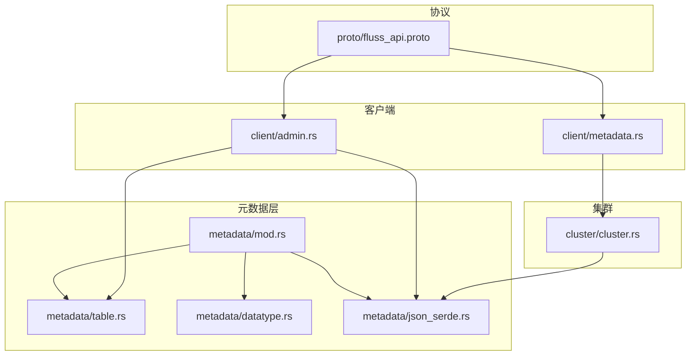
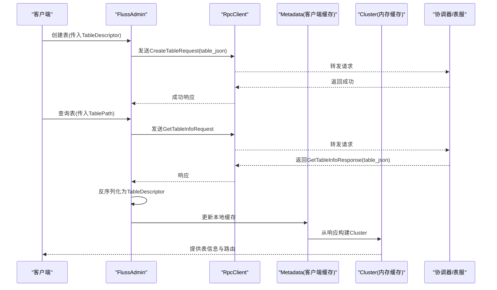
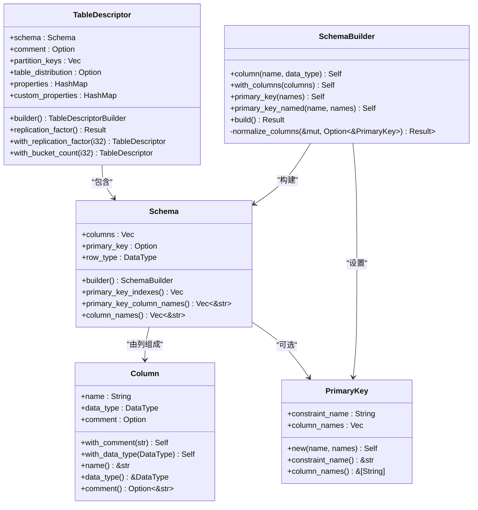
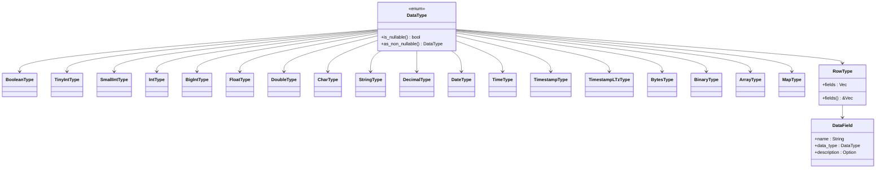
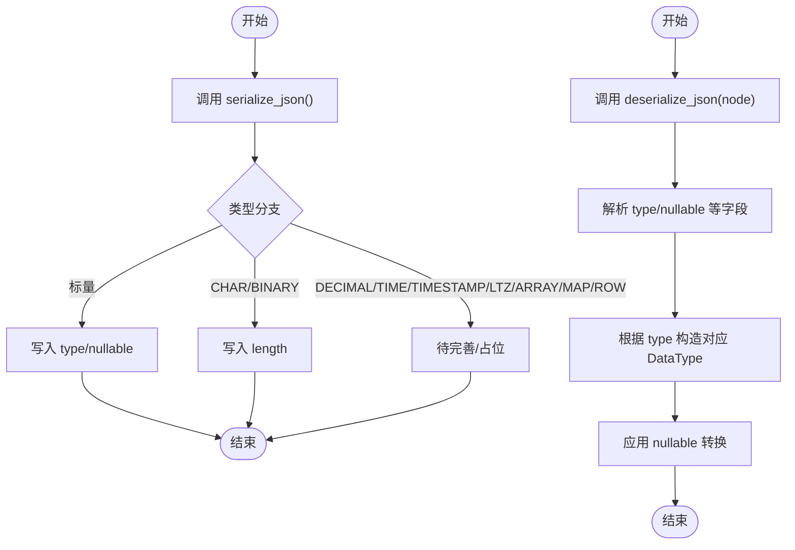
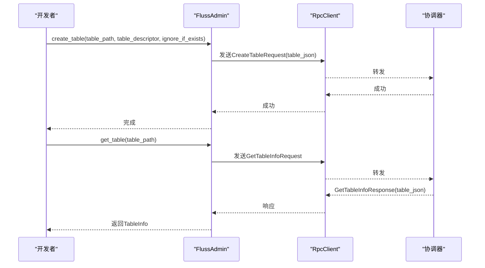
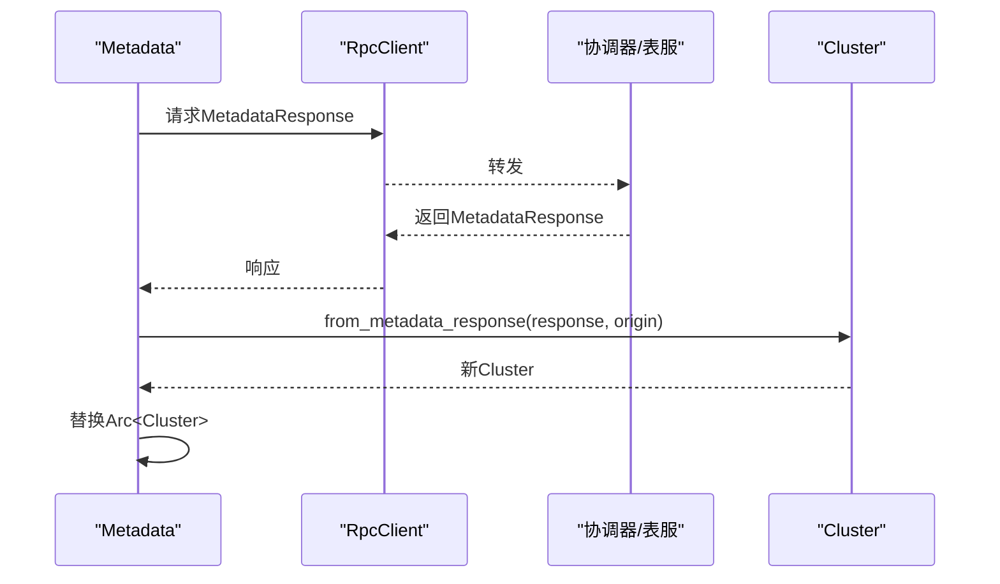
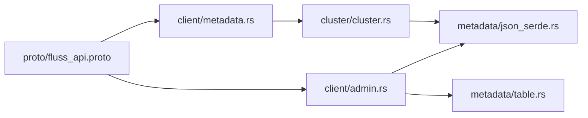

# 元数据 API

<cite>
**本文引用的文件**
- [crates/fluss/src/metadata/mod.rs](file://crates/fluss/src/metadata/mod.rs)
- [crates/fluss/src/metadata/table.rs](file://crates/fluss/src/metadata/table.rs)
- [crates/fluss/src/metadata/datatype.rs](file://crates/fluss/src/metadata/datatype.rs)
- [crates/fluss/src/metadata/json_serde.rs](file://crates/fluss/src/metadata/json_serde.rs)
- [crates/fluss/src/client/metadata.rs](file://crates/fluss/src/client/metadata.rs)
- [crates/fluss/src/client/admin.rs](file://crates/fluss/src/client/admin.rs)
- [crates/fluss/src/cluster/cluster.rs](file://crates/fluss/src/cluster/cluster.rs)
- [crates/fluss/src/proto/fluss_api.proto](file://crates/fluss/src/proto/fluss_api.proto)
- [crates/examples/src/example_table.rs](file://crates/examples/src/example_table.rs)
</cite>

## 目录
1. [简介](#简介)
2. [项目结构](#项目结构)
3. [核心组件](#核心组件)
4. [架构总览](#架构总览)
5. [详细组件分析](#详细组件分析)
6. [依赖关系分析](#依赖关系分析)
7. [性能考量](#性能考量)
8. [故障排查指南](#故障排查指南)
9. [结论](#结论)
10. [附录](#附录)

## 简介
本文件系统性地阐述 Fluss 元数据 API 的设计与实现，覆盖以下主题：
- 核心元数据结构：TableDescriptor、Schema、DataType 及其子类型（RowType、DataField 等）
- 数据类型系统的设计原则与可空性控制
- JSON 序列化与反序列化机制
- 元数据操作接口：创建、查询、更新、删除（基于现有实现的可用能力）
- 元数据缓存机制与一致性保证
- 数据类型转换规则与验证逻辑
- 实际使用示例与最佳实践

## 项目结构
元数据相关代码主要位于 crates/fluss/src/metadata 目录，配合客户端与集群模块共同完成元数据的构建、传输与缓存。

图表来源
- [crates/fluss/src/metadata/mod.rs](file://crates/fluss/src/metadata/mod.rs#L18-L25)
- [crates/fluss/src/metadata/table.rs](file://crates/fluss/src/metadata/table.rs#L1-L50)
- [crates/fluss/src/metadata/datatype.rs](file://crates/fluss/src/metadata/datatype.rs#L1-L30)
- [crates/fluss/src/metadata/json_serde.rs](file://crates/fluss/src/metadata/json_serde.rs#L1-L30)
- [crates/fluss/src/client/admin.rs](file://crates/fluss/src/client/admin.rs#L18-L32)
- [crates/fluss/src/client/metadata.rs](file://crates/fluss/src/client/metadata.rs#L18-L33)
- [crates/fluss/src/cluster/cluster.rs](file://crates/fluss/src/cluster/cluster.rs#L18-L39)
- [crates/fluss/src/proto/fluss_api.proto](file://crates/fluss/src/proto/fluss_api.proto#L22-L38)

章节来源
- [crates/fluss/src/metadata/mod.rs](file://crates/fluss/src/metadata/mod.rs#L18-L25)

## 核心组件
- TableDescriptor：表的完整元信息载体，包含 Schema、分区键、分桶策略、属性等
- Schema：表的字段集合与主键约束，支持通过 SchemaBuilder 构建与校验
- DataType：统一的数据类型体系，涵盖标量、数组、映射、行类型等
- DataField：行类型的字段定义，包含名称、类型与描述
- RowType：行类型容器，用于嵌套结构
- JsonSerde trait：为 DataType、Schema、TableDescriptor 提供 JSON 序列化/反序列化
- TableInfo：服务端返回的表信息对象，包含物理主键、分桶键、属性等
- TableBucket：表分桶定位标识
- TablePath：数据库与表名的组合路径

章节来源
- [crates/fluss/src/metadata/table.rs](file://crates/fluss/src/metadata/table.rs#L26-L921)
- [crates/fluss/src/metadata/datatype.rs](file://crates/fluss/src/metadata/datatype.rs#L21-L815)
- [crates/fluss/src/metadata/json_serde.rs](file://crates/fluss/src/metadata/json_serde.rs#L25-L465)

## 架构总览
下图展示客户端、集群与服务端之间的元数据交互流程，重点体现 JSON 序列化与缓存更新机制。

图表来源
- [crates/fluss/src/client/admin.rs](file://crates/fluss/src/client/admin.rs#L52-L92)
- [crates/fluss/src/client/metadata.rs](file://crates/fluss/src/client/metadata.rs#L35-L109)
- [crates/fluss/src/cluster/cluster.rs](file://crates/fluss/src/cluster/cluster.rs#L88-L171)
- [crates/fluss/src/proto/fluss_api.proto](file://crates/fluss/src/proto/fluss_api.proto#L117-L137)

## 详细组件分析

### TableDescriptor 与 Schema
- 表描述符包含：
  - schema：Schema 对象
  - partition_keys：分区键列表
  - table_distribution：分桶配置（可选）
  - properties/custom_properties：表级属性
  - comment：注释
- Schema 支持：
  - 通过 SchemaBuilder 构建，自动将 RowType 字段映射到列
  - 主键约束校验：重复列名、主键列必须存在于 Schema 中
  - 主键列自动去可空化（主键列不允许为空）
- 分布策略校验：
  - 分桶键不可包含分区键
  - 主键表的分桶键必须是主键集合去掉分区键后的子集
  - 默认分桶键：主键减去分区键；若为空则报错

图表来源
- [crates/fluss/src/metadata/table.rs](file://crates/fluss/src/metadata/table.rs#L26-L565)

章节来源
- [crates/fluss/src/metadata/table.rs](file://crates/fluss/src/metadata/table.rs#L93-L268)

### DataType 与 RowType/DataField
- DataType 统一表示所有数据类型，支持可空性标记
- 标量类型：布尔、整数、浮点、字符串、字节、日期时间、十进制等
- 复合类型：数组、映射、行类型 RowType
- RowType 由 DataField 列表构成，DataField 包含名称、类型与描述
- DataType 提供 is_nullable/as_non_nullable 等转换方法

图表来源
- [crates/fluss/src/metadata/datatype.rs](file://crates/fluss/src/metadata/datatype.rs#L21-L815)

章节来源
- [crates/fluss/src/metadata/datatype.rs](file://crates/fluss/src/metadata/datatype.rs#L21-L815)

### JSON 序列化与反序列化
- JsonSerde trait 定义 serialize_json/deserialize_json
- DataType/Schema/TableDescriptor 均实现了该 trait
- JSON 字段约定：
  - DataType：type、nullable、以及部分类型的 length 等
  - Schema：columns、primary_key、version
  - TableDescriptor：schema、comment、partition_key、bucket_key、bucket_count、properties、custom_properties、version
- 反序列化时对必需字段进行校验，缺失或类型不匹配会报错

图表来源
- [crates/fluss/src/metadata/json_serde.rs](file://crates/fluss/src/metadata/json_serde.rs#L25-L176)

章节来源
- [crates/fluss/src/metadata/json_serde.rs](file://crates/fluss/src/metadata/json_serde.rs#L25-L465)

### 元数据操作接口
- 创建表：FlussAdmin.create_table 将 TableDescriptor 序列化为 JSON 后发送给协调器
- 查询表：FlussAdmin.get_table 获取 GetTableInfoResponse，反序列化为 TableDescriptor 并生成 TableInfo
- 更新/删除：当前代码未提供显式的更新/删除接口；可通过扩展 RPC 消息与客户端方法实现

图表来源
- [crates/fluss/src/client/admin.rs](file://crates/fluss/src/client/admin.rs#L52-L92)
- [crates/fluss/src/proto/fluss_api.proto](file://crates/fluss/src/proto/fluss_api.proto#L117-L137)

章节来源
- [crates/fluss/src/client/admin.rs](file://crates/fluss/src/client/admin.rs#L52-L92)

### 元数据缓存机制与一致性
- 客户端缓存：Metadata 维护一个 RwLock<Arc<Cluster>>，支持并发读取
- 集群缓存：Cluster 内部维护表 ID/路径映射、表信息、可用分桶位置等
- 更新流程：
  - Metadata.update 接收 MetadataResponse，调用 Cluster::from_metadata_response 构建新 Cluster 并替换旧实例
  - 支持按需更新：check_and_update_table_metadata 仅在缓存中不存在时发起请求
- 一致性保证：
  - 通过原子替换 Arc<Cluster> 保证读取线程可见性
  - 服务端返回的 table_json 作为权威来源，客户端反序列化后重建 TableInfo

图表来源
- [crates/fluss/src/client/metadata.rs](file://crates/fluss/src/client/metadata.rs#L57-L109)
- [crates/fluss/src/cluster/cluster.rs](file://crates/fluss/src/cluster/cluster.rs#L88-L171)

章节来源
- [crates/fluss/src/client/metadata.rs](file://crates/fluss/src/client/metadata.rs#L35-L109)
- [crates/fluss/src/cluster/cluster.rs](file://crates/fluss/src/cluster/cluster.rs#L88-L171)

### 数据类型转换规则与验证逻辑
- 可空性转换：
  - as_non_nullable 将任意 DataType 转为非可空版本
  - 主键列在 SchemaBuilder.normalize_columns 中被强制非可空
- 主键约束：
  - 重复列名校验
  - 主键列必须存在于 Schema 中
- 分布策略：
  - 分桶键不可包含分区键
  - 主键表的分桶键必须是主键集合去掉分区键后的子集
  - 默认分桶键为主键减去分区键；若为空则报错
- JSON 反序列化：
  - 必需字段缺失时报错
  - 类型不匹配时报错

章节来源
- [crates/fluss/src/metadata/datatype.rs](file://crates/fluss/src/metadata/datatype.rs#L46-L94)
- [crates/fluss/src/metadata/table.rs](file://crates/fluss/src/metadata/table.rs#L217-L268)
- [crates/fluss/src/metadata/table.rs](file://crates/fluss/src/metadata/table.rs#L510-L564)
- [crates/fluss/src/metadata/json_serde.rs](file://crates/fluss/src/metadata/json_serde.rs#L133-L175)

### 实际操作示例与最佳实践
- 示例：创建表并写入/扫描数据
  - 使用 Schema::builder 与 DataTypes 构建 Schema
  - 使用 TableDescriptor::builder 构建表描述符
  - 通过 FlussAdmin.create_table 与 get_table 完成元数据生命周期管理
- 最佳实践：
  - 显式声明主键，避免后续分桶/分区策略冲突
  - 使用 SchemaBuilder 的 with_row_type 从 RowType 自动推导列
  - 在生产环境启用错误处理与重试策略
  - 使用 Metadata.check_and_update_table_metadata 避免不必要的网络往返

章节来源
- [crates/examples/src/example_table.rs](file://crates/examples/src/example_table.rs#L33-L53)
- [crates/fluss/src/client/admin.rs](file://crates/fluss/src/client/admin.rs#L52-L92)
- [crates/fluss/src/client/metadata.rs](file://crates/fluss/src/client/metadata.rs#L83-L94)

## 依赖关系分析

图表来源
- [crates/fluss/src/client/admin.rs](file://crates/fluss/src/client/admin.rs#L18-L32)
- [crates/fluss/src/client/metadata.rs](file://crates/fluss/src/client/metadata.rs#L18-L33)
- [crates/fluss/src/cluster/cluster.rs](file://crates/fluss/src/cluster/cluster.rs#L18-L26)
- [crates/fluss/src/metadata/json_serde.rs](file://crates/fluss/src/metadata/json_serde.rs#L25-L465)
- [crates/fluss/src/proto/fluss_api.proto](file://crates/fluss/src/proto/fluss_api.proto#L22-L38)

章节来源
- [crates/fluss/src/client/admin.rs](file://crates/fluss/src/client/admin.rs#L18-L32)
- [crates/fluss/src/client/metadata.rs](file://crates/fluss/src/client/metadata.rs#L18-L33)
- [crates/fluss/src/cluster/cluster.rs](file://crates/fluss/src/cluster/cluster.rs#L18-L26)
- [crates/fluss/src/metadata/json_serde.rs](file://crates/fluss/src/metadata/json_serde.rs#L25-L465)
- [crates/fluss/src/proto/fluss_api.proto](file://crates/fluss/src/proto/fluss_api.proto#L22-L38)

## 性能考量
- JSON 序列化/反序列化开销：建议在批量元数据更新时合并请求，减少序列化次数
- 缓存命中率：优先使用 Metadata.check_and_update_table_metadata 避免重复拉取
- 主键与分桶策略：合理设计主键与分区键，避免默认分桶键为空导致的错误
- 并发访问：RwLock 保障读多写少场景下的高吞吐

## 故障排查指南
- 常见错误与定位
  - 重复列名：SchemaBuilder.normalize_columns 报错
  - 主键列缺失：主键列不在 Schema 中时报错
  - 分桶键包含分区键：TableDescriptor.normalize_distribution 报错
  - JSON 字段缺失：JsonSerde::deserialize_json 报错
- 排查步骤
  - 打印 TableDescriptor/Schema 的 JSON 表达，确认字段完整性
  - 检查主键与分区键是否冲突
  - 校验 replication_factor 等属性是否可转换为整数

章节来源
- [crates/fluss/src/metadata/table.rs](file://crates/fluss/src/metadata/table.rs#L220-L268)
- [crates/fluss/src/metadata/table.rs](file://crates/fluss/src/metadata/table.rs#L510-L564)
- [crates/fluss/src/metadata/json_serde.rs](file://crates/fluss/src/metadata/json_serde.rs#L133-L175)

## 结论
本元数据 API 通过 TableDescriptor、Schema、DataType 与 JSON 序列化形成完整的表元数据建模与传输体系；结合客户端缓存与集群缓存，提供了高效一致的元数据访问能力。开发者可基于现有接口完成表的创建与查询，并遵循主键/分区/分桶策略的最佳实践，确保系统稳定运行。

## 附录
- 协议消息参考：MetadataRequest/MetadataResponse、CreateTableRequest/Response、GetTableInfoRequest/Response
- 示例程序展示了从构建元数据到写入/扫描的完整流程

章节来源
- [crates/fluss/src/proto/fluss_api.proto](file://crates/fluss/src/proto/fluss_api.proto#L22-L137)
- [crates/examples/src/example_table.rs](file://crates/examples/src/example_table.rs#L27-L86)