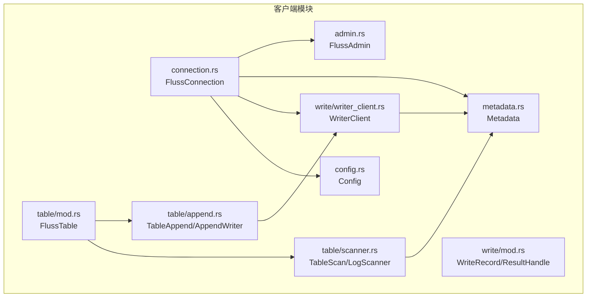
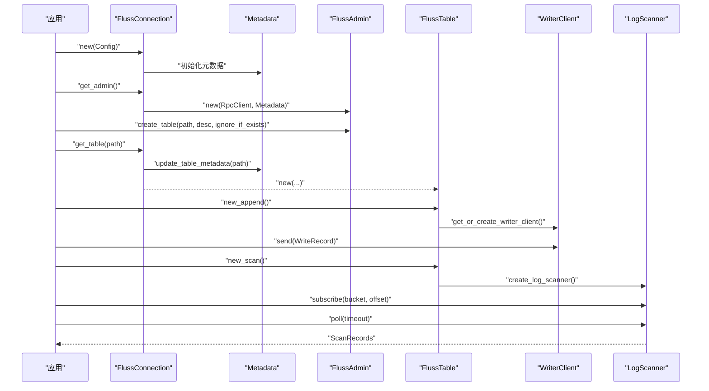
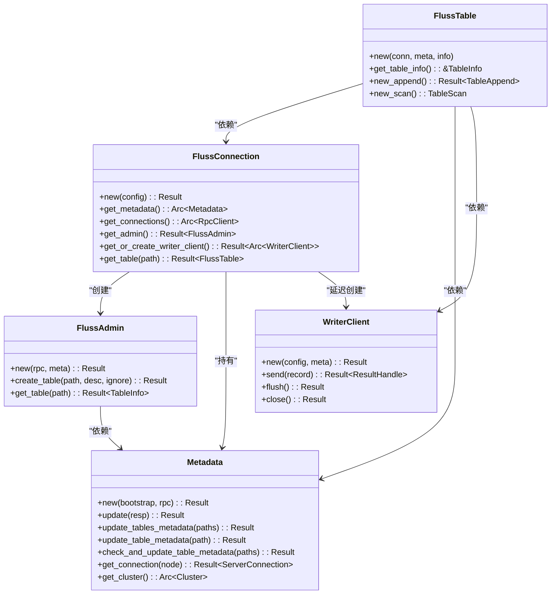

# 客户端 API

<cite>
**本文引用的文件**
- [lib.rs](file://crates/fluss/src/lib.rs)
- [connection.rs](file://crates/fluss/src/client/connection.rs)
- [admin.rs](file://crates/fluss/src/client/admin.rs)
- [metadata.rs](file://crates/fluss/src/client/metadata.rs)
- [table/mod.rs](file://crates/fluss/src/client/table/mod.rs)
- [append.rs](file://crates/fluss/src/client/table/append.rs)
- [scanner.rs](file://crates/fluss/src/client/table/scanner.rs)
- [writer.rs](file://crates/fluss/src/client/table/writer.rs)
- [write/mod.rs](file://crates/fluss/src/client/write/mod.rs)
- [writer_client.rs](file://crates/fluss/src/client/write/writer_client.rs)
- [config.rs](file://crates/fluss/src/config.rs)
- [example_table.rs](file://crates/examples/src/example_table.rs)
</cite>

## 目录
1. [简介](#简介)
2. [项目结构](#项目结构)
3. [核心组件](#核心组件)
4. [架构总览](#架构总览)
5. [详细组件分析](#详细组件分析)
6. [依赖关系分析](#依赖关系分析)
7. [性能考量](#性能考量)
8. [故障排查指南](#故障排查指南)
9. [结论](#结论)
10. [附录：使用示例与最佳实践](#附录使用示例与最佳实践)

## 简介
本文件系统性梳理 Fluss 客户端 API，覆盖 FlussConnection、FlussAdmin、FlussTable 及其配套写入/读取组件的公共接口与实现细节。内容包括：
- 类型与方法签名、参数与返回值说明
- 异常与错误处理策略
- 连接建立、表管理、数据写入与读取流程
- 生命周期管理与资源清理
- 常见使用模式与最佳实践

## 项目结构
客户端相关模块位于 crates/fluss/src/client 下，按职责划分为连接、元数据、管理（Admin）、表（Table）以及写入子系统（write）。顶层 lib.rs 暴露了关键模块入口。

图表来源
- [connection.rs](file://crates/fluss/src/client/connection.rs#L30-L82)
- [admin.rs](file://crates/fluss/src/client/admin.rs#L28-L93)
- [metadata.rs](file://crates/fluss/src/client/metadata.rs#L29-L109)
- [table/mod.rs](file://crates/fluss/src/client/table/mod.rs#L32-L67)
- [append.rs](file://crates/fluss/src/client/table/append.rs#L25-L70)
- [scanner.rs](file://crates/fluss/src/client/table/scanner.rs#L38-L108)
- [write/mod.rs](file://crates/fluss/src/client/write/mod.rs#L34-L69)
- [writer_client.rs](file://crates/fluss/src/client/write/writer_client.rs#L31-L147)
- [config.rs](file://crates/fluss/src/config.rs#L21-L39)

章节来源
- [lib.rs](file://crates/fluss/src/lib.rs#L18-L37)
- [connection.rs](file://crates/fluss/src/client/connection.rs#L18-L82)
- [config.rs](file://crates/fluss/src/config.rs#L21-L39)

## 核心组件
- FlussConnection：客户端入口，负责初始化元数据、维护网络连接、提供 Admin 与 Table 获取能力，并延迟创建 WriterClient。
- FlussAdmin：表管理能力封装，支持创建表与查询表信息。
- FlussTable：表级操作入口，提供 Append 写入与 Log 扫描能力。
- WriterClient：写入客户端，负责记录累积、批处理、发送与结果等待。
- Metadata：集群与表元数据缓存与更新，提供连接获取与一致性更新。
- 配置 Config：控制连接、请求大小、确认策略、重试次数等。

章节来源
- [connection.rs](file://crates/fluss/src/client/connection.rs#L30-L82)
- [admin.rs](file://crates/fluss/src/client/admin.rs#L28-L93)
- [metadata.rs](file://crates/fluss/src/client/metadata.rs#L29-L109)
- [table/mod.rs](file://crates/fluss/src/client/table/mod.rs#L32-L67)
- [writer_client.rs](file://crates/fluss/src/client/write/writer_client.rs#L31-L147)
- [config.rs](file://crates/fluss/src/config.rs#L21-L39)

## 架构总览
客户端整体交互如下：应用通过 FlussConnection 建立连接并获取 Admin/表；写入通过 FlussTable.new_append().create_writer() 获取 AppendWriter，委托 WriterClient 发送；读取通过 FlussTable.new_scan().create_log_scanner() 订阅桶并轮询日志。

图表来源
- [connection.rs](file://crates/fluss/src/client/connection.rs#L37-L81)
- [admin.rs](file://crates/fluss/src/client/admin.rs#L34-L92)
- [table/mod.rs](file://crates/fluss/src/client/table/mod.rs#L41-L66)
- [append.rs](file://crates/fluss/src/client/table/append.rs#L45-L69)
- [scanner.rs](file://crates/fluss/src/client/table/scanner.rs#L53-L107)
- [writer_client.rs](file://crates/fluss/src/client/write/writer_client.rs#L89-L141)

## 详细组件分析

### FlussConnection
- 职责
  - 初始化 RpcClient 与 Metadata
  - 提供 Admin 实例
  - 提供表实例（按需更新元数据）
  - 延迟创建并复用 WriterClient
- 关键方法
  - new(Config) -> Result<Self>
  - get_metadata() -> Arc<Metadata>
  - get_connections() -> Arc<RpcClient>
  - get_admin() -> Result<FlussAdmin>
  - get_or_create_writer_client() -> Result<Arc<WriterClient>>
  - get_table(&TablePath) -> Result<FlussTable<'_>>
- 异常
  - 元数据初始化失败、连接获取失败、WriterClient 创建失败均以 Result 返回
- 生命周期
  - 作为持有者，内部保存 Arc 化的 RpcClient 与 Metadata，随连接对象释放而释放
- 并发
  - WriterClient 缓存使用 RwLock<Option<Arc<...>>>，线程安全

章节来源
- [connection.rs](file://crates/fluss/src/client/connection.rs#L30-L82)

### FlussAdmin
- 职责
  - 通过协调者节点建立管理通道，执行表管理操作
- 关键方法
  - new(Arc<RpcClient>, Arc<Metadata>) -> Result<Self>
  - create_table(&TablePath, &TableDescriptor, bool) -> Result<()>
  - get_table(&TablePath) -> Result<TableInfo>
- 异常
  - 网络连接失败、请求发送失败、反序列化失败等
- 依赖
  - 使用 Metadata 获取协调者节点地址
  - 使用 RpcClient 与 ServerConnection 发送请求

章节来源
- [admin.rs](file://crates/fluss/src/client/admin.rs#L28-L93)

### Metadata
- 职责
  - 维护 Cluster 的 Arc 缓存
  - 从协调者或表节点拉取最新元数据并更新
- 关键方法
  - new(&str, Arc<RpcClient>) -> Result<Self>
  - update(MetadataResponse) -> Result<()>
  - update_tables_metadata(&HashSet<&TablePath>) -> Result<()>
  - update_table_metadata(&TablePath) -> Result<()>
  - check_and_update_table_metadata(&[TablePath]) -> Result<()>
  - get_connection(&ServerNode) -> Result<ServerConnection>
  - get_cluster() -> Arc<Cluster>
- 异常
  - 解析地址失败、RPC 请求失败、集群构建失败

章节来源
- [metadata.rs](file://crates/fluss/src/client/metadata.rs#L29-L109)

### FlussTable
- 职责
  - 表级操作入口，封装 Append 与 Log 扫描
- 关键方法
  - new(&FlussConnection, Arc<Metadata>, TableInfo) -> Self
  - get_table_info() -> &TableInfo
  - new_append() -> Result<TableAppend>
  - new_scan() -> TableScan<'_>
- 异常
  - new_append() 内部可能因 WriterClient 获取失败返回错误

章节来源
- [table/mod.rs](file://crates/fluss/src/client/table/mod.rs#L32-L67)

### TableAppend 与 AppendWriter
- 职责
  - 将 GenericRow 封装为 WriteRecord，交由 WriterClient 发送
- 关键方法
  - TableAppend::create_writer() -> AppendWriter
  - AppendWriter::append(GenericRow<'_>) -> Result<()>
  - AppendWriter::flush() -> Result<()>
- 异常
  - 发送与等待结果过程中可能失败

章节来源
- [append.rs](file://crates/fluss/src/client/table/append.rs#L25-L70)

### LogScanner（读取）
- 职责
  - 订阅指定桶，向对应 TabletServer 发送 Fetch 请求，聚合返回并维护偏移
- 关键方法
  - TableScan::create_log_scanner() -> LogScanner
  - LogScanner::subscribe(i32, i64) -> Result<()>（分配桶与起始偏移）
  - LogScanner::poll(Duration) -> Result<ScanRecords>
- 内部状态
  - LogScannerStatus：维护每个桶的偏移与水位线，公平调度可拉取桶
- 异常
  - 元数据不一致时会触发更新；RPC 失败、反序列化失败等

章节来源
- [scanner.rs](file://crates/fluss/src/client/table/scanner.rs#L38-L108)
- [scanner.rs](file://crates/fluss/src/client/table/scanner.rs#L111-L244)
- [scanner.rs](file://crates/fluss/src/client/table/scanner.rs#L246-L371)

### WriterClient（写入）
- 职责
  - 管理 RecordAccumulator、Sender 协程与 BucketAssigner
  - 提供发送与刷新接口
- 关键方法
  - new(Config, Arc<Metadata>) -> Result<Self>
  - send(&WriteRecord<'_>) -> Result<ResultHandle>
  - flush() -> Result<()>
  - close() -> Result<()>
- 配置项
  - writer_acks: "all" 或数字字符串
  - writer_retries: 最大重试次数
  - request_max_size: 最大请求大小
- 异常
  - 配置解析失败、发送协程关闭失败、结果等待失败

章节来源
- [writer_client.rs](file://crates/fluss/src/client/write/writer_client.rs#L31-L147)
- [config.rs](file://crates/fluss/src/config.rs#L21-L39)

### 写入基础设施（WriteRecord、ResultHandle）
- WriteRecord
  - 字段：row: GenericRow，table_path: Arc<TablePath>
  - 工厂：new(Arc<TablePath>, GenericRow) -> Self
- ResultHandle
  - 方法：wait() -> Result<BatchWriteResult, Error>，result(BatchWriteResult) -> Result<(), Error>
  - 语义：封装广播一次性接收器，统一错误包装

章节来源
- [write/mod.rs](file://crates/fluss/src/client/write/mod.rs#L34-L69)

### 抽象写入接口（可选）
- 接口定义
  - TableWriter：flush() -> Result<()>
  - AppendWriter：append(GenericRow) -> Result<()>
  - UpsertWriter：upsert(GenericRow) -> Result<()>，delete(GenericRow) -> Result<()>
- AbstractTableWriter
  - send(&WriteRecord) -> Result<()>（内部等待结果并转换错误）

章节来源
- [writer.rs](file://crates/fluss/src/client/table/writer.rs#L25-L89)

## 依赖关系分析
- FlussConnection 依赖 Config、Metadata、RpcClient、WriterClient
- FlussAdmin 依赖 RpcClient、Metadata、ServerConnection
- FlussTable 依赖 FlussConnection、Metadata、WriterClient
- WriterClient 依赖 Metadata、RecordAccumulator、Sender、BucketAssigner
- Metadata 依赖 Cluster、RpcClient、ServerConnection

图表来源
- [connection.rs](file://crates/fluss/src/client/connection.rs#L30-L82)
- [admin.rs](file://crates/fluss/src/client/admin.rs#L28-L50)
- [metadata.rs](file://crates/fluss/src/client/metadata.rs#L29-L109)
- [table/mod.rs](file://crates/fluss/src/client/table/mod.rs#L32-L67)
- [writer_client.rs](file://crates/fluss/src/client/write/writer_client.rs#L31-L77)

## 性能考量
- 批处理与累积
  - WriterClient 内部使用 RecordAccumulator，支持批量发送与延迟刷新，减少 RPC 次数
- 分桶与粘性分配
  - 默认使用粘性分桶分配器，降低跨桶切换成本
- 轮询与背压
  - LogScanner 维护每个桶的偏移与高水位，公平调度可拉取桶，避免饥饿
- 超时与限流
  - 读取侧设置最大/最小拉取字节与等待时间，平衡吞吐与延迟

## 故障排查指南
- 连接失败
  - 检查 Config.bootstrap_server 是否正确；确认 Metadata::new 能成功连接协调者
- 元数据不同步
  - 使用 Metadata::check_and_update_table_metadata 或 Table 的 get_table 流程触发更新
- 写入无响应
  - 确认 WriterClient::send 返回的 ResultHandle 已被 await；检查 writer_retries 与 writer_acks 配置
- 读取不到数据
  - 确认已调用 LogScanner::subscribe 指定正确的桶与起始偏移；检查高水位是否推进
- 资源泄漏
  - 确保在退出前调用 WriterClient::close 以优雅关闭发送协程

章节来源
- [metadata.rs](file://crates/fluss/src/client/metadata.rs#L78-L94)
- [writer_client.rs](file://crates/fluss/src/client/write/writer_client.rs#L125-L141)
- [scanner.rs](file://crates/fluss/src/client/table/scanner.rs#L95-L107)

## 结论
Fluss 客户端 API 采用清晰的分层设计：FlussConnection 作为入口，FlussAdmin 负责表管理，FlussTable 提供读写抽象，WriterClient 负责高性能写入，Metadata 保障元数据一致性。通过配置化参数与异步模型，既保证易用性也兼顾性能与可靠性。

## 附录：使用示例与最佳实践
- 基本流程
  - 创建 Config 并设置 bootstrap_server
  - 通过 FlussConnection::new 建立连接
  - 使用 FlussAdmin 创建/查询表
  - 通过 FlussConnection::get_table 获取表实例
  - 使用 TableAppend 写入多条记录并 flush
  - 使用 LogScanner 订阅桶并轮询读取
- 示例参考
  - 完整示例可参考示例程序，包含建表、写入、扫描的完整流程

章节来源
- [example_table.rs](file://crates/examples/src/example_table.rs#L27-L86)