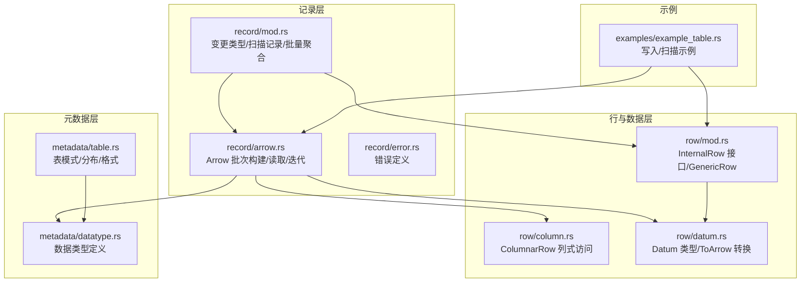
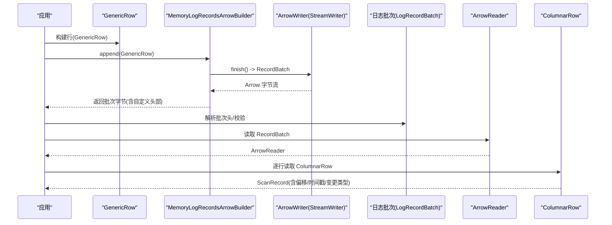
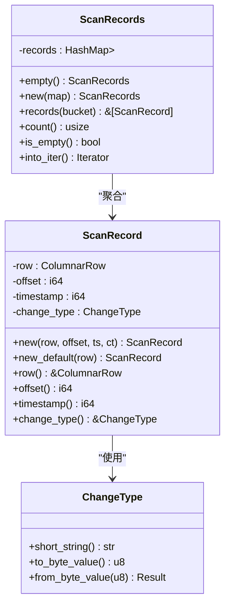
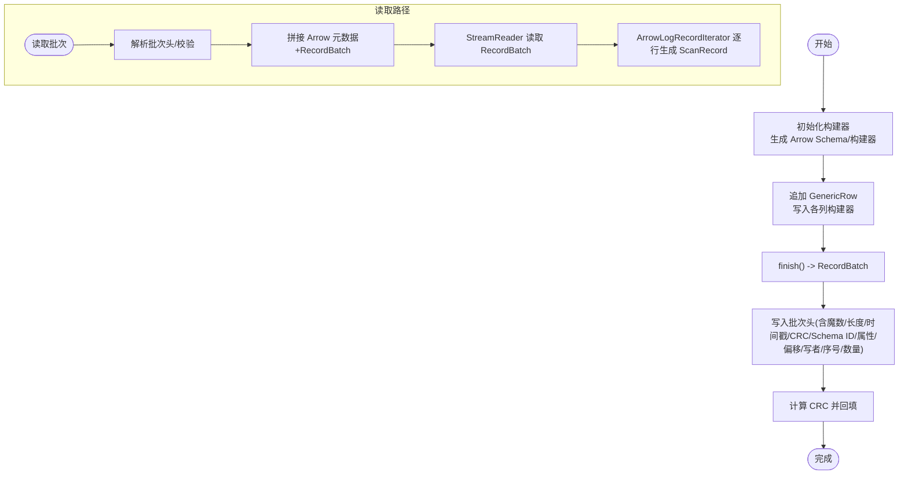
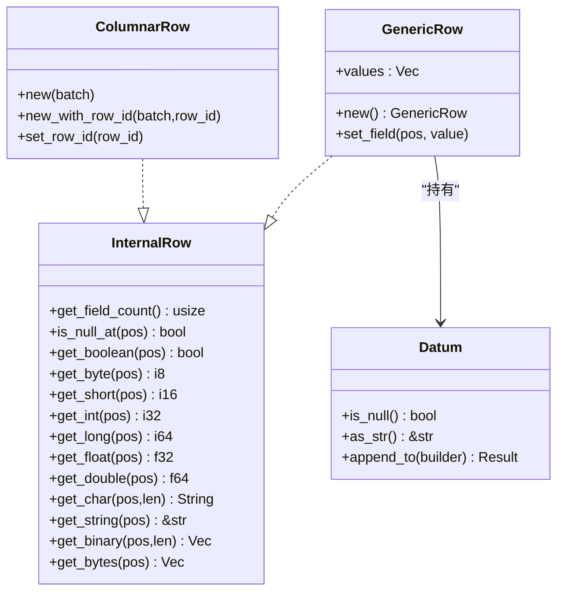
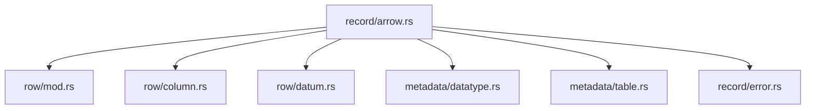
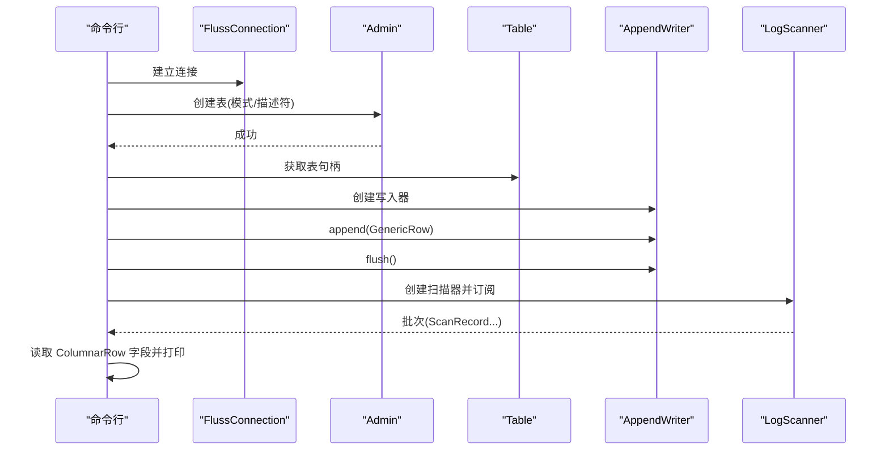

# 记录 API

<cite>
**本文引用的文件**
- [crates/fluss/src/record/mod.rs](file://crates/fluss/src/record/mod.rs)
- [crates/fluss/src/record/arrow.rs](file://crates/fluss/src/record/arrow.rs)
- [crates/fluss/src/record/error.rs](file://crates/fluss/src/record/error.rs)
- [crates/fluss/src/row/mod.rs](file://crates/fluss/src/row/mod.rs)
- [crates/fluss/src/row/column.rs](file://crates/fluss/src/row/column.rs)
- [crates/fluss/src/row/datum.rs](file://crates/fluss/src/row/datum.rs)
- [crates/fluss/src/metadata/datatype.rs](file://crates/fluss/src/metadata/datatype.rs)
- [crates/fluss/src/metadata/table.rs](file://crates/fluss/src/metadata/table.rs)
- [crates/examples/src/example_table.rs](file://crates/examples/src/example_table.rs)
</cite>

## 目录
1. [简介](#简介)
2. [项目结构](#项目结构)
3. [核心组件](#核心组件)
4. [架构总览](#架构总览)
5. [组件详解](#组件详解)
6. [依赖关系分析](#依赖关系分析)
7. [性能与内存管理](#性能与内存管理)
8. [故障排查指南](#故障排查指南)
9. [结论](#结论)
10. [附录：使用示例与最佳实践](#附录使用示例与最佳实践)

## 简介
本文件系统性梳理 Fluss 记录处理 API，重点覆盖以下方面：
- Arrow 格式支持与记录批次序列化/反序列化机制
- GenericRow 数据结构与 Row 操作接口
- 列式存储（ColumnarRow）的优势与使用场景
- 数据类型映射、空值处理与错误处理策略
- 记录构建、访问与修改的完整流程
- 内存管理与性能优化建议
- 数据验证规则与约束条件
- 实际示例与常见问题解决方案

## 项目结构
记录处理相关的核心模块位于 crates/fluss/src 下，主要涉及 record、row、metadata 三个子模块，并通过示例程序展示如何在真实场景中使用。

**图表来源**
- [crates/fluss/src/record/mod.rs](file://crates/fluss/src/record/mod.rs#L1-L175)
- [crates/fluss/src/record/arrow.rs](file://crates/fluss/src/record/arrow.rs#L1-L546)
- [crates/fluss/src/row/mod.rs](file://crates/fluss/src/row/mod.rs#L1-L149)
- [crates/fluss/src/row/column.rs](file://crates/fluss/src/row/column.rs#L1-L170)
- [crates/fluss/src/row/datum.rs](file://crates/fluss/src/row/datum.rs#L1-L288)
- [crates/fluss/src/metadata/datatype.rs](file://crates/fluss/src/metadata/datatype.rs#L1-L815)
- [crates/fluss/src/metadata/table.rs](file://crates/fluss/src/metadata/table.rs#L1-L921)
- [crates/examples/src/example_table.rs](file://crates/examples/src/example_table.rs#L1-L87)

**章节来源**
- [crates/fluss/src/record/mod.rs](file://crates/fluss/src/record/mod.rs#L1-L175)
- [crates/fluss/src/record/arrow.rs](file://crates/fluss/src/record/arrow.rs#L1-L546)
- [crates/fluss/src/row/mod.rs](file://crates/fluss/src/row/mod.rs#L1-L149)
- [crates/fluss/src/row/column.rs](file://crates/fluss/src/row/column.rs#L1-L170)
- [crates/fluss/src/row/datum.rs](file://crates/fluss/src/row/datum.rs#L1-L288)
- [crates/fluss/src/metadata/datatype.rs](file://crates/fluss/src/metadata/datatype.rs#L1-L815)
- [crates/fluss/src/metadata/table.rs](file://crates/fluss/src/metadata/table.rs#L1-L921)
- [crates/examples/src/example_table.rs](file://crates/examples/src/example_table.rs#L1-L87)

## 核心组件
- 变更类型与扫描记录
  - 变更类型枚举用于标识记录的插入/更新/删除等语义，支持短字符串与字节值互转。
  - 扫描记录封装了列式行、偏移量、时间戳与变更类型，便于上层消费。
  - 扫描记录集合按分桶组织，提供计数、判空与迭代能力。
- Arrow 批次与日志头
  - 提供 Arrow 批次构建器，将 GenericRow 写入 Arrow 数组构建器，最终序列化为带自定义头部的日志批次。
  - 日志批次包含基础偏移、长度、魔数、提交时间戳、CRC 校验、Schema ID、属性、最后偏移增量、写者 ID、批次序号、记录数量等字段。
  - 提供批次解析器与迭代器，从日志批次中读取 Arrow RecordBatch 并逐行生成 ScanRecord。
- 行接口与数据类型
  - InternalRow 定义统一的行访问接口，覆盖布尔、整型、浮点、字符串、二进制等读取方法。
  - GenericRow 是基于 Datum 的行实现，支持字段设置与类型转换。
  - Datum 支持多种标量类型与 Blob，提供 ToArrow trait 将 Datum 写入 Arrow 构建器。
  - ColumnarRow 基于 Arrow RecordBatch 提供列式访问，支持空值判断与多类型读取。

**章节来源**
- [crates/fluss/src/record/mod.rs](file://crates/fluss/src/record/mod.rs#L28-L175)
- [crates/fluss/src/record/arrow.rs](file://crates/fluss/src/record/arrow.rs#L43-L230)
- [crates/fluss/src/row/mod.rs](file://crates/fluss/src/row/mod.rs#L26-L149)
- [crates/fluss/src/row/datum.rs](file://crates/fluss/src/row/datum.rs#L37-L169)
- [crates/fluss/src/row/column.rs](file://crates/fluss/src/row/column.rs#L25-L170)

## 架构总览
下图展示了从应用写入 GenericRow 到 Arrow 序列化、再到日志批次读取与列式访问的整体流程。

**图表来源**
- [crates/fluss/src/record/arrow.rs](file://crates/fluss/src/record/arrow.rs#L127-L211)
- [crates/fluss/src/record/arrow.rs](file://crates/fluss/src/record/arrow.rs#L367-L400)
- [crates/fluss/src/row/column.rs](file://crates/fluss/src/row/column.rs#L50-L170)

## 组件详解

### 变更类型与扫描记录
- 变更类型
  - 支持 AppendOnly、Insert、UpdateBefore、UpdateAfter、Delete。
  - 提供短字符串表示与字节值互转，便于序列化与协议兼容。
- 扫描记录
  - 包含列式行、偏移量、时间戳、变更类型。
  - 提供构造函数与只读访问器，便于下游消费者统一处理。
- 扫描记录集合
  - 按分桶组织，支持计数、判空与迭代。

**图表来源**
- [crates/fluss/src/record/mod.rs](file://crates/fluss/src/record/mod.rs#L28-L175)

**章节来源**
- [crates/fluss/src/record/mod.rs](file://crates/fluss/src/record/mod.rs#L28-L175)

### Arrow 批次构建与读取
- 批次构建器
  - 依据表的 DataType 生成 Arrow Schema，并为每个字段创建对应的 ArrayBuilder。
  - 追加 GenericRow 时，遍历字段并将 Datum 写入对应构建器。
  - build() 时先写出 Arrow RecordBatch 的头部元数据，再写入 RecordBatch，最后计算并回填 CRC。
- 日志批次解析
  - 通过偏移与长度定位批次，读取批次头字段并进行校验。
  - 从批次中提取 Arrow 元数据与 RecordBatch 数据，组合后由 StreamReader 读取。
- 迭代器
  - ArrowLogRecordIterator 基于 ArrowReader 逐行读取，生成 ScanRecord，包含 base_offset、timestamp、change_type。

**图表来源**
- [crates/fluss/src/record/arrow.rs](file://crates/fluss/src/record/arrow.rs#L92-L230)
- [crates/fluss/src/record/arrow.rs](file://crates/fluss/src/record/arrow.rs#L280-L400)
- [crates/fluss/src/record/arrow.rs](file://crates/fluss/src/record/arrow.rs#L487-L544)

**章节来源**
- [crates/fluss/src/record/arrow.rs](file://crates/fluss/src/record/arrow.rs#L92-L230)
- [crates/fluss/src/record/arrow.rs](file://crates/fluss/src/record/arrow.rs#L280-L400)
- [crates/fluss/src/record/arrow.rs](file://crates/fluss/src/record/arrow.rs#L487-L544)

### 行接口与数据类型
- InternalRow 接口
  - 统一的字段计数、空值判断与多类型读取方法，便于不同行实现复用。
- GenericRow
  - 基于 Datum 的可变行，支持 set_field 设置指定位置的值。
- Datum 与 ToArrow
  - Datum 支持 Null、Bool、Int16/32/64、Float64、String、Blob、Decimal、Date、Timestamp、TimestampTz 等。
  - ToArrow trait 将 Datum 写入 Arrow 构建器，实现类型安全的序列化。
- ColumnarRow
  - 基于 Arrow RecordBatch 的列式访问，支持空值判断与多类型读取，性能优异。

**图表来源**
- [crates/fluss/src/row/mod.rs](file://crates/fluss/src/row/mod.rs#L26-L149)
- [crates/fluss/src/row/datum.rs](file://crates/fluss/src/row/datum.rs#L37-L169)
- [crates/fluss/src/row/column.rs](file://crates/fluss/src/row/column.rs#L25-L170)

**章节来源**
- [crates/fluss/src/row/mod.rs](file://crates/fluss/src/row/mod.rs#L26-L149)
- [crates/fluss/src/row/datum.rs](file://crates/fluss/src/row/datum.rs#L37-L169)
- [crates/fluss/src/row/column.rs](file://crates/fluss/src/row/column.rs#L25-L170)

### 数据类型映射与元数据
- 数据类型定义
  - DataType 覆盖布尔、整型、浮点、字符、字符串、十进制、日期、时间、时间戳、字节、二进制、数组、映射、行等。
  - 每个类型支持可空性标记与部分类型的额外参数（如精度、长度）。
- 类型到 Arrow 的映射
  - to_arrow_type 将 Fluss 数据类型映射为 Arrow DataType，用于批次构建与读取。
- 表模式与分布
  - Schema 定义列、主键与行类型；TableDescriptor 描述表的属性、分区与分桶策略；LogFormat/KvFormat 控制日志与键值格式。

**图表来源**
- [crates/fluss/src/metadata/datatype.rs](file://crates/fluss/src/metadata/datatype.rs#L24-L44)
- [crates/fluss/src/metadata/datatype.rs](file://crates/fluss/src/metadata/datatype.rs#L425-L447)
- [crates/fluss/src/record/arrow.rs](file://crates/fluss/src/record/arrow.rs#L402-L423)

**章节来源**
- [crates/fluss/src/metadata/datatype.rs](file://crates/fluss/src/metadata/datatype.rs#L24-L44)
- [crates/fluss/src/metadata/datatype.rs](file://crates/fluss/src/metadata/datatype.rs#L425-L447)
- [crates/fluss/src/record/arrow.rs](file://crates/fluss/src/record/arrow.rs#L402-L423)

## 依赖关系分析
- record/arrow.rs 依赖：
  - row::GenericRow、row::ColumnarRow、metadata::DataType
  - Arrow 的 RecordBatch、StreamWriter、StreamReader
  - 自定义错误类型 Result
- row/mod.rs 与 row/datum.rs 协作，提供行接口与 Datum 类型系统
- metadata/datatype.rs 与 metadata/table.rs 为 record/arrow.rs 提供类型与表结构信息

**图表来源**
- [crates/fluss/src/record/arrow.rs](file://crates/fluss/src/record/arrow.rs#L1-L50)
- [crates/fluss/src/row/mod.rs](file://crates/fluss/src/row/mod.rs#L1-L25)
- [crates/fluss/src/row/column.rs](file://crates/fluss/src/row/column.rs#L1-L25)
- [crates/fluss/src/row/datum.rs](file://crates/fluss/src/row/datum.rs#L1-L31)
- [crates/fluss/src/metadata/datatype.rs](file://crates/fluss/src/metadata/datatype.rs#L1-L44)
- [crates/fluss/src/metadata/table.rs](file://crates/fluss/src/metadata/table.rs#L1-L44)
- [crates/fluss/src/record/error.rs](file://crates/fluss/src/record/error.rs#L1-L28)

**章节来源**
- [crates/fluss/src/record/arrow.rs](file://crates/fluss/src/record/arrow.rs#L1-L50)
- [crates/fluss/src/row/mod.rs](file://crates/fluss/src/row/mod.rs#L1-L25)
- [crates/fluss/src/row/column.rs](file://crates/fluss/src/row/column.rs#L1-L25)
- [crates/fluss/src/row/datum.rs](file://crates/fluss/src/row/datum.rs#L1-L31)
- [crates/fluss/src/metadata/datatype.rs](file://crates/fluss/src/metadata/datatype.rs#L1-L44)
- [crates/fluss/src/metadata/table.rs](file://crates/fluss/src/metadata/table.rs#L1-L44)
- [crates/fluss/src/record/error.rs](file://crates/fluss/src/record/error.rs#L1-L28)

## 性能与内存管理
- 列式存储优势
  - ColumnarRow 基于 Arrow RecordBatch，具备向量化读取、压缩友好、SIMD 友好等特性，适合 OLAP 场景。
- 批处理与缓冲
  - MemoryLogRecordsArrowBuilder 在达到默认最大记录数时触发批次输出，减少频繁分配。
- 内存与拷贝
  - Arrow 的数组构建器在 finish() 后返回共享引用，避免不必要的复制。
  - 日志批次构建时先写入头部占位，再回填 CRC，减少二次写入成本。
- 错误与边界
  - 类型转换失败或不匹配会返回错误，避免运行时崩溃；建议在上游严格校验数据类型。

[本节为通用性能建议，无需列出具体文件来源]

## 故障排查指南
- 常见错误来源
  - 类型不匹配：Datum 与 Arrow 构建器类型不一致导致转换失败。
  - 校验失败：日志批次 CRC 不一致或长度不足。
  - 未知字节值：变更类型字节值不在支持范围内。
- 定位建议
  - 检查 to_arrow_type 映射是否覆盖目标类型。
  - 校验批次头字段与长度，确认 CRC 计算范围正确。
  - 使用示例中的写入/扫描流程对比，逐步缩小问题范围。

**章节来源**
- [crates/fluss/src/record/arrow.rs](file://crates/fluss/src/record/arrow.rs#L314-L323)
- [crates/fluss/src/record/arrow.rs](file://crates/fluss/src/record/arrow.rs#L69-L78)
- [crates/fluss/src/row/datum.rs](file://crates/fluss/src/row/datum.rs#L171-L187)
- [crates/fluss/src/record/error.rs](file://crates/fluss/src/record/error.rs#L21-L28)

## 结论
该记录处理 API 以 Arrow 为核心，结合 GenericRow 与 ColumnarRow，实现了高性能的列式数据处理链路。通过统一的行接口、类型映射与批次序列化/反序列化机制，开发者可以高效地构建、传输与消费记录。配合严格的错误处理与数据验证，能够在复杂场景中保持稳定性与一致性。

[本节为总结性内容，无需列出具体文件来源]

## 附录：使用示例与最佳实践

### 示例：写入与扫描记录
- 示例程序展示了如何：
  - 构建表模式与描述符
  - 创建表
  - 写入两条 GenericRow
  - 订阅日志并逐条读取 ColumnarRow，打印字段与偏移

**图表来源**
- [crates/examples/src/example_table.rs](file://crates/examples/src/example_table.rs#L27-L87)

**章节来源**
- [crates/examples/src/example_table.rs](file://crates/examples/src/example_table.rs#L27-L87)

### 最佳实践
- 数据类型选择
  - 优先使用 Arrow 支持的标量类型；对于字符串与二进制，注意长度与可空性配置。
- 空值处理
  - 使用 ColumnarRow 的 is_null_at 判断空值，避免直接读取引发异常。
- 批处理大小
  - 合理设置批次大小，平衡吞吐与延迟；利用默认最大记录阈值自动分批。
- 错误处理
  - 对类型转换、批次校验与 IO 异常进行捕获与重试，保证作业健壮性。
- 性能优化
  - 复用 Arrow Schema 与构建器实例，减少重复分配。
  - 使用列式访问接口进行批量处理，避免逐字段循环。

[本节为通用实践建议，无需列出具体文件来源]