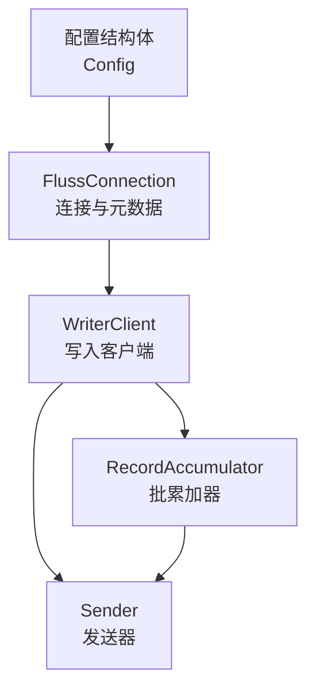
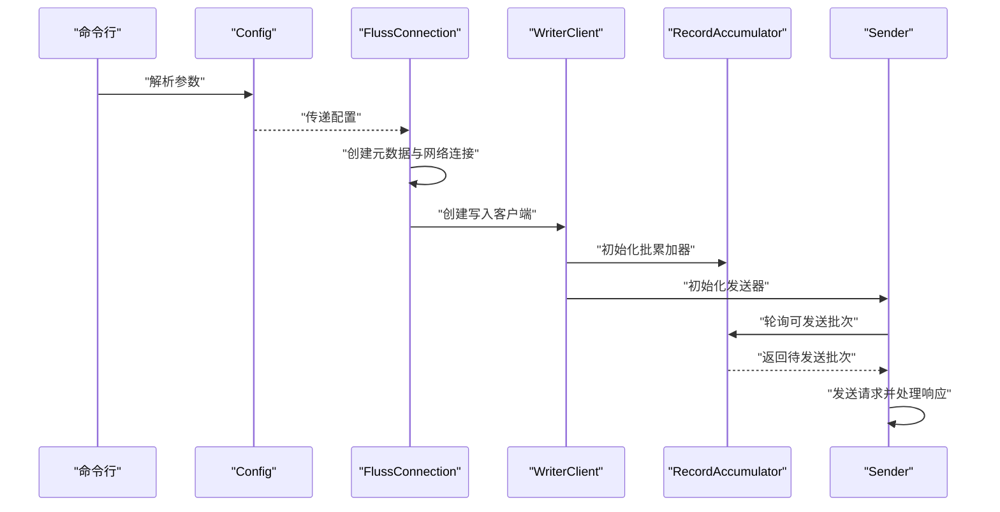
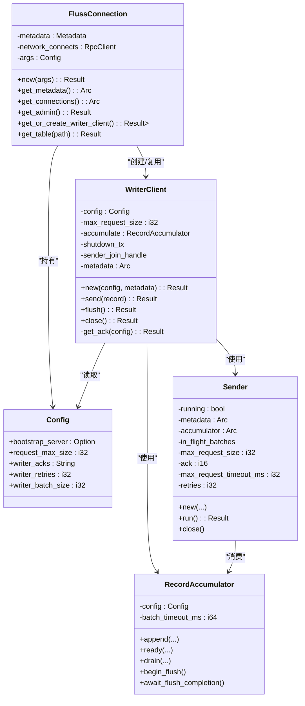
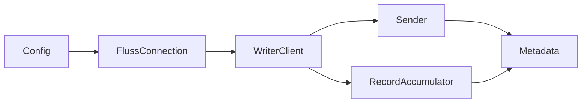
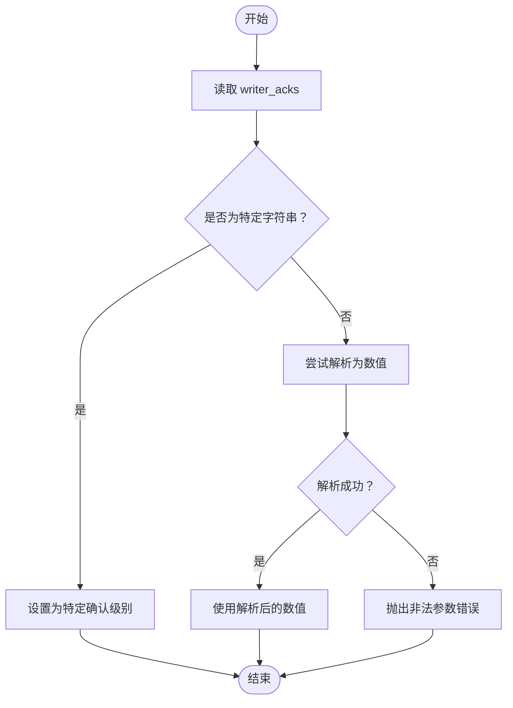

# 配置 API

<cite>
**本文引用的文件**
- [crates/fluss/src/config.rs](file://crates/fluss/src/config.rs)
- [crates/fluss/src/client/connection.rs](file://crates/fluss/src/client/connection.rs)
- [crates/fluss/src/client/write/writer_client.rs](file://crates/fluss/src/client/write/writer_client.rs)
- [crates/fluss/src/client/write/accumulator.rs](file://crates/fluss/src/client/write/accumulator.rs)
- [crates/fluss/src/client/write/sender.rs](file://crates/fluss/src/client/write/sender.rs)
- [crates/examples/src/example_table.rs](file://crates/examples/src/example_table.rs)
- [crates/fluss/Cargo.toml](file://crates/fluss/Cargo.toml)
- [Cargo.toml](file://Cargo.toml)
</cite>

## 目录
1. [简介](#简介)
2. [项目结构](#项目结构)
3. [核心组件](#核心组件)
4. [架构总览](#架构总览)
5. [详细组件分析](#详细组件分析)
6. [依赖分析](#依赖分析)
7. [性能考虑](#性能考虑)
8. [故障排除指南](#故障排除指南)
9. [结论](#结论)
10. [附录](#附录)

## 简介
本文件系统化梳理 Fluss 客户端配置 API，覆盖配置结构体字段、默认值、验证规则、优先级与继承关系，以及在不同使用场景下的配置示例与最佳实践。同时说明配置如何被加载（命令行解析）、如何影响连接参数与运行时行为，并给出性能调优建议与常见问题排查方法。

## 项目结构
配置 API 主要由以下模块组成：
- 配置定义：集中于配置结构体，支持命令行解析与序列化。
- 连接层：负责建立元数据与网络连接，读取配置中的引导服务器地址等。
- 写入客户端：根据配置初始化写入器，包括批大小、请求大小上限、确认策略与重试次数。
- 批累加器与发送器：依据配置参数进行批聚合、超时控制与网络发送。

图表来源
- [crates/fluss/src/config.rs](file://crates/fluss/src/config.rs#L21-L39)
- [crates/fluss/src/client/connection.rs](file://crates/fluss/src/client/connection.rs#L30-L52)
- [crates/fluss/src/client/write/writer_client.rs](file://crates/fluss/src/client/write/writer_client.rs#L32-L77)
- [crates/fluss/src/client/write/accumulator.rs](file://crates/fluss/src/client/write/accumulator.rs#L35-L61)
- [crates/fluss/src/client/write/sender.rs](file://crates/fluss/src/client/write/sender.rs#L31-L61)

章节来源
- [crates/fluss/src/config.rs](file://crates/fluss/src/config.rs#L21-L39)
- [crates/fluss/src/client/connection.rs](file://crates/fluss/src/client/connection.rs#L30-L52)
- [crates/fluss/src/client/write/writer_client.rs](file://crates/fluss/src/client/write/writer_client.rs#L32-L77)
- [crates/fluss/src/client/write/accumulator.rs](file://crates/fluss/src/client/write/accumulator.rs#L35-L61)
- [crates/fluss/src/client/write/sender.rs](file://crates/fluss/src/client/write/sender.rs#L31-L61)

## 核心组件
- 配置结构体 Config：定义客户端运行所需的关键参数，支持命令行解析与 JSON 序列化。
- FlussConnection：基于配置创建元数据与网络连接，提供表访问与管理能力。
- WriterClient：根据配置初始化批累加器与发送器，处理写入流程。
- RecordAccumulator：按配置参数进行批聚合、超时与容量控制。
- Sender：依据配置参数执行网络发送与响应处理。

章节来源
- [crates/fluss/src/config.rs](file://crates/fluss/src/config.rs#L21-L39)
- [crates/fluss/src/client/connection.rs](file://crates/fluss/src/client/connection.rs#L30-L52)
- [crates/fluss/src/client/write/writer_client.rs](file://crates/fluss/src/client/write/writer_client.rs#L32-L77)
- [crates/fluss/src/client/write/accumulator.rs](file://crates/fluss/src/client/write/accumulator.rs#L35-L61)
- [crates/fluss/src/client/write/sender.rs](file://crates/fluss/src/client/write/sender.rs#L31-L61)

## 架构总览
下图展示配置在系统中的流转路径：从命令行解析到连接建立，再到写入客户端初始化与批处理执行。

图表来源
- [crates/fluss/src/config.rs](file://crates/fluss/src/config.rs#L21-L39)
- [crates/fluss/src/client/connection.rs](file://crates/fluss/src/client/connection.rs#L37-L52)
- [crates/fluss/src/client/write/writer_client.rs](file://crates/fluss/src/client/write/writer_client.rs#L42-L77)
- [crates/fluss/src/client/write/accumulator.rs](file://crates/fluss/src/client/write/accumulator.rs#L164-L188)
- [crates/fluss/src/client/write/sender.rs](file://crates/fluss/src/client/write/sender.rs#L63-L106)

## 详细组件分析

### 配置结构体与字段说明
- 字段与默认值
  - bootstrap_server: 可选字符串；用于指定集群引导地址。在连接创建时会从该字段读取。
  - request_max_size: 整型，默认值为较大的正整数；限制单次请求的最大字节数。
  - writer_acks: 字符串，默认值为特定字符串；用于确定写入确认策略。
  - writer_retries: 整型，默认值为极大值；控制写入失败时的重试次数。
  - writer_batch_size: 整型，默认值为中等大小；控制批大小（可能用于批聚合逻辑）。
- 解析与序列化
  - 支持通过命令行解析生成配置实例。
  - 支持序列化/反序列化，便于持久化或传输。
- 验证规则
  - 确认策略 writer_acks 的解析：当值为特定字符串时映射为特定确认级别；否则尝试解析为数值类型；解析失败将触发非法参数错误。

章节来源
- [crates/fluss/src/config.rs](file://crates/fluss/src/config.rs#L21-L39)
- [crates/fluss/src/client/write/writer_client.rs](file://crates/fluss/src/client/write/writer_client.rs#L79-L87)

### 连接参数与生命周期
- 引导服务器
  - 在连接创建时，若配置未显式提供引导服务器，则无法完成元数据初始化。
- 元数据与网络
  - 基于引导服务器与网络客户端建立元数据连接，后续用于表信息与分区领导者查询。
- 写入客户端缓存
  - 连接对象内部缓存写入客户端实例，避免重复创建。

章节来源
- [crates/fluss/src/client/connection.rs](file://crates/fluss/src/client/connection.rs#L37-L52)
- [crates/fluss/src/client/connection.rs](file://crates/fluss/src/client/connection.rs#L66-L75)

### 写入客户端初始化与批处理
- 初始化流程
  - 使用配置创建批累加器与发送器。
  - 发送器根据请求大小上限、确认策略与重试次数进行网络发送。
- 确认策略解析
  - 将字符串确认策略转换为内部数值表示；非“全部”时尝试解析为数值，失败则报错。
- 批处理与超时
  - 批累加器维护每个桶的批次队列，按超时与容量触发发送。
  - 发送器按节点聚合批次并发送，处理响应后完成批次。

章节来源
- [crates/fluss/src/client/write/writer_client.rs](file://crates/fluss/src/client/write/writer_client.rs#L42-L77)
- [crates/fluss/src/client/write/writer_client.rs](file://crates/fluss/src/client/write/writer_client.rs#L79-L87)
- [crates/fluss/src/client/write/accumulator.rs](file://crates/fluss/src/client/write/accumulator.rs#L164-L188)
- [crates/fluss/src/client/write/sender.rs](file://crates/fluss/src/client/write/sender.rs#L63-L106)

### 类关系图（代码级）

图表来源
- [crates/fluss/src/config.rs](file://crates/fluss/src/config.rs#L21-L39)
- [crates/fluss/src/client/connection.rs](file://crates/fluss/src/client/connection.rs#L30-L52)
- [crates/fluss/src/client/write/writer_client.rs](file://crates/fluss/src/client/write/writer_client.rs#L32-L77)
- [crates/fluss/src/client/write/accumulator.rs](file://crates/fluss/src/client/write/accumulator.rs#L35-L61)
- [crates/fluss/src/client/write/sender.rs](file://crates/fluss/src/client/write/sender.rs#L31-L61)

## 依赖分析
- 组件耦合
  - FlussConnection 依赖 Config 与 RpcClient、Metadata。
  - WriterClient 依赖 Config、RecordAccumulator 与 Sender。
  - Sender 依赖 Metadata 与 RecordAccumulator。
- 外部依赖
  - 命令行解析与序列化：clap、serde。
  - 并发与同步：tokio、parking_lot、dashmap。
- 版本与特性
  - 工作区统一版本与特性开关，示例工程启用命令行解析功能。

图表来源
- [crates/fluss/src/config.rs](file://crates/fluss/src/config.rs#L21-L39)
- [crates/fluss/src/client/connection.rs](file://crates/fluss/src/client/connection.rs#L30-L52)
- [crates/fluss/src/client/write/writer_client.rs](file://crates/fluss/src/client/write/writer_client.rs#L32-L77)
- [crates/fluss/src/client/write/accumulator.rs](file://crates/fluss/src/client/write/accumulator.rs#L35-L61)
- [crates/fluss/src/client/write/sender.rs](file://crates/fluss/src/client/write/sender.rs#L31-L61)

章节来源
- [crates/fluss/Cargo.toml](file://crates/fluss/Cargo.toml#L25-L47)
- [Cargo.toml](file://Cargo.toml#L29-L36)

## 性能考虑
- 请求大小上限
  - request_max_size 控制单次请求最大字节数，影响吞吐与延迟权衡。
- 确认策略
  - writer_acks 影响写入可靠性与延迟；字符串“全部”映射为特定确认级别，其他值需可解析为数值。
- 重试次数
  - writer_retries 控制网络异常或临时错误时的重试次数，过高可能导致放大重试开销。
- 批大小
  - writer_batch_size 与批累加器的超时与容量策略共同决定批量聚合效果。
- 超时与刷新
  - 批累加器内部存在超时阈值，配合 flush 接口可实现主动刷新以降低延迟。

章节来源
- [crates/fluss/src/config.rs](file://crates/fluss/src/config.rs#L28-L39)
- [crates/fluss/src/client/write/writer_client.rs](file://crates/fluss/src/client/write/writer_client.rs#L79-L87)
- [crates/fluss/src/client/write/accumulator.rs](file://crates/fluss/src/client/write/accumulator.rs#L48-L61)
- [crates/fluss/src/client/write/sender.rs](file://crates/fluss/src/client/write/sender.rs#L63-L106)

## 故障排除指南
- 引导服务器缺失
  - 现象：连接创建失败。
  - 原因：未提供 bootstrap_server。
  - 处理：在配置中显式设置引导服务器地址。
- 确认策略解析失败
  - 现象：初始化写入客户端时报非法参数错误。
  - 原因：writer_acks 非“全部”且无法解析为数值。
  - 处理：将 writer_acks 设置为“全部”或合法数值字符串。
- 请求过大
  - 现象：发送阶段出现请求尺寸超限错误。
  - 原因：批次聚合后超过 request_max_size。
  - 处理：适当降低 writer_batch_size 或增大 request_max_size。
- 写入阻塞
  - 现象：flush 后仍等待结果。
  - 原因：存在未完成批次或网络异常。
  - 处理：检查网络连通性与目标节点状态，必要时增加 writer_retries。

章节来源
- [crates/fluss/src/client/connection.rs](file://crates/fluss/src/client/connection.rs#L37-L52)
- [crates/fluss/src/client/write/writer_client.rs](file://crates/fluss/src/client/write/writer_client.rs#L79-L87)
- [crates/fluss/src/client/write/accumulator.rs](file://crates/fluss/src/client/write/accumulator.rs#L367-L372)
- [crates/fluss/src/client/write/sender.rs](file://crates/fluss/src/client/write/sender.rs#L132-L167)

## 结论
本文档对 Fluss 客户端配置 API 进行了系统化梳理，明确了配置结构体字段、默认值与验证规则，解释了配置在连接与写入流程中的作用，并提供了性能调优与故障排除建议。开发者可根据不同场景调整配置参数，以获得更优的吞吐与稳定性。

## 附录

### 配置字段与默认值一览
- bootstrap_server: 可选；用于引导服务器地址。
- request_max_size: 默认较大正整数；请求大小上限。
- writer_acks: 默认特定字符串；确认策略，支持“全部”或数值。
- writer_retries: 默认极大值；写入重试次数。
- writer_batch_size: 默认中等大小；批大小。

章节来源
- [crates/fluss/src/config.rs](file://crates/fluss/src/config.rs#L28-L39)

### 配置加载与使用示例
- 命令行解析
  - 示例程序通过命令行解析生成配置实例，随后设置引导服务器并创建连接。
- 运行时修改
  - 示例程序在解析后直接覆写引导服务器字段，演示了运行时对配置的修改方式。

章节来源
- [crates/examples/src/example_table.rs](file://crates/examples/src/example_table.rs#L29-L32)

### 配置优先级与继承关系
- 优先级
  - 命令行参数优先于默认值；示例程序展示了在解析后对配置字段的覆写。
- 继承关系
  - FlussConnection 持有 Config 并将其传递给 WriterClient。
  - WriterClient 将 Config 传递给批累加器与发送器，形成自上而下的配置传递链。

章节来源
- [crates/fluss/src/client/connection.rs](file://crates/fluss/src/client/connection.rs#L37-L52)
- [crates/fluss/src/client/write/writer_client.rs](file://crates/fluss/src/client/write/writer_client.rs#L42-L77)

### 配置验证流程（确认策略）

图表来源
- [crates/fluss/src/client/write/writer_client.rs](file://crates/fluss/src/client/write/writer_client.rs#L79-L87)