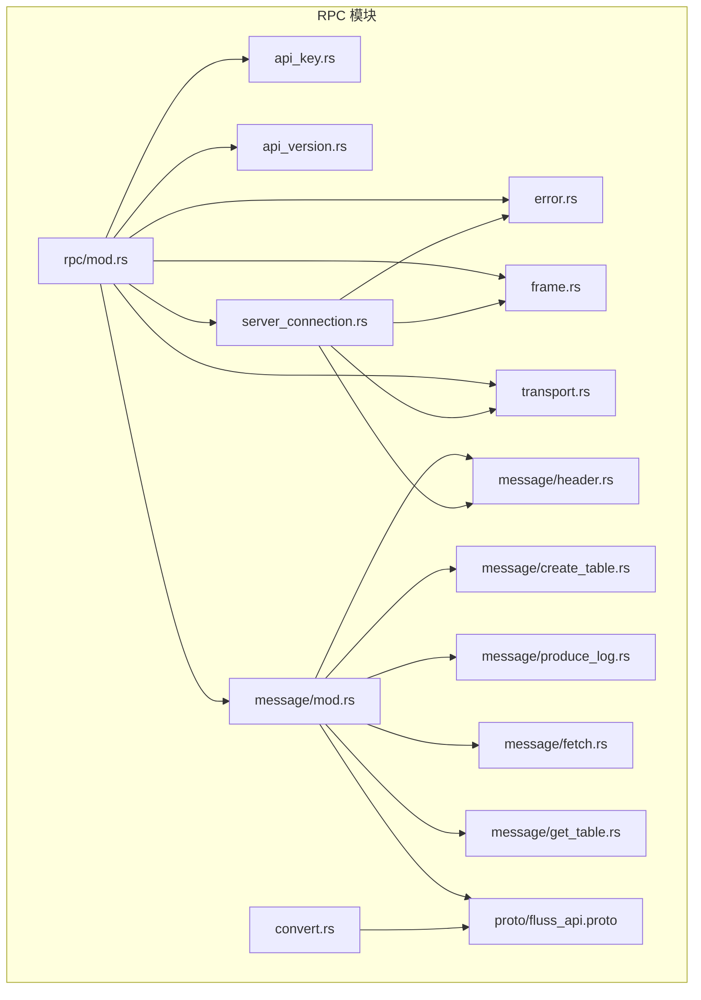
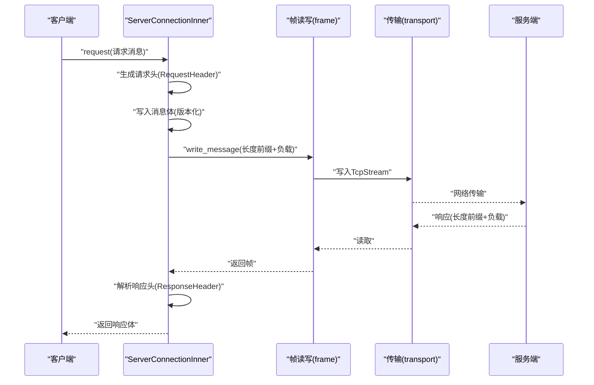
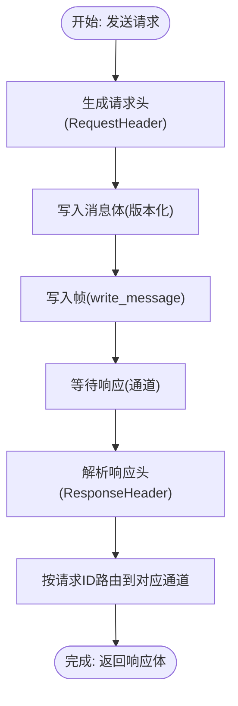
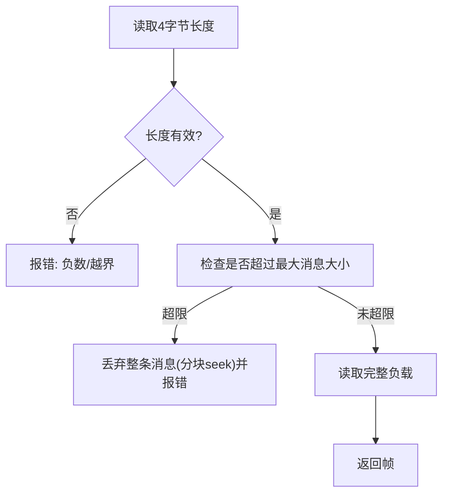
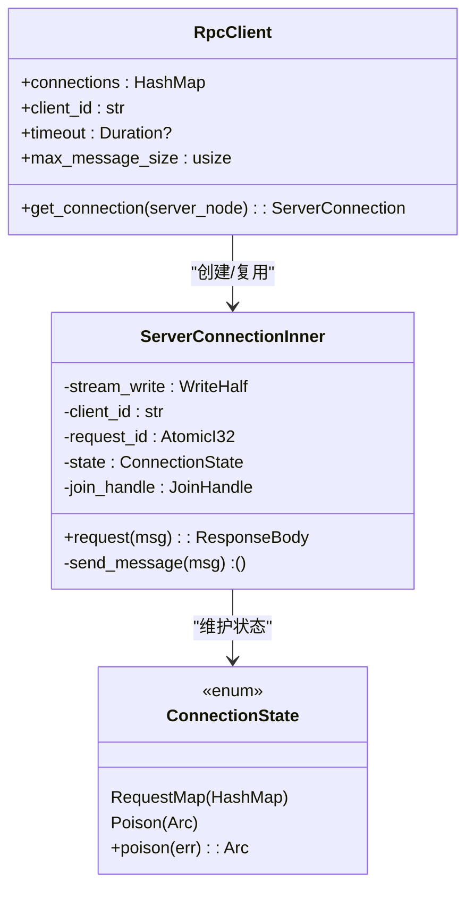
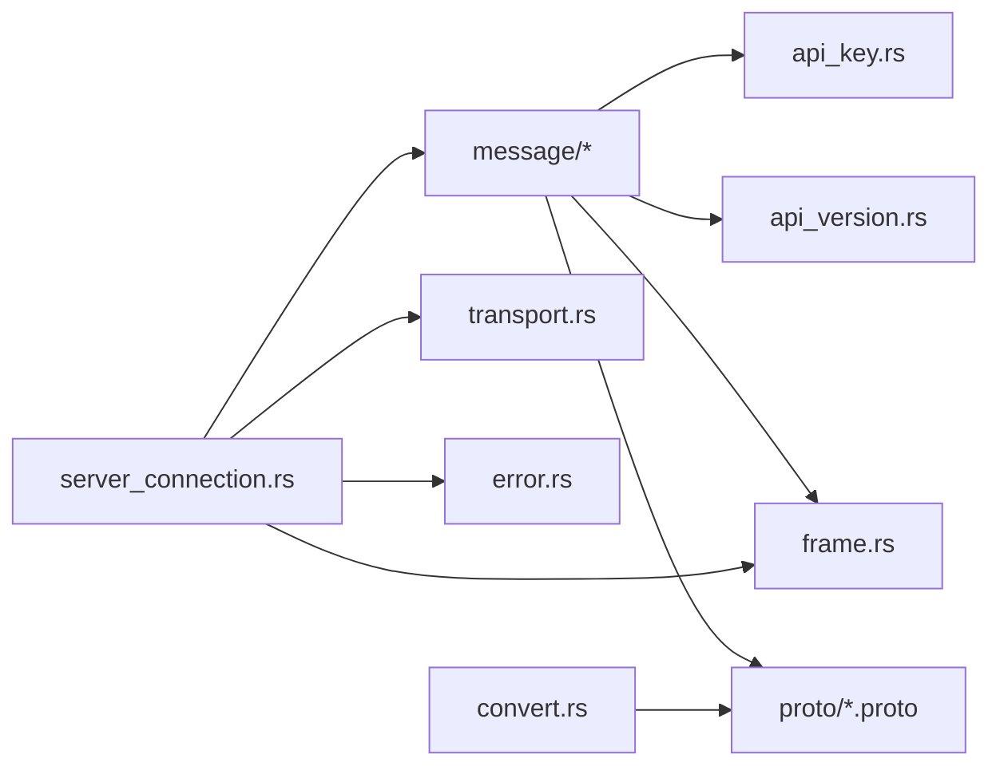

# RPC 通信

<cite>
**本文引用的文件**
- [crates/fluss/src/proto/fluss_api.proto](file://crates/fluss/src/proto/fluss_api.proto)
- [crates/fluss/src/rpc/mod.rs](file://crates/fluss/src/rpc/mod.rs)
- [crates/fluss/src/rpc/server_connection.rs](file://crates/fluss/src/rpc/server_connection.rs)
- [crates/fluss/src/rpc/transport.rs](file://crates/fluss/src/rpc/transport.rs)
- [crates/fluss/src/rpc/frame.rs](file://crates/fluss/src/rpc/frame.rs)
- [crates/fluss/src/rpc/api_key.rs](file://crates/fluss/src/rpc/api_key.rs)
- [crates/fluss/src/rpc/api_version.rs](file://crates/fluss/src/rpc/api_version.rs)
- [crates/fluss/src/rpc/message/mod.rs](file://crates/fluss/src/rpc/message/mod.rs)
- [crates/fluss/src/rpc/message/header.rs](file://crates/fluss/src/rpc/message/header.rs)
- [crates/fluss/src/rpc/message/create_table.rs](file://crates/fluss/src/rpc/message/create_table.rs)
- [crates/fluss/src/rpc/message/produce_log.rs](file://crates/fluss/src/rpc/message/produce_log.rs)
- [crates/fluss/src/rpc/message/fetch.rs](file://crates/fluss/src/rpc/message/fetch.rs)
- [crates/fluss/src/rpc/message/get_table.rs](file://crates/fluss/src/rpc/message/get_table.rs)
- [crates/fluss/src/rpc/error.rs](file://crates/fluss/src/rpc/error.rs)
- [crates/fluss/src/rpc/convert.rs](file://crates/fluss/src/rpc/convert.rs)
</cite>

## 目录
1. [简介](#简介)
2. [项目结构](#项目结构)
3. [核心组件](#核心组件)
4. [架构总览](#架构总览)
5. [详细组件分析](#详细组件分析)
6. [依赖关系分析](#依赖关系分析)
7. [性能考虑](#性能考虑)
8. [故障排查指南](#故障排查指南)
9. [结论](#结论)
10. [附录：RPC 调用示例与最佳实践](#附录rpc-调用示例与最佳实践)

## 简介
本文件系统性阐述 Fluss Rust 实现中的 RPC 通信子系统，覆盖 Protocol Buffers 协议定义、消息格式与字段编码、版本兼容策略；消息处理机制（请求/响应、路由、错误传播）；传输层实现（连接管理、帧处理、序列化/反序列化）；ServerConnection 的设计与实现（连接池、心跳与故障恢复）；以及 API Key 与版本管理（认证、权限与兼容）。文末提供可直接定位到源码的示例路径，帮助读者快速上手。

## 项目结构
RPC 子系统位于 crates/fluss/src/rpc 目录，采用模块化组织：
- 协议与消息：proto 定义在 fluss_api.proto，消息类型与编解码在 message 子模块
- 传输与帧：frame 提供基于长度前缀的帧读写，transport 封装 TCP 连接
- 连接与会话：server_connection 实现客户端连接池、请求-响应路由、错误传播与恢复
- 版本与键值：api_key、api_version 管理 API 类型与版本范围
- 错误模型：error 统一错误类型
- 类型转换：convert 提供 Protobuf 与内部类型的互转

图表来源
- [crates/fluss/src/rpc/mod.rs](file://crates/fluss/src/rpc/mod.rs#L18-L31)
- [crates/fluss/src/rpc/server_connection.rs](file://crates/fluss/src/rpc/server_connection.rs#L18-L44)
- [crates/fluss/src/rpc/frame.rs](file://crates/fluss/src/rpc/frame.rs#L34-L106)
- [crates/fluss/src/rpc/transport.rs](file://crates/fluss/src/rpc/transport.rs#L26-L83)
- [crates/fluss/src/rpc/message/mod.rs](file://crates/fluss/src/rpc/message/mod.rs#L18-L35)
- [crates/fluss/src/rpc/message/header.rs](file://crates/fluss/src/rpc/message/header.rs#L32-L73)
- [crates/fluss/src/rpc/message/create_table.rs](file://crates/fluss/src/rpc/message/create_table.rs#L32-L62)
- [crates/fluss/src/rpc/message/produce_log.rs](file://crates/fluss/src/rpc/message/produce_log.rs#L31-L71)
- [crates/fluss/src/rpc/message/fetch.rs](file://crates/fluss/src/rpc/message/fetch.rs#L35-L56)
- [crates/fluss/src/rpc/message/get_table.rs](file://crates/fluss/src/rpc/message/get_table.rs#L29-L54)
- [crates/fluss/src/rpc/convert.rs](file://crates/fluss/src/rpc/convert.rs#L18-L43)
- [crates/fluss/src/proto/fluss_api.proto](file://crates/fluss/src/proto/fluss_api.proto#L18-L197)

章节来源
- [crates/fluss/src/rpc/mod.rs](file://crates/fluss/src/rpc/mod.rs#L18-L31)

## 核心组件
- 协议与消息
  - 使用 Protocol Buffers 定义请求/响应消息体，如元数据、生产、拉取、建表等
  - 通过宏为消息实现版本化的读写接口，统一编码/解码流程
- 帧与传输
  - 帧采用 4 字节长度前缀 + 负载，具备最大消息大小限制与越界处理
  - 传输封装 TCP 连接，支持超时与关闭
- 连接与会话
  - 客户端维护按服务节点的连接池，复用连接
  - 内部异步任务循环读取帧，按请求 ID 路由响应，支持“毒化”流以保证一致性
- 版本与键值
  - API Key 映射到具体 RPC 接口
  - API 版本用于演进控制，当前实现中请求头与消息体均使用固定版本
- 错误模型
  - 统一的 RpcError，包含帧读写错误、连接错误、毒化传播、多余数据等

章节来源
- [crates/fluss/src/proto/fluss_api.proto](file://crates/fluss/src/proto/fluss_api.proto#L23-L197)
- [crates/fluss/src/rpc/message/mod.rs](file://crates/fluss/src/rpc/message/mod.rs#L37-L97)
- [crates/fluss/src/rpc/frame.rs](file://crates/fluss/src/rpc/frame.rs#L34-L106)
- [crates/fluss/src/rpc/transport.rs](file://crates/fluss/src/rpc/transport.rs#L26-L83)
- [crates/fluss/src/rpc/server_connection.rs](file://crates/fluss/src/rpc/server_connection.rs#L46-L97)
- [crates/fluss/src/rpc/api_key.rs](file://crates/fluss/src/rpc/api_key.rs#L20-L54)
- [crates/fluss/src/rpc/api_version.rs](file://crates/fluss/src/rpc/api_version.rs#L18-L54)
- [crates/fluss/src/rpc/error.rs](file://crates/fluss/src/rpc/error.rs#L23-L50)

## 架构总览
下图展示了从客户端到服务端的典型 RPC 流程：客户端构造请求消息，写入请求头与消息体，经帧封装后发送；服务端异步读取帧，解析响应头并按请求 ID 回传给对应等待通道。

图表来源
- [crates/fluss/src/rpc/server_connection.rs](file://crates/fluss/src/rpc/server_connection.rs#L233-L287)
- [crates/fluss/src/rpc/frame.rs](file://crates/fluss/src/rpc/frame.rs#L34-L106)
- [crates/fluss/src/rpc/transport.rs](file://crates/fluss/src/rpc/transport.rs#L26-L83)
- [crates/fluss/src/rpc/message/header.rs](file://crates/fluss/src/rpc/message/header.rs#L32-L73)

## 详细组件分析

### 协议与消息（Protocol Buffers）
- 协议定义
  - 使用 proto2 语法，定义 MetadataRequest/MetadataResponse、ProduceLogRequest/ProduceLogResponse、FetchLogRequest/FetchLogResponse、CreateTableRequest/CreateTableResponse、GetTableInfoRequest/GetTableInfoResponse 等
  - 关键字段包含表路径、分区信息、桶元数据、记录负载、高水位标记、远程日志信息等
- 字段编码与兼容
  - 使用 prost 编解码，遵循 Protobuf 规范
  - 兼容性注释明确了不同版本下的字段语义变化（例如服务器节点监听器字段随版本演进）
- 版本化消息
  - 请求头与消息体均通过版本化接口进行读写，便于未来扩展

章节来源
- [crates/fluss/src/proto/fluss_api.proto](file://crates/fluss/src/proto/fluss_api.proto#L23-L197)
- [crates/fluss/src/rpc/message/mod.rs](file://crates/fluss/src/rpc/message/mod.rs#L67-L97)

### 请求/响应模式与消息路由
- 请求头
  - 包含 API Key、API 版本、请求 ID、客户端标识
  - 写入顺序严格，便于服务端解析
- 响应头
  - 当前实现仅处理成功响应类型，非成功类型预留扩展点
- 路由机制
  - 每个请求分配唯一请求 ID，连接状态中维护活跃请求映射
  - 异步读线程根据响应头中的请求 ID 查找对应通道并投递结果
- 取消与清理
  - 在发送前若取消，自动清理活跃请求映射，避免悬挂

图表来源
- [crates/fluss/src/rpc/server_connection.rs](file://crates/fluss/src/rpc/server_connection.rs#L233-L287)
- [crates/fluss/src/rpc/message/header.rs](file://crates/fluss/src/rpc/message/header.rs#L32-L73)

章节来源
- [crates/fluss/src/rpc/message/header.rs](file://crates/fluss/src/rpc/message/header.rs#L32-L73)
- [crates/fluss/src/rpc/server_connection.rs](file://crates/fluss/src/rpc/server_connection.rs#L106-L145)

### 传输层实现（连接管理、帧处理、序列化/反序列化）
- 连接管理
  - Transport 封装 TcpStream，支持带超时的连接建立
  - ServerConnectionInner 将读写拆分为独立半工流，分别用于发送与接收
- 帧处理
  - 读：先读 4 字节长度，校验是否超过最大消息大小，再读取完整负载
  - 写：先写 4 字节长度，再写负载
  - 超大消息时进行分块丢弃以保持后续帧同步
- 序列化/反序列化
  - 消息体通过 prost 编解码
  - 请求头与响应头通过字节序写入/读取

图表来源
- [crates/fluss/src/rpc/frame.rs](file://crates/fluss/src/rpc/frame.rs#L45-L76)
- [crates/fluss/src/rpc/transport.rs](file://crates/fluss/src/rpc/transport.rs#L67-L82)

章节来源
- [crates/fluss/src/rpc/transport.rs](file://crates/fluss/src/rpc/transport.rs#L26-L83)
- [crates/fluss/src/rpc/frame.rs](file://crates/fluss/src/rpc/frame.rs#L34-L106)

### ServerConnection 的设计与实现
- 连接池
  - RpcClient 维护按服务节点 ID 的连接缓存，首次访问时建立连接并加入池
- 读取任务
  - 后台任务持续读取帧，解析响应头，按请求 ID 路由到对应通道
- 错误传播与恢复
  - 任何读写错误会“毒化”连接，拒绝后续请求并通知所有等待者
  - 发送失败同样毒化，确保帧边界一致
- 取消安全
  - 使用取消安全的发送包装，避免半写导致半帧
  - 使用清理器在取消前移除活跃请求映射

图表来源
- [crates/fluss/src/rpc/server_connection.rs](file://crates/fluss/src/rpc/server_connection.rs#L46-L97)
- [crates/fluss/src/rpc/server_connection.rs](file://crates/fluss/src/rpc/server_connection.rs#L147-L231)
- [crates/fluss/src/rpc/server_connection.rs](file://crates/fluss/src/rpc/server_connection.rs#L111-L145)

章节来源
- [crates/fluss/src/rpc/server_connection.rs](file://crates/fluss/src/rpc/server_connection.rs#L46-L97)
- [crates/fluss/src/rpc/server_connection.rs](file://crates/fluss/src/rpc/server_connection.rs#L147-L231)
- [crates/fluss/src/rpc/server_connection.rs](file://crates/fluss/src/rpc/server_connection.rs#L289-L312)

### API Key 与版本管理
- API Key
  - 定义了建表、生产、拉取、元数据、获取表等 API Key，并提供 i16 互转
- API 版本
  - 使用 ApiVersion 包装版本号，提供范围显示与比较
- 认证与权限
  - 请求头包含客户端标识字段，可用于鉴权与审计
- 向后兼容
  - 消息体与头部均通过版本化接口读写，便于未来扩展
  - 协议注释明确了字段在不同版本的行为差异

章节来源
- [crates/fluss/src/rpc/api_key.rs](file://crates/fluss/src/rpc/api_key.rs#L20-L54)
- [crates/fluss/src/rpc/api_version.rs](file://crates/fluss/src/rpc/api_version.rs#L18-L54)
- [crates/fluss/src/rpc/message/header.rs](file://crates/fluss/src/rpc/message/header.rs#L32-L42)
- [crates/fluss/src/proto/fluss_api.proto](file://crates/fluss/src/proto/fluss_api.proto#L66-L75)

### 典型消息实现（示例路径）
- 建表请求
  - 结构体封装 Protobuf 请求，实现 RequestBody 并通过宏实现版本化读写
  - 示例路径：[CreateTableRequest](file://crates/fluss/src/rpc/message/create_table.rs#L32-L62)
- 生产日志请求
  - 支持批量桶聚合，构造 Protobuf 请求并实现 RequestBody
  - 示例路径：[ProduceLogRequest](file://crates/fluss/src/rpc/message/produce_log.rs#L31-L71)
- 拉取日志请求
  - 封装拉取参数，实现 RequestBody
  - 示例路径：[FetchLogRequest](file://crates/fluss/src/rpc/message/fetch.rs#L35-L56)
- 获取表信息请求
  - 封装表路径，实现 RequestBody
  - 示例路径：[GetTableRequest](file://crates/fluss/src/rpc/message/get_table.rs#L29-L54)

章节来源
- [crates/fluss/src/rpc/message/create_table.rs](file://crates/fluss/src/rpc/message/create_table.rs#L32-L62)
- [crates/fluss/src/rpc/message/produce_log.rs](file://crates/fluss/src/rpc/message/produce_log.rs#L31-L71)
- [crates/fluss/src/rpc/message/fetch.rs](file://crates/fluss/src/rpc/message/fetch.rs#L35-L56)
- [crates/fluss/src/rpc/message/get_table.rs](file://crates/fluss/src/rpc/message/get_table.rs#L29-L54)

## 依赖关系分析
- 模块耦合
  - message 子模块依赖 api_key、api_version、frame，以及 proto 定义
  - server_connection 依赖 message、frame、transport、error
  - convert 依赖 proto 与内部类型
- 外部依赖
  - tokio 提供异步 I/O 与任务调度
  - prost 提供 Protobuf 编解码
  - bytes 提供缓冲区操作

图表来源
- [crates/fluss/src/rpc/message/mod.rs](file://crates/fluss/src/rpc/message/mod.rs#L18-L35)
- [crates/fluss/src/rpc/server_connection.rs](file://crates/fluss/src/rpc/server_connection.rs#L18-L27)
- [crates/fluss/src/rpc/convert.rs](file://crates/fluss/src/rpc/convert.rs#L18-L43)

章节来源
- [crates/fluss/src/rpc/message/mod.rs](file://crates/fluss/src/rpc/message/mod.rs#L18-L35)
- [crates/fluss/src/rpc/server_connection.rs](file://crates/fluss/src/rpc/server_connection.rs#L18-L27)

## 性能考虑
- 连接复用
  - 使用 RpcClient 的连接池减少握手开销
- 零拷贝与缓冲
  - 使用 Buf/BufMut 与 Vec<u8> 作为中间缓冲，避免重复分配
- 背压与限流
  - 通过最大消息大小限制防止内存膨胀
- 异步与并发
  - 读写分离与后台任务提升吞吐
- 建议
  - 批量请求合并（如生产日志请求已支持桶聚合）
  - 合理设置超时与最大消息大小
  - 对热点节点增加连接数或使用连接池扩容

## 故障排查指南
- 常见错误类型
  - 帧读写错误、连接超时/失败、消息过大、毒化连接、多余数据
- 定位方法
  - 检查 RpcError 的来源与上下文
  - 关注“毒化”传播，确认是否因发送/接收异常导致连接失效
  - 核对请求头中的 API Key 与版本，确保客户端与服务端一致
- 建议
  - 开启更详细的日志级别，观察帧长度与请求 ID
  - 对超大消息进行采样与告警
  - 在客户端侧实现重试与退避策略

章节来源
- [crates/fluss/src/rpc/error.rs](file://crates/fluss/src/rpc/error.rs#L23-L50)
- [crates/fluss/src/rpc/frame.rs](file://crates/fluss/src/rpc/frame.rs#L21-L32)
- [crates/fluss/src/rpc/transport.rs](file://crates/fluss/src/rpc/transport.rs#L73-L82)

## 结论
该 RPC 子系统以清晰的模块划分实现了稳定的请求/响应模型：协议层通过 Protobuf 与版本化接口保障兼容性；传输层以长度前缀帧确保鲁棒性；连接层通过连接池与后台读取任务实现高吞吐与可靠性；错误模型统一且可传播。结合 API Key 与版本管理，系统具备良好的演进能力与可维护性。

## 附录：RPC 调用示例与最佳实践
以下示例均提供可定位到源码的路径，便于对照实现：

- 建表请求（请求构建 → 发送 → 接收 → 错误处理）
  - 构建请求体：[CreateTableRequest::new](file://crates/fluss/src/rpc/message/create_table.rs#L38-L50)
  - 发送请求：[ServerConnectionInner::request](file://crates/fluss/src/rpc/server_connection.rs#L233-L287)
  - 解析响应：[CreateTableResponse 读取](file://crates/fluss/src/rpc/message/create_table.rs#L61-L62)
  - 错误处理：[RpcError 类型](file://crates/fluss/src/rpc/error.rs#L23-L50)

- 生产日志请求（批量聚合）
  - 构建请求体：[ProduceLogRequest::new](file://crates/fluss/src/rpc/message/produce_log.rs#L36-L59)
  - 发送与路由：[ServerConnectionInner::request](file://crates/fluss/src/rpc/server_connection.rs#L233-L287)
  - 响应解析：[ProduceLogResponse 读取](file://crates/fluss/src/rpc/message/produce_log.rs#L70-L71)

- 拉取日志请求
  - 构建请求体：[FetchLogRequest::new](file://crates/fluss/src/rpc/message/fetch.rs#L40-L44)
  - 发送与接收：[ServerConnectionInner::request](file://crates/fluss/src/rpc/server_connection.rs#L233-L287)
  - 响应解析：[FetchLogResponse 读取](file://crates/fluss/src/rpc/message/fetch.rs#L55-L56)

- 获取表信息请求
  - 构建请求体：[GetTableRequest::new](file://crates/fluss/src/rpc/message/get_table.rs#L35-L44)
  - 发送与接收：[ServerConnectionInner::request](file://crates/fluss/src/rpc/server_connection.rs#L233-L287)
  - 响应解析：[GetTableInfoResponse 读取](file://crates/fluss/src/rpc/message/get_table.rs#L53-L54)

- 类型转换
  - 表路径转换：[to_table_path](file://crates/fluss/src/rpc/convert.rs#L22-L27)
  - 服务器节点转换：[from_pb_server_node](file://crates/fluss/src/rpc/convert.rs#L29-L36)

- 最佳实践
  - 使用 RpcClient::get_connection 复用连接
  - 设置合理的 max_message_size 与超时
  - 对批量请求进行聚合，减少 RTT
  - 在出现 RpcError::Poisoned 时重建连接并重试幂等请求