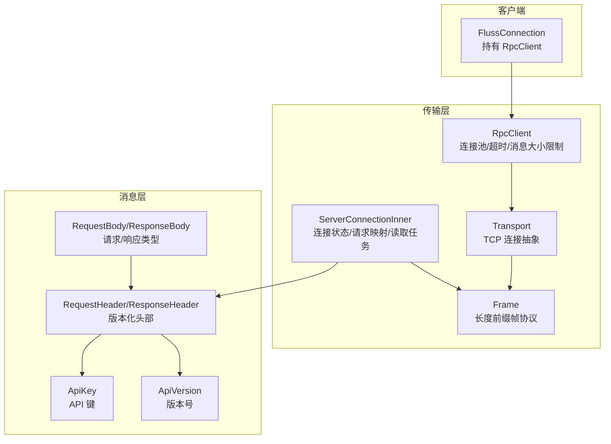
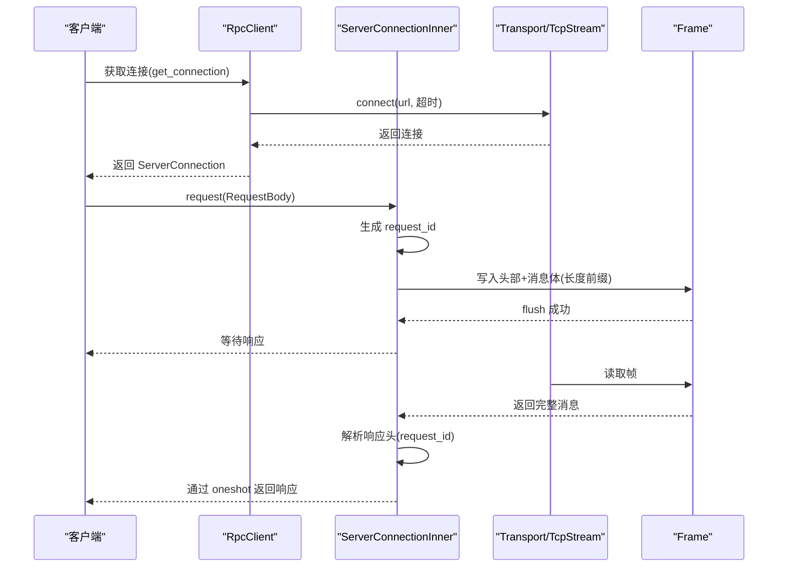
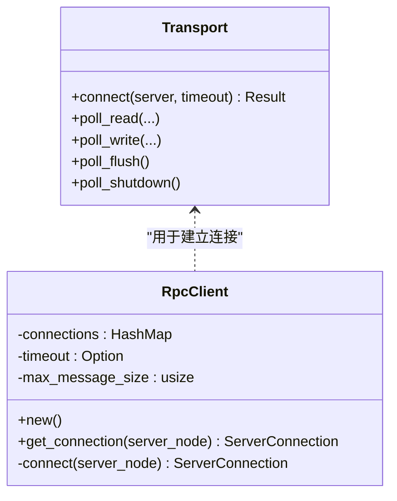
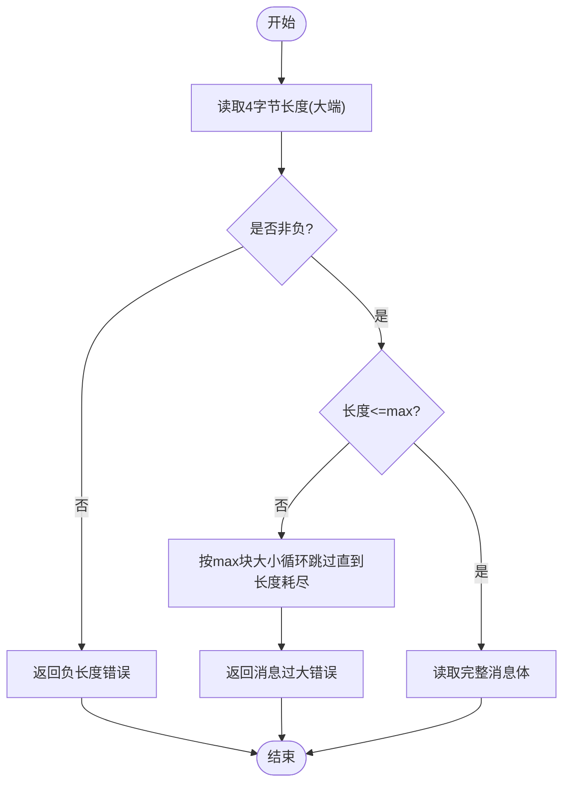
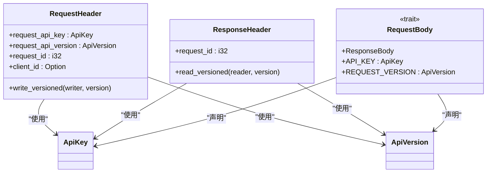
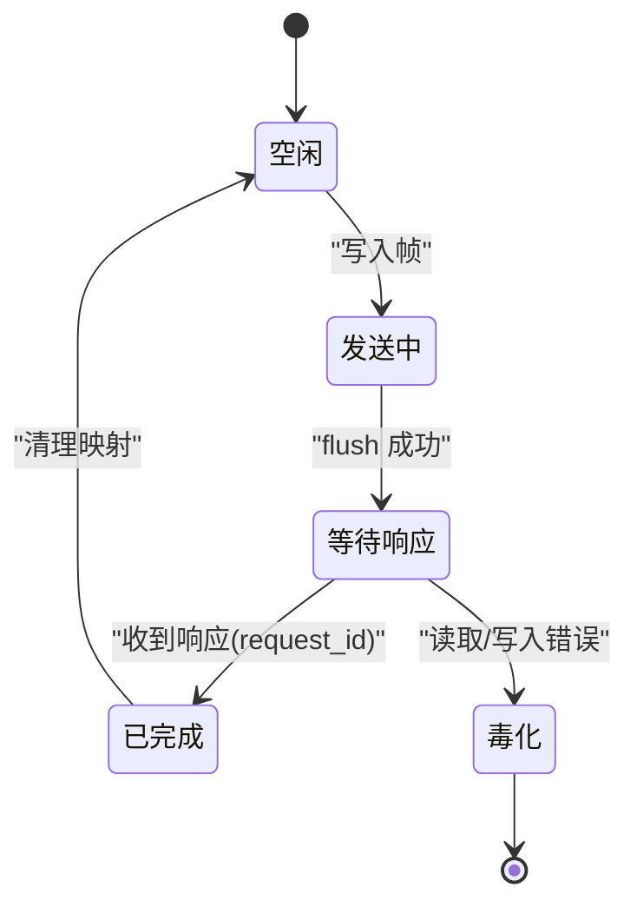
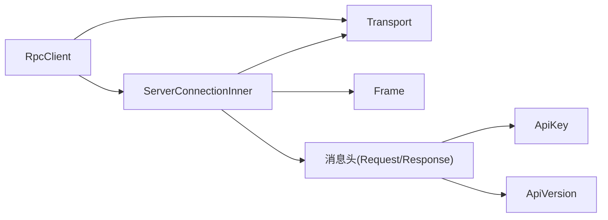

# 传输层

<cite>
**本文引用的文件**
- [crates/fluss/src/rpc/transport.rs](file://crates/fluss/src/rpc/transport.rs)
- [crates/fluss/src/rpc/frame.rs](file://crates/fluss/src/rpc/frame.rs)
- [crates/fluss/src/rpc/server_connection.rs](file://crates/fluss/src/rpc/server_connection.rs)
- [crates/fluss/src/rpc/error.rs](file://crates/fluss/src/rpc/error.rs)
- [crates/fluss/src/rpc/message/header.rs](file://crates/fluss/src/rpc/message/header.rs)
- [crates/fluss/src/rpc/message/mod.rs](file://crates/fluss/src/rpc/message/mod.rs)
- [crates/fluss/src/rpc/api_key.rs](file://crates/fluss/src/rpc/api_key.rs)
- [crates/fluss/src/rpc/api_version.rs](file://crates/fluss/src/rpc/api_version.rs)
- [crates/fluss/src/client/connection.rs](file://crates/fluss/src/client/connection.rs)
</cite>

## 目录
1. [引言](#引言)
2. [项目结构](#项目结构)
3. [核心组件](#核心组件)
4. [架构总览](#架构总览)
5. [详细组件分析](#详细组件分析)
6. [依赖关系分析](#依赖关系分析)
7. [性能考虑](#性能考虑)
8. [故障排查指南](#故障排查指南)
9. [结论](#结论)
10. [附录：使用示例与最佳实践](#附录使用示例与最佳实践)

## 引言
本文件系统性梳理传输层的设计与实现，覆盖网络通信抽象、连接管理、数据帧处理、序列化转换、错误处理与重试策略、以及性能优化与监控建议。传输层以异步 I/O 为核心，基于 TCP 流封装统一的传输抽象，采用“长度前缀 + 版本化消息体”的帧格式进行可靠的数据交换；通过独立的读取任务与请求-响应映射，实现并发安全与可取消的请求生命周期管理。

## 项目结构
传输层位于 rpc 子模块中，主要由以下模块组成：
- transport.rs：传输抽象与连接建立（当前为 TCP，支持可选超时）
- frame.rs：帧协议与消息编解码（长度前缀、字节序、最大消息大小限制）
- server_connection.rs：服务端连接管理、请求调度、响应路由、错误毒化与清理
- message/mod.rs 及其子模块：请求/响应类型、版本化读写接口、消息头结构
- api_key.rs、api_version.rs：API 键与版本枚举
- error.rs：RPC 错误类型定义
- client/connection.rs：客户端连接入口，持有 RpcClient 并提供元数据与写入客户端

图表来源
- [crates/fluss/src/rpc/transport.rs](file://crates/fluss/src/rpc/transport.rs#L26-L82)
- [crates/fluss/src/rpc/frame.rs](file://crates/fluss/src/rpc/frame.rs#L34-L106)
- [crates/fluss/src/rpc/server_connection.rs](file://crates/fluss/src/rpc/server_connection.rs#L46-L97)
- [crates/fluss/src/rpc/message/header.rs](file://crates/fluss/src/rpc/message/header.rs#L32-L73)
- [crates/fluss/src/rpc/message/mod.rs](file://crates/fluss/src/rpc/message/mod.rs#L37-L65)
- [crates/fluss/src/rpc/api_key.rs](file://crates/fluss/src/rpc/api_key.rs#L20-L54)
- [crates/fluss/src/rpc/api_version.rs](file://crates/fluss/src/rpc/api_version.rs#L18-L54)
- [crates/fluss/src/client/connection.rs](file://crates/fluss/src/client/connection.rs#L30-L52)

章节来源
- [crates/fluss/src/rpc/mod.rs](file://crates/fluss/src/rpc/mod.rs#L18-L32)

## 核心组件
- Transport：统一的异步读写抽象，当前实现为 Plain(TcpStream)，支持带超时的连接建立
- Frame：定义消息帧格式（长度前缀 i32，大端字节序），提供异步读写消息能力与最大消息大小限制
- ServerConnectionInner：连接内核，负责拆分读写通道、启动读取任务、维护请求映射、响应路由、错误毒化与清理
- RpcClient：连接池与工厂，按 ServerNode 维度缓存连接，提供统一的请求发起接口
- 消息头与版本化：RequestHeader/ResponseHeader 定义请求标识与响应类型；RequestBody/ResponseBody 通过版本化接口进行序列化/反序列化
- 错误模型：RpcError 覆盖写入/读取/连接/毒化/数据剩余等错误场景

章节来源
- [crates/fluss/src/rpc/transport.rs](file://crates/fluss/src/rpc/transport.rs#L26-L82)
- [crates/fluss/src/rpc/frame.rs](file://crates/fluss/src/rpc/frame.rs#L21-L106)
- [crates/fluss/src/rpc/server_connection.rs](file://crates/fluss/src/rpc/server_connection.rs#L99-L231)
- [crates/fluss/src/rpc/message/header.rs](file://crates/fluss/src/rpc/message/header.rs#L32-L73)
- [crates/fluss/src/rpc/message/mod.rs](file://crates/fluss/src/rpc/message/mod.rs#L37-L65)
- [crates/fluss/src/rpc/error.rs](file://crates/fluss/src/rpc/error.rs#L23-L50)

## 架构总览
传输层采用“客户端连接池 + 单连接多路复用”的模式：
- RpcClient 维护按服务节点的连接映射，首次访问时建立连接并缓存
- ServerConnectionInner 将底层流拆分为读写两半，读取任务持续从流中读取完整帧并根据 request_id 路由到对应 oneshot 通道
- 请求侧在发送前生成自增 request_id，插入请求映射，等待响应返回后移除映射
- 发送侧使用“取消安全”包装，避免半发送导致帧同步破坏；一旦发送失败，连接进入毒化状态，后续所有请求立即失败

图表来源
- [crates/fluss/src/rpc/server_connection.rs](file://crates/fluss/src/rpc/server_connection.rs#L64-L96)
- [crates/fluss/src/rpc/server_connection.rs](file://crates/fluss/src/rpc/server_connection.rs#L233-L287)
- [crates/fluss/src/rpc/frame.rs](file://crates/fluss/src/rpc/frame.rs#L93-L106)
- [crates/fluss/src/rpc/transport.rs](file://crates/fluss/src/rpc/transport.rs#L67-L82)

## 详细组件分析

### 传输抽象与连接管理
- Transport
  - 提供 AsyncRead/AsyncWrite 实现，当前为 Plain(TcpStream)
  - 支持带超时的连接建立，超时返回连接错误
- RpcClient
  - 按 ServerNode.uid() 缓存连接，避免重复握手
  - 可配置超时与最大消息大小
  - 通过 BufStream 包装底层传输，提升吞吐

图表来源
- [crates/fluss/src/rpc/transport.rs](file://crates/fluss/src/rpc/transport.rs#L26-L82)
- [crates/fluss/src/rpc/server_connection.rs](file://crates/fluss/src/rpc/server_connection.rs#L46-L97)

章节来源
- [crates/fluss/src/rpc/transport.rs](file://crates/fluss/src/rpc/transport.rs#L26-L82)
- [crates/fluss/src/rpc/server_connection.rs](file://crates/fluss/src/rpc/server_connection.rs#L46-L97)

### 帧处理机制
- 帧格式
  - 长度前缀：i32 大端字节序，表示后续消息体字节数
  - 消息体：版本化头部 + 具体请求/响应体
- 读取流程
  - 读取 4 字节长度，校验非负与不超过 max_message_size
  - 超限则按块跳过，返回“消息过大”错误
  - 正常情况下读取完整消息体
- 写入流程
  - 将消息体长度转为大端字节序写入
  - 写入消息体，flush 后返回

图表来源
- [crates/fluss/src/rpc/frame.rs](file://crates/fluss/src/rpc/frame.rs#L45-L76)

章节来源
- [crates/fluss/src/rpc/frame.rs](file://crates/fluss/src/rpc/frame.rs#L21-L106)

### 序列化转换与版本化
- RequestHeader/ResponseHeader
  - RequestHeader：包含 API 键、API 版本、请求 ID、客户端 ID
  - ResponseHeader：包含响应类型与请求 ID（当前仅处理成功类型）
- 版本化接口
  - WriteVersionedType/ReadVersionedType：通过 ApiVersion 参数控制编码/解码行为
  - RequestBody：声明 API_KEY 与 REQUEST_VERSION
- 具体请求示例
  - CreateTableRequest/FetchLogRequest：通过宏简化版本化实现

图表来源
- [crates/fluss/src/rpc/message/header.rs](file://crates/fluss/src/rpc/message/header.rs#L32-L73)
- [crates/fluss/src/rpc/message/mod.rs](file://crates/fluss/src/rpc/message/mod.rs#L37-L65)
- [crates/fluss/src/rpc/api_key.rs](file://crates/fluss/src/rpc/api_key.rs#L20-L54)
- [crates/fluss/src/rpc/api_version.rs](file://crates/fluss/src/rpc/api_version.rs#L18-L54)

章节来源
- [crates/fluss/src/rpc/message/header.rs](file://crates/fluss/src/rpc/message/header.rs#L32-L73)
- [crates/fluss/src/rpc/message/mod.rs](file://crates/fluss/src/rpc/message/mod.rs#L37-L65)
- [crates/fluss/src/rpc/api_key.rs](file://crates/fluss/src/rpc/api_key.rs#L20-L54)
- [crates/fluss/src/rpc/api_version.rs](file://crates/fluss/src/rpc/api_version.rs#L18-L54)

### 请求-响应与连接状态
- 请求映射
  - 使用 AtomicI32 生成 request_id，插入 ConnectionState::RequestMap
  - 发送完成后等待响应，若提前取消则通过 CleanupRequestStateOnCancel 清理
- 读取任务
  - 持续从流读取帧，解析响应头，按 request_id 路由到对应 oneshot
  - 若读取失败或解析异常，进入毒化状态，拒绝后续请求
- 发送任务
  - 使用 CancellationSafeFuture 包裹写入，确保即使取消也不会中断已开始的写入
  - 任何发送错误都会毒化连接，防止帧同步错乱

图表来源
- [crates/fluss/src/rpc/server_connection.rs](file://crates/fluss/src/rpc/server_connection.rs#L112-L145)
- [crates/fluss/src/rpc/server_connection.rs](file://crates/fluss/src/rpc/server_connection.rs#L172-L222)
- [crates/fluss/src/rpc/server_connection.rs](file://crates/fluss/src/rpc/server_connection.rs#L289-L312)

章节来源
- [crates/fluss/src/rpc/server_connection.rs](file://crates/fluss/src/rpc/server_connection.rs#L112-L145)
- [crates/fluss/src/rpc/server_connection.rs](file://crates/fluss/src/rpc/server_connection.rs#L172-L222)
- [crates/fluss/src/rpc/server_connection.rs](file://crates/fluss/src/rpc/server_connection.rs#L289-L312)

### 错误处理与重试策略
- 错误类型
  - 写入/读取帧错误、连接超时/失败、消息过大、数据剩余、连接毒化
- 毒化与清理
  - 任一读取/写入错误会将 ConnectionState 切换为 Poison，并向所有活跃请求广播错误
  - 请求取消时，若尚未发送，则移除映射；若已发送，则不再清理，保证一致性
- 重试建议
  - 当前未内置自动重试逻辑；建议在上层业务侧针对幂等请求进行有限次数重试
  - 对于毒化连接，应主动重建连接并重新获取元数据

章节来源
- [crates/fluss/src/rpc/error.rs](file://crates/fluss/src/rpc/error.rs#L23-L50)
- [crates/fluss/src/rpc/server_connection.rs](file://crates/fluss/src/rpc/server_connection.rs#L122-L144)
- [crates/fluss/src/rpc/server_connection.rs](file://crates/fluss/src/rpc/server_connection.rs#L289-L298)

## 依赖关系分析
- 模块耦合
  - ServerConnectionInner 依赖 Transport、Frame、消息头与版本化接口
  - RpcClient 依赖 ServerNode 与 Transport
  - 消息层通过 ApiKey/ApiVersion 与传输层解耦
- 外部依赖
  - tokio 异步运行时、BufStream、split、oneshot
  - bytes Buf/BufMut 用于高效序列化
  - thiserror/tracing/parking_lot/futures 等

图表来源
- [crates/fluss/src/rpc/server_connection.rs](file://crates/fluss/src/rpc/server_connection.rs#L23-L38)
- [crates/fluss/src/rpc/message/header.rs](file://crates/fluss/src/rpc/message/header.rs#L18-L22)
- [crates/fluss/src/rpc/api_key.rs](file://crates/fluss/src/rpc/api_key.rs#L18-L28)
- [crates/fluss/src/rpc/api_version.rs](file://crates/fluss/src/rpc/api_version.rs#L18-L25)

章节来源
- [crates/fluss/src/rpc/server_connection.rs](file://crates/fluss/src/rpc/server_connection.rs#L23-L38)
- [crates/fluss/src/rpc/message/header.rs](file://crates/fluss/src/rpc/message/header.rs#L18-L22)
- [crates/fluss/src/rpc/api_key.rs](file://crates/fluss/src/rpc/api_key.rs#L18-L28)
- [crates/fluss/src/rpc/api_version.rs](file://crates/fluss/src/rpc/api_version.rs#L18-L25)

## 性能考虑
- I/O 批量与缓冲
  - 使用 BufStream 包装底层传输，减少系统调用次数
  - 发送路径 flush 显式触发，确保及时交付
- 帧大小与内存
  - 通过 max_message_size 限制单帧大小，避免内存峰值过高
  - 读取超限时按块跳过，降低阻塞时间
- 并发与锁
  - 请求映射使用 HashMap + Mutex，读多写少场景下可考虑无锁结构或分区
  - 读取任务独立线程/任务，避免阻塞发送路径
- 取消安全性
  - CancellationSafeFuture 防止半发送导致帧同步破坏
- 调优建议
  - 根据网络 RTT 调整连接超时与读取超时
  - 合理设置 max_message_size，结合业务消息大小分布
  - 在高并发场景下，适当增加连接数与请求并发度，但需关注服务器端限流

[本节为通用性能指导，不直接分析具体文件]

## 故障排查指南
- 连接失败
  - 检查超时设置与目标地址可达性
  - 关注 RpcError::ConnectionError 与连接超时错误
- 帧读取失败
  - 检查对端是否正确写入长度前缀与消息体
  - 关注 RpcError::ReadMessageError 与毒化状态
- 消息过大
  - 调整 max_message_size 或拆分消息
  - 关注 ReadError::MessageTooLarge 与 WriteError::TooLarge
- 数据剩余
  - 检查响应体解析是否完整，确认 ApiVersion 与字段顺序
  - 关注 RpcError::TooMuchData
- 连接毒化
  - 出现毒化后，所有请求立即失败
  - 上层应重建连接并重试幂等请求

章节来源
- [crates/fluss/src/rpc/error.rs](file://crates/fluss/src/rpc/error.rs#L23-L50)
- [crates/fluss/src/rpc/frame.rs](file://crates/fluss/src/rpc/frame.rs#L21-L32)
- [crates/fluss/src/rpc/frame.rs](file://crates/fluss/src/rpc/frame.rs#L79-L87)
- [crates/fluss/src/rpc/server_connection.rs](file://crates/fluss/src/rpc/server_connection.rs#L122-L144)

## 结论
传输层以简洁稳定的帧协议与连接管理实现了可靠的 RPC 通信：长度前缀保证帧边界清晰，版本化接口支撑演进，取消安全与毒化机制保障一致性与可观测性。通过 RpcClient 的连接池与 BufStream 的缓冲优化，整体具备良好的吞吐与延迟特性。建议在上层结合业务特征实施合理的超时与重试策略，并持续监控连接健康与消息大小分布以优化性能。

[本节为总结性内容，不直接分析具体文件]

## 附录：使用示例与最佳实践
- 连接建立
  - 通过 RpcClient::get_connection 获取连接，传入 ServerNode
  - 可配置超时与最大消息大小
- 数据发送与接收
  - 调用 ServerConnectionInner::request，传入实现 RequestBody 的请求对象
  - 自动分配 request_id，等待响应并进行版本化解析
- 连接关闭
  - 连接随 Arc 生命周期释放；Drop 中会尝试终止读取任务
  - 建议在应用退出时显式断开或等待任务结束
- 最佳实践
  - 对幂等请求进行有限次重试
  - 严格控制消息大小，避免频繁触发超限跳过
  - 监控毒化事件与读取/写入错误，及时重建连接

章节来源
- [crates/fluss/src/rpc/server_connection.rs](file://crates/fluss/src/rpc/server_connection.rs#L64-L96)
- [crates/fluss/src/rpc/server_connection.rs](file://crates/fluss/src/rpc/server_connection.rs#L233-L287)
- [crates/fluss/src/client/connection.rs](file://crates/fluss/src/client/connection.rs#L30-L52)