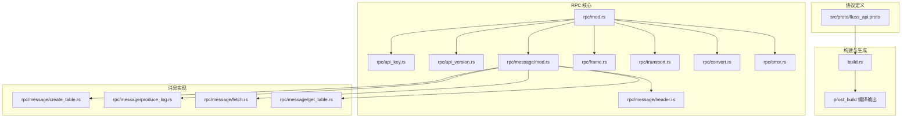
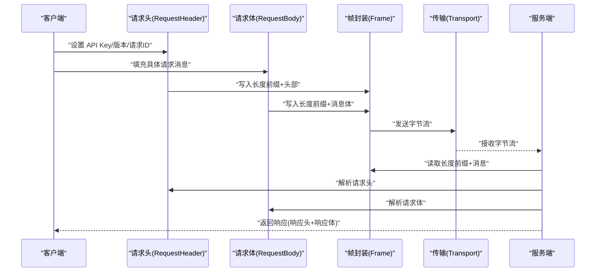
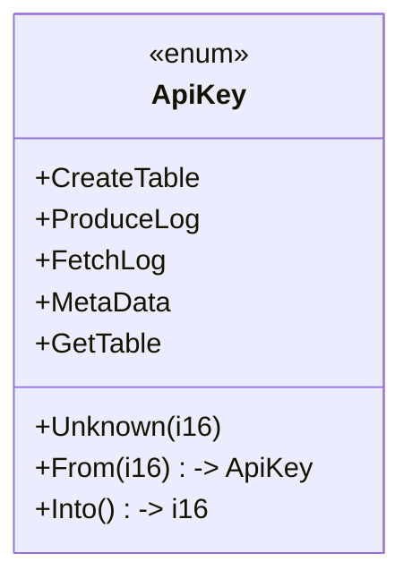
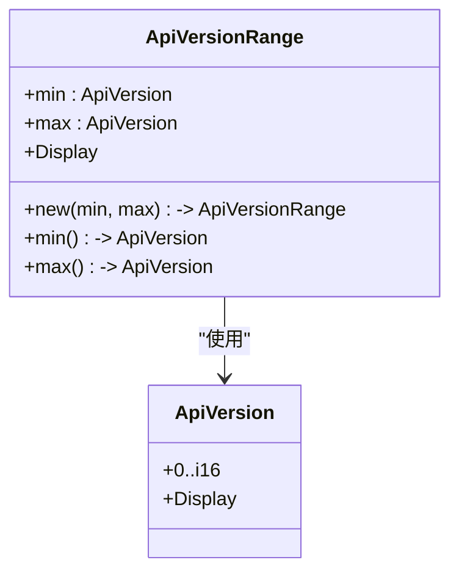
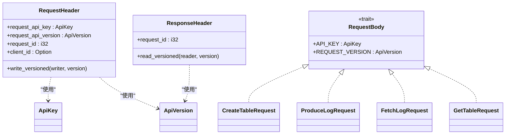
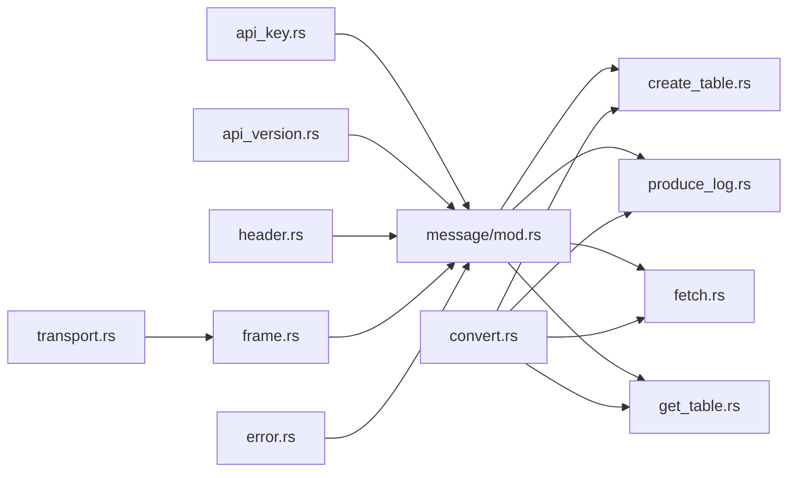

# 协议定义

<cite>
**本文引用的文件**
- [crates/fluss/src/proto/fluss_api.proto](file://crates/fluss/src/proto/fluss_api.proto)
- [crates/fluss/src/rpc/api_key.rs](file://crates/fluss/src/rpc/api_key.rs)
- [crates/fluss/src/rpc/api_version.rs](file://crates/fluss/src/rpc/api_version.rs)
- [crates/fluss/src/rpc/mod.rs](file://crates/fluss/src/rpc/mod.rs)
- [crates/fluss/src/rpc/message/mod.rs](file://crates/fluss/src/rpc/message/mod.rs)
- [crates/fluss/src/rpc/message/header.rs](file://crates/fluss/src/rpc/message/header.rs)
- [crates/fluss/src/rpc/message/create_table.rs](file://crates/fluss/src/rpc/message/create_table.rs)
- [crates/fluss/src/rpc/message/produce_log.rs](file://crates/fluss/src/rpc/message/produce_log.rs)
- [crates/fluss/src/rpc/message/fetch.rs](file://crates/fluss/src/rpc/message/fetch.rs)
- [crates/fluss/src/rpc/message/get_table.rs](file://crates/fluss/src/rpc/message/get_table.rs)
- [crates/fluss/src/rpc/frame.rs](file://crates/fluss/src/rpc/frame.rs)
- [crates/fluss/src/rpc/transport.rs](file://crates/fluss/src/rpc/transport.rs)
- [crates/fluss/src/rpc/convert.rs](file://crates/fluss/src/rpc/convert.rs)
- [crates/fluss/src/rpc/error.rs](file://crates/fluss/src/rpc/error.rs)
- [crates/fluss/src/build.rs](file://crates/fluss/src/build.rs)
</cite>

## 目录
1. [引言](#引言)
2. [项目结构](#项目结构)
3. [核心组件](#核心组件)
4. [架构总览](#架构总览)
5. [详细组件分析](#详细组件分析)
6. [依赖关系分析](#依赖关系分析)
7. [性能考虑](#性能考虑)
8. [故障排查指南](#故障排查指南)
9. [结论](#结论)
10. [附录](#附录)

## 引言
本文件系统性地梳理了 Fluss 的协议定义与实现，重点覆盖以下方面：
- Protocol Buffers 协议文件结构与消息类型定义
- 字段编码规则与数据类型映射
- API Key 管理机制（生成、验证、权限控制）
- API 版本管理系统（版本范围、兼容性策略、升级路径）
- 消息格式规范（请求/响应结构、字段约束、默认值处理）
- 协议编译与使用示例（代码生成、消息序列化、反序列化）
- 协议演进最佳实践与注意事项

## 项目结构
Fluss 的 RPC 协议由一组 .proto 文件定义，并通过构建脚本在编译期生成 Rust 代码；运行时通过统一的消息抽象层进行序列化/反序列化与传输。

图表来源
- [crates/fluss/src/proto/fluss_api.proto](file://crates/fluss/src/proto/fluss_api.proto#L1-L197)
- [crates/fluss/src/build.rs](file://crates/fluss/src/build.rs#L20-L23)
- [crates/fluss/src/rpc/mod.rs](file://crates/fluss/src/rpc/mod.rs#L18-L31)
- [crates/fluss/src/rpc/api_key.rs](file://crates/fluss/src/rpc/api_key.rs#L20-L54)
- [crates/fluss/src/rpc/api_version.rs](file://crates/fluss/src/rpc/api_version.rs#L18-L54)
- [crates/fluss/src/rpc/message/mod.rs](file://crates/fluss/src/rpc/message/mod.rs#L18-L97)
- [crates/fluss/src/rpc/message/header.rs](file://crates/fluss/src/rpc/message/header.rs#L32-L73)
- [crates/fluss/src/rpc/frame.rs](file://crates/fluss/src/rpc/frame.rs#L34-L106)
- [crates/fluss/src/rpc/transport.rs](file://crates/fluss/src/rpc/transport.rs#L26-L83)
- [crates/fluss/src/rpc/convert.rs](file://crates/fluss/src/rpc/convert.rs#L22-L43)
- [crates/fluss/src/rpc/error.rs](file://crates/fluss/src/rpc/error.rs#L23-L50)
- [crates/fluss/src/rpc/message/create_table.rs](file://crates/fluss/src/rpc/message/create_table.rs#L32-L62)
- [crates/fluss/src/rpc/message/produce_log.rs](file://crates/fluss/src/rpc/message/produce_log.rs#L31-L71)
- [crates/fluss/src/rpc/message/fetch.rs](file://crates/fluss/src/rpc/message/fetch.rs#L35-L56)
- [crates/fluss/src/rpc/message/get_table.rs](file://crates/fluss/src/rpc/message/get_table.rs#L29-L54)

章节来源
- [crates/fluss/src/proto/fluss_api.proto](file://crates/fluss/src/proto/fluss_api.proto#L18-L197)
- [crates/fluss/src/build.rs](file://crates/fluss/src/build.rs#L20-L23)
- [crates/fluss/src/rpc/mod.rs](file://crates/fluss/src/rpc/mod.rs#L18-L31)

## 核心组件
- 协议定义：以 .proto 文件集中描述请求/响应消息、嵌套消息与字段语义。
- API Key 与版本：通过枚举与结构体管理 API 类型与版本范围。
- 消息抽象与序列化：通过 traits 与宏为各消息实现版本化的读写接口。
- 传输与帧封装：基于字节流的长度前缀帧协议，保障消息边界与大小限制。
- 转换工具：在业务模型与 Protobuf 消息之间进行双向转换。

章节来源
- [crates/fluss/src/rpc/api_key.rs](file://crates/fluss/src/rpc/api_key.rs#L20-L54)
- [crates/fluss/src/rpc/api_version.rs](file://crates/fluss/src/rpc/api_version.rs#L18-L54)
- [crates/fluss/src/rpc/message/mod.rs](file://crates/fluss/src/rpc/message/mod.rs#L37-L97)
- [crates/fluss/src/rpc/frame.rs](file://crates/fluss/src/rpc/frame.rs#L34-L106)
- [crates/fluss/src/rpc/convert.rs](file://crates/fluss/src/rpc/convert.rs#L22-L43)

## 架构总览
下图展示了客户端与服务端之间的典型交互：客户端构造请求消息（含请求头），通过帧封装与传输层发送，服务端解析后返回响应。

图表来源
- [crates/fluss/src/rpc/message/header.rs](file://crates/fluss/src/rpc/message/header.rs#L32-L73)
- [crates/fluss/src/rpc/message/mod.rs](file://crates/fluss/src/rpc/message/mod.rs#L37-L97)
- [crates/fluss/src/rpc/frame.rs](file://crates/fluss/src/rpc/frame.rs#L34-L106)
- [crates/fluss/src/rpc/transport.rs](file://crates/fluss/src/rpc/transport.rs#L67-L83)

## 详细组件分析

### 协议文件结构与消息类型
- 语法与包名：采用 proto2 语法，包名为 proto。
- 请求/响应消息：包含元数据、生产日志、拉取日志、建表、获取表信息等。
- 内部嵌套消息：如表路径、物理表路径、服务器节点、表/分区/桶元信息、远程日志片段等。
- 字段修饰符：required/optional/repeated/packed，用于表达必需性、可选性与数组/压缩编码。
- 兼容性注释：对历史版本差异（如监听器字段替换）进行了明确标注。

章节来源
- [crates/fluss/src/proto/fluss_api.proto](file://crates/fluss/src/proto/fluss_api.proto#L18-L197)

### 字段编码规则与数据类型映射
- 编码规则：采用 Protobuf 默认编码，重复字段支持 packed 压缩（如分区 ID、投影字段）。
- 数据类型映射：字符串、整数、布尔、字节序列等与 Rust 类型一一对应。
- 长度前缀帧：传输层以 4 字节大端整型表示消息长度，确保跨网络边界安全。

章节来源
- [crates/fluss/src/proto/fluss_api.proto](file://crates/fluss/src/proto/fluss_api.proto#L20-L31)
- [crates/fluss/src/proto/fluss_api.proto](file://crates/fluss/src/proto/fluss_api.proto#L140-L183)
- [crates/fluss/src/rpc/frame.rs](file://crates/fluss/src/rpc/frame.rs#L45-L76)

### API Key 管理机制
- 定义与映射：通过枚举定义 API 类型，提供 i16 互转逻辑，便于在网络层与业务层之间传递。
- 使用场景：每个请求体实现中声明 API Key 常量，用于标识请求类型。
- 权限控制：API Key 作为请求头的一部分，配合服务端路由与鉴权策略实现访问控制。

图表来源
- [crates/fluss/src/rpc/api_key.rs](file://crates/fluss/src/rpc/api_key.rs#L20-L54)

章节来源
- [crates/fluss/src/rpc/api_key.rs](file://cruss/src/rpc/api_key.rs#L20-L54)
- [crates/fluss/src/rpc/message/create_table.rs](file://crates/fluss/src/rpc/message/create_table.rs#L53-L59)
- [crates/fluss/src/rpc/message/produce_log.rs](file://crates/fluss/src/rpc/message/produce_log.rs#L62-L68)
- [crates/fluss/src/rpc/message/fetch.rs](file://crates/fluss/src/rpc/message/fetch.rs#L47-L53)
- [crates/fluss/src/rpc/message/get_table.rs](file://crates/fluss/src/rpc/message/get_table.rs#L47-L51)

### API 版本管理系统
- 版本结构：使用结构体封装版本号，提供最小/最大版本范围与显示格式。
- 版本范围：通过常量结构体定义可用版本区间，确保客户端与服务端兼容。
- 升级路径：新版本在保持向后兼容的前提下扩展字段或新增 API，旧版本客户端自动降级。

图表来源
- [crates/fluss/src/rpc/api_version.rs](file://crates/fluss/src/rpc/api_version.rs#L18-L54)

章节来源
- [crates/fluss/src/rpc/api_version.rs](file://crates/fluss/src/rpc/api_version.rs#L18-L54)
- [crates/fluss/src/rpc/message/mod.rs](file://crates/fluss/src/rpc/message/mod.rs#L37-L65)

### 消息格式规范
- 请求头：包含 API Key、API 版本、请求 ID 以及可选客户端 ID，固定长度且按序写入。
- 响应头：包含响应类型标记与请求 ID，当前实现仅处理成功响应。
- 请求体：每个业务请求均实现 RequestBody trait，声明 API Key 与请求版本。
- 响应体：与请求体一一对应，通过 prost 反序列化得到。

图表来源
- [crates/fluss/src/rpc/message/header.rs](file://crates/fluss/src/rpc/message/header.rs#L32-L73)
- [crates/fluss/src/rpc/message/mod.rs](file://crates/fluss/src/rpc/message/mod.rs#L37-L65)
- [crates/fluss/src/rpc/message/create_table.rs](file://crates/fluss/src/rpc/message/create_table.rs#L53-L59)
- [crates/fluss/src/rpc/message/produce_log.rs](file://crates/fluss/src/rpc/message/produce_log.rs#L62-L68)
- [crates/fluss/src/rpc/message/fetch.rs](file://crates/fluss/src/rpc/message/fetch.rs#L47-L53)
- [crates/fluss/src/rpc/message/get_table.rs](file://crates/fluss/src/rpc/message/get_table.rs#L47-L51)

章节来源
- [crates/fluss/src/rpc/message/header.rs](file://crates/fluss/src/rpc/message/header.rs#L32-L73)
- [crates/fluss/src/rpc/message/mod.rs](file://crates/fluss/src/rpc/message/mod.rs#L37-L65)

### 协议编译与使用示例
- 编译配置：构建脚本调用 prost_build 对指定 proto 文件进行编译，生成 Rust 源码。
- 代码生成：生成的消息类型与服务桩在运行时被请求体实现使用。
- 序列化/反序列化：通过宏为请求体实现版本化写入与读取，内部委托 prost 进行编码/解码。
- 示例路径：
  - 建表请求：构造内层消息并填充表路径与 JSON 描述，随后写入。
  - 生产日志请求：聚合多个批次为桶级请求，写入字节记录。
  - 拉取日志请求：直接包装底层消息并写入。
  - 获取表信息请求：构造表路径并写入。

章节来源
- [crates/fluss/src/build.rs](file://crates/fluss/src/build.rs#L20-L23)
- [crates/fluss/src/rpc/message/create_table.rs](file://crates/fluss/src/rpc/message/create_table.rs#L32-L62)
- [crates/fluss/src/rpc/message/produce_log.rs](file://crates/fluss/src/rpc/message/produce_log.rs#L31-L71)
- [crates/fluss/src/rpc/message/fetch.rs](file://crates/fluss/src/rpc/message/fetch.rs#L35-L56)
- [crates/fluss/src/rpc/message/get_table.rs](file://crates/fluss/src/rpc/message/get_table.rs#L29-L54)

### 协议演进最佳实践与注意事项
- 向后兼容：新增字段必须为 optional 或有默认值，避免破坏旧客户端解析。
- 字段编号：禁止复用已弃用编号，新增字段应分配新编号并保持顺序增长。
- 批处理字段：对长数组使用 packed 编码减少体积（如分区 ID、投影字段）。
- 版本范围：服务端维护最小/最大版本范围，客户端在范围内选择兼容版本。
- 错误处理：严格区分“消息过大”“数据剩余”等错误，确保连接健康与诊断清晰。

章节来源
- [crates/fluss/src/proto/fluss_api.proto](file://crates/fluss/src/proto/fluss_api.proto#L20-L31)
- [crates/fluss/src/rpc/api_version.rs](file://crates/fluss/src/rpc/api_version.rs#L34-L48)
- [crates/fluss/src/rpc/error.rs](file://crates/fluss/src/rpc/error.rs#L42-L49)

## 依赖关系分析
- 协议到实现：proto 消息被各请求体实现使用；请求体实现依赖 API Key/版本与帧封装。
- 转换层：convert 模块负责业务模型与 Protobuf 消息之间的互转。
- 传输层：transport 提供 TCP 连接能力，frame 提供长度前缀帧读写。
- 错误体系：统一的 RpcError 封装 IO、帧读写、连接与数据剩余等问题。

图表来源
- [crates/fluss/src/rpc/api_key.rs](file://crates/fluss/src/rpc/api_key.rs#L20-L54)
- [crates/fluss/src/rpc/api_version.rs](file://crates/fluss/src/rpc/api_version.rs#L18-L54)
- [crates/fluss/src/rpc/message/mod.rs](file://crates/fluss/src/rpc/message/mod.rs#L18-L35)
- [crates/fluss/src/rpc/message/header.rs](file://crates/fluss/src/rpc/message/header.rs#L32-L73)
- [crates/fluss/src/rpc/frame.rs](file://crates/fluss/src/rpc/frame.rs#L34-L106)
- [crates/fluss/src/rpc/transport.rs](file://crates/fluss/src/rpc/transport.rs#L26-L83)
- [crates/fluss/src/rpc/convert.rs](file://crates/fluss/src/rpc/convert.rs#L22-L43)
- [crates/fluss/src/rpc/error.rs](file://crates/fluss/src/rpc/error.rs#L23-L50)
- [crates/fluss/src/rpc/message/create_table.rs](file://crates/fluss/src/rpc/message/create_table.rs#L32-L62)
- [crates/fluss/src/rpc/message/produce_log.rs](file://crates/fluss/src/rpc/message/produce_log.rs#L31-L71)
- [crates/fluss/src/rpc/message/fetch.rs](file://crates/fluss/src/rpc/message/fetch.rs#L35-L56)
- [crates/fluss/src/rpc/message/get_table.rs](file://crates/fluss/src/rpc/message/get_table.rs#L29-L54)

章节来源
- [crates/fluss/src/rpc/mod.rs](file://crates/fluss/src/rpc/mod.rs#L18-L31)

## 性能考虑
- 压缩数组：对长整型数组启用 packed 编码，降低消息体积。
- 帧大小限制：读取端对消息长度进行上限检查，防止内存滥用。
- 批量写入：生产日志请求按桶聚合多批次，减少网络往返。
- 连接超时：传输层支持可选超时，避免阻塞。

章节来源
- [crates/fluss/src/proto/fluss_api.proto](file://crates/fluss/src/proto/fluss_api.proto#L20-L31)
- [crates/fluss/src/rpc/frame.rs](file://crates/fluss/src/rpc/frame.rs#L45-L76)
- [crates/fluss/src/rpc/transport.rs](file://crates/fluss/src/rpc/transport.rs#L67-L83)
- [crates/fluss/src/rpc/message/produce_log.rs](file://crates/fluss/src/rpc/message/produce_log.rs#L35-L59)

## 故障排查指南
- 消息过大：当读取到超过阈值的消息时，会抛出“消息过大”错误并跳过剩余字节。
- 数据剩余：若解析后仍有未消费字节，会报告“数据剩余”错误，便于定位协议不匹配问题。
- 连接异常：连接超时或 IO 错误会统一包装为 RpcError，便于上层处理。
- 帧错误：读写错误分别封装为 ReadError/WriteError，包含具体原因与上下文。

章节来源
- [crates/fluss/src/rpc/frame.rs](file://crates/fluss/src/rpc/frame.rs#L21-L32)
- [crates/fluss/src/rpc/frame.rs](file://crates/fluss/src/rpc/frame.rs#L79-L87)
- [crates/fluss/src/rpc/error.rs](file://crates/fluss/src/rpc/error.rs#L25-L50)

## 结论
本协议体系以 proto2 为基础，结合版本化消息抽象与长度前缀帧协议，实现了稳定、可演进的 RPC 通信框架。通过 API Key/版本管理、严格的字段约束与错误处理，既保证了向前兼容，也为后续扩展提供了清晰路径。建议在新增字段时遵循“可选/默认值”原则，并持续完善版本范围与兼容性测试。

## 附录
- 协议编译命令参考：在构建阶段执行编译器以生成 Rust 源码。
- 常见请求体映射：
  - 建表请求：CreateTableRequest
  - 生产日志请求：ProduceLogRequest
  - 拉取日志请求：FetchLogRequest
  - 获取表信息请求：GetTableRequest

章节来源
- [crates/fluss/src/build.rs](file://crates/fluss/src/build.rs#L20-L23)
- [crates/fluss/src/rpc/message/create_table.rs](file://crates/fluss/src/rpc/message/create_table.rs#L32-L62)
- [crates/fluss/src/rpc/message/produce_log.rs](file://crates/fluss/src/rpc/message/produce_log.rs#L31-L71)
- [crates/fluss/src/rpc/message/fetch.rs](file://crates/fluss/src/rpc/message/fetch.rs#L35-L56)
- [crates/fluss/src/rpc/message/get_table.rs](file://crates/fluss/src/rpc/message/get_table.rs#L29-L54)