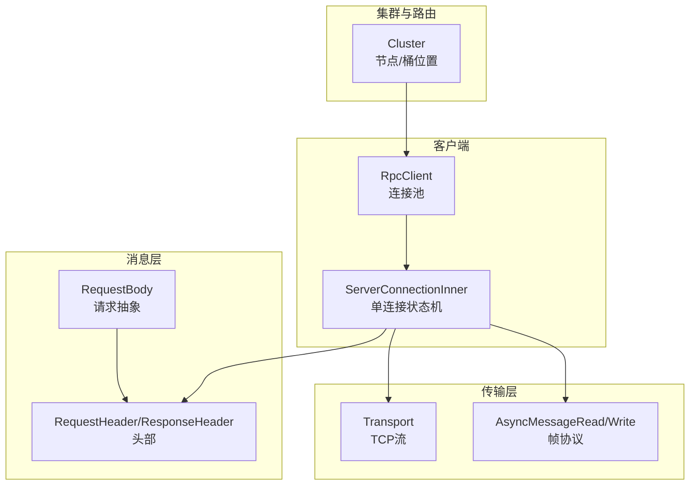
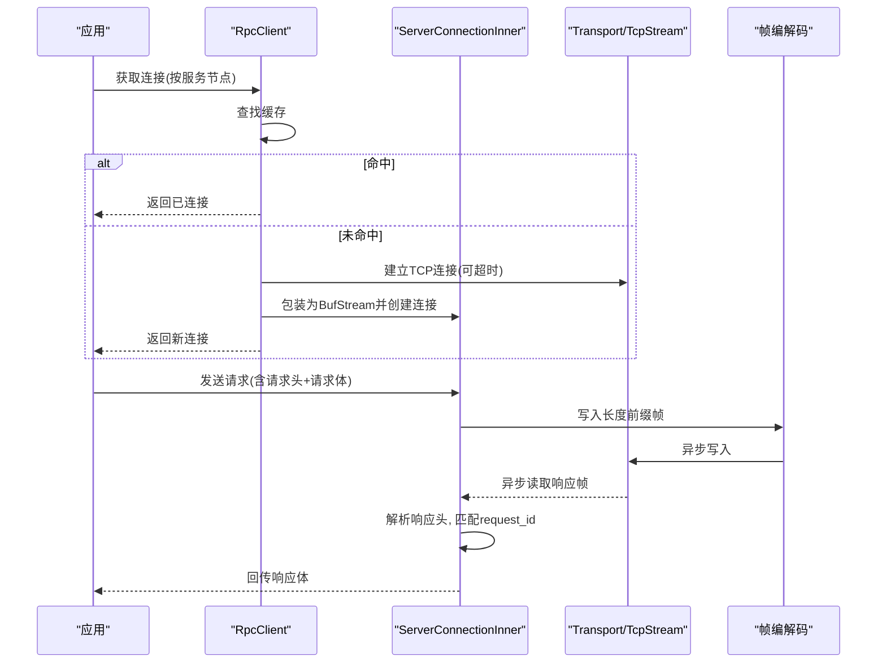
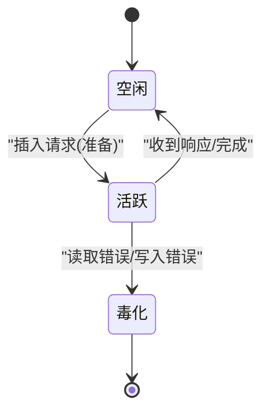
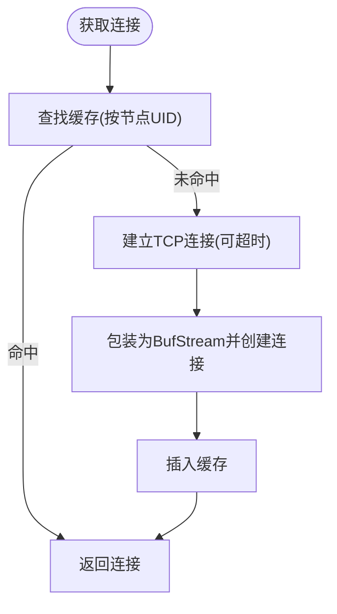
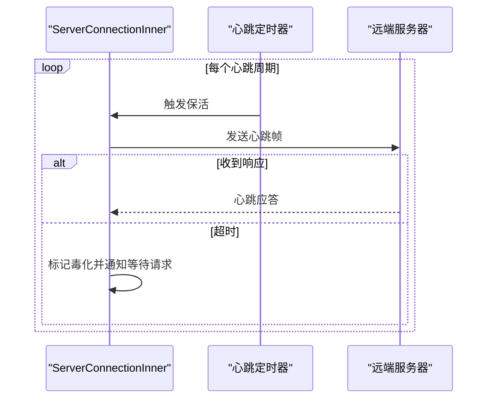
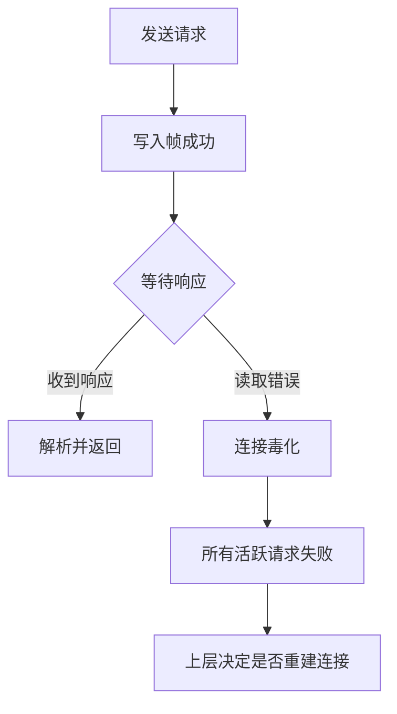
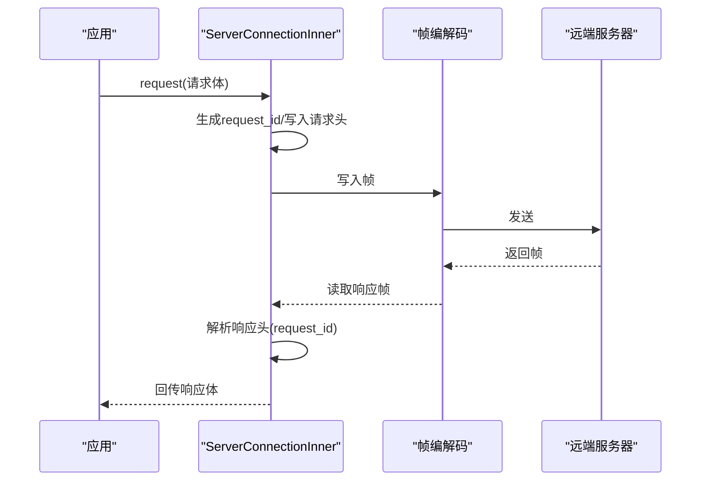
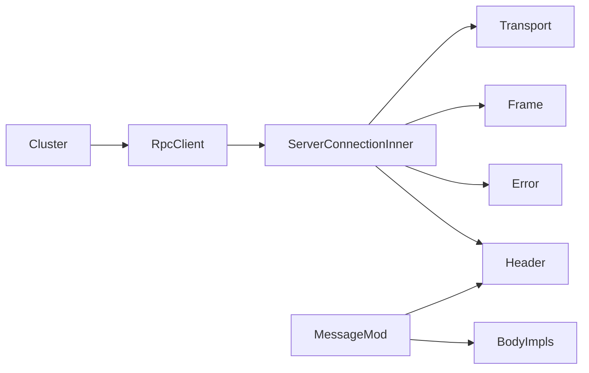

# 服务器连接

<cite>
**本文引用的文件**
- [crates/fluss/src/rpc/server_connection.rs](file://crates/fluss/src/rpc/server_connection.rs)
- [crates/fluss/src/rpc/transport.rs](file://crates/fluss/src/rpc/transport.rs)
- [crates/fluss/src/rpc/frame.rs](file://crates/fluss/src/rpc/frame.rs)
- [crates/fluss/src/rpc/error.rs](file://crates/fluss/src/rpc/error.rs)
- [crates/fluss/src/rpc/message/mod.rs](file://crates/fluss/src/rpc/message/mod.rs)
- [crates/fluss/src/rpc/message/header.rs](file://crates/fluss/src/rpc/message/header.rs)
- [crates/fluss/src/rpc/message/fetch.rs](file://crates/fluss/src/rpc/message/fetch.rs)
- [crates/fluss/src/rpc/message/produce_log.rs](file://crates/fluss/src/rpc/message/produce_log.rs)
- [crates/fluss/src/client/connection.rs](file://crates/fluss/src/client/connection.rs)
- [crates/fluss/src/cluster/cluster.rs](file://crates/fluss/src/cluster/cluster.rs)
- [crates/fluss/src/config.rs](file://crates/fluss/src/config.rs)
</cite>

## 目录
1. [简介](#简介)
2. [项目结构](#项目结构)
3. [核心组件](#核心组件)
4. [架构总览](#架构总览)
5. [详细组件分析](#详细组件分析)
6. [依赖关系分析](#依赖关系分析)
7. [性能考量](#性能考量)
8. [故障排查指南](#故障排查指南)
9. [结论](#结论)
10. [附录：使用示例与最佳实践](#附录使用示例与最佳实践)

## 简介
本文件聚焦于服务器连接子系统，系统性阐述 ServerConnection 的设计与实现，覆盖连接生命周期管理、状态维护、资源清理；连接池机制（连接复用、并发控制、资源限制）；心跳与保活策略（当前实现中未内置心跳，但可基于现有框架扩展）；故障恢复机制（断开检测、错误传播、自动重连建议）；以及使用示例、监控与诊断方法。目标是帮助开发者在不深入源码细节的情况下，也能正确、安全地使用连接层。

## 项目结构
围绕 RPC 连接与消息编解码的关键模块如下：
- 连接与客户端
  - 客户端封装：RpcClient 负责按服务节点缓存与复用连接
  - 服务器连接：ServerConnectionInner 封装单连接的读写、请求分发、状态机
- 传输与帧编解码
  - Transport 提供 TCP 连接封装
  - AsyncMessageRead/AsyncMessageWrite 实现带长度前缀的消息帧协议
- 消息与版本化编解码
  - RequestBody/ReadVersionedType/WriteVersionedType 抽象请求/响应的版本化序列化
  - 请求头/响应头定义请求标识与版本
- 集群与路由
  - Cluster 提供服务节点与桶位置信息，驱动客户端选择正确的连接

**图表来源**
- [crates/fluss/src/rpc/server_connection.rs](file://crates/fluss/src/rpc/server_connection.rs#L44-L97)
- [crates/fluss/src/rpc/transport.rs](file://crates/fluss/src/rpc/transport.rs#L26-L83)
- [crates/fluss/src/rpc/frame.rs](file://crates/fluss/src/rpc/frame.rs#L34-L106)
- [crates/fluss/src/rpc/message/header.rs](file://crates/fluss/src/rpc/message/header.rs#L32-L73)
- [crates/fluss/src/cluster/cluster.rs](file://crates/fluss/src/cluster/cluster.rs#L29-L86)

**章节来源**
- [crates/fluss/src/rpc/server_connection.rs](file://crates/fluss/src/rpc/server_connection.rs#L44-L97)
- [crates/fluss/src/rpc/transport.rs](file://crates/fluss/src/rpc/transport.rs#L26-L83)
- [crates/fluss/src/rpc/frame.rs](file://crates/fluss/src/rpc/frame.rs#L34-L106)
- [crates/fluss/src/rpc/message/header.rs](file://crates/fluss/src/rpc/message/header.rs#L32-L73)
- [crates/fluss/src/cluster/cluster.rs](file://crates/fluss/src/cluster/cluster.rs#L29-L86)

## 核心组件
- RpcClient
  - 职责：按服务节点 UID 缓存 ServerConnection，避免重复握手；支持超时配置与最大消息大小
  - 关键点：通过 RwLock 维护连接映射；首次连接失败会返回错误；后续复用已存在的连接
- ServerConnectionInner
  - 职责：封装单连接的读写、请求-响应匹配、状态机（活跃请求表、毒化态）、发送取消安全包装
  - 关键点：分离读写半部；后台任务循环读取帧；根据响应头 request_id 匹配回调；错误时毒化整条连接
- Transport
  - 职责：基于 TcpStream 的异步读写适配器，支持可选超时连接
- AsyncMessageRead/AsyncMessageWrite
  - 职责：实现带长度前缀的帧协议，保障消息边界与大小限制
- 错误模型
  - RpcError：统一承载写入/读取/连接/毒化/数据剩余等错误类型
- 消息抽象
  - RequestBody/ReadVersionedType/WriteVersionedType：请求/响应的版本化编解码接口
  - RequestHeader/ResponseHeader：请求标识与版本字段

**章节来源**
- [crates/fluss/src/rpc/server_connection.rs](file://crates/fluss/src/rpc/server_connection.rs#L44-L97)
- [crates/fluss/src/rpc/server_connection.rs](file://crates/fluss/src/rpc/server_connection.rs#L147-L231)
- [crates/fluss/src/rpc/transport.rs](file://crates/fluss/src/rpc/transport.rs#L26-L83)
- [crates/fluss/src/rpc/frame.rs](file://crates/fluss/src/rpc/frame.rs#L34-L106)
- [crates/fluss/src/rpc/error.rs](file://crates/fluss/src/rpc/error.rs#L23-L50)
- [crates/fluss/src/rpc/message/mod.rs](file://crates/fluss/src/rpc/message/mod.rs#L37-L65)
- [crates/fluss/src/rpc/message/header.rs](file://crates/fluss/src/rpc/message/header.rs#L32-L73)

## 架构总览
下图展示从应用侧到网络层的整体调用链路与职责划分：

**图表来源**
- [crates/fluss/src/rpc/server_connection.rs](file://crates/fluss/src/rpc/server_connection.rs#L64-L96)
- [crates/fluss/src/rpc/transport.rs](file://crates/fluss/src/rpc/transport.rs#L67-L82)
- [crates/fluss/src/rpc/frame.rs](file://crates/fluss/src/rpc/frame.rs#L93-L106)
- [crates/fluss/src/rpc/message/header.rs](file://crates/fluss/src/rpc/message/header.rs#L32-L73)

## 详细组件分析

### ServerConnection 生命周期与状态维护
- 生命周期
  - 创建：RpcClient.connect 建立 Transport 并包裹为 BufStream，构造 ServerConnectionInner
  - 使用：通过 request 发送请求，内部生成 request_id，写入帧后等待响应
  - 关闭：Drop 中终止后台读取任务（当前不会主动关闭底层连接）
- 状态维护
  - ConnectionState：维护活跃请求映射或毒化态；毒化后拒绝新请求并广播错误给所有等待者
  - ActiveRequest：每个请求对应一个 oneshot 通道，用于回传响应或错误
  - request_id：原子自增，确保请求唯一标识
- 资源清理
  - 后台读取任务在毒化或读取错误时退出
  - 取消发送：CancellationSafeFuture 确保写入不可被取消中断
  - 取消请求：CleanupRequestStateOnCancel 在取消前移除未发送的请求记录

**图表来源**
- [crates/fluss/src/rpc/server_connection.rs](file://crates/fluss/src/rpc/server_connection.rs#L112-L145)
- [crates/fluss/src/rpc/server_connection.rs](file://crates/fluss/src/rpc/server_connection.rs#L233-L287)

**章节来源**
- [crates/fluss/src/rpc/server_connection.rs](file://crates/fluss/src/rpc/server_connection.rs#L147-L231)
- [crates/fluss/src/rpc/server_connection.rs](file://crates/fluss/src/rpc/server_connection.rs#L112-L145)
- [crates/fluss/src/rpc/server_connection.rs](file://crates/fluss/src/rpc/server_connection.rs#L314-L319)

### 连接池机制：复用、并发与限制
- 复用
  - RpcClient 按服务节点 UID 缓存连接；首次连接后复用，避免重复握手
- 并发控制
  - 单连接内通过请求映射与互斥锁保护状态；请求以串行方式排队发送
  - 写操作使用 AsyncMutex 保护 WriteHalf，避免竞态
- 资源限制
  - 最大消息大小：由 RpcClient 初始化时传入，帧读取阶段进行上限检查
  - 连接数：当前实现按节点维度缓存单连接；如需多路复用可在上层扩展

**图表来源**
- [crates/fluss/src/rpc/server_connection.rs](file://crates/fluss/src/rpc/server_connection.rs#L64-L96)
- [crates/fluss/src/rpc/transport.rs](file://crates/fluss/src/rpc/transport.rs#L67-L82)

**章节来源**
- [crates/fluss/src/rpc/server_connection.rs](file://crates/fluss/src/rpc/server_connection.rs#L44-L97)
- [crates/fluss/src/rpc/frame.rs](file://crates/fluss/src/rpc/frame.rs#L45-L76)

### 心跳机制与保活策略
- 当前实现
  - 未内置心跳/保活定时器；连接保持依赖应用侧业务请求驱动
- 扩展建议
  - 在 ServerConnectionInner 中新增后台任务，周期性发送轻量探测帧
  - 设置读超时与空闲保活阈值，结合毒化机制快速失败
  - 在 RpcClient 层增加“健康检查”与“自动重建”策略

[本图为概念性扩展示意，非现有实现，故无图表来源]

### 故障恢复机制：断开检测、重连与一致性
- 断开检测
  - 读取错误触发毒化：所有活跃请求立即失败，避免悬挂等待
  - 写入错误同样毒化，防止帧格式错乱导致后续读取失败
- 重连策略
  - 当前未在连接层自动重试；建议在上层调用方捕获 RpcError::Poisoned 后重建连接
  - 可结合集群元数据重新选择可用节点
- 数据一致性
  - 未收到完整响应的请求视为失败，避免部分数据被误用
  - 上层应根据业务语义决定重试范围与幂等处理

**图表来源**
- [crates/fluss/src/rpc/server_connection.rs](file://crates/fluss/src/rpc/server_connection.rs#L216-L221)
- [crates/fluss/src/rpc/server_connection.rs](file://crates/fluss/src/rpc/server_connection.rs#L289-L298)

**章节来源**
- [crates/fluss/src/rpc/server_connection.rs](file://crates/fluss/src/rpc/server_connection.rs#L112-L145)
- [crates/fluss/src/rpc/error.rs](file://crates/fluss/src/rpc/error.rs#L23-L50)

### 消息编解码与请求流程
- 请求头
  - 包含 API Key、版本、request_id、client_id
- 请求体
  - 通过 WriteVersionedType 写入版本化内容
- 响应头
  - 包含 request_id；当前实现仅处理成功类型
- 流程
  - request 内部组装请求头与请求体，写入帧后等待 oneshot 回调

**图表来源**
- [crates/fluss/src/rpc/server_connection.rs](file://crates/fluss/src/rpc/server_connection.rs#L233-L287)
- [crates/fluss/src/rpc/message/header.rs](file://crates/fluss/src/rpc/message/header.rs#L32-L73)
- [crates/fluss/src/rpc/frame.rs](file://crates/fluss/src/rpc/frame.rs#L93-L106)

**章节来源**
- [crates/fluss/src/rpc/message/mod.rs](file://crates/fluss/src/rpc/message/mod.rs#L37-L65)
- [crates/fluss/src/rpc/message/header.rs](file://crates/fluss/src/rpc/message/header.rs#L32-L73)
- [crates/fluss/src/rpc/message/fetch.rs](file://crates/fluss/src/rpc/message/fetch.rs#L35-L57)
- [crates/fluss/src/rpc/message/produce_log.rs](file://crates/fluss/src/rpc/message/produce_log.rs#L31-L72)

## 依赖关系分析
- 组件耦合
  - RpcClient 依赖 Transport 与 ServerConnectionInner
  - ServerConnectionInner 依赖 Transport、帧编解码、消息头与错误模型
  - 消息层通过 traits 与具体请求实现解耦
- 外部依赖
  - Tokio 异步运行时、parking_lot 并发原语、prost/bytes 编解码
- 潜在环依赖
  - 当前模块间为单向依赖，无明显环

**图表来源**
- [crates/fluss/src/rpc/server_connection.rs](file://crates/fluss/src/rpc/server_connection.rs#L44-L97)
- [crates/fluss/src/rpc/transport.rs](file://crates/fluss/src/rpc/transport.rs#L26-L83)
- [crates/fluss/src/rpc/frame.rs](file://crates/fluss/src/rpc/frame.rs#L34-L106)
- [crates/fluss/src/rpc/error.rs](file://crates/fluss/src/rpc/error.rs#L23-L50)
- [crates/fluss/src/rpc/message/mod.rs](file://crates/fluss/src/rpc/message/mod.rs#L37-L65)
- [crates/fluss/src/cluster/cluster.rs](file://crates/fluss/src/cluster/cluster.rs#L29-L86)

**章节来源**
- [crates/fluss/src/rpc/server_connection.rs](file://crates/fluss/src/rpc/server_connection.rs#L44-L97)
- [crates/fluss/src/rpc/message/mod.rs](file://crates/fluss/src/rpc/message/mod.rs#L37-L65)
- [crates/fluss/src/cluster/cluster.rs](file://crates/fluss/src/cluster/cluster.rs#L29-L86)

## 性能考量
- 单连接串行化
  - 请求在单连接内串行发送，避免锁竞争但可能成为高并发瓶颈
  - 建议：按桶/表拆分连接或引入连接池（按业务维度）
- 帧大小限制
  - 通过 max_message_size 防止内存膨胀；过大消息将被拒绝
- 写入安全
  - CancellationSafeFuture 确保写入不会因任务取消而中断，提升可靠性
- 读取与匹配
  - 后台任务持续读取，按 request_id 匹配回调，避免阻塞主流程

[本节为通用性能讨论，无需章节来源]

## 故障排查指南
- 常见错误类型
  - 连接错误：连接超时、地址不可达
  - 读取错误：帧格式异常、长度不一致
  - 写入错误：底层 IO 失败
  - 毒化错误：连接因帧错位或读取失败被标记为毒化
  - 数据剩余：响应未完全读取，可能存在协议不匹配
- 排查步骤
  - 检查连接 URL 与超时配置
  - 确认最大消息大小设置合理
  - 观察日志中关于未知请求 ID 或毒化事件
  - 在捕获 Poisoned 后重建连接并重试
- 相关实现参考
  - 错误类型定义与传播路径
  - 毒化态的广播与清理逻辑

**章节来源**
- [crates/fluss/src/rpc/error.rs](file://crates/fluss/src/rpc/error.rs#L23-L50)
- [crates/fluss/src/rpc/server_connection.rs](file://crates/fluss/src/rpc/server_connection.rs#L112-L145)
- [crates/fluss/src/rpc/server_connection.rs](file://crates/fluss/src/rpc/server_connection.rs#L216-L221)

## 结论
ServerConnection 以简洁可靠的单连接模型实现了请求-响应的匹配与错误传播，配合 RpcClient 的按节点缓存，满足了基本的连接复用需求。当前未内置心跳与自动重连，建议在上层结合集群元数据与业务语义实现健康检查与重试策略。通过帧大小限制与毒化机制，系统在可靠性与资源占用之间取得平衡。未来可考虑引入心跳、连接池扩展与更细粒度的并发控制以适配更高吞吐场景。

[本节为总结性内容，无需章节来源]

## 附录：使用示例与最佳实践
- 连接建立与会话管理
  - 通过 FlussConnection 获取 RpcClient，再按服务节点获取连接
  - 使用连接发送请求（如 FetchLogRequest/ProduceLogRequest），等待响应
- 优雅关闭
  - 当前 Drop 会中止后台读取任务；如需优雅关闭，建议在上层增加显式关闭流程（例如发送关闭帧、等待队列清空）
- 监控与诊断
  - 关注毒化事件与未知请求 ID 日志
  - 记录请求耗时与失败率，定位热点节点
- 最佳实践
  - 合理设置最大消息大小与连接超时
  - 对幂等请求允许有限次数重试
  - 按业务维度（桶/表）拆分连接，降低串行瓶颈

**章节来源**
- [crates/fluss/src/client/connection.rs](file://crates/fluss/src/client/connection.rs#L37-L82)
- [crates/fluss/src/rpc/server_connection.rs](file://crates/fluss/src/rpc/server_connection.rs#L64-L96)
- [crates/fluss/src/rpc/message/fetch.rs](file://crates/fluss/src/rpc/message/fetch.rs#L35-L57)
- [crates/fluss/src/rpc/message/produce_log.rs](file://crates/fluss/src/rpc/message/produce_log.rs#L31-L72)
- [crates/fluss/src/config.rs](file://crates/fluss/src/config.rs#L21-L39)