# 消息处理

<cite>
**本文引用的文件**
- [crates/fluss/src/rpc/message/mod.rs](file://crates/fluss/src/rpc/message/mod.rs)
- [crates/fluss/src/rpc/message/create_table.rs](file://crates/fluss/src/rpc/message/create_table.rs)
- [crates/fluss/src/rpc/message/get_table.rs](file://crates/fluss/src/rpc/message/get_table.rs)
- [crates/fluss/src/rpc/message/fetch.rs](file://crates/fluss/src/rpc/message/fetch.rs)
- [crates/fluss/src/rpc/message/produce_log.rs](file://crates/fluss/src/rpc/message/produce_log.rs)
- [crates/fluss/src/rpc/message/update_metadata.rs](file://crates/fluss/src/rpc/message/update_metadata.rs)
- [crates/fluss/src/rpc/message/header.rs](file://crates/fluss/src/rpc/message/header.rs)
- [crates/fluss/src/rpc/api_key.rs](file://crates/fluss/src/rpc/api_key.rs)
- [crates/fluss/src/rpc/api_version.rs](file://crates/fluss/src/rpc/api_version.rs)
- [crates/fluss/src/proto/fluss_api.proto](file://crates/fluss/src/proto/fluss_api.proto)
- [crates/fluss/src/rpc/frame.rs](file://crates/fluss/src/rpc/frame.rs)
- [crates/fluss/src/rpc/transport.rs](file://crates/fluss/src/rpc/transport.rs)
- [crates/fluss/src/rpc/server_connection.rs](file://crates/fluss/src/rpc/server_connection.rs)
- [crates/fluss/src/rpc/error.rs](file://crates/fluss/src/rpc/error.rs)
- [crates/fluss/src/client/admin.rs](file://crates/fluss/src/client/admin.rs)
</cite>

## 目录
1. [简介](#简介)
2. [项目结构](#项目结构)
3. [核心组件](#核心组件)
4. [架构总览](#架构总览)
5. [详细组件分析](#详细组件分析)
6. [依赖关系分析](#依赖关系分析)
7. [性能考虑](#性能考虑)
8. [故障排查指南](#故障排查指南)
9. [结论](#结论)
10. [附录](#附录)

## 简介
本文件系统性阐述 Fluss 的消息处理模块，覆盖消息分类、处理流程、路由机制、序列化与反序列化、错误处理、性能优化与最佳实践。重点围绕以下消息类型展开：CreateTable、GetTable、Fetch、ProduceLog、UpdateMetadata；并结合 RPC 层的帧协议、传输层、连接管理与响应路由，给出端到端的消息处理示例与调优建议。

## 项目结构
消息处理位于 rpc/message 子模块，采用“消息体 + 头部 + 帧协议 + 连接管理”的分层设计。消息体基于 Protobuf 定义并通过宏简化版本化读写；头部封装 API Key、版本与请求 ID；帧协议负责长度前缀的网络编解码；连接管理负责多路复用、请求-响应匹配与错误传播。

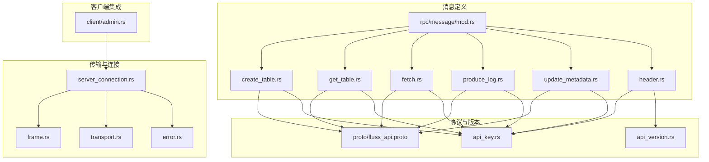

**图示来源**
- [crates/fluss/src/rpc/message/mod.rs](file://crates/fluss/src/rpc/message/mod.rs#L1-L98)
- [crates/fluss/src/rpc/message/create_table.rs](file://crates/fluss/src/rpc/message/create_table.rs#L1-L63)
- [crates/fluss/src/rpc/message/get_table.rs](file://crates/fluss/src/rpc/message/get_table.rs#L1-L55)
- [crates/fluss/src/rpc/message/fetch.rs](file://crates/fluss/src/rpc/message/fetch.rs#L1-L57)
- [crates/fluss/src/rpc/message/produce_log.rs](file://crates/fluss/src/rpc/message/produce_log.rs#L1-L72)
- [crates/fluss/src/rpc/message/update_metadata.rs](file://crates/fluss/src/rpc/message/update_metadata.rs#L1-L61)
- [crates/fluss/src/rpc/message/header.rs](file://crates/fluss/src/rpc/message/header.rs#L1-L74)
- [crates/fluss/src/rpc/api_key.rs](file://crates/fluss/src/rpc/api_key.rs#L1-L55)
- [crates/fluss/src/rpc/api_version.rs](file://crates/fluss/src/rpc/api_version.rs#L1-L55)
- [crates/fluss/src/proto/fluss_api.proto](file://crates/fluss/src/proto/fluss_api.proto#L1-L197)
- [crates/fluss/src/rpc/frame.rs](file://crates/fluss/src/rpc/frame.rs#L1-L107)
- [crates/fluss/src/rpc/transport.rs](file://crates/fluss/src/rpc/transport.rs#L1-L84)
- [crates/fluss/src/rpc/server_connection.rs](file://crates/fluss/src/rpc/server_connection.rs#L1-L403)
- [crates/fluss/src/rpc/error.rs](file://crates/fluss/src/rpc/error.rs#L1-L51)
- [crates/fluss/src/client/admin.rs](file://crates/fluss/src/client/admin.rs#L1-L94)

**章节来源**
- [crates/fluss/src/rpc/message/mod.rs](file://crates/fluss/src/rpc/message/mod.rs#L1-L98)
- [crates/fluss/src/rpc/message/header.rs](file://crates/fluss/src/rpc/message/header.rs#L1-L74)
- [crates/fluss/src/rpc/api_key.rs](file://crates/fluss/src/rpc/api_key.rs#L1-L55)
- [crates/fluss/src/rpc/api_version.rs](file://crates/fluss/src/rpc/api_version.rs#L1-L55)
- [crates/fluss/src/proto/fluss_api.proto](file://crates/fluss/src/proto/fluss_api.proto#L1-L197)
- [crates/fluss/src/rpc/frame.rs](file://crates/fluss/src/rpc/frame.rs#L1-L107)
- [crates/fluss/src/rpc/transport.rs](file://crates/fluss/src/rpc/transport.rs#L1-L84)
- [crates/fluss/src/rpc/server_connection.rs](file://crates/fluss/src/rpc/server_connection.rs#L1-L403)
- [crates/fluss/src/rpc/error.rs](file://crates/fluss/src/rpc/error.rs#L1-L51)
- [crates/fluss/src/client/admin.rs](file://crates/fluss/src/client/admin.rs#L1-L94)

## 核心组件
- 消息体与接口
  - 请求体 trait：RequestBody，统一声明 API Key、版本与响应体类型。
  - 版本化读写 trait：WriteVersionedType、ReadVersionedType，配合宏简化实现。
  - 具体消息：CreateTable、GetTable、Fetch、ProduceLog、UpdateMetadata。
- 协议与版本
  - ApiKey：枚举各消息的 API Key，并提供 i16 转换。
  - ApiVersion：版本号包装，支持范围显示。
- 头部与帧
  - RequestHeader/ResponseHeader：请求头包含 API Key、版本、请求 ID、可选客户端 ID；响应头包含状态与请求 ID。
  - 帧协议：长度前缀（i32 big-endian）+ 负载，提供异步读写能力与最大消息大小限制。
- 传输与连接
  - Transport：基于 TCP 的异步读写适配器。
  - ServerConnection：维护单连接的请求队列、请求 ID、后台读协程、响应路由与错误传播。
  - RpcClient：按服务节点缓存连接，提供连接复用与超时控制。
- 错误模型
  - RpcError：统一承载写入/读取/连接/中毒/数据剩余等错误。

**章节来源**
- [crates/fluss/src/rpc/message/mod.rs](file://crates/fluss/src/rpc/message/mod.rs#L37-L98)
- [crates/fluss/src/rpc/api_key.rs](file://crates/fluss/src/rpc/api_key.rs#L20-L55)
- [crates/fluss/src/rpc/api_version.rs](file://crates/fluss/src/rpc/api_version.rs#L18-L55)
- [crates/fluss/src/rpc/message/header.rs](file://crates/fluss/src/rpc/message/header.rs#L32-L74)
- [crates/fluss/src/rpc/frame.rs](file://crates/fluss/src/rpc/frame.rs#L21-L107)
- [crates/fluss/src/rpc/transport.rs](file://crates/fluss/src/rpc/transport.rs#L26-L84)
- [crates/fluss/src/rpc/server_connection.rs](file://crates/fluss/src/rpc/server_connection.rs#L46-L97)
- [crates/fluss/src/rpc/error.rs](file://crates/fluss/src/rpc/error.rs#L23-L51)

## 架构总览
消息处理从客户端发起，经由 RpcClient 获取或复用连接，ServerConnection 封装请求头与消息体，通过帧协议在网络层传输，服务端解析后返回响应，ServerConnection 再根据请求 ID 匹配并投递结果。

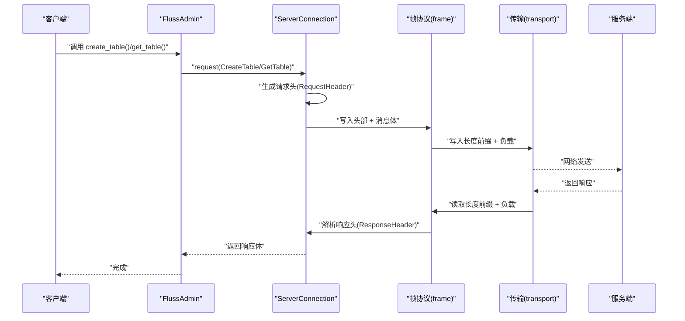

**图示来源**
- [crates/fluss/src/client/admin.rs](file://crates/fluss/src/client/admin.rs#L52-L92)
- [crates/fluss/src/rpc/server_connection.rs](file://crates/fluss/src/rpc/server_connection.rs#L233-L287)
- [crates/fluss/src/rpc/frame.rs](file://crates/fluss/src/rpc/frame.rs#L34-L106)
- [crates/fluss/src/rpc/transport.rs](file://crates/fluss/src/rpc/transport.rs#L31-L65)

## 详细组件分析

### 消息分类与设计原则
- 分类维度
  - 管理类：CreateTable、GetTable、UpdateMetadata
  - 数据类：ProduceLog、Fetch
- 设计原则
  - 统一接口：所有消息实现 RequestBody，暴露 API Key 与版本。
  - 版本化：通过 WriteVersionedType/ReadVersionedType 与宏简化实现。
  - 可扩展：新增消息只需定义 Protobuf 消息体与适配层。

**章节来源**
- [crates/fluss/src/rpc/message/mod.rs](file://crates/fluss/src/rpc/message/mod.rs#L37-L98)
- [crates/fluss/src/rpc/api_key.rs](file://crates/fluss/src/rpc/api_key.rs#L20-L55)
- [crates/fluss/src/proto/fluss_api.proto](file://crates/fluss/src/proto/fluss_api.proto#L117-L147)

### CreateTable 消息
- 功能：在指定表路径创建表，可选择忽略已存在。
- 关键点
  - 构造函数将 TablePath 与 TableDescriptor 序列化为 Protobuf 字段。
  - 使用宏实现版本化写入与读取。
- 交互
  - 客户端通过 FlussAdmin.create_table 发起请求。
  - 服务端返回空响应体。

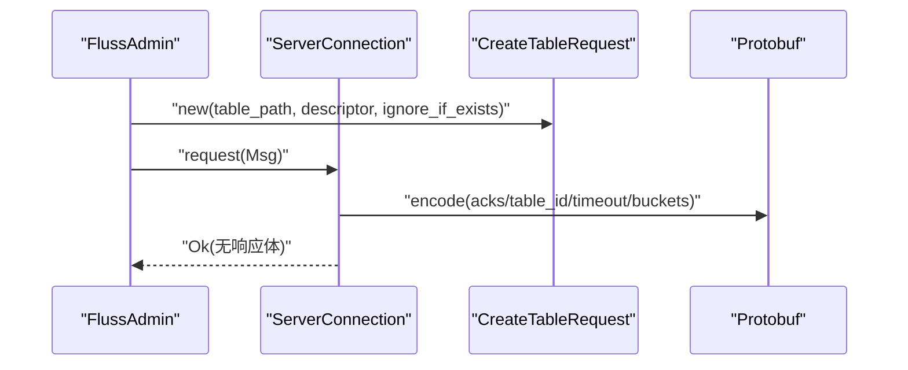

**图示来源**
- [crates/fluss/src/rpc/message/create_table.rs](file://crates/fluss/src/rpc/message/create_table.rs#L32-L63)
- [crates/fluss/src/client/admin.rs](file://crates/fluss/src/client/admin.rs#L52-L67)
- [crates/fluss/src/proto/fluss_api.proto](file://crates/fluss/src/proto/fluss_api.proto#L117-L124)

**章节来源**
- [crates/fluss/src/rpc/message/create_table.rs](file://crates/fluss/src/rpc/message/create_table.rs#L32-L63)
- [crates/fluss/src/client/admin.rs](file://crates/fluss/src/client/admin.rs#L52-L67)
- [crates/fluss/src/proto/fluss_api.proto](file://crates/fluss/src/proto/fluss_api.proto#L117-L124)

### GetTable 消息
- 功能：查询表信息，返回表 ID、模式 ID、元数据 JSON 与时间戳。
- 关键点
  - 构造函数将 TablePath 映射为 Protobuf 表路径。
  - 响应体解析后重建 TableDescriptor。
- 交互
  - 客户端通过 FlussAdmin.get_table 获取表信息。

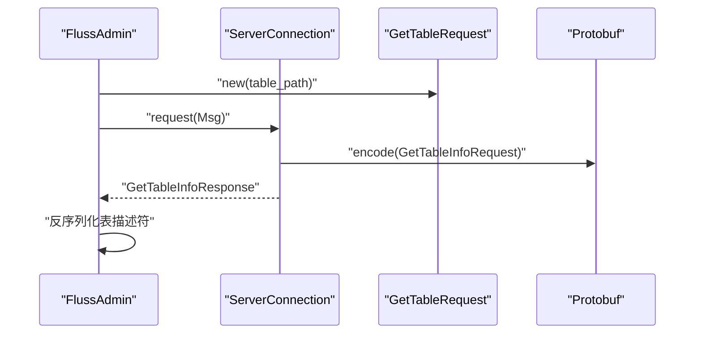

**图示来源**
- [crates/fluss/src/rpc/message/get_table.rs](file://crates/fluss/src/rpc/message/get_table.rs#L29-L55)
- [crates/fluss/src/client/admin.rs](file://crates/fluss/src/client/admin.rs#L69-L92)
- [crates/fluss/src/proto/fluss_api.proto](file://crates/fluss/src/proto/fluss_api.proto#L127-L137)

**章节来源**
- [crates/fluss/src/rpc/message/get_table.rs](file://crates/fluss/src/rpc/message/get_table.rs#L29-L55)
- [crates/fluss/src/client/admin.rs](file://crates/fluss/src/client/admin.rs#L69-L92)
- [crates/fluss/src/proto/fluss_api.proto](file://crates/fluss/src/proto/fluss_api.proto#L127-L137)

### Fetch 消息
- 功能：从日志中拉取记录，支持按表与桶过滤、最小/最大字节与等待时间。
- 关键点
  - 内置常量定义最大/最小拉取字节与等待时间上限。
  - 请求体映射为 FetchLogRequest，响应体为 FetchLogResponse。
- 交互
  - 客户端构造请求并调用 ServerConnection.request 获取响应。

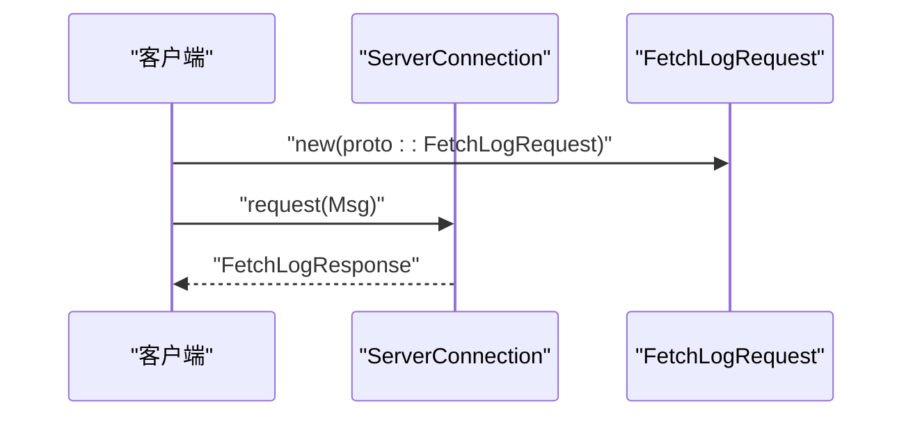

**图示来源**
- [crates/fluss/src/rpc/message/fetch.rs](file://crates/fluss/src/rpc/message/fetch.rs#L28-L57)
- [crates/fluss/src/proto/fluss_api.proto](file://crates/fluss/src/proto/fluss_api.proto#L140-L151)

**章节来源**
- [crates/fluss/src/rpc/message/fetch.rs](file://crates/fluss/src/rpc/message/fetch.rs#L28-L57)
- [crates/fluss/src/proto/fluss_api.proto](file://crates/fluss/src/proto/fluss_api.proto#L140-L151)

### ProduceLog 消息
- 功能：向指定表的桶写入批量记录，支持设置确认级别与超时。
- 关键点
  - 构造函数聚合多个 ReadyWriteBatch，组装为 PbProduceLogReqForBucket 列表。
  - 响应体为 ProduceLogResponse，包含每个桶的错误码与基础位点。
- 交互
  - 客户端在写入侧聚合批次后，构造请求并发送。

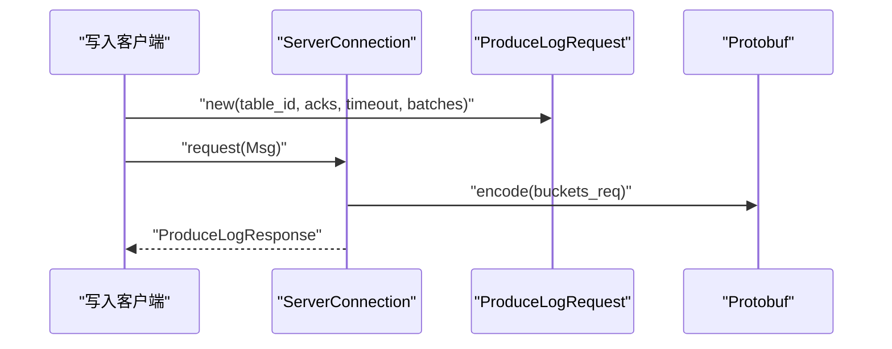

**图示来源**
- [crates/fluss/src/rpc/message/produce_log.rs](file://crates/fluss/src/rpc/message/produce_log.rs#L31-L72)
- [crates/fluss/src/proto/fluss_api.proto](file://crates/fluss/src/proto/fluss_api.proto#L40-L51)

**章节来源**
- [crates/fluss/src/rpc/message/produce_log.rs](file://crates/fluss/src/rpc/message/produce_log.rs#L31-L72)
- [crates/fluss/src/proto/fluss_api.proto](file://crates/fluss/src/proto/fluss_api.proto#L40-L51)

### UpdateMetadata 消息
- 功能：更新本地元数据缓存，请求中包含表路径列表。
- 关键点
  - 构造函数将 TablePath 列表映射为 Protobuf 表路径数组。
  - 响应体包含协调者节点、表格与分区元数据。
- 交互
  - 客户端在需要刷新元数据时发起请求。

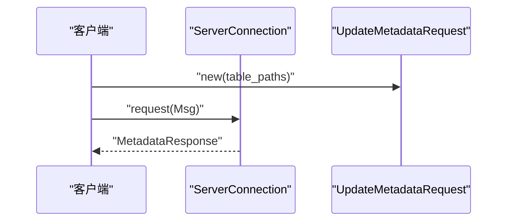

**图示来源**
- [crates/fluss/src/rpc/message/update_metadata.rs](file://crates/fluss/src/rpc/message/update_metadata.rs#L29-L61)
- [crates/fluss/src/proto/fluss_api.proto](file://crates/fluss/src/proto/fluss_api.proto#L22-L38)

**章节来源**
- [crates/fluss/src/rpc/message/update_metadata.rs](file://crates/fluss/src/rpc/message/update_metadata.rs#L29-L61)
- [crates/fluss/src/proto/fluss_api.proto](file://crates/fluss/src/proto/fluss_api.proto#L22-L38)

### 序列化与反序列化
- 字段编码
  - Protobuf：所有消息体均基于 Protobuf 定义，使用 prost 编解码。
  - 请求头：i16(API Key) + i16(API 版本) + i32(请求 ID)。
- 类型转换
  - ApiKey 与 i16 互转；ApiVersion 包装 i16。
- 错误处理
  - 帧读取：负数长度、超限、IO 错误。
  - 帧写入：过大消息、IO 错误。
  - 请求读取：响应头非成功状态、数据剩余等。

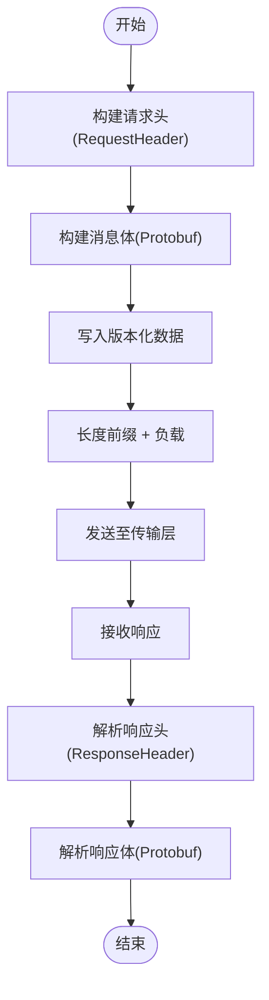

**图示来源**
- [crates/fluss/src/rpc/message/header.rs](file://crates/fluss/src/rpc/message/header.rs#L44-L73)
- [crates/fluss/src/rpc/frame.rs](file://crates/fluss/src/rpc/frame.rs#L34-L106)
- [crates/fluss/src/rpc/error.rs](file://crates/fluss/src/rpc/error.rs#L23-L51)

**章节来源**
- [crates/fluss/src/rpc/message/header.rs](file://crates/fluss/src/rpc/message/header.rs#L32-L74)
- [crates/fluss/src/rpc/frame.rs](file://crates/fluss/src/rpc/frame.rs#L21-L107)
- [crates/fluss/src/rpc/error.rs](file://crates/fluss/src/rpc/error.rs#L23-L51)

### 路由机制与连接管理
- 目标服务器选择
  - 管理类操作通常指向协调者节点；数据类操作根据表/桶定位目标 Tablet 服务器。
- 负载均衡
  - RpcClient 按服务节点 UID 缓存连接，避免重复握手。
- 故障转移
  - ServerConnection 后台读协程持续监听；遇到错误进入“中毒”状态，拒绝后续请求并通知等待中的通道。
  - RpcClient 在连接失败时重新建立连接。

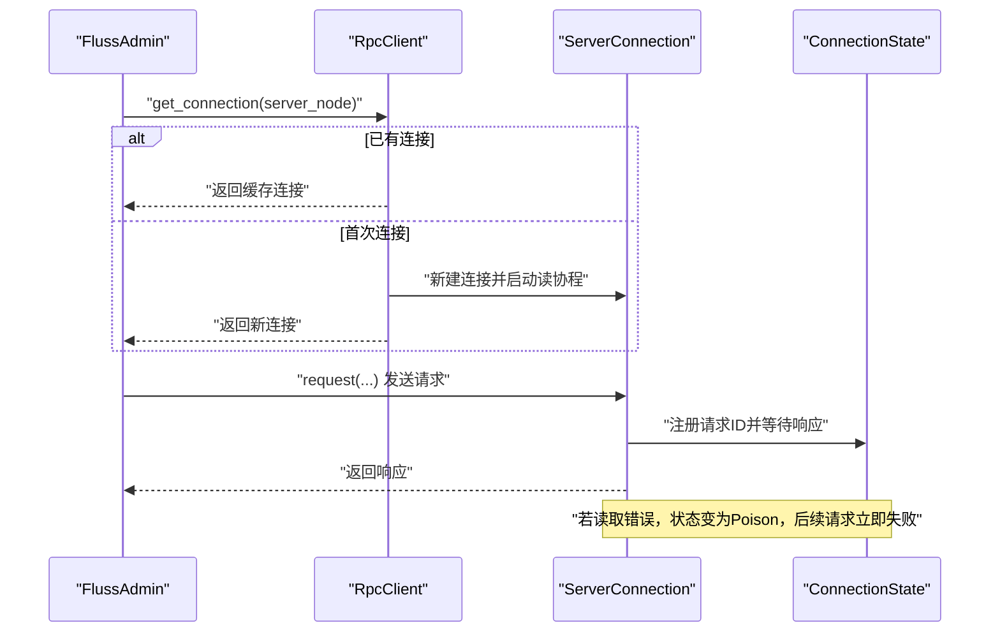

**图示来源**
- [crates/fluss/src/rpc/server_connection.rs](file://crates/fluss/src/rpc/server_connection.rs#L64-L97)
- [crates/fluss/src/rpc/server_connection.rs](file://crates/fluss/src/rpc/server_connection.rs#L172-L231)
- [crates/fluss/src/rpc/server_connection.rs](file://crates/fluss/src/rpc/server_connection.rs#L122-L145)

**章节来源**
- [crates/fluss/src/rpc/server_connection.rs](file://crates/fluss/src/rpc/server_connection.rs#L46-L97)
- [crates/fluss/src/rpc/server_connection.rs](file://crates/fluss/src/rpc/server_connection.rs#L172-L231)
- [crates/fluss/src/rpc/server_connection.rs](file://crates/fluss/src/rpc/server_connection.rs#L122-L145)

### 完整示例：创建表
- 步骤
  - 构建表路径与表描述符。
  - 通过 FlussAdmin.new 获取到协调者节点的连接。
  - 调用 create_table，内部构造 CreateTableRequest 并发送。
  - 成功无响应体，失败抛出 RpcError。

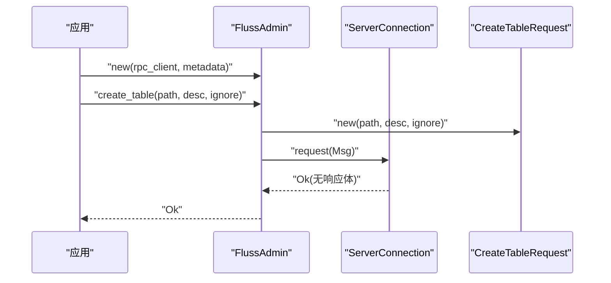

**图示来源**
- [crates/fluss/src/client/admin.rs](file://crates/fluss/src/client/admin.rs#L34-L67)
- [crates/fluss/src/rpc/message/create_table.rs](file://crates/fluss/src/rpc/message/create_table.rs#L32-L63)
- [crates/fluss/src/rpc/server_connection.rs](file://crates/fluss/src/rpc/server_connection.rs#L233-L287)

**章节来源**
- [crates/fluss/src/client/admin.rs](file://crates/fluss/src/client/admin.rs#L34-L67)
- [crates/fluss/src/rpc/message/create_table.rs](file://crates/fluss/src/rpc/message/create_table.rs#L32-L63)
- [crates/fluss/src/rpc/server_connection.rs](file://crates/fluss/src/rpc/server_connection.rs#L233-L287)

## 依赖关系分析
- 模块耦合
  - 消息体依赖 Protobuf 定义与转换工具。
  - ServerConnection 依赖帧协议与传输层。
  - RpcClient 依赖服务节点信息与连接池。
- 外部依赖
  - prost：Protobuf 编解码。
  - bytes：缓冲区读写。
  - tokio：异步 I/O 与任务调度。
  - parking_lot：并发锁。
  - futures、tokio::sync：通道与任务同步。

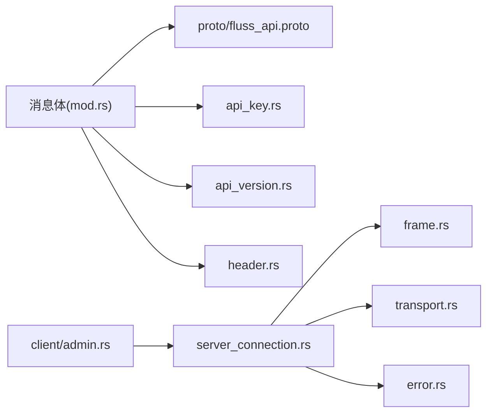

**图示来源**
- [crates/fluss/src/rpc/message/mod.rs](file://crates/fluss/src/rpc/message/mod.rs#L18-L35)
- [crates/fluss/src/proto/fluss_api.proto](file://crates/fluss/src/proto/fluss_api.proto#L1-L197)
- [crates/fluss/src/rpc/api_key.rs](file://crates/fluss/src/rpc/api_key.rs#L18-L55)
- [crates/fluss/src/rpc/api_version.rs](file://crates/fluss/src/rpc/api_version.rs#L18-L55)
- [crates/fluss/src/rpc/message/header.rs](file://crates/fluss/src/rpc/message/header.rs#L18-L74)
- [crates/fluss/src/rpc/server_connection.rs](file://crates/fluss/src/rpc/server_connection.rs#L18-L40)
- [crates/fluss/src/rpc/frame.rs](file://crates/fluss/src/rpc/frame.rs#L18-L107)
- [crates/fluss/src/rpc/transport.rs](file://crates/fluss/src/rpc/transport.rs#L18-L84)
- [crates/fluss/src/rpc/error.rs](file://crates/fluss/src/rpc/error.rs#L18-L51)
- [crates/fluss/src/client/admin.rs](file://crates/fluss/src/client/admin.rs#L18-L32)

**章节来源**
- [crates/fluss/src/rpc/message/mod.rs](file://crates/fluss/src/rpc/message/mod.rs#L18-L35)
- [crates/fluss/src/rpc/server_connection.rs](file://crates/fluss/src/rpc/server_connection.rs#L18-L40)
- [crates/fluss/src/client/admin.rs](file://crates/fluss/src/client/admin.rs#L18-L32)

## 性能考虑
- 批量化与聚合
  - ProduceLog 将多个 ReadyWriteBatch 聚合为单请求，减少 RTT 与序列化开销。
- 连接复用
  - RpcClient 按服务节点 UID 缓存连接，避免重复握手。
- 背压与内存保护
  - 帧协议限制最大消息大小，防止内存被异常消息耗尽。
- 异步与零拷贝
  - 使用 BufStream 与异步 I/O，减少阻塞；尽量复用缓冲区。
- 超时与重试
  - 传输层支持连接超时；上层可结合业务策略进行有限重试。
- 最佳实践
  - 控制单请求大小，遵循服务端配置。
  - 对高频请求进行批处理与压缩（如适用）。
  - 监控中毒连接并及时重建。

[本节为通用指导，无需特定文件来源]

## 故障排查指南
- 常见错误
  - 连接超时/失败：检查服务地址、网络连通性与超时配置。
  - 消息过大：调整请求大小或拆分批次。
  - 数据剩余：检查消息体是否完整读取，确认版本兼容。
  - 中毒连接：连接读取失败后会进入 Poison 状态，需重建连接。
- 排查步骤
  - 确认 ApiKey 与版本是否匹配。
  - 检查帧长度与负载一致性。
  - 观察后台读协程是否正常运行。
  - 记录请求 ID 以便定位问题。

**章节来源**
- [crates/fluss/src/rpc/error.rs](file://crates/fluss/src/rpc/error.rs#L23-L51)
- [crates/fluss/src/rpc/frame.rs](file://crates/fluss/src/rpc/frame.rs#L21-L107)
- [crates/fluss/src/rpc/server_connection.rs](file://crates/fluss/src/rpc/server_connection.rs#L122-L145)

## 结论
该消息处理模块以清晰的分层设计实现了高内聚、低耦合的消息编排：消息体通过 Protobuf 与版本化接口抽象，头部与帧协议保障了稳定的网络传输，连接管理提供了可靠的路由与容错。通过对批量化、连接复用与内存保护的优化，可在保证正确性的前提下获得良好的吞吐与延迟表现。

[本节为总结，无需特定文件来源]

## 附录
- API Key 映射
  - CreateTable: 1005
  - ProduceLog: 1014
  - FetchLog: 1015
  - MetaData: 1012
  - GetTable: 1007
- 版本约定
  - 当前实现使用固定版本 0，便于与服务端兼容。

**章节来源**
- [crates/fluss/src/rpc/api_key.rs](file://crates/fluss/src/rpc/api_key.rs#L30-L54)
- [crates/fluss/src/rpc/api_version.rs](file://crates/fluss/src/rpc/api_version.rs#L18-L55)