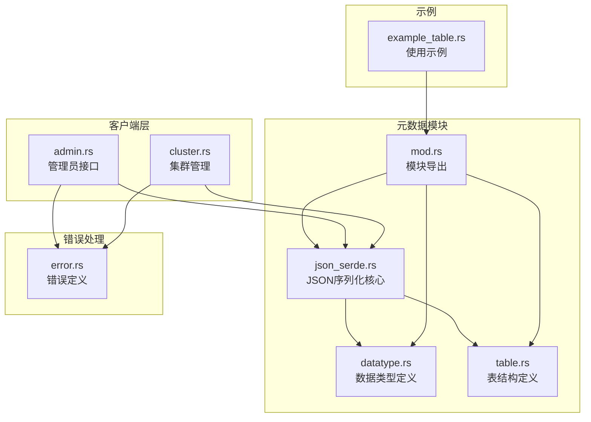
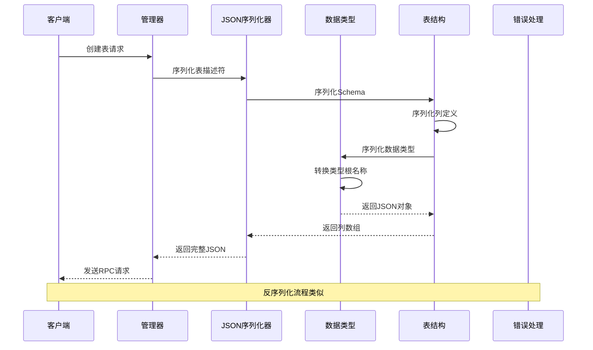
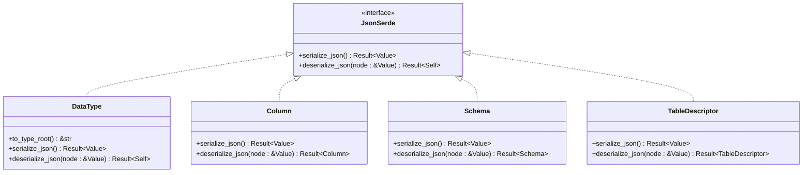
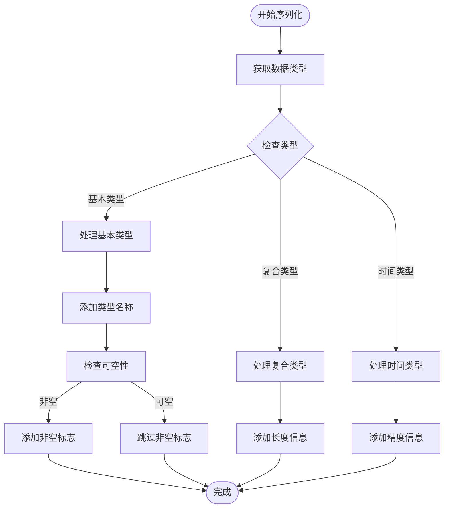
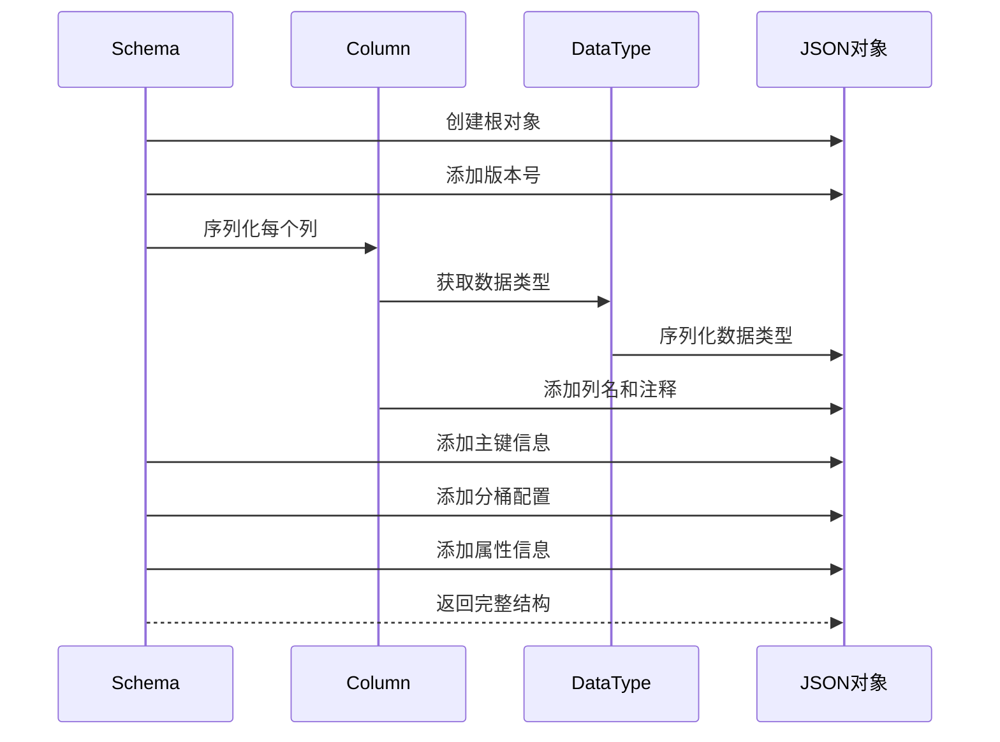
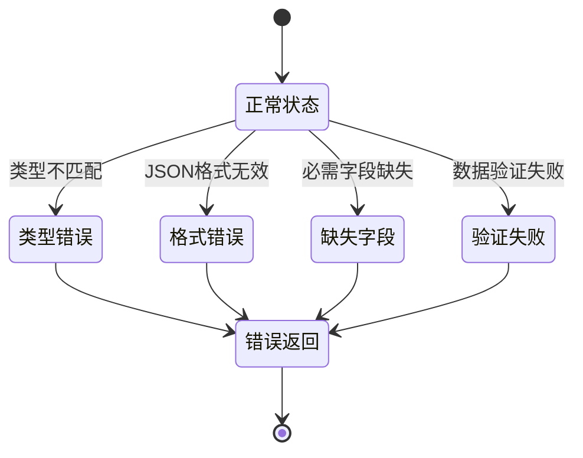
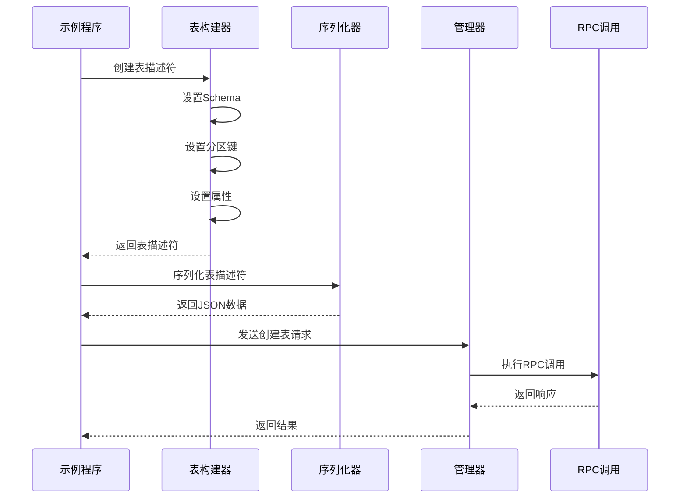
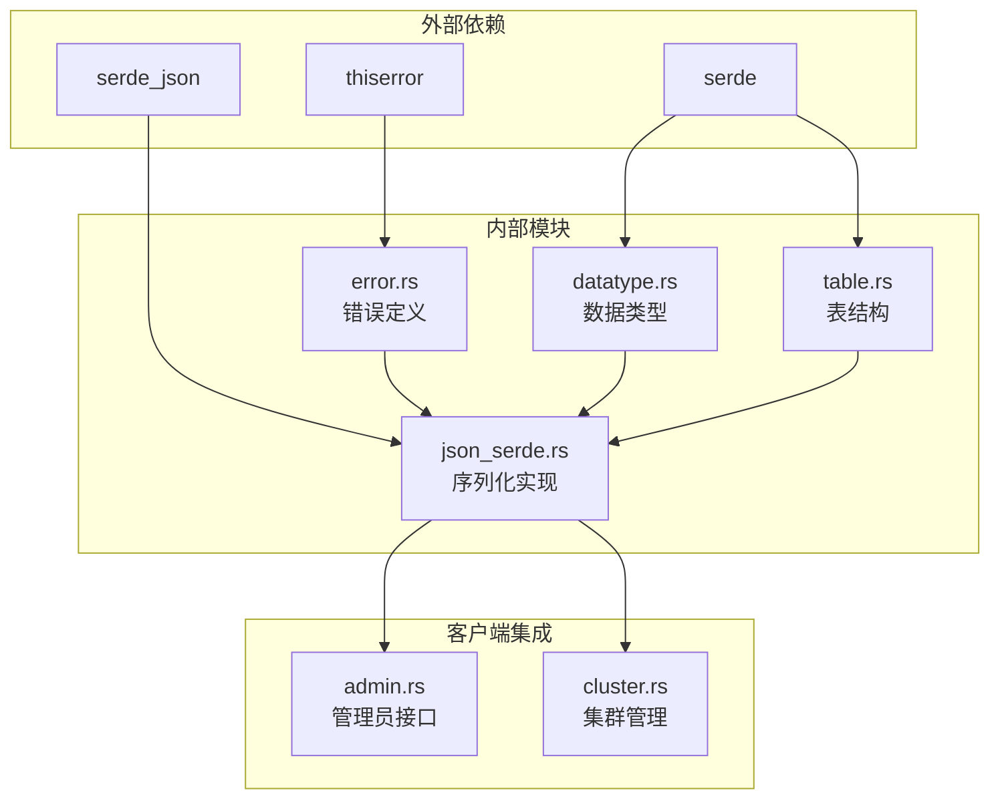

# JSON 序列化

<cite>
**本文档引用的文件**
- [json_serde.rs](file://crates/fluss/src/metadata/json_serde.rs)
- [datatype.rs](file://crates/fluss/src/metadata/datatype.rs)
- [table.rs](file://crates/fluss/src/metadata/table.rs)
- [mod.rs](file://crates/fluss/src/metadata/mod.rs)
- [admin.rs](file://crates/fluss/src/client/admin.rs)
- [cluster.rs](file://crates/fluss/src/cluster/cluster.rs)
- [error.rs](file://crates/fluss/src/error.rs)
- [example_table.rs](file://crates/examples/src/example_table.rs)
</cite>

## 目录
1. [简介](#简介)
2. [项目结构](#项目结构)
3. [核心组件](#核心组件)
4. [架构概览](#架构概览)
5. [详细组件分析](#详细组件分析)
6. [依赖关系分析](#依赖关系分析)
7. [性能考虑](#性能考虑)
8. [故障排除指南](#故障排除指南)
9. [结论](#结论)

## 简介

Fluss 是一个高性能的流式数据库系统，其 JSON 序列化模块负责将内部数据结构转换为 JSON 格式，以及将 JSON 数据解析回内部表示。该模块是 Fluss 元数据管理的核心组件，支持表定义、模式（Schema）、数据类型等关键概念的序列化和反序列化操作。

JSON 序列化模块提供了类型安全的数据转换机制，确保在分布式系统中不同组件之间的数据交换能够保持一致性和可靠性。该模块特别关注以下方面：
- 数据类型映射和格式转换
- 错误处理和验证规则
- 默认值处理和类型检查
- 性能优化和内存管理

## 项目结构

Fluss 的 JSON 序列化功能主要集中在 `crates/fluss/src/metadata/` 目录下的 `json_serde.rs` 文件中，同时与数据类型定义和表结构紧密集成。

**图表来源**
- [json_serde.rs](file://crates/fluss/src/metadata/json_serde.rs#L1-L465)
- [datatype.rs](file://crates/fluss/src/metadata/datatype.rs#L1-L815)
- [table.rs](file://crates/fluss/src/metadata/table.rs#L1-L921)

**章节来源**
- [mod.rs](file://crates/fluss/src/metadata/mod.rs#L18-L25)

## 核心组件

JSON 序列化模块的核心由三个主要组件构成：

### JsonSerde 特性
JsonSerde 是所有可序列化类型的共同接口，定义了两个核心方法：
- `serialize_json()`: 将对象序列化为 JSON 值
- `deserialize_json(node: &Value) -> Result<Self>`: 从 JSON 值反序列化为对象

### 数据类型序列化
支持多种数据类型的序列化，包括基本类型、复合类型和嵌套类型：
- 基本类型：布尔值、整数、浮点数、字符串、字节等
- 复合类型：数组、映射、行类型
- 时间类型：日期、时间、时间戳等

### 表结构序列化
支持完整的表结构序列化，包括：
- 列定义和数据类型
- 主键约束
- 分区和分桶配置
- 属性和自定义属性

**章节来源**
- [json_serde.rs](file://crates/fluss/src/metadata/json_serde.rs#L25-L29)
- [datatype.rs](file://crates/fluss/src/metadata/datatype.rs#L21-L44)
- [table.rs](file://crates/fluss/src/metadata/table.rs#L26-L91)

## 架构概览

Fluss 的 JSON 序列化架构采用分层设计，确保了良好的模块化和可维护性。

**图表来源**
- [admin.rs](file://crates/fluss/src/client/admin.rs#L52-L67)
- [json_serde.rs](file://crates/fluss/src/metadata/json_serde.rs#L82-L176)

## 详细组件分析

### JsonSerde 特性实现

JsonSerde 特性为所有可序列化类型提供了统一的接口。每个类型都需要实现两个核心方法：

**图表来源**
- [json_serde.rs](file://crates/fluss/src/metadata/json_serde.rs#L25-L29)
- [json_serde.rs](file://crates/fluss/src/metadata/json_serde.rs#L82-L176)
- [json_serde.rs](file://crates/fluss/src/metadata/json_serde.rs#L184-L223)
- [json_serde.rs](file://crates/fluss/src/metadata/json_serde.rs#L232-L295)
- [json_serde.rs](file://crates/fluss/src/metadata/json_serde.rs#L328-L464)

#### 数据类型序列化流程

数据类型序列化采用类型根映射机制，将内部数据类型转换为标准化的 JSON 表示：

**图表来源**
- [json_serde.rs](file://crates/fluss/src/metadata/json_serde.rs#L82-L131)

**章节来源**
- [json_serde.rs](file://crates/fluss/src/metadata/json_serde.rs#L31-L55)
- [json_serde.rs](file://crates/fluss/src/metadata/json_serde.rs#L82-L176)

#### 表结构序列化流程

表结构序列化涉及多个层次的数据转换，从底层数据类型到顶层表描述符：

**图表来源**
- [json_serde.rs](file://crates/fluss/src/metadata/json_serde.rs#L232-L295)
- [json_serde.rs](file://crates/fluss/src/metadata/json_serde.rs#L184-L223)

**章节来源**
- [json_serde.rs](file://crates/fluss/src/metadata/json_serde.rs#L225-L295)

### 错误处理机制

JSON 序列化模块实现了完善的错误处理机制，确保在各种异常情况下都能提供清晰的错误信息：

**图表来源**
- [error.rs](file://crates/fluss/src/error.rs#L25-L50)
- [json_serde.rs](file://crates/fluss/src/metadata/json_serde.rs#L133-L175)

**章节来源**
- [error.rs](file://crates/fluss/src/error.rs#L25-L50)
- [json_serde.rs](file://crates/fluss/src/metadata/json_serde.rs#L133-L175)

### 使用示例

#### 基本表创建流程

下面展示了如何使用 JSON 序列化功能创建表的基本流程：

**图表来源**
- [example_table.rs](file://crates/examples/src/example_table.rs#L34-L49)
- [admin.rs](file://crates/fluss/src/client/admin.rs#L52-L67)

**章节来源**
- [example_table.rs](file://crates/examples/src/example_table.rs#L28-L87)
- [admin.rs](file://crates/fluss/src/client/admin.rs#L52-L67)

## 依赖关系分析

JSON 序列化模块与其他组件之间存在紧密的依赖关系：

**图表来源**
- [json_serde.rs](file://crates/fluss/src/metadata/json_serde.rs#L18-L23)
- [error.rs](file://crates/fluss/src/error.rs#L18-L50)
- [admin.rs](file://crates/fluss/src/client/admin.rs#L18-L25)
- [cluster.rs](file://crates/fluss/src/cluster/cluster.rs#L18-L25)

**章节来源**
- [json_serde.rs](file://crates/fluss/src/metadata/json_serde.rs#L18-L23)
- [admin.rs](file://crates/fluss/src/client/admin.rs#L18-L25)
- [cluster.rs](file://crates/fluss/src/cluster/cluster.rs#L18-L25)

## 性能考虑

JSON 序列化模块在设计时充分考虑了性能优化：

### 内存管理
- 使用 `serde_json::Map` 进行高效的 JSON 对象构建
- 避免不必要的字符串复制和转换
- 合理使用 `with_capacity` 提前分配容量

### 类型检查优化
- 在编译时确定类型映射关系
- 减少运行时的类型判断开销
- 使用模式匹配优化常见类型处理

### 错误处理优化
- 提供详细的错误信息但避免过度的字符串操作
- 使用 `Result` 类型进行早期退出
- 避免在热路径上进行昂贵的错误恢复操作

## 故障排除指南

### 常见错误类型

#### JsonSerdeError
当 JSON 序列化或反序列化过程中发生错误时，会返回 `JsonSerdeError`。这种错误通常发生在：
- 缺少必需的 JSON 字段
- JSON 数据格式不正确
- 类型不匹配的情况

#### InvalidTableError
当表定义无效时，会返回 `InvalidTableError`。常见情况包括：
- 重复的列名
- 主键列不在表结构中
- 分区键和分桶键冲突

**章节来源**
- [error.rs](file://crates/fluss/src/error.rs#L30-L34)
- [json_serde.rs](file://crates/fluss/src/metadata/json_serde.rs#L220-L222)

### 调试技巧

1. **启用详细日志**：在开发环境中启用详细的序列化日志输出
2. **验证 JSON 结构**：使用在线 JSON 验证工具检查生成的 JSON 结构
3. **单元测试**：编写针对序列化和反序列化的单元测试
4. **边界条件测试**：测试空值、特殊字符、超长字符串等边界情况

## 结论

Fluss 的 JSON 序列化模块是一个设计精良、功能完整的数据转换系统。它成功地解决了分布式系统中数据交换的关键问题，提供了：

1. **类型安全**：通过 Rust 的类型系统确保序列化和反序列化的安全性
2. **完整性**：支持完整的表定义和元数据结构
3. **可扩展性**：易于添加新的数据类型和序列化规则
4. **性能优化**：在保证正确性的前提下进行了多项性能优化
5. **错误处理**：提供了清晰的错误信息和适当的错误恢复机制

该模块为 Fluss 的元数据管理提供了坚实的基础，使得表定义、模式管理和集群协调等功能能够可靠地工作。通过合理的架构设计和实现细节，JSON 序列化模块成为了 Fluss 系统中不可或缺的重要组成部分。