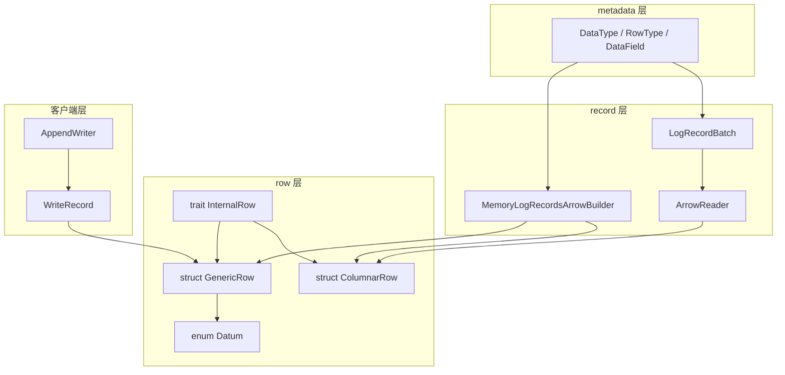
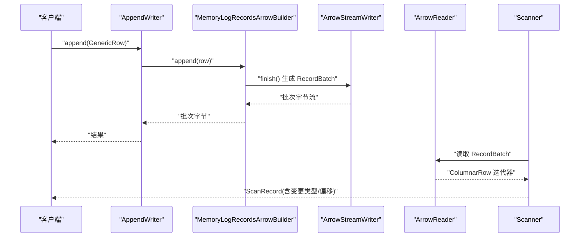
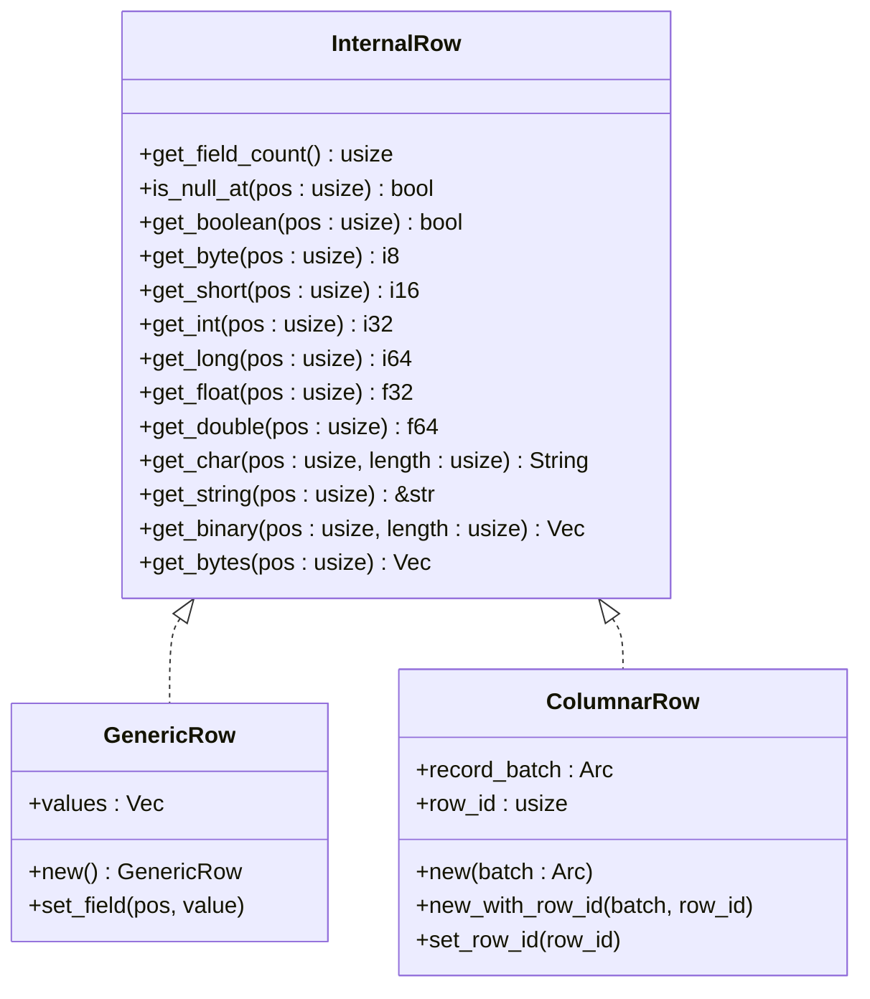
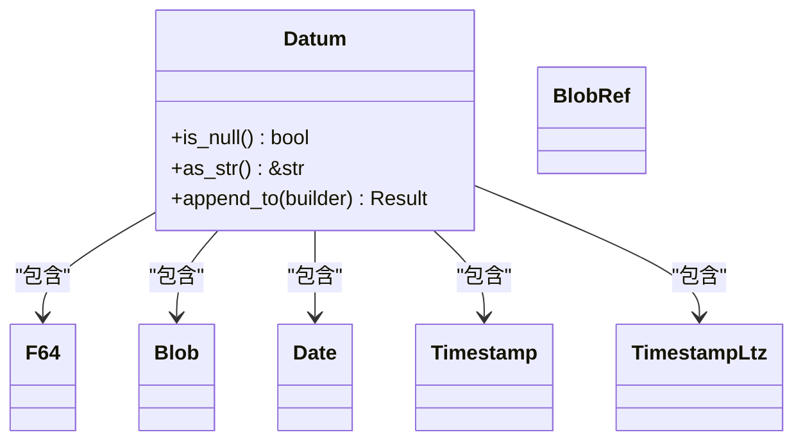
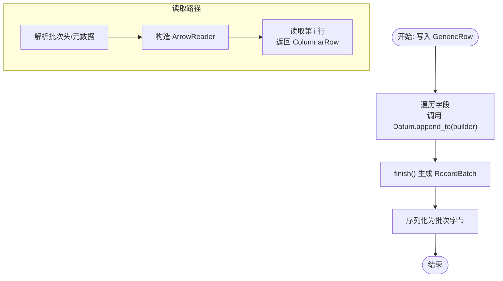
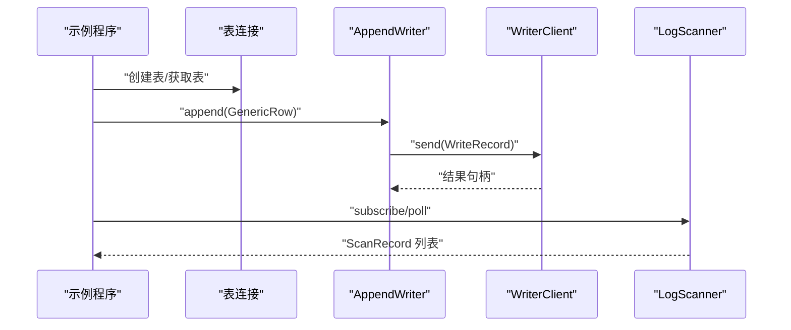
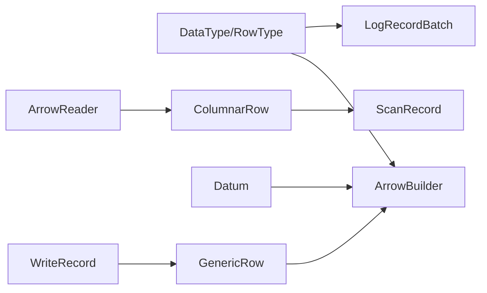

# Row 数据结构

<cite>
**本文引用的文件**
- [crates/fluss/src/row/mod.rs](file://crates/fluss/src/row/mod.rs)
- [crates/fluss/src/row/column.rs](file://crates/fluss/src/row/column.rs)
- [crates/fluss/src/row/datum.rs](file://crates/fluss/src/row/datum.rs)
- [crates/fluss/src/metadata/datatype.rs](file://crates/fluss/src/metadata/datatype.rs)
- [crates/fluss/src/record/arrow.rs](file://crates/fluss/src/record/arrow.rs)
- [crates/fluss/src/record/mod.rs](file://crates/fluss/src/record/mod.rs)
- [crates/fluss/src/client/table/append.rs](file://crates/fluss/src/client/table/append.rs)
- [crates/fluss/src/client/write/mod.rs](file://crates/fluss/src/client/write/mod.rs)
- [crates/examples/src/example_table.rs](file://crates/examples/src/example_table.rs)
</cite>

## 目录
1. [简介](#简介)
2. [项目结构](#项目结构)
3. [核心组件](#核心组件)
4. [架构总览](#架构总览)
5. [组件详解](#组件详解)
6. [依赖关系分析](#依赖关系分析)
7. [性能考量](#性能考量)
8. [故障排查指南](#故障排查指南)
9. [结论](#结论)
10. [附录](#附录)

## 简介
本文件系统性阐述 Fluss 中 Row 数据结构的设计理念与实现架构，重点覆盖：
- 行式与列式两种数据表示：GenericRow（行式）与 ColumnarRow（列式）
- Datum 类型系统与类型转换机制
- 列式数据结构与 Arrow 集成
- Row 的创建、修改、遍历与序列化流程
- 数据验证与约束保障
- 写入、读取、处理等场景下的实际应用

## 项目结构
Row 相关代码主要位于 crates/fluss/src/row 下，配合 record 层完成与 Arrow 的互操作，metadata 定义表结构与字段类型，客户端层负责写入与扫描。

图示来源
- [crates/fluss/src/row/mod.rs](file://crates/fluss/src/row/mod.rs#L26-L149)
- [crates/fluss/src/row/column.rs](file://crates/fluss/src/row/column.rs#L25-L170)
- [crates/fluss/src/row/datum.rs](file://crates/fluss/src/row/datum.rs#L37-L288)
- [crates/fluss/src/record/arrow.rs](file://crates/fluss/src/record/arrow.rs#L92-L230)
- [crates/fluss/src/record/mod.rs](file://crates/fluss/src/record/mod.rs#L28-L175)
- [crates/fluss/src/metadata/datatype.rs](file://crates/fluss/src/metadata/datatype.rs#L24-L787)
- [crates/fluss/src/client/table/append.rs](file://crates/fluss/src/client/table/append.rs#L53-L69)
- [crates/fluss/src/client/write/mod.rs](file://crates/fluss/src/client/write/mod.rs#L36-L45)

章节来源
- [crates/fluss/src/row/mod.rs](file://crates/fluss/src/row/mod.rs#L1-L149)
- [crates/fluss/src/row/column.rs](file://crates/fluss/src/row/column.rs#L1-L170)
- [crates/fluss/src/row/datum.rs](file://crates/fluss/src/row/datum.rs#L1-L288)
- [crates/fluss/src/record/arrow.rs](file://crates/fluss/src/record/arrow.rs#L1-L546)
- [crates/fluss/src/record/mod.rs](file://crates/fluss/src/record/mod.rs#L1-L175)
- [crates/fluss/src/metadata/datatype.rs](file://crates/fluss/src/metadata/datatype.rs#L1-L815)
- [crates/fluss/src/client/table/append.rs](file://crates/fluss/src/client/table/append.rs#L1-L70)
- [crates/fluss/src/client/write/mod.rs](file://crates/fluss/src/client/write/mod.rs#L1-L69)

## 核心组件
- InternalRow：统一的行访问接口，支持按位置读取布尔、字节、短整型、整型、长整型、单双精度浮点、字符串、二进制等类型值，以及空值判断。
- GenericRow：行式存储，内部以 Datum 向量保存字段，适合小批量、灵活的行级操作。
- ColumnarRow：列式包装器，基于 Arrow RecordBatch 提供列式随机访问，适合批处理与高性能扫描。
- Datum：统一的字段值类型，覆盖基础标量、字符串、二进制、日期时间、十进制等；提供 From/TryFrom 转换与 Arrow 构建器桥接。

章节来源
- [crates/fluss/src/row/mod.rs](file://crates/fluss/src/row/mod.rs#L26-L149)
- [crates/fluss/src/row/datum.rs](file://crates/fluss/src/row/datum.rs#L37-L288)
- [crates/fluss/src/row/column.rs](file://crates/fluss/src/row/column.rs#L25-L170)

## 架构总览
Row 在系统中的职责与交互如下：
- 客户端写入：AppendWriter 将 GenericRow 序列化为 Arrow 批次，写入日志。
- 日志读取：LogRecordBatch 解析批次头与 Arrow 数据，ArrowReader 包装 RecordBatch，逐行生成 ColumnarRow。
- 上层消费：Scanner 获取 ScanRecord，通过 ColumnarRow 访问字段，结合变更类型与偏移信息进行业务处理。

图示来源
- [crates/fluss/src/client/table/append.rs](file://crates/fluss/src/client/table/append.rs#L58-L64)
- [crates/fluss/src/record/arrow.rs](file://crates/fluss/src/record/arrow.rs#L127-L185)
- [crates/fluss/src/record/arrow.rs](file://crates/fluss/src/record/arrow.rs#L528-L544)
- [crates/fluss/src/record/mod.rs](file://crates/fluss/src/record/mod.rs#L87-L133)

## 组件详解

### InternalRow 接口与实现
- 设计目标：抽象统一的行访问语义，屏蔽行式与列式差异。
- 关键能力：字段数量、空值判断、多类型读取（布尔/字节/短整型/整型/长整型/浮点/字符串/二进制）。
- 实现要点：GenericRow 当前仅部分类型实现，其余占位；ColumnarRow 基于 Arrow 数组类型安全访问。

图示来源
- [crates/fluss/src/row/mod.rs](file://crates/fluss/src/row/mod.rs#L26-L149)
- [crates/fluss/src/row/column.rs](file://crates/fluss/src/row/column.rs#L25-L170)

章节来源
- [crates/fluss/src/row/mod.rs](file://crates/fluss/src/row/mod.rs#L26-L149)
- [crates/fluss/src/row/column.rs](file://crates/fluss/src/row/column.rs#L50-L170)

### Datum 类型系统与转换
- 类型覆盖：Null、Bool、Int16/Int32/Int64、Float64（有序浮点封装）、&str、Blob（二进制）、Decimal、Date、Timestamp、TimestampTz。
- 转换机制：
  - From/TryFrom：从基础类型到 Datum 的便捷转换。
  - ToArrow：Datum 与 Arrow 构建器桥接，按类型分派写入。
- 重要类型别名：F32/F64（有序浮点）、Str（Box<str>）、Blob（Box<[u8]>）及其切片 BlobRef。

图示来源
- [crates/fluss/src/row/datum.rs](file://crates/fluss/src/row/datum.rs#L37-L288)

章节来源
- [crates/fluss/src/row/datum.rs](file://crates/fluss/src/row/datum.rs#L37-L288)

### 列式 Row 与 Arrow 集成
- ColumnarRow：持有 Arc<RecordBatch> 与当前行索引 row_id，通过数组 downcast 安全访问各列类型。
- ArrowBuilder：MemoryLogRecordsArrowBuilder 将 GenericRow 的 Datum 写入对应 Arrow 列构建器，最终生成 RecordBatch 并序列化为批次字节。
- 读取路径：LogRecordBatch 解析批次头与 Arrow 元数据，ArrowReader 包装 RecordBatch，逐行返回 ColumnarRow。

图示来源
- [crates/fluss/src/record/arrow.rs](file://crates/fluss/src/record/arrow.rs#L127-L185)
- [crates/fluss/src/record/arrow.rs](file://crates/fluss/src/record/arrow.rs#L373-L400)
- [crates/fluss/src/record/arrow.rs](file://crates/fluss/src/record/arrow.rs#L528-L544)

章节来源
- [crates/fluss/src/row/column.rs](file://crates/fluss/src/row/column.rs#L25-L170)
- [crates/fluss/src/record/arrow.rs](file://crates/fluss/src/record/arrow.rs#L92-L230)
- [crates/fluss/src/record/arrow.rs](file://crates/fluss/src/record/arrow.rs#L373-L400)
- [crates/fluss/src/record/arrow.rs](file://crates/fluss/src/record/arrow.rs#L528-L544)

### 数据类型定义与表结构
- DataType：统一的数据类型体系，覆盖布尔、整数、浮点、字符、字符串、十进制、日期、时间戳、字节/二进制、数组、映射、行类型等。
- RowType/DataField：用于描述表的字段集合与可空性，支持从类型列表快速生成匿名字段名（f0, f1, ...）。

章节来源
- [crates/fluss/src/metadata/datatype.rs](file://crates/fluss/src/metadata/datatype.rs#L24-L787)

### 客户端写入与扫描流程
- 写入：AppendWriter 接收 GenericRow，经由 WriterClient 发送；WriteRecord 封装表路径与行。
- 扫描：示例中通过日志扫描器订阅分区，轮询 ScanRecord，使用 ColumnarRow 访问字段。

图示来源
- [crates/examples/src/example_table.rs](file://crates/examples/src/example_table.rs#L55-L85)
- [crates/fluss/src/client/table/append.rs](file://crates/fluss/src/client/table/append.rs#L58-L64)
- [crates/fluss/src/client/write/mod.rs](file://crates/fluss/src/client/write/mod.rs#L36-L45)

章节来源
- [crates/examples/src/example_table.rs](file://crates/examples/src/example_table.rs#L1-L87)
- [crates/fluss/src/client/table/append.rs](file://crates/fluss/src/client/table/append.rs#L1-L70)
- [crates/fluss/src/client/write/mod.rs](file://crates/fluss/src/client/write/mod.rs#L1-L69)

## 依赖关系分析
- row -> metadata：Datum 与 Arrow 类型映射依赖 DataType/RowType。
- record -> row：ArrowBuilder 使用 GenericRow/Datum；ArrowReader 返回 ColumnarRow。
- client -> row：AppendWriter 接收 GenericRow；WriteRecord 封装 row 与表路径。
- record -> metadata：to_arrow_schema 依据 DataType 生成 Arrow Schema。

图示来源
- [crates/fluss/src/metadata/datatype.rs](file://crates/fluss/src/metadata/datatype.rs#L402-L447)
- [crates/fluss/src/record/arrow.rs](file://crates/fluss/src/record/arrow.rs#L105-L125)
- [crates/fluss/src/record/arrow.rs](file://crates/fluss/src/record/arrow.rs#L528-L544)
- [crates/fluss/src/record/mod.rs](file://crates/fluss/src/record/mod.rs#L87-L133)
- [crates/fluss/src/client/write/mod.rs](file://crates/fluss/src/client/write/mod.rs#L36-L45)

章节来源
- [crates/fluss/src/metadata/datatype.rs](file://crates/fluss/src/metadata/datatype.rs#L402-L447)
- [crates/fluss/src/record/arrow.rs](file://crates/fluss/src/record/arrow.rs#L105-L125)
- [crates/fluss/src/record/arrow.rs](file://crates/fluss/src/record/arrow.rs#L528-L544)
- [crates/fluss/src/record/mod.rs](file://crates/fluss/src/record/mod.rs#L87-L133)
- [crates/fluss/src/client/write/mod.rs](file://crates/fluss/src/client/write/mod.rs#L36-L45)

## 性能考量
- 列式访问优势：ColumnarRow 基于 Arrow，具备向量化读取与缓存友好的内存布局，适合大规模扫描与聚合。
- 行式灵活性：GenericRow 便于动态字段设置与小批量处理，但类型转换与内存分配开销相对更高。
- Arrow 序列化：MemoryLogRecordsArrowBuilder 复用列构建器，减少中间拷贝；RecordBatch 一次性 finish，降低碎片化。
- 批处理大小：DEFAULT_MAX_RECORD 控制批次记录数，平衡吞吐与延迟。
- 类型映射：ToArrow 宏分派避免运行时多态成本，提升写入效率。

章节来源
- [crates/fluss/src/record/arrow.rs](file://crates/fluss/src/record/arrow.rs#L127-L185)
- [crates/fluss/src/record/arrow.rs](file://crates/fluss/src/record/arrow.rs#L213-L229)
- [crates/fluss/src/row/datum.rs](file://crates/fluss/src/row/datum.rs#L171-L194)

## 故障排查指南
- 类型不匹配：Datum.append_to 会根据目标 Arrow 构建器类型进行 downcast，若类型不一致会返回转换错误，需检查 DataType 与 Arrow 类型映射。
- 固定长度字符串/二进制：ColumnarRow::get_char 会对长度进行校验，长度不一致会触发异常，需确保写入与读取长度一致。
- 空值访问：ColumnarRow::is_null_at 用于判空，避免直接访问导致越界或错误。
- 批次校验：LogRecordBatch::is_valid 通过 CRC 校验与最小长度检查，若校验失败需检查网络传输或存储完整性。

章节来源
- [crates/fluss/src/row/datum.rs](file://crates/fluss/src/row/datum.rs#L127-L168)
- [crates/fluss/src/row/column.rs](file://crates/fluss/src/row/column.rs#L120-L139)
- [crates/fluss/src/record/arrow.rs](file://crates/fluss/src/record/arrow.rs#L309-L317)

## 结论
Row 数据结构在 Fluss 中采用“行式 + 列式”双模式设计：行式适配灵活写入，列式适配高效扫描；Datum 统一类型系统与 Arrow 无缝衔接，形成从写入到读取的完整数据通路。通过 DataType/RowType 描述表结构，结合 Arrow 的列式内存布局与向量化能力，实现高性能的数据处理流水线。

## 附录

### Row 创建与修改
- 创建：GenericRow::new 构造空行，随后 set_field 按位置写入 Datum。
- 修改：通过 set_field 替换指定位置的值；注意位置与类型需与表结构一致。

章节来源
- [crates/fluss/src/row/mod.rs](file://crates/fluss/src/row/mod.rs#L140-L149)
- [crates/examples/src/example_table.rs](file://crates/examples/src/example_table.rs#L55-L67)

### Row 遍历与访问
- 行式遍历：GenericRow.values 直接迭代字段。
- 列式遍历：ArrowReader::row_count 与 ArrowReader::read(row_id) 逐行生成 ColumnarRow，再按列类型访问。

章节来源
- [crates/fluss/src/record/arrow.rs](file://crates/fluss/src/record/arrow.rs#L537-L544)
- [crates/fluss/src/record/mod.rs](file://crates/fluss/src/record/mod.rs#L508-L526)

### 数据验证与约束
- 可空性：DataType::is_nullable 与 as_non_nullable 提供可空性声明与转换。
- 长度约束：Char/Binary 类型在读取时进行长度校验。
- 类型一致性：ToArrow 分派与 Arrow 类型映射确保写入/读取类型一致。

章节来源
- [crates/fluss/src/metadata/datatype.rs](file://crates/fluss/src/metadata/datatype.rs#L46-L94)
- [crates/fluss/src/row/column.rs](file://crates/fluss/src/row/column.rs#L120-L139)
- [crates/fluss/src/record/arrow.rs](file://crates/fluss/src/record/arrow.rs#L425-L447)

### 与 Arrow 的互操作
- 写入：MemoryLogRecordsArrowBuilder::append 将 Datum 写入对应 Arrow 列构建器，finish 生成 RecordBatch。
- 读取：LogRecordBatch::records 与 ArrowReader::read 将 Arrow 数据转为 ColumnarRow。
- Schema 映射：to_arrow_schema 与 to_arrow_type 将 Fluss DataType 映射为 Arrow 类型。

章节来源
- [crates/fluss/src/record/arrow.rs](file://crates/fluss/src/record/arrow.rs#L127-L185)
- [crates/fluss/src/record/arrow.rs](file://crates/fluss/src/record/arrow.rs#L402-L447)