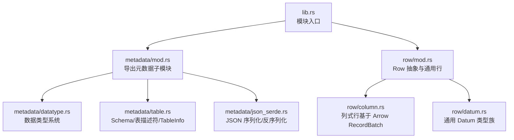
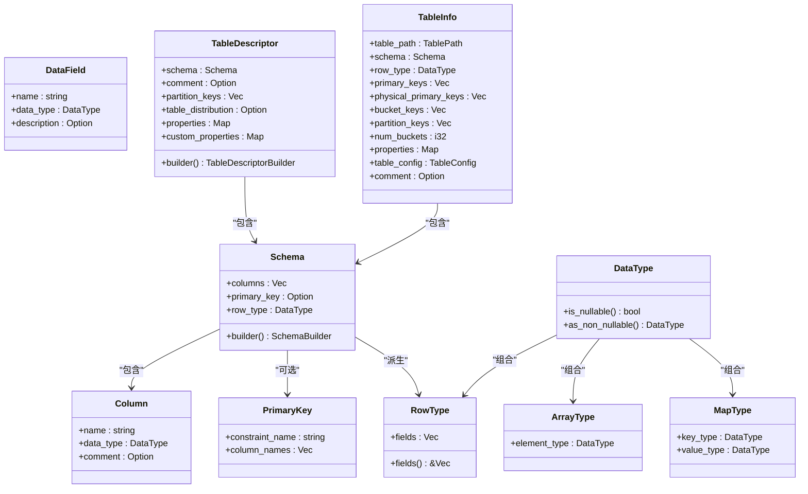
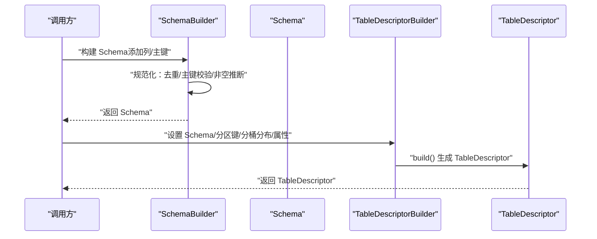
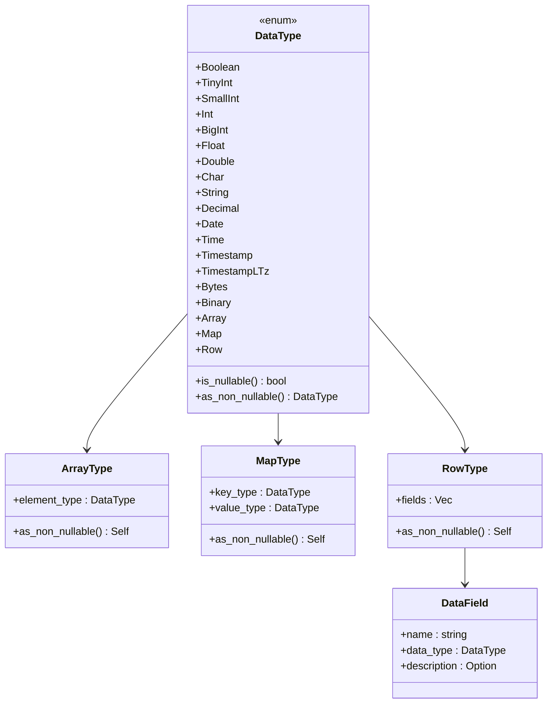
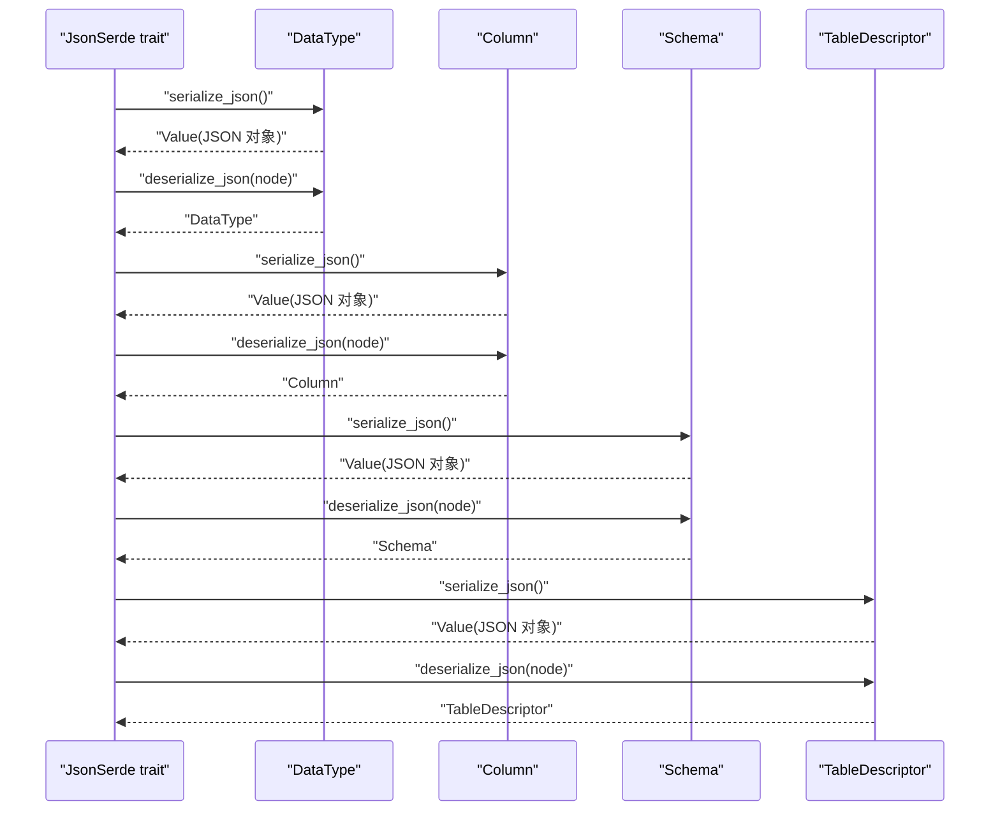
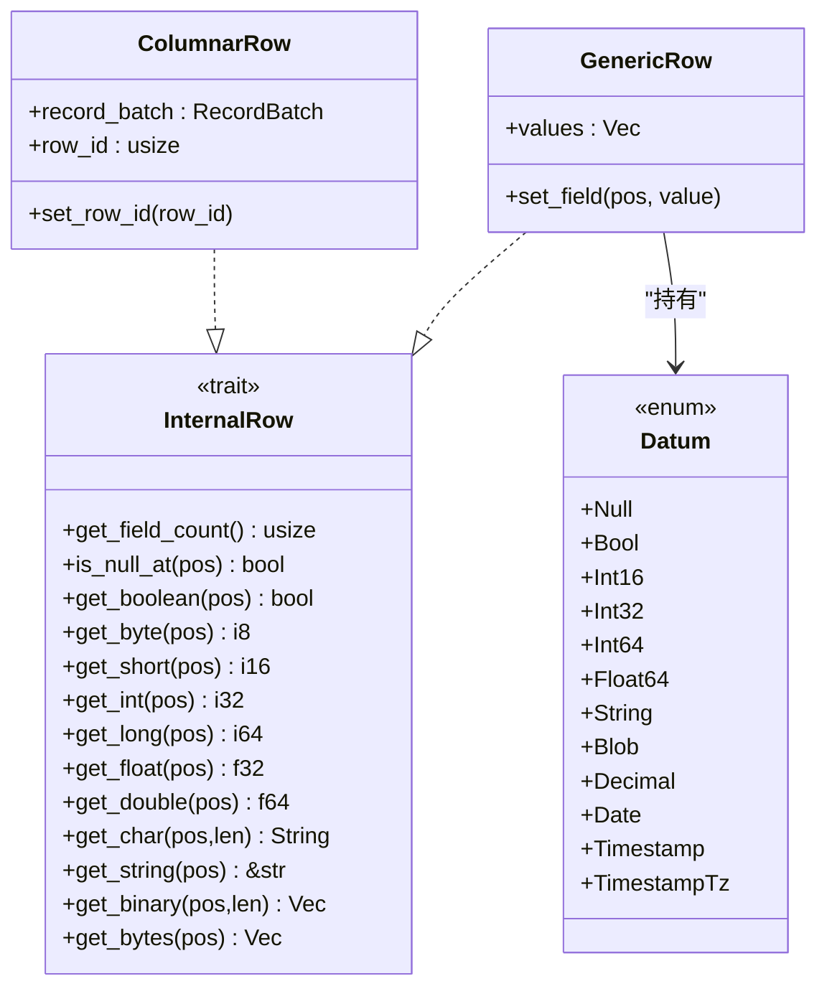
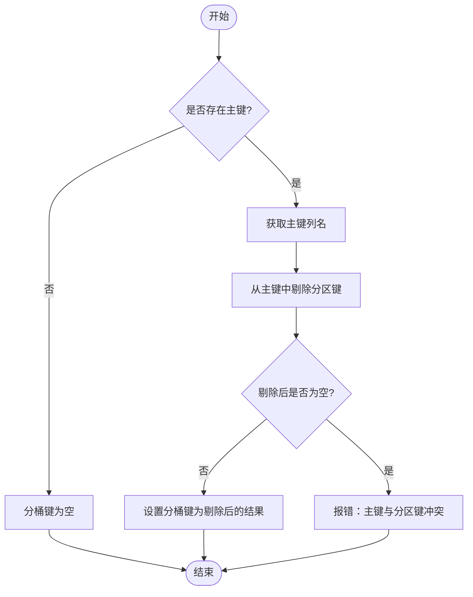
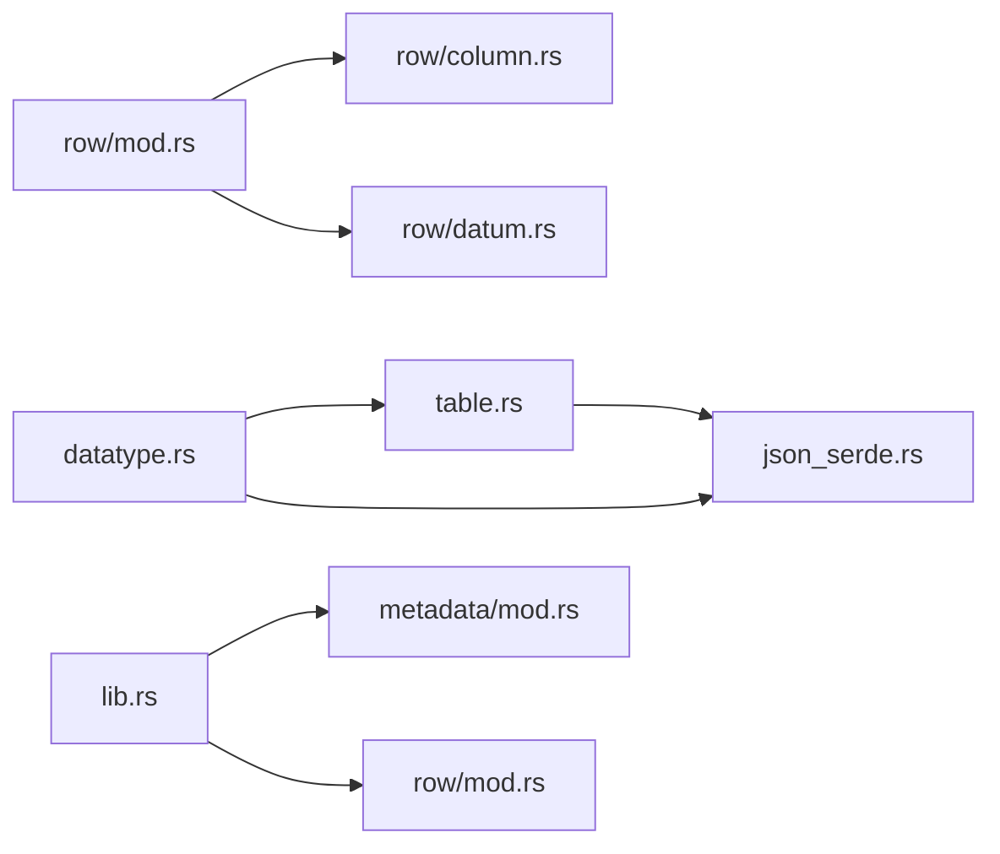

# 元数据管理

<cite>
**本文引用的文件**
- [lib.rs](file://crates/fluss/src/lib.rs)
- [metadata/mod.rs](file://crates/fluss/src/metadata/mod.rs)
- [metadata/datatype.rs](file://crates/fluss/src/metadata/datatype.rs)
- [metadata/table.rs](file://crates/fluss/src/metadata/table.rs)
- [metadata/json_serde.rs](file://crates/fluss/src/metadata/json_serde.rs)
- [row/mod.rs](file://crates/fluss/src/row/mod.rs)
- [row/column.rs](file://crates/fluss/src/row/column.rs)
- [row/datum.rs](file://crates/fluss/src/row/datum.rs)
- [test_fluss.rs](file://crates/fluss/tests/test_fluss.rs)
</cite>

## 目录
1. [简介](#简介)
2. [项目结构](#项目结构)
3. [核心组件](#核心组件)
4. [架构总览](#架构总览)
5. [详细组件分析](#详细组件分析)
6. [依赖关系分析](#依赖关系分析)
7. [性能考量](#性能考量)
8. [故障排查指南](#故障排查指南)
9. [结论](#结论)
10. [附录](#附录)

## 简介
本文件系统性梳理 Fluss 的元数据管理体系，重点覆盖以下方面：
- 表描述符（TableDescriptor）与 Schema 的定义、构建与校验规则
- 数据类型系统：基础类型、数组/映射/行类型、可空性与显示特性
- JSON 序列化/反序列化：类型映射、字段约定、错误处理
- Row 模块设计：列式数据结构、访问模式与性能优化思路
- 缓存机制：当前实现中未发现集中式缓存，建议的策略与一致性保障
- 实际示例与最佳实践：常见元数据操作场景与推荐做法

## 项目结构
Fluss 将元数据相关能力集中在 metadata 子模块，配合 row 模块提供列式数据访问能力；顶层 lib.rs 暴露模块入口。

图表来源
- [lib.rs](file://crates/fluss/src/lib.rs#L18-L37)
- [metadata/mod.rs](file://crates/fluss/src/metadata/mod.rs#L18-L24)
- [row/mod.rs](file://crates/fluss/src/row/mod.rs#L18-L25)

章节来源
- [lib.rs](file://crates/fluss/src/lib.rs#L18-L37)
- [metadata/mod.rs](file://crates/fluss/src/metadata/mod.rs#L18-L24)
- [row/mod.rs](file://crates/fluss/src/row/mod.rs#L18-L25)

## 核心组件
- 数据类型系统：统一的 DataType 枚举及各具体类型（布尔、整数、浮点、字符串、日期时间、二进制、数组、映射、行类型等），支持可空性标记与非空转换。
- Schema：由列集合、主键约束、以及派生的 Row 类型组成，提供构建器进行规范化校验。
- TableDescriptor：表级元数据容器，包含 Schema、注释、分区键、分桶分布、属性与自定义属性，提供构建器与默认分桶键推导逻辑。
- TableInfo：运行时表信息视图，汇总 Schema、主键、分桶键、分区键、属性等，便于执行层使用。
- JSON 序列化/反序列化：为 DataType、Schema、TableDescriptor 提供 JSON 字段约定与错误处理。
- Row 模块：提供 InternalRow 抽象与 ColumnarRow（基于 Arrow RecordBatch）实现，支持按列访问与类型安全读取。

章节来源
- [metadata/datatype.rs](file://crates/fluss/src/metadata/datatype.rs#L21-L94)
- [metadata/table.rs](file://crates/fluss/src/metadata/table.rs#L93-L144)
- [metadata/table.rs](file://crates/fluss/src/metadata/table.rs#L287-L374)
- [metadata/table.rs](file://crates/fluss/src/metadata/table.rs#L376-L565)
- [metadata/json_serde.rs](file://crates/fluss/src/metadata/json_serde.rs#L25-L464)
- [row/mod.rs](file://crates/fluss/src/row/mod.rs#L26-L74)
- [row/column.rs](file://crates/fluss/src/row/column.rs#L25-L169)

## 架构总览
下图展示了元数据模型在系统中的角色与交互：

图表来源
- [metadata/datatype.rs](file://crates/fluss/src/metadata/datatype.rs#L21-L94)
- [metadata/datatype.rs](file://crates/fluss/src/metadata/datatype.rs#L625-L647)
- [metadata/datatype.rs](file://crates/fluss/src/metadata/datatype.rs#L570-L623)
- [metadata/datatype.rs](file://crates/fluss/src/metadata/datatype.rs#L596-L623)
- [metadata/table.rs](file://crates/fluss/src/metadata/table.rs#L93-L144)
- [metadata/table.rs](file://crates/fluss/src/metadata/table.rs#L26-L67)
- [metadata/table.rs](file://crates/fluss/src/metadata/table.rs#L69-L91)
- [metadata/table.rs](file://crates/fluss/src/metadata/table.rs#L376-L440)
- [metadata/table.rs](file://crates/fluss/src/metadata/table.rs#L634-L672)

## 详细组件分析

### 表描述符与 Schema 管理
- SchemaBuilder：负责规范化列名唯一性、主键存在性与子集关系、主键列的非空性推断；最终生成包含 DataField 的 RowType。
- TableDescriptorBuilder：在 Schema 基础上补充注释、分区键、分桶分布（含默认分桶键推导）、属性与自定义属性；提供复制与更新方法。
- 默认分桶键策略：当存在主键且未显式指定分桶键时，自动从主键中剔除分区键得到物理分桶键；若主键完全被分区键覆盖则报错。
- TableInfo：从 TableDescriptor 与时间戳等信息构造运行时视图，便于执行层直接使用。

图表来源
- [metadata/table.rs](file://crates/fluss/src/metadata/table.rs#L152-L268)
- [metadata/table.rs](file://crates/fluss/src/metadata/table.rs#L287-L374)
- [metadata/table.rs](file://crates/fluss/src/metadata/table.rs#L510-L564)

章节来源
- [metadata/table.rs](file://crates/fluss/src/metadata/table.rs#L93-L144)
- [metadata/table.rs](file://crates/fluss/src/metadata/table.rs#L152-L268)
- [metadata/table.rs](file://crates/fluss/src/metadata/table.rs#L287-L374)
- [metadata/table.rs](file://crates/fluss/src/metadata/table.rs#L510-L564)
- [metadata/table.rs](file://crates/fluss/src/metadata/table.rs#L844-L868)

### 数据类型系统
- 基础类型：布尔、字节/短整型/整型/长整型、单精度/双精度、字符/字符串、定点数（Decimal）、日期/时间/带时区时间戳、字节/二进制。
- 复合类型：数组（元素类型）、映射（键值类型）、行类型（字段列表，每个字段含名称、类型与可选描述）。
- 可空性：每种类型均支持可空标记；DataType 提供统一的非空转换接口。
- 工具函数：DataTypes 提供便捷构造器，如 binary/bytes/boolean/int/.../array/map/row 等。

图表来源
- [metadata/datatype.rs](file://crates/fluss/src/metadata/datatype.rs#L21-L94)
- [metadata/datatype.rs](file://crates/fluss/src/metadata/datatype.rs#L570-L623)
- [metadata/datatype.rs](file://crates/fluss/src/metadata/datatype.rs#L596-L623)
- [metadata/datatype.rs](file://crates/fluss/src/metadata/datatype.rs#L625-L647)
- [metadata/datatype.rs](file://crates/fluss/src/metadata/datatype.rs#L789-L812)

章节来源
- [metadata/datatype.rs](file://crates/fluss/src/metadata/datatype.rs#L21-L94)
- [metadata/datatype.rs](file://crates/fluss/src/metadata/datatype.rs#L570-L623)
- [metadata/datatype.rs](file://crates/fluss/src/metadata/datatype.rs#L625-L647)
- [metadata/datatype.rs](file://crates/fluss/src/metadata/datatype.rs#L789-L812)

### JSON 序列化/反序列化
- DataType：通过 to_type_root 映射到 JSON 类型根标识，序列化时写入 type、nullable、长度等必要字段；反序列化时解析 type 并结合 nullable 还原类型。
- Column：序列化 name、data_type、comment；反序列化时要求 name 与 data_type 存在。
- Schema：序列化 version、columns、primary_key；反序列化时要求 columns 存在，primary_key 可选。
- TableDescriptor：序列化 version、schema、comment、partition_key、bucket_key、bucket_count、properties、custom_properties；反序列化时逐项校验并还原。

图表来源
- [metadata/json_serde.rs](file://crates/fluss/src/metadata/json_serde.rs#L25-L464)

章节来源
- [metadata/json_serde.rs](file://crates/fluss/src/metadata/json_serde.rs#L25-L464)

### Row 模块设计
- InternalRow：统一的行访问抽象，定义按位置读取各类标量与字符串/二进制的方法。
- GenericRow：基于 Datum 的通用行实现，用于简单场景或测试。
- ColumnarRow：基于 Arrow RecordBatch 的列式行实现，按列访问，支持空值判断与类型安全读取，适合批量处理与高性能场景。

图表来源
- [row/mod.rs](file://crates/fluss/src/row/mod.rs#L26-L74)
- [row/mod.rs](file://crates/fluss/src/row/mod.rs#L76-L148)
- [row/column.rs](file://crates/fluss/src/row/column.rs#L25-L169)
- [row/datum.rs](file://crates/fluss/src/row/datum.rs#L37-L63)

章节来源
- [row/mod.rs](file://crates/fluss/src/row/mod.rs#L26-L74)
- [row/mod.rs](file://crates/fluss/src/row/mod.rs#L76-L148)
- [row/column.rs](file://crates/fluss/src/row/column.rs#L25-L169)
- [row/datum.rs](file://crates/fluss/src/row/datum.rs#L37-L63)

### 分桶键与分区键的默认策略
- 当存在主键但未显式指定分桶键时，自动从主键中剔除分区键作为物理分桶键；若主键完全被分区键覆盖则报错。
- 若未设置主键，则分桶键为空。

图表来源
- [metadata/table.rs](file://crates/fluss/src/metadata/table.rs#L487-L508)
- [metadata/table.rs](file://crates/fluss/src/metadata/table.rs#L510-L564)

章节来源
- [metadata/table.rs](file://crates/fluss/src/metadata/table.rs#L487-L508)
- [metadata/table.rs](file://crates/fluss/src/metadata/table.rs#L510-L564)

## 依赖关系分析
- metadata 模块内部依赖：datatype 为 table 与 json_serde 提供类型定义；json_serde 依赖 datatype 与 table。
- row 模块依赖 Arrow（RecordBatch）以实现列式访问；datum 定义了统一的 Datum 类型族。
- lib.rs 将 metadata 与 row 模块对外暴露，形成上层 API。

图表来源
- [lib.rs](file://crates/fluss/src/lib.rs#L18-L37)
- [metadata/mod.rs](file://crates/fluss/src/metadata/mod.rs#L18-L24)
- [metadata/datatype.rs](file://crates/fluss/src/metadata/datatype.rs#L21-L94)
- [metadata/table.rs](file://crates/fluss/src/metadata/table.rs#L18-L25)
- [metadata/json_serde.rs](file://crates/fluss/src/metadata/json_serde.rs#L18-L23)
- [row/mod.rs](file://crates/fluss/src/row/mod.rs#L18-L25)
- [row/column.rs](file://crates/fluss/src/row/column.rs#L19-L23)
- [row/datum.rs](file://crates/fluss/src/row/datum.rs#L18-L30)

章节来源
- [lib.rs](file://crates/fluss/src/lib.rs#L18-L37)
- [metadata/mod.rs](file://crates/fluss/src/metadata/mod.rs#L18-L24)
- [metadata/datatype.rs](file://crates/fluss/src/metadata/datatype.rs#L21-L94)
- [metadata/table.rs](file://crates/fluss/src/metadata/table.rs#L18-L25)
- [metadata/json_serde.rs](file://crates/fluss/src/metadata/json_serde.rs#L18-L23)
- [row/mod.rs](file://crates/fluss/src/row/mod.rs#L18-L25)
- [row/column.rs](file://crates/fluss/src/row/column.rs#L19-L23)
- [row/datum.rs](file://crates/fluss/src/row/datum.rs#L18-L30)

## 性能考量
- 列式访问：ColumnarRow 基于 Arrow RecordBatch，按列访问具备良好的内存局部性与向量化处理潜力，适合批处理场景。
- Datum 转换：Datum 提供多种基础类型封装与类型安全转换，减少分支判断开销；ToArrow 接口用于将 Datum 写入 Arrow Builder，便于批量写入。
- 可空性与非空推断：在 SchemaBuilder 中对主键列进行非空推断，有助于后续执行阶段避免空值检查成本。
- JSON 序列化：DataType/Schema/TableDescriptor 的 JSON 字段约定清晰，便于跨进程/网络传输，但需注意序列化/反序列化开销与错误处理成本。

[本节为通用性能讨论，不直接分析具体文件]

## 故障排查指南
- 主键与分区键冲突：当主键完全被分区键覆盖或分桶键包含分区键时会报错。请检查主键与分区键的交集与并集关系。
- 列名重复：SchemaBuilder 在构建时会检测重复列名并报错。请确保列名唯一。
- 属性解析失败：TableDescriptor 反序列化属性时要求为对象且值为字符串。请确认传入的 properties/custom_properties 格式正确。
- JSON 字段缺失：反序列化过程中若缺少必需字段（如 Schema 的 columns、TableDescriptor 的 schema/partition_key 等）会报错。请核对 JSON 字段完整性。

章节来源
- [metadata/table.rs](file://crates/fluss/src/metadata/table.rs#L220-L267)
- [metadata/table.rs](file://crates/fluss/src/metadata/table.rs#L510-L564)
- [metadata/json_serde.rs](file://crates/fluss/src/metadata/json_serde.rs#L259-L294)
- [metadata/json_serde.rs](file://crates/fluss/src/metadata/json_serde.rs#L372-L463)

## 结论
本元数据体系以 DataType 为核心，围绕 Schema 与 TableDescriptor 构建表级元数据，并通过 JSON 序列化实现跨层传递。Row 模块提供列式与通用两种行实现，满足不同性能需求。当前代码库未发现集中式元数据缓存，建议在应用层引入 LRU 或基于版本的缓存策略，并通过版本号或哈希进行一致性校验与失效通知。

[本节为总结性内容，不直接分析具体文件]

## 附录

### 实际示例与最佳实践
- 定义 Schema：使用 SchemaBuilder 添加列与主键，自动完成列名去重与主键校验；随后 build 得到 Schema。
- 设置表描述符：使用 TableDescriptorBuilder 设置 schema、分区键、分桶分布（可省略分桶键以启用默认策略）、属性与自定义属性；最后 build。
- JSON 传输：通过 TableDescriptor 的 JSON 序列化/反序列化在客户端与服务端之间传递元数据，确保字段完整与类型正确。
- Row 访问：在批处理场景优先使用 ColumnarRow，利用 Arrow 的列式优势；在小批量或测试场景可用 GenericRow。

章节来源
- [metadata/table.rs](file://crates/fluss/src/metadata/table.rs#L152-L268)
- [metadata/table.rs](file://crates/fluss/src/metadata/table.rs#L287-L374)
- [metadata/json_serde.rs](file://crates/fluss/src/metadata/json_serde.rs#L328-L463)
- [row/column.rs](file://crates/fluss/src/row/column.rs#L25-L169)
- [row/mod.rs](file://crates/fluss/src/row/mod.rs#L76-L148)