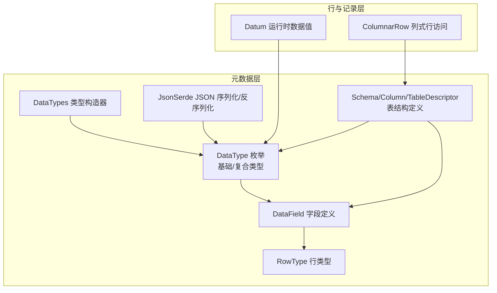
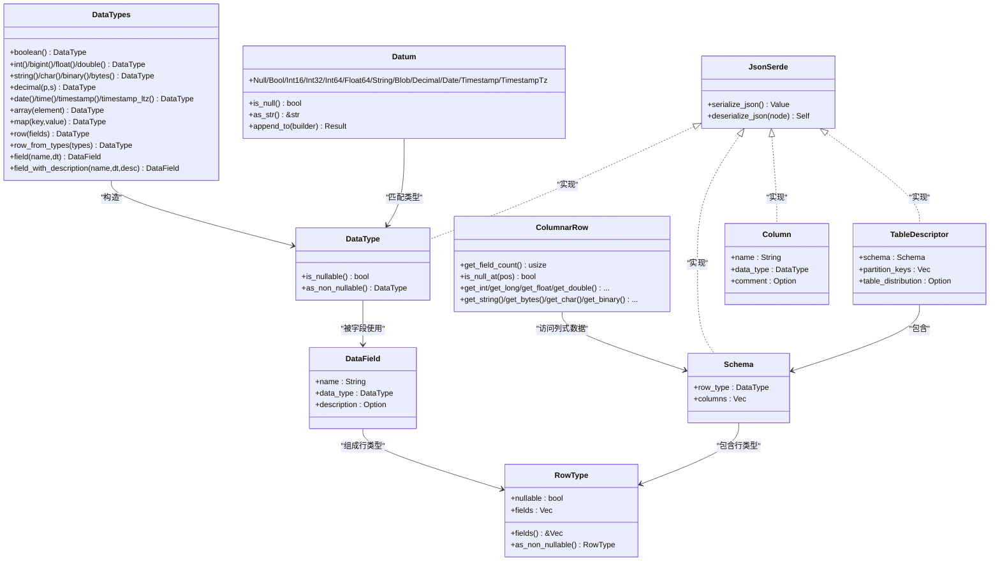
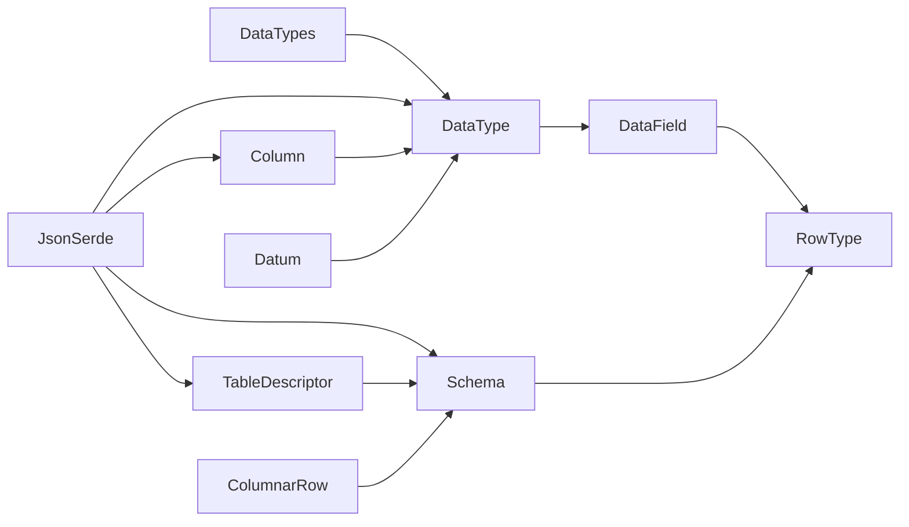

# 数据类型系统

<cite>
**本文引用的文件**
- [crates/fluss/src/metadata/datatype.rs](file://crates/fluss/src/metadata/datatype.rs)
- [crates/fluss/src/metadata/json_serde.rs](file://crates/fluss/src/metadata/json_serde.rs)
- [crates/fluss/src/metadata/table.rs](file://crates/fluss/src/metadata/table.rs)
- [crates/fluss/src/row/datum.rs](file://crates/fluss/src/row/datum.rs)
- [crates/fluss/src/row/column.rs](file://crates/fluss/src/row/column.rs)
- [crates/fluss/src/lib.rs](file://crates/fluss/src/lib.rs)
- [crates/examples/src/example_table.rs](file://crates/examples/src/example_table.rs)
</cite>

## 目录
1. [简介](#简介)
2. [项目结构](#项目结构)
3. [核心组件](#核心组件)
4. [架构总览](#架构总览)
5. [详细组件分析](#详细组件分析)
6. [依赖关系分析](#依赖关系分析)
7. [性能考量](#性能考量)
8. [故障排查指南](#故障排查指南)
9. [结论](#结论)
10. [附录：类型定义与使用示例](#附录类型定义与使用示例)

## 简介
本文件系统性梳理 Fluss 的数据类型系统，覆盖基础类型（布尔、整型、浮点、字符、字符串、十进制、日期、时间、时间戳、字节与二进制）、复合类型（数组、映射、行类型），以及与之配套的字段定义 DataField、行类型 RowType、类型构造器 DataTypes、JSON 序列化/反序列化支持、以及在表 Schema 中的应用。同时给出类型转换、序列化/反序列化、类型检查与兼容性验证的实践建议与示例路径，帮助开发者正确选择与使用数据类型。

## 项目结构
数据类型系统主要位于 metadata 子模块中，配合 row 模块用于运行时数据表示与 Arrow 列式访问；lib.rs 提供对外统一入口；examples 展示了典型用法。

图示来源
- [crates/fluss/src/metadata/datatype.rs](file://crates/fluss/src/metadata/datatype.rs#L21-L44)
- [crates/fluss/src/metadata/json_serde.rs](file://crates/fluss/src/metadata/json_serde.rs#L25-L29)
- [crates/fluss/src/metadata/table.rs](file://crates/fluss/src/metadata/table.rs#L26-L99)
- [crates/fluss/src/row/datum.rs](file://crates/fluss/src/row/datum.rs#L37-L63)
- [crates/fluss/src/row/column.rs](file://crates/fluss/src/row/column.rs#L25-L48)

章节来源
- [crates/fluss/src/lib.rs](file://crates/fluss/src/lib.rs#L18-L37)

## 核心组件
- DataType 枚举：统一承载所有数据类型，包含基础标量类型与复合类型，支持可空性查询与转为非可空类型。
- DataField：字段名、数据类型、可选描述信息的载体。
- RowType：行类型，由字段列表组成，支持可空性与字段访问。
- DataTypes：类型构造器，提供便捷工厂方法创建各类型及行类型。
- JsonSerde：为 DataType、Schema、Column、TableDescriptor 提供 JSON 序列化/反序列化能力。
- Datum：运行时数据值的统一表示，支持与 Arrow Builder 的互操作接口。
- ColumnarRow：基于 Arrow RecordBatch 的列式行访问实现。

章节来源
- [crates/fluss/src/metadata/datatype.rs](file://crates/fluss/src/metadata/datatype.rs#L21-L94)
- [crates/fluss/src/metadata/datatype.rs](file://crates/fluss/src/metadata/datatype.rs#L789-L812)
- [crates/fluss/src/metadata/datatype.rs](file://crates/fluss/src/metadata/datatype.rs#L625-L647)
- [crates/fluss/src/metadata/datatype.rs](file://crates/fluss/src/metadata/datatype.rs#L649-L787)
- [crates/fluss/src/metadata/json_serde.rs](file://crates/fluss/src/metadata/json_serde.rs#L25-L29)
- [crates/fluss/src/metadata/json_serde.rs](file://crates/fluss/src/metadata/json_serde.rs#L82-L176)
- [crates/fluss/src/row/datum.rs](file://crates/fluss/src/row/datum.rs#L37-L169)
- [crates/fluss/src/row/column.rs](file://crates/fluss/src/row/column.rs#L25-L169)

## 架构总览
下图展示数据类型系统在元数据与运行时之间的交互关系，以及 JSON 序列化在表结构定义中的应用。

图示来源
- [crates/fluss/src/metadata/datatype.rs](file://crates/fluss/src/metadata/datatype.rs#L21-L94)
- [crates/fluss/src/metadata/datatype.rs](file://crates/fluss/src/metadata/datatype.rs#L789-L812)
- [crates/fluss/src/metadata/datatype.rs](file://crates/fluss/src/metadata/datatype.rs#L625-L647)
- [crates/fluss/src/metadata/datatype.rs](file://crates/fluss/src/metadata/datatype.rs#L649-L787)
- [crates/fluss/src/metadata/json_serde.rs](file://crates/fluss/src/metadata/json_serde.rs#L31-L176)
- [crates/fluss/src/row/datum.rs](file://crates/fluss/src/row/datum.rs#L37-L169)
- [crates/fluss/src/row/column.rs](file://crates/fluss/src/row/column.rs#L25-L169)
- [crates/fluss/src/metadata/table.rs](file://crates/fluss/src/metadata/table.rs#L26-L99)

## 详细组件分析

### DataType 枚举与基础类型
- 基础标量类型：布尔、整型系列（TinyInt、SmallInt、Int、BigInt）、浮点系列（Float、Double）、字符（Char）、字符串（String）、十进制（Decimal）、日期（Date）、时间（Time）、时间戳（Timestamp、TimestampLTz）、字节（Bytes）、二进制（Binary）。
- 所有类型均支持可空性查询与“转为非可空”操作，便于在约束场景（如主键）中进行类型规范化。
- 各标量类型内部通常包含可空标志与特定参数（如 Char 的长度、Decimal 的精度/刻度、Time/Timestamp 的精度）。

章节来源
- [crates/fluss/src/metadata/datatype.rs](file://crates/fluss/src/metadata/datatype.rs#L21-L44)
- [crates/fluss/src/metadata/datatype.rs](file://crates/fluss/src/metadata/datatype.rs#L46-L94)
- [crates/fluss/src/metadata/datatype.rs](file://crates/fluss/src/metadata/datatype.rs#L96-L568)

### 复合类型：数组、映射、行类型
- 数组（Array）：元素类型为任意 DataType，支持可空性。
- 映射（Map）：键类型与值类型均为 DataType，支持可空性。
- 行类型（Row）：由字段列表组成，每个字段包含名称、类型与可选描述，支持可空性与字段访问。

章节来源
- [crates/fluss/src/metadata/datatype.rs](file://crates/fluss/src/metadata/datatype.rs#L570-L594)
- [crates/fluss/src/metadata/datatype.rs](file://crates/fluss/src/metadata/datatype.rs#L596-L623)
- [crates/fluss/src/metadata/datatype.rs](file://crates/fluss/src/metadata/datatype.rs#L625-L647)

### DataField 设计
- 字段名（name）：字符串标识。
- 数据类型（data_type）：DataType 实例。
- 描述（description）：可选字符串，用于增强元数据表达。
- 工厂方法：DataTypes.field(...) 与 field_with_description(...) 快速构建字段。

章节来源
- [crates/fluss/src/metadata/datatype.rs](file://crates/fluss/src/metadata/datatype.rs#L789-L812)
- [crates/fluss/src/metadata/datatype.rs](file://crates/fluss/src/metadata/datatype.rs#L759-L771)

### RowType 实现要点
- 字段列表（fields）：Vec<DataField>。
- 可空性：支持整体可空性与“转为非可空”。
- 字段访问：提供只读引用以便上层逻辑遍历或校验。

章节来源
- [crates/fluss/src/metadata/datatype.rs](file://crates/fluss/src/metadata/datatype.rs#L625-L647)

### DataTypes 类型构造器
- 提供统一的工厂方法创建各类基础与复合类型。
- 提供行类型工厂：row(...) 与 row_from_types(...)，后者按顺序生成 f0、f1、... 字段名。
- 提供字段工厂：field(...) 与 field_with_description(...)。

章节来源
- [crates/fluss/src/metadata/datatype.rs](file://crates/fluss/src/metadata/datatype.rs#L649-L787)

### JSON 序列化/反序列化（JsonSerde）
- DataType：支持序列化为 JSON 对象（含 type、nullable、长度等字段），反序列化从 JSON 构造 DataType。
- Column：序列化包含 name、data_type、comment；反序列化要求 name 与 data_type。
- Schema：序列化包含 columns、primary_key、version；反序列化校验并构建 Schema。
- TableDescriptor：序列化包含 schema、comment、partition_key、bucket_key、bucket_count、properties、custom_properties；反序列化构建表描述。

章节来源
- [crates/fluss/src/metadata/json_serde.rs](file://crates/fluss/src/metadata/json_serde.rs#L25-L29)
- [crates/fluss/src/metadata/json_serde.rs](file://crates/fluss/src/metadata/json_serde.rs#L31-L176)
- [crates/fluss/src/metadata/json_serde.rs](file://crates/fluss/src/metadata/json_serde.rs#L178-L223)
- [crates/fluss/src/metadata/json_serde.rs](file://crates/fluss/src/metadata/json_serde.rs#L225-L295)
- [crates/fluss/src/metadata/json_serde.rs](file://crates/fluss/src/metadata/json_serde.rs#L297-L464)

### 运行时数据值与类型转换（Datum 与 Arrow）
- Datum：统一的运行时数据值枚举，覆盖 Null、布尔、整型、浮点、字符串、Blob、Decimal、Date、Timestamp、TimestampTz 等。
- ToArrow 接口：Datum 可追加到 Arrow 的对应 Builder，实现类型安全的写入。
- ColumnarRow：基于 Arrow RecordBatch 的列式访问，提供按位置读取各类型值的方法，并对固定长度类型（如 CHAR、BINARY）进行长度校验。

章节来源
- [crates/fluss/src/row/datum.rs](file://crates/fluss/src/row/datum.rs#L37-L169)
- [crates/fluss/src/row/column.rs](file://crates/fluss/src/row/column.rs#L50-L169)

### 在表 Schema 中的应用
- Schema：包含列集合与行类型（DataType::Row），行类型由字段列表构成。
- Column：包含列名、数据类型与注释。
- TableDescriptor：封装 Schema、分区键、分桶配置与属性。
- 构建流程：通过 SchemaBuilder 将 Column 转换为 DataField 并组合为 RowType，确保主键列非可空。

章节来源
- [crates/fluss/src/metadata/table.rs](file://crates/fluss/src/metadata/table.rs#L26-L99)
- [crates/fluss/src/metadata/table.rs](file://crates/fluss/src/metadata/table.rs#L146-L215)
- [crates/fluss/src/metadata/table.rs](file://crates/fluss/src/metadata/table.rs#L217-L250)

## 依赖关系分析
- 元数据层依赖：DataType、DataField、RowType、DataTypes、JsonSerde。
- 表结构层依赖：Schema、Column、TableDescriptor 使用 DataType 与 DataField。
- 运行时层依赖：Datum 与 Arrow Builder 交互；ColumnarRow 基于 Arrow 访问列式数据。
- 示例依赖：examples 使用 DataTypes、Schema、TableDescriptor、GenericRow 进行建表与写入。

图示来源
- [crates/fluss/src/metadata/datatype.rs](file://crates/fluss/src/metadata/datatype.rs#L649-L787)
- [crates/fluss/src/metadata/json_serde.rs](file://crates/fluss/src/metadata/json_serde.rs#L82-L176)
- [crates/fluss/src/metadata/table.rs](file://crates/fluss/src/metadata/table.rs#L26-L99)
- [crates/fluss/src/row/datum.rs](file://crates/fluss/src/row/datum.rs#L37-L169)
- [crates/fluss/src/row/column.rs](file://crates/fluss/src/row/column.rs#L25-L48)

## 性能考量
- 类型构造与序列化：DataTypes 工厂方法避免重复样板代码；JsonSerde 的序列化/反序列化采用 serde_json，适合元数据传输与持久化。
- 列式访问：ColumnarRow 基于 Arrow，按列批量读取，减少内存拷贝与分支判断，适合大规模扫描与处理。
- Datum 写入：ToArrow 接口在写入时直接追加到对应 Arrow Builder，避免中间对象开销。
- 可空性规范化：在主键等约束场景调用 as_non_nullable，有助于减少运行时空值判断成本。

## 故障排查指南
- JSON 反序列化错误：当缺少必需字段（如 type、data_type、columns）或字段类型不匹配时，JsonSerde 会返回错误。请检查 JSON 结构与字段命名常量是否一致。
- 主键列可空性：Schema 构建时若主键列为可空，将自动规范化为非可空；若主键列不在 Schema 中，将报错。请确认主键列名与列定义一致。
- 固定长度类型长度不匹配：ColumnarRow 在读取 CHAR/BINARY 时会校验长度，不匹配将抛出异常。请确保写入与读取的长度一致。
- Datum 类型不匹配：ToArrow 追加时若类型与 Builder 不匹配，会返回转换错误。请确保 Datum 与目标 Arrow 类型一致。

章节来源
- [crates/fluss/src/metadata/json_serde.rs](file://crates/fluss/src/metadata/json_serde.rs#L133-L175)
- [crates/fluss/src/metadata/table.rs](file://crates/fluss/src/metadata/table.rs#L217-L250)
- [crates/fluss/src/row/column.rs](file://crates/fluss/src/row/column.rs#L120-L139)
- [crates/fluss/src/row/datum.rs](file://crates/fluss/src/row/datum.rs#L171-L188)

## 结论
Fluss 的数据类型系统以 DataType 为核心，结合 DataField、RowType 与 DataTypes 工厂方法，提供了清晰的基础与复合类型体系；JsonSerde 支持元数据的序列化/反序列化；运行时通过 Datum 与 Arrow 的桥接实现高效的数据写入与读取。在表结构层面，Schema 与 TableDescriptor 将类型系统与实际表定义紧密耦合。遵循本文的类型选择与使用建议，可有效提升类型一致性、可维护性与性能表现。

## 附录：类型定义与使用示例

### 基础类型与复合类型定义
- 布尔、整型、浮点、字符、字符串、十进制、日期、时间、时间戳、字节、二进制等基础类型均在 DataType 枚举中定义，并提供可空性控制与工厂方法。
- 数组、映射、行类型分别通过 ArrayType、MapType、RowType 表达，支持嵌套结构与可空性。

章节来源
- [crates/fluss/src/metadata/datatype.rs](file://crates/fluss/src/metadata/datatype.rs#L21-L44)
- [crates/fluss/src/metadata/datatype.rs](file://crates/fluss/src/metadata/datatype.rs#L570-L647)

### DataField 与 RowType 使用
- 使用 DataTypes.field(...) 或 field_with_description(...) 定义字段，再通过 DataTypes.row(...) 组装行类型。
- RowType 提供 fields() 访问字段列表，适合做类型验证与结构检查。

章节来源
- [crates/fluss/src/metadata/datatype.rs](file://crates/fluss/src/metadata/datatype.rs#L759-L771)
- [crates/fluss/src/metadata/datatype.rs](file://crates/fluss/src/metadata/datatype.rs#L773-L787)
- [crates/fluss/src/metadata/datatype.rs](file://crates/fluss/src/metadata/datatype.rs#L644-L647)

### 类型转换与序列化/反序列化
- DataType 的序列化/反序列化：参考 JsonSerde 实现，支持 type、nullable、长度等字段。
- Schema/Column/TableDescriptor 的序列化/反序列化：参考相应实现，确保字段名与版本号一致。

章节来源
- [crates/fluss/src/metadata/json_serde.rs](file://crates/fluss/src/metadata/json_serde.rs#L82-L176)
- [crates/fluss/src/metadata/json_serde.rs](file://crates/fluss/src/metadata/json_serde.rs#L178-L223)
- [crates/fluss/src/metadata/json_serde.rs](file://crates/fluss/src/metadata/json_serde.rs#L225-L295)
- [crates/fluss/src/metadata/json_serde.rs](file://crates/fluss/src/metadata/json_serde.rs#L297-L464)

### 运行时数据值与列式访问
- Datum：统一的运行时值表示，支持类型安全的转换与写入。
- ColumnarRow：基于 Arrow 的列式访问，提供按位置读取各类型值的能力，并对固定长度类型进行长度校验。

章节来源
- [crates/fluss/src/row/datum.rs](file://crates/fluss/src/row/datum.rs#L37-L169)
- [crates/fluss/src/row/column.rs](file://crates/fluss/src/row/column.rs#L50-L169)

### 实际示例与使用模式
- 示例：使用 DataTypes 构建 Schema，创建表并写入/读取行数据，展示行类型与字段定义的协同工作方式。
- 使用模式：先用 DataTypes.field(...) 定义字段，再用 DataTypes.row(...) 组装行类型；通过 Schema.builder() 将列转换为行类型；最终用 TableDescriptor 构建表描述。

章节来源
- [crates/examples/src/example_table.rs](file://crates/examples/src/example_table.rs#L34-L41)
- [crates/examples/src/example_table.rs](file://crates/examples/src/example_table.rs#L55-L67)