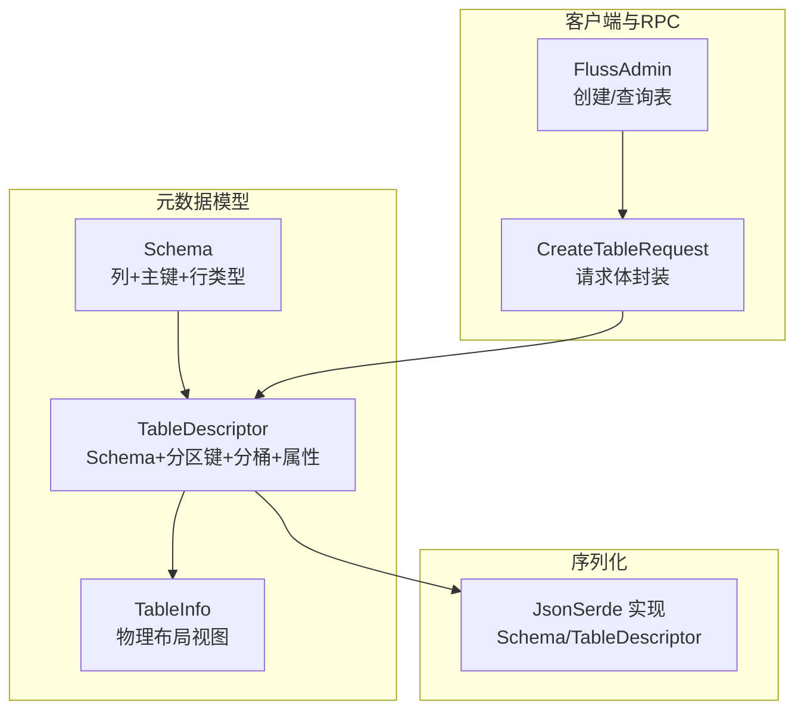
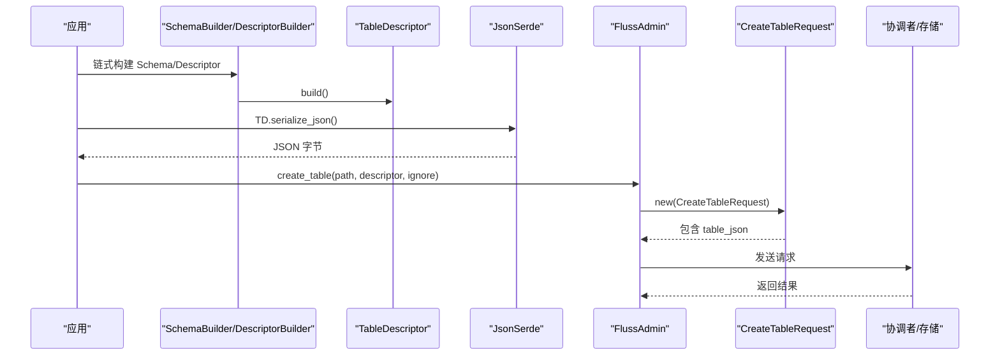
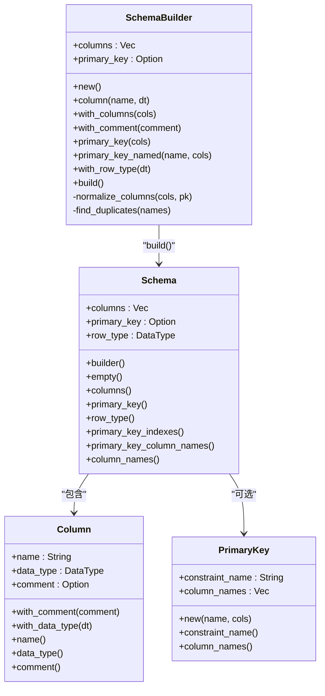
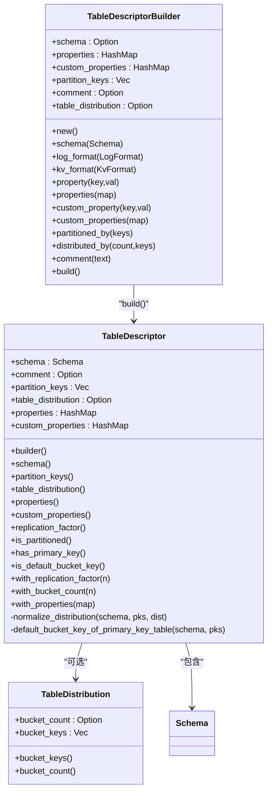
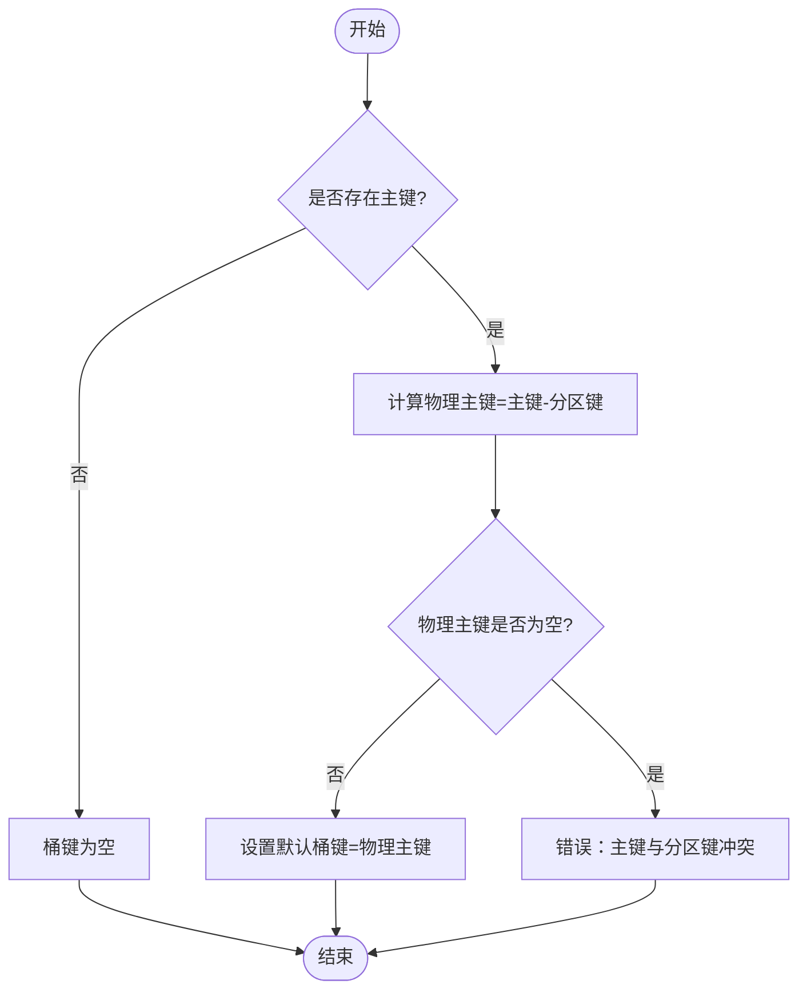
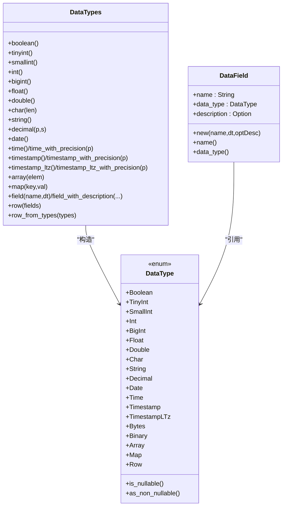
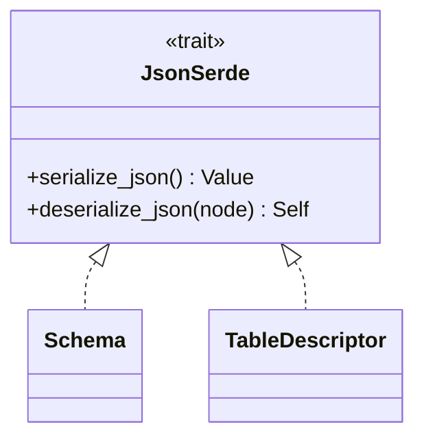
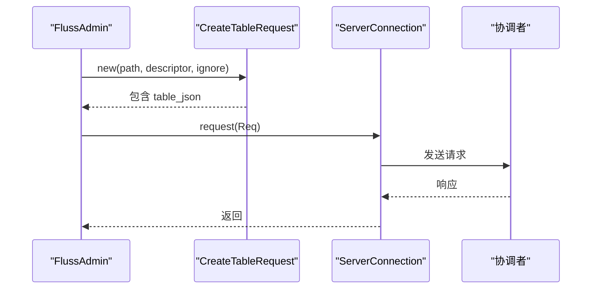
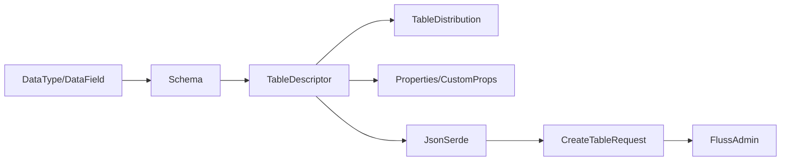

# 表描述符

<cite>
**本文引用的文件**
- [crates/fluss/src/metadata/table.rs](file://crates/fluss/src/metadata/table.rs)
- [crates/fluss/src/metadata/datatype.rs](file://crates/fluss/src/metadata/datatype.rs)
- [crates/fluss/src/metadata/json_serde.rs](file://crates/fluss/src/metadata/json_serde.rs)
- [crates/fluss/src/rpc/message/create_table.rs](file://crates/fluss/src/rpc/message/create_table.rs)
- [crates/fluss/src/client/admin.rs](file://crates/fluss/src/client/admin.rs)
- [crates/examples/src/example_table.rs](file://crates/examples/src/example_table.rs)
</cite>

## 目录
1. [引言](#引言)
2. [项目结构](#项目结构)
3. [核心组件](#核心组件)
4. [架构总览](#架构总览)
5. [组件详解](#组件详解)
6. [依赖关系分析](#依赖关系分析)
7. [性能与可扩展性](#性能与可扩展性)
8. [故障排查指南](#故障排查指南)
9. [结论](#结论)
10. [附录：常见场景与最佳实践](#附录常见场景与最佳实践)

## 引言
本文件系统性阐述 Fluss 中“表描述符”（TableDescriptor）的设计与实现，覆盖其核心组成（Schema、分区键、分桶策略、属性配置）、构建流程（SchemaBuilder 与 TableDescriptorBuilder）、物理布局设计（主键约束、分区策略、分桶算法），以及配置项（复制因子、日志格式、键值格式等）。同时给出基于仓库现有实现的图示与参考路径，帮助读者在不直接阅读源码的情况下也能快速掌握表描述符的使用方式与注意事项。

## 项目结构
围绕表描述符的关键代码位于 metadata 模块，并通过 RPC 请求体与客户端管理器进行传输与持久化。示意图如下：

**图表来源**
- [crates/fluss/src/metadata/table.rs](file://crates/fluss/src/metadata/table.rs#L94-L144)
- [crates/fluss/src/metadata/table.rs](file://crates/fluss/src/metadata/table.rs#L287-L374)
- [crates/fluss/src/metadata/table.rs](file://crates/fluss/src/metadata/table.rs#L376-L439)
- [crates/fluss/src/metadata/json_serde.rs](file://crates/fluss/src/metadata/json_serde.rs#L25-L29)
- [crates/fluss/src/metadata/json_serde.rs](file://crates/fluss/src/metadata/json_serde.rs#L297-L326)
- [crates/fluss/src/client/admin.rs](file://crates/fluss/src/client/admin.rs#L52-L67)
- [crates/fluss/src/rpc/message/create_table.rs](file://crates/fluss/src/rpc/message/create_table.rs#L33-L51)

**章节来源**
- [crates/fluss/src/metadata/table.rs](file://crates/fluss/src/metadata/table.rs#L94-L144)
- [crates/fluss/src/metadata/table.rs](file://crates/fluss/src/metadata/table.rs#L287-L374)
- [crates/fluss/src/metadata/table.rs](file://crates/fluss/src/metadata/table.rs#L376-L439)
- [crates/fluss/src/metadata/json_serde.rs](file://crates/fluss/src/metadata/json_serde.rs#L25-L29)
- [crates/fluss/src/metadata/json_serde.rs](file://crates/fluss/src/metadata/json_serde.rs#L297-L326)
- [crates/fluss/src/client/admin.rs](file://crates/fluss/src/client/admin.rs#L52-L67)
- [crates/fluss/src/rpc/message/create_table.rs](file://crates/fluss/src/rpc/message/create_table.rs#L33-L51)

## 核心组件
- Schema：定义表的列集合、主键约束、以及行类型（RowType）。提供 SchemaBuilder 以链式构建。
- TableDescriptor：承载 Schema、分区键、分桶分布、注释、通用属性与自定义属性；提供 TableDescriptorBuilder 以链式构建。
- TableInfo：从持久化元数据还原出的“物理布局视图”，包含物理主键、分桶键、分区键、桶数量、表配置等。
- DataType/DataField：基础数据类型与字段定义，支撑 Schema 的列定义。
- JsonSerde：为 Schema、TableDescriptor 提供 JSON 序列化/反序列化能力。
- RPC 请求体与客户端：CreateTableRequest 将 TableDescriptor 序列化后发送给协调者；FlussAdmin 负责创建与查询表。

**章节来源**
- [crates/fluss/src/metadata/table.rs](file://crates/fluss/src/metadata/table.rs#L94-L144)
- [crates/fluss/src/metadata/table.rs](file://crates/fluss/src/metadata/table.rs#L287-L374)
- [crates/fluss/src/metadata/table.rs](file://crates/fluss/src/metadata/table.rs#L376-L439)
- [crates/fluss/src/metadata/table.rs](file://crates/fluss/src/metadata/table.rs#L634-L661)
- [crates/fluss/src/metadata/datatype.rs](file://crates/fluss/src/metadata/datatype.rs#L23-L44)
- [crates/fluss/src/metadata/json_serde.rs](file://crates/fluss/src/metadata/json_serde.rs#L25-L29)
- [crates/fluss/src/metadata/json_serde.rs](file://crates/fluss/src/metadata/json_serde.rs#L297-L326)
- [crates/fluss/src/rpc/message/create_table.rs](file://crates/fluss/src/rpc/message/create_table.rs#L33-L51)
- [crates/fluss/src/client/admin.rs](file://crates/fluss/src/client/admin.rs#L52-L67)

## 架构总览
下图展示了从应用侧构建表描述符到最终创建表的端到端流程，以及 JSON 序列化在其中的作用。

**图表来源**
- [crates/fluss/src/metadata/table.rs](file://crates/fluss/src/metadata/table.rs#L101-L108)
- [crates/fluss/src/metadata/table.rs](file://crates/fluss/src/metadata/table.rs#L386-L389)
- [crates/fluss/src/metadata/json_serde.rs](file://crates/fluss/src/metadata/json_serde.rs#L328-L370)
- [crates/fluss/src/client/admin.rs](file://crates/fluss/src/client/admin.rs#L52-L67)
- [crates/fluss/src/rpc/message/create_table.rs](file://crates/fluss/src/rpc/message/create_table.rs#L33-L51)

## 组件详解

### Schema 与 SchemaBuilder
- 定义
  - 列（Column）：名称、数据类型、可选注释。
  - 主键（PrimaryKey）：约束名与列名列表。
  - 行类型（RowType）：由字段（DataField）构成，用于表达整行结构。
- 关键行为
  - SchemaBuilder::column/with_columns：追加列。
  - SchemaBuilder::primary_key/primary_key_named：设置主键约束。
  - SchemaBuilder::build：校验重复列名、主键完整性、主键列非空约束等，并生成 Schema 与 RowType。
- 复杂度
  - 列名去重与主键校验为 O(n) 级别（n 为列数）。
  - 主键列非空转换为 O(n)。

**图表来源**
- [crates/fluss/src/metadata/table.rs](file://crates/fluss/src/metadata/table.rs#L26-L67)
- [crates/fluss/src/metadata/table.rs](file://crates/fluss/src/metadata/table.rs#L69-L91)
- [crates/fluss/src/metadata/table.rs](file://crates/fluss/src/metadata/table.rs#L94-L144)
- [crates/fluss/src/metadata/table.rs](file://crates/fluss/src/metadata/table.rs#L146-L268)

**章节来源**
- [crates/fluss/src/metadata/table.rs](file://crates/fluss/src/metadata/table.rs#L26-L67)
- [crates/fluss/src/metadata/table.rs](file://crates/fluss/src/metadata/table.rs#L69-L91)
- [crates/fluss/src/metadata/table.rs](file://crates/fluss/src/metadata/table.rs#L94-L144)
- [crates/fluss/src/metadata/table.rs](file://crates/fluss/src/metadata/table.rs#L146-L268)

### TableDescriptor 与 TableDescriptorBuilder
- 定义
  - 包含 Schema、分区键（partition_keys）、分桶分布（TableDistribution）、注释、属性（properties）、自定义属性（custom_properties）。
  - TableDistribution：包含可选桶数量与桶键（bucket_keys）。
- 关键行为
  - TableDescriptorBuilder::schema/log_format/kv_format/property/custom_property/partitioned_by/distributed_by/comment/build：链式配置并构建。
  - TableDescriptor::normalize_distribution：校验桶键与分区键互斥、主键表的桶键必须是主键且排除分区键的子集等。
  - 默认桶键推导：当存在主键且未显式指定桶键时，自动取“物理主键”（即主键剔除分区键后的剩余列）。
- 属性读写
  - replication_factor：从 properties 中解析 table.replication.factor。
  - with_replication_factor/with_bucket_count/with_properties：返回新实例（不可变更新）。

**图表来源**
- [crates/fluss/src/metadata/table.rs](file://crates/fluss/src/metadata/table.rs#L270-L285)
- [crates/fluss/src/metadata/table.rs](file://crates/fluss/src/metadata/table.rs#L287-L374)
- [crates/fluss/src/metadata/table.rs](file://crates/fluss/src/metadata/table.rs#L376-L565)

**章节来源**
- [crates/fluss/src/metadata/table.rs](file://crates/fluss/src/metadata/table.rs#L270-L285)
- [crates/fluss/src/metadata/table.rs](file://crates/fluss/src/metadata/table.rs#L287-L374)
- [crates/fluss/src/metadata/table.rs](file://crates/fluss/src/metadata/table.rs#L376-L565)

### 物理布局与默认分桶键
- 物理主键（physical primary keys）= 主键 - 分区键
- 当存在主键且未显式指定桶键时，默认桶键为物理主键；若主键与分区键完全重合则报错。
- 若未设置主键，则默认桶键为空。

**图表来源**
- [crates/fluss/src/metadata/table.rs](file://crates/fluss/src/metadata/table.rs#L487-L508)
- [crates/fluss/src/metadata/table.rs](file://crates/fluss/src/metadata/table.rs#L510-L564)

**章节来源**
- [crates/fluss/src/metadata/table.rs](file://crates/fluss/src/metadata/table.rs#L487-L508)
- [crates/fluss/src/metadata/table.rs](file://crates/fluss/src/metadata/table.rs#L510-L564)

### 数据类型与字段
- DataType：覆盖布尔、整型、浮点、字符串、日期时间、数组、映射、行类型等。
- DataField：字段名、数据类型、可选描述。
- DataTypes 工厂方法：便捷构造常用数据类型与行类型。

**图表来源**
- [crates/fluss/src/metadata/datatype.rs](file://crates/fluss/src/metadata/datatype.rs#L23-L44)
- [crates/fluss/src/metadata/datatype.rs](file://crates/fluss/src/metadata/datatype.rs#L625-L647)
- [crates/fluss/src/metadata/datatype.rs](file://crates/fluss/src/metadata/datatype.rs#L649-L787)
- [crates/fluss/src/metadata/datatype.rs](file://crates/fluss/src/metadata/datatype.rs#L790-L812)

**章节来源**
- [crates/fluss/src/metadata/datatype.rs](file://crates/fluss/src/metadata/datatype.rs#L23-L44)
- [crates/fluss/src/metadata/datatype.rs](file://crates/fluss/src/metadata/datatype.rs#L625-L647)
- [crates/fluss/src/metadata/datatype.rs](file://crates/fluss/src/metadata/datatype.rs#L649-L787)
- [crates/fluss/src/metadata/datatype.rs](file://crates/fluss/src/metadata/datatype.rs#L790-L812)

### JSON 序列化与反序列化
- Schema/TableDescriptor 实现了 JsonSerde trait，支持版本化 JSON 结构：
  - Schema：包含 columns、primary_key、version。
  - TableDescriptor：包含 schema、comment、partition_key、bucket_key、bucket_count、properties、custom_properties、version。
- 反序列化时严格校验字段存在性与类型，确保一致性。

**图表来源**
- [crates/fluss/src/metadata/json_serde.rs](file://crates/fluss/src/metadata/json_serde.rs#L25-L29)
- [crates/fluss/src/metadata/json_serde.rs](file://crates/fluss/src/metadata/json_serde.rs#L225-L295)
- [crates/fluss/src/metadata/json_serde.rs](file://crates/fluss/src/metadata/json_serde.rs#L297-L326)

**章节来源**
- [crates/fluss/src/metadata/json_serde.rs](file://crates/fluss/src/metadata/json_serde.rs#L225-L295)
- [crates/fluss/src/metadata/json_serde.rs](file://crates/fluss/src/metadata/json_serde.rs#L297-L326)

### RPC 与客户端集成
- FlussAdmin::create_table：构造 CreateTableRequest，携带 table_json（由 TableDescriptor 序列化而来），发送至协调者。
- FlussAdmin::get_table：从响应中反序列化 TableDescriptor 并转为 TableInfo。

**图表来源**
- [crates/fluss/src/client/admin.rs](file://crates/fluss/src/client/admin.rs#L52-L67)
- [crates/fluss/src/rpc/message/create_table.rs](file://crates/fluss/src/rpc/message/create_table.rs#L33-L51)

**章节来源**
- [crates/fluss/src/client/admin.rs](file://crates/fluss/src/client/admin.rs#L52-L67)
- [crates/fluss/src/rpc/message/create_table.rs](file://crates/fluss/src/rpc/message/create_table.rs#L33-L51)

## 依赖关系分析
- 内聚性
  - Schema 与 DataType/DataField 高内聚，统一管理列与行结构。
  - TableDescriptor 与 TableDistribution 协同，统一管理分区与分桶策略。
- 耦合性
  - TableDescriptorBuilder 对 SchemaBuilder 的依赖清晰，职责单一。
  - JsonSerde 作为跨模块的序列化契约，被 RPC 请求体与客户端共同使用。
- 外部依赖
  - RPC 使用 prost/bytes 进行协议编解码。
  - JSON 使用 serde_json。

**图表来源**
- [crates/fluss/src/metadata/datatype.rs](file://crates/fluss/src/metadata/datatype.rs#L23-L44)
- [crates/fluss/src/metadata/table.rs](file://crates/fluss/src/metadata/table.rs#L94-L144)
- [crates/fluss/src/metadata/table.rs](file://crates/fluss/src/metadata/table.rs#L270-L285)
- [crates/fluss/src/metadata/table.rs](file://crates/fluss/src/metadata/table.rs#L376-L439)
- [crates/fluss/src/metadata/json_serde.rs](file://crates/fluss/src/metadata/json_serde.rs#L297-L326)
- [crates/fluss/src/rpc/message/create_table.rs](file://crates/fluss/src/rpc/message/create_table.rs#L33-L51)
- [crates/fluss/src/client/admin.rs](file://crates/fluss/src/client/admin.rs#L52-L67)

**章节来源**
- [crates/fluss/src/metadata/datatype.rs](file://crates/fluss/src/metadata/datatype.rs#L23-L44)
- [crates/fluss/src/metadata/table.rs](file://crates/fluss/src/metadata/table.rs#L94-L144)
- [crates/fluss/src/metadata/table.rs](file://crates/fluss/src/metadata/table.rs#L270-L285)
- [crates/fluss/src/metadata/table.rs](file://crates/fluss/src/metadata/table.rs#L376-L439)
- [crates/fluss/src/metadata/json_serde.rs](file://crates/fluss/src/metadata/json_serde.rs#L297-L326)
- [crates/fluss/src/rpc/message/create_table.rs](file://crates/fluss/src/rpc/message/create_table.rs#L33-L51)
- [crates/fluss/src/client/admin.rs](file://crates/fluss/src/client/admin.rs#L52-L67)

## 性能与可扩展性
- SchemaBuilder 的列名去重与主键校验为线性复杂度，适合大多数建模场景。
- TableDescriptor::normalize_distribution 在主键表上进行集合运算，整体仍为线性。
- JSON 序列化/反序列化为 O(n)（n 为字段数量），在大 Schema 场景下建议避免频繁序列化。
- 复制因子与桶数量等属性通过 HashMap 存储，访问为平均 O(1)。

[本节为通用性能讨论，无需列出具体文件来源]

## 故障排查指南
- 重复列名
  - 现象：构建 Schema 报错提示重复列名。
  - 排查：检查 SchemaBuilder::column 与 with_columns 的调用，确保列名唯一。
  - 参考实现位置：[crates/fluss/src/metadata/table.rs](file://crates/fluss/src/metadata/table.rs#L252-L267)
- 主键列缺失或非空
  - 现象：主键列不在 Schema 或主键列为可空类型时报错。
  - 排查：确认主键列存在于 Schema，且主键列需为非空。
  - 参考实现位置：[crates/fluss/src/metadata/table.rs](file://crates/fluss/src/metadata/table.rs#L217-L250)
- 分区键与桶键冲突
  - 现象：显式指定桶键包含分区键时报错。
  - 排查：确保桶键与分区键无交集；主键表的桶键必须是主键且排除分区键的子集。
  - 参考实现位置：[crates/fluss/src/metadata/table.rs](file://crates/fluss/src/metadata/table.rs#L510-L564)
- 主键与分区键完全一致
  - 现象：默认桶键为空导致错误。
  - 排查：调整主键或分区键，使物理主键非空。
  - 参考实现位置：[crates/fluss/src/metadata/table.rs](file://crates/fluss/src/metadata/table.rs#L487-L508)
- 复制因子未设置或非法
  - 现象：读取 replication_factor 报错或解析失败。
  - 排查：通过 with_replication_factor 设置合法整数。
  - 参考实现位置：[crates/fluss/src/metadata/table.rs](file://crates/fluss/src/metadata/table.rs#L441-L451)

**章节来源**
- [crates/fluss/src/metadata/table.rs](file://crates/fluss/src/metadata/table.rs#L252-L267)
- [crates/fluss/src/metadata/table.rs](file://crates/fluss/src/metadata/table.rs#L217-L250)
- [crates/fluss/src/metadata/table.rs](file://crates/fluss/src/metadata/table.rs#L510-L564)
- [crates/fluss/src/metadata/table.rs](file://crates/fluss/src/metadata/table.rs#L487-L508)
- [crates/fluss/src/metadata/table.rs](file://crates/fluss/src/metadata/table.rs#L441-L451)

## 结论
TableDescriptor 通过 SchemaBuilder 与 TableDescriptorBuilder 提供了强类型的表定义与配置能力，结合 JsonSerde 与 RPC 流程实现了从应用到协调者的完整闭环。其在主键约束、分区与分桶策略上的约束保证了表的物理布局一致性与可预测性。遵循本文档中的最佳实践与排障指引，可在生产环境中稳定地使用表描述符进行建模与部署。

[本节为总结性内容，无需列出具体文件来源]

## 附录：常见场景与最佳实践
- 创建简单表（无主键）
  - 使用 SchemaBuilder 添加列，不设置主键；TableDescriptor 默认桶键为空。
  - 参考示例路径：[crates/examples/src/example_table.rs](file://crates/examples/src/example_table.rs#L34-L41)
- 创建主键表（推荐）
  - 使用 SchemaBuilder.primary_key 指定主键列；未显式指定桶键时，系统自动推导默认桶键为物理主键。
  - 注意：主键列必须非空，且不得与分区键重合。
  - 参考实现位置：[crates/fluss/src/metadata/table.rs](file://crates/fluss/src/metadata/table.rs#L188-L196)，[crates/fluss/src/metadata/table.rs](file://crates/fluss/src/metadata/table.rs#L510-L564)
- 指定分区键
  - 使用 TableDescriptorBuilder.partitioned_by 指定分区键；确保桶键与分区键无交集。
  - 参考实现位置：[crates/fluss/src/metadata/table.rs](file://crates/fluss/src/metadata/table.rs#L340-L343)，[crates/fluss/src/metadata/table.rs](file://crates/fluss/src/metadata/table.rs#L510-L525)
- 自定义分桶策略
  - 使用 distributed_by 指定桶数量与桶键；主键表的桶键必须是主键且排除分区键的子集。
  - 参考实现位置：[crates/fluss/src/metadata/table.rs](file://crates/fluss/src/metadata/table.rs#L345-L351)，[crates/fluss/src/metadata/table.rs](file://crates/fluss/src/metadata/table.rs#L527-L555)
- 设置复制因子
  - 使用 with_replication_factor 或 properties 中的 table.replication.factor。
  - 参考实现位置：[crates/fluss/src/metadata/table.rs](file://crates/fluss/src/metadata/table.rs#L460-L467)，[crates/fluss/src/metadata/table.rs](file://crates/fluss/src/metadata/table.rs#L441-L451)
- 日志与键值格式
  - 使用 log_format 与 kv_format 控制日志与键值编码格式。
  - 参考实现位置：[crates/fluss/src/metadata/table.rs](file://crates/fluss/src/metadata/table.rs#L307-L317)，[crates/fluss/src/metadata/table.rs](file://crates/fluss/src/metadata/table.rs#L567-L601)
- 创建与查询表
  - 使用 FlussAdmin::create_table 与 get_table 完成表生命周期管理。
  - 参考实现位置：[crates/fluss/src/client/admin.rs](file://crates/fluss/src/client/admin.rs#L52-L67)，[crates/fluss/src/client/admin.rs](file://crates/fluss/src/client/admin.rs#L69-L92)
- JSON 序列化
  - 通过 JsonSerde 将 TableDescriptor 序列化为 JSON，用于 RPC 传输。
  - 参考实现位置：[crates/fluss/src/metadata/json_serde.rs](file://crates/fluss/src/metadata/json_serde.rs#L328-L370)，[crates/fluss/src/rpc/message/create_table.rs](file://crates/fluss/src/rpc/message/create_table.rs#L44-L47)