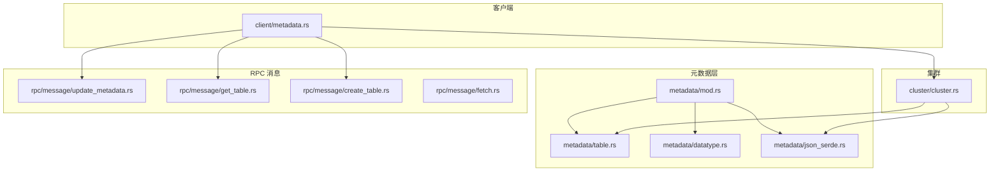
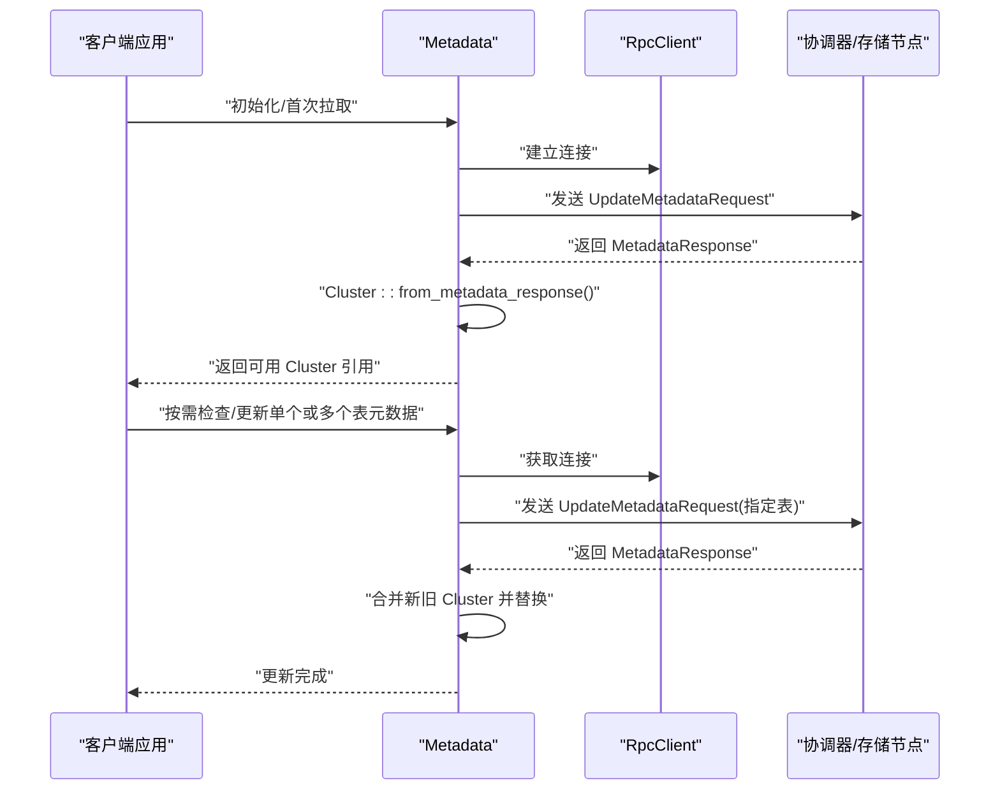
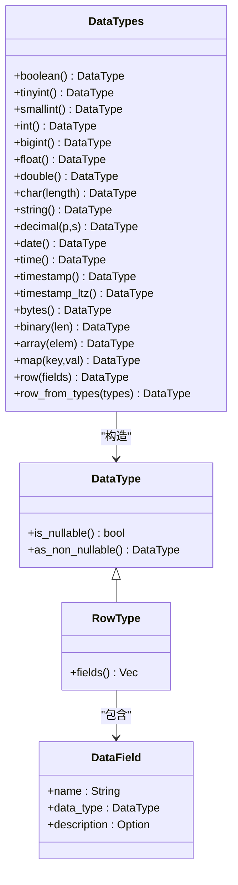
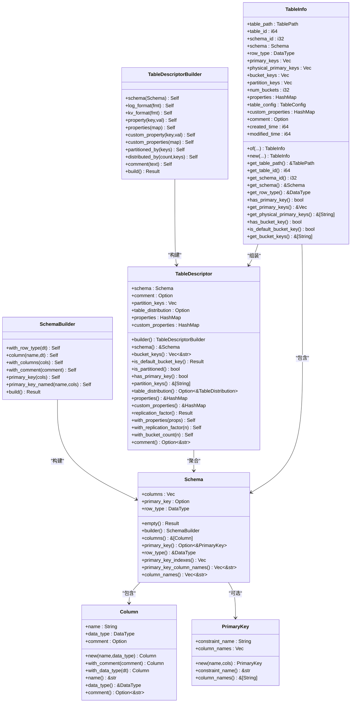
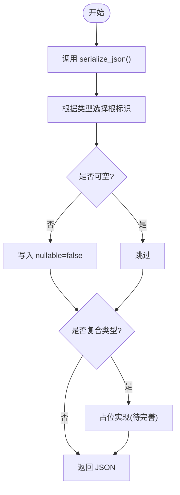
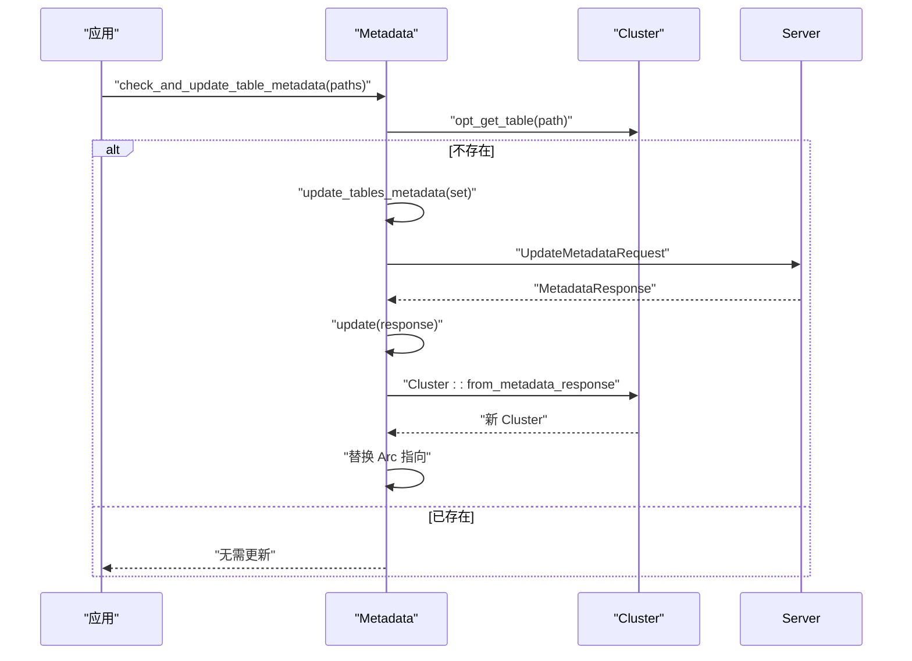
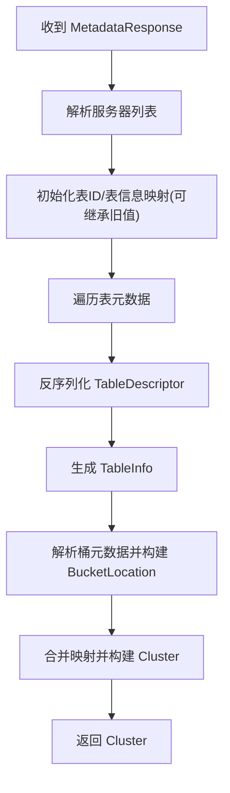
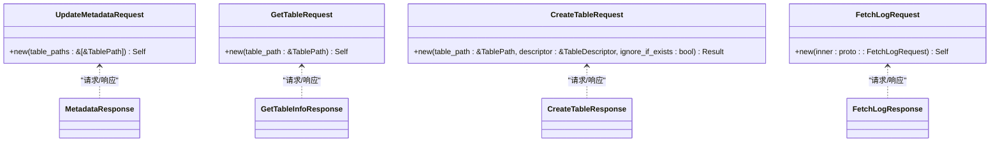
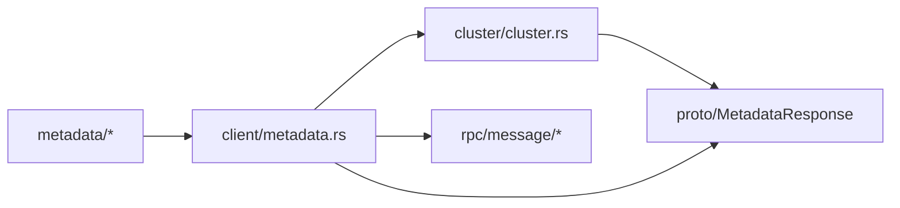
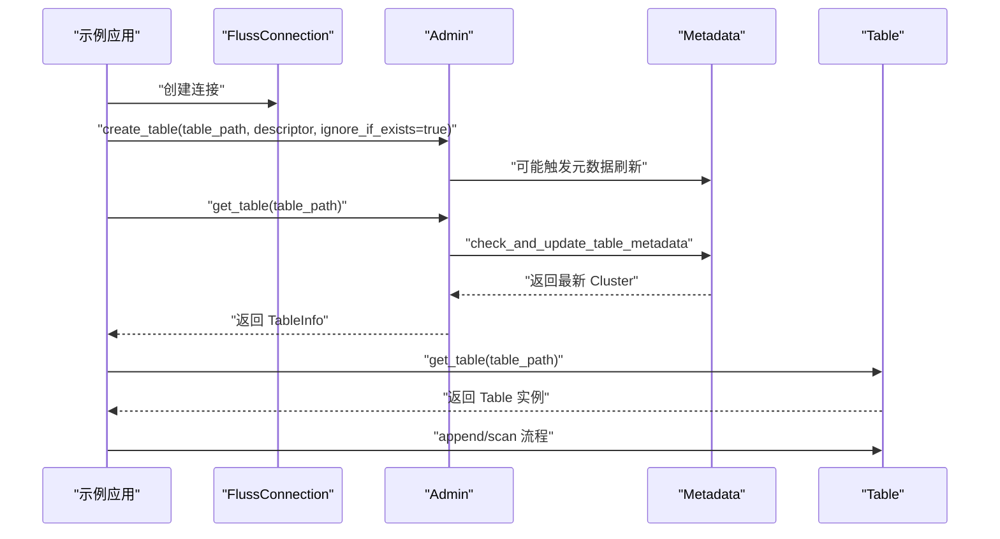

# 元数据管理

<cite>
**本文引用的文件**
- [crates/fluss/src/metadata/mod.rs](file://crates/fluss/src/metadata/mod.rs)
- [crates/fluss/src/metadata/table.rs](file://crates/fluss/src/metadata/table.rs)
- [crates/fluss/src/metadata/datatype.rs](file://crates/fluss/src/metadata/datatype.rs)
- [crates/fluss/src/metadata/json_serde.rs](file://crates/fluss/src/metadata/json_serde.rs)
- [crates/fluss/src/client/metadata.rs](file://crates/fluss/src/client/metadata.rs)
- [crates/fluss/src/cluster/cluster.rs](file://crates/fluss/src/cluster/cluster.rs)
- [crates/fluss/src/rpc/message/update_metadata.rs](file://crates/fluss/src/rpc/message/update_metadata.rs)
- [crates/fluss/src/rpc/message/get_table.rs](file://crates/fluss/src/rpc/message/get_table.rs)
- [crates/fluss/src/rpc/message/create_table.rs](file://crates/fluss/src/rpc/message/create_table.rs)
- [crates/fluss/src/rpc/message/fetch.rs](file://crates/fluss/src/rpc/message/fetch.rs)
- [crates/examples/src/example_table.rs](file://crates/examples/src/example_table.rs)
</cite>

## 目录
1. [简介](#简介)
2. [项目结构](#项目结构)
3. [核心组件](#核心组件)
4. [架构总览](#架构总览)
5. [组件详解](#组件详解)
6. [依赖关系分析](#依赖关系分析)
7. [性能与并发](#性能与并发)
8. [故障排查指南](#故障排查指南)
9. [结论](#结论)
10. [附录：使用示例与最佳实践](#附录使用示例与最佳实践)

## 简介
本文件系统性梳理 Fluss 元数据管理子系统，重点覆盖以下方面：
- 元数据缓存与一致性：客户端如何拉取、更新与持有集群元数据视图，以及在并发场景下的读写策略。
- 表描述符与表信息：表结构定义、主键约束、分布策略、属性配置等的建模与校验。
- 数据类型系统：内置标量与复合类型、可空性、序列化/反序列化与扩展机制。
- 元数据 API：查询、创建、更新与同步的 RPC 接口与调用流程。
- 实际使用示例：从创建表到写入、扫描的端到端流程，展示元数据获取、缓存与更新。

## 项目结构
元数据相关代码主要分布在以下模块：
- metadata：类型系统、表结构、JSON 序列化/反序列化
- client：客户端元数据缓存与更新入口
- cluster：集群视图构建与更新
- rpc/message：元数据相关的请求/响应消息定义
- examples：端到端示例

**图表来源**
- [crates/fluss/src/metadata/mod.rs](file://crates/fluss/src/metadata/mod.rs#L18-L25)
- [crates/fluss/src/metadata/table.rs](file://crates/fluss/src/metadata/table.rs#L1-L120)
- [crates/fluss/src/metadata/datatype.rs](file://crates/fluss/src/metadata/datatype.rs#L21-L44)
- [crates/fluss/src/metadata/json_serde.rs](file://crates/fluss/src/metadata/json_serde.rs#L25-L465)
- [crates/fluss/src/client/metadata.rs](file://crates/fluss/src/client/metadata.rs#L29-L110)
- [crates/fluss/src/cluster/cluster.rs](file://crates/fluss/src/cluster/cluster.rs#L29-L171)
- [crates/fluss/src/rpc/message/update_metadata.rs](file://crates/fluss/src/rpc/message/update_metadata.rs#L29-L61)
- [crates/fluss/src/rpc/message/get_table.rs](file://crates/fluss/src/rpc/message/get_table.rs#L29-L55)
- [crates/fluss/src/rpc/message/create_table.rs](file://crates/fluss/src/rpc/message/create_table.rs#L32-L63)
- [crates/fluss/src/rpc/message/fetch.rs](file://crates/fluss/src/rpc/message/fetch.rs#L35-L57)

**章节来源**
- [crates/fluss/src/metadata/mod.rs](file://crates/fluss/src/metadata/mod.rs#L18-L25)

## 核心组件
- 数据类型系统：统一的 DataType 枚举及各标量/复合类型，支持可空性标记与序列化。
- 表结构模型：Schema、Column、PrimaryKey；TableDescriptor 聚合 Schema 与分布/分区/属性等。
- JSON 序列化：DataType/Schema/TableDescriptor 的 JSON 表达与互转。
- 客户端元数据缓存：Metadata 维护 Cluster 的 Arc 包裹与读写锁，提供增量更新能力。
- 集群视图：Cluster 从 MetadataResponse 构建，维护表 ID、表信息、桶位置等映射。
- 元数据 API：UpdateMetadataRequest、GetTableRequest、CreateTableRequest 等消息封装。

**章节来源**
- [crates/fluss/src/metadata/datatype.rs](file://crates/fluss/src/metadata/datatype.rs#L21-L94)
- [crates/fluss/src/metadata/table.rs](file://crates/fluss/src/metadata/table.rs#L26-L144)
- [crates/fluss/src/metadata/json_serde.rs](file://crates/fluss/src/metadata/json_serde.rs#L25-L465)
- [crates/fluss/src/client/metadata.rs](file://crates/fluss/src/client/metadata.rs#L29-L110)
- [crates/fluss/src/cluster/cluster.rs](file://crates/fluss/src/cluster/cluster.rs#L29-L171)

## 架构总览
下图展示了客户端如何通过 RPC 获取元数据并更新本地 Cluster 视图，以及后续如何基于该视图进行表访问与写入。

**图表来源**
- [crates/fluss/src/client/metadata.rs](file://crates/fluss/src/client/metadata.rs#L36-L94)
- [crates/fluss/src/cluster/cluster.rs](file://crates/fluss/src/cluster/cluster.rs#L88-L171)
- [crates/fluss/src/rpc/message/update_metadata.rs](file://crates/fluss/src/rpc/message/update_metadata.rs#L29-L61)

## 组件详解

### 数据类型系统（DataType）
- 设计要点
  - DataType 为枚举，涵盖布尔、整型、浮点、字符串、十进制、日期时间、字节、数组、映射、行类型等。
  - 每个具体类型包含可空性标志，提供转换为非可空类型的方法。
  - 提供 DataTypes 工厂方法，便于快速构造常用类型。
- 扩展机制
  - 新增类型时，在 DataType 枚举中添加变体，并在 DataTypes 中补充工厂方法。
  - JSON 序列化/反序列化通过 JsonSerde trait 与 DataType::to_type_root 协作实现。
- 复杂度与性能
  - 类型比较与转换为 O(1)，内存占用取决于具体类型（如数组/映射包含嵌套类型）。
  - 可空性判断与转换为常数时间操作。

**图表来源**
- [crates/fluss/src/metadata/datatype.rs](file://crates/fluss/src/metadata/datatype.rs#L21-L94)
- [crates/fluss/src/metadata/datatype.rs](file://crates/fluss/src/metadata/datatype.rs#L649-L787)
- [crates/fluss/src/metadata/datatype.rs](file://crates/fluss/src/metadata/datatype.rs#L625-L647)
- [crates/fluss/src/metadata/datatype.rs](file://crates/fluss/src/metadata/datatype.rs#L789-L800)

**章节来源**
- [crates/fluss/src/metadata/datatype.rs](file://crates/fluss/src/metadata/datatype.rs#L21-L94)
- [crates/fluss/src/metadata/datatype.rs](file://crates/fluss/src/metadata/datatype.rs#L649-L787)

### 表描述符与表信息（Schema、TableDescriptor、TableInfo）
- Schema
  - 由列集合与可选主键构成，支持从 RowType 反向推导列。
  - 提供列名、主键索引、主键列名等便捷查询。
  - 构建过程会校验重复列名、主键完整性与可空性约束（主键列不可为可空）。
- TableDescriptor
  - 聚合 Schema、注释、分区键、分桶分布、属性与自定义属性。
  - 分布策略规范化：当存在主键表且未显式设置分桶键时，自动推导默认分桶键（排除分区键）。
  - 属性校验：复制因子等属性以字符串形式存储，提供解析与更新方法。
- TableInfo
  - 由 TableDescriptor 与元数据响应组装，包含物理主键、桶键、桶数量、表配置等。
  - 提供便捷访问器，如 get_table_path、get_schema、has_primary_key 等。

**图表来源**
- [crates/fluss/src/metadata/table.rs](file://crates/fluss/src/metadata/table.rs#L26-L144)
- [crates/fluss/src/metadata/table.rs](file://crates/fluss/src/metadata/table.rs#L146-L268)
- [crates/fluss/src/metadata/table.rs](file://crates/fluss/src/metadata/table.rs#L287-L374)
- [crates/fluss/src/metadata/table.rs](file://crates/fluss/src/metadata/table.rs#L376-L565)
- [crates/fluss/src/metadata/table.rs](file://crates/fluss/src/metadata/table.rs#L634-L754)

**章节来源**
- [crates/fluss/src/metadata/table.rs](file://crates/fluss/src/metadata/table.rs#L146-L268)
- [crates/fluss/src/metadata/table.rs](file://crates/fluss/src/metadata/table.rs#L287-L374)
- [crates/fluss/src/metadata/table.rs](file://crates/fluss/src/metadata/table.rs#L376-L565)
- [crates/fluss/src/metadata/table.rs](file://crates/fluss/src/metadata/table.rs#L634-L754)

### JSON 序列化/反序列化（JsonSerde）
- 目标
  - 将 DataType/Schema/TableDescriptor 以 JSON 形式在客户端与服务端之间传输。
- 关键点
  - DataType::to_type_root 提供类型根标识，JsonSerde::serialize_json/deserialize_json 实现互转。
  - Schema/TableDescriptor 带版本号字段，确保兼容性。
  - 对复杂类型（如 Decimal、Time/Timestamp、Array/Map/Row）保留占位实现，便于后续完善。
- 使用场景
  - 创建表时将 TableDescriptor 序列化为 JSON 发送给服务端。
  - 服务端将表元数据以 JSON 形式返回，客户端反序列化为 TableDescriptor/Schema。

**图表来源**
- [crates/fluss/src/metadata/json_serde.rs](file://crates/fluss/src/metadata/json_serde.rs#L82-L176)
- [crates/fluss/src/metadata/json_serde.rs](file://crates/fluss/src/metadata/json_serde.rs#L232-L295)
- [crates/fluss/src/metadata/json_serde.rs](file://crates/fluss/src/metadata/json_serde.rs#L328-L464)

**章节来源**
- [crates/fluss/src/metadata/json_serde.rs](file://crates/fluss/src/metadata/json_serde.rs#L25-L465)

### 客户端元数据缓存（Metadata）
- 缓存策略
  - 使用 RwLock<Arc<Cluster>> 保护共享状态，读多写少场景下提升并发性能。
  - 初始启动时通过 UpdateMetadataRequest 拉取全量元数据，构建初始 Cluster。
- 更新机制
  - 支持按表批量更新：check_and_update_table_metadata 仅对缺失的表路径发起请求。
  - update_tables_metadata 与 update_table_metadata 提供单表/多表刷新。
  - update 将新 Cluster 与旧 Cluster 合并后整体替换，保证一致性。
- 一致性保证
  - 通过原子替换 Arc 指向的新 Cluster，避免读线程看到不一致中间态。
  - Cluster::from_metadata_response 在合并时保留原 Cluster 的已知表信息，减少抖动。

**图表来源**
- [crates/fluss/src/client/metadata.rs](file://crates/fluss/src/client/metadata.rs#L83-L94)
- [crates/fluss/src/client/metadata.rs](file://crates/fluss/src/client/metadata.rs#L66-L94)
- [crates/fluss/src/cluster/cluster.rs](file://crates/fluss/src/cluster/cluster.rs#L88-L171)

**章节来源**
- [crates/fluss/src/client/metadata.rs](file://crates/fluss/src/client/metadata.rs#L29-L110)
- [crates/fluss/src/cluster/cluster.rs](file://crates/fluss/src/cluster/cluster.rs#L88-L171)

### 集群视图（Cluster）
- 构建流程
  - 从 MetadataResponse 解析服务器列表、表 ID 映射、表信息映射。
  - 将每个表的桶元数据映射为 BucketLocation，并区分“可用”与“不可用”的桶集合。
- 查询接口
  - 提供 leader_for、get_table、get_bucket_count、get_available_buckets_for_table_path 等便捷查询。
- 更新策略
  - update 方法直接替换内部所有映射，确保全局一致性。

**图表来源**
- [crates/fluss/src/cluster/cluster.rs](file://crates/fluss/src/cluster/cluster.rs#L88-L171)

**章节来源**
- [crates/fluss/src/cluster/cluster.rs](file://crates/fluss/src/cluster/cluster.rs#L29-L171)

### 元数据 API（请求/响应）
- UpdateMetadataRequest
  - 用于请求指定表的元数据，支持批量。
- GetTableRequest
  - 获取单表信息，配合 TableInfo 使用。
- CreateTableRequest
  - 创建表时携带序列化的 TableDescriptor JSON。
- FetchLogRequest
  - 与元数据相关但偏向日志读取，此处作为参考。

**图表来源**
- [crates/fluss/src/rpc/message/update_metadata.rs](file://crates/fluss/src/rpc/message/update_metadata.rs#L29-L61)
- [crates/fluss/src/rpc/message/get_table.rs](file://crates/fluss/src/rpc/message/get_table.rs#L29-L55)
- [crates/fluss/src/rpc/message/create_table.rs](file://crates/fluss/src/rpc/message/create_table.rs#L32-L63)
- [crates/fluss/src/rpc/message/fetch.rs](file://crates/fluss/src/rpc/message/fetch.rs#L35-L57)

**章节来源**
- [crates/fluss/src/rpc/message/update_metadata.rs](file://crates/fluss/src/rpc/message/update_metadata.rs#L29-L61)
- [crates/fluss/src/rpc/message/get_table.rs](file://crates/fluss/src/rpc/message/get_table.rs#L29-L55)
- [crates/fluss/src/rpc/message/create_table.rs](file://crates/fluss/src/rpc/message/create_table.rs#L32-L63)
- [crates/fluss/src/rpc/message/fetch.rs](file://crates/fluss/src/rpc/message/fetch.rs#L35-L57)

## 依赖关系分析
- 模块内聚与耦合
  - metadata 子模块内部高内聚：datatype、table、json_serde 三者围绕类型与表结构协作。
  - client 与 cluster 通过 RPC 消息解耦：client 不直接依赖具体存储实现，只依赖协议与 Cluster 抽象。
- 外部依赖
  - RpcClient、ServerConnection 提供网络通信抽象。
  - serde_json/prost 提供序列化与协议编解码。
- 循环依赖
  - 未发现循环导入；各模块职责清晰。

**图表来源**
- [crates/fluss/src/client/metadata.rs](file://crates/fluss/src/client/metadata.rs#L18-L28)
- [crates/fluss/src/cluster/cluster.rs](file://crates/fluss/src/cluster/cluster.rs#L21-L23)
- [crates/fluss/src/rpc/message/update_metadata.rs](file://crates/fluss/src/rpc/message/update_metadata.rs#L18-L27)

**章节来源**
- [crates/fluss/src/client/metadata.rs](file://crates/fluss/src/client/metadata.rs#L18-L28)
- [crates/fluss/src/cluster/cluster.rs](file://crates/fluss/src/cluster/cluster.rs#L21-L23)

## 性能与并发
- 并发控制
  - Metadata 使用 RwLock<Arc<Cluster>>，读多写少场景下读锁无阻塞，写入通过一次性替换保证原子性。
- 缓存命中与更新粒度
  - check_and_update_table_metadata 仅对缺失的表路径发起请求，降低网络与解析开销。
  - Cluster::from_metadata_response 合并旧 Cluster 的已知表信息，避免频繁全量刷新。
- 序列化成本
  - JSON 序列化/反序列化在创建表与拉取元数据时发生，建议在高频场景下评估压缩或二进制方案（当前实现为 JSON）。
- 访问路径
  - leader_for、get_table 等查询为 O(1) 查表操作，性能稳定。

[本节为通用性能讨论，不直接分析具体文件]

## 故障排查指南
- 常见错误与定位
  - 重复列名：SchemaBuilder::normalize_columns 在构建 Schema 时检测并报错。
  - 主键缺失或越界：当主键集合不在列集合中时触发错误。
  - 分桶键冲突：分桶键与分区键重叠或非主键表设置分桶键时触发错误。
  - 复制因子解析失败：TableDescriptor::replication_factor 解析属性失败时抛错。
- 建议排查步骤
  - 检查 TableDescriptor 的 Schema 构建链路，确认列名唯一与主键完整性。
  - 校验分桶分布与分区键的交集为空。
  - 确认属性表中复制因子为合法整数。
  - 在客户端侧使用 check_and_update_table_metadata 精准刷新问题表元数据。

**章节来源**
- [crates/fluss/src/metadata/table.rs](file://crates/fluss/src/metadata/table.rs#L217-L268)
- [crates/fluss/src/metadata/table.rs](file://crates/fluss/src/metadata/table.rs#L510-L564)
- [crates/fluss/src/metadata/table.rs](file://crates/fluss/src/metadata/table.rs#L441-L451)

## 结论
本元数据管理子系统以清晰的数据类型与表结构模型为基础，结合客户端缓存与 RPC 同步，实现了高效、可扩展的元数据管理能力。通过严格的校验与版本化 JSON 序列化，系统在保证一致性的同时具备良好的演进空间。建议在生产环境中配合监控与重试策略，进一步提升稳定性与可观测性。

[本节为总结性内容，不直接分析具体文件]

## 附录：使用示例与最佳实践
- 示例概览
  - 示例程序展示了从创建表、获取表信息、写入数据到扫描日志的完整流程。
  - 客户端通过 FlussConnection 获取 Admin 与 Table 实例，期间会触发元数据的获取与缓存。
- 最佳实践
  - 首次连接时建议预热元数据，避免首次请求延迟。
  - 对热点表采用批量刷新策略，减少频繁网络往返。
  - 在高并发写入场景下，优先使用 AppendWriter 并合理设置批大小与刷新频率。
  - 对于复杂类型（Decimal/Time/Timestamp/Array/Map/Row），建议在服务端与客户端保持一致的 JSON 约定。

**图表来源**
- [crates/examples/src/example_table.rs](file://crates/examples/src/example_table.rs#L28-L86)
- [crates/fluss/src/client/metadata.rs](file://crates/fluss/src/client/metadata.rs#L83-L94)

**章节来源**
- [crates/examples/src/example_table.rs](file://crates/examples/src/example_table.rs#L28-L86)