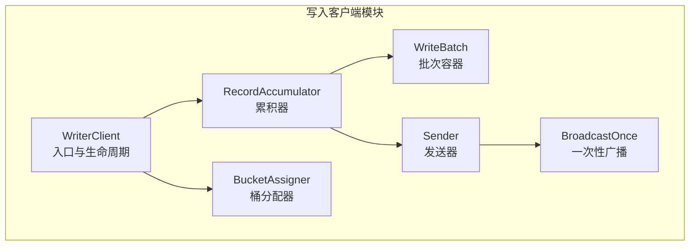
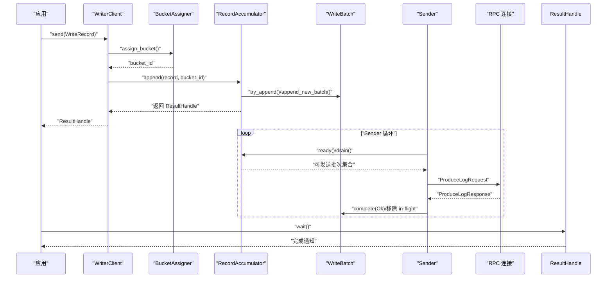
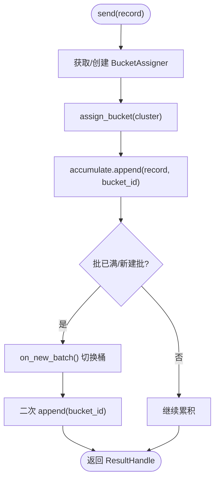
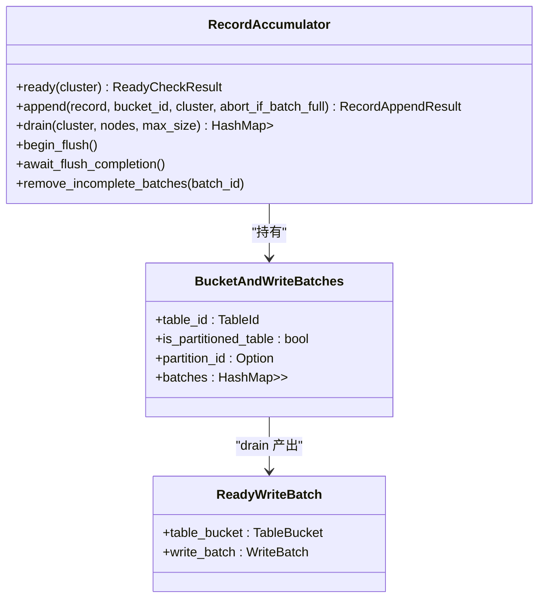
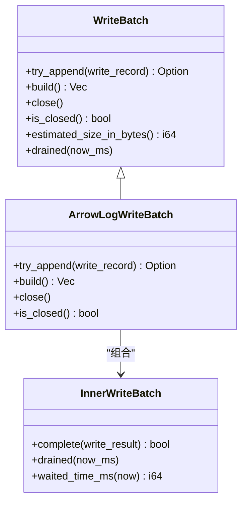
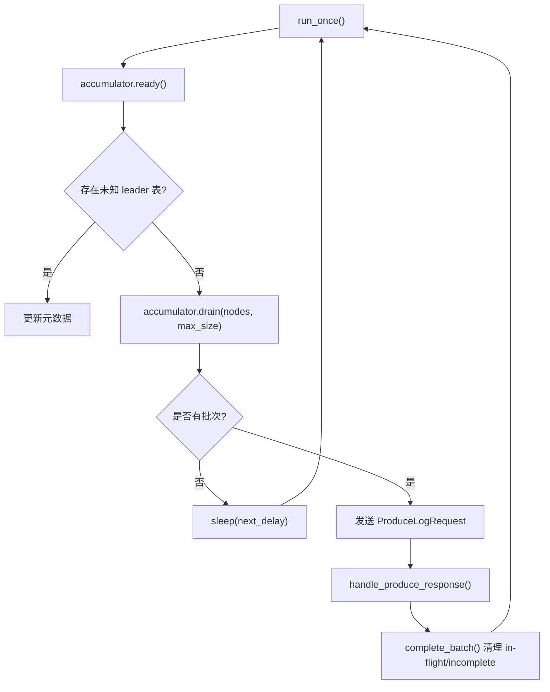
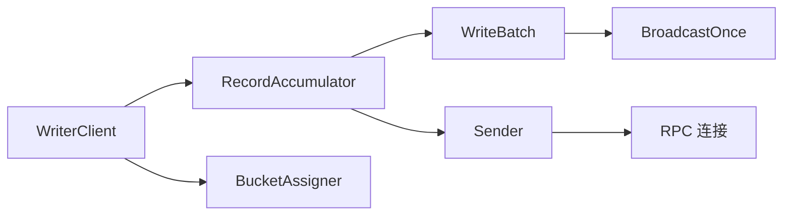

# 写入客户端系统

<cite>
**本文引用的文件**
- [writer_client.rs](file://crates/fluss/src/client/write/writer_client.rs)
- [accumulator.rs](file://crates/fluss/src/client/write/accumulator.rs)
- [batch.rs](file://crates/fluss/src/client/write/batch.rs)
- [sender.rs](file://crates/fluss/src/client/write/sender.rs)
- [bucket_assigner.rs](file://crates/fluss/src/client/write/bucket_assigner.rs)
- [broadcast.rs](file://crates/fluss/src/client/write/broadcast.rs)
- [mod.rs](file://crates/fluss/src/client/write/mod.rs)
- [config.rs](file://crates/fluss/src/config.rs)
- [lib.rs](file://crates/fluss/src/lib.rs)
- [example_table.rs](file://crates/examples/src/example_table.rs)
- [writer.rs](file://crates/fluss/src/client/table/writer.rs)
- [append.rs](file://crates/fluss/src/client/table/append.rs)
</cite>

## 目录
1. [简介](#简介)
2. [项目结构](#项目结构)
3. [核心组件](#核心组件)
4. [架构总览](#架构总览)
5. [详细组件分析](#详细组件分析)
6. [依赖关系分析](#依赖关系分析)
7. [性能考量](#性能考量)
8. [故障排查指南](#故障排查指南)
9. [结论](#结论)
10. [附录：写入 API 与最佳实践](#附录写入-api-与最佳实践)

## 简介
本文件面向“写入客户端系统”的使用者与维护者，系统性阐述 WriterClient 的设计与实现，覆盖以下主题：
- 批量写入机制：数据累积、批次管理、发送流程
- BatchAccumulator 的累积策略、内存管理与性能优化
- Batch 数据结构、序列化与压缩
- Sender 的网络发送、重试与错误处理
- 写入 API：同步与异步、回调与结果处理
- 并发控制、流量控制与资源管理
- 实际使用示例与最佳实践

## 项目结构
写入客户端位于 crates/fluss/src/client/write 下，围绕 WriterClient、RecordAccumulator、WriteBatch、Sender、BucketAssigner 与广播通知机制协作，形成“写入—累积—发送”的闭环。

图表来源
- [writer_client.rs](file://crates/fluss/src/client/write/writer_client.rs#L32-L147)
- [accumulator.rs](file://crates/fluss/src/client/write/accumulator.rs#L35-L443)
- [batch.rs](file://crates/fluss/src/client/write/batch.rs#L67-L177)
- [sender.rs](file://crates/fluss/src/client/write/sender.rs#L31-L208)
- [bucket_assigner.rs](file://crates/fluss/src/client/write/bucket_assigner.rs#L23-L103)
- [broadcast.rs](file://crates/fluss/src/client/write/broadcast.rs#L34-L120)

章节来源
- [mod.rs](file://crates/fluss/src/client/write/mod.rs#L18-L69)
- [lib.rs](file://crates/fluss/src/lib.rs#L18-L38)

## 核心组件
- WriterClient：对外暴露写入 API，负责桶分配、记录累积与唤醒发送器；管理 Sender 生命周期与关闭。
- RecordAccumulator：按表路径与桶维度维护批次队列，负责累积、超时触发、大小限制与刷新等待。
- WriteBatch：批次抽象，当前实现为 ArrowLogWriteBatch，封装 Arrow 序列化构建器。
- Sender：周期性检查可发送节点，聚合批次并发起 RPC 请求，处理响应并完成回调。
- BucketAssigner：桶分配策略（粘性分配），在批次满或新建批次时切换桶。
- BroadcastOnce：一次性广播通知，用于批次完成后的结果分发。

章节来源
- [writer_client.rs](file://crates/fluss/src/client/write/writer_client.rs#L32-L147)
- [accumulator.rs](file://crates/fluss/src/client/write/accumulator.rs#L35-L443)
- [batch.rs](file://crates/fluss/src/client/write/batch.rs#L67-L177)
- [sender.rs](file://crates/fluss/src/client/write/sender.rs#L31-L208)
- [bucket_assigner.rs](file://crates/fluss/src/client/write/bucket_assigner.rs#L23-L103)
- [broadcast.rs](file://crates/fluss/src/client/write/broadcast.rs#L34-L120)

## 架构总览
写入流程从应用侧调用 WriterClient.send 开始，经由桶分配器选择目标桶，写入 RecordAccumulator 累积到 WriteBatch；Sender 周期性扫描累积器，将可发送批次打包并发送至对应 Leader 节点，收到响应后通过 BroadcastOnce 完成回调。

图表来源
- [writer_client.rs](file://crates/fluss/src/client/write/writer_client.rs#L89-L123)
- [accumulator.rs](file://crates/fluss/src/client/write/accumulator.rs#L128-L162)
- [batch.rs](file://crates/fluss/src/client/write/batch.rs#L78-L127)
- [sender.rs](file://crates/fluss/src/client/write/sender.rs#L63-L106)
- [broadcast.rs](file://crates/fluss/src/client/write/broadcast.rs#L97-L104)

## 详细组件分析

### WriterClient：写入入口与生命周期
- 职责
  - 初始化 RecordAccumulator 与 Sender，启动后台任务循环
  - 将 WriteRecord 按表路径与桶分配，写入累积器
  - 提供 flush 刷新与 close 关闭能力
- 关键行为
  - 桶分配：按表路径缓存 StickyBucketAssigner，首次分配后粘性保持
  - 新批处理：若累积器判定需放弃当前批，触发重新分配桶并再次尝试写入
  - 结果获取：返回 ResultHandle，支持异步等待完成

图表来源
- [writer_client.rs](file://crates/fluss/src/client/write/writer_client.rs#L89-L123)
- [bucket_assigner.rs](file://crates/fluss/src/client/write/bucket_assigner.rs#L85-L102)

章节来源
- [writer_client.rs](file://crates/fluss/src/client/write/writer_client.rs#L42-L147)

### RecordAccumulator：累积策略、内存与性能
- 数据结构
  - 按 TablePath -> BucketId -> VecDeque<WriteBatch> 维度组织
  - 维护 incomplete_batches 映射，用于 flush 等待
- 累积策略
  - 优先向尾部批次追加；若无法追加则创建新批
  - 支持“放弃当前批”策略（abort_if_batch_full）以触发桶切换
- 时间与大小控制
  - 通过 waited_time_ms 与 batch_timeout_ms 控制超时触发
  - drain 时按 max_size 限制请求大小，避免单批过大导致失败
- 性能优化
  - 使用 DashMap、Mutex、RwLock 分层并发控制
  - nodes_drain_index 实现节点轮询，均衡不同桶的发送压力
  - flush_in_progress 计数，确保 flush 期间不被中断

图表来源
- [accumulator.rs](file://crates/fluss/src/client/write/accumulator.rs#L35-L386)
- [accumulator.rs](file://crates/fluss/src/client/write/accumulator.rs#L375-L378)

章节来源
- [accumulator.rs](file://crates/fluss/src/client/write/accumulator.rs#L48-L373)

### WriteBatch 与 ArrowLogWriteBatch：数据结构、序列化与压缩
- WriteBatch 为枚举包装，当前实现为 ArrowLogWriteBatch
- ArrowLogWriteBatch 内含 InnerWriteBatch 与 MemoryLogRecordsArrowBuilder
- try_append：将行写入 Arrow Builder，返回 ResultHandle
- build：将累积的行序列化为字节流（序列化由底层 Arrow Builder 负责）
- close/estimated_size_in_bytes：控制批次关闭与估算大小（估算接口留待实现）

图表来源
- [batch.rs](file://crates/fluss/src/client/write/batch.rs#L67-L177)

章节来源
- [batch.rs](file://crates/fluss/src/client/write/batch.rs#L27-L177)

### Sender：网络发送、重试与错误处理
- 运行循环
  - ready 检查：计算下一次检查延迟，识别未知 leader 表并更新元数据
  - drain：按节点聚合批次，受 max_request_size 限制
  - 发送：按表聚合批次，构造 ProduceLogRequest，发送并处理响应
- 完成与清理
  - 成功响应：调用 complete 标记批次完成，从 in_flight 与 incomplete_batches 清理
  - 错误处理：当前占位，预留错误码分支处理
- 关闭
  - close 设置运行标志为 false，优雅退出循环

图表来源
- [sender.rs](file://crates/fluss/src/client/write/sender.rs#L63-L106)
- [sender.rs](file://crates/fluss/src/client/write/sender.rs#L120-L167)
- [sender.rs](file://crates/fluss/src/client/write/sender.rs#L169-L202)

章节来源
- [sender.rs](file://crates/fluss/src/client/write/sender.rs#L31-L208)

### BucketAssigner：桶分配策略
- 接口职责：分配桶、在新批时切换桶、是否在批满时中止
- StickyBucketAssigner
  - 首次分配：从可用桶或随机桶中选择
  - 后续分配：在旧桶仍为当前桶时才切换，避免频繁抖动
  - compare_exchange 保证并发安全

章节来源
- [bucket_assigner.rs](file://crates/fluss/src/client/write/bucket_assigner.rs#L23-L103)

### 广播通知：一次性广播与结果处理
- BroadcastOnce：一次性广播，支持 receiver.peek/receive
- ResultHandle：封装 BroadcastOnceReceiver，提供 wait/result 方法
- 语义：每个 WriteBatch 在完成时通过 BroadcastOnce 仅广播一次结果

章节来源
- [broadcast.rs](file://crates/fluss/src/client/write/broadcast.rs#L34-L120)
- [mod.rs](file://crates/fluss/src/client/write/mod.rs#L47-L69)

## 依赖关系分析
- WriterClient 依赖
  - Metadata：获取集群信息与连接
  - RecordAccumulator：累积与刷新
  - BucketAssigner：桶分配
- Sender 依赖
  - RecordAccumulator：查询可发送批次
  - Metadata：获取连接与节点信息
  - RPC：发送 ProduceLogRequest
- WriteBatch 依赖
  - MemoryLogRecordsArrowBuilder：行序列化
  - BroadcastOnce：完成通知

图表来源
- [writer_client.rs](file://crates/fluss/src/client/write/writer_client.rs#L18-L40)
- [sender.rs](file://crates/fluss/src/client/write/sender.rs#L18-L40)
- [batch.rs](file://crates/fluss/src/client/write/batch.rs#L18-L26)
- [broadcast.rs](file://crates/fluss/src/client/write/broadcast.rs#L18-L22)

章节来源
- [lib.rs](file://crates/fluss/src/lib.rs#L18-L38)

## 性能考量
- 并发与锁粒度
  - 使用 DashMap、Mutex、RwLock 对不同层级进行细粒度并发控制
  - nodes_drain_index 与轮询策略降低热点桶的拥塞
- 超时与背压
  - batch_timeout_ms 与 ready 检查实现软背压，避免无限等待
  - max_request_size 限制单次请求大小，平衡吞吐与延迟
- 序列化与压缩
  - Arrow 序列化由底层 Builder 负责，建议结合配置项合理设置批次大小
- 刷新与关闭
  - begin_flush/await_flush_completion 提供显式刷新，保障一致性

## 故障排查指南
- 常见问题
  - 未知 leader 表：Sender 会在 ready 时检测并更新元数据；若持续出现，检查集群状态与路由
  - 单批过大：drain 会根据 max_size 限制请求大小；如仍失败，考虑减小批次大小或行大小
  - 完成回调未返回：确认 WriteBatch 是否成功完成，检查 in_flight 与 incomplete_batches 清理
- 调试建议
  - 观察 Sender 的 sleep 间隔与 ready_nodes 数量
  - 使用 flush 等待所有未完成批次完成
  - 检查 BucketAssigner 的桶切换频率，避免过度抖动

章节来源
- [sender.rs](file://crates/fluss/src/client/write/sender.rs#L72-L106)
- [accumulator.rs](file://crates/fluss/src/client/write/accumulator.rs#L357-L373)
- [bucket_assigner.rs](file://crates/fluss/src/client/write/bucket_assigner.rs#L85-L102)

## 结论
该写入客户端通过“写入—累积—发送”的清晰分层，实现了高并发、可扩展且具备背压控制的批量写入能力。WriterClient 作为统一入口，RecordAccumulator 提供稳健的累积与调度，Sender 负责网络发送与结果回传，配合粘性桶分配与一次性广播机制，满足生产环境对一致性与性能的双重需求。

## 附录：写入 API 与最佳实践

### 写入 API 总览
- WriterClient
  - send(record) -> Result<ResultHandle>：异步写入，返回可等待的结果句柄
  - flush() -> Result<()>：刷新所有未完成批次
  - close() -> Result<()>：关闭客户端，等待 Sender 退出
- ResultHandle
  - wait() -> Result<BatchWriteResult>：等待批次完成
  - result(res) -> Result<()>：对结果进行校验或转换
- Table 层封装
  - AppendWriter::append(row)：基于 WriterClient 的便捷写入
  - AppendWriter::flush()：刷新

章节来源
- [writer_client.rs](file://crates/fluss/src/client/write/writer_client.rs#L89-L141)
- [mod.rs](file://crates/fluss/src/client/write/mod.rs#L47-L69)
- [append.rs](file://crates/fluss/src/client/table/append.rs#L58-L69)
- [writer.rs](file://crates/fluss/src/client/table/writer.rs#L63-L67)

### 最佳实践
- 同步写入模式
  - 使用 AppendWriter::append 写入后立即等待结果，适合强一致场景
- 异步写入模式
  - 多条写入并发提交，最后统一 flush 或等待部分结果
- 批次大小与超时
  - 结合业务行大小与网络条件，调整 writer_batch_size 与 request_max_size
- 并发与资源
  - 控制并发写入速率，避免累积器过载
  - 使用 flush 做阶段性落盘，减少异常重启影响
- 错误处理
  - 对返回的 BatchWriteResult 进行判错，必要时重试或降级

### 实际使用示例
- 示例程序展示了创建表、写入多行以及扫描读取的完整流程，便于对照理解写入 API 的使用方式与结果处理。

章节来源
- [example_table.rs](file://crates/examples/src/example_table.rs#L55-L68)