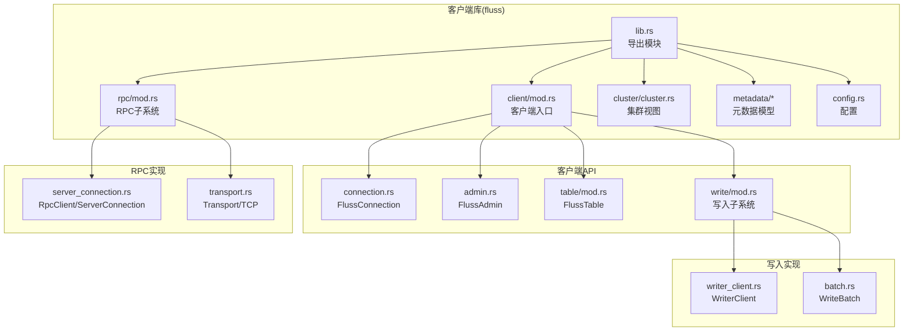
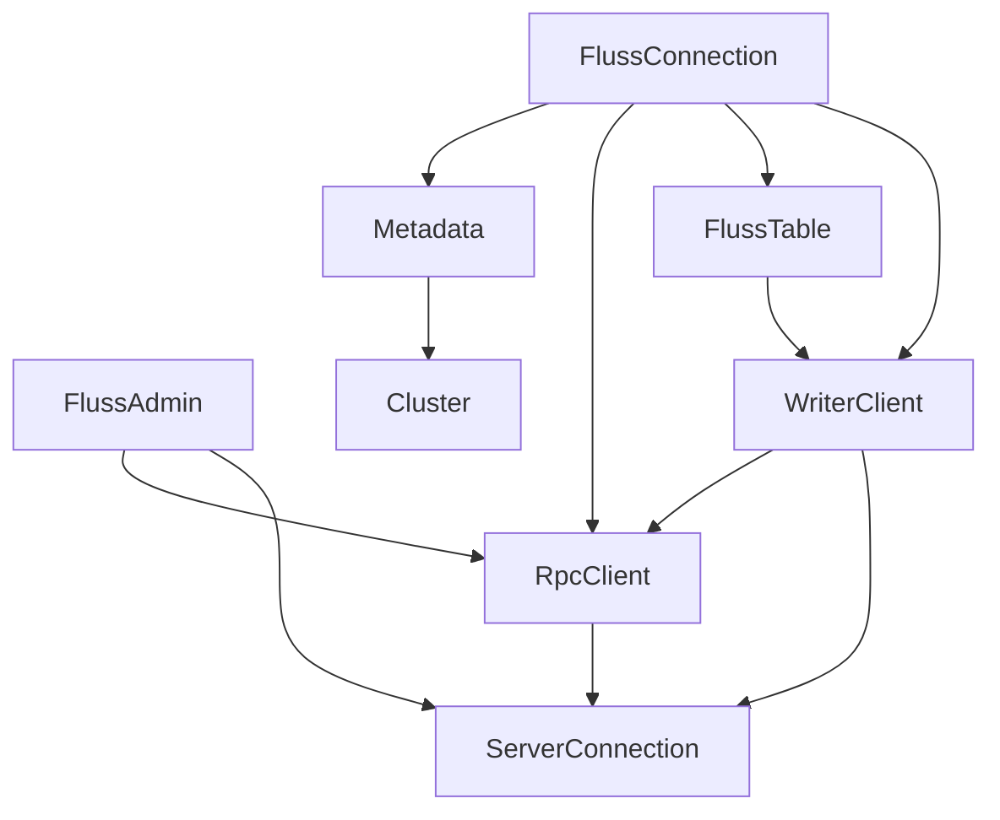
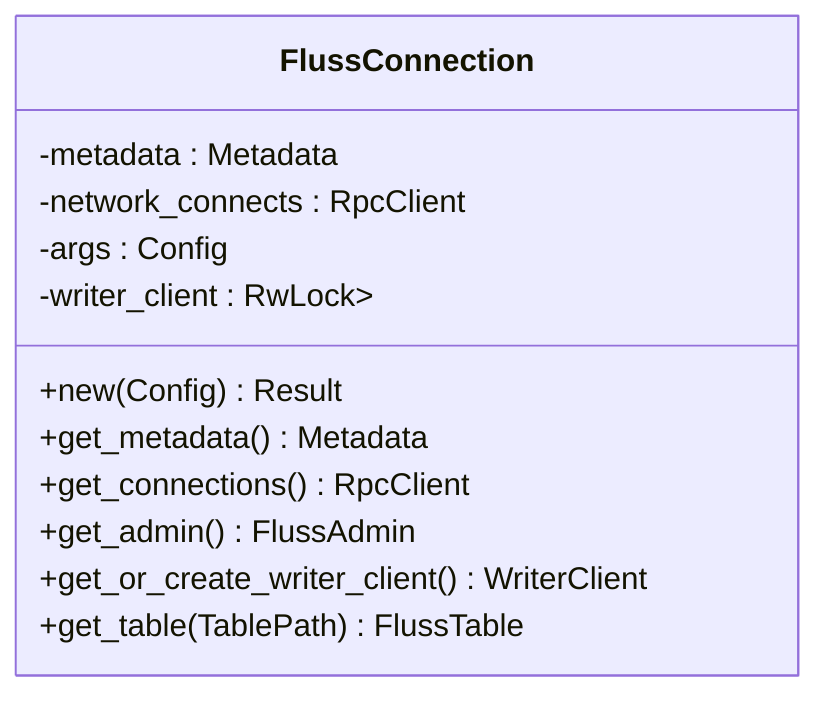
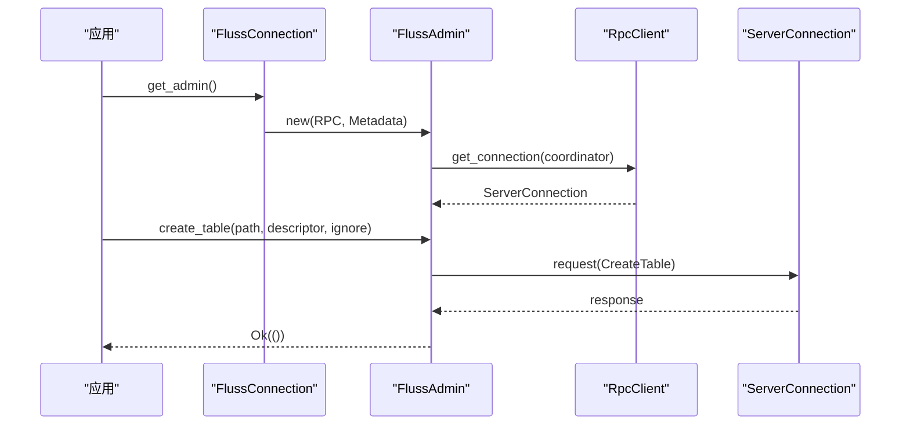
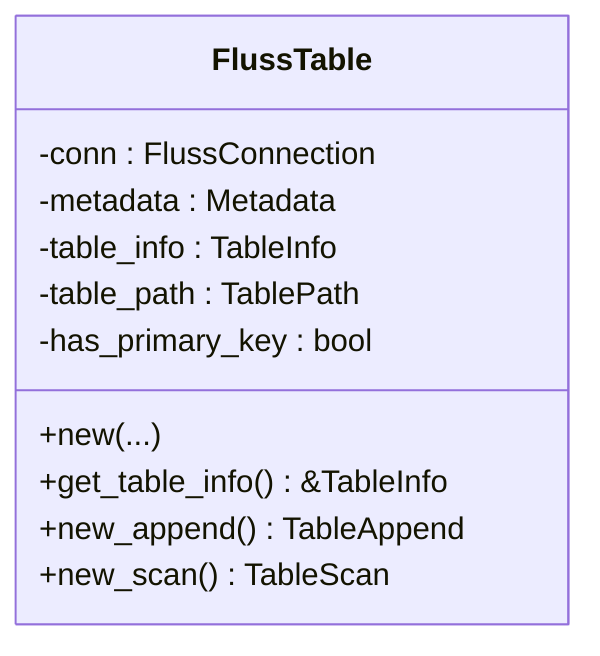
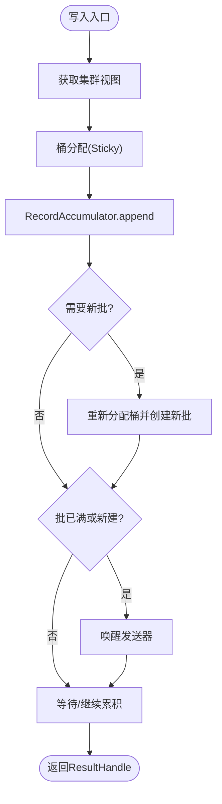
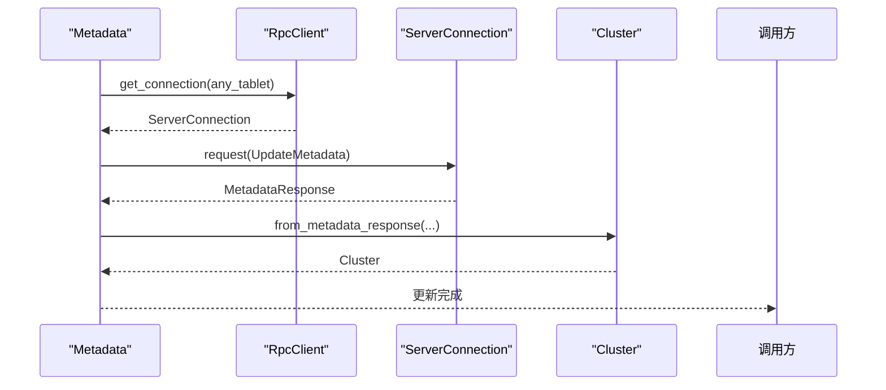
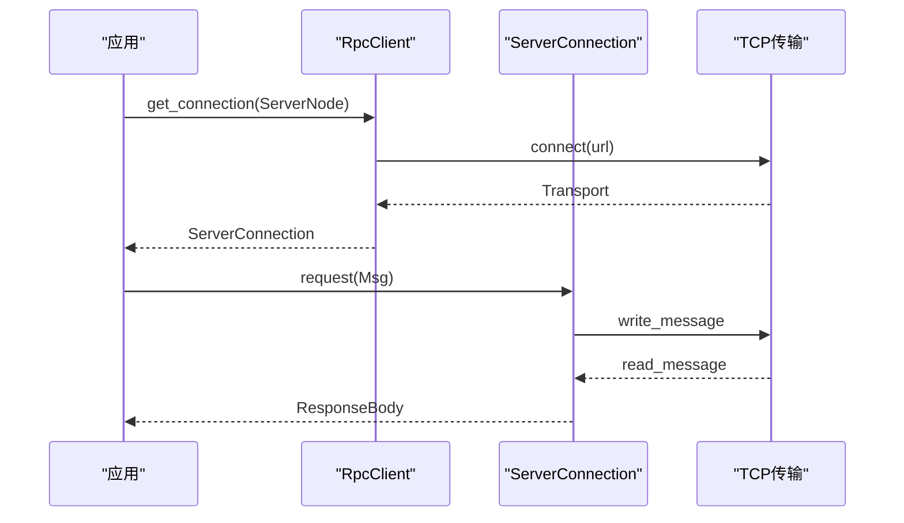
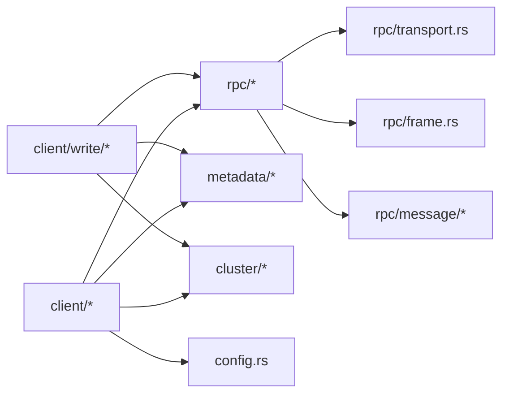
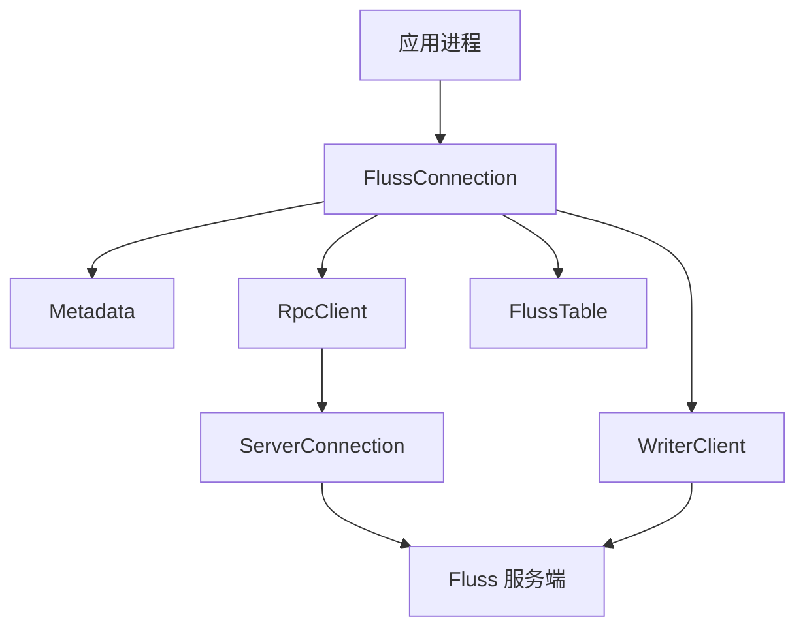

# 客户端架构

<cite>
**本文引用的文件**
- [lib.rs](file://crates/fluss/src/lib.rs)
- [Cargo.toml](file://crates/fluss/Cargo.toml)
- [client/mod.rs](file://crates/fluss/src/client/mod.rs)
- [connection.rs](file://crates/fluss/src/client/connection.rs)
- [admin.rs](file://crates/fluss/src/client/admin.rs)
- [table/mod.rs](file://crates/fluss/src/client/table/mod.rs)
- [metadata.rs](file://crates/fluss/src/client/metadata.rs)
- [rpc/mod.rs](file://crates/fluss/src/rpc/mod.rs)
- [server_connection.rs](file://crates/fluss/src/rpc/server_connection.rs)
- [transport.rs](file://crates/fluss/src/rpc/transport.rs)
- [write/mod.rs](file://crates/fluss/src/client/write/mod.rs)
- [writer_client.rs](file://crates/fluss/src/client/write/writer_client.rs)
- [batch.rs](file://crates/fluss/src/client/write/batch.rs)
- [cluster.rs](file://crates/fluss/src/cluster/cluster.rs)
- [config.rs](file://crates/fluss/src/config.rs)
</cite>

## 目录
1. [引言](#引言)
2. [项目结构](#项目结构)
3. [核心组件](#核心组件)
4. [架构总览](#架构总览)
5. [详细组件分析](#详细组件分析)
6. [依赖分析](#依赖分析)
7. [性能考量](#性能考量)
8. [故障排查指南](#故障排查指南)
9. [结论](#结论)
10. [附录](#附录)

## 引言
本文件面向 Fluss Rust 客户端的架构与实现，聚焦于高层设计、架构模式与系统边界，系统化梳理客户端组件之间的交互关系，重点覆盖以下方面：
- 入口点：FlussConnection 作为统一连接与资源管理入口
- 管理功能：FlussAdmin 提供表的创建与查询等管理能力
- 数据操作：FlussTable 封装写入与扫描能力
- 关键流程：连接管理、元数据缓存、RPC 通信、写入批处理与发送
- 技术决策与权衡：异步并发、消息帧协议、连接复用、批聚合策略
- 基础设施与可扩展性：部署拓扑建议、网络与存储约束
- 安全与监控：安全传输、可观测性与错误传播
- 技术栈与依赖：第三方库、版本兼容性与构建配置

## 项目结构
Fluss Rust 客户端采用按职责分层的模块组织方式，核心模块如下：
- client：客户端 API 层，包含连接、管理、表操作、写入子系统
- rpc：RPC 通信层，负责消息编解码、帧协议、连接池与请求/响应处理
- cluster：集群视图与路由信息
- metadata：元数据模型与序列化
- record/row：记录与行数据抽象
- config：运行时配置项
- proto：通过 prost 生成的协议定义

**图表来源**
- [lib.rs](file://crates/fluss/src/lib.rs#L18-L37)
- [client/mod.rs](file://crates/fluss/src/client/mod.rs#L18-L26)
- [rpc/mod.rs](file://crates/fluss/src/rpc/mod.rs#L18-L31)
- [cluster.rs](file://crates/fluss/src/cluster/cluster.rs#L29-L39)

**章节来源**
- [lib.rs](file://crates/fluss/src/lib.rs#L18-L37)
- [client/mod.rs](file://crates/fluss/src/client/mod.rs#L18-L26)
- [rpc/mod.rs](file://crates/fluss/src/rpc/mod.rs#L18-L31)

## 核心组件
- FlussConnection：客户端入口，负责初始化元数据、维护 RPC 连接池、提供管理器与表实例的获取，并延迟创建写入客户端
- FlussAdmin：基于协调者节点的管理接口，支持创建表与查询表信息
- FlussTable：封装表级操作，提供 Append 与 Scan 能力，内部委托写入客户端与扫描器
- Metadata：维护集群视图（含协调者、tablet 服务器、桶位置、表信息），支持增量更新与表元数据检查
- WriterClient：写入客户端，负责记录累积、批构建、桶分配、发送与结果广播
- RpcClient/ServerConnection：连接池与单连接实现，负责消息帧读写、请求/响应映射、错误传播与连接生命周期
- Transport：基于 TCP 的传输适配器
- Cluster：集群状态机，从元数据响应构建与更新，提供桶到 leader 的路由

**章节来源**
- [connection.rs](file://crates/fluss/src/client/connection.rs#L30-L82)
- [admin.rs](file://crates/fluss/src/client/admin.rs#L28-L93)
- [table/mod.rs](file://crates/fluss/src/client/table/mod.rs#L33-L73)
- [metadata.rs](file://crates/fluss/src/client/metadata.rs#L30-L109)
- [writer_client.rs](file://crates/fluss/src/client/write/writer_client.rs#L32-L147)
- [server_connection.rs](file://crates/fluss/src/rpc/server_connection.rs#L47-L96)
- [transport.rs](file://crates/fluss/src/rpc/transport.rs#L27-L83)
- [cluster.rs](file://crates/fluss/src/cluster/cluster.rs#L29-L86)

## 架构总览
下图展示客户端与服务端的关键交互路径：客户端通过 FlussConnection 初始化 Metadata 并建立 RPC 连接；管理操作经由协调者节点；数据写入通过 WriterClient 聚合批并发送至目标桶的 leader。

**图表来源**
- [connection.rs](file://crates/fluss/src/client/connection.rs#L38-L81)
- [metadata.rs](file://crates/fluss/src/client/metadata.rs#L36-L104)
- [admin.rs](file://crates/fluss/src/client/admin.rs#L35-L50)
- [table/mod.rs](file://crates/fluss/src/client/table/mod.rs#L42-L66)
- [writer_client.rs](file://crates/fluss/src/client/write/writer_client.rs#L43-L76)
- [server_connection.rs](file://crates/fluss/src/rpc/server_connection.rs#L64-L96)

## 详细组件分析

### FlussConnection：连接与资源入口
- 责任
  - 初始化 Metadata（从引导地址解析 SocketAddr，连接协调者，拉取初始元数据）
  - 维护 RpcClient 连接池与写入客户端的懒加载
  - 提供管理器、表实例与元数据访问
- 设计要点
  - 使用 Arc 包裹共享状态，避免重复连接
  - 写入客户端使用 RwLock<Option> 懒创建，降低无写入场景的开销
- 关键交互
  - 获取 Admin：从 Metadata 中定位协调者，建立 ServerConnection
  - 获取 Table：先更新表元数据，再构造 FlussTable
  - 获取 WriterClient：首次调用创建并缓存

**图表来源**
- [connection.rs](file://crates/fluss/src/client/connection.rs#L30-L82)

**章节来源**
- [connection.rs](file://crates/fluss/src/client/connection.rs#L38-L81)

### FlussAdmin：管理功能
- 责任
  - 创建表：向协调者发送创建请求
  - 查询表：获取表信息并反序列化为 TableInfo
- 实现要点
  - 通过 RpcClient 选择协调者节点建立连接
  - 请求/响应类型与协议体由消息模块提供
- 错误处理
  - RPC 层错误透传，上层 Result 处理

**图表来源**
- [admin.rs](file://crates/fluss/src/client/admin.rs#L35-L67)
- [server_connection.rs](file://crates/fluss/src/rpc/server_connection.rs#L64-L96)

**章节来源**
- [admin.rs](file://crates/fluss/src/client/admin.rs#L34-L93)

### FlussTable：数据操作能力
- 责任
  - 提供 Append 与 Scan 接口
  - 委托 WriterClient 执行写入，委托扫描器执行读取
- 生命周期
  - 通过 FlussConnection.get_table 创建，内部会触发表元数据更新
- 交互
  - new_append：获取 WriterClient 并构造 TableAppend
  - new_scan：构造 TableScan 并绑定元数据与连接

**图表来源**
- [table/mod.rs](file://crates/fluss/src/client/table/mod.rs#L33-L66)

**章节来源**
- [table/mod.rs](file://crates/fluss/src/client/table/mod.rs#L41-L66)

### 写入子系统：WriterClient、批与发送
- WriterClient
  - 负责记录累积、桶分配、批构建、发送与结果广播
  - 维护发送任务与关闭流程
- 批处理 WriteBatch
  - ArrowLogWriteBatch 基于 Arrow Builder 构建日志批次
  - 支持追加、估算大小、关闭与构建二进制
- 发送 Sender
  - 从 RecordAccumulator 取批，按目标桶路由到对应 ServerConnection
  - 支持重试、ACK 策略与超时控制

**图表来源**
- [writer_client.rs](file://crates/fluss/src/client/write/writer_client.rs#L89-L123)
- [batch.rs](file://crates/fluss/src/client/write/batch.rs#L135-L176)

**章节来源**
- [writer_client.rs](file://crates/fluss/src/client/write/writer_client.rs#L42-L147)
- [batch.rs](file://crates/fluss/src/client/write/batch.rs#L28-L176)

### 元数据与集群：缓存与更新
- Metadata
  - 初始从协调者拉取元数据，构建 Cluster
  - 支持增量更新与表级检查更新
  - 提供连接工厂与集群快照
- Cluster
  - 从 MetadataResponse 构建/更新，维护桶位置、表信息、服务器集合
  - 提供 leader 查找、可用服务器随机选择、桶数量查询

**图表来源**
- [metadata.rs](file://crates/fluss/src/client/metadata.rs#L44-L75)
- [cluster.rs](file://crates/fluss/src/cluster/cluster.rs#L88-L171)

**章节来源**
- [metadata.rs](file://crates/fluss/src/client/metadata.rs#L35-L109)
- [cluster.rs](file://crates/fluss/src/cluster/cluster.rs#L41-L171)

### RPC 通信：连接、帧与请求/响应
- RpcClient
  - 连接池：按 ServerNode.uid 缓存连接
  - 懒连接：首次使用时建立并加入池
- ServerConnection
  - 单连接内维护请求映射与状态机
  - 异步读协程：解析响应头，匹配请求 ID，投递结果
  - 请求发送：写入消息帧，保证取消安全
- Transport
  - 基于 TCP 的异步读写适配器

**图表来源**
- [server_connection.rs](file://crates/fluss/src/rpc/server_connection.rs#L64-L96)
- [transport.rs](file://crates/fluss/src/rpc/transport.rs#L68-L83)

**章节来源**
- [server_connection.rs](file://crates/fluss/src/rpc/server_connection.rs#L47-L312)
- [transport.rs](file://crates/fluss/src/rpc/transport.rs#L27-L83)

## 依赖分析
- 第三方依赖
  - 异步运行时与并发：tokio、futures、parking_lot、dashmap
  - 序列化与协议：prost、prost-build、serde、serde_json
  - Arrow 集成：arrow、arrow-schema
  - 工具与通用：byteorder、crc32c、rand、bytes、chrono、ordered-float、parse-display、ref-cast、thiserror、tracing
- 版本与特性
  - 构建期依赖 prost-build 生成协议代码
  - 运行期依赖 arrow 55.x 与配套 schema
  - 可选特性：integration_tests
- 模块耦合
  - client 依赖 rpc、metadata、cluster、config
  - rpc 依赖 transport、frame、message
  - write 子系统依赖 accumulator、sender、bucket_assigner

**图表来源**
- [Cargo.toml](file://crates/fluss/Cargo.toml#L25-L47)
- [client/mod.rs](file://crates/fluss/src/client/mod.rs#L18-L26)
- [rpc/mod.rs](file://crates/fluss/src/rpc/mod.rs#L18-L31)

**章节来源**
- [Cargo.toml](file://crates/fluss/Cargo.toml#L25-L55)

## 性能考量
- 连接与并发
  - 连接池按节点 UID 复用，减少握手开销
  - 写入侧使用异步发送与广播结果，避免阻塞主线程
- 批处理与压缩
  - 批构建基于 Arrow Builder，支持估算大小与关闭
  - 可配置批大小与最大请求尺寸，平衡吞吐与延迟
- 路由与负载
  - 集群视图维护桶到 leader 的映射，写入按桶路由
  - 可用服务器随机选择，提升容错与均衡
- 资源管理
  - WriterClient 在关闭时优雅停止发送任务
  - ResultHandle 仅在批完成时广播结果，避免内存泄漏

[本节为通用性能讨论，不直接分析具体文件]

## 故障排查指南
- 连接问题
  - 连接超时/失败：检查 bootstrap 地址与网络连通性
  - 连接被毒化：RPC 层检测到帧错误后会毒化连接，需重建
- 元数据异常
  - 表不存在或未发现：确认 Metadata 是否已更新，必要时手动触发表元数据检查
- 写入失败
  - ACK 策略与重试：根据配置调整 writer_acks 与 writer_retries
  - 批构建失败：检查 Arrow Builder 是否已关闭或已满
- 错误传播
  - RPC 层将底层错误包装为 RpcError 并上抛，便于定位

**章节来源**
- [server_connection.rs](file://crates/fluss/src/rpc/server_connection.rs#L122-L144)
- [metadata.rs](file://crates/fluss/src/client/metadata.rs#L83-L93)
- [writer_client.rs](file://crates/fluss/src/client/write/writer_client.rs#L79-L87)

## 结论
Fluss Rust 客户端以 FlussConnection 为核心入口，结合 Metadata 的元数据缓存与 Cluster 的路由视图，通过 RpcClient/ServerConnection 提供稳定的 RPC 通信能力。写入路径采用 WriterClient 的批聚合与发送机制，配合桶分配与结果广播，实现了高吞吐、低延迟的数据写入。管理功能通过 FlussAdmin 直达协调者，简化了表生命周期管理。整体架构清晰、模块职责明确，具备良好的可扩展性与运维可观测性基础。

[本节为总结性内容，不直接分析具体文件]

## 附录

### 系统上下文图

**图表来源**
- [connection.rs](file://crates/fluss/src/client/connection.rs#L38-L81)
- [server_connection.rs](file://crates/fluss/src/rpc/server_connection.rs#L64-L96)

### 部署拓扑与基础设施要求
- 基础设施
  - 网络：客户端与服务端之间稳定 TCP 连接，支持高并发短连接
  - DNS/IP：bootstrap 地址可解析为服务端监听地址
  - 时间同步：客户端与服务端时间偏差应受控，避免协议时间戳异常
- 拓扑建议
  - 客户端多副本部署于应用主机，通过连接池复用
  - 服务端多节点部署，协调者与 tablet 服务器分离，提高可用性
- 可扩展性
  - 水平扩展：增加 tablet 服务器与桶数量，提升写入吞吐
  - 垂直扩展：增大批大小与请求上限，优化带宽利用率

[本节为概念性内容，不直接分析具体文件]

### 安全与监控
- 安全
  - 传输：建议启用 TLS（当前 Transport 为明文 TCP，可扩展为 TLS 适配器）
  - 认证：在服务端实现认证与授权，客户端通过安全通道访问
- 监控
  - 连接数、请求延迟、批大小分布、ACK 成功率、错误率
  - 元数据更新频率与失败重试次数
  - 写入速率与积压队列长度

[本节为概念性内容，不直接分析具体文件]

### 配置项概览
- bootstrap_server：服务端引导地址
- request_max_size：最大请求尺寸
- writer_acks：写入 ACK 策略（all 或数字）
- writer_retries：写入重试次数
- writer_batch_size：写入批大小

**章节来源**
- [config.rs](file://crates/fluss/src/config.rs#L23-L39)