# 管理接口

<cite>
**本文引用的文件**
- [crates/fluss/src/client/admin.rs](file://crates/fluss/src/client/admin.rs)
- [crates/fluss/src/proto/fluss_api.proto](file://crates/fluss/src/proto/fluss_api.proto)
- [crates/fluss/src/rpc/message/create_table.rs](file://crates/fluss/src/rpc/message/create_table.rs)
- [crates/fluss/src/rpc/message/get_table.rs](file://crates/fluss/src/rpc/message/get_table.rs)
- [crates/fluss/src/rpc/message/mod.rs](file://crates/fluss/src/rpc/message/mod.rs)
- [crates/fluss/src/rpc/api_key.rs](file://crates/fluss/src/rpc/api_key.rs)
- [crates/fluss/src/rpc/api_version.rs](file://crates/fluss/src/rpc/api_version.rs)
- [crates/fluss/src/client/metadata.rs](file://crates/fluss/src/client/metadata.rs)
- [crates/fluss/src/metadata/table.rs](file://crates/fluss/src/metadata/table.rs)
- [crates/fluss/src/metadata/datatype.rs](file://crates/fluss/src/metadata/datatype.rs)
- [crates/fluss/src/rpc/error.rs](file://crates/fluss/src/rpc/error.rs)
- [crates/fluss/src/error.rs](file://crates/fluss/src/error.rs)
- [crates/examples/src/example_table.rs](file://crates/examples/src/example_table.rs)
</cite>

## 目录
1. [简介](#简介)
2. [项目结构](#项目结构)
3. [核心组件](#核心组件)
4. [架构总览](#架构总览)
5. [详细组件分析](#详细组件分析)
6. [依赖关系分析](#依赖关系分析)
7. [性能考量](#性能考量)
8. [故障排查指南](#故障排查指南)
9. [结论](#结论)
10. [附录](#附录)

## 简介
本文件系统性梳理 Fluss 的管理接口设计与实现，重点围绕 FlussAdmin 的职责边界、表的创建/查询等管理能力，以及与 RPC 消息层的交互协议（CreateTableRequest/Response、GetTableRequest/Response 等）。文档同时覆盖元数据同步、缓存策略、一致性保障、权限控制、审计与安全机制的现状与建议，并提供完整的管理 API 使用示例与最佳实践。

## 项目结构
管理接口主要由以下模块构成：
- 客户端管理入口：FlussAdmin 负责与协调器建立连接并发起管理请求
- RPC 消息层：定义请求/响应消息体及版本化编解码
- 元数据管理：负责集群信息、协调器节点、表元数据的更新与缓存
- 表模型与描述：Schema、TableDescriptor、TableInfo 等用于描述表结构与配置
- 示例：演示从创建表到写入与读取的完整流程

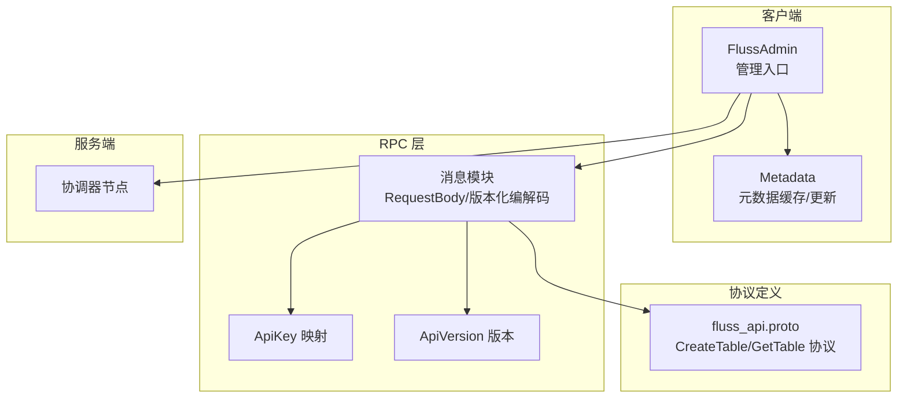

图表来源
- [crates/fluss/src/client/admin.rs](file://crates/fluss/src/client/admin.rs#L28-L94)
- [crates/fluss/src/client/metadata.rs](file://crates/fluss/src/client/metadata.rs#L29-L110)
- [crates/fluss/src/rpc/message/mod.rs](file://crates/fluss/src/rpc/message/mod.rs#L37-L98)
- [crates/fluss/src/rpc/api_key.rs](file://crates/fluss/src/rpc/api_key.rs#L20-L55)
- [crates/fluss/src/rpc/api_version.rs](file://crates/fluss/src/rpc/api_version.rs#L18-L55)
- [crates/fluss/src/proto/fluss_api.proto](file://crates/fluss/src/proto/fluss_api.proto#L117-L137)

章节来源
- [crates/fluss/src/client/admin.rs](file://crates/fluss/src/client/admin.rs#L28-L94)
- [crates/fluss/src/client/metadata.rs](file://crates/fluss/src/client/metadata.rs#L29-L110)
- [crates/fluss/src/rpc/message/mod.rs](file://crates/fluss/src/rpc/message/mod.rs#L37-L98)
- [crates/fluss/src/rpc/api_key.rs](file://crates/fluss/src/rpc/api_key.rs#L20-L55)
- [crates/fluss/src/rpc/api_version.rs](file://crates/fluss/src/rpc/api_version.rs#L18-L55)
- [crates/fluss/src/proto/fluss_api.proto](file://crates/fluss/src/proto/fluss_api.proto#L117-L137)

## 核心组件
- FlussAdmin：封装管理操作入口，负责与协调器建立连接并发送管理请求；提供 create_table 与 get_table 等方法
- Metadata：维护集群与表元数据的缓存，支持按需刷新与批量更新
- 请求消息体：CreateTableRequest、GetTableRequest 实现 RequestBody trait，携带 ApiKey 与版本号
- 协议定义：fluss_api.proto 中定义了 CreateTableRequest/Response、GetTableInfoRequest/Response 等消息结构
- 表模型：Schema、TableDescriptor、TableInfo、TablePath 等用于描述表结构、分布与配置

章节来源
- [crates/fluss/src/client/admin.rs](file://crates/fluss/src/client/admin.rs#L28-L94)
- [crates/fluss/src/client/metadata.rs](file://crates/fluss/src/client/metadata.rs#L29-L110)
- [crates/fluss/src/rpc/message/create_table.rs](file://crates/fluss/src/rpc/message/create_table.rs#L32-L63)
- [crates/fluss/src/rpc/message/get_table.rs](file://crates/fluss/src/rpc/message/get_table.rs#L29-L55)
- [crates/fluss/src/proto/fluss_api.proto](file://crates/fluss/src/proto/fluss_api.proto#L117-L137)
- [crates/fluss/src/metadata/table.rs](file://crates/fluss/src/metadata/table.rs#L376-L754)

## 架构总览
管理接口的整体交互流程如下：
- 客户端通过 FlussAdmin 获取与协调器的连接
- FlussAdmin 将管理请求封装为具体的消息体（如 CreateTableRequest、GetTableRequest）
- 消息体通过 RPC 层进行版本化编码，携带 ApiKey 与 ApiVersion
- 服务端协调器处理请求并返回响应
- 客户端解析响应并更新本地 Metadata 缓存

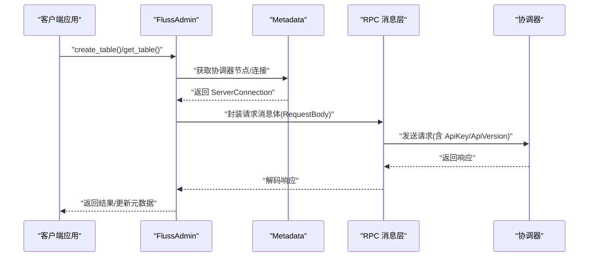

图表来源
- [crates/fluss/src/client/admin.rs](file://crates/fluss/src/client/admin.rs#L34-L94)
- [crates/fluss/src/client/metadata.rs](file://crates/fluss/src/client/metadata.rs#L35-L110)
- [crates/fluss/src/rpc/message/mod.rs](file://crates/fluss/src/rpc/message/mod.rs#L37-L98)
- [crates/fluss/src/rpc/api_key.rs](file://crates/fluss/src/rpc/api_key.rs#L20-L55)
- [crates/fluss/src/rpc/api_version.rs](file://crates/fluss/src/rpc/api_version.rs#L18-L55)

## 详细组件分析

### FlussAdmin 组件
- 职责：持有与协调器的连接、维护 Metadata 缓存、对外暴露管理 API
- 关键方法：
  - new：根据 Metadata 获取协调器节点并建立连接
  - create_table：构造 CreateTableRequest 并发送
  - get_table：构造 GetTableRequest 并解析 GetTableInfoResponse，反序列化为 TableInfo

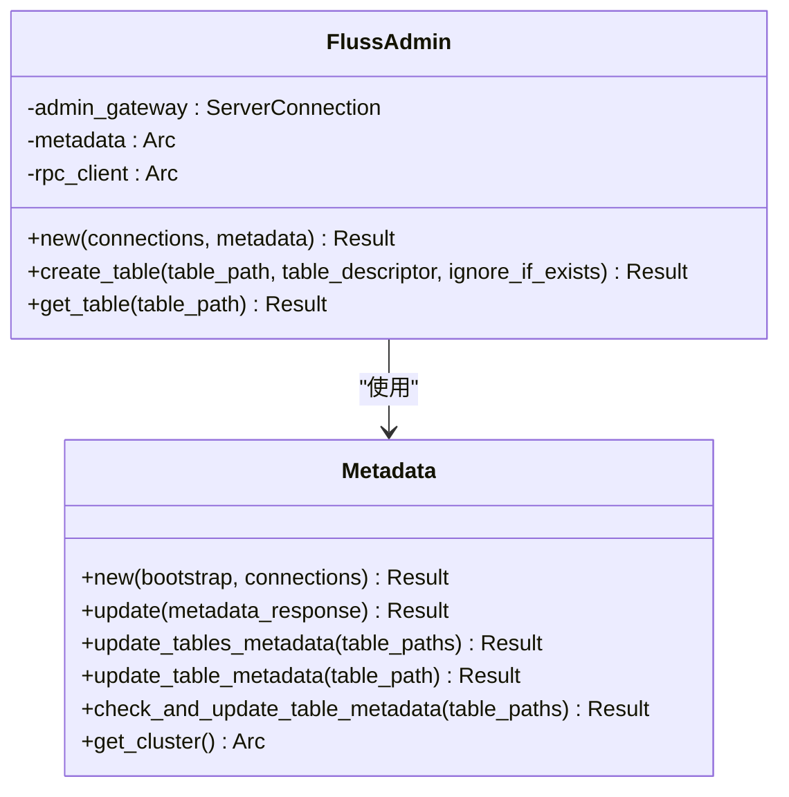

图表来源
- [crates/fluss/src/client/admin.rs](file://crates/fluss/src/client/admin.rs#L28-L94)
- [crates/fluss/src/client/metadata.rs](file://crates/fluss/src/client/metadata.rs#L29-L110)

章节来源
- [crates/fluss/src/client/admin.rs](file://crates/fluss/src/client/admin.rs#L28-L94)

### RPC 消息与协议
- RequestBody trait：统一请求消息的 API_KEY 与 REQUEST_VERSION
- 版本化编解码宏：impl_write_version_type!/impl_read_version_type! 统一编码/解码逻辑
- ApiKey：CreateTable、GetTable 等枚举映射
- ApiVersion：版本范围与显示格式
- 协议定义：CreateTableRequest/Response、GetTableInfoRequest/Response 等字段

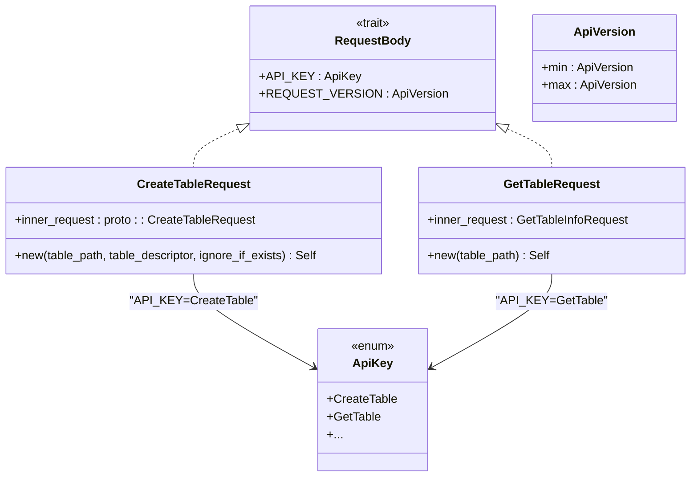

图表来源
- [crates/fluss/src/rpc/message/mod.rs](file://crates/fluss/src/rpc/message/mod.rs#L37-L98)
- [crates/fluss/src/rpc/message/create_table.rs](file://crates/fluss/src/rpc/message/create_table.rs#L32-L63)
- [crates/fluss/src/rpc/message/get_table.rs](file://crates/fluss/src/rpc/message/get_table.rs#L29-L55)
- [crates/fluss/src/rpc/api_key.rs](file://crates/fluss/src/rpc/api_key.rs#L20-L55)
- [crates/fluss/src/rpc/api_version.rs](file://crates/fluss/src/rpc/api_version.rs#L18-L55)

章节来源
- [crates/fluss/src/rpc/message/mod.rs](file://crates/fluss/src/rpc/message/mod.rs#L37-L98)
- [crates/fluss/src/rpc/message/create_table.rs](file://crates/fluss/src/rpc/message/create_table.rs#L32-L63)
- [crates/fluss/src/rpc/message/get_table.rs](file://crates/fluss/src/rpc/message/get_table.rs#L29-L55)
- [crates/fluss/src/rpc/api_key.rs](file://crates/fluss/src/rpc/api_key.rs#L20-L55)
- [crates/fluss/src/rpc/api_version.rs](file://crates/fluss/src/rpc/api_version.rs#L18-L55)

### 协议消息定义（CreateTable/GetTable）
- CreateTableRequest：包含表路径、序列化的表描述 JSON、忽略已存在标志
- CreateTableResponse：空响应体
- GetTableInfoRequest：包含表路径
- GetTableInfoResponse：包含表 ID、Schema ID、表 JSON、创建/修改时间

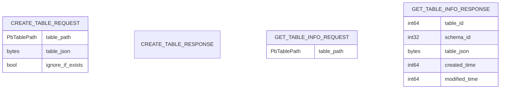

图表来源
- [crates/fluss/src/proto/fluss_api.proto](file://crates/fluss/src/proto/fluss_api.proto#L117-L137)

章节来源
- [crates/fluss/src/proto/fluss_api.proto](file://crates/fluss/src/proto/fluss_api.proto#L117-L137)

### 表模型与描述
- Schema：列定义、主键约束、行类型
- TableDescriptor：表的完整描述（Schema、分区键、分布、属性、自定义属性）
- TableInfo：运行时表信息（包含 TableConfig、物理主键、桶键、分桶数等）
- TablePath：数据库与表名组合
- DataType：基础与复合类型定义

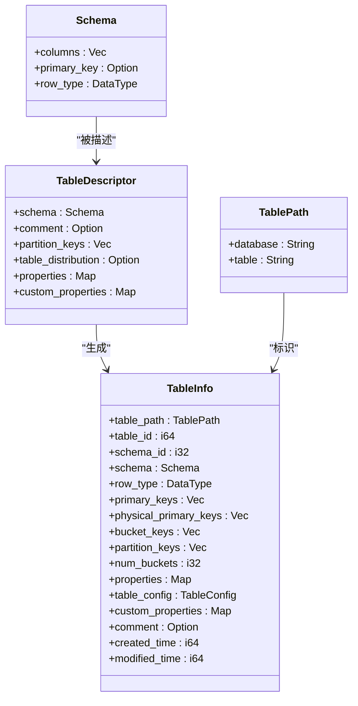

图表来源
- [crates/fluss/src/metadata/table.rs](file://crates/fluss/src/metadata/table.rs#L94-L754)
- [crates/fluss/src/metadata/datatype.rs](file://crates/fluss/src/metadata/datatype.rs#L21-L787)

章节来源
- [crates/fluss/src/metadata/table.rs](file://crates/fluss/src/metadata/table.rs#L94-L754)
- [crates/fluss/src/metadata/datatype.rs](file://crates/fluss/src/metadata/datatype.rs#L21-L787)

### 管理 API 定义与处理流程

#### 创建表 API（CreateTable）
- 请求参数
  - table_path：数据库与表名
  - table_descriptor：表结构与配置的序列化 JSON
  - ignore_if_exists：是否忽略“表已存在”错误
- 处理流程
  - FlussAdmin.new 建立到协调器的连接
  - 构造 CreateTableRequest 并发送
  - 服务端协调器处理后返回空响应
- 错误与校验
  - 参数校验失败或表已存在且未设置忽略标志时返回错误
  - RPC 层可能抛出写入/读取帧错误或连接错误

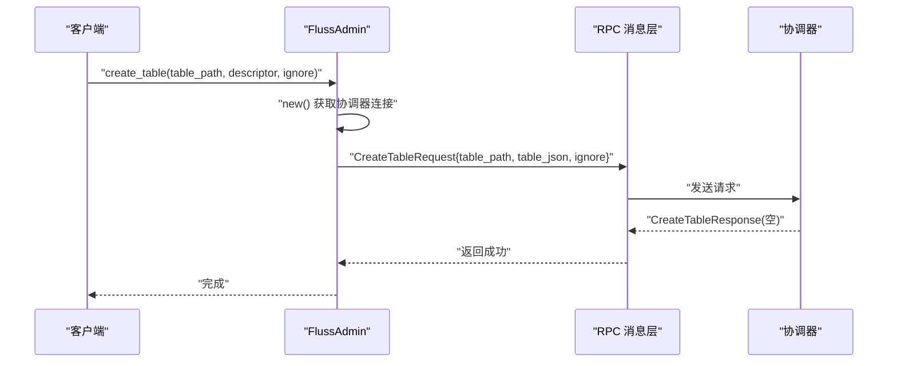

图表来源
- [crates/fluss/src/client/admin.rs](file://crates/fluss/src/client/admin.rs#L52-L67)
- [crates/fluss/src/rpc/message/create_table.rs](file://crates/fluss/src/rpc/message/create_table.rs#L37-L51)
- [crates/fluss/src/proto/fluss_api.proto](file://crates/fluss/src/proto/fluss_api.proto#L117-L124)

章节来源
- [crates/fluss/src/client/admin.rs](file://crates/fluss/src/client/admin.rs#L52-L67)
- [crates/fluss/src/rpc/message/create_table.rs](file://crates/fluss/src/rpc/message/create_table.rs#L37-L51)
- [crates/fluss/src/rpc/api_key.rs](file://crates/fluss/src/rpc/api_key.rs#L20-L55)
- [crates/fluss/src/rpc/api_version.rs](file://crates/fluss/src/rpc/api_version.rs#L18-L55)
- [crates/fluss/src/proto/fluss_api.proto](file://crates/fluss/src/proto/fluss_api.proto#L117-L124)

#### 查询表 API（GetTable）
- 请求参数
  - table_path：数据库与表名
- 处理流程
  - FlussAdmin 发送 GetTableRequest
  - 解析 GetTableInfoResponse，反序列化表描述 JSON 为 TableDescriptor
  - 组装为 TableInfo 返回
- 错误与校验
  - 表不存在或 JSON 反序列化失败会返回错误

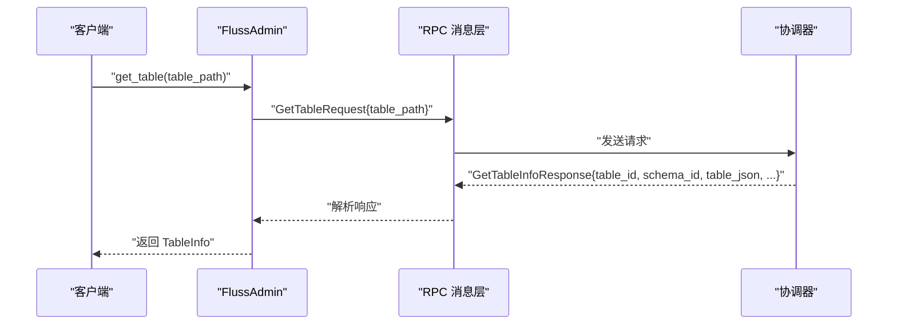

图表来源
- [crates/fluss/src/client/admin.rs](file://crates/fluss/src/client/admin.rs#L69-L92)
- [crates/fluss/src/rpc/message/get_table.rs](file://crates/fluss/src/rpc/message/get_table.rs#L34-L44)
- [crates/fluss/src/proto/fluss_api.proto](file://crates/fluss/src/proto/fluss_api.proto#L127-L137)

章节来源
- [crates/fluss/src/client/admin.rs](file://crates/fluss/src/client/admin.rs#L69-L92)
- [crates/fluss/src/rpc/message/get_table.rs](file://crates/fluss/src/rpc/message/get_table.rs#L34-L44)
- [crates/fluss/src/proto/fluss_api.proto](file://crates/fluss/src/proto/fluss_api.proto#L127-L137)

### 权限控制、审计日志与安全机制
- 权限控制：当前代码未体现显式的鉴权/授权逻辑，建议在协调器侧引入基于角色的访问控制（RBAC）与资源级权限检查
- 审计日志：当前代码未体现审计日志记录，建议在管理请求进入协调器时记录操作者、目标资源、时间戳与结果
- 安全机制：建议在 RPC 层启用 TLS 传输加密与双向认证，结合令牌与签名机制确保请求完整性与防重放

[本节为概念性说明，不直接分析具体文件，故无章节来源]

### 元数据同步、缓存策略与一致性
- 元数据同步：Metadata 提供 update/update_tables_metadata/update_table_metadata/check_and_update_table_metadata 等方法，支持按需刷新与批量更新
- 缓存策略：Metadata 内部以 RwLock 包裹 Cluster，读多写少场景下提升并发性能
- 一致性保证：通过 Cluster 的 from_metadata_response 合并新旧元数据，避免部分更新导致的不一致

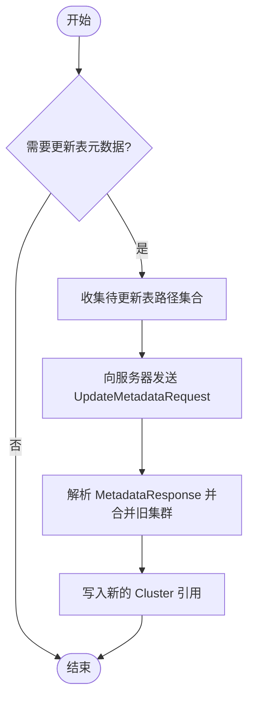

图表来源
- [crates/fluss/src/client/metadata.rs](file://crates/fluss/src/client/metadata.rs#L83-L94)

章节来源
- [crates/fluss/src/client/metadata.rs](file://crates/fluss/src/client/metadata.rs#L57-L94)

### 参数验证与错误码说明
- 参数验证
  - 表名/数据库名非空校验（由 TablePath 与协议字段约束）
  - 表描述 JSON 序列化/反序列化校验
  - 分区键与桶键冲突校验（TableDescriptor.normalize_distribution）
- 错误类型
  - 无效表错误（InvalidTableError）
  - JSON 序列化/反序列化错误（JsonSerdeError）
  - RPC 错误（RpcError：写入/读取帧错误、连接错误、数据剩余等）
  - 行转换错误（RowConvertError）
  - Arrow 错误（ArrowError）
  - 非法参数（IllegalArgument）

章节来源
- [crates/fluss/src/metadata/table.rs](file://crates/fluss/src/metadata/table.rs#L510-L564)
- [crates/fluss/src/error.rs](file://crates/fluss/src/error.rs#L25-L51)
- [crates/fluss/src/rpc/error.rs](file://crates/fluss/src/rpc/error.rs#L23-L51)

### 实际使用示例
- 示例流程
  - 初始化配置并建立连接
  - 构建表描述（Schema、列、主键、属性）
  - 通过 FlussAdmin 创建表
  - 查询表信息并打印
  - 写入数据并扫描读取

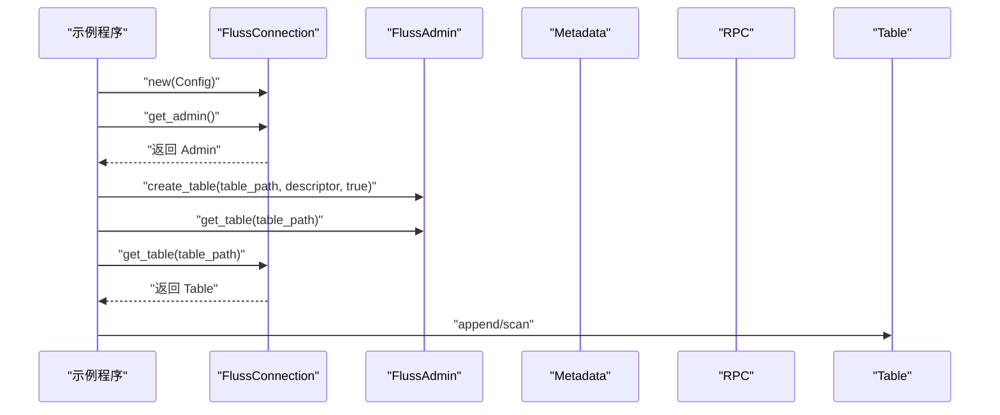

图表来源
- [crates/examples/src/example_table.rs](file://crates/examples/src/example_table.rs#L27-L87)

章节来源
- [crates/examples/src/example_table.rs](file://crates/examples/src/example_table.rs#L27-L87)

## 依赖关系分析
- FlussAdmin 依赖 Metadata 与 RPC 消息层
- RPC 消息层依赖 ApiKey、ApiVersion 与协议定义
- 表模型依赖 DataType 与 Schema/Descriptor/Info

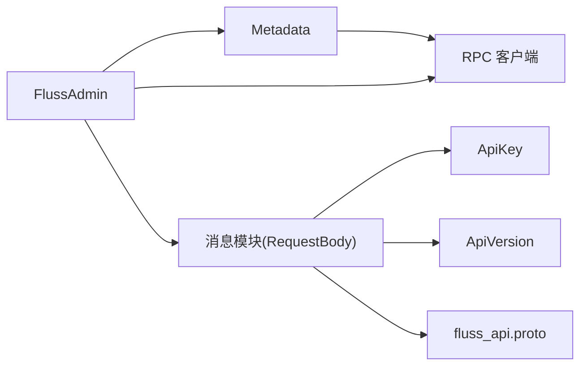

图表来源
- [crates/fluss/src/client/admin.rs](file://crates/fluss/src/client/admin.rs#L28-L94)
- [crates/fluss/src/client/metadata.rs](file://crates/fluss/src/client/metadata.rs#L29-L110)
- [crates/fluss/src/rpc/message/mod.rs](file://crates/fluss/src/rpc/message/mod.rs#L37-L98)
- [crates/fluss/src/rpc/api_key.rs](file://crates/fluss/src/rpc/api_key.rs#L20-L55)
- [crates/fluss/src/rpc/api_version.rs](file://crates/fluss/src/rpc/api_version.rs#L18-L55)
- [crates/fluss/src/proto/fluss_api.proto](file://crates/fluss/src/proto/fluss_api.proto#L117-L137)

章节来源
- [crates/fluss/src/client/admin.rs](file://crates/fluss/src/client/admin.rs#L28-L94)
- [crates/fluss/src/client/metadata.rs](file://crates/fluss/src/client/metadata.rs#L29-L110)
- [crates/fluss/src/rpc/message/mod.rs](file://crates/fluss/src/rpc/message/mod.rs#L37-L98)
- [crates/fluss/src/rpc/api_key.rs](file://crates/fluss/src/rpc/api_key.rs#L20-L55)
- [crates/fluss/src/rpc/api_version.rs](file://crates/fluss/src/rpc/api_version.rs#L18-L55)
- [crates/fluss/src/proto/fluss_api.proto](file://crates/fluss/src/proto/fluss_api.proto#L117-L137)

## 性能考量
- 连接复用：通过 RpcClient 管理连接池，减少握手开销
- 元数据缓存：Metadata 使用 RwLock 缓存 Cluster，降低频繁拉取元数据的网络往返
- 批量更新：update_tables_metadata 支持一次性刷新多个表的元数据
- 版本化消息：统一的版本化编解码减少协议升级带来的兼容成本

[本节提供通用指导，不直接分析具体文件，故无章节来源]

## 故障排查指南
- 常见错误
  - RPC 写入/读取帧错误：检查网络连通性与消息长度
  - 连接错误：确认协调器地址与端口正确
  - 数据剩余错误：检查消息版本与编解码是否匹配
  - 无效表错误：检查表描述中分区键/桶键/主键约束是否合法
- 排查步骤
  - 确认 Metadata 已正确初始化并可获取协调器节点
  - 在调用 create_table 前确保表描述 JSON 正确
  - 使用 get_table 校验表是否存在与元数据是否一致
  - 查看 RPC 层错误类型定位问题来源

章节来源
- [crates/fluss/src/rpc/error.rs](file://crates/fluss/src/rpc/error.rs#L23-L51)
- [crates/fluss/src/error.rs](file://crates/fluss/src/error.rs#L25-L51)
- [crates/fluss/src/client/metadata.rs](file://crates/fluss/src/client/metadata.rs#L35-L55)

## 结论
Fluss 的管理接口以 FlussAdmin 为核心，结合 Metadata 的元数据缓存与 RPC 消息层的版本化协议，提供了简洁稳定的表管理能力。当前实现聚焦于创建与查询两类管理操作，后续可在权限控制、审计日志与安全机制方面进一步增强，以满足生产环境的安全与合规要求。

## 附录
- API 列表
  - create_table(table_path, table_descriptor, ignore_if_exists)：创建表
  - get_table(table_path)：查询表信息
- 参数说明
  - table_path：数据库名与表名
  - table_descriptor：包含 Schema、分区键、桶分布、属性等的表描述
  - ignore_if_exists：是否忽略“表已存在”
- 错误码参考
  - 无效表错误：表描述不合法
  - JSON 序列化/反序列化错误：描述 JSON 格式异常
  - RPC 错误：网络/帧/连接类错误
  - 非法参数：输入参数不符合约束

[本节为概要总结，不直接分析具体文件，故无章节来源]