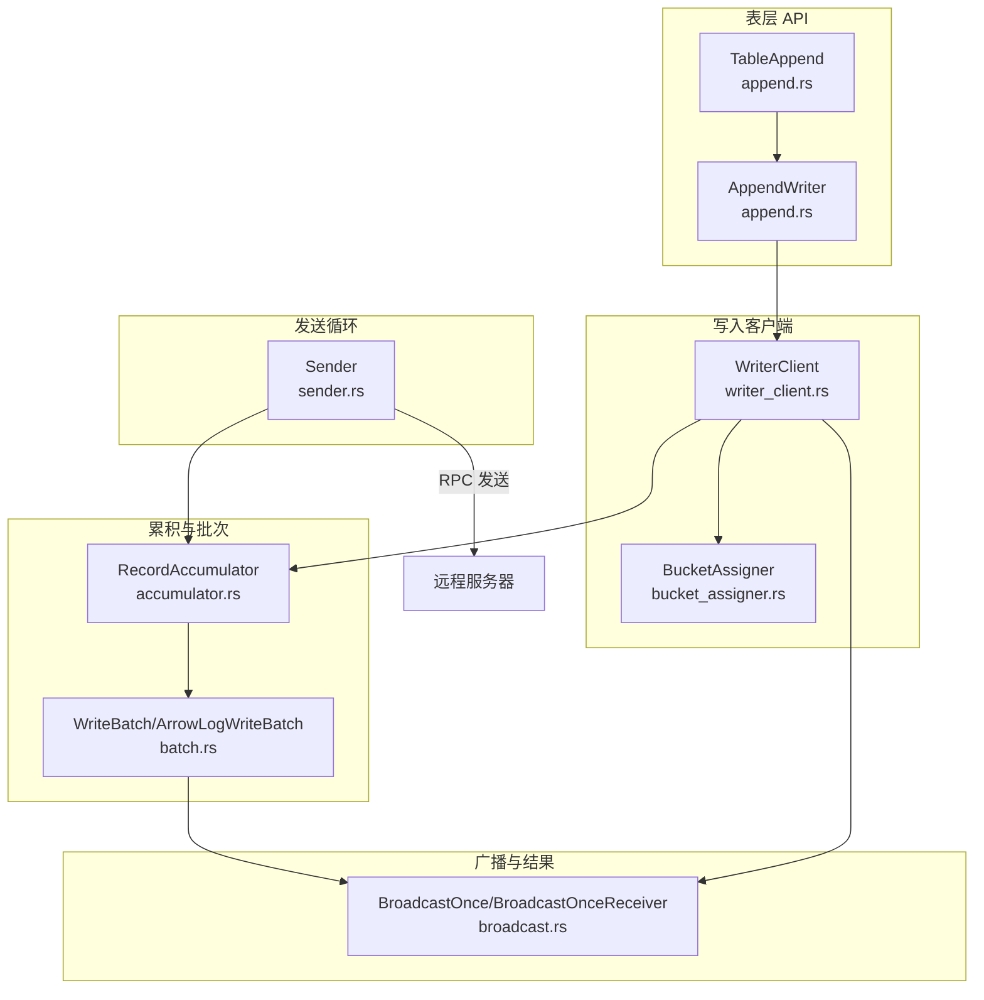
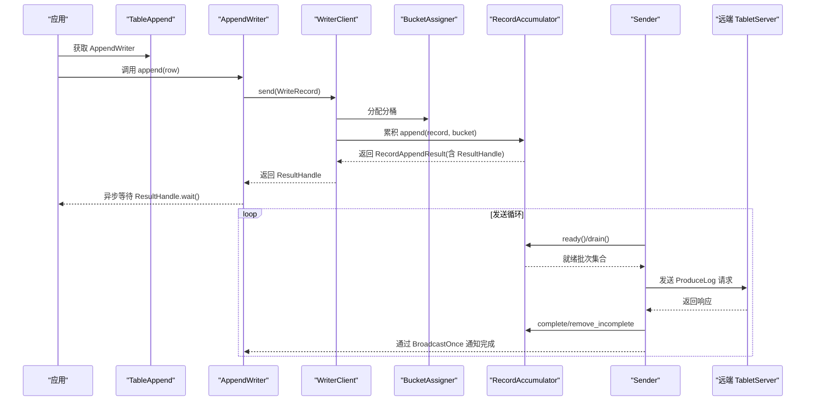
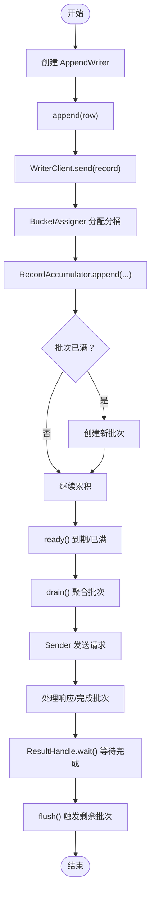

# 批量写入（TableAppend）

<cite>
**本文引用的文件**
- [crates/fluss/src/client/table/append.rs](file://crates/fluss/src/client/table/append.rs)
- [crates/fluss/src/client/write/writer_client.rs](file://crates/fluss/src/client/write/writer_client.rs)
- [crates/fluss/src/client/write/accumulator.rs](file://crates/fluss/src/client/write/accumulator.rs)
- [crates/fluss/src/client/write/batch.rs](file://crates/fluss/src/client/write/batch.rs)
- [crates/fluss/src/client/write/sender.rs](file://crates/fluss/src/client/write/sender.rs)
- [crates/fluss/src/client/write/bucket_assigner.rs](file://crates/fluss/src/client/write/bucket_assigner.rs)
- [crates/fluss/src/client/write/broadcast.rs](file://crates/fluss/src/client/write/broadcast.rs)
- [crates/fluss/src/client/write/mod.rs](file://crates/fluss/src/client/write/mod.rs)
- [crates/fluss/src/config.rs](file://crates/fluss/src/config.rs)
- [crates/examples/src/example_table.rs](file://crates/examples/src/example_table.rs)
</cite>

## 目录
1. [简介](#简介)
2. [项目结构](#项目结构)
3. [核心组件](#核心组件)
4. [架构总览](#架构总览)
5. [组件详解](#组件详解)
6. [依赖关系分析](#依赖关系分析)
7. [性能考量](#性能考量)
8. [故障排查指南](#故障排查指南)
9. [结论](#结论)
10. [附录：API 使用与最佳实践](#附录api-使用与最佳实践)

## 简介
本文件系统性阐述 Fluss 客户端中的“批量写入”能力，重点围绕 TableAppend 的设计与实现，解释其背后的批量写入机制、数据累积策略、写入优化技术，以及写入客户端从数据接收、批次累积到最终提交的完整工作流程。同时给出批处理配置项、API 使用示例、错误处理与重试策略、性能监控建议及最佳实践。

## 项目结构
批量写入相关代码主要位于以下模块：
- 表级写入入口：client/table/append.rs
- 写入客户端与发送循环：client/write/writer_client.rs、client/write/sender.rs
- 数据累积与批次管理：client/write/accumulator.rs、client/write/batch.rs
- 分桶分配策略：client/write/bucket_assigner.rs
- 广播与结果通知：client/write/broadcast.rs
- 配置参数：config.rs
- 示例用法：examples/src/example_table.rs



图表来源
- [crates/fluss/src/client/table/append.rs](file://crates/fluss/src/client/table/append.rs#L25-L70)
- [crates/fluss/src/client/write/writer_client.rs](file://crates/fluss/src/client/write/writer_client.rs#L31-L148)
- [crates/fluss/src/client/write/accumulator.rs](file://crates/fluss/src/client/write/accumulator.rs#L34-L443)
- [crates/fluss/src/client/write/batch.rs](file://crates/fluss/src/client/write/batch.rs#L27-L177)
- [crates/fluss/src/client/write/sender.rs](file://crates/fluss/src/client/write/sender.rs#L30-L208)
- [crates/fluss/src/client/write/bucket_assigner.rs](file://crates/fluss/src/client/write/bucket_assigner.rs#L23-L103)
- [crates/fluss/src/client/write/broadcast.rs](file://crates/fluss/src/client/write/broadcast.rs#L34-L120)

章节来源
- [crates/fluss/src/client/table/append.rs](file://crates/fluss/src/client/table/append.rs#L18-L70)
- [crates/fluss/src/client/write/writer_client.rs](file://crates/fluss/src/client/write/writer_client.rs#L31-L148)
- [crates/fluss/src/client/write/accumulator.rs](file://crates/fluss/src/client/write/accumulator.rs#L34-L443)
- [crates/fluss/src/client/write/batch.rs](file://crates/fluss/src/client/write/batch.rs#L27-L177)
- [crates/fluss/src/client/write/sender.rs](file://crates/fluss/src/client/write/sender.rs#L30-L208)
- [crates/fluss/src/client/write/bucket_assigner.rs](file://crates/fluss/src/client/write/bucket_assigner.rs#L23-L103)
- [crates/fluss/src/client/write/broadcast.rs](file://crates/fluss/src/client/write/broadcast.rs#L34-L120)

## 核心组件
- TableAppend：表级写入入口，负责创建 AppendWriter。
- AppendWriter：面向用户的写入器，提供 append/flush 接口。
- WriterClient：写入客户端，协调分桶分配、累积器、发送循环与元数据更新。
- RecordAccumulator：记录累积器，按表路径与分桶维护批次队列，负责批次创建、就绪检查、drain 等。
- WriteBatch/ArrowLogWriteBatch：批次抽象与 Arrow 日志构建器，负责将行数据编码为请求负载。
- Sender：发送循环，周期性检查就绪节点，收集批次并发起 RPC 请求。
- BucketAssigner/StickyBucketAssigner：分桶分配策略，保证同一批次内写入稳定落在同一分桶。
- BroadcastOnce/BroadcastOnceReceiver：一次性广播机制，用于批次完成后的结果通知。
- 配置 Config：包含请求大小上限、确认策略、重试次数、批大小等关键参数。

章节来源
- [crates/fluss/src/client/table/append.rs](file://crates/fluss/src/client/table/append.rs#L25-L70)
- [crates/fluss/src/client/write/writer_client.rs](file://crates/fluss/src/client/write/writer_client.rs#L31-L148)
- [crates/fluss/src/client/write/accumulator.rs](file://crates/fluss/src/client/write/accumulator.rs#L34-L443)
- [crates/fluss/src/client/write/batch.rs](file://crates/fluss/src/client/write/batch.rs#L27-L177)
- [crates/fluss/src/client/write/sender.rs](file://crates/fluss/src/client/write/sender.rs#L30-L208)
- [crates/fluss/src/client/write/bucket_assigner.rs](file://crates/fluss/src/client/write/bucket_assigner.rs#L23-L103)
- [crates/fluss/src/client/write/broadcast.rs](file://crates/fluss/src/client/write/broadcast.rs#L34-L120)
- [crates/fluss/src/config.rs](file://crates/fluss/src/config.rs#L21-L40)

## 架构总览
下图展示了从应用调用 append 到最终写入完成的关键交互：



图表来源
- [crates/fluss/src/client/table/append.rs](file://crates/fluss/src/client/table/append.rs#L45-L70)
- [crates/fluss/src/client/write/writer_client.rs](file://crates/fluss/src/client/write/writer_client.rs#L89-L123)
- [crates/fluss/src/client/write/accumulator.rs](file://crates/fluss/src/client/write/accumulator.rs#L128-L162)
- [crates/fluss/src/client/write/sender.rs](file://crates/fluss/src/client/write/sender.rs#L63-L106)
- [crates/fluss/src/client/write/broadcast.rs](file://crates/fluss/src/client/write/broadcast.rs#L34-L120)

## 组件详解

### TableAppend 与 AppendWriter
- TableAppend 提供 create_writer，返回 AppendWriter。
- AppendWriter 暴露 append(row) 与 flush()。
- append 内部将 GenericRow 包装为 WriteRecord，并通过 WriterClient 发送；随后通过 ResultHandle 等待完成。

章节来源
- [crates/fluss/src/client/table/append.rs](file://crates/fluss/src/client/table/append.rs#L25-L70)
- [crates/fluss/src/client/write/mod.rs](file://crates/fluss/src/client/write/mod.rs#L36-L69)

### WriterClient：写入调度中枢
- 职责
  - 维护 RecordAccumulator、Sender、Metadata、分桶分配器映射。
  - send：根据表路径选择或创建 BucketAssigner，分配分桶；调用累积器追加；必要时触发新批次并重新分配分桶；返回 ResultHandle。
  - flush：标记开始刷新，等待所有未完成批次完成。
- 关键点
  - 分桶分配采用 StickyBucketAssigner，保证同一批次内稳定性。
  - acks 解析支持字符串“all”或数字，转换为 i16。

章节来源
- [crates/fluss/src/client/write/writer_client.rs](file://crates/fluss/src/client/write/writer_client.rs#L31-L148)
- [crates/fluss/src/client/write/bucket_assigner.rs](file://crates/fluss/src/client/write/bucket_assigner.rs#L23-L103)

### RecordAccumulator：批次累积与调度
- 数据结构
  - 按 TablePath -> 分桶 -> VecDeque<WriteBatch> 维护批次队列。
  - 维护 incomplete_batches 映射，用于 flush 等场景等待完成。
- 主要逻辑
  - append：尝试向当前批次追加；若满则创建新批次；支持“若满即中止”的策略（由调用方传入）。
  - ready：遍历各分桶，计算批次等待时间，判断是否到期或已满而可发送；返回就绪节点与下次检查延迟。
  - drain：按节点聚合批次，考虑请求大小上限，弹出并标记为已 drain。
  - flush：begin_flush 原子计数+1，await_flush_completion 等待所有 ResultHandle 完成。
- 时间与空间复杂度
  - append/try_append：均摊 O(1)。
  - ready/drain：与活跃分桶数量线性相关。
  - 内存占用与批次数量、批次大小、并发写入量相关。

章节来源
- [crates/fluss/src/client/write/accumulator.rs](file://crates/fluss/src/client/write/accumulator.rs#L34-L443)

### WriteBatch 与 ArrowLogWriteBatch：批次构建与序列化
- InnerWriteBatch：封装批次元信息（批次 ID、表路径、创建时间、分桶 ID、结果广播器等），提供等待时长、完成广播、drained 记录等。
- WriteBatch：枚举包装不同批次实现（当前为 ArrowLog）。
- ArrowLogWriteBatch：基于 MemoryLogRecordsArrowBuilder 构建 Arrow 日志，支持 try_append、build、close、is_closed 等。
- 估大小：estimated_size_in_bytes 当前占位，未来可用于更精细的请求拼接。

章节来源
- [crates/fluss/src/client/write/batch.rs](file://crates/fluss/src/client/write/batch.rs#L27-L177)

### Sender：发送循环与响应处理
- run/run_once：周期性检查 ready，必要时更新元数据，drain 批次，发送请求。
- send_write_request：按目标节点聚合批次，构造 ProduceLog 请求，发送并处理响应。
- complete_batch：成功时从 in_flight 移除并从累积器移除 incomplete。
- 错误处理：当前对响应中的错误码预留处理（todo），实际行为待完善。

章节来源
- [crates/fluss/src/client/write/sender.rs](file://crates/fluss/src/client/write/sender.rs#L30-L208)

### 分桶分配策略：StickyBucketAssigner
- 保持“粘性”，在无冲突情况下维持同一分桶，提升局部性与吞吐。
- 在新批次创建时切换分桶，避免热点集中在单一分桶。
- 若可用分桶为空或不可用，则随机选择一个分桶。

章节来源
- [crates/fluss/src/client/write/bucket_assigner.rs](file://crates/fluss/src/client/write/bucket_assigner.rs#L23-L103)

### 广播与结果通知：BroadcastOnce
- 一次性广播，每个批次结果仅广播一次；ResultHandle.wait 可异步等待完成。
- Drop 时若未广播，会广播 Dropped 错误，便于上层感知异常。

章节来源
- [crates/fluss/src/client/write/broadcast.rs](file://crates/fluss/src/client/write/broadcast.rs#L34-L120)

## 依赖关系分析

```mermaid
classDiagram
class TableAppend {
+create_writer() AppendWriter
}
class AppendWriter {
+append(row) ResultHandle
+flush() Result
}
class WriterClient {
+send(record) Result~ResultHandle~
+flush() Result
+close() Result
}
class RecordAccumulator {
+append(...)
+ready(...)
+drain(...)
+begin_flush()
+await_flush_completion()
}
class WriteBatch {
+try_append(...)
+build()
+complete(...)
}
class ArrowLogWriteBatch {
+try_append(...)
+build()
+close()
}
class Sender {
+run()
+send_write_request(...)
}
class BucketAssigner {
<<trait>>
+assign_bucket(...)
+on_new_batch(...)
}
class StickyBucketAssigner
class BroadcastOnce
class BroadcastOnceReceiver
TableAppend --> AppendWriter : "创建"
AppendWriter --> WriterClient : "发送"
WriterClient --> RecordAccumulator : "累积"
WriterClient --> BucketAssigner : "分配分桶"
RecordAccumulator --> WriteBatch : "维护批次"
WriteBatch <|-- ArrowLogWriteBatch : "实现"
Sender --> RecordAccumulator : "drain/ready"
Sender -->|"RPC"| 远端 : "发送请求"
ArrowLogWriteBatch --> BroadcastOnce : "完成广播"
AppendWriter --> BroadcastOnceReceiver : "等待结果"
StickyBucketAssigner ..|> BucketAssigner
```

图表来源
- [crates/fluss/src/client/table/append.rs](file://crates/fluss/src/client/table/append.rs#L25-L70)
- [crates/fluss/src/client/write/writer_client.rs](file://crates/fluss/src/client/write/writer_client.rs#L31-L148)
- [crates/fluss/src/client/write/accumulator.rs](file://crates/fluss/src/client/write/accumulator.rs#L34-L443)
- [crates/fluss/src/client/write/batch.rs](file://crates/fluss/src/client/write/batch.rs#L27-L177)
- [crates/fluss/src/client/write/sender.rs](file://crates/fluss/src/client/write/sender.rs#L30-L208)
- [crates/fluss/src/client/write/bucket_assigner.rs](file://crates/fluss/src/client/write/bucket_assigner.rs#L23-L103)
- [crates/fluss/src/client/write/broadcast.rs](file://crates/fluss/src/client/write/broadcast.rs#L34-L120)

## 性能考量
- 批次大小与请求大小
  - request_max_size 控制单次请求最大字节数，Sender 在 drain 时会据此聚合批次。
  - writer_batch_size 作为批大小配置项，影响 ArrowLogWriteBatch 的容量与压缩效率。
- 超时与让路
  - 累积器以 batch_timeout_ms（默认 500ms）为阈值，到期即视为可发送，避免长时间阻塞。
  - ready 检查会计算“还需等待多久”，最小化空转。
- 分桶粘性
  - StickyBucketAssigner 降低跨分桶写入开销，提高本地性与吞吐。
- 内存管理
  - 采用 VecDeque 存储批次，按需弹出；incomplete_batches 仅保留未完成批次，减少内存压力。
  - flush 期间 begin_flush 原子计数+1，确保 flush 完成后再释放。
- 序列化与压缩
  - ArrowLogWriteBatch 使用 Arrow 构建日志，具备较好的序列化与压缩潜力，有助于提升吞吐。

章节来源
- [crates/fluss/src/config.rs](file://crates/fluss/src/config.rs#L21-L40)
- [crates/fluss/src/client/write/accumulator.rs](file://crates/fluss/src/client/write/accumulator.rs#L48-L61)
- [crates/fluss/src/client/write/batch.rs](file://crates/fluss/src/client/write/batch.rs#L130-L177)
- [crates/fluss/src/client/write/sender.rs](file://crates/fluss/src/client/write/sender.rs#L91-L98)

## 故障排查指南
- 写入无响应
  - 检查 WriterClient::send 是否返回 ResultHandle；若长时间不完成，确认 Sender 是否在运行且 ready/drain 正常。
  - 使用 flush 触发剩余批次发送。
- 结果等待报错
  - BroadcastOnce 在 Drop 且未广播时会广播 Dropped 错误；检查批次生命周期与作用域。
- 元数据缺失
  - Sender 在 ready 中发现未知 leader 表时会触发 Metadata 更新；若持续失败，检查集群状态与连接。
- 错误处理与重试
  - Sender 对响应中的错误码预留处理（todo），当前未实现自动重试；可在上层捕获错误后重试。
  - 配置 writer_retries 为较大值可提升容错，但需结合业务策略评估。
- 性能问题
  - 若批次过小导致 RTT 开销高，适当增大 writer_batch_size 或 request_max_size。
  - 若内存占用偏高，检查 flush 调用频率与批次关闭时机。

章节来源
- [crates/fluss/src/client/write/sender.rs](file://crates/fluss/src/client/write/sender.rs#L72-L106)
- [crates/fluss/src/client/write/broadcast.rs](file://crates/fluss/src/client/write/broadcast.rs#L107-L120)
- [crates/fluss/src/config.rs](file://crates/fluss/src/config.rs#L21-L40)

## 结论
TableAppend 通过 WriterClient 协调分桶分配、批次累积与发送循环，形成“就近、就绪、就大”的批量写入策略。RecordAccumulator 以分桶为粒度维护批次队列，结合 StickyBucketAssigner 与超时让路机制，实现高吞吐与低延迟的平衡。Sender 周期性扫描就绪节点并聚合请求，配合 BroadcastOnce 实现结果通知。通过合理配置 request_max_size、writer_batch_size、writer_acks、writer_retries 等参数，可在不同场景下获得稳定的写入性能。

## 附录：API 使用与最佳实践

### 批处理配置项
- request_max_size：单次请求最大字节数（默认值见配置）
- writer_acks：确认策略，支持“all”或数字（默认“all”）
- writer_retries：写入重试次数（默认较大值）
- writer_batch_size：批大小（影响 ArrowLogWriteBatch 容量）

章节来源
- [crates/fluss/src/config.rs](file://crates/fluss/src/config.rs#L21-L40)

### API 使用示例（步骤说明）
- 创建连接与表
  - 参考示例：创建连接、创建表、获取表信息。
- 获取 AppendWriter 并写入
  - 通过 TableAppend::create_writer 获取 AppendWriter。
  - 多次调用 append(row) 追加记录。
  - 最后调用 flush 确保剩余批次被提交。
- 订阅扫描验证
  - 使用 LogScanner 订阅并轮询读取写入结果。

章节来源
- [crates/examples/src/example_table.rs](file://crates/examples/src/example_table.rs#L27-L87)

### 写入客户端工作流程（从数据接收至提交）


图表来源
- [crates/fluss/src/client/table/append.rs](file://crates/fluss/src/client/table/append.rs#L45-L70)
- [crates/fluss/src/client/write/writer_client.rs](file://crates/fluss/src/client/write/writer_client.rs#L89-L123)
- [crates/fluss/src/client/write/accumulator.rs](file://crates/fluss/src/client/write/accumulator.rs#L128-L162)
- [crates/fluss/src/client/write/sender.rs](file://crates/fluss/src/client/write/sender.rs#L63-L106)

### 最佳实践
- 合理设置批大小与请求上限：在吞吐与延迟之间权衡，避免单批次过大导致压缩/网络瓶颈。
- 使用 flush 确保收尾：在事务边界或周期性任务末尾显式 flush。
- 监控与告警：关注 Sender 的就绪检查间隔、累积器的 incomplete 数量、批次完成耗时。
- 错误与重试：当前 Sender 对响应错误码未做自动重试，建议在上层捕获错误后按策略重试。
- 分桶策略：StickyBucketAssigner 已启用，尽量避免频繁切换分桶；如需均衡热点，可结合业务键设计。