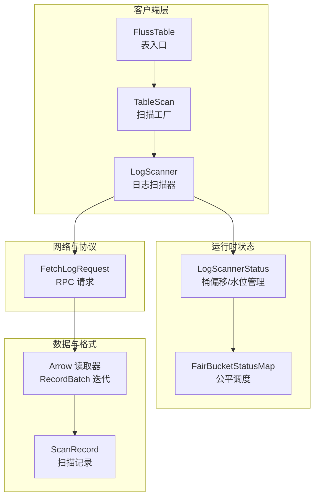
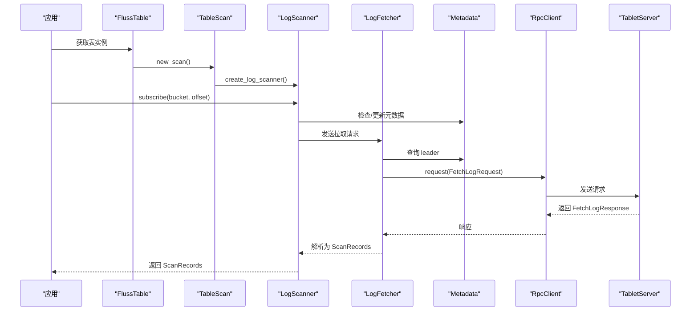
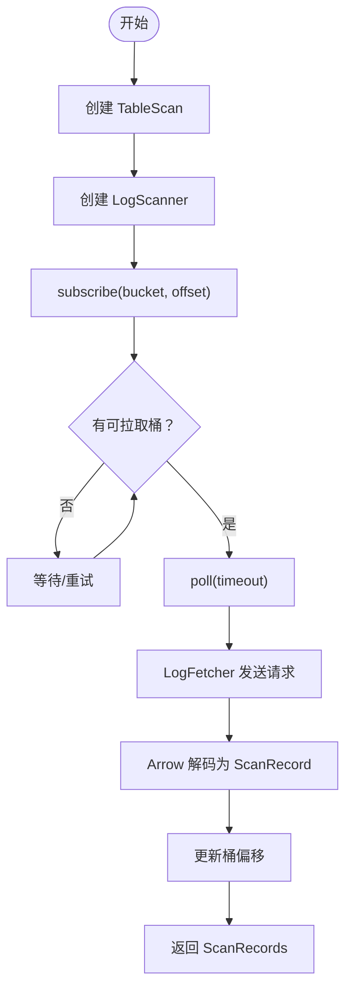
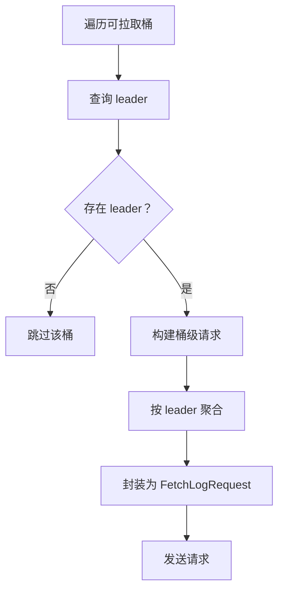
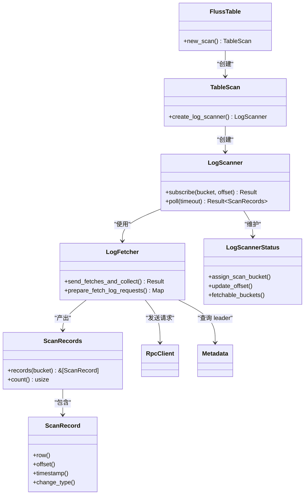

# 日志扫描 (TableScan)

<cite>
**本文引用的文件**
- [crates/fluss/src/client/table/scanner.rs](file://crates/fluss/src/client/table/scanner.rs)
- [crates/fluss/src/client/table/mod.rs](file://crates/fluss/src/client/table/mod.rs)
- [crates/fluss/src/record/mod.rs](file://crates/fluss/src/record/mod.rs)
- [crates/fluss/src/record/arrow.rs](file://crates/fluss/src/record/arrow.rs)
- [crates/fluss/src/rpc/message/fetch.rs](file://crates/fluss/src/rpc/message/fetch.rs)
- [crates/fluss/src/util/mod.rs](file://crates/fluss/src/util/mod.rs)
- [crates/fluss/src/metadata/table.rs](file://crates/fluss/src/metadata/table.rs)
- [crates/fluss/src/lib.rs](file://crates/fluss/src/lib.rs)
- [crates/examples/src/example_table.rs](file://crates/examples/src/example_table.rs)
</cite>

## 目录
1. [简介](#简介)
2. [项目结构](#项目结构)
3. [核心组件](#核心组件)
4. [架构总览](#架构总览)
5. [组件详解](#组件详解)
6. [依赖关系分析](#依赖关系分析)
7. [性能与并发特性](#性能与并发特性)
8. [故障排查指南](#故障排查指南)
9. [结论](#结论)
10. [附录：使用示例与最佳实践](#附录使用示例与最佳实践)

## 简介
本文件系统性阐述 Fluss 中“日志扫描（TableScan）”的设计与实现，覆盖以下主题：
- 扫描器架构与工作流程：日志订阅、数据过滤、流式处理
- 数据源选择、增量扫描与全量扫描模式
- 扫描配置项：起始位置、过滤条件、数据格式
- 并发扫描、背压处理与错误恢复
- 性能优化建议与监控指标

## 项目结构
围绕日志扫描功能的关键模块如下：
- 客户端表接口与扫描入口：client/table/mod.rs、client/table/scanner.rs
- 记录模型与 Arrow 流式读取：record/mod.rs、record/arrow.rs
- RPC 请求封装：rpc/message/fetch.rs
- 公共类型与元数据：lib.rs、metadata/table.rs
- 并发与公平调度工具：util/mod.rs
- 示例用法：examples/src/example_table.rs

图表来源
- [crates/fluss/src/client/table/mod.rs](file://crates/fluss/src/client/table/mod.rs#L32-L67)
- [crates/fluss/src/client/table/scanner.rs](file://crates/fluss/src/client/table/scanner.rs#L38-L108)
- [crates/fluss/src/record/mod.rs](file://crates/fluss/src/record/mod.rs#L87-L175)
- [crates/fluss/src/record/arrow.rs](file://crates/fluss/src/record/arrow.rs#L236-L400)
- [crates/fluss/src/rpc/message/fetch.rs](file://crates/fluss/src/rpc/message/fetch.rs#L35-L57)
- [crates/fluss/src/util/mod.rs](file://crates/fluss/src/util/mod.rs#L32-L170)

章节来源
- [crates/fluss/src/client/table/mod.rs](file://crates/fluss/src/client/table/mod.rs#L18-L74)
- [crates/fluss/src/client/table/scanner.rs](file://crates/fluss/src/client/table/scanner.rs#L38-L108)
- [crates/fluss/src/record/mod.rs](file://crates/fluss/src/record/mod.rs#L87-L175)
- [crates/fluss/src/record/arrow.rs](file://crates/fluss/src/record/arrow.rs#L236-L400)
- [crates/fluss/src/rpc/message/fetch.rs](file://crates/fluss/src/rpc/message/fetch.rs#L35-L57)
- [crates/fluss/src/util/mod.rs](file://crates/fluss/src/util/mod.rs#L32-L170)
- [crates/fluss/src/metadata/table.rs](file://crates/fluss/src/metadata/table.rs#L634-L754)
- [crates/fluss/src/lib.rs](file://crates/fluss/src/lib.rs#L18-L38)

## 核心组件
- FlussTable：表级入口，提供 new_scan 工厂方法，用于创建 TableScan 实例。
- TableScan：扫描工厂，持有连接与元数据，负责创建 LogScanner。
- LogScanner：实际扫描器，维护每个桶的订阅状态与偏移，发起 RPC 拉取并解码为 ScanRecord。
- LogScannerStatus：跟踪每个 TableBucket 的当前偏移与高水位，支持公平调度。
- ScanRecord/ScanRecords：扫描结果抽象，按桶聚合，支持迭代与计数。
- LogFetcher：内部请求组装与发送，负责按 leader 聚合请求、发送 FetchLogRequest 并解析响应。
- Arrow 解码：从日志批次中提取 Arrow RecordBatch，并逐行生成 ScanRecord。

章节来源
- [crates/fluss/src/client/table/mod.rs](file://crates/fluss/src/client/table/mod.rs#L32-L67)
- [crates/fluss/src/client/table/scanner.rs](file://crates/fluss/src/client/table/scanner.rs#L38-L108)
- [crates/fluss/src/record/mod.rs](file://crates/fluss/src/record/mod.rs#L87-L175)
- [crates/fluss/src/record/arrow.rs](file://crates/fluss/src/record/arrow.rs#L236-L400)

## 架构总览
下图展示了从应用到存储的日志扫描端到端流程：

图表来源
- [crates/fluss/src/client/table/mod.rs](file://crates/fluss/src/client/table/mod.rs#L64-L66)
- [crates/fluss/src/client/table/scanner.rs](file://crates/fluss/src/client/table/scanner.rs#L53-L108)
- [crates/fluss/src/rpc/message/fetch.rs](file://crates/fluss/src/rpc/message/fetch.rs#L35-L57)

## 组件详解

### 1) 扫描器生命周期与订阅
- 创建：通过 FlussTable.new_scan() 获取 TableScan，再调用 create_log_scanner() 得到 LogScanner。
- 订阅：调用 subscribe(bucket, offset) 将目标桶与起始偏移注册到 LogScannerStatus。
- 轮询：poll(timeout) 内部委托 LogFetcher 发送请求并返回 ScanRecords。

图表来源
- [crates/fluss/src/client/table/mod.rs](file://crates/fluss/src/client/table/mod.rs#L64-L66)
- [crates/fluss/src/client/table/scanner.rs](file://crates/fluss/src/client/table/scanner.rs#L53-L108)
- [crates/fluss/src/record/arrow.rs](file://crates/fluss/src/record/arrow.rs#L367-L400)

章节来源
- [crates/fluss/src/client/table/mod.rs](file://crates/fluss/src/client/table/mod.rs#L64-L66)
- [crates/fluss/src/client/table/scanner.rs](file://crates/fluss/src/client/table/scanner.rs#L91-L108)

### 2) 数据源选择与请求组装
- 桶可用性：fetchable_buckets() 基于状态映射与可用谓词筛选待拉取桶。
- leader 分配：get_table_bucket_leader() 通过 Metadata 获取桶的 leader 节点。
- 请求聚合：prepare_fetch_log_requests() 按 leader 聚合多个桶请求，构造 FetchLogRequest。
- 参数控制：最大字节数、最小字节数、最大等待时间等常量在扫描器内定义。

图表来源
- [crates/fluss/src/client/table/scanner.rs](file://crates/fluss/src/client/table/scanner.rs#L175-L233)
- [crates/fluss/src/client/table/scanner.rs](file://crates/fluss/src/client/table/scanner.rs#L235-L244)

章节来源
- [crates/fluss/src/client/table/scanner.rs](file://crates/fluss/src/client/table/scanner.rs#L175-L244)

### 3) 增量扫描与全量扫描
- 增量扫描：subscribe 指定起始 offset，LogFetcher 仅拉取该 offset 之后的数据；每次成功解码后更新该桶的下一个偏移。
- 全量扫描：可通过将起始 offset 设为最小值或结合元数据高水位策略实现，具体取决于业务需求与元数据能力。
- 高水位：LogScannerStatus 支持设置高水位，便于上层判断是否到达最新位置。

章节来源
- [crates/fluss/src/client/table/scanner.rs](file://crates/fluss/src/client/table/scanner.rs#L95-L103)
- [crates/fluss/src/client/table/scanner.rs](file://crates/fluss/src/client/table/scanner.rs#L274-L284)

### 4) 数据过滤与投影
- 投影下推：Prepare 阶段已包含 projection_pushdown_enabled 与 projected_fields 字段，当前示例中未启用投影下推。
- 行级过滤：可在应用侧对 ScanRecord 进行过滤，例如基于列值或时间戳范围。
- 字段裁剪：若仅需部分字段，建议结合投影下推与应用侧过滤以降低传输与解析开销。

章节来源
- [crates/fluss/src/client/table/scanner.rs](file://crates/fluss/src/client/table/scanner.rs#L215-L228)
- [crates/fluss/src/metadata/table.rs](file://crates/fluss/src/metadata/table.rs#L634-L754)

### 5) 流式处理与批处理
- 流式：LogRecordsBatchs 提供迭代器，逐个 Arrow RecordBatch 解码为 ScanRecord，支持持续消费。
- 批处理：单次 poll 可能返回多桶、多批次的记录，应用侧可按需合并或分发。

章节来源
- [crates/fluss/src/record/arrow.rs](file://crates/fluss/src/record/arrow.rs#L236-L278)
- [crates/fluss/src/record/arrow.rs](file://crates/fluss/src/record/arrow.rs#L367-L400)
- [crates/fluss/src/record/mod.rs](file://crates/fluss/src/record/mod.rs#L135-L175)

### 6) 并发与公平调度
- 多桶并发：不同桶的 leader 可并行请求，提升吞吐。
- 公平调度：FairBucketStatusMap 保证桶在轮询中的顺序公平性，避免饥饿。
- 状态并发：LogScannerStatus 使用读写锁保护桶状态，支持高并发下的偏移更新。

章节来源
- [crates/fluss/src/util/mod.rs](file://crates/fluss/src/util/mod.rs#L32-L170)
- [crates/fluss/src/client/table/scanner.rs](file://crates/fluss/src/client/table/scanner.rs#L246-L337)

### 7) 错误恢复与健壮性
- 元数据刷新：subscribe 会检查并更新表元数据，确保 leader 信息正确。
- 请求失败：RPC 层抛出异常时由上层捕获并决定重试或降级。
- 偏移推进：仅在成功解码后才更新偏移，避免重复消费或丢失。

章节来源
- [crates/fluss/src/client/table/scanner.rs](file://crates/fluss/src/client/table/scanner.rs#L97-L102)
- [crates/fluss/src/client/table/scanner.rs](file://crates/fluss/src/client/table/scanner.rs#L145-L147)
- [crates/fluss/src/client/table/scanner.rs](file://crates/fluss/src/client/table/scanner.rs#L163-L165)

## 依赖关系分析

图表来源
- [crates/fluss/src/client/table/mod.rs](file://crates/fluss/src/client/table/mod.rs#L32-L67)
- [crates/fluss/src/client/table/scanner.rs](file://crates/fluss/src/client/table/scanner.rs#L38-L108)
- [crates/fluss/src/record/mod.rs](file://crates/fluss/src/record/mod.rs#L87-L175)

章节来源
- [crates/fluss/src/client/table/mod.rs](file://crates/fluss/src/client/table/mod.rs#L32-L67)
- [crates/fluss/src/client/table/scanner.rs](file://crates/fluss/src/client/table/scanner.rs#L38-L108)
- [crates/fluss/src/record/mod.rs](file://crates/fluss/src/record/mod.rs#L87-L175)

## 性能与并发特性
- 并发拉取：按 leader 聚合请求，不同 leader 并行拉取，提高整体吞吐。
- 背压与限流：通过 max_bytes、min_bytes、max_wait_ms 控制请求大小与等待时间，缓解下游压力。
- 公平调度：FairBucketStatusMap 保障桶间公平性，避免某些桶长期得不到服务。
- 序列化与解码：Arrow RecordBatch 读取高效，减少内存拷贝与解析成本。
- 偏移推进：仅在成功解码后推进，避免重复消费与数据丢失风险。

章节来源
- [crates/fluss/src/client/table/scanner.rs](file://crates/fluss/src/client/table/scanner.rs#L32-L37)
- [crates/fluss/src/client/table/scanner.rs](file://crates/fluss/src/client/table/scanner.rs#L215-L228)
- [crates/fluss/src/util/mod.rs](file://crates/fluss/src/util/mod.rs#L32-L170)
- [crates/fluss/src/record/arrow.rs](file://crates/fluss/src/record/arrow.rs#L367-L400)

## 故障排查指南
- 订阅失败：确认表路径与桶 ID 正确，检查元数据是否已更新。
- 无数据返回：检查起始偏移是否合理，确认桶 leader 是否可达。
- 解码异常：核对表模式与 Arrow Schema 是否一致，确保数据格式匹配。
- 性能抖动：调整 max_bytes、max_wait_ms，观察是否缓解；检查是否存在热点桶导致调度不均。

章节来源
- [crates/fluss/src/client/table/scanner.rs](file://crates/fluss/src/client/table/scanner.rs#L97-L102)
- [crates/fluss/src/record/arrow.rs](file://crates/fluss/src/record/arrow.rs#L402-L447)

## 结论
Fluss 的 TableScan 通过“订阅 + 增量拉取 + Arrow 流式解码”的组合，提供了高性能、低延迟的日志扫描能力。其并发与公平调度机制有效提升了多桶场景下的吞吐与稳定性；同时，灵活的配置参数与可扩展的过滤/投影能力，使其适用于多样化的实时数据消费场景。

## 附录：使用示例与最佳实践

### 使用示例
- 创建表、写入数据、订阅并轮询扫描：
  - 参考示例：[crates/examples/src/example_table.rs](file://crates/examples/src/example_table.rs#L27-L87)
  - 关键步骤：new_scan() → create_log_scanner() → subscribe() → poll()

章节来源
- [crates/examples/src/example_table.rs](file://crates/examples/src/example_table.rs#L69-L85)

### 最佳实践
- 起始位置：首次消费建议从最新 offset 开始，避免历史回放；如需全量，结合高水位策略。
- 过滤与投影：优先启用投影下推与应用侧过滤，减少网络与解析开销。
- 并发与分区：按桶并发拉取，避免跨桶串行；关注热点桶，必要时拆分或扩容。
- 背压策略：根据下游处理能力动态调整 max_bytes、max_wait_ms，保持稳定吞吐。
- 错误处理：对 RPC 异常进行重试与降级；确保幂等消费，避免重复处理。