# 流式写入（TableWriter）

<cite>
**本文引用的文件**
- [crates/fluss/src/client/table/writer.rs](file://crates/fluss/src/client/table/writer.rs)
- [crates/fluss/src/client/write/mod.rs](file://crates/fluss/src/client/write/mod.rs)
- [crates/fluss/src/client/write/writer_client.rs](file://crates/fluss/src/client/write/writer_client.rs)
- [crates/fluss/src/client/write/accumulator.rs](file://crates/fluss/src/client/write/accumulator.rs)
- [crates/fluss/src/client/write/batch.rs](file://crates/fluss/src/client/write/batch.rs)
- [crates/fluss/src/client/write/sender.rs](file://crates/fluss/src/client/write/sender.rs)
- [crates/fluss/src/client/write/bucket_assigner.rs](file://crates/fluss/src/client/write/bucket_assigner.rs)
- [crates/fluss/src/client/connection.rs](file://crates/fluss/src/client/connection.rs)
- [crates/fluss/src/client/table/mod.rs](file://crates/fluss/src/client/table/mod.rs)
- [crates/fluss/src/config.rs](file://crates/fluss/src/config.rs)
- [crates/fluss/src/record/arrow.rs](file://crates/fluss/src/record/arrow.rs)
- [crates/fluss/src/rpc/message/produce_log.rs](file://crates/fluss/src/rpc/message/produce_log.rs)
- [crates/fluss/src/client/metadata.rs](file://crates/fluss/src/client/metadata.rs)
- [crates/examples/src/example_table.rs](file://crates/examples/src/example_table.rs)
</cite>

## 目录
1. [简介](#简介)
2. [项目结构](#项目结构)
3. [核心组件](#核心组件)
4. [架构总览](#架构总览)
5. [详细组件分析](#详细组件分析)
6. [依赖关系分析](#依赖关系分析)
7. [性能与扩展性](#性能与扩展性)
8. [故障处理与一致性](#故障处理与一致性)
9. [使用示例](#使用示例)
10. [结论](#结论)

## 简介
本文件系统性阐述流式写入子系统的设计与实现，围绕 TableWriter 的接口抽象、WriterClient 的发送管线、RecordAccumulator 的缓冲与调度、Sender 的异步发送循环、以及 Arrow 批构建与序列化等关键模块，解释从数据接收、实时处理到持久化的完整工作流。同时给出配置参数说明、性能特征、资源消耗与扩展性考量，并提供故障处理、数据一致性和监控告警的最佳实践。

## 项目结构
流式写入相关代码主要位于以下模块：
- 表级写入接口与表对象：client/table
- 写入客户端与发送管线：client/write
- 连接与元数据：client/connection、client/metadata
- 配置：config.rs
- 记录与批构建：record/arrow
- RPC 请求封装：rpc/message/produce_log.rs

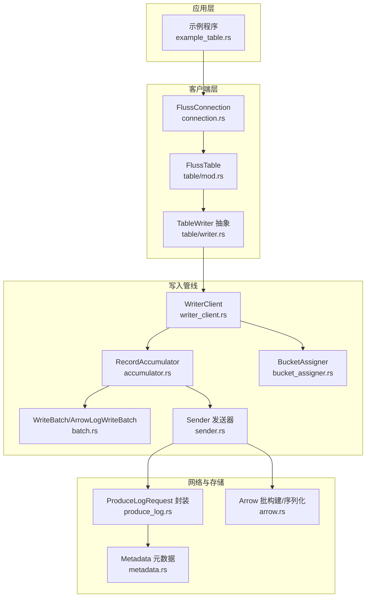

图表来源
- [crates/fluss/src/client/connection.rs](file://crates/fluss/src/client/connection.rs#L30-L82)
- [crates/fluss/src/client/table/mod.rs](file://crates/fluss/src/client/table/mod.rs#L32-L66)
- [crates/fluss/src/client/table/writer.rs](file://crates/fluss/src/client/table/writer.rs#L25-L88)
- [crates/fluss/src/client/write/writer_client.rs](file://crates/fluss/src/client/write/writer_client.rs#L31-L147)
- [crates/fluss/src/client/write/accumulator.rs](file://crates/fluss/src/client/write/accumulator.rs#L34-L442)
- [crates/fluss/src/client/write/batch.rs](file://crates/fluss/src/client/write/batch.rs#L27-L176)
- [crates/fluss/src/client/write/sender.rs](file://crates/fluss/src/client/write/sender.rs#L30-L207)
- [crates/fluss/src/client/write/bucket_assigner.rs](file://crates/fluss/src/client/write/bucket_assigner.rs#L23-L102)
- [crates/fluss/src/client/metadata.rs](file://crates/fluss/src/client/metadata.rs#L29-L109)
- [crates/fluss/src/rpc/message/produce_log.rs](file://crates/fluss/src/rpc/message/produce_log.rs#L31-L71)
- [crates/fluss/src/record/arrow.rs](file://crates/fluss/src/record/arrow.rs#L92-L230)

章节来源
- [crates/fluss/src/client/table/writer.rs](file://crates/fluss/src/client/table/writer.rs#L25-L88)
- [crates/fluss/src/client/write/mod.rs](file://crates/fluss/src/client/write/mod.rs#L36-L68)
- [crates/fluss/src/client/write/writer_client.rs](file://crates/fluss/src/client/write/writer_client.rs#L31-L147)
- [crates/fluss/src/client/write/accumulator.rs](file://crates/fluss/src/client/write/accumulator.rs#L34-L442)
- [crates/fluss/src/client/write/batch.rs](file://crates/fluss/src/client/write/batch.rs#L27-L176)
- [crates/fluss/src/client/write/sender.rs](file://crates/fluss/src/client/write/sender.rs#L30-L207)
- [crates/fluss/src/client/write/bucket_assigner.rs](file://crates/fluss/src/client/write/bucket_assigner.rs#L23-L102)
- [crates/fluss/src/client/connection.rs](file://crates/fluss/src/client/connection.rs#L30-L82)
- [crates/fluss/src/client/table/mod.rs](file://crates/fluss/src/client/table/mod.rs#L32-L66)
- [crates/fluss/src/client/metadata.rs](file://crates/fluss/src/client/metadata.rs#L29-L109)
- [crates/fluss/src/record/arrow.rs](file://crates/fluss/src/record/arrow.rs#L92-L230)
- [crates/fluss/src/rpc/message/produce_log.rs](file://crates/fluss/src/rpc/message/produce_log.rs#L31-L71)

## 核心组件
- TableWriter 接口族：定义 flush、append、upsert/delete 等能力，为上层提供统一的写入抽象。
- AbstractTableWriter：封装表路径、字段数、WriterClient，并提供 send 方法等待结果。
- AppendWriterImpl：基于 AbstractTableWriter 实现追加写入。
- WriterClient：写入客户端，负责将 WriteRecord 缓冲到 RecordAccumulator，协调 BucketAssigner 和 Sender。
- RecordAccumulator：按表/桶聚合批次，维护超时与大小阈值，驱动 Sender 发送。
- Sender：运行在独立任务中，周期性检查可发送节点，收集批次并发起 RPC 请求。
- WriteBatch/ArrowLogWriteBatch：内存中的 Arrow 批构建器，支持追加、关闭与序列化。
- BucketAssigner/StickyBucketAssigner：桶分配策略，保证同一批次内粘滞在同一桶。
- Metadata：集群元数据与连接管理，提供更新与查询。
- ProduceLogRequest：RPC 请求封装，将多个桶的批次打包发送。

章节来源
- [crates/fluss/src/client/table/writer.rs](file://crates/fluss/src/client/table/writer.rs#L25-L88)
- [crates/fluss/src/client/write/mod.rs](file://crates/fluss/src/client/write/mod.rs#L36-L68)
- [crates/fluss/src/client/write/writer_client.rs](file://crates/fluss/src/client/write/writer_client.rs#L31-L147)
- [crates/fluss/src/client/write/accumulator.rs](file://crates/fluss/src/client/write/accumulator.rs#L34-L442)
- [crates/fluss/src/client/write/batch.rs](file://crates/fluss/src/client/write/batch.rs#L27-L176)
- [crates/fluss/src/client/write/sender.rs](file://crates/fluss/src/client/write/sender.rs#L30-L207)
- [crates/fluss/src/client/write/bucket_assigner.rs](file://crates/fluss/src/client/write/bucket_assigner.rs#L23-L102)
- [crates/fluss/src/client/metadata.rs](file://crates/fluss/src/client/metadata.rs#L29-L109)
- [crates/fluss/src/rpc/message/produce_log.rs](file://crates/fluss/src/rpc/message/produce_log.rs#L31-L71)

## 架构总览
下图展示了从应用调用到服务端落盘的端到端流程。

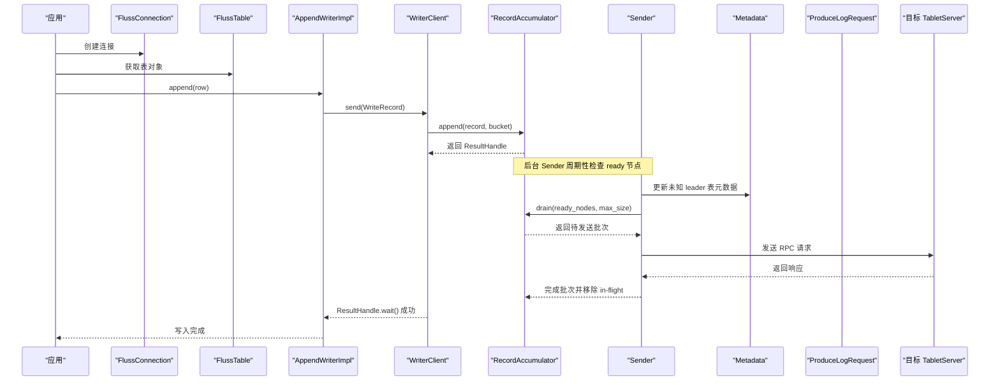

图表来源
- [crates/fluss/src/client/table/mod.rs](file://crates/fluss/src/client/table/mod.rs#L56-L62)
- [crates/fluss/src/client/table/writer.rs](file://crates/fluss/src/client/table/writer.rs#L77-L88)
- [crates/fluss/src/client/write/writer_client.rs](file://crates/fluss/src/client/write/writer_client.rs#L89-L123)
- [crates/fluss/src/client/write/accumulator.rs](file://crates/fluss/src/client/write/accumulator.rs#L128-L162)
- [crates/fluss/src/client/write/sender.rs](file://crates/fluss/src/client/write/sender.rs#L63-L106)
- [crates/fluss/src/client/metadata.rs](file://crates/fluss/src/client/metadata.rs#L66-L94)
- [crates/fluss/src/rpc/message/produce_log.rs](file://crates/fluss/src/rpc/message/produce_log.rs#L35-L59)

## 详细组件分析

### TableWriter 接口与实现
- 接口族：TableWriter、AppendWriter、UpsertWriter 提供统一的 flush、append、upsert、delete 能力。
- AbstractTableWriter：持有表路径、字段数与 WriterClient；send 方法通过 WriterClient 发送并等待结果。
- AppendWriterImpl：构造 WriteRecord 并委托 AbstractTableWriter.send。

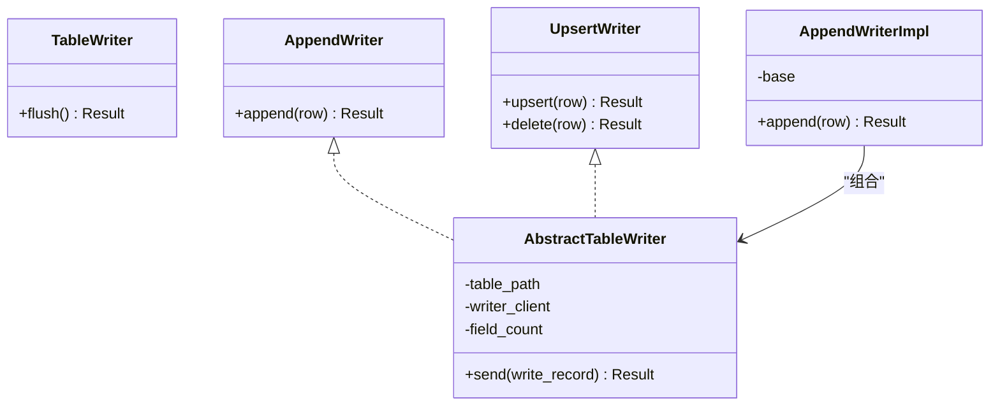

图表来源
- [crates/fluss/src/client/table/writer.rs](file://crates/fluss/src/client/table/writer.rs#L25-L88)

章节来源
- [crates/fluss/src/client/table/writer.rs](file://crates/fluss/src/client/table/writer.rs#L25-L88)

### WriterClient：写入客户端与调度
- 负责创建并持有 WriterClient 生命周期内的 Sender 任务、RecordAccumulator、BucketAssigner。
- send：选择桶、写入 Accumulator；必要时触发新批次并重试。
- flush：触发全局 flush 并等待未完成批次完成。

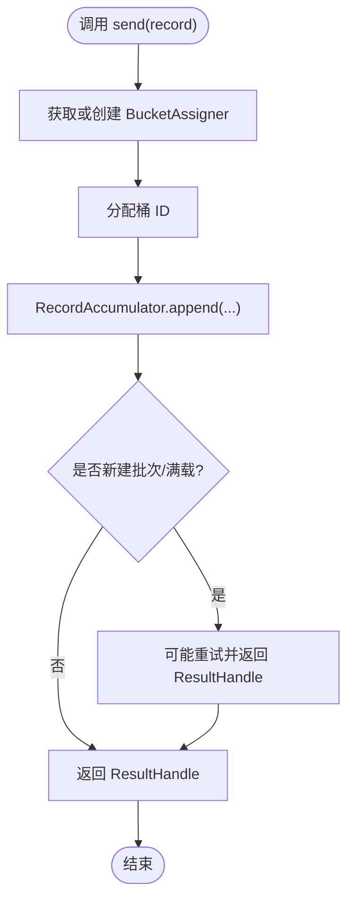

图表来源
- [crates/fluss/src/client/write/writer_client.rs](file://crates/fluss/src/client/write/writer_client.rs#L89-L123)
- [crates/fluss/src/client/write/accumulator.rs](file://crates/fluss/src/client/write/accumulator.rs#L128-L162)

章节来源
- [crates/fluss/src/client/write/writer_client.rs](file://crates/fluss/src/client/write/writer_client.rs#L31-L147)

### RecordAccumulator：缓冲与调度
- 按表路径与桶 ID 维护批次队列，支持尝试追加、新建批次、就绪检查、节点漂移拉取等。
- ready/drain：根据批次等待时间、大小与 leader 可达性决定发送时机与负载。
- flush 支持 begin_flush/await_flush_completion，确保 flush 期间的可见性。

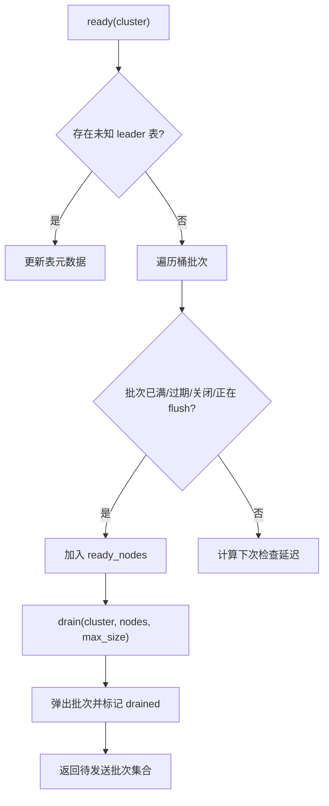

图表来源
- [crates/fluss/src/client/write/accumulator.rs](file://crates/fluss/src/client/write/accumulator.rs#L164-L188)
- [crates/fluss/src/client/write/accumulator.rs](file://crates/fluss/src/client/write/accumulator.rs#L244-L333)

章节来源
- [crates/fluss/src/client/write/accumulator.rs](file://crates/fluss/src/client/write/accumulator.rs#L34-L442)

### Sender：异步发送循环
- run/run_once：周期性检查 ready 节点，收集批次，建立连接并发送请求。
- handle_produce_response：根据响应完成批次并清理 in-flight/incomplete 列表。
- close：停止发送循环。

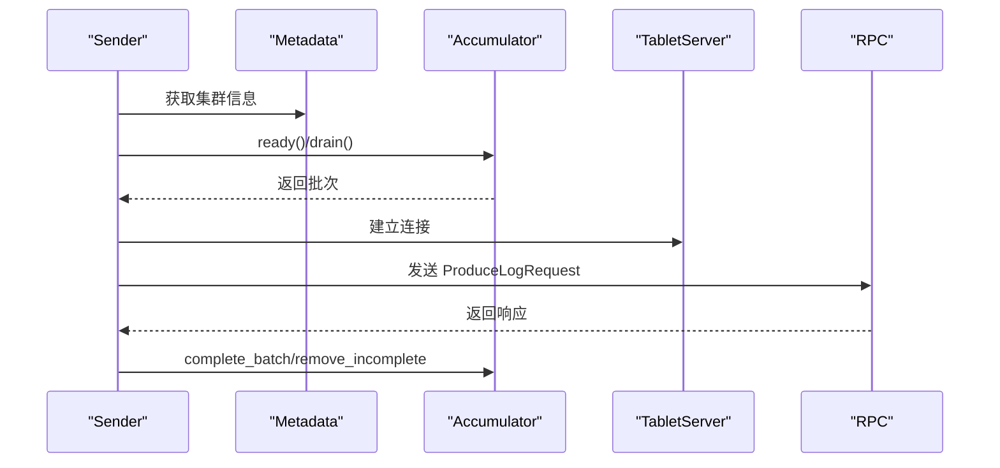

图表来源
- [crates/fluss/src/client/write/sender.rs](file://crates/fluss/src/client/write/sender.rs#L63-L106)
- [crates/fluss/src/client/write/sender.rs](file://crates/fluss/src/client/write/sender.rs#L120-L167)
- [crates/fluss/src/rpc/message/produce_log.rs](file://crates/fluss/src/rpc/message/produce_log.rs#L35-L59)

章节来源
- [crates/fluss/src/client/write/sender.rs](file://crates/fluss/src/client/write/sender.rs#L30-L207)

### WriteBatch 与 Arrow 批构建
- WriteBatch/ArrowLogWriteBatch：在内存中累积 Arrow 列式数据，支持 append/close/build。
- MemoryLogRecordsArrowBuilder：按表模式构建 Arrow RecordBatch，序列化为带校验头的批次字节。

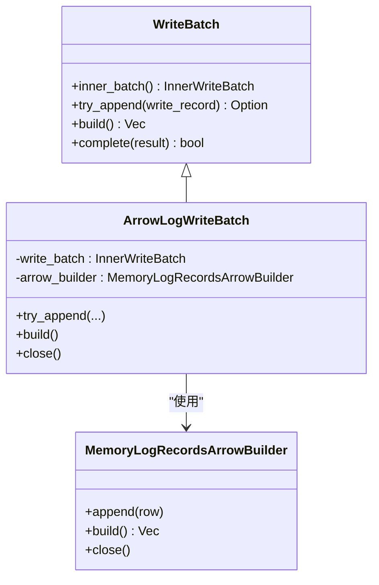

图表来源
- [crates/fluss/src/client/write/batch.rs](file://crates/fluss/src/client/write/batch.rs#L67-L176)
- [crates/fluss/src/record/arrow.rs](file://crates/fluss/src/record/arrow.rs#L92-L230)

章节来源
- [crates/fluss/src/client/write/batch.rs](file://crates/fluss/src/client/write/batch.rs#L27-L176)
- [crates/fluss/src/record/arrow.rs](file://crates/fluss/src/record/arrow.rs#L92-L230)

### Bucket 分配策略
- BucketAssigner：抽象桶分配接口。
- StickyBucketAssigner：粘滞分配，首次随机选择，后续保持同一桶，避免跨桶乱序。

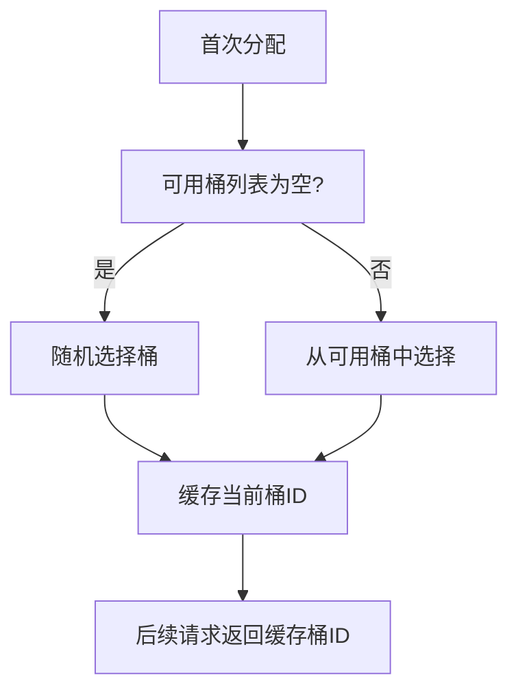

图表来源
- [crates/fluss/src/client/write/bucket_assigner.rs](file://crates/fluss/src/client/write/bucket_assigner.rs#L45-L82)

章节来源
- [crates/fluss/src/client/write/bucket_assigner.rs](file://crates/fluss/src/client/write/bucket_assigner.rs#L23-L102)

### 元数据与连接管理
- Metadata：维护 Cluster，支持更新元数据、获取连接、查询 leader。
- FlussConnection：持有 RpcClient 与 Metadata，提供 WriterClient 单例缓存与表对象创建。

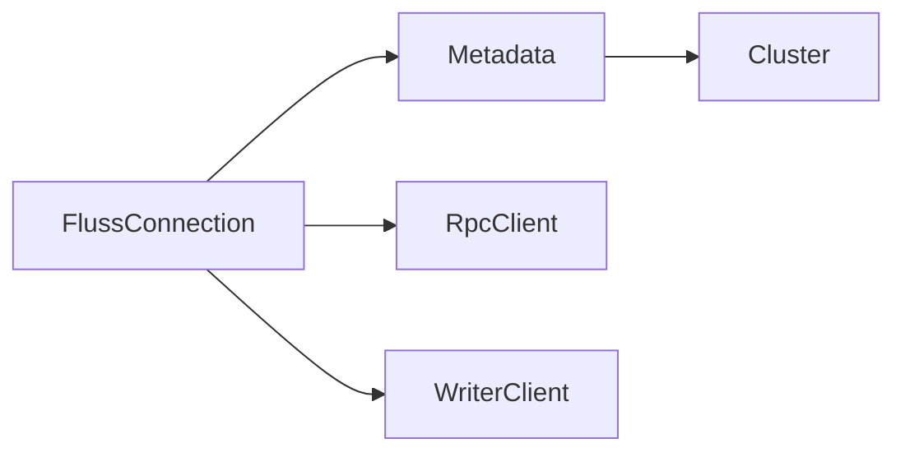

图表来源
- [crates/fluss/src/client/connection.rs](file://crates/fluss/src/client/connection.rs#L30-L82)
- [crates/fluss/src/client/metadata.rs](file://crates/fluss/src/client/metadata.rs#L29-L109)

章节来源
- [crates/fluss/src/client/connection.rs](file://crates/fluss/src/client/connection.rs#L30-L82)
- [crates/fluss/src/client/metadata.rs](file://crates/fluss/src/client/metadata.rs#L29-L109)

## 依赖关系分析
- WriterClient 依赖：Config、Metadata、RecordAccumulator、BucketAssigner、Sender。
- Sender 依赖：Metadata、RecordAccumulator、RPC 请求封装、目标节点连接。
- RecordAccumulator 依赖：DashMap、RwLock、Tokio Mutex、时间戳工具。
- Arrow 批构建依赖：Arrow 库、CRC32C 校验、内存缓冲。

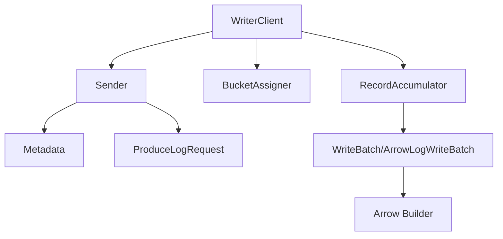

图表来源
- [crates/fluss/src/client/write/writer_client.rs](file://crates/fluss/src/client/write/writer_client.rs#L31-L76)
- [crates/fluss/src/client/write/accumulator.rs](file://crates/fluss/src/client/write/accumulator.rs#L34-L61)
- [crates/fluss/src/client/write/sender.rs](file://crates/fluss/src/client/write/sender.rs#L30-L61)
- [crates/fluss/src/client/write/batch.rs](file://crates/fluss/src/client/write/batch.rs#L27-L65)
- [crates/fluss/src/record/arrow.rs](file://crates/fluss/src/record/arrow.rs#L92-L125)
- [crates/fluss/src/rpc/message/produce_log.rs](file://crates/fluss/src/rpc/message/produce_log.rs#L31-L59)

章节来源
- [crates/fluss/src/client/write/writer_client.rs](file://crates/fluss/src/client/write/writer_client.rs#L31-L76)
- [crates/fluss/src/client/write/accumulator.rs](file://crates/fluss/src/client/write/accumulator.rs#L34-L61)
- [crates/fluss/src/client/write/sender.rs](file://crates/fluss/src/client/write/sender.rs#L30-L61)
- [crates/fluss/src/client/write/batch.rs](file://crates/fluss/src/client/write/batch.rs#L27-L65)
- [crates/fluss/src/record/arrow.rs](file://crates/fluss/src/record/arrow.rs#L92-L125)
- [crates/fluss/src/rpc/message/produce_log.rs](file://crates/fluss/src/rpc/message/produce_log.rs#L31-L59)

## 性能与扩展性
- 缓冲与批大小
  - writer_batch_size：影响单批记录数量上限，控制内存占用与网络开销平衡。
  - request_max_size：限制单个请求最大字节数，Sender 在 drain 时据此裁剪批次。
- 超时与唤醒
  - batch_timeout_ms：默认约 500ms，到期即触发发送，降低尾延迟。
  - flush：begin_flush/await_flush_completion 提供显式刷写保障。
- 连接与并发
  - Sender 以独立任务运行，避免阻塞写入线程。
  - 多桶多表并发写入，通过 DashMap 与锁粒度控制降低竞争。
- 序列化与压缩
  - Arrow 批构建后进行 CRC 校验，减少传输错误带来的重传成本。
- 扩展性
  - 多桶粘滞分配减少跨桶乱序与跨节点往返。
  - 动态元数据更新，支持集群扩容与 leader 变更。

章节来源
- [crates/fluss/src/config.rs](file://crates/fluss/src/config.rs#L21-L39)
- [crates/fluss/src/client/write/accumulator.rs](file://crates/fluss/src/client/write/accumulator.rs#L48-L61)
- [crates/fluss/src/client/write/sender.rs](file://crates/fluss/src/client/write/sender.rs#L91-L98)
- [crates/fluss/src/record/arrow.rs](file://crates/fluss/src/record/arrow.rs#L150-L185)

## 故障处理与一致性
- 错误传播
  - ResultHandle.wait()/result：将底层错误转换为写入错误类型，便于上层感知。
  - Sender.handle_produce_response：对响应中的错误码进行处理（当前为占位，建议完善）。
- 一致性与可靠性
  - acks 参数映射：字符串 all 映射为 -1，其他数值解析为 i16；配合 retries 控制重试次数。
  - in-flight/incomplete 管理：完成批次后及时清理，避免悬挂。
- 元数据与连接
  - Metadata.update_tables_metadata：当遇到未知 leader 表时主动更新元数据，提升可用性。
  - FlussConnection.get_or_create_writer_client：单例缓存 WriterClient，避免重复创建。

章节来源
- [crates/fluss/src/client/write/mod.rs](file://crates/fluss/src/client/write/mod.rs#L48-L68)
- [crates/fluss/src/client/write/writer_client.rs](file://crates/fluss/src/client/write/writer_client.rs#L79-L87)
- [crates/fluss/src/client/write/sender.rs](file://crates/fluss/src/client/write/sender.rs#L169-L186)
- [crates/fluss/src/client/metadata.rs](file://crates/fluss/src/client/metadata.rs#L66-L94)
- [crates/fluss/src/client/connection.rs](file://crates/fluss/src/client/connection.rs#L66-L75)

## 使用示例
以下示例演示了如何创建表、写入两条记录并刷新，随后扫描日志输出结果。

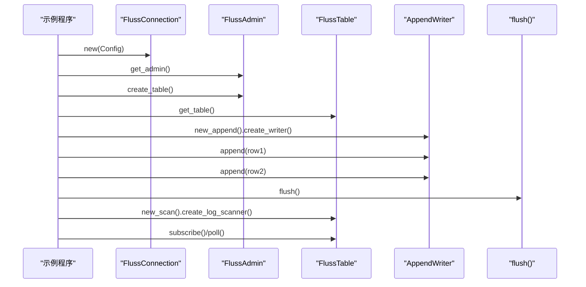

图表来源
- [crates/examples/src/example_table.rs](file://crates/examples/src/example_table.rs#L27-L86)
- [crates/fluss/src/client/table/mod.rs](file://crates/fluss/src/client/table/mod.rs#L56-L66)

章节来源
- [crates/examples/src/example_table.rs](file://crates/examples/src/example_table.rs#L27-L86)

## 结论
该流式写入子系统通过“写入抽象 + 客户端调度 + 缓冲聚合 + 异步发送”的分层设计，实现了低延迟、高吞吐的实时写入能力。其关键优势包括：
- 明确的接口抽象与表对象封装，简化上层使用；
- 基于桶粘滞的分配策略与批次管理，兼顾顺序性与并行度；
- Sender 独立任务与超时唤醒机制，保障尾延迟与吞吐；
- Arrow 批构建与 CRC 校验，提升序列化效率与传输可靠性。

建议在生产环境中结合配置参数与监控指标（如批次等待时间、发送失败率、in-flight 数量）持续优化 writer_batch_size、request_max_size 与 writer_retries，以获得最佳性能与稳定性。