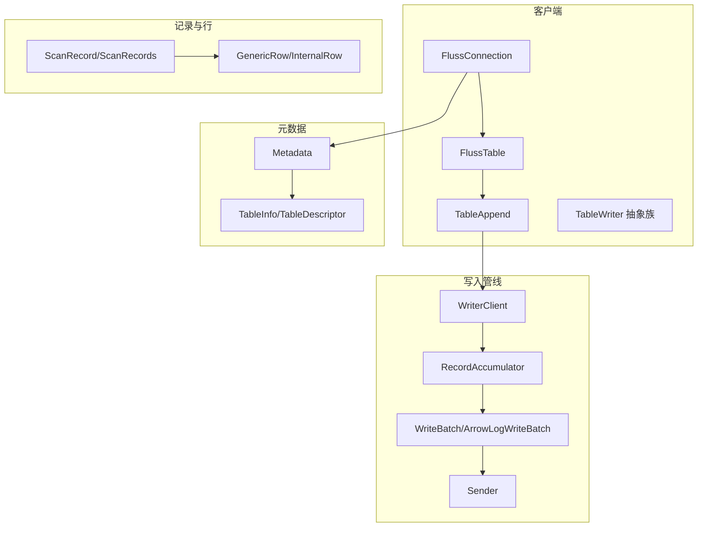
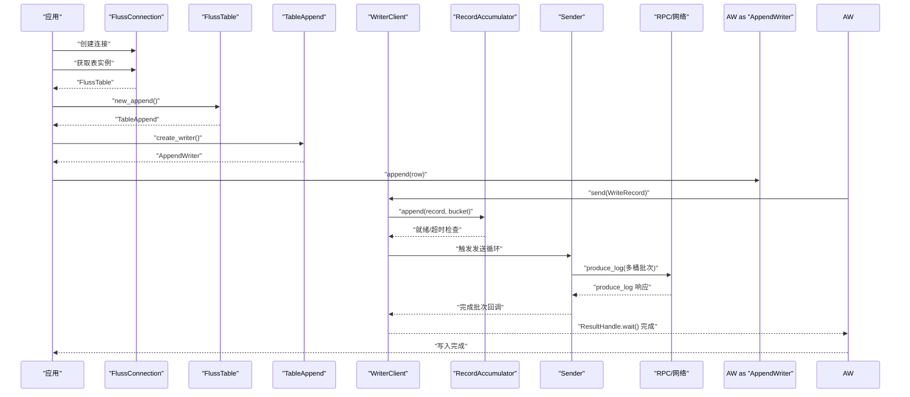
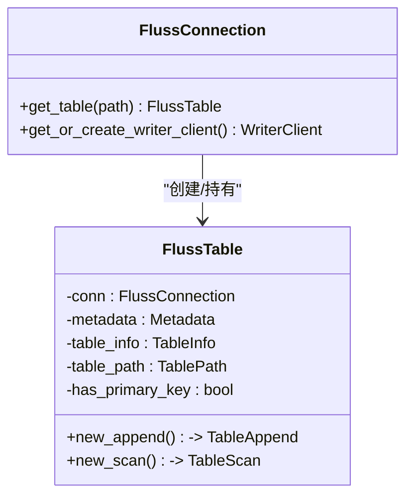
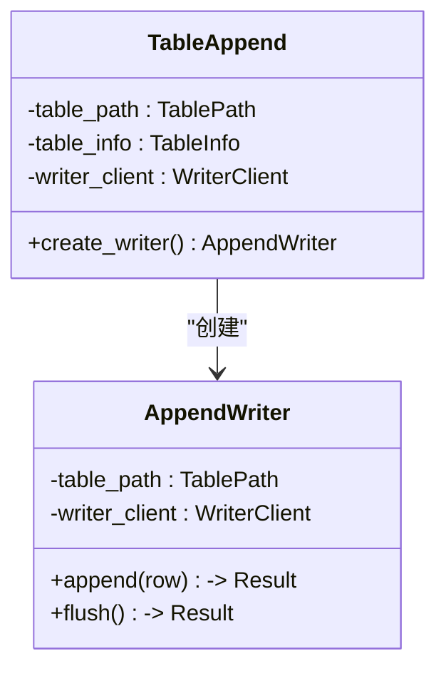
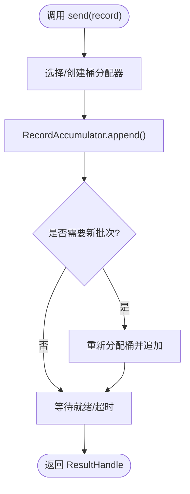
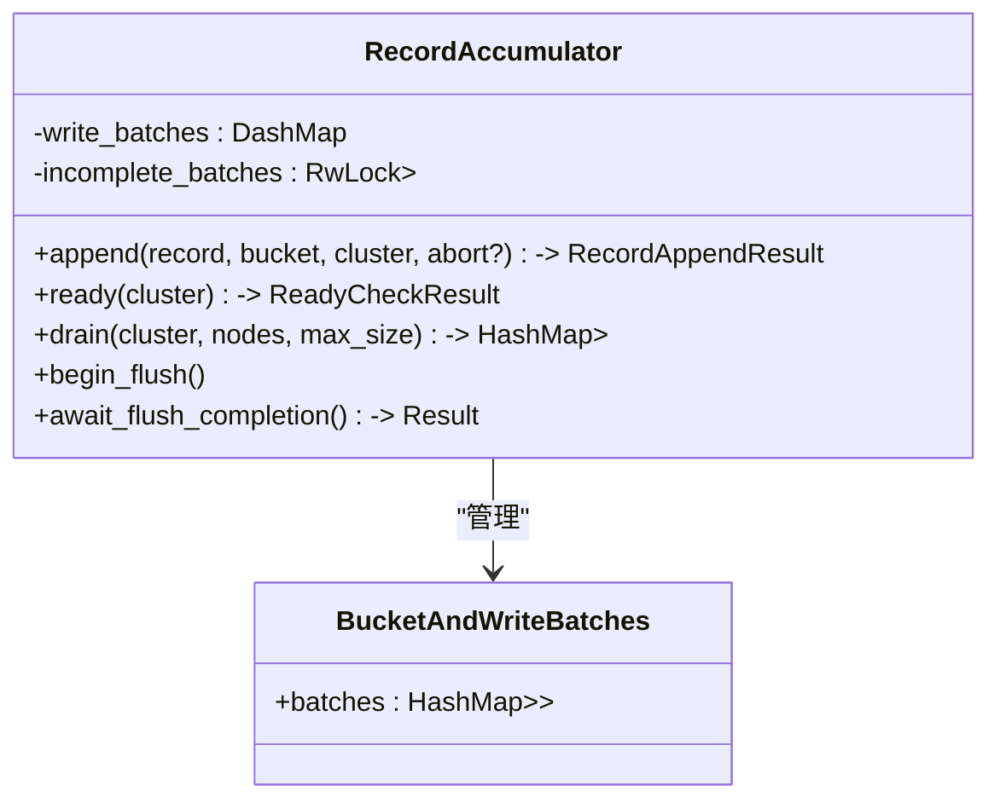
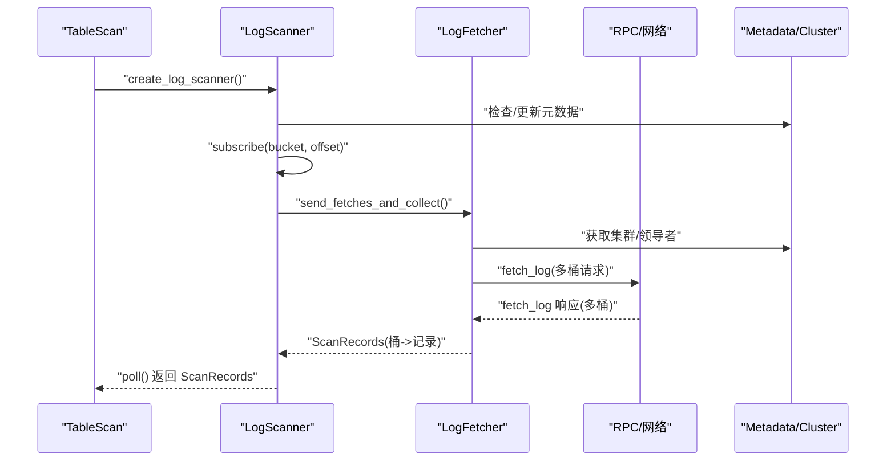
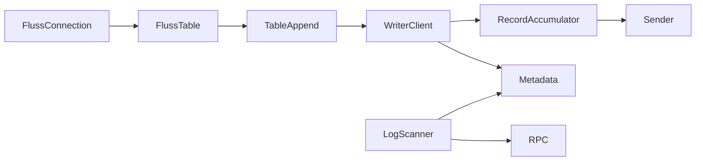

# 表操作

<cite>
**本文引用的文件**
- [lib.rs](file://crates/fluss/src/lib.rs)
- [client/mod.rs](file://crates/fluss/src/client/mod.rs)
- [table/mod.rs](file://crates/fluss/src/client/table/mod.rs)
- [append.rs](file://crates/fluss/src/client/table/append.rs)
- [scanner.rs](file://crates/fluss/src/client/table/scanner.rs)
- [writer.rs](file://crates/fluss/src/client/table/writer.rs)
- [write/mod.rs](file://crates/fluss/src/client/write/mod.rs)
- [writer_client.rs](file://crates/fluss/src/client/write/writer_client.rs)
- [accumulator.rs](file://crates/fluss/src/client/write/accumulator.rs)
- [batch.rs](file://crates/fluss/src/client/write/batch.rs)
- [sender.rs](file://crates/fluss/src/client/write/sender.rs)
- [connection.rs](file://crates/fluss/src/client/connection.rs)
- [table.rs](file://crates/fluss/src/metadata/table.rs)
- [row/mod.rs](file://crates/fluss/src/row/mod.rs)
- [record/mod.rs](file://crates/fluss/src/record/mod.rs)
- [example_table.rs](file://crates/examples/src/example_table.rs)
- [Cargo.toml](file://crates/fluss/Cargo.toml)
</cite>

## 目录
1. [简介](#简介)
2. [项目结构](#项目结构)
3. [核心组件](#核心组件)
4. [架构总览](#架构总览)
5. [组件详解](#组件详解)
6. [依赖关系分析](#依赖关系分析)
7. [性能与吞吐特性](#性能与吞吐特性)
8. [故障排查指南](#故障排查指南)
9. [结论](#结论)
10. [附录：API 参考](#附录api-参考)

## 简介
本文件系统性梳理 Fluss 表操作系统的设计与实现，围绕 FlussTable 的表生命周期管理，以及表的创建、查询、更新（通过追加/UPSERT）、删除（通过变更日志）进行说明；重点阐述 TableAppend 的批量写入机制、TableScanner 的日志扫描能力与流式消费模型、以及 TableWriter 的抽象接口族。文档同时给出组件协作关系、数据流向、状态管理与错误处理策略，并提供基于示例工程的使用范式与最佳实践。

## 项目结构
- 客户端层：连接管理、表操作入口、写入客户端与写入管线
- 元数据层：表模式、分布、路径等信息
- 记录层：变更类型、扫描记录、列存记录构建器
- 行数据层：通用行结构与字段访问
- RPC 层：请求/响应消息体与版本化编解码
- 示例：创建表、写入、扫描的完整流程

**图示来源**
- [connection.rs](file://crates/fluss/src/client/connection.rs#L30-L82)
- [table/mod.rs](file://crates/fluss/src/client/table/mod.rs#L33-L67)
- [append.rs](file://crates/fluss/src/client/table/append.rs#L26-L70)
- [writer.rs](file://crates/fluss/src/client/table/writer.rs#L26-L89)
- [writer_client.rs](file://crates/fluss/src/client/write/writer_client.rs#L32-L147)
- [accumulator.rs](file://crates/fluss/src/client/write/accumulator.rs#L35-L443)
- [batch.rs](file://crates/fluss/src/client/write/batch.rs#L28-L177)
- [sender.rs](file://crates/fluss/src/client/write/sender.rs#L31-L208)
- [table.rs](file://crates/fluss/src/metadata/table.rs#L634-L800)
- [record/mod.rs](file://crates/fluss/src/record/mod.rs#L87-L175)
- [row/mod.rs](file://crates/fluss/src/row/mod.rs#L76-L149)

**章节来源**
- [lib.rs](file://crates/fluss/src/lib.rs#L18-L37)
- [client/mod.rs](file://crates/fluss/src/client/mod.rs#L18-L27)
- [Cargo.toml](file://crates/fluss/Cargo.toml#L25-L47)

## 核心组件
- FlussConnection：集群连接、元数据管理、WriterClient 单例缓存、表实例获取
- FlussTable：表级入口，提供新写入器与日志扫描器
- TableAppend：追加写入器工厂，封装 WriterClient 发送与结果等待
- TableWriter 抽象族：TableWriter、AppendWriter、UpsertWriter 的统一接口
- WriterClient：写入客户端，负责桶分配、批次累积、发送调度与关闭
- RecordAccumulator：记录累积器，按表/桶维护批次队列、超时与就绪检查
- WriteBatch/ArrowLogWriteBatch：批次容器与 Arrow 列存构建
- Sender：发送器，周期性检查就绪节点、聚合批次并发起 RPC 请求
- TableScanner/LogScanner：日志扫描器，订阅桶位偏移、拉取日志并转换为 ScanRecord
- Metadata/TableInfo：表模式、主键、桶键、分桶数、属性配置等

**章节来源**
- [connection.rs](file://crates/fluss/src/client/connection.rs#L30-L82)
- [table/mod.rs](file://crates/fluss/src/client/table/mod.rs#L33-L67)
- [append.rs](file://crates/fluss/src/client/table/append.rs#L26-L70)
- [writer.rs](file://crates/fluss/src/client/table/writer.rs#L26-L89)
- [writer_client.rs](file://crates/fluss/src/client/write/writer_client.rs#L32-L147)
- [accumulator.rs](file://crates/fluss/src/client/write/accumulator.rs#L35-L443)
- [batch.rs](file://crates/fluss/src/client/write/batch.rs#L28-L177)
- [sender.rs](file://crates/fluss/src/client/write/sender.rs#L31-L208)
- [scanner.rs](file://crates/fluss/src/client/table/scanner.rs#L38-L108)
- [table.rs](file://crates/fluss/src/metadata/table.rs#L634-L800)

## 架构总览
下图展示了从应用到存储的端到端数据流：应用通过 FlussConnection 获取 FlussTable，使用 TableAppend 追加写入，WriterClient 将记录累积为批次并通过 Sender 聚合发送至对应桶的领导者 TabletServer；读取侧通过 TableScanner 订阅桶位并轮询拉取日志，转换为 ScanRecord 流式输出。

**图示来源**
- [connection.rs](file://crates/fluss/src/client/connection.rs#L77-L82)
- [table/mod.rs](file://crates/fluss/src/client/table/mod.rs#L56-L62)
- [append.rs](file://crates/fluss/src/client/table/append.rs#L45-L69)
- [writer_client.rs](file://crates/fluss/src/client/write/writer_client.rs#L89-L123)
- [accumulator.rs](file://crates/fluss/src/client/write/accumulator.rs#L128-L162)
- [sender.rs](file://crates/fluss/src/client/write/sender.rs#L132-L167)

## 组件详解

### FlussTable：表入口与生命周期
- 负责持有连接、元数据、表信息与表路径
- 提供 new_append/new_scan 工厂方法，分别产出写入器与扫描器
- 通过 has_primary_key 控制是否具备主键语义（影响桶分配与去重策略）

**图示来源**
- [connection.rs](file://crates/fluss/src/client/connection.rs#L77-L82)
- [table/mod.rs](file://crates/fluss/src/client/table/mod.rs#L33-L67)

**章节来源**
- [table/mod.rs](file://crates/fluss/src/client/table/mod.rs#L33-L67)
- [connection.rs](file://crates/fluss/src/client/connection.rs#L77-L82)

### TableAppend：批量写入器工厂
- 通过 WriterClient 发送 WriteRecord
- AppendWriter 支持 append/flush 异步写入与结果等待
- 结果通过 ResultHandle 等待并转换为具体错误

**图示来源**
- [append.rs](file://crates/fluss/src/client/table/append.rs#L26-L70)

**章节来源**
- [append.rs](file://crates/fluss/src/client/table/append.rs#L26-L70)
- [write/mod.rs](file://crates/fluss/src/client/write/mod.rs#L36-L69)

### WriterClient：写入客户端与批处理调度
- 维护单例 WriterClient，内部含 RecordAccumulator、Sender、关闭通道
- send：根据表路径选择或创建桶分配器，将记录累积到批次，必要时触发新批次
- flush：触发累积器开始刷新并等待未完成批次完成

**图示来源**
- [writer_client.rs](file://crates/fluss/src/client/write/writer_client.rs#L89-L123)
- [accumulator.rs](file://crates/fluss/src/client/write/accumulator.rs#L128-L162)

**章节来源**
- [writer_client.rs](file://crates/fluss/src/client/write/writer_client.rs#L32-L147)
- [accumulator.rs](file://crates/fluss/src/client/write/accumulator.rs#L35-L443)

### RecordAccumulator：批次累积与就绪调度
- 按 TablePath/BucketId 维度维护批次队列
- try_append/append_new_batch：尝试在现有批次追加或创建新批次
- ready/drain：计算就绪节点、按请求大小聚合批次
- flush 标记与 await_flush_completion：支持 flush 阶段等待所有未完成批次完成

**图示来源**
- [accumulator.rs](file://crates/fluss/src/client/write/accumulator.rs#L35-L443)

**章节来源**
- [accumulator.rs](file://crates/fluss/src/client/write/accumulator.rs#L35-L443)

### WriteBatch/ArrowLogWriteBatch：批次与列存构建
- ArrowLogWriteBatch 使用 MemoryLogRecordsArrowBuilder 构建 Arrow 格式的日志记录
- try_append：在批次未满且未关闭时追加记录并返回 ResultHandle
- build/close：序列化批次内容，关闭批次

**章节来源**
- [batch.rs](file://crates/fluss/src/client/write/batch.rs#L28-L177)

### Sender：发送器与响应处理
- run/run_once：周期性检查就绪节点、拉取批次、聚合请求并发送
- send_write_request：按桶组织请求，发送到目标 TabletServer
- handle_produce_response：完成成功响应的批次并清理 in-flight/incomplete 映射

**章节来源**
- [sender.rs](file://crates/fluss/src/client/write/sender.rs#L63-L208)

### TableScanner/LogScanner：日志扫描与流式消费
- LogScannerStatus：维护每个桶的偏移与水位线，支持订阅、更新与公平轮询
- LogFetcher：准备 FetchLogRequest，按桶拉取日志，解析为 ScanRecord 并更新偏移
- TableScan：对外暴露 create_log_scanner/poll/subscribe 等接口

**图示来源**
- [scanner.rs](file://crates/fluss/src/client/table/scanner.rs#L53-L108)
- [scanner.rs](file://crates/fluss/src/client/table/scanner.rs#L135-L173)
- [scanner.rs](file://crates/fluss/src/client/table/scanner.rs#L175-L233)

**章节来源**
- [scanner.rs](file://crates/fluss/src/client/table/scanner.rs#L38-L371)

### TableWriter 抽象族：统一写入接口
- TableWriter：flush
- AppendWriter：append
- UpsertWriter：upsert/delete
- AbstractTableWriter：封装发送逻辑与字段计数

**章节来源**
- [writer.rs](file://crates/fluss/src/client/table/writer.rs#L26-L89)

### 元数据与行数据
- TableInfo/TableDescriptor：表模式、主键、桶键、分桶数、属性等
- GenericRow/InternalRow：通用行结构与字段访问接口
- ScanRecord/ScanRecords：扫描记录与聚合容器

**章节来源**
- [table.rs](file://crates/fluss/src/metadata/table.rs#L634-L800)
- [row/mod.rs](file://crates/fluss/src/row/mod.rs#L26-L149)
- [record/mod.rs](file://crates/fluss/src/record/mod.rs#L87-L175)

## 依赖关系分析
- 组件耦合
  - FlussConnection 与 FlussTable：弱耦合，通过元数据与连接传递
  - TableAppend/WriterClient：强内聚，前者仅负责工厂方法
  - WriterClient 与 Sender/RecordAccumulator：通过共享的 Accumulator 协作
  - Scanner 与 Metadata/Cluster：依赖元数据以定位桶与领导者
- 外部依赖
  - Arrow/Arrow-schema：列存序列化与反序列化
  - Tokio：异步运行时
  - DashMap/parking_lot：并发容器与锁

**图示来源**
- [connection.rs](file://crates/fluss/src/client/connection.rs#L30-L82)
- [table/mod.rs](file://crates/fluss/src/client/table/mod.rs#L33-L67)
- [writer_client.rs](file://crates/fluss/src/client/write/writer_client.rs#L32-L147)
- [accumulator.rs](file://crates/fluss/src/client/write/accumulator.rs#L35-L443)
- [sender.rs](file://crates/fluss/src/client/write/sender.rs#L31-L208)
- [scanner.rs](file://crates/fluss/src/client/table/scanner.rs#L38-L108)

**章节来源**
- [Cargo.toml](file://crates/fluss/Cargo.toml#L25-L47)

## 性能与吞吐特性
- 批处理与压缩：WriteBatch 使用 Arrow 列存构建，减少序列化开销
- 聚合发送：Sender 按节点聚合多桶批次，降低 RPC 次数
- 超时与背压：RecordAccumulator 基于批次等待时间与大小进行就绪判断，避免无限堆积
- 公平轮询：LogScannerStatus 对桶位进行公平调度，避免饥饿
- 写入确认：WriterClient 支持“all”或指定副本数的 ack 策略，平衡一致性与延迟

[本节为总体性能讨论，不直接分析具体文件]

## 故障排查指南
- 写入失败
  - 检查 WriterClient.send 返回的 ResultHandle.wait 是否抛出异常
  - 关注 Sender.handle_produce_response 中的错误码分支
- 元数据不一致
  - 确认 FlussConnection.get_table 是否已触发元数据更新
  - 检查 Metadata.update_tables_metadata 是否被触发
- 扫描无数据
  - 确认 LogScanner.subscribe 是否正确设置桶与起始偏移
  - 检查 LogScannerStatus 的偏移更新与水位线
- 连接问题
  - 检查 FlussConnection.bootstrap_server 配置
  - 确认 RpcClient 能够建立到 TabletServer 的连接

**章节来源**
- [write/mod.rs](file://crates/fluss/src/client/write/mod.rs#L48-L68)
- [sender.rs](file://crates/fluss/src/client/write/sender.rs#L169-L186)
- [connection.rs](file://crates/fluss/src/client/connection.rs#L77-L82)
- [scanner.rs](file://crates/fluss/src/client/table/scanner.rs#L268-L331)

## 结论
Fluss 的表操作系统以 FlussTable 为核心入口，结合 TableAppend 的批量写入与 LogScanner 的日志扫描，形成“写入-持久化-消费”的闭环。WriterClient 通过 RecordAccumulator 与 Sender 实现高吞吐、低延迟的写入路径；Scanner 通过元数据与领导者映射实现稳定的流式消费。整体架构清晰、职责分离明确，适合在高并发与大规模数据场景中使用。

[本节为总结性内容，不直接分析具体文件]

## 附录：API 参考

### FlussConnection
- 方法
  - new(Config) -> Result<Self>
  - get_metadata() -> Metadata
  - get_connections() -> RpcClient
  - get_admin() -> FlussAdmin
  - get_or_create_writer_client() -> WriterClient
  - get_table(&TablePath) -> FlussTable

**章节来源**
- [connection.rs](file://crates/fluss/src/client/connection.rs#L37-L82)

### FlussTable
- 方法
  - new(&FlussConnection, Arc<Metadata>, TableInfo) -> Self
  - get_table_info() -> &TableInfo
  - new_append() -> Result<TableAppend>
  - new_scan() -> TableScan

**章节来源**
- [table/mod.rs](file://crates/fluss/src/client/table/mod.rs#L41-L67)

### TableAppend / AppendWriter
- 方法
  - new(table_path, table_info, writer_client) -> Self
  - create_writer() -> AppendWriter
  - AppendWriter.append(GenericRow) -> Result<()>
  - AppendWriter.flush() -> Result<()>
- 结果等待
  - ResultHandle.wait() -> Result<BatchWriteResult>
  - ResultHandle.result(BatchWriteResult) -> Result<()>

**章节来源**
- [append.rs](file://crates/fluss/src/client/table/append.rs#L33-L69)
- [write/mod.rs](file://crates/fluss/src/client/write/mod.rs#L36-L69)

### TableWriter 抽象族
- Trait
  - TableWriter::flush() -> Result<()>
  - AppendWriter::append(GenericRow) -> Result<()>
  - UpsertWriter::upsert(GenericRow) -> Result<()>
  - UpsertWriter::delete(GenericRow) -> Result<()>

**章节来源**
- [writer.rs](file://crates/fluss/src/client/table/writer.rs#L26-L39)

### WriterClient
- 方法
  - new(Config, Arc<Metadata>) -> Result<Self>
  - send(&WriteRecord) -> Result<ResultHandle>
  - flush() -> Result<()>
  - close() -> Result<()>
- 内部
  - get_ack(Config) -> Result<i16>
  - create_bucket_assigner(&TablePath) -> BucketAssigner

**章节来源**
- [writer_client.rs](file://crates/fluss/src/client/write/writer_client.rs#L42-L147)

### RecordAccumulator
- 方法
  - append(&WriteRecord, BucketId, &Cluster, bool) -> Result<RecordAppendResult>
  - ready(&Cluster) -> ReadyCheckResult
  - drain(Arc<Cluster>, &HashSet<Node>, i32) -> Result<HashMap<Node, Vec<ReadyBatch>>>
  - begin_flush()
  - await_flush_completion() -> Result<()>
- 结果
  - RecordAppendResult{batch_is_full, new_batch_created, abort_record_for_new_batch, result_handle}

**章节来源**
- [accumulator.rs](file://crates/fluss/src/client/write/accumulator.rs#L128-L373)

### Sender
- 方法
  - new(Arc<Metadata>, Arc<RecordAccumulator>, i32, i32, i16, i32) -> Self
  - run() -> Result<()>
  - close() -> ()
- 内部
  - run_once() -> Result<()>
  - send_write_request(i32, i16, &Vec<ReadyWriteBatch>) -> Result<()>
  - handle_produce_response(...) -> Result<()>
  - complete_batch(&ReadyWriteBatch) -> ()

**章节来源**
- [sender.rs](file://crates/fluss/src/client/write/sender.rs#L42-L208)

### TableScanner / LogScanner
- 方法
  - new(&FlussConnection, TableInfo, Arc<Metadata>) -> Self
  - create_log_scanner() -> LogScanner
  - LogScanner.subscribe(i32, i64) -> Result<()>  // bucket, offset
  - LogScanner.poll(Duration) -> Result<ScanRecords>
- 状态
  - LogScannerStatus.assign_scan_bucket / update_offset / fetchable_buckets

**章节来源**
- [scanner.rs](file://crates/fluss/src/client/table/scanner.rs#L44-L108)
- [scanner.rs](file://crates/fluss/src/client/table/scanner.rs#L246-L331)

### 数据模型与枚举
- ChangeType：AppendOnly/Insert/UpdateBefore/UpdateAfter/Delete
- ScanRecord：row/offset/timestamp/change_type
- ScanRecords：按桶聚合的记录集合

**章节来源**
- [record/mod.rs](file://crates/fluss/src/record/mod.rs#L28-L175)

### 使用示例与最佳实践
- 创建表
  - 使用 FlussAdmin.create_table(TablePath, TableDescriptor, overwrite?)
- 写入
  - 通过 FlussTable.new_append().create_writer() 获取 AppendWriter
  - 多条记录并发 append 后统一 flush
- 扫描
  - TableScan.create_log_scanner().subscribe(bucket, offset)
  - 循环 poll 并遍历 ScanRecords

**章节来源**
- [example_table.rs](file://crates/examples/src/example_table.rs#L27-L87)