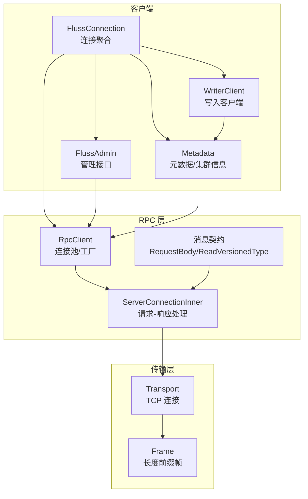
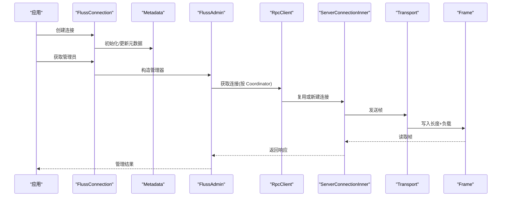
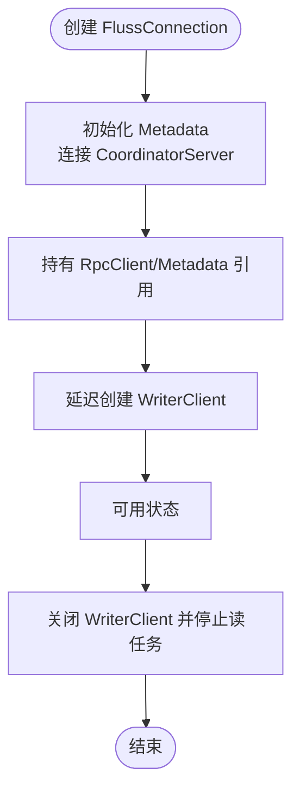
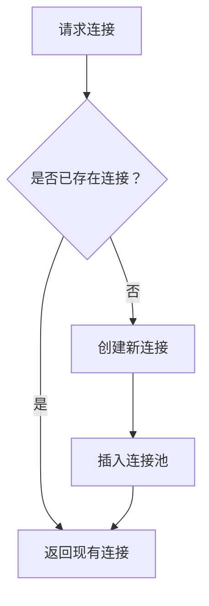
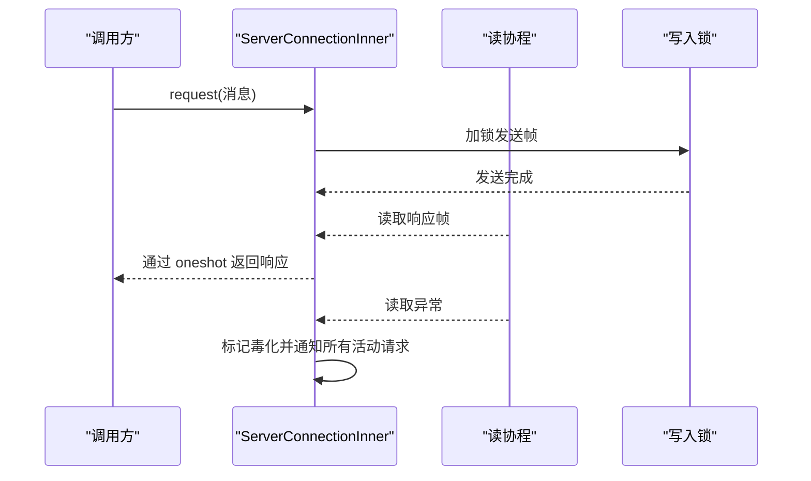
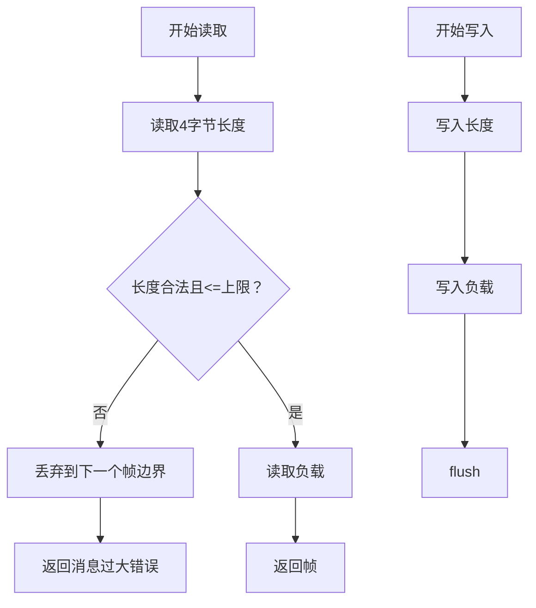
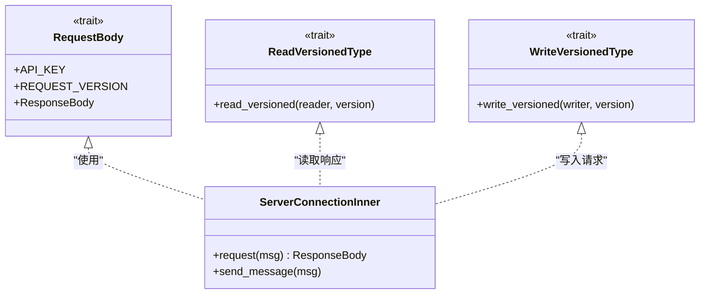
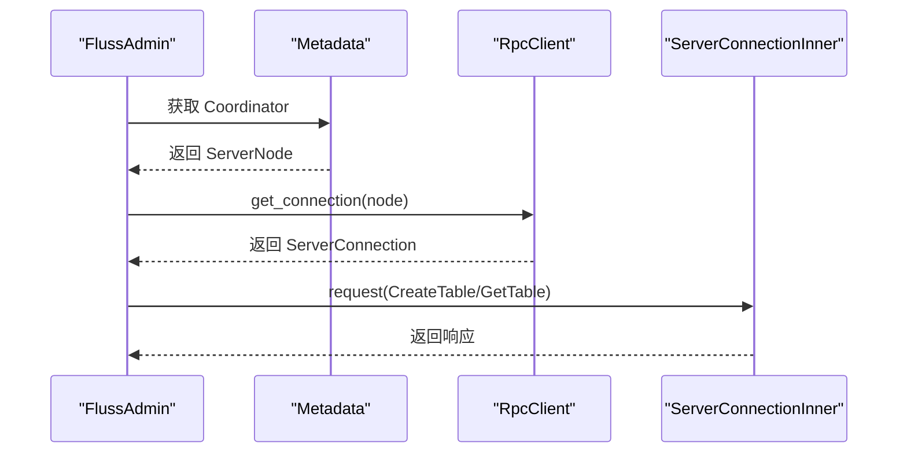
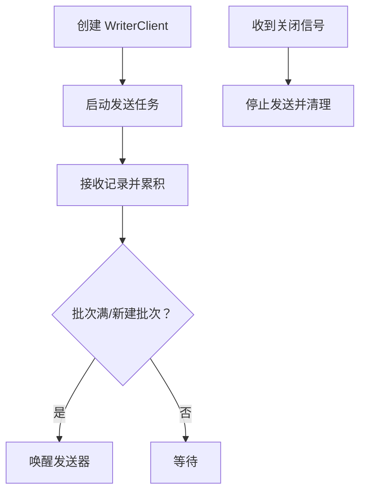
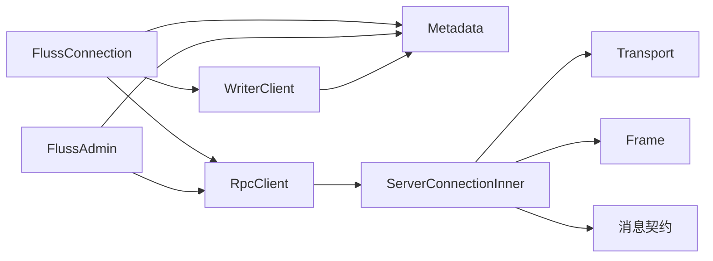

# 连接管理

<cite>
**本文引用的文件**
- [connection.rs](file://crates/fluss/src/client/connection.rs)
- [server_connection.rs](file://crates/fluss/src/rpc/server_connection.rs)
- [transport.rs](file://crates/fluss/src/rpc/transport.rs)
- [frame.rs](file://crates/fluss/src/rpc/frame.rs)
- [config.rs](file://crates/fluss/src/config.rs)
- [message/mod.rs](file://crates/fluss/src/rpc/message/mod.rs)
- [admin.rs](file://crates/fluss/src/client/admin.rs)
- [metadata.rs](file://crates/fluss/src/client/metadata.rs)
- [writer_client.rs](file://crates/fluss/src/client/write/writer_client.rs)
- [error.rs](file://crates/fluss/src/error.rs)
- [example_table.rs](file://crates/examples/src/example_table.rs)
</cite>

## 目录
1. [简介](#简介)
2. [项目结构](#项目结构)
3. [核心组件](#核心组件)
4. [架构总览](#架构总览)
5. [详细组件分析](#详细组件分析)
6. [依赖分析](#依赖分析)
7. [性能考虑](#性能考虑)
8. [故障排查指南](#故障排查指南)
9. [结论](#结论)
10. [附录：最佳实践与示例路径](#附录最佳实践与示例路径)

## 简介
本文件系统性阐述 Fluss 客户端连接管理的设计与实现，重点围绕 FlussConnection 的生命周期（建立、维护、销毁）、连接池管理、重连与超时策略、错误恢复、以及与 ServerConnection 和 Transport 层的交互关系。同时覆盖网络帧处理、消息序列化、配置项、性能调优与监控指标建议，并给出连接创建、使用与关闭的最佳实践。

## 项目结构
连接管理相关代码主要分布在以下模块：
- 客户端入口与连接聚合：client/connection.rs
- RPC 客户端与服务端连接：rpc/server_connection.rs
- 网络传输层：rpc/transport.rs
- 帧编解码与消息读写：rpc/frame.rs
- 配置项：config.rs
- 请求/响应消息契约：rpc/message/mod.rs
- 管理接口与元数据：client/admin.rs、client/metadata.rs
- 写入客户端与发送器：client/write/writer_client.rs
- 错误类型：error.rs
- 示例用法：examples/src/example_table.rs

图表来源
- [connection.rs](file://crates/fluss/src/client/connection.rs#L30-L82)
- [server_connection.rs](file://crates/fluss/src/rpc/server_connection.rs#L47-L97)
- [transport.rs](file://crates/fluss/src/rpc/transport.rs#L27-L83)
- [frame.rs](file://crates/fluss/src/rpc/frame.rs#L34-L106)
- [message/mod.rs](file://crates/fluss/src/rpc/message/mod.rs#L37-L65)
- [admin.rs](file://crates/fluss/src/client/admin.rs#L28-L50)
- [metadata.rs](file://crates/fluss/src/client/metadata.rs#L30-L104)
- [writer_client.rs](file://crates/fluss/src/client/write/writer_client.rs#L32-L77)

章节来源
- [connection.rs](file://crates/fluss/src/client/connection.rs#L30-L82)
- [server_connection.rs](file://crates/fluss/src/rpc/server_connection.rs#L47-L97)
- [transport.rs](file://crates/fluss/src/rpc/transport.rs#L27-L83)
- [frame.rs](file://crates/fluss/src/rpc/frame.rs#L34-L106)
- [message/mod.rs](file://crates/fluss/src/rpc/message/mod.rs#L37-L65)
- [admin.rs](file://crates/fluss/src/client/admin.rs#L28-L50)
- [metadata.rs](file://crates/fluss/src/client/metadata.rs#L30-L104)
- [writer_client.rs](file://crates/fluss/src/client/write/writer_client.rs#L32-L77)

## 核心组件
- FlussConnection：客户端入口，负责聚合 Metadata、RpcClient、WriterClient，提供获取管理员、表等能力。
- RpcClient：连接池与工厂，按 ServerNode 维度缓存 ServerConnection，支持超时与最大消息大小配置。
- ServerConnectionInner：单连接的请求-响应处理，内部有独立读协程、请求映射、毒化状态与取消安全发送。
- Transport：基于 TCP 的异步读写封装。
- Frame：长度前缀帧编解码，保障消息边界与大小限制。
- Message 合约：RequestBody/ReadVersionedType/WriteVersionedType，统一请求/响应序列化与版本化。
- FlussAdmin：通过 CoordinatorServer 执行管理操作。
- Metadata：初始化集群、更新元数据、提供连接句柄。
- WriterClient：写入侧客户端，负责累积、分桶分配、发送与关闭。

章节来源
- [connection.rs](file://crates/fluss/src/client/connection.rs#L30-L82)
- [server_connection.rs](file://crates/fluss/src/rpc/server_connection.rs#L47-L97)
- [transport.rs](file://crates/fluss/src/rpc/transport.rs#L27-L83)
- [frame.rs](file://crates/fluss/src/rpc/frame.rs#L34-L106)
- [message/mod.rs](file://crates/fluss/src/rpc/message/mod.rs#L37-L65)
- [admin.rs](file://crates/fluss/src/client/admin.rs#L28-L50)
- [metadata.rs](file://crates/fluss/src/client/metadata.rs#L30-L104)
- [writer_client.rs](file://crates/fluss/src/client/write/writer_client.rs#L32-L77)

## 架构总览
下图展示了从 FlussConnection 到底层传输的完整调用链路与职责分工。

图表来源
- [connection.rs](file://crates/fluss/src/client/connection.rs#L38-L64)
- [admin.rs](file://crates/fluss/src/client/admin.rs#L35-L50)
- [server_connection.rs](file://crates/fluss/src/rpc/server_connection.rs#L64-L96)
- [transport.rs](file://crates/fluss/src/rpc/transport.rs#L68-L82)
- [frame.rs](file://crates/fluss/src/rpc/frame.rs#L93-L106)

## 详细组件分析

### FlussConnection 生命周期与职责
- 建立：构造 RpcClient 与 Metadata；Metadata 通过 CoordinatorServer 拉取初始集群信息。
- 维护：持有 Arc 化的 RpcClient 与 Metadata，避免重复握手；延迟创建 WriterClient。
- 销毁：当前 Drop 实现中未显式移除连接池条目，但会中断读任务；WriterClient 提供显式关闭流程。

图表来源
- [connection.rs](file://crates/fluss/src/client/connection.rs#L38-L52)
- [server_connection.rs](file://crates/fluss/src/rpc/server_connection.rs#L314-L319)
- [writer_client.rs](file://crates/fluss/src/client/write/writer_client.rs#L125-L135)

章节来源
- [connection.rs](file://crates/fluss/src/client/connection.rs#L30-L82)
- [server_connection.rs](file://crates/fluss/src/rpc/server_connection.rs#L314-L319)
- [writer_client.rs](file://crates/fluss/src/client/write/writer_client.rs#L125-L135)

### 连接池管理与重连机制
- 连接池：RpcClient 使用 HashMap 以 ServerNode.uid() 为键缓存 ServerConnection。
- 获取连接：若存在则复用，否则新建并插入缓存。
- 重连策略：当前实现未在连接断开后自动重试；若连接毒化（Poison），后续请求会直接失败。
- 超时：Transport 支持可选超时；RpcClient 未暴露全局超时配置字段。

图表来源
- [server_connection.rs](file://crates/fluss/src/rpc/server_connection.rs#L64-L96)
- [transport.rs](file://crates/fluss/src/rpc/transport.rs#L73-L82)

章节来源
- [server_connection.rs](file://crates/fluss/src/rpc/server_connection.rs#L47-L97)
- [transport.rs](file://crates/fluss/src/rpc/transport.rs#L68-L82)

### 请求-响应处理与错误恢复
- 请求映射：每个连接维护一个请求 ID 到 oneshot 通道的映射，按响应头中的 request_id 匹配。
- 读协程：独立任务循环读取帧，解析响应头，匹配并投递到对应通道；失败时将连接标记为毒化。
- 取消安全：CleanupRequestStateOnCancel 确保取消时清理未发送的请求状态；CancellationSafeFuture 保证发送不被取消打断。
- 错误恢复：毒化后所有活动请求立即失败；上层需自行处理重试与退避。

图表来源
- [server_connection.rs](file://crates/fluss/src/rpc/server_connection.rs#L172-L222)
- [server_connection.rs](file://crates/fluss/src/rpc/server_connection.rs#L233-L287)
- [server_connection.rs](file://crates/fluss/src/rpc/server_connection.rs#L321-L367)
- [server_connection.rs](file://crates/fluss/src/rpc/server_connection.rs#L369-L402)

章节来源
- [server_connection.rs](file://crates/fluss/src/rpc/server_connection.rs#L111-L145)
- [server_connection.rs](file://crates/fluss/src/rpc/server_connection.rs#L147-L231)
- [server_connection.rs](file://crates/fluss/src/rpc/server_connection.rs#L289-L312)

### 网络传输协议与帧处理
- 协议：长度前缀帧（4 字节大端整型）+ 负载。
- 读取：先读长度，校验非负与不超过 max_message_size；超过则丢弃至下一个帧边界并报错。
- 写入：写入长度，再写入负载；空负载也写入长度 0。
- 传输：Transport 封装 TcpStream，实现 AsyncRead/AsyncWrite。

图表来源
- [frame.rs](file://crates/fluss/src/rpc/frame.rs#L45-L77)
- [frame.rs](file://crates/fluss/src/rpc/frame.rs#L97-L105)
- [transport.rs](file://crates/fluss/src/rpc/transport.rs#L31-L65)

章节来源
- [frame.rs](file://crates/fluss/src/rpc/frame.rs#L34-L106)
- [transport.rs](file://crates/fluss/src/rpc/transport.rs#L27-L83)

### 消息序列化与版本化
- 合约：RequestBody 定义 API_KEY 与响应体类型；ReadVersionedType/WriteVersionedType 负责版本化读写。
- 请求头：包含 API_KEY、API_VERSION、request_id、client_id。
- 版本：头部与体均使用 ApiVersion(0)。

图表来源
- [message/mod.rs](file://crates/fluss/src/rpc/message/mod.rs#L37-L65)
- [server_connection.rs](file://crates/fluss/src/rpc/server_connection.rs#L233-L287)

章节来源
- [message/mod.rs](file://crates/fluss/src/rpc/message/mod.rs#L37-L65)
- [server_connection.rs](file://crates/fluss/src/rpc/server_connection.rs#L233-L287)

### 元数据与管理接口
- Metadata：初始化集群、拉取/更新元数据、提供连接句柄；用于定位 Coordinator 或其他服务器节点。
- FlussAdmin：通过 RpcClient 获取到 Coordinator 的连接，执行建表、查表等管理操作。

图表来源
- [admin.rs](file://crates/fluss/src/client/admin.rs#L35-L50)
- [metadata.rs](file://crates/fluss/src/client/metadata.rs#L44-L55)
- [server_connection.rs](file://crates/fluss/src/rpc/server_connection.rs#L64-L96)

章节来源
- [admin.rs](file://crates/fluss/src/client/admin.rs#L28-L50)
- [metadata.rs](file://crates/fluss/src/client/metadata.rs#L35-L104)

### 写入客户端与资源清理
- WriterClient：持有 RecordAccumulator、Sender、关闭通道；启动后台发送任务；提供 send/flush/close。
- 关闭流程：发送关闭信号，等待发送任务退出，确保缓冲区清空。

图表来源
- [writer_client.rs](file://crates/fluss/src/client/write/writer_client.rs#L43-L77)
- [writer_client.rs](file://crates/fluss/src/client/write/writer_client.rs#L125-L135)

章节来源
- [writer_client.rs](file://crates/fluss/src/client/write/writer_client.rs#L32-L148)

## 依赖分析
- FlussConnection 依赖 Metadata 与 RpcClient；WriterClient 依赖 Metadata 与 Sender；Admin 依赖 RpcClient 与 Metadata。
- ServerConnectionInner 依赖 Transport 与 Frame；消息契约定义在 message/mod.rs。
- 错误类型集中于 error.rs 与 rpc/error.rs。

图表来源
- [connection.rs](file://crates/fluss/src/client/connection.rs#L30-L82)
- [server_connection.rs](file://crates/fluss/src/rpc/server_connection.rs#L47-L97)
- [transport.rs](file://crates/fluss/src/rpc/transport.rs#L27-L83)
- [frame.rs](file://crates/fluss/src/rpc/frame.rs#L34-L106)
- [message/mod.rs](file://crates/fluss/src/rpc/message/mod.rs#L37-L65)
- [admin.rs](file://crates/fluss/src/client/admin.rs#L28-L50)
- [metadata.rs](file://crates/fluss/src/client/metadata.rs#L30-L104)
- [writer_client.rs](file://crates/fluss/src/client/write/writer_client.rs#L32-L77)

章节来源
- [connection.rs](file://crates/fluss/src/client/connection.rs#L30-L82)
- [server_connection.rs](file://crates/fluss/src/rpc/server_connection.rs#L47-L97)
- [transport.rs](file://crates/fluss/src/rpc/transport.rs#L27-L83)
- [frame.rs](file://crates/fluss/src/rpc/frame.rs#L34-L106)
- [message/mod.rs](file://crates/fluss/src/rpc/message/mod.rs#L37-L65)
- [admin.rs](file://crates/fluss/src/client/admin.rs#L28-L50)
- [metadata.rs](file://crates/fluss/src/client/metadata.rs#L30-L104)
- [writer_client.rs](file://crates/fluss/src/client/write/writer_client.rs#L32-L77)

## 性能考虑
- 连接池：按 ServerNode 复用连接，减少握手成本；建议合理设置最大消息大小以避免内存峰值。
- 超时：Transport 支持连接超时；建议在高延迟网络场景下启用并设置合理阈值。
- 帧大小：根据业务负载调整 request_max_size，避免频繁拆包/粘包。
- 写入批处理：WriterClient 的批大小与重试次数影响吞吐与延迟；建议结合业务特性调优。
- 并发：连接内使用互斥保护发送，避免并发写竞争；读协程独立运行，降低阻塞。

[本节为通用指导，无需列出具体文件来源]

## 故障排查指南
- 连接毒化：当读取/写入出现异常时，连接会被标记为毒化，后续请求立即失败。需检查网络稳定性与服务端日志。
- 消息过大：超过 max_message_size 会触发错误；应增大配置或拆分请求。
- 取消安全：若观察到半发送问题，确认使用了取消安全的发送包装。
- 超时：连接超时会返回特定错误；检查网络路由与防火墙策略。
- 错误类型：统一由 RpcError/Error 表达，便于定位来源与分类处理。

章节来源
- [server_connection.rs](file://crates/fluss/src/rpc/server_connection.rs#L122-L144)
- [frame.rs](file://crates/fluss/src/rpc/frame.rs#L50-L71)
- [server_connection.rs](file://crates/fluss/src/rpc/server_connection.rs#L321-L367)
- [transport.rs](file://crates/fluss/src/rpc/transport.rs#L73-L82)
- [error.rs](file://crates/fluss/src/error.rs#L25-L50)
- [rpc/error.rs](file://crates/fluss/src/rpc/error.rs#L25-L50)

## 结论
Fluss 的连接管理以 RpcClient 为中心，结合 Metadata 与 ServerConnectionInner 实现了稳定的请求-响应模型。当前实现强调连接复用与取消安全，但在连接断开后的自动重连与全局超时配置方面仍有改进空间。通过合理配置帧大小、批处理与重试策略，可在吞吐与延迟之间取得平衡。

[本节为总结性内容，无需列出具体文件来源]

## 附录：最佳实践与示例路径
- 连接创建与使用
  - 创建连接：参考示例中配置与连接创建步骤。
  - 获取管理员与建表：参考示例中创建表与查询表信息。
  - 写入与扫描：参考示例中追加记录与日志扫描。
- 关闭与清理
  - 显式关闭 WriterClient，等待发送任务退出。
  - 若需释放连接池，可在上层应用中主动断开或重启进程。
- 配置建议
  - request_max_size：根据单次请求负载估算设置。
  - writer_batch_size：结合写入频率与延迟目标调优。
  - writer_retries：在弱网络环境下适当提高以提升成功率。
  - writer_acks：根据一致性需求选择“all”或具体副本数。

章节来源
- [example_table.rs](file://crates/examples/src/example_table.rs#L28-L86)
- [config.rs](file://crates/fluss/src/config.rs#L23-L39)
- [writer_client.rs](file://crates/fluss/src/client/write/writer_client.rs#L125-L135)
- [connection.rs](file://crates/fluss/src/client/connection.rs#L76-L81)