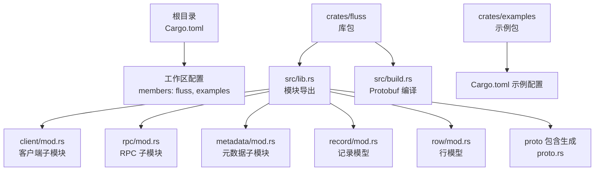
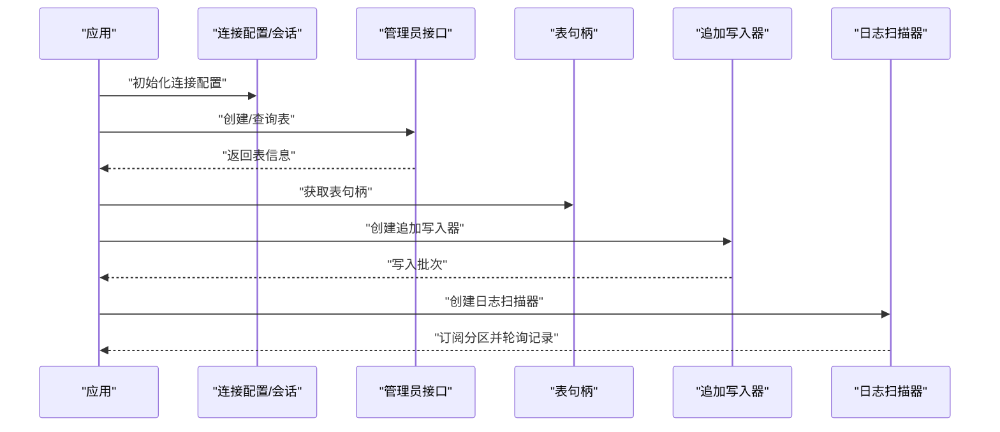
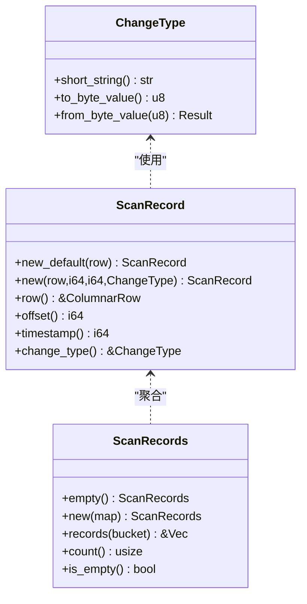
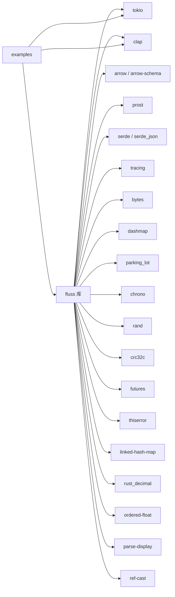

# 开发指南

<cite>
**本文引用的文件**
- [Cargo.toml](file://Cargo.toml)
- [rust-toolchain.toml](file://rust-toolchain.toml)
- [rustfmt.toml](file://rustfmt.toml)
- [README.md](file://README.md)
- [crates/fluss/Cargo.toml](file://crates/fluss/Cargo.toml)
- [crates/fluss/src/lib.rs](file://crates/fluss/src/lib.rs)
- [crates/fluss/src/build.rs](file://crates/fluss/src/build.rs)
- [crates/fluss/src/config.rs](file://crates/fluss/src/config.rs)
- [crates/fluss/src/error.rs](file://crates/fluss/src/error.rs)
- [crates/fluss/src/client/mod.rs](file://crates/fluss/src/client/mod.rs)
- [crates/fluss/src/rpc/mod.rs](file://crates/fluss/src/rpc/mod.rs)
- [crates/fluss/src/metadata/mod.rs](file://crates/fluss/src/metadata/mod.rs)
- [crates/fluss/src/record/mod.rs](file://crates/fluss/src/record/mod.rs)
- [crates/fluss/src/row/mod.rs](file://crates/fluss/src/row/mod.rs)
- [crates/examples/Cargo.toml](file://crates/examples/Cargo.toml)
</cite>

## 目录
1. [简介](#简介)
2. [项目结构](#项目结构)
3. [核心组件](#核心组件)
4. [架构总览](#架构总览)
5. [详细组件分析](#详细组件分析)
6. [依赖关系分析](#依赖关系分析)
7. [性能考虑](#性能考虑)
8. [故障排查指南](#故障排查指南)
9. [结论](#结论)
10. [附录](#附录)

## 简介
本开发指南面向参与 Fluss Rust 客户端（非官方实验性实现）的开发者，覆盖从开发环境搭建到代码规范、构建与测试、调试与性能分析、贡献流程以及发布与版本管理的全流程。项目采用 Rust 语言与 Cargo 工作区组织，提供示例程序与集成测试特性开关，支持基于 Protobuf 的 RPC 协议生成与 Arrow 列存数据模型。

## 项目结构
仓库采用 Cargo 工作区组织，顶层定义工作区元数据与成员包，核心库位于 crates/fluss，示例位于 crates/examples。顶层 Cargo.toml 指定工作区解析器、成员包与共享依赖；rust-toolchain.toml 固定工具链通道与启用 rustfmt/clippy；rustfmt.toml 统一格式化策略。

图表来源
- [Cargo.toml](file://Cargo.toml#L29-L35)
- [crates/fluss/Cargo.toml](file://crates/fluss/Cargo.toml#L18-L47)
- [crates/fluss/src/lib.rs](file://crates/fluss/src/lib.rs#L18-L37)
- [crates/fluss/src/build.rs](file://crates/fluss/src/build.rs#L20-L23)
- [crates/examples/Cargo.toml](file://crates/examples/Cargo.toml#L18-L34)

章节来源
- [Cargo.toml](file://Cargo.toml#L18-L35)
- [crates/fluss/Cargo.toml](file://crates/fluss/Cargo.toml#L18-L47)
- [crates/fluss/src/lib.rs](file://crates/fluss/src/lib.rs#L18-L37)
- [crates/fluss/src/build.rs](file://crates/fluss/src/build.rs#L20-L23)
- [crates/examples/Cargo.toml](file://crates/examples/Cargo.toml#L18-L34)

## 核心组件
- 库入口与模块组织：库入口导出 client、metadata、record、row、rpc 等模块，并通过 proto 包含生成 Protobuf 运行时类型。
- 配置与错误：提供基于命令行参数解析的配置结构体与统一的错误类型体系，便于在客户端与 RPC 层进行错误传播与处理。
- 记录与行模型：定义变更类型、扫描记录与批量记录容器，以及通用行接口与具体实现，支撑表写入与扫描场景。
- 元数据与数据类型：提供数据类型与 JSON 序列化/反序列化工具，支撑表模式与元数据交互。
- RPC 与传输：定义 API 键、版本、消息、帧、转换与传输抽象，以及服务端连接与错误类型，支撑与 Fluss 集群的通信。

章节来源
- [crates/fluss/src/lib.rs](file://crates/fluss/src/lib.rs#L18-L37)
- [crates/fluss/src/config.rs](file://crates/fluss/src/config.rs#L21-L39)
- [crates/fluss/src/error.rs](file://crates/fluss/src/error.rs#L23-L50)
- [crates/fluss/src/record/mod.rs](file://crates/fluss/src/record/mod.rs#L28-L174)
- [crates/fluss/src/row/mod.rs](file://crates/fluss/src/row/mod.rs#L26-L148)
- [crates/fluss/src/metadata/mod.rs](file://crates/fluss/src/metadata/mod.rs#L18-L24)
- [crates/fluss/src/rpc/mod.rs](file://crates/fluss/src/rpc/mod.rs#L18-L31)

## 架构总览
下图展示客户端与集群交互的关键路径：应用通过连接配置建立会话，使用管理员接口创建/查询表，随后通过表句柄进行追加写入与日志扫描。

图表来源
- [crates/fluss/src/config.rs](file://crates/fluss/src/config.rs#L21-L39)
- [crates/fluss/src/client/mod.rs](file://crates/fluss/src/client/mod.rs#L18-L26)

## 详细组件分析

### 配置与命令行参数
- 使用命令行参数派生的解析器生成 CLI 结构，支持引导服务器地址、请求最大尺寸、写入确认策略、重试次数与批大小等参数。
- 参数默认值与序列化控制确保配置在不同运行环境下具备可预期行为。

章节来源
- [crates/fluss/src/config.rs](file://crates/fluss/src/config.rs#L21-L39)

### 错误类型体系
- 统一的错误类型封装 IO、RPC、Arrow、JSON 序列化、写入与非法参数等错误类别，便于上层捕获与处理。
- 通过类型别名简化调用方的错误处理签名。

章节来源
- [crates/fluss/src/error.rs](file://crates/fluss/src/error.rs#L23-L50)

### 记录与扫描模型
- 变更类型枚举用于标识插入、更新前后、删除等语义，支持短字符串与字节编码。
- 扫描记录包含行、偏移、时间戳与变更类型；批量扫描结果按桶聚合，支持计数与迭代。

图表来源
- [crates/fluss/src/record/mod.rs](file://crates/fluss/src/record/mod.rs#L28-L174)

章节来源
- [crates/fluss/src/record/mod.rs](file://crates/fluss/src/record/mod.rs#L28-L174)

### 行模型与通用接口
- 内部行接口定义了对布尔、字节、短整型、整型、长整型、浮点、双精度、字符串、二进制等类型的访问方法。
- 通用行实现通过 Datum 存储字段值，提供字段设置能力，便于动态构造行数据。

章节来源
- [crates/fluss/src/row/mod.rs](file://crates/fluss/src/row/mod.rs#L26-L148)

### 元数据与数据类型
- 元数据模块导出数据类型与 JSON 序列化工具，支撑表模式定义与序列化交互。
- 与记录/行模型配合，完成从表结构到运行时数据的映射。

章节来源
- [crates/fluss/src/metadata/mod.rs](file://crates/fluss/src/metadata/mod.rs#L18-L24)

### RPC 子系统
- 定义 API 键、版本、消息、帧、转换、传输与服务端连接等抽象，提供错误类型与消息派发。
- 为客户端与集群之间的协议交互提供基础能力。

章节来源
- [crates/fluss/src/rpc/mod.rs](file://crates/fluss/src/rpc/mod.rs#L18-L31)

### Protobuf 生成与协议
- 构建脚本在编译期调用 Protobuf 编译器，将协议文件生成为运行时可用的类型。
- 库入口通过 include! 引入生成的 proto.rs，供上层使用。

章节来源
- [crates/fluss/src/build.rs](file://crates/fluss/src/build.rs#L20-L23)
- [crates/fluss/src/lib.rs](file://crates/fluss/src/lib.rs#L35-L37)

## 依赖关系分析
- 工作区统一版本与工具链：顶层 Cargo.toml 与 rust-toolchain.toml 确保所有成员包使用一致的 Rust 版本与工具链组件。
- 依赖集中管理：工作区依赖统一声明，成员包通过 workspace 引用，避免版本漂移。
- 运行时与生态：Tokio 提供异步运行时，Clap 支持命令行解析，Arrow 生态用于列式数据处理，Prost 用于 Protobuf 编解码。

图表来源
- [Cargo.toml](file://Cargo.toml#L33-L35)
- [crates/fluss/Cargo.toml](file://crates/fluss/Cargo.toml#L25-L47)
- [crates/examples/Cargo.toml](file://crates/examples/Cargo.toml#L26-L29)

章节来源
- [Cargo.toml](file://Cargo.toml#L29-L35)
- [crates/fluss/Cargo.toml](file://crates/fluss/Cargo.toml#L25-L47)
- [crates/examples/Cargo.toml](file://crates/examples/Cargo.toml#L26-L29)

## 性能考虑
- 异步运行时：基于 Tokio 的异步模型适合高并发网络 I/O 与批处理场景，建议合理设置任务调度与资源限制。
- 列式数据：利用 Arrow 生态进行高效的数据序列化与反序列化，减少拷贝与装箱开销。
- 批量写入：通过配置批大小与确认策略平衡吞吐与一致性，结合重试机制提升稳定性。
- 日志与追踪：使用 Tracing 追踪关键路径，定位热点与瓶颈；在生产环境谨慎开启高粒度日志。
- Protobuf 编译：在 CI 中缓存生成产物，避免重复编译；在本地开发中仅在协议变更时触发生成。

## 故障排查指南
- 常见错误分类：IO、RPC、Arrow、JSON 序列化、写入与非法参数错误，建议在调用链路中逐层捕获并记录上下文。
- 配置校验：优先检查连接参数（如引导服务器地址）、请求大小上限、写入确认策略与批大小是否符合预期。
- 协议与版本：确认客户端与集群的 API 版本兼容性，避免因版本不匹配导致的协议错误。
- 资源与超时：关注网络超时、背压与内存占用，必要时调整批大小与重试策略。
- 日志与追踪：在关键路径添加 span 与事件，结合采样策略定位问题。

章节来源
- [crates/fluss/src/error.rs](file://crates/fluss/src/error.rs#L25-L50)
- [crates/fluss/src/config.rs](file://crates/fluss/src/config.rs#L21-L39)

## 结论
本指南提供了从环境搭建到开发实践的完整路径。通过工作区统一管理、清晰的模块划分与完善的错误与配置体系，开发者可以快速上手并稳定扩展功能。建议在开发过程中持续遵循格式化与静态分析规则，结合日志与追踪工具进行性能优化与问题定位。

## 附录

### 开发环境搭建
- 安装 Rust 工具链：使用 rust-toolchain.toml 指定通道与组件（rustfmt、clippy），确保团队工具链一致。
- IDE 配置：推荐使用支持 Rust 的编辑器（如 VS Code + rust-analyzer），启用 clippy 与 rustfmt 集成。
- 依赖管理：通过 Cargo 工作区集中管理依赖版本，避免直接在成员包内重复声明相同依赖。

章节来源
- [rust-toolchain.toml](file://rust-toolchain.toml#L18-L19)
- [Cargo.toml](file://Cargo.toml#L33-L35)

### 构建系统与编译选项
- 工作区配置：顶层 Cargo.toml 定义工作区解析器与成员包，确保跨包依赖解析正确。
- 成员包配置：库包与示例包分别声明依赖与示例目标，示例包通过 workspace 引用核心库。
- Protobuf 生成：构建脚本在编译期生成运行时类型，库入口通过 include! 引入生成文件。

章节来源
- [Cargo.toml](file://Cargo.toml#L29-L35)
- [crates/fluss/Cargo.toml](file://crates/fluss/Cargo.toml#L18-L23)
- [crates/fluss/src/build.rs](file://crates/fluss/src/build.rs#L20-L23)
- [crates/fluss/src/lib.rs](file://crates/fluss/src/lib.rs#L35-L37)
- [crates/examples/Cargo.toml](file://crates/examples/Cargo.toml#L32-L34)

### 代码规范与风格指南
- 格式化：使用 rustfmt.toml 统一格式化策略（如导入排序、edition），在 CI 与本地均执行格式化检查。
- 静态分析：启用 clippy 规则，关注未使用的变量、可优化的表达式与潜在的错误模式。
- 注释与文档：为公共 API 添加清晰的文档注释，说明用途、参数与返回值；对复杂逻辑补充注释说明。

章节来源
- [rustfmt.toml](file://rustfmt.toml#L18-L19)
- [rust-toolchain.toml](file://rust-toolchain.toml#L18-L19)

### 贡献流程
- 分支管理：建议采用功能分支或修复分支，主分支保持稳定；重要变更通过 Pull Request 合并。
- 提交规范：提交信息应简洁明确，描述变更内容与动机；大型变更建议先创建议题讨论。
- Pull Request：PR 描述需包含变更摘要、影响范围与测试验证；至少一次审查通过后合并。
- 测试：新增功能配套单元测试与集成测试；集成测试通过 features 标记区分。

章节来源
- [crates/fluss/Cargo.toml](file://crates/fluss/Cargo.toml#L50-L51)

### 调试技巧与工具
- 日志配置：使用 Tracing 在关键路径打点，结合采样策略降低开销；在开发环境开启更详细的 span。
- 性能分析：使用火焰图或采样分析定位热点；关注批处理大小与并发度对吞吐的影响。
- 内存检查：在需要时使用内存分析工具检测泄漏与异常增长；关注 Arrow 数据结构的生命周期管理。

### 发布流程与版本管理
- 版本策略：遵循语义化版本管理，大版本用于破坏性变更，小版本用于新功能，补丁版本用于修复。
- 工作区版本：顶层与成员包版本保持一致，避免版本不一致导致的依赖冲突。
- 发布准备：在发布前更新变更日志、完善文档与示例；在 CI 中执行全量测试与格式化检查。

章节来源
- [Cargo.toml](file://Cargo.toml#L18-L26)
- [crates/fluss/Cargo.toml](file://crates/fluss/Cargo.toml#L19-L22)

### 快速开始与示例运行
- 启动集群：参考 README 中的集群启动步骤，确保 Java 环境满足要求并设置 JAVA_HOME。
- 运行示例：在项目根目录构建示例并运行，观察表创建、写入与扫描的完整流程。

章节来源
- [README.md](file://README.md#L35-L64)