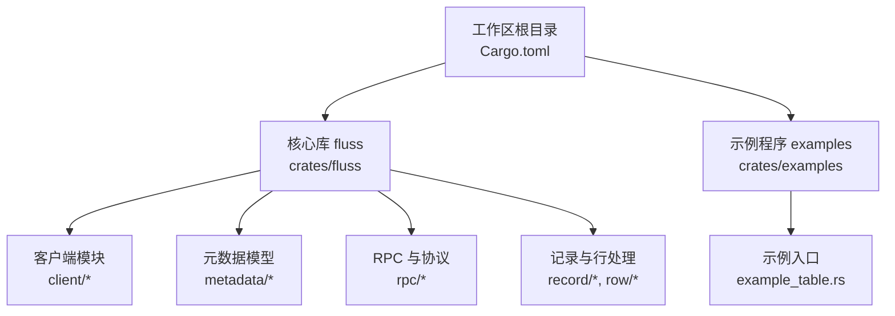
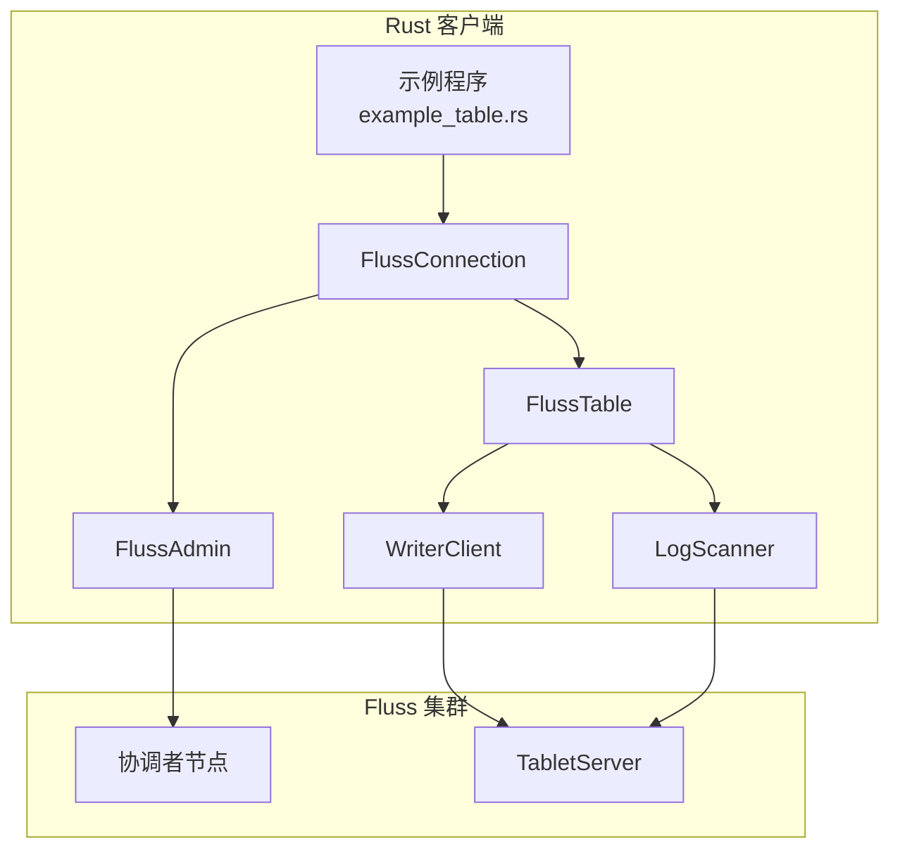
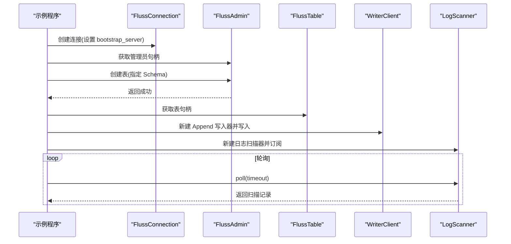
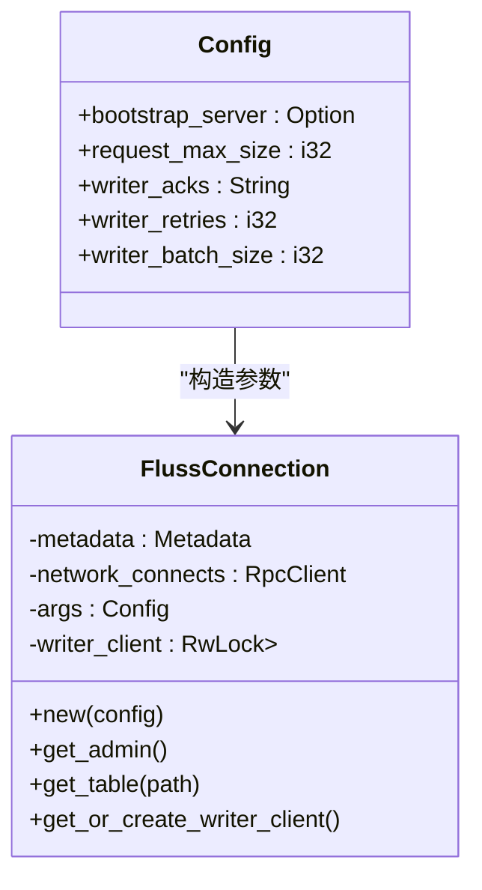
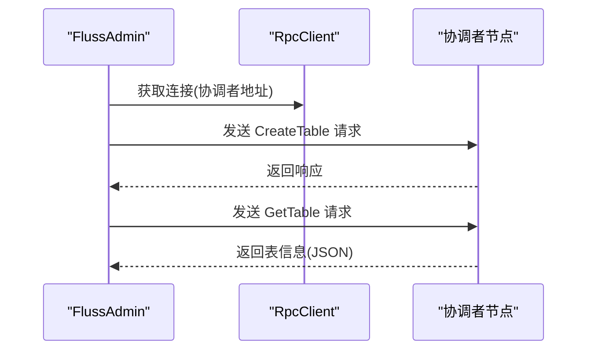
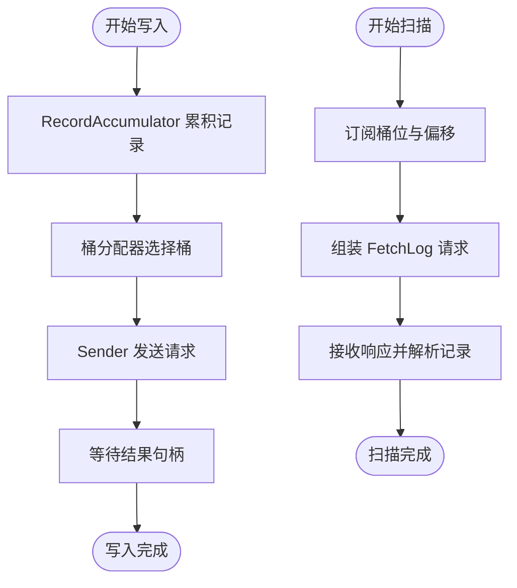
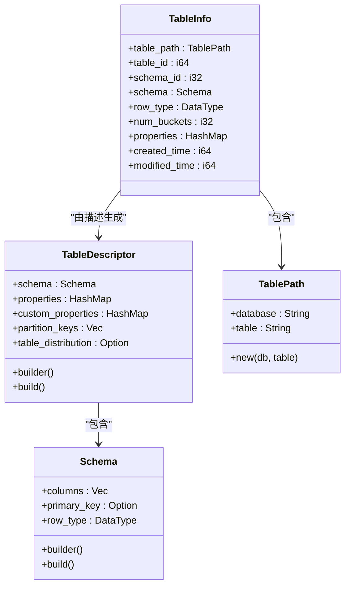

# 快速开始

<cite>
**本文引用的文件**
- [README.md](file://README.md)
- [Cargo.toml](file://Cargo.toml)
- [rust-toolchain.toml](file://rust-toolchain.toml)
- [crates/examples/Cargo.toml](file://crates/examples/Cargo.toml)
- [crates/fluss/Cargo.toml](file://crates/fluss/Cargo.toml)
- [crates/examples/src/example_table.rs](file://crates/examples/src/example_table.rs)
- [crates/fluss/src/lib.rs](file://crates/fluss/src/lib.rs)
- [crates/fluss/src/config.rs](file://crates/fluss/src/config.rs)
- [crates/fluss/src/client/mod.rs](file://crates/fluss/src/client/mod.rs)
- [crates/fluss/src/client/connection.rs](file://crates/fluss/src/client/connection.rs)
- [crates/fluss/src/client/admin.rs](file://crates/fluss/src/client/admin.rs)
- [crates/fluss/src/client/table/mod.rs](file://crates/fluss/src/client/table/mod.rs)
- [crates/fluss/src/client/table/writer.rs](file://crates/fluss/src/client/table/writer.rs)
- [crates/fluss/src/client/table/scanner.rs](file://crates/fluss/src/client/table/scanner.rs)
- [crates/fluss/src/client/write/writer_client.rs](file://crates/fluss/src/client/write/writer_client.rs)
- [crates/fluss/src/metadata/table.rs](file://crates/fluss/src/metadata/table.rs)
</cite>

## 目录
1. [简介](#简介)
2. [项目结构](#项目结构)
3. [核心组件](#核心组件)
4. [架构总览](#架构总览)
5. [详细组件分析](#详细组件分析)
6. [依赖关系分析](#依赖关系分析)
7. [性能注意事项](#性能注意事项)
8. [故障排除指南](#故障排除指南)
9. [结论](#结论)
10. [附录](#附录)

## 简介
本指南面向首次使用 Fluss Rust 客户端的开发者，帮助你在约 15 分钟内完成环境准备、Fluss 集群本地部署与 Rust 客户端示例运行。你将学到：
- 环境要求：Java 17+、Rust 工具链版本与工具链配置
- Fluss 集群安装与启动：下载、解压、启动本地集群
- Rust 客户端构建与运行：编译示例、连接集群、创建表、写入数据、扫描记录
- 每一步骤的作用与关键配置项
- 常见问题排查与故障排除

## 项目结构
该仓库采用多 crate 的工作区组织方式，核心模块位于 crates/fluss，示例位于 crates/examples。顶层 Cargo.toml 定义了工作区与共享依赖，rust-toolchain.toml 指定 Rust 工具链通道与组件。

图表来源
- [Cargo.toml](file://Cargo.toml#L29-L36)
- [crates/fluss/Cargo.toml](file://crates/fluss/Cargo.toml#L18-L26)
- [crates/examples/Cargo.toml](file://crates/examples/Cargo.toml#L18-L34)

章节来源
- [Cargo.toml](file://Cargo.toml#L29-L36)
- [crates/fluss/Cargo.toml](file://crates/fluss/Cargo.toml#L18-L26)
- [crates/examples/Cargo.toml](file://crates/examples/Cargo.toml#L18-L34)

## 核心组件
- 连接与会话管理：FlussConnection 负责建立与集群的连接、维护元数据、提供管理员与表操作句柄。
- 管理接口：FlussAdmin 提供创建表、查询表等管理能力。
- 表操作：FlussTable 封装写入与扫描接口，内部通过 WriterClient 发送写入请求，通过 LogScanner 订阅并拉取日志。
- 写入客户端：WriterClient 负责批量累积、桶分配、发送与结果等待。
- 扫描器：LogScanner 负责订阅桶位偏移、向 TabletServer 发起拉取请求并解析返回记录。
- 元数据模型：Schema、TableDescriptor、TableInfo、TablePath 等用于描述表结构与路径。

章节来源
- [crates/fluss/src/client/connection.rs](file://crates/fluss/src/client/connection.rs#L30-L82)
- [crates/fluss/src/client/admin.rs](file://crates/fluss/src/client/admin.rs#L28-L93)
- [crates/fluss/src/client/table/mod.rs](file://crates/fluss/src/client/table/mod.rs#L33-L66)
- [crates/fluss/src/client/write/writer_client.rs](file://crates/fluss/src/client/write/writer_client.rs#L32-L147)
- [crates/fluss/src/client/table/scanner.rs](file://crates/fluss/src/client/table/scanner.rs#L38-L108)
- [crates/fluss/src/metadata/table.rs](file://crates/fluss/src/metadata/table.rs#L94-L144)

## 架构总览
下图展示了从示例程序到 Fluss 集群的关键交互路径：示例通过 FlussConnection 获取管理员与表句柄，写入由 WriterClient 管理，扫描由 LogScanner 管理。

图表来源
- [crates/examples/src/example_table.rs](file://crates/examples/src/example_table.rs#L27-L86)
- [crates/fluss/src/client/connection.rs](file://crates/fluss/src/client/connection.rs#L37-L82)
- [crates/fluss/src/client/admin.rs](file://crates/fluss/src/client/admin.rs#L34-L50)
- [crates/fluss/src/client/table/mod.rs](file://crates/fluss/src/client/table/mod.rs#L56-L66)
- [crates/fluss/src/client/write/writer_client.rs](file://crates/fluss/src/client/write/writer_client.rs#L89-L123)
- [crates/fluss/src/client/table/scanner.rs](file://crates/fluss/src/client/table/scanner.rs#L135-L173)

## 详细组件分析

### 示例程序：example_table.rs
示例程序展示了完整的生命周期：连接集群、创建表、写入数据、订阅并轮询扫描记录。你可以直接运行该示例验证环境是否正确。

图表来源
- [crates/examples/src/example_table.rs](file://crates/examples/src/example_table.rs#L27-L86)
- [crates/fluss/src/client/connection.rs](file://crates/fluss/src/client/connection.rs#L62-L81)
- [crates/fluss/src/client/admin.rs](file://crates/fluss/src/client/admin.rs#L52-L67)
- [crates/fluss/src/client/table/mod.rs](file://crates/fluss/src/client/table/mod.rs#L56-L66)
- [crates/fluss/src/client/table/writer.rs](file://crates/fluss/src/client/table/writer.rs#L76-L88)
- [crates/fluss/src/client/table/scanner.rs](file://crates/fluss/src/client/table/scanner.rs#L91-L107)

章节来源
- [crates/examples/src/example_table.rs](file://crates/examples/src/example_table.rs#L27-L86)

### 连接与配置：Config 与 FlussConnection
- Config 提供 bootstrap_server、请求大小、ack 策略、重试次数、批大小等参数。
- FlussConnection 负责初始化元数据、获取管理员与表句柄，并按需创建 WriterClient。

图表来源
- [crates/fluss/src/config.rs](file://crates/fluss/src/config.rs#L21-L39)
- [crates/fluss/src/client/connection.rs](file://crates/fluss/src/client/connection.rs#L30-L82)

章节来源
- [crates/fluss/src/config.rs](file://crates/fluss/src/config.rs#L21-L39)
- [crates/fluss/src/client/connection.rs](file://crates/fluss/src/client/connection.rs#L37-L82)

### 管理接口：FlussAdmin
- 通过协调者节点建立管理连接，支持创建表与查询表信息。
- 查询表时反序列化 JSON 描述生成 TableInfo。

图表来源
- [crates/fluss/src/client/admin.rs](file://crates/fluss/src/client/admin.rs#L34-L93)

章节来源
- [crates/fluss/src/client/admin.rs](file://crates/fluss/src/client/admin.rs#L34-L93)

### 表操作：FlussTable、WriterClient、LogScanner
- FlussTable 提供 new_append/new_scan 接口，内部委托 WriterClient 与 LogScanner。
- WriterClient 负责记录累积、桶分配、发送与结果等待。
- LogScanner 负责订阅桶位、组装拉取请求、从 TabletServer 拉取并解析记录。

图表来源
- [crates/fluss/src/client/table/mod.rs](file://crates/fluss/src/client/table/mod.rs#L56-L66)
- [crates/fluss/src/client/write/writer_client.rs](file://crates/fluss/src/client/write/writer_client.rs#L89-L123)
- [crates/fluss/src/client/table/scanner.rs](file://crates/fluss/src/client/table/scanner.rs#L135-L173)

章节来源
- [crates/fluss/src/client/table/mod.rs](file://crates/fluss/src/client/table/mod.rs#L56-L66)
- [crates/fluss/src/client/write/writer_client.rs](file://crates/fluss/src/client/write/writer_client.rs#L89-L123)
- [crates/fluss/src/client/table/scanner.rs](file://crates/fluss/src/client/table/scanner.rs#L135-L173)

### 元数据模型：Schema、TableDescriptor、TableInfo、TablePath
- Schema 定义列与主键；TableDescriptor 描述表属性与分布；TableInfo 为服务端返回的完整表信息；TablePath 为数据库与表名组合。
- 示例中通过 Schema.builder().column(...) 构建表结构。

图表来源
- [crates/fluss/src/metadata/table.rs](file://crates/fluss/src/metadata/table.rs#L94-L144)
- [crates/fluss/src/metadata/table.rs](file://crates/fluss/src/metadata/table.rs#L287-L374)
- [crates/fluss/src/metadata/table.rs](file://crates/fluss/src/metadata/table.rs#L634-L661)
- [crates/fluss/src/metadata/table.rs](file://crates/fluss/src/metadata/table.rs#L603-L632)

章节来源
- [crates/fluss/src/metadata/table.rs](file://crates/fluss/src/metadata/table.rs#L94-L144)
- [crates/fluss/src/metadata/table.rs](file://crates/fluss/src/metadata/table.rs#L287-L374)
- [crates/fluss/src/metadata/table.rs](file://crates/fluss/src/metadata/table.rs#L603-L632)

## 依赖关系分析
- 工作区统一依赖 tokio、clap 等；fluss crate 依赖 arrow、prost、tokio、parking_lot 等。
- 示例程序依赖 fluss crate 与 tokio。

图表来源
- [Cargo.toml](file://Cargo.toml#L33-L36)
- [crates/fluss/Cargo.toml](file://crates/fluss/Cargo.toml#L25-L47)
- [crates/examples/Cargo.toml](file://crates/examples/Cargo.toml#L26-L29)

章节来源
- [Cargo.toml](file://Cargo.toml#L33-L36)
- [crates/fluss/Cargo.toml](file://crates/fluss/Cargo.toml#L25-L47)
- [crates/examples/Cargo.toml](file://crates/examples/Cargo.toml#L26-L29)

## 性能注意事项
- 写入批大小与请求上限：可通过 writer_batch_size 与 request_max_size 调整，以平衡吞吐与延迟。
- ACK 策略：writer_acks 支持 "all" 或数字，影响写入确认策略与可靠性。
- 重试次数：writer_retries 控制网络或临时错误的重试行为。
- 扫描等待时间：扫描器默认最大等待时间与最小字节限制可影响拉取效率与延迟。

章节来源
- [crates/fluss/src/config.rs](file://crates/fluss/src/config.rs#L28-L38)
- [crates/fluss/src/client/write/writer_client.rs](file://crates/fluss/src/client/write/writer_client.rs#L79-L87)
- [crates/fluss/src/client/table/scanner.rs](file://crates/fluss/src/client/table/scanner.rs#L32-L36)

## 故障排除指南
- 无法连接集群
  - 检查 bootstrap_server 地址与端口是否正确。
  - 确认 Fluss 集群已启动且协调者节点可达。
- 创建表失败
  - 确认表名与数据库名格式正确；检查 Schema 是否包含重复列名或主键约束不合法。
- 写入无响应或延迟高
  - 调整 writer_batch_size、request_max_size、writer_acks 与 writer_retries。
  - 确认 WriterClient 正常运行且未关闭。
- 扫描不到记录
  - 确认已调用 subscribe 并传入正确的桶与偏移。
  - 检查 LogScanner 的 poll 超时设置与集群写入是否完成。
- 环境问题
  - Java 版本必须为 17+，并设置 JAVA_HOME。
  - Rust 工具链版本需满足工作区要求，建议使用 rustup 管理工具链。

章节来源
- [crates/fluss/src/config.rs](file://crates/fluss/src/config.rs#L24-L38)
- [crates/fluss/src/client/admin.rs](file://crates/fluss/src/client/admin.rs#L52-L67)
- [crates/fluss/src/client/table/scanner.rs](file://crates/fluss/src/client/table/scanner.rs#L95-L107)
- [crates/fluss/src/client/write/writer_client.rs](file://crates/fluss/src/client/write/writer_client.rs#L125-L141)
- [README.md](file://README.md#L36-L54)

## 结论
通过本指南，你可以在本地快速完成 Fluss 集群与 Rust 客户端的环境准备，并成功运行示例程序完成“创建表—写入—扫描”的完整流程。如需进一步优化性能或扩展功能，可结合配置参数与客户端 API 进行调整。

## 附录

### 环境要求
- Java 17+，并设置 JAVA_HOME
- Rust 工具链：稳定通道，版本满足工作区要求
- 操作系统：Linux 或 macOS

章节来源
- [README.md](file://README.md#L36-L42)
- [rust-toolchain.toml](file://rust-toolchain.toml#L18-L20)
- [Cargo.toml](file://Cargo.toml#L26-L26)

### Fluss 集群安装步骤
- 下载 Fluss 发行包（与 Java 版本匹配）
- 解压后进入目录
- 启动本地集群

章节来源
- [README.md](file://README.md#L44-L54)

### Rust 客户端构建与运行
- 在项目根目录执行构建与运行命令
- 示例输出路径与运行方式参考示例程序

章节来源
- [README.md](file://README.md#L56-L64)
- [crates/examples/src/example_table.rs](file://crates/examples/src/example_table.rs#L27-L86)

### 关键配置项说明
- bootstrap_server：客户端连接的协调者地址
- request_max_size：单次请求最大字节数
- writer_acks：写入确认策略（"all" 或数字）
- writer_retries：写入重试次数
- writer_batch_size：写入批大小

章节来源
- [crates/fluss/src/config.rs](file://crates/fluss/src/config.rs#L24-L38)