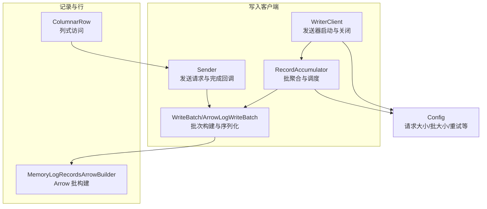
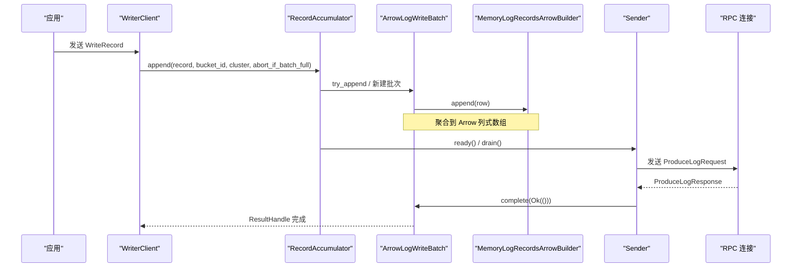
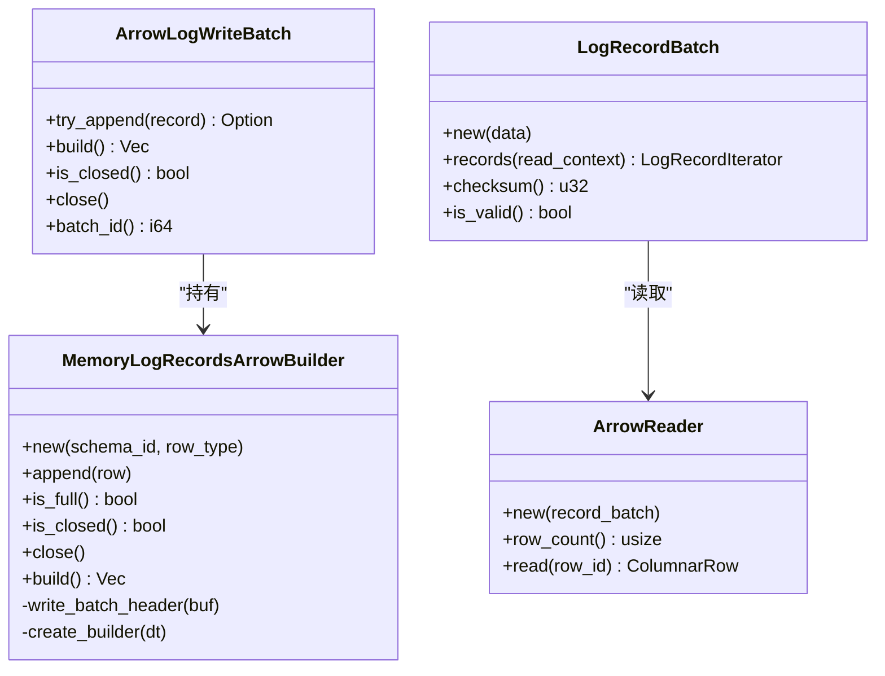
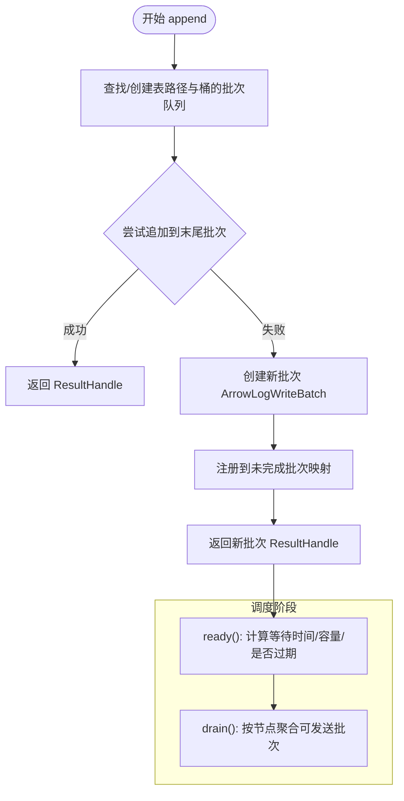
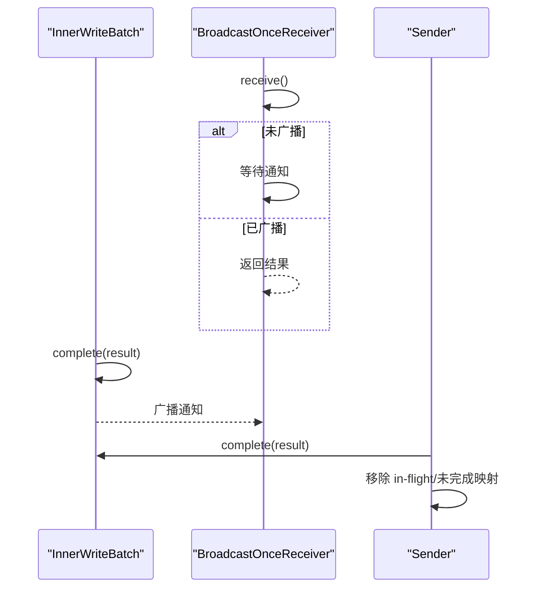
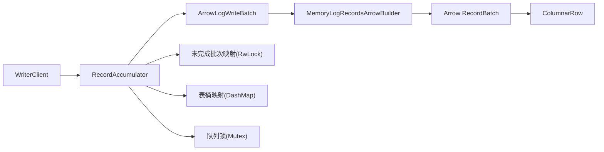

# 内存管理优化

<cite>
**本文引用的文件**
- [lib.rs](file://crates/fluss/src/lib.rs)
- [config.rs](file://crates/fluss/src/config.rs)
- [arrow.rs](file://crates/fluss/src/record/arrow.rs)
- [column.rs](file://crates/fluss/src/row/column.rs)
- [accumulator.rs](file://crates/fluss/src/client/write/accumulator.rs)
- [batch.rs](file://crates/fluss/src/client/write/batch.rs)
- [sender.rs](file://crates/fluss/src/client/write/sender.rs)
- [writer_client.rs](file://crates/fluss/src/client/write/writer_client.rs)
- [broadcast.rs](file://crates/fluss/src/client/write/broadcast.rs)
- [bucket_assigner.rs](file://crates/fluss/src/client/write/bucket_assigner.rs)
- [mod.rs](file://crates/fluss/src/util/mod.rs)
</cite>

## 目录
1. [引言](#引言)
2. [项目结构](#项目结构)
3. [核心组件](#核心组件)
4. [架构总览](#架构总览)
5. [详细组件分析](#详细组件分析)
6. [依赖关系分析](#依赖关系分析)
7. [性能与内存特性](#性能与内存特性)
8. [内存使用监控与分析](#内存使用监控与分析)
9. [生产环境调优与故障排除](#生产环境调优与故障排除)
10. [结论](#结论)

## 引言
本指南聚焦于内存管理优化，结合代码库中实际实现，系统阐述以下主题：
- 缓冲区大小配置与批处理策略
- 内存池与零拷贝思路
- Arrow 格式在内存中的存储与读取路径，以及零拷贝与缓存友好布局
- 并发数据结构选择（DashMap、RwLock、Mutex）及其内存与性能权衡
- 内存泄漏预防：资源生命周期、异步任务清理、循环引用规避
- 内存监控与分析工具使用建议
- 生产环境调优与故障排除

## 项目结构
该仓库采用按功能模块划分的组织方式，与内存管理相关的关键模块如下：
- 记录与 Arrow 序列化：record/arrow.rs
- 行与列式访问：row/column.rs
- 写入客户端与批处理：client/write/*
- 配置参数：config.rs
- 工具与并发容器：util/mod.rs

图表来源
- [writer_client.rs](file://crates/fluss/src/client/write/writer_client.rs#L32-L77)
- [accumulator.rs](file://crates/fluss/src/client/write/accumulator.rs#L35-L61)
- [batch.rs](file://crates/fluss/src/client/write/batch.rs#L67-L128)
- [arrow.rs](file://crates/fluss/src/record/arrow.rs#L92-L230)
- [column.rs](file://crates/fluss/src/row/column.rs#L25-L48)
- [config.rs](file://crates/fluss/src/config.rs#L21-L39)

章节来源
- [lib.rs](file://crates/fluss/src/lib.rs#L18-L37)

## 核心组件
- 写入客户端：负责启动发送协程、分配桶、追加记录、触发批刷新与关闭。
- 批聚合器：按表/桶维护批次队列，基于超时与容量触发发送。
- 批次与 Arrow 构建器：将多条记录聚合成 Arrow RecordBatch，并序列化为字节流。
- 列式行访问：从 Arrow RecordBatch 中按行读取字段，支持多种标量类型。
- 广播通知：用于批次完成后的结果广播与等待。
- 配置：请求最大大小、批大小、ACK 策略、重试次数等。

章节来源
- [writer_client.rs](file://crates/fluss/src/client/write/writer_client.rs#L32-L147)
- [accumulator.rs](file://crates/fluss/src/client/write/accumulator.rs#L35-L373)
- [batch.rs](file://crates/fluss/src/client/write/batch.rs#L67-L176)
- [arrow.rs](file://crates/fluss/src/record/arrow.rs#L92-L544)
- [column.rs](file://crates/fluss/src/row/column.rs#L25-L169)
- [broadcast.rs](file://crates/fluss/src/client/write/broadcast.rs#L34-L119)
- [config.rs](file://crates/fluss/src/config.rs#L21-L39)

## 架构总览
写入流程从 WriterClient 开始，通过 RecordAccumulator 聚合批次，ArrowLogWriteBatch 使用 MemoryLogRecordsArrowBuilder 将多条记录写入 Arrow 列式数组，再序列化为字节流；Sender 汇总节点级批次后发起 RPC 请求，完成后通过广播机制通知 ResultHandle。

图表来源
- [writer_client.rs](file://crates/fluss/src/client/write/writer_client.rs#L89-L123)
- [accumulator.rs](file://crates/fluss/src/client/write/accumulator.rs#L128-L162)
- [batch.rs](file://crates/fluss/src/client/write/batch.rs#L156-L175)
- [arrow.rs](file://crates/fluss/src/record/arrow.rs#L127-L184)
- [sender.rs](file://crates/fluss/src/client/write/sender.rs#L120-L167)
- [broadcast.rs](file://crates/fluss/src/client/write/broadcast.rs#L97-L104)

## 详细组件分析

### Arrow 批构建与内存布局
- MemoryLogRecordsArrowBuilder 维护每个字段对应的 Arrow 数组构建器，使用互斥保护数组构建器集合，追加记录时逐字段写入。
- build 步骤先写入 Arrow Schema 头部，再写入 RecordBatch 数据，最后回填 CRC 与头部长度等元信息。
- 读取路径通过 LogRecordBatch 解析头部与 CRC，结合 ReadContext 提供的 Arrow Schema 元数据，构造 StreamReader 读取 RecordBatch，再由 ArrowReader 提供行级访问。

图表来源
- [arrow.rs](file://crates/fluss/src/record/arrow.rs#L92-L230)
- [batch.rs](file://crates/fluss/src/client/write/batch.rs#L130-L176)
- [column.rs](file://crates/fluss/src/row/column.rs#L25-L53)

章节来源
- [arrow.rs](file://crates/fluss/src/record/arrow.rs#L92-L544)
- [batch.rs](file://crates/fluss/src/client/write/batch.rs#L130-L176)
- [column.rs](file://crates/fluss/src/row/column.rs#L25-L169)

### 批聚合与并发调度
- RecordAccumulator 使用 DashMap 按表路径组织桶级批次队列，使用 RwLock 保护未完成批次映射，使用 Mutex 保护节点遍历索引。
- append 流程尝试向现有批次追加，否则新建批次并插入队列，同时注册 ResultHandle。
- ready/drain 基于批次等待时间、容量状态与是否正在刷新决定可发送节点与批次集合。
- Sender 将批次按目标节点聚合，构造请求并发送，收到响应后完成批次并通过广播通知。

图表来源
- [accumulator.rs](file://crates/fluss/src/client/write/accumulator.rs#L128-L162)
- [accumulator.rs](file://crates/fluss/src/client/write/accumulator.rs#L164-L188)
- [accumulator.rs](file://crates/fluss/src/client/write/accumulator.rs#L244-L333)

章节来源
- [accumulator.rs](file://crates/fluss/src/client/write/accumulator.rs#L35-L373)
- [sender.rs](file://crates/fluss/src/client/write/sender.rs#L63-L106)

### 广播通知与结果传播
- BroadcastOnce 提供一次性广播能力，接收端通过 BroadcastOnceReceiver 等待或轮询，Drop 时若未广播会发出错误信号。
- 写入完成通过 InnerWriteBatch.complete 广播结果，Sender 在收到响应后移除 in-flight 与未完成映射项。

图表来源
- [broadcast.rs](file://crates/fluss/src/client/write/broadcast.rs#L34-L119)
- [sender.rs](file://crates/fluss/src/client/write/sender.rs#L188-L202)

章节来源
- [broadcast.rs](file://crates/fluss/src/client/write/broadcast.rs#L34-L119)
- [sender.rs](file://crates/fluss/src/client/write/sender.rs#L188-L202)

### 配置与批大小
- request_max_size 控制单次请求最大字节数，影响 Sender 的批次聚合上限。
- writer_batch_size 作为批内记录数量阈值（默认值），与 Arrow Builder 的 DEFAULT_MAX_RECORD 协同控制批次大小。
- writer_acks 控制 ACK 策略，影响 Sender 的确认语义。

章节来源
- [config.rs](file://crates/fluss/src/config.rs#L21-L39)
- [arrow.rs](file://crates/fluss/src/record/arrow.rs#L90-L90)
- [writer_client.rs](file://crates/fluss/src/client/write/writer_client.rs#L79-L87)

## 依赖关系分析
- 写入链路：WriterClient -> RecordAccumulator -> ArrowLogWriteBatch -> MemoryLogRecordsArrowBuilder -> Arrow 序列化。
- 读取链路：LogRecordBatch -> ReadContext(元数据) + Arrow 数据 -> StreamReader -> ArrowReader -> ColumnarRow。
- 并发容器：DashMap(全局映射)、RwLock(未完成批次)、Mutex(队列/索引)、parking_lot::Mutex(内部构建器锁)。
- 类型映射：Fluss DataType -> Arrow DataType，确保序列化与反序列化一致性。

图表来源
- [writer_client.rs](file://crates/fluss/src/client/write/writer_client.rs#L32-L77)
- [accumulator.rs](file://crates/fluss/src/client/write/accumulator.rs#L35-L61)
- [batch.rs](file://crates/fluss/src/client/write/batch.rs#L130-L176)
- [arrow.rs](file://crates/fluss/src/record/arrow.rs#L92-L230)
- [column.rs](file://crates/fluss/src/row/column.rs#L25-L48)

章节来源
- [lib.rs](file://crates/fluss/src/lib.rs#L18-L37)
- [util/mod.rs](file://crates/fluss/src/util/mod.rs#L32-L170)

## 性能与内存特性

### 缓冲区大小与批处理策略
- request_max_size：限制单次请求大小，避免单个请求过大导致内存峰值升高与网络拥塞。
- writer_batch_size 与 DEFAULT_MAX_RECORD：控制批内记录数，平衡吞吐与延迟。
- 估算大小：WriteBatch 接口预留了估算大小的占位，可扩展为基于列式数组容量与压缩比的估算。

优化建议
- 根据典型行大小与列数估算单批次内存占用，结合 request_max_size 设置合理批大小。
- 对热点表启用粘性桶分配，减少跨桶切换带来的额外内存与锁竞争。

章节来源
- [config.rs](file://crates/fluss/src/config.rs#L28-L38)
- [arrow.rs](file://crates/fluss/src/record/arrow.rs#L90-L90)
- [batch.rs](file://crates/fluss/src/client/write/batch.rs#L96-L99)

### 内存池与零拷贝思路
- Arrow 列式数组天然具备连续内存布局，适合缓存友好访问；序列化时先写 Schema 再写 RecordBatch，减少重复拷贝。
- 当前实现使用 Vec<u8> 收集 Arrow 序列化输出，再整体复制到最终批次缓冲区；可考虑：
  - 使用可变缓冲区复用（如 BytesMut 或自定义环形缓冲）降低临时分配。
  - 在网络层直接消费 Arrow 流式数据，避免中间 Vec<u8> 的二次拷贝。
- 读取侧通过 Cursor 与流式 Reader 避免一次性加载全部数据，按需解码。

章节来源
- [arrow.rs](file://crates/fluss/src/record/arrow.rs#L150-L184)
- [arrow.rs](file://crates/fluss/src/record/arrow.rs#L373-L399)

### 并发数据结构与内存开销
- DashMap：高并发读写场景下的无锁哈希表，适合全局映射（如表桶到批次队列）。注意键/值的 Arc 包装会增加引用计数开销。
- RwLock：保护未完成批次映射，读多写少场景下可减少写锁争用。
- Mutex：保护队列与节点遍历索引，避免竞态；在热点路径上尽量缩短持锁范围。
- parking_lot::Mutex：内部构建器锁，避免标准库锁的额外开销。

章节来源
- [accumulator.rs](file://crates/fluss/src/client/write/accumulator.rs#L37-L44)
- [broadcast.rs](file://crates/fluss/src/client/write/broadcast.rs#L60-L64)

### 垃圾回收与内存回收器影响
- 大批量 Arrow RecordBatch 与 Vec<u8> 分配可能触发 GC 抖动；建议：
  - 合理设置批大小，避免单次分配过大。
  - 使用对象池或重用缓冲区，减少频繁分配与释放。
  - 控制 ResultHandle 生命周期，避免长时间持有大量未完成批次句柄。

章节来源
- [arrow.rs](file://crates/fluss/src/record/arrow.rs#L150-L184)
- [accumulator.rs](file://crates/fluss/src/client/write/accumulator.rs#L335-L337)

### 内存泄漏预防
- 资源生命周期：WriterClient 在关闭时通过通道通知 Sender 结束运行，并等待任务完成，避免悬挂任务。
- 异步任务清理：Sender.run 循环在停止标志为真时退出；ResultHandle 通过广播一次性通知，避免长期等待。
- 循环引用规避：使用 Arc 包裹共享状态，但确保在合适时机释放；避免在回调中持有外部强引用导致闭包捕获。

章节来源
- [writer_client.rs](file://crates/fluss/src/client/write/writer_client.rs#L125-L141)
- [sender.rs](file://crates/fluss/src/client/write/sender.rs#L204-L207)
- [broadcast.rs](file://crates/fluss/src/client/write/broadcast.rs#L107-L119)

## 内存使用监控与分析
- heap profiling：使用 jemalloc 或 mimalloc 的堆分析工具（如 mallinfo/mstats）观测分配与碎片；在生产环境可通过系统指标采集器导出内存指标。
- 内存 profiler：结合火焰图工具定位热点分配点，重点关注 Arrow 序列化与批次构建阶段。
- 内存泄漏检测：通过长时间运行的内存曲线观察增长趋势；结合弱引用与 Drop 日志验证资源释放。
- 指标建议：请求大小分布、批次大小分布、未完成批次数量、GC 次数与暂停时间、Sender in-flight 数量。

[本节为通用指导，不直接分析具体文件]

## 生产环境调优与故障排除

### 调优要点
- 批大小与请求大小：根据行宽与压缩率调整 writer_batch_size 与 request_max_size，使批次大小稳定在 50%~80% 的请求上限。
- 并发度：合理设置桶数量与 Sender 并发节点数，避免过度竞争导致上下文切换与锁争用。
- 序列化优化：优先使用列式数据与零拷贝流式序列化，减少中间缓冲与复制。

### 故障排除
- 写入阻塞：检查 RecordAccumulator 的未完成批次映射是否异常增长，确认 Sender 是否正常完成批次。
- 响应错误：查看 Sender 的响应处理逻辑，确认错误码与批次完成路径正确。
- 内存飙升：核查批大小是否过大、是否启用对象池、GC 配置是否合理。

章节来源
- [sender.rs](file://crates/fluss/src/client/write/sender.rs#L169-L186)
- [accumulator.rs](file://crates/fluss/src/client/write/accumulator.rs#L335-L372)

## 结论
本指南基于代码库的实际实现，梳理了写入链路中的内存使用模式与优化策略。通过合理的批大小配置、Arrow 列式数据的零拷贝与缓存友好布局、以及 DashMap/RwLock/Mutex 的恰当使用，可以在保证吞吐的同时有效控制内存峰值与 GC 影响。生产环境中建议结合指标与 profiler 持续优化，并建立完善的泄漏检测与故障排查流程。