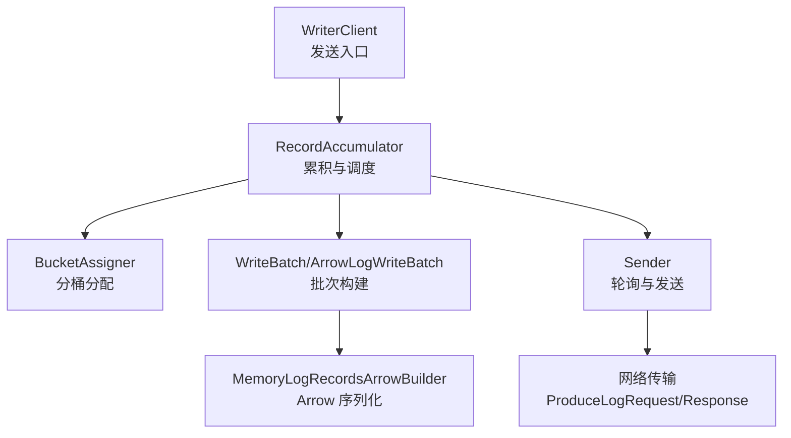
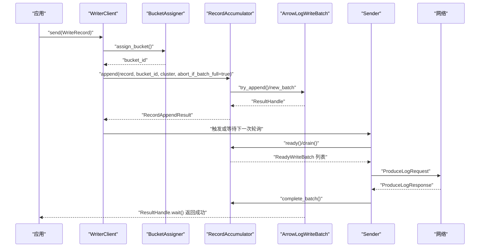
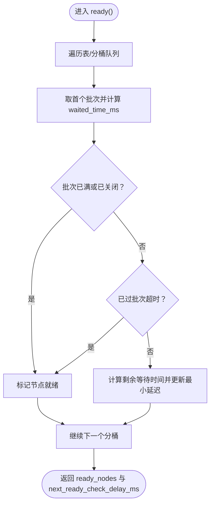
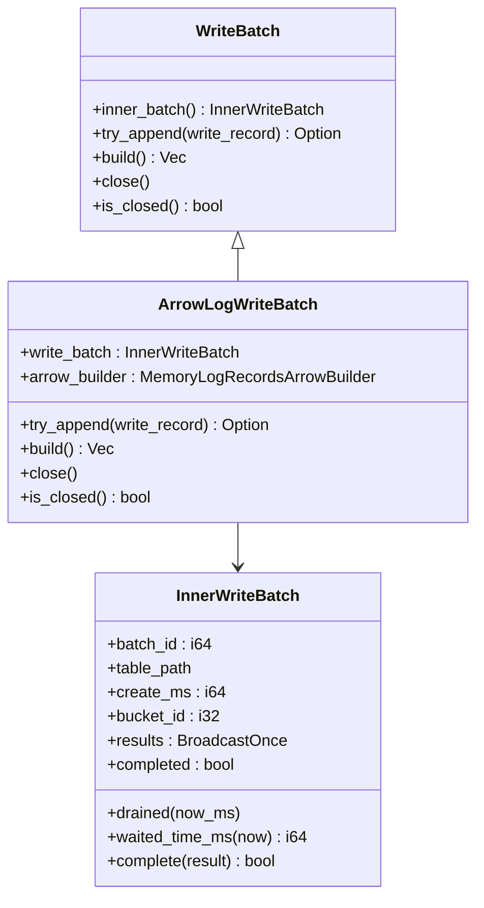
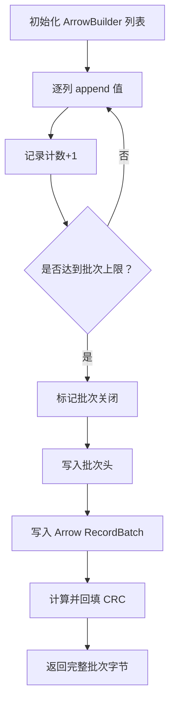
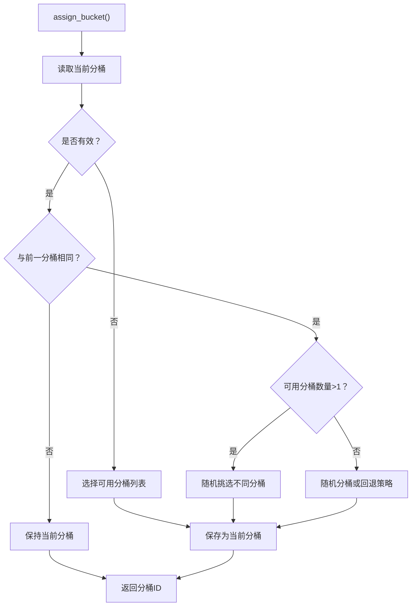
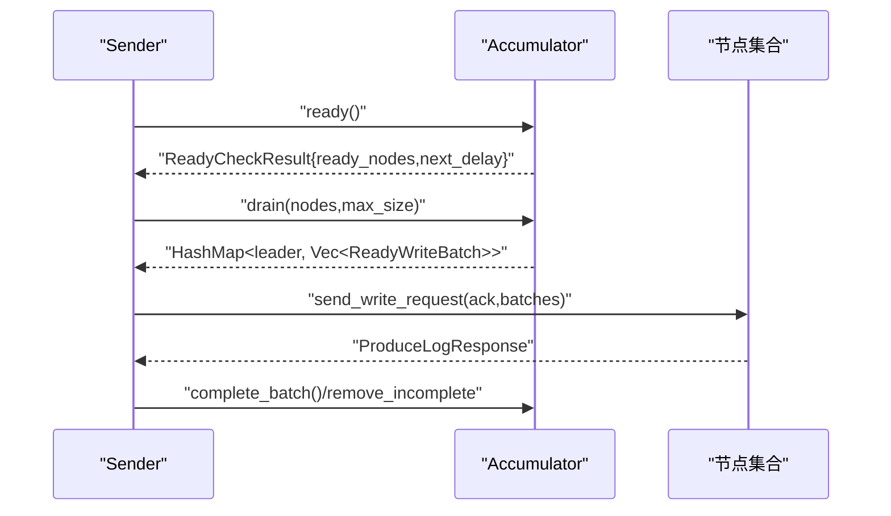
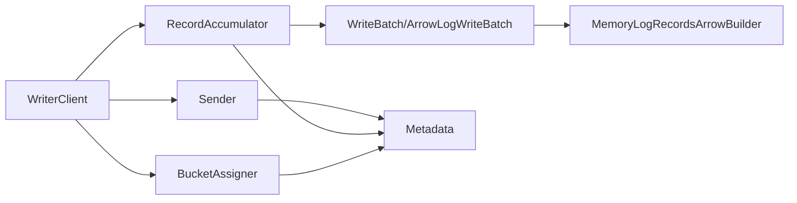

# 写入性能优化

<cite>
**本文引用的文件**
- [crates/fluss/src/client/write/accumulator.rs](file://crates/fluss/src/client/write/accumulator.rs)
- [crates/fluss/src/client/write/batch.rs](file://crates/fluss/src/client/write/batch.rs)
- [crates/fluss/src/client/write/bucket_assigner.rs](file://crates/fluss/src/client/write/bucket_assigner.rs)
- [crates/fluss/src/record/arrow.rs](file://crates/fluss/src/record/arrow.rs)
- [crates/fluss/src/client/write/writer_client.rs](file://crates/fluss/src/client/write/writer_client.rs)
- [crates/fluss/src/client/write/sender.rs](file://crates/fluss/src/client/write/sender.rs)
- [crates/fluss/src/config.rs](file://crates/fluss/src/config.rs)
- [crates/fluss/src/client/write/broadcast.rs](file://crates/fluss/src/client/write/broadcast.rs)
- [crates/fluss/tests/test_fluss.rs](file://crates/fluss/tests/test_fluss.rs)
- [crates/fluss/tests/integration/client/mod.rs](file://crates/fluss/tests/integration/client/mod.rs)
</cite>

## 目录
1. [引言](#引言)
2. [项目结构](#项目结构)
3. [核心组件](#核心组件)
4. [架构总览](#架构总览)
5. [详细组件分析](#详细组件分析)
6. [依赖关系分析](#依赖关系分析)
7. [性能考量与优化策略](#性能考量与优化策略)
8. [故障排查指南](#故障排查指南)
9. [结论](#结论)
10. [附录：性能测试与基准测试](#附录性能测试与基准测试)

## 引言
本指南聚焦于 Fluss 客户端写入路径的性能优化，围绕 RecordAccumulator 批处理机制、Arrow 格式的写入优势与使用技巧、分桶分配器的负载均衡策略与性能影响，以及写入缓冲区大小、批次超时、内存压力处理等关键参数进行系统化梳理，并给出吞吐量优化最佳实践与可操作的性能测试方法。

## 项目结构
写入路径由客户端侧 WriterClient 驱动，通过 RecordAccumulator 累积批次，再由 Sender 轮询准备好的节点并发送请求；数据以 Arrow 格式序列化后打包进批次头中传输。

图表来源
- [crates/fluss/src/client/write/writer_client.rs](file://crates/fluss/src/client/write/writer_client.rs#L89-L123)
- [crates/fluss/src/client/write/accumulator.rs](file://crates/fluss/src/client/write/accumulator.rs#L128-L162)
- [crates/fluss/src/client/write/batch.rs](file://crates/fluss/src/client/write/batch.rs#L67-L128)
- [crates/fluss/src/record/arrow.rs](file://crates/fluss/src/record/arrow.rs#L150-L185)
- [crates/fluss/src/client/write/sender.rs](file://crates/fluss/src/client/write/sender.rs#L63-L106)

章节来源
- [crates/fluss/src/client/write/mod.rs](file://crates/fluss/src/client/write/mod.rs#L18-L34)
- [crates/fluss/src/client/write/writer_client.rs](file://crates/fluss/src/client/write/writer_client.rs#L42-L77)

## 核心组件
- RecordAccumulator：负责按表与分桶累积 WriteBatch，维护批次超时、就绪节点检查、跨节点分发与内存进度跟踪。
- WriteBatch/ArrowLogWriteBatch：封装批次元数据与 ArrowBuilder，支持追加记录、关闭与序列化。
- MemoryLogRecordsArrowBuilder：基于 Arrow 的列式构建器，生成带批次头的二进制日志。
- BucketAssigner/StickyBucketAssigner：分桶分配策略，支持粘性分配与新批次切换。
- Sender：周期性检查就绪节点、从 Accumulator 拖出批次并发送到目标节点。
- WriterClient：对外发送接口，协调分桶分配、累积与结果等待。

章节来源
- [crates/fluss/src/client/write/accumulator.rs](file://crates/fluss/src/client/write/accumulator.rs#L35-L46)
- [crates/fluss/src/client/write/batch.rs](file://crates/fluss/src/client/write/batch.rs#L67-L133)
- [crates/fluss/src/record/arrow.rs](file://crates/fluss/src/record/arrow.rs#L92-L125)
- [crates/fluss/src/client/write/bucket_assigner.rs](file://crates/fluss/src/client/write/bucket_assigner.rs#L31-L102)
- [crates/fluss/src/client/write/sender.rs](file://crates/fluss/src/client/write/sender.rs#L31-L40)
- [crates/fluss/src/client/write/writer_client.rs](file://crates/fluss/src/client/write/writer_client.rs#L32-L40)

## 架构总览
写入流程的关键时序如下：

图表来源
- [crates/fluss/src/client/write/writer_client.rs](file://crates/fluss/src/client/write/writer_client.rs#L89-L123)
- [crates/fluss/src/client/write/accumulator.rs](file://crates/fluss/src/client/write/accumulator.rs#L128-L162)
- [crates/fluss/src/client/write/batch.rs](file://crates/fluss/src/client/write/batch.rs#L156-L176)
- [crates/fluss/src/client/write/sender.rs](file://crates/fluss/src/client/write/sender.rs#L132-L167)

## 详细组件分析

### RecordAccumulator 批处理与调度
- 批次累积与关闭
  - 优先尝试向当前队尾批次追加；若满则新建批次并插入队列，同时注册未完成批次以便 flush 等待。
  - 新建批次时分配自增 batch_id，并将 ResultHandle 存入 incomplete_batches 映射。
- 就绪检查与超时
  - ready() 遍历所有表/分桶，计算首个批次的等待时间 waited_time_ms，结合 batch_timeout_ms 决定是否就绪。
  - 若批次已满、已过期、或处于 flush 中，立即标记就绪；否则返回下次检查延迟。
- 跨节点分发与顺序遍历
  - drain() 按节点聚合桶，使用 nodes_drain_index 实现轮询式遍历，避免饥饿；累计字节不超过 max_size。
- 并发与状态
  - 使用 DashMap 与 Mutex 保护不同表/分桶的批次队列；使用原子计数跟踪 flush 进行中状态。

图表来源
- [crates/fluss/src/client/write/accumulator.rs](file://crates/fluss/src/client/write/accumulator.rs#L164-L188)
- [crates/fluss/src/client/write/accumulator.rs](file://crates/fluss/src/client/write/accumulator.rs#L190-L242)

章节来源
- [crates/fluss/src/client/write/accumulator.rs](file://crates/fluss/src/client/write/accumulator.rs#L48-L126)
- [crates/fluss/src/client/write/accumulator.rs](file://crates/fluss/src/client/write/accumulator.rs#L164-L242)
- [crates/fluss/src/client/write/accumulator.rs](file://crates/fluss/src/client/write/accumulator.rs#L244-L333)

### WriteBatch 与 ArrowLogWriteBatch
- WriteBatch 是枚举包装，统一暴露 try_append/build/close 等能力。
- ArrowLogWriteBatch 基于 MemoryLogRecordsArrowBuilder 追加记录，内部记录计数达到阈值（默认上限）即视为“满”，随后 try_append 返回 None，促使上层新建批次。
- build() 将 Arrow RecordBatch 写入流并拼接批次头，计算 CRC 后输出完整二进制。

图表来源
- [crates/fluss/src/client/write/batch.rs](file://crates/fluss/src/client/write/batch.rs#L67-L128)
- [crates/fluss/src/client/write/batch.rs](file://crates/fluss/src/client/write/batch.rs#L130-L176)
- [crates/fluss/src/client/write/batch.rs](file://crates/fluss/src/client/write/batch.rs#L28-L65)

章节来源
- [crates/fluss/src/client/write/batch.rs](file://crates/fluss/src/client/write/batch.rs#L67-L176)

### MemoryLogRecordsArrowBuilder（Arrow 写入）
- 列式构建：根据表模式动态创建对应 Arrow 数组构建器，逐列 append，减少行式遍历成本。
- 批次头与校验：先写入批次头，再写入 Arrow 流内容，最后回填 CRC 字段。
- 关闭与容量：通过记录计数判断是否“满”，用于驱动上层新建批次。

图表来源
- [crates/fluss/src/record/arrow.rs](file://crates/fluss/src/record/arrow.rs#L104-L148)
- [crates/fluss/src/record/arrow.rs](file://crates/fluss/src/record/arrow.rs#L150-L185)
- [crates/fluss/src/record/arrow.rs](file://crates/fluss/src/record/arrow.rs#L187-L211)

章节来源
- [crates/fluss/src/record/arrow.rs](file://crates/fluss/src/record/arrow.rs#L92-L230)

### 分桶分配器与负载均衡
- StickyBucketAssigner：采用“粘性”策略，首次随机选择一个可用分桶后长期复用；当发生“新建批次”场景时，会触发 on_new_batch 重新选择，避免热点持续集中在同一分桶。
- 分配逻辑：优先使用上次分桶；若与前一分桶相同且有多个可用分桶，则随机挑选不同分桶；无可用分桶时退化为随机分桶。
- 性能影响：粘性降低跨分桶写入抖动，提升缓存命中与网络局部性；但需配合“新建批次”切换避免单点过热。

图表来源
- [crates/fluss/src/client/write/bucket_assigner.rs](file://crates/fluss/src/client/write/bucket_assigner.rs#L31-L102)

章节来源
- [crates/fluss/src/client/write/bucket_assigner.rs](file://crates/fluss/src/client/write/bucket_assigner.rs#L23-L102)

### Sender 发送循环与请求聚合
- 轮询周期：run_once() 中调用 accumulator.ready() 获取就绪节点与下次检查延迟；若无就绪节点则按最小延迟 sleep。
- 请求聚合：drain() 返回按 leader 聚合的 ReadyWriteBatch 列表，按表/分桶组织请求体，发送 ProduceLogRequest。
- 结果完成：收到响应后 complete_batch() 标记批次完成并清理 in-flight/incomplete 映射。

图表来源
- [crates/fluss/src/client/write/sender.rs](file://crates/fluss/src/client/write/sender.rs#L63-L106)
- [crates/fluss/src/client/write/sender.rs](file://crates/fluss/src/client/write/sender.rs#L120-L167)
- [crates/fluss/src/client/write/sender.rs](file://crates/fluss/src/client/write/sender.rs#L169-L202)

章节来源
- [crates/fluss/src/client/write/sender.rs](file://crates/fluss/src/client/write/sender.rs#L31-L207)

## 依赖关系分析
- WriterClient 依赖 BucketAssigner、RecordAccumulator、Sender 与 Metadata；负责对外 send 接口与生命周期管理。
- RecordAccumulator 依赖 Cluster/Metadata 提供表/分桶/Leader 信息，内部使用 DashMap 与 Mutex 保证并发安全。
- WriteBatch/ArrowLogWriteBatch 依赖 MemoryLogRecordsArrowBuilder 与广播机制 BroadcastOnce，实现单播结果通知。
- Sender 依赖 Metadata 获取连接与集群信息，按 leader 聚合请求并处理响应。

图表来源
- [crates/fluss/src/client/write/writer_client.rs](file://crates/fluss/src/client/write/writer_client.rs#L32-L40)
- [crates/fluss/src/client/write/accumulator.rs](file://crates/fluss/src/client/write/accumulator.rs#L35-L46)
- [crates/fluss/src/client/write/batch.rs](file://crates/fluss/src/client/write/batch.rs#L67-L128)
- [crates/fluss/src/record/arrow.rs](file://crates/fluss/src/record/arrow.rs#L92-L125)
- [crates/fluss/src/client/write/sender.rs](file://crates/fluss/src/client/write/sender.rs#L31-L40)

章节来源
- [crates/fluss/src/client/write/writer_client.rs](file://crates/fluss/src/client/write/writer_client.rs#L18-L29)
- [crates/fluss/src/client/write/accumulator.rs](file://crates/fluss/src/client/write/accumulator.rs#L18-L32)
- [crates/fluss/src/client/write/batch.rs](file://crates/fluss/src/client/write/batch.rs#L18-L26)
- [crates/fluss/src/record/arrow.rs](file://crates/fluss/src/record/arrow.rs#L18-L36)
- [crates/fluss/src/client/write/sender.rs](file://crates/fluss/src/client/write/sender.rs#L18-L28)

## 性能考量与优化策略

### 批次大小与内存使用优化
- 批次上限与 Arrow 记录数
  - ArrowLogWriteBatch 在记录数达到默认上限时视为“满”，促使上层新建批次，避免单批次过大导致延迟与内存压力。
- 写入缓冲区大小
  - request_max_size 控制单次请求最大字节数，Sender 在 drain() 中按此上限聚合批次，防止单请求过大。
- 内存压力处理
  - RecordAccumulator 维护 incomplete_batches 映射与 flush_in_progress 原子计数，flush() 期间阻塞新写入或等待完成，避免内存暴涨。
  - BroadcastOnce 仅广播一次结果，避免重复持有结果句柄造成内存占用。

章节来源
- [crates/fluss/src/record/arrow.rs](file://crates/fluss/src/record/arrow.rs#L138-L140)
- [crates/fluss/src/client/write/batch.rs](file://crates/fluss/src/client/write/batch.rs#L156-L176)
- [crates/fluss/src/client/write/accumulator.rs](file://crates/fluss/src/client/write/accumulator.rs#L335-L372)
- [crates/fluss/src/client/write/broadcast.rs](file://crates/fluss/src/client/write/broadcast.rs#L67-L105)

### 并发写入控制
- 分桶粘性与切换
  - StickyBucketAssigner 通过粘性策略降低抖动；当出现“新建批次”时切换分桶，避免热点集中。
- 多表/多分桶并发
  - RecordAccumulator 使用 DashMap 与 Mutex 保护不同表/分桶队列，支持高并发写入；Sender 按 leader 聚合请求，避免过度竞争。
- 结果等待与背压
  - ResultHandle.wait() 提供异步等待；WriterClient.send() 在必要时触发“新建批次”并重试，形成自然背压。

章节来源
- [crates/fluss/src/client/write/bucket_assigner.rs](file://crates/fluss/src/client/write/bucket_assigner.rs#L85-L102)
- [crates/fluss/src/client/write/accumulator.rs](file://crates/fluss/src/client/write/accumulator.rs#L128-L162)
- [crates/fluss/src/client/write/writer_client.rs](file://crates/fluss/src/client/write/writer_client.rs#L89-L123)

### Arrow 格式的优势与使用技巧
- 列式存储与序列化
  - MemoryLogRecordsArrowBuilder 按列构建，减少行式遍历开销；最终以 Arrow IPCStreamWriter 输出，具备高效压缩与解析能力。
- 批次头与 CRC
  - 写入批次头后追加 Arrow 数据，再回填 CRC，确保完整性与快速校验。
- 类型映射与扩展
  - to_arrow_type 支持常见标量类型映射；新增类型时可在相应分支扩展，保持与表模式一致。

章节来源
- [crates/fluss/src/record/arrow.rs](file://crates/fluss/src/record/arrow.rs#L150-L185)
- [crates/fluss/src/record/arrow.rs](file://crates/fluss/src/record/arrow.rs#L425-L447)

### 批次超时与调度策略
- 批次超时
  - RecordAccumulator 默认 batch_timeout_ms=500ms；ready() 中比较 waited_time_ms 与超时决定是否强制发送。
- 下次检查延迟
  - 当未过期时，返回剩余等待时间的最小值，避免频繁轮询。
- Sender 轮询
  - run_once() 根据 ReadyCheckResult.next_ready_check_delay_ms 休眠，平衡 CPU 占用与延迟。

章节来源
- [crates/fluss/src/client/write/accumulator.rs](file://crates/fluss/src/client/write/accumulator.rs#L54-L55)
- [crates/fluss/src/client/write/accumulator.rs](file://crates/fluss/src/client/write/accumulator.rs#L230-L239)
- [crates/fluss/src/client/write/sender.rs](file://crates/fluss/src/client/write/sender.rs#L83-L89)

### 写入吞吐量优化最佳实践
- 批次大小选择
  - 基于 request_max_size 与 ArrowBuilder 记录上限综合评估；在不触发单请求过大前提下尽量增大批次，提高吞吐。
- 并发度调优
  - WriterClient.send() 可并发调用；Sender 通过 ready()/drain() 自适应聚合，无需额外线程池。
- 内存管理策略
  - 合理设置 writer_batch_size 与 request_max_size；在高并发场景下启用 flush() 进行阶段性回收。
- 负载均衡
  - 使用 StickyBucketAssigner 并配合“新建批次”切换，避免热点分桶；在分桶数量充足时获得更好均衡。

章节来源
- [crates/fluss/src/config.rs](file://crates/fluss/src/config.rs#L28-L39)
- [crates/fluss/src/client/write/writer_client.rs](file://crates/fluss/src/client/write/writer_client.rs#L137-L141)
- [crates/fluss/src/client/write/bucket_assigner.rs](file://crates/fluss/src/client/write/bucket_assigner.rs#L85-L102)

## 故障排查指南
- 无就绪节点
  - Sender 在 ready_nodes 为空时按 next_ready_check_delay_ms 休眠；检查 batch_timeout_ms 设置与数据到达速率。
- 未知 Leader 表
  - ReadyCheckResult.unknown_leader_tables 为空时需更新元数据；Sender 在下一轮 ready() 中自动触发更新。
- 发送失败
  - handle_produce_response() 对错误码进行处理；当前实现为占位，建议补充具体错误处理与重试策略。
- 结果未返回
  - BroadcastOnce 在 Drop 时广播 Dropped 错误；确认 ResultHandle.wait() 是否被正确等待，避免提前释放。

章节来源
- [crates/fluss/src/client/write/sender.rs](file://crates/fluss/src/client/write/sender.rs#L76-L81)
- [crates/fluss/src/client/write/sender.rs](file://crates/fluss/src/client/write/sender.rs#L169-L186)
- [crates/fluss/src/client/write/broadcast.rs](file://crates/fluss/src/client/write/broadcast.rs#L107-L119)

## 结论
通过合理配置批次大小、请求上限与批次超时，结合 Arrow 列式序列化与粘性分桶分配策略，可在高并发写入场景下显著提升吞吐与稳定性。Sender 的自适应聚合与 Accumulator 的就绪调度进一步降低了 CPU 开销与延迟波动。建议在生产环境按业务数据特征进行参数微调，并配合 flush 与监控指标进行持续优化。

## 附录：性能测试与基准测试
- 集成测试入口
  - 仓库提供集成测试模块与测试入口，可用于验证写入链路与基本行为。
- 建议的测试方法
  - 基准场景：固定批次大小、并发度与数据分布，测量 P50/P95/P99 延迟与吞吐；逐步调整 writer_batch_size、request_max_size、batch_timeout_ms 观察影响。
  - 负载测试：逐步增加并发写入速率，观察 Sender 聚合效率、Accumulator 内存占用与 flush 行为。
  - 分桶均衡：在多分桶场景下对比粘性与随机分配的延迟与抖动差异。
- 工具与指标
  - 使用 tokio runtime 的任务与 channel 监控；结合日志统计 ReadyCheckResult 与 drain 聚合情况；关注 BroadcastOnce 的等待耗时与 Drop 情况。

章节来源
- [crates/fluss/tests/test_fluss.rs](file://crates/fluss/tests/test_fluss.rs#L18-L25)
- [crates/fluss/tests/integration/client/mod.rs](file://crates/fluss/tests/integration/client/mod.rs#L18-L21)