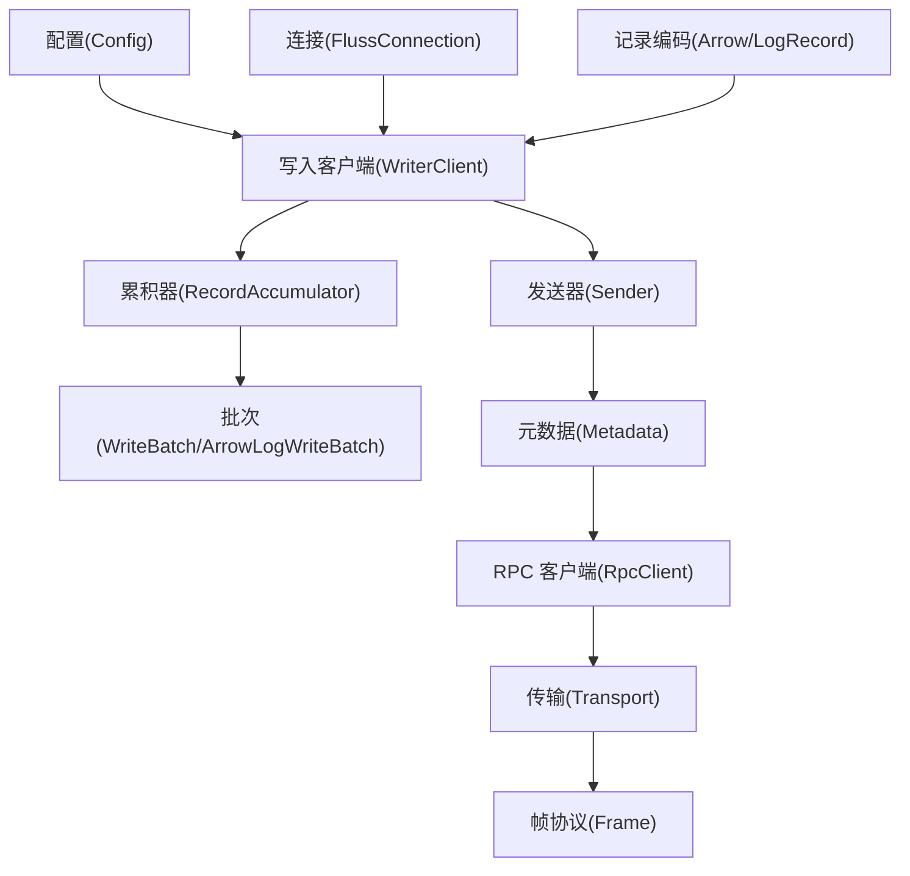
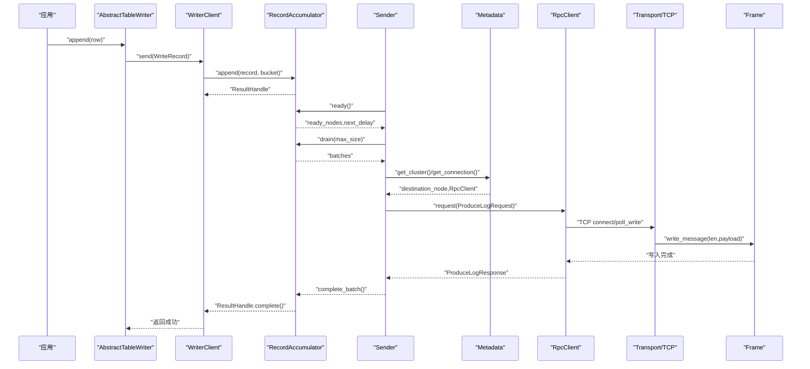
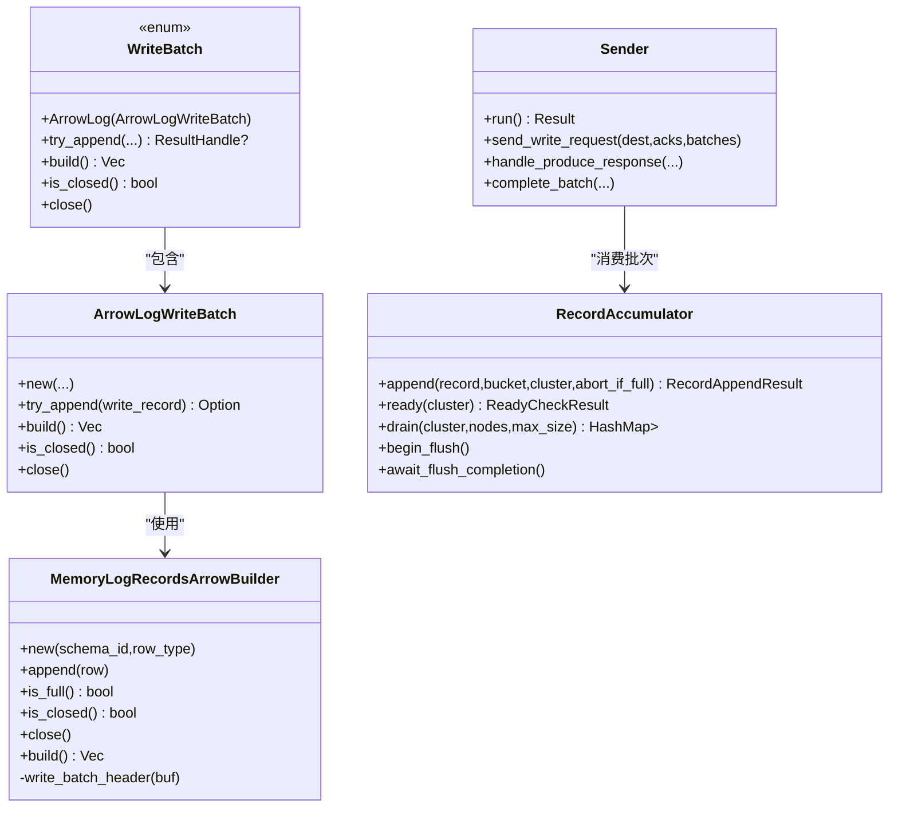
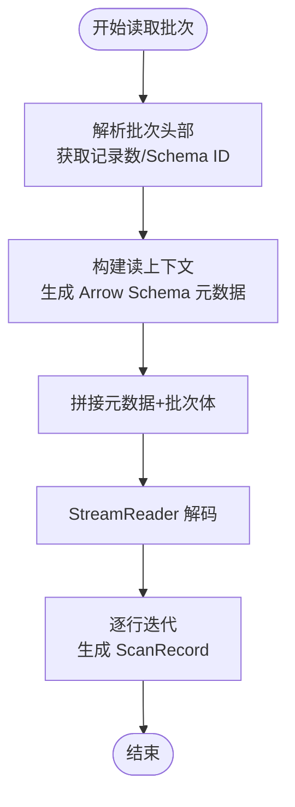
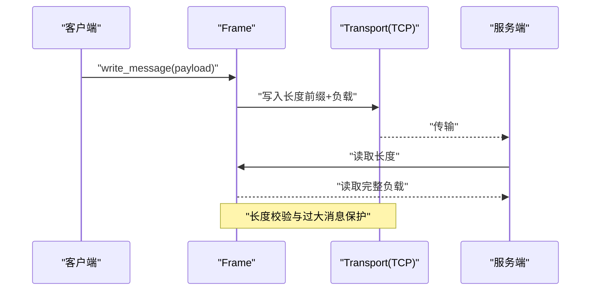
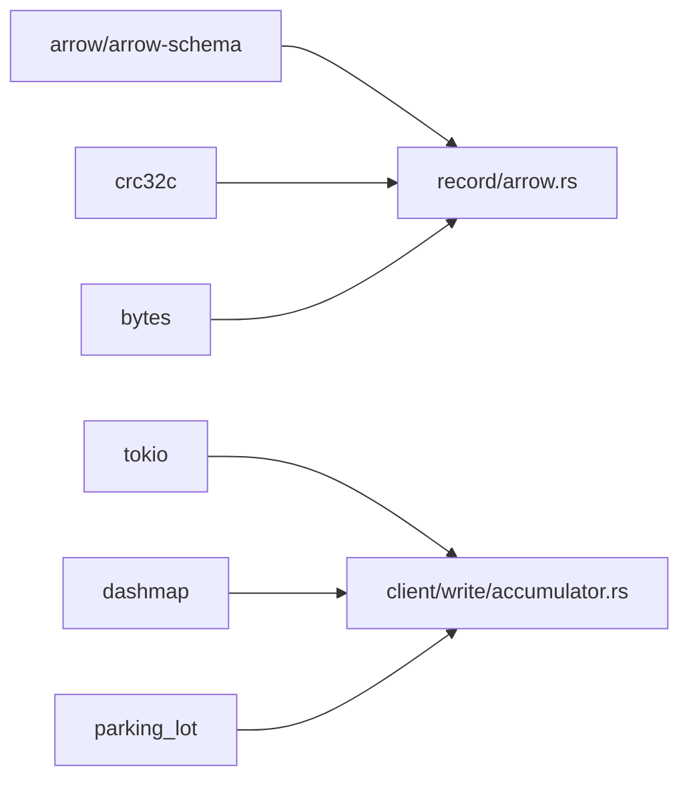

# 性能优化

<cite>
**本文引用的文件**
- [lib.rs](file://crates/fluss/src/lib.rs)
- [Cargo.toml](file://crates/fluss/Cargo.toml)
- [config.rs](file://crates/fluss/src/config.rs)
- [client/mod.rs](file://crates/fluss/src/client/mod.rs)
- [client/write/mod.rs](file://crates/fluss/src/client/write/mod.rs)
- [client/write/batch.rs](file://crates/fluss/src/client/write/batch.rs)
- [client/write/accumulator.rs](file://crates/fluss/src/client/write/accumulator.rs)
- [client/write/sender.rs](file://crates/fluss/src/client/write/sender.rs)
- [client/write/writer_client.rs](file://crates/fluss/src/client/write/writer_client.rs)
- [client/table/writer.rs](file://crates/fluss/src/client/table/writer.rs)
- [client/connection.rs](file://crates/fluss/src/client/connection.rs)
- [rpc/transport.rs](file://crates/fluss/src/rpc/transport.rs)
- [rpc/frame.rs](file://crates/fluss/src/rpc/frame.rs)
- [record/arrow.rs](file://crates/fluss/src/record/arrow.rs)
- [util/mod.rs](file://crates/fluss/src/util/mod.rs)
</cite>

## 目录
1. [简介](#简介)
2. [项目结构](#项目结构)
3. [核心组件](#核心组件)
4. [架构总览](#架构总览)
5. [详细组件分析](#详细组件分析)
6. [依赖关系分析](#依赖关系分析)
7. [性能考量与优化策略](#性能考量与优化策略)
8. [故障排查指南](#故障排查指南)
9. [结论](#结论)
10. [附录](#附录)

## 简介
本指南聚焦于 Fluss 的性能优化，围绕写入路径（批处理大小、内存使用、并发控制）、读取路径（缓存、预取、并行扫描）、Arrow 格式优势与使用技巧、网络层优化（连接复用、压缩、超时）、内存管理最佳实践以及生产环境的基准测试与监控指标进行系统化说明。文档以仓库中实际代码为依据，结合架构图与流程图帮助读者快速定位可调优点。

## 项目结构
Fluss 的性能相关能力主要分布在客户端写入管线、记录编码与 Arrow 支持、RPC 框架与帧协议、以及配置模块中。下图给出与性能密切相关的模块关系概览。

图表来源
- [config.rs](file://crates/fluss/src/config.rs#L21-L39)
- [client/connection.rs](file://crates/fluss/src/client/connection.rs#L30-L82)
- [client/write/writer_client.rs](file://crates/fluss/src/client/write/writer_client.rs#L32-L147)
- [client/write/accumulator.rs](file://crates/fluss/src/client/write/accumulator.rs#L35-L442)
- [client/write/batch.rs](file://crates/fluss/src/client/write/batch.rs#L67-L176)
- [client/write/sender.rs](file://crates/fluss/src/client/write/sender.rs#L31-L207)
- [rpc/transport.rs](file://crates/fluss/src/rpc/transport.rs#L27-L83)
- [rpc/frame.rs](file://crates/fluss/src/rpc/frame.rs#L34-L106)
- [record/arrow.rs](file://crates/fluss/src/record/arrow.rs#L92-L230)

章节来源
- [lib.rs](file://crates/fluss/src/lib.rs#L18-L37)
- [Cargo.toml](file://crates/fluss/Cargo.toml#L25-L47)

## 核心组件
- 配置模块：提供请求最大尺寸、ACK 策略、重试次数、批大小等关键参数。
- 写入客户端：负责记录累积、批次构建、发送与结果回传。
- 累积器：按表/桶聚合待发送批次，支持超时触发与大小聚合。
- 发送器：周期性检查就绪节点，聚合批次并发起 RPC 请求。
- 记录编码：基于 Arrow 的列式序列化与反序列化，支持批量头部与校验。
- RPC 传输与帧协议：统一消息长度前缀，限制单次消息大小，保障内存安全。
- 连接管理：集中管理与服务端的连接，供元数据与写入使用。

章节来源
- [config.rs](file://crates/fluss/src/config.rs#L21-L39)
- [client/write/writer_client.rs](file://crates/fluss/src/client/write/writer_client.rs#L32-L147)
- [client/write/accumulator.rs](file://crates/fluss/src/client/write/accumulator.rs#L35-L442)
- [client/write/sender.rs](file://crates/fluss/src/client/write/sender.rs#L31-L207)
- [record/arrow.rs](file://crates/fluss/src/record/arrow.rs#L92-L230)
- [rpc/frame.rs](file://crates/fluss/src/rpc/frame.rs#L34-L106)
- [client/connection.rs](file://crates/fluss/src/client/connection.rs#L30-L82)

## 架构总览
写入路径的关键时序如下：应用通过表写入器提交记录，写入客户端将记录累积到批次，累积器根据超时或容量触发发送，发送器聚合批次并通过 RPC 发送到目标节点，完成后回调完成状态。

图表来源
- [client/table/writer.rs](file://crates/fluss/src/client/table/writer.rs#L42-L88)
- [client/write/writer_client.rs](file://crates/fluss/src/client/write/writer_client.rs#L89-L123)
- [client/write/accumulator.rs](file://crates/fluss/src/client/write/accumulator.rs#L164-L188)
- [client/write/sender.rs](file://crates/fluss/src/client/write/sender.rs#L63-L106)
- [client/connection.rs](file://crates/fluss/src/client/connection.rs#L30-L82)
- [rpc/transport.rs](file://crates/fluss/src/rpc/transport.rs#L68-L82)
- [rpc/frame.rs](file://crates/fluss/src/rpc/frame.rs#L89-L106)

## 详细组件分析

### 写入路径与批处理优化
- 批次构建与关闭：Arrow 列式构建器在达到上限或显式关闭后生成二进制批次，批次头包含基础偏移、记录数、CRC 等字段，便于后续校验与解析。
- 批次大小与超时：累积器维护批次超时阈值与等待时间，满足“满则发”或“到期发”的策略；发送器按最大请求尺寸聚合批次，避免单次过大导致失败。
- 结果回传：每个批次通过广播通道回传结果，写入客户端在需要时阻塞等待，确保语义正确性。

图表来源
- [record/arrow.rs](file://crates/fluss/src/record/arrow.rs#L92-L230)
- [client/write/batch.rs](file://crates/fluss/src/client/write/batch.rs#L130-L176)
- [client/write/accumulator.rs](file://crates/fluss/src/client/write/accumulator.rs#L128-L162)
- [client/write/sender.rs](file://crates/fluss/src/client/write/sender.rs#L132-L167)

章节来源
- [client/write/batch.rs](file://crates/fluss/src/client/write/batch.rs#L67-L176)
- [client/write/accumulator.rs](file://crates/fluss/src/client/write/accumulator.rs#L48-L126)
- [client/write/sender.rs](file://crates/fluss/src/client/write/sender.rs#L63-L106)
- [record/arrow.rs](file://crates/fluss/src/record/arrow.rs#L150-L185)

### 读取路径与 Arrow 优势
- Arrow 列式存储：批次头部后紧跟 Arrow RecordBatch 流，读取时通过流式解码器逐行读取，减少行式转换开销。
- 元数据复用：读上下文包含 Arrow Schema 的元数据，与批次体组合后可直接构造 Reader，避免重复解析。
- 迭代器设计：提供 Arrow 迭代器封装，按行生成扫描记录，便于上层按需消费。

图表来源
- [record/arrow.rs](file://crates/fluss/src/record/arrow.rs#L236-L400)
- [record/arrow.rs](file://crates/fluss/src/record/arrow.rs#L449-L463)
- [record/arrow.rs](file://crates/fluss/src/record/arrow.rs#L487-L526)

章节来源
- [record/arrow.rs](file://crates/fluss/src/record/arrow.rs#L236-L400)
- [record/arrow.rs](file://crates/fluss/src/record/arrow.rs#L449-L526)

### 网络层与帧协议
- 帧协议：消息以 4 字节长度前缀标识，读取时先读取长度再按长度读取负载，防止粘包与越界；写入时对长度进行范围校验。
- 连接复用：连接由 RpcClient 统一管理，避免频繁建立 TCP 连接带来的握手开销。
- 超时控制：连接建立支持超时参数，避免阻塞；发送器内部有最大请求超时配置，用于 RPC 调用。

图表来源
- [rpc/frame.rs](file://crates/fluss/src/rpc/frame.rs#L34-L106)
- [rpc/transport.rs](file://crates/fluss/src/rpc/transport.rs#L68-L82)

章节来源
- [rpc/frame.rs](file://crates/fluss/src/rpc/frame.rs#L34-L106)
- [rpc/transport.rs](file://crates/fluss/src/rpc/transport.rs#L27-L83)

## 依赖关系分析
- 外部依赖：Arrow 生态用于列式编码与解码；Tokio 提供异步运行时；DashMap、parking_lot 用于并发容器与锁；crc32c 用于校验。
- 模块耦合：写入路径高度内聚，从写入客户端到累积器再到发送器形成清晰流水线；记录编码独立于网络层，便于替换或扩展。

图表来源
- [Cargo.toml](file://crates/fluss/Cargo.toml#L25-L47)
- [record/arrow.rs](file://crates/fluss/src/record/arrow.rs#L18-L41)
- [client/write/accumulator.rs](file://crates/fluss/src/client/write/accumulator.rs#L27-L32)

章节来源
- [Cargo.toml](file://crates/fluss/Cargo.toml#L25-L47)

## 性能考量与优化策略

### 写入性能优化
- 批处理大小调优
  - 关键参数：请求最大尺寸与写入批大小。前者决定单次请求上限，后者决定累积器聚合粒度。
  - 建议：根据典型记录大小估算批大小，使批次接近但不超过请求上限；过小会增加 RPC 次数，过大可能触发压缩后仍超限的风险。
  - 参考路径
    - [config.rs](file://crates/fluss/src/config.rs#L28-L39)
    - [client/write/sender.rs](file://crates/fluss/src/client/write/sender.rs#L91-L98)
    - [client/write/accumulator.rs](file://crates/fluss/src/client/write/accumulator.rs#L305-L312)

- 内存使用优化
  - Arrow 列式构建器按列分配，避免行式复制与临时对象；批次构建完成后释放列构建器持有的缓冲。
  - 建议：合理设置批大小上限，避免一次性创建过大的 RecordBatch；关注批次序列化后的实际字节数，预留 CRC 与头部空间。
  - 参考路径
    - [record/arrow.rs](file://crates/fluss/src/record/arrow.rs#L150-L185)

- 并发控制配置
  - 累积器内部使用并发容器与锁，发送器按节点轮询调度，避免热点桶阻塞。
  - 建议：根据 CPU 核数与网络带宽平衡并发任务数量；通过 ACK 策略与重试次数平衡一致性与吞吐。
  - 参考路径
    - [client/write/accumulator.rs](file://crates/fluss/src/client/write/accumulator.rs#L35-L61)
    - [client/write/sender.rs](file://crates/fluss/src/client/write/sender.rs#L108-L130)
    - [client/write/writer_client.rs](file://crates/fluss/src/client/write/writer_client.rs#L79-L87)

### 读取性能优化
- 缓存策略
  - 建议：在应用层缓存常用表的模式信息与 Arrow Schema，避免重复构建；利用读上下文的元数据复用能力。
  - 参考路径
    - [record/arrow.rs](file://crates/fluss/src/record/arrow.rs#L449-L463)

- 预取机制
  - 建议：在扫描时按批次大小预取，减少多次 RPC 往返；结合 Arrow 流式解码，边解码边消费。
  - 参考路径
    - [record/arrow.rs](file://crates/fluss/src/record/arrow.rs#L367-L399)

- 并行扫描
  - 建议：多表/多分区并行扫描，结合公平调度避免某些桶饥饿；注意下游消费的背压。
  - 参考路径
    - [client/write/accumulator.rs](file://crates/fluss/src/client/write/accumulator.rs#L266-L333)

### Arrow 格式优势与使用技巧
- 优势
  - 列式布局适合向量化计算与 SIMD 加速；零拷贝切片与共享数组减少内存占用。
  - 流式 IPC 支持高效序列化与反序列化，降低 GC 压力。
- 使用技巧
  - 将 Schema 元数据与批次体分离，仅在必要时拼接；复用 Schema 对象，避免重复解析。
  - 在写入端尽量保持列类型稳定，减少动态类型转换成本。
  - 参考路径
    - [record/arrow.rs](file://crates/fluss/src/record/arrow.rs#L150-L185)
    - [record/arrow.rs](file://crates/fluss/src/record/arrow.rs#L402-L447)

### 网络层优化
- 连接复用
  - RpcClient 统一管理连接，减少握手与 TLS 开销；建议长连接池配合心跳与健康检查。
  - 参考路径
    - [client/connection.rs](file://crates/fluss/src/client/connection.rs#L30-L82)

- 压缩算法选择
  - 当前未见内置压缩实现；建议在应用层对批次进行压缩后再发送，或在网络栈启用压缩（如 TLS ALPN），权衡 CPU 与带宽。
  - 参考路径
    - [record/arrow.rs](file://crates/fluss/src/record/arrow.rs#L150-L185)
    - [rpc/frame.rs](file://crates/fluss/src/rpc/frame.rs#L34-L106)

- 超时参数调整
  - 连接超时与 RPC 最大超时共同决定整体延迟与稳定性；建议根据网络 RTT 与业务 SLA 设置。
  - 参考路径
    - [rpc/transport.rs](file://crates/fluss/src/rpc/transport.rs#L68-L82)
    - [client/write/sender.rs](file://crates/fluss/src/client/write/sender.rs#L43-L61)

### 内存管理最佳实践
- 缓冲区大小设置
  - 批次序列化采用一次性分配策略，建议根据最大记录数与字段宽度估算峰值内存；预留头部与 CRC 空间。
  - 参考路径
    - [record/arrow.rs](file://crates/fluss/src/record/arrow.rs#L169-L185)

- 垃圾回收影响
  - Arrow 的 RecordBatch 生命周期应尽量缩短，避免跨作用域持有；在高频写入场景中减少中间字符串与临时对象。
  - 参考路径
    - [record/arrow.rs](file://crates/fluss/src/record/arrow.rs#L528-L544)

- 内存泄漏预防
  - 确保 ResultHandle 的完成回调被消费，避免累积器中的未完成批次导致内存滞留。
  - 参考路径
    - [client/write/accumulator.rs](file://crates/fluss/src/client/write/accumulator.rs#L367-L372)
    - [client/write/sender.rs](file://crates/fluss/src/client/write/sender.rs#L188-L202)

### 基准测试方法与工具
- 写入基准
  - 场景：不同批大小、不同并发度、不同记录大小；对比吞吐、P99 延迟、CPU 占用与 GC 次数。
  - 指标：消息/秒、字节/秒、请求/秒、错误率、堆积时延。
  - 参考路径
    - [config.rs](file://crates/fluss/src/config.rs#L28-L39)
    - [client/write/accumulator.rs](file://crates/fluss/src/client/write/accumulator.rs#L164-L188)

- 读取基准
  - 场景：单表/多表、不同分区数、不同并发扫描；对比扫描速率、内存占用与 CPU。
  - 指标：行/秒、批次/秒、内存峰值、GC 时间占比。
  - 参考路径
    - [record/arrow.rs](file://crates/fluss/src/record/arrow.rs#L367-L399)

- 工具建议
  - 使用火焰图定位热点；使用内存分析工具观察分配热点；使用网络抓包验证帧协议与连接复用效果。

### 生产环境部署建议与监控指标
- 部署建议
  - 合理设置批大小与请求上限，避免压缩后超限；开启连接复用与健康检查；根据业务特性调整 ACK 与重试。
  - 参考路径
    - [client/write/writer_client.rs](file://crates/fluss/src/client/write/writer_client.rs#L48-L55)
    - [client/write/sender.rs](file://crates/fluss/src/client/write/sender.rs#L43-L61)

- 监控指标
  - 写入侧：累积队列长度、批次等待时长、发送速率、错误率、重试次数、连接存活数。
  - 读取侧：扫描速率、批次大小分布、内存峰值、GC 次数与时间。
  - 网络侧：连接建立耗时、帧写入耗时、消息大小分布、丢包/重传。
  - 参考路径
    - [util/mod.rs](file://crates/fluss/src/util/mod.rs#L25-L30)
    - [rpc/frame.rs](file://crates/fluss/src/rpc/frame.rs#L34-L106)

## 故障排查指南
- 批次过大导致失败
  - 现象：发送器拒绝发送或服务端报错。
  - 排查：检查请求上限与批次序列化后大小；适当减小批大小或记录字段宽度。
  - 参考路径
    - [client/write/sender.rs](file://crates/fluss/src/client/write/sender.rs#L91-L98)
    - [record/arrow.rs](file://crates/fluss/src/record/arrow.rs#L150-L185)

- 超时与连接问题
  - 现象：连接超时或 RPC 调用超时。
  - 排查：增大连接与 RPC 超时；检查网络抖动与服务端负载。
  - 参考路径
    - [rpc/transport.rs](file://crates/fluss/src/rpc/transport.rs#L68-L82)
    - [client/write/sender.rs](file://crates/fluss/src/client/write/sender.rs#L43-L61)

- 结果回调未消费
  - 现象：累积器中存在未完成批次，内存持续增长。
  - 排查：确认 ResultHandle 的等待与完成逻辑是否被调用；检查 flush 流程。
  - 参考路径
    - [client/write/accumulator.rs](file://crates/fluss/src/client/write/accumulator.rs#L367-L372)
    - [client/write/sender.rs](file://crates/fluss/src/client/write/sender.rs#L188-L202)

## 结论
通过对写入累积、批次构建、发送调度、Arrow 编解码与网络帧协议的系统化分析，可以有针对性地在批大小、内存分配、并发度、缓存与预取、连接复用与超时等方面进行优化。结合基准测试与监控指标，可在生产环境中持续迭代性能表现。

## 附录
- 关键参数一览
  - 请求最大尺寸：用于限制单次请求大小
  - 写入批大小：影响累积器聚合粒度
  - ACK 策略：平衡一致性与吞吐
  - 重试次数：影响最终一致性与延迟
  - 参考路径
    - [config.rs](file://crates/fluss/src/config.rs#L28-L39)
    - [client/write/writer_client.rs](file://crates/fluss/src/client/write/writer_client.rs#L79-L87)