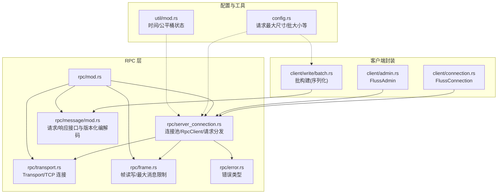
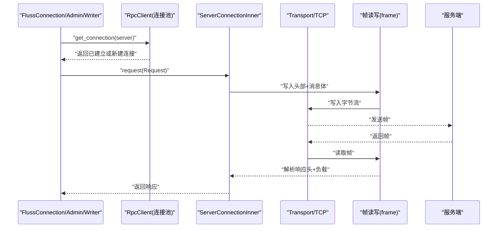
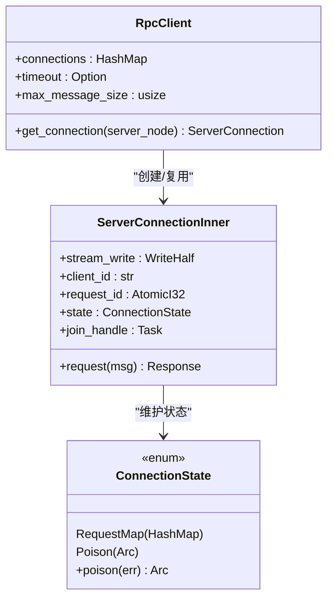
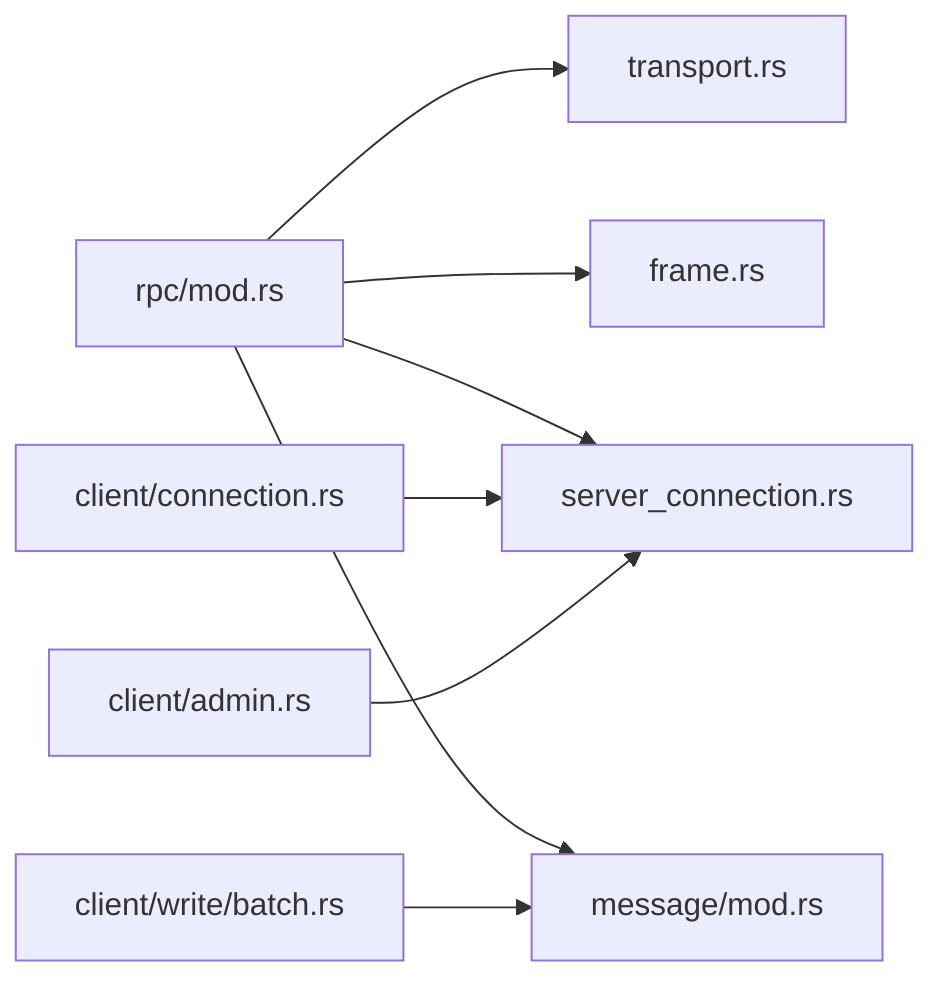
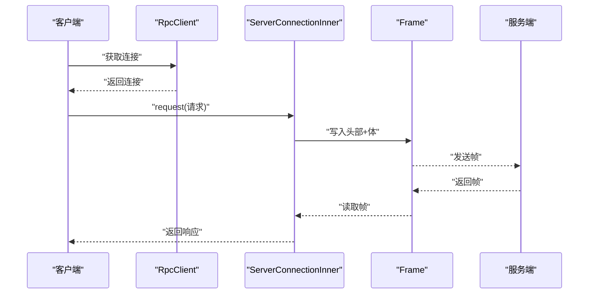

# 网络层优化

<cite>
**本文引用的文件**
- [crates/fluss/src/rpc/transport.rs](file://crates/fluss/src/rpc/transport.rs)
- [crates/fluss/src/rpc/frame.rs](file://crates/fluss/src/rpc/frame.rs)
- [crates/fluss/src/rpc/server_connection.rs](file://crates/fluss/src/rpc/server_connection.rs)
- [crates/fluss/src/rpc/mod.rs](file://crates/fluss/src/rpc/mod.rs)
- [crates/fluss/src/rpc/error.rs](file://crates/fluss/src/rpc/error.rs)
- [crates/fluss/src/rpc/message/mod.rs](file://crates/fluss/src/rpc/message/mod.rs)
- [crates/fluss/src/client/connection.rs](file://crates/fluss/src/client/connection.rs)
- [crates/fluss/src/client/admin.rs](file://crates/fluss/src/client/admin.rs)
- [crates/fluss/src/client/write/batch.rs](file://crates/fluss/src/client/write/batch.rs)
- [crates/fluss/src/config.rs](file://crates/fluss/src/config.rs)
- [crates/fluss/src/util/mod.rs](file://crates/fluss/src/util/mod.rs)
</cite>

## 目录
1. [引言](#引言)
2. [项目结构](#项目结构)
3. [核心组件](#核心组件)
4. [架构总览](#架构总览)
5. [详细组件分析](#详细组件分析)
6. [依赖关系分析](#依赖关系分析)
7. [性能考量与优化建议](#性能考量与优化建议)
8. [故障排除指南](#故障排除指南)
9. [结论](#结论)
10. [附录](#附录)

## 引言
本指南聚焦于网络层优化，结合代码库中的传输、帧协议、连接管理与客户端封装，系统阐述以下主题：
- 连接复用与连接池管理
- TCP 参数调优与超时配置
- 帧处理优化：帧大小、压缩与序列化开销
- 服务器连接管理：健康检查、超时与错误恢复
- 带宽优化：流量控制、拥塞避免与多路复用
- 延迟优化：DNS、TLS、Keep-Alive
- 监控与诊断：日志与错误类型
- 实战案例与排障

## 项目结构
网络相关代码主要集中在 rpc 子模块，围绕传输层抽象、消息帧编解码、客户端连接与请求-响应流程组织；上层通过 FlussConnection 将网络能力暴露给写入器、元数据与管理接口。

图表来源
- [crates/fluss/src/rpc/mod.rs](file://crates/fluss/src/rpc/mod.rs#L18-L32)
- [crates/fluss/src/rpc/transport.rs](file://crates/fluss/src/rpc/transport.rs#L26-L83)
- [crates/fluss/src/rpc/frame.rs](file://crates/fluss/src/rpc/frame.rs#L34-L106)
- [crates/fluss/src/rpc/server_connection.rs](file://crates/fluss/src/rpc/server_connection.rs#L46-L97)
- [crates/fluss/src/rpc/error.rs](file://crates/fluss/src/rpc/error.rs#L23-L50)
- [crates/fluss/src/rpc/message/mod.rs](file://crates/fluss/src/rpc/message/mod.rs#L37-L97)
- [crates/fluss/src/client/connection.rs](file://crates/fluss/src/client/connection.rs#L30-L82)
- [crates/fluss/src/client/admin.rs](file://crates/fluss/src/client/admin.rs#L28-L93)
- [crates/fluss/src/client/write/batch.rs](file://crates/fluss/src/client/write/batch.rs#L130-L177)
- [crates/fluss/src/config.rs](file://crates/fluss/src/config.rs#L21-L39)
- [crates/fluss/src/util/mod.rs](file://crates/fluss/src/util/mod.rs#L25-L30)

章节来源
- [crates/fluss/src/rpc/mod.rs](file://crates/fluss/src/rpc/mod.rs#L18-L32)
- [crates/fluss/src/client/connection.rs](file://crates/fluss/src/client/connection.rs#L30-L82)

## 核心组件
- 传输层抽象 Transport：封装 TCP 连接，支持异步读写与可选超时连接。
- 帧协议 frame：定义消息长度前缀的帧格式，提供读写 trait 与最大消息大小限制，防止内存膨胀。
- 连接管理 server_connection：实现 RpcClient 连接池、请求-响应映射、后台读协程、错误“中毒”传播与清理。
- 错误体系 error：统一 RPC 错误类型，含帧读写、连接、中毒、数据剩余等。
- 消息接口 message：请求体/响应体的版本化编解码接口与宏。
- 客户端封装 client/connection：对外暴露 FlussConnection，聚合网络连接与元数据。
- 写入批构建 client/write/batch：面向写入的批构造与序列化，影响帧大小与吞吐。
- 配置 config：请求最大尺寸、批大小等影响网络性能的关键参数。

章节来源
- [crates/fluss/src/rpc/transport.rs](file://crates/fluss/src/rpc/transport.rs#L26-L83)
- [crates/fluss/src/rpc/frame.rs](file://crates/fluss/src/rpc/frame.rs#L34-L106)
- [crates/fluss/src/rpc/server_connection.rs](file://crates/fluss/src/rpc/server_connection.rs#L46-L97)
- [crates/fluss/src/rpc/error.rs](file://crates/fluss/src/rpc/error.rs#L23-L50)
- [crates/fluss/src/rpc/message/mod.rs](file://crates/fluss/src/rpc/message/mod.rs#L37-L97)
- [crates/fluss/src/client/connection.rs](file://crates/fluss/src/client/connection.rs#L30-L82)
- [crates/fluss/src/client/write/batch.rs](file://crates/fluss/src/client/write/batch.rs#L130-L177)
- [crates/fluss/src/config.rs](file://crates/fluss/src/config.rs#L21-L39)

## 架构总览
下图展示从客户端到服务端的请求-响应路径，以及帧编解码与连接池协作关系。

图表来源
- [crates/fluss/src/client/connection.rs](file://crates/fluss/src/client/connection.rs#L37-L60)
- [crates/fluss/src/rpc/server_connection.rs](file://crates/fluss/src/rpc/server_connection.rs#L64-L96)
- [crates/fluss/src/rpc/server_connection.rs](file://crates/fluss/src/rpc/server_connection.rs#L233-L287)
- [crates/fluss/src/rpc/frame.rs](file://crates/fluss/src/rpc/frame.rs#L93-L106)
- [crates/fluss/src/rpc/transport.rs](file://crates/fluss/src/rpc/transport.rs#L67-L82)

## 详细组件分析

### 传输层 Transport 与 TCP 调优
- 功能要点
  - 支持按超时连接 TCP，避免阻塞。
  - 实现 AsyncRead/AsyncWrite，适配 Tokio 生态。
- 性能影响
  - 超时连接可避免长时间卡在不可达节点。
  - 可在更高层通过 BufStream 提升吞吐（见连接管理）。
- 优化建议
  - 在系统层面调整 TCP 参数（如接收/发送缓冲区、Nagle 关闭、快速重传等），以配合高并发与低延迟场景。
  - 结合 Keep-Alive 与心跳策略，减少空闲连接被中间设备回收。

章节来源
- [crates/fluss/src/rpc/transport.rs](file://crates/fluss/src/rpc/transport.rs#L26-L83)

### 帧协议 frame：大小、压缩与序列化
- 帧格式
  - 固定 4 字节长度前缀 + 负载。
  - 读取时先读长度，再按长度读取完整帧；写入时先写长度后写内容。
- 最大消息限制
  - 读取侧对消息大小进行上限校验，超过阈值会丢弃多余字节并返回错误，防止内存占用异常增长。
- 序列化与压缩
  - 请求体/响应体采用版本化编解码接口，便于演进。
  - 当前帧层未内置压缩逻辑，可在上层消息体中引入压缩（例如在批构建阶段对记录进行压缩）。
- 优化建议
  - 合理设置最大消息大小，平衡内存与吞吐。
  - 批量写入时合并小消息，减少帧数量与开销。
  - 对热点数据启用压缩，注意 CPU 与带宽权衡。

图表来源
- [crates/fluss/src/rpc/frame.rs](file://crates/fluss/src/rpc/frame.rs#L45-L76)

章节来源
- [crates/fluss/src/rpc/frame.rs](file://crates/fluss/src/rpc/frame.rs#L34-L106)
- [crates/fluss/src/rpc/message/mod.rs](file://crates/fluss/src/rpc/message/mod.rs#L37-L97)

### 连接管理：连接池、健康检查、错误恢复
- 连接池
  - RpcClient 维护 server_id 到连接的映射，首次访问时建立连接并缓存。
- 请求-响应模型
  - 每个请求分配自增 request_id，后台读协程根据响应头中的 request_id 匹配回调。
- 错误恢复与“中毒”
  - 任何帧读写失败会触发“中毒”，清空未完成请求并广播错误，后续请求立即失败。
  - 发送采用“取消安全”包装，避免半发送导致帧同步破坏。
- 清理与取消
  - 请求取消时自动清理未发送的请求状态，避免悬挂。
- 健康检查
  - 当前未实现显式健康检查；可通过超时、错误计数与重连策略间接实现。

图表来源
- [crates/fluss/src/rpc/server_connection.rs](file://crates/fluss/src/rpc/server_connection.rs#L46-L97)
- [crates/fluss/src/rpc/server_connection.rs](file://crates/fluss/src/rpc/server_connection.rs#L147-L231)
- [crates/fluss/src/rpc/server_connection.rs](file://crates/fluss/src/rpc/server_connection.rs#L112-L144)

章节来源
- [crates/fluss/src/rpc/server_connection.rs](file://crates/fluss/src/rpc/server_connection.rs#L46-L97)
- [crates/fluss/src/rpc/server_connection.rs](file://crates/fluss/src/rpc/server_connection.rs#L112-L144)
- [crates/fluss/src/rpc/server_connection.rs](file://crates/fluss/src/rpc/server_connection.rs#L163-L312)
- [crates/fluss/src/rpc/server_connection.rs](file://crates/fluss/src/rpc/server_connection.rs#L321-L402)

### 客户端封装与上层集成
- FlussConnection
  - 聚合 RpcClient、Metadata，并提供 WriterClient 的懒加载。
- FlussAdmin
  - 通过 RpcClient 获取到协调者节点的连接，执行管理类请求。
- 写入批构建
  - ArrowLogWriteBatch 负责将记录编码为二进制，影响最终帧大小与网络负载。

章节来源
- [crates/fluss/src/client/connection.rs](file://crates/fluss/src/client/connection.rs#L30-L82)
- [crates/fluss/src/client/admin.rs](file://crates/fluss/src/client/admin.rs#L28-L93)
- [crates/fluss/src/client/write/batch.rs](file://crates/fluss/src/client/write/batch.rs#L130-L177)

## 依赖关系分析
- rpc/mod.rs 汇聚了传输、帧、连接与消息模块，形成清晰的边界。
- server_connection 依赖 transport 与 frame，并通过 BufStream 与 Tokio 任务实现并发读写。
- client/* 通过 RpcClient 使用连接池，向上提供高级 API。

图表来源
- [crates/fluss/src/rpc/mod.rs](file://crates/fluss/src/rpc/mod.rs#L18-L32)
- [crates/fluss/src/client/connection.rs](file://crates/fluss/src/client/connection.rs#L23-L35)
- [crates/fluss/src/client/admin.rs](file://crates/fluss/src/client/admin.rs#L19-L32)
- [crates/fluss/src/client/write/batch.rs](file://crates/fluss/src/client/write/batch.rs#L130-L177)

章节来源
- [crates/fluss/src/rpc/mod.rs](file://crates/fluss/src/rpc/mod.rs#L18-L32)

## 性能考量与优化建议

### 连接复用与连接池
- 复用策略
  - RpcClient 已按 server_id 缓存连接，避免重复握手与资源消耗。
- 连接生命周期
  - 当前未实现空闲回收与健康检查；建议增加空闲超时与周期性探测。
- 并发模型
  - 单连接内串行发送，后台独立读协程；若需更高并发，可考虑多路复用或拆分连接。

章节来源
- [crates/fluss/src/rpc/server_connection.rs](file://crates/fluss/src/rpc/server_connection.rs#L64-L97)

### TCP 参数调优
- 推荐方向
  - 调整 TCP 接收/发送缓冲区、关闭 Nagle、启用 TCP_NODELAY、合理设置 keepalive。
  - 在高 RTT 场景启用 BBR 或 CUBIC，提升带宽利用率。
- 与代码的契合点
  - Transport 使用标准 TcpStream，可在运行环境或容器网络层进行系统级调优。

章节来源
- [crates/fluss/src/rpc/transport.rs](file://crates/fluss/src/rpc/transport.rs#L67-L82)

### 帧处理优化
- 帧大小
  - 通过配置项设置请求最大尺寸，避免单帧过大导致内存压力与拥塞。
- 压缩
  - 帧层未内置压缩；可在消息体层面（如批构建）引入压缩，降低带宽但增加 CPU。
- 序列化开销
  - 版本化编解码接口利于演进；建议在消息体内部采用紧凑二进制格式，减少序列化成本。

章节来源
- [crates/fluss/src/config.rs](file://crates/fluss/src/config.rs#L28-L29)
- [crates/fluss/src/rpc/frame.rs](file://crates/fluss/src/rpc/frame.rs#L45-L76)
- [crates/fluss/src/rpc/message/mod.rs](file://crates/fluss/src/rpc/message/mod.rs#L53-L65)

### 服务器连接管理
- 健康检查
  - 建议在 RpcClient 层增加定期探测与失败计数，超限自动剔除并重建连接。
- 超时配置
  - Transport 支持连接超时；建议在上层增加读写超时与请求总超时。
- 错误恢复
  - “中毒”机制确保一致性；建议在上层重试与退避策略，避免雪崩。

章节来源
- [crates/fluss/src/rpc/server_connection.rs](file://crates/fluss/src/rpc/server_connection.rs#L112-L144)
- [crates/fluss/src/rpc/transport.rs](file://crates/fluss/src/rpc/transport.rs#L73-L82)

### 带宽优化
- 流量控制
  - 在应用层限制批大小与并发请求数，避免突发流量冲击链路。
- 拥塞避免
  - 结合 RTT 与丢包率动态调整批大小与并发度。
- 多路复用
  - 当前单连接串行；未来可扩展为多路复用，提升并发与抗抖动能力。

章节来源
- [crates/fluss/src/config.rs](file://crates/fluss/src/config.rs#L37-L38)
- [crates/fluss/src/client/write/batch.rs](file://crates/fluss/src/client/write/batch.rs#L165-L177)

### 延迟优化
- DNS 解析
  - 使用稳定 DNS 与本地缓存，减少解析时延。
- TLS 握手
  - 若启用 TLS，建议复用会话与启用 ALPN，减少握手开销。
- Keep-Alive
  - 在系统或代理层开启长连接，减少三次握手与连接建立成本。

章节来源
- [crates/fluss/src/rpc/transport.rs](file://crates/fluss/src/rpc/transport.rs#L67-L82)

### 监控与诊断
- 日志与追踪
  - 错误类型覆盖连接、帧读写、中毒与数据剩余，便于定位问题。
- 建议指标
  - 连接数、请求延迟分布、错误率、帧大小分布、批大小与吞吐、重试次数。

章节来源
- [crates/fluss/src/rpc/error.rs](file://crates/fluss/src/rpc/error.rs#L23-L50)

## 故障排除指南
- 连接超时
  - 现象：连接阶段超时。
  - 排查：检查目标地址可达性、防火墙、超时配置。
  - 参考：连接超时实现与错误类型。
- 帧读写失败
  - 现象：读取帧失败或写入失败。
  - 排查：确认对端兼容性、帧长度合法性、最大消息限制。
  - 参考：帧读写错误与中毒传播。
- 数据剩余/解析不完整
  - 现象：响应体未完全读取。
  - 排查：检查序列化版本、消息体长度与边界。
- 连接“中毒”
  - 现象：后续请求全部失败。
  - 排查：定位首条失败请求，重建连接；检查发送是否可取消安全。
- 请求取消导致悬挂
  - 现象：请求未发送即取消，状态未清理。
  - 排查：确认取消清理逻辑生效。

章节来源
- [crates/fluss/src/rpc/transport.rs](file://crates/fluss/src/rpc/transport.rs#L73-L82)
- [crates/fluss/src/rpc/frame.rs](file://crates/fluss/src/rpc/frame.rs#L21-L32)
- [crates/fluss/src/rpc/frame.rs](file://crates/fluss/src/rpc/frame.rs#L79-L87)
- [crates/fluss/src/rpc/server_connection.rs](file://crates/fluss/src/rpc/server_connection.rs#L112-L144)
- [crates/fluss/src/rpc/server_connection.rs](file://crates/fluss/src/rpc/server_connection.rs#L289-L312)
- [crates/fluss/src/rpc/server_connection.rs](file://crates/fluss/src/rpc/server_connection.rs#L394-L402)
- [crates/fluss/src/rpc/error.rs](file://crates/fluss/src/rpc/error.rs#L38-L49)

## 结论
该代码库在网络层提供了清晰的抽象：传输层、帧协议与连接管理相互解耦，便于在不同场景下进行针对性优化。建议优先完善连接池的健康检查与超时策略，结合批大小与压缩策略提升吞吐与带宽利用率，并通过系统级 TCP 调优与多路复用进一步降低延迟与提升稳定性。

## 附录

### 关键流程：请求-响应序列

图表来源
- [crates/fluss/src/rpc/server_connection.rs](file://crates/fluss/src/rpc/server_connection.rs#L233-L287)
- [crates/fluss/src/rpc/frame.rs](file://crates/fluss/src/rpc/frame.rs#L93-L106)