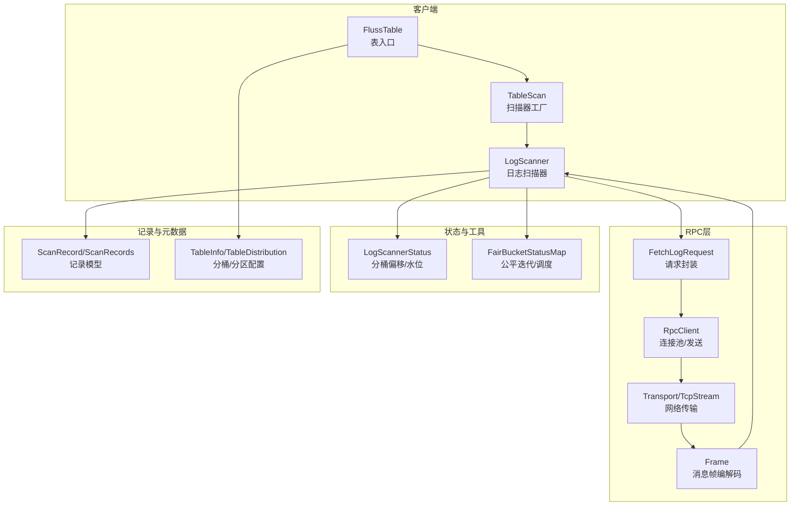
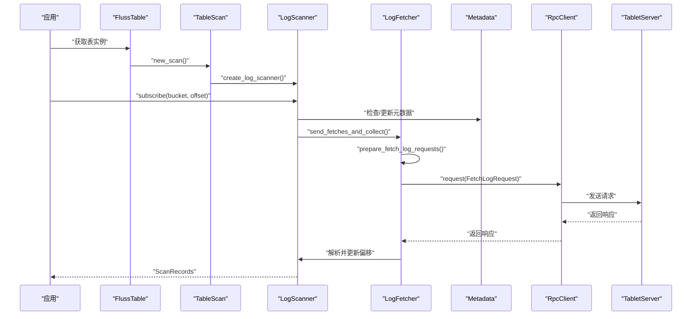
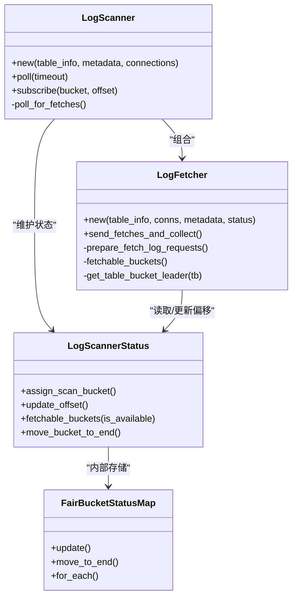
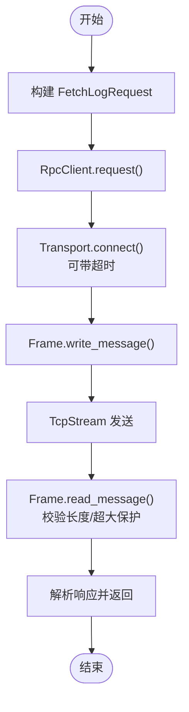
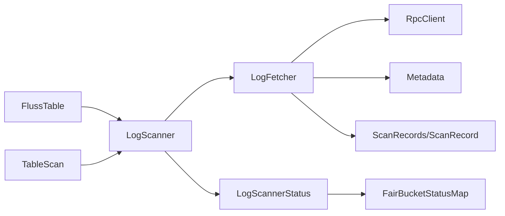

# 读取性能优化

<cite>
**本文引用的文件**
- [crates/fluss/src/client/table/scanner.rs](file://crates/fluss/src/client/table/scanner.rs)
- [crates/fluss/src/client/table/mod.rs](file://crates/fluss/src/client/table/mod.rs)
- [crates/fluss/src/client/connection.rs](file://crates/fluss/src/client/connection.rs)
- [crates/fluss/src/rpc/message/fetch.rs](file://crates/fluss/src/rpc/message/fetch.rs)
- [crates/fluss/src/rpc/transport.rs](file://crates/fluss/src/rpc/transport.rs)
- [crates/fluss/src/rpc/frame.rs](file://crates/fluss/src/rpc/frame.rs)
- [crates/fluss/src/util/mod.rs](file://crates/fluss/src/util/mod.rs)
- [crates/fluss/src/record/mod.rs](file://crates/fluss/src/record/mod.rs)
- [crates/fluss/src/metadata/table.rs](file://crates/fluss/src/metadata/table.rs)
- [crates/fluss/src/config.rs](file://crates/fluss/src/config.rs)
- [crates/examples/src/example_table.rs](file://crates/examples/src/example_table.rs)
</cite>

## 目录
1. [简介](#简介)
2. [项目结构](#项目结构)
3. [核心组件](#核心组件)
4. [架构总览](#架构总览)
5. [详细组件分析](#详细组件分析)
6. [依赖关系分析](#依赖关系分析)
7. [性能考量与优化策略](#性能考量与优化策略)
8. [故障排查指南](#故障排查指南)
9. [结论](#结论)
10. [附录：监控指标与调优案例](#附录监控指标与调优案例)

## 简介
本指南聚焦于读取路径的性能优化，围绕日志扫描器（LogScanner）展开，系统性阐述预取机制、缓存策略、并行扫描、内存管理、分区与分桶读取优化、网络传输优化、延迟优化以及监控与调优实践。目标是帮助读者在实际生产环境中实现高吞吐、低延迟的读取体验。

## 项目结构
与读取性能相关的关键模块分布如下：
- 客户端表接口与扫描器：client/table
- RPC 请求/响应与帧协议：rpc/message、rpc/frame、rpc/transport
- 公平分桶状态管理：util/FairBucketStatusMap
- 记录模型与Arrow转换：record
- 表元信息与分桶/分区配置：metadata/table
- 运行时配置：config
- 示例用法：examples

图表来源
- [crates/fluss/src/client/table/mod.rs](file://crates/fluss/src/client/table/mod.rs#L32-L67)
- [crates/fluss/src/client/table/scanner.rs](file://crates/fluss/src/client/table/scanner.rs#L38-L108)
- [crates/fluss/src/rpc/message/fetch.rs](file://crates/fluss/src/rpc/message/fetch.rs#L35-L53)
- [crates/fluss/src/rpc/frame.rs](file://crates/fluss/src/rpc/frame.rs#L34-L77)
- [crates/fluss/src/util/mod.rs](file://crates/fluss/src/util/mod.rs#L32-L170)
- [crates/fluss/src/record/mod.rs](file://crates/fluss/src/record/mod.rs#L87-L175)
- [crates/fluss/src/metadata/table.rs](file://crates/fluss/src/metadata/table.rs#L270-L285)

章节来源
- [crates/fluss/src/client/table/mod.rs](file://crates/fluss/src/client/table/mod.rs#L32-L67)
- [crates/fluss/src/client/table/scanner.rs](file://crates/fluss/src/client/table/scanner.rs#L38-L108)

## 核心组件
- 表入口与扫描器工厂：FlussTable 提供 new_scan 创建 TableScan；TableScan 负责生成 LogScanner。
- 日志扫描器：LogScanner 维护分桶状态、准备 Fetch 请求、收集响应并产出 ScanRecords。
- 分桶状态管理：LogScannerStatus + FairBucketStatusMap 实现分桶偏移跟踪与公平调度。
- RPC 请求与传输：FetchLogRequest 封装请求；RpcClient 发送；Transport/TcpStream 提供网络连接；Frame 负责消息帧编解码。
- 记录模型：ScanRecord/ScanRecords 承载每条记录及其元信息（offset、timestamp、change_type），支持聚合输出。

章节来源
- [crates/fluss/src/client/table/mod.rs](file://crates/fluss/src/client/table/mod.rs#L32-L67)
- [crates/fluss/src/client/table/scanner.rs](file://crates/fluss/src/client/table/scanner.rs#L38-L108)
- [crates/fluss/src/util/mod.rs](file://crates/fluss/src/util/mod.rs#L32-L170)
- [crates/fluss/src/record/mod.rs](file://crates/fluss/src/record/mod.rs#L87-L175)
- [crates/fluss/src/rpc/message/fetch.rs](file://crates/fluss/src/rpc/message/fetch.rs#L35-L53)
- [crates/fluss/src/rpc/transport.rs](file://crates/fluss/src/rpc/transport.rs#L27-L83)
- [crates/fluss/src/rpc/frame.rs](file://crates/fluss/src/rpc/frame.rs#L34-L77)

## 架构总览
读取流程从 FlussTable.new_scan() 开始，内部通过 TableScan.create_log_scanner() 获取 LogScanner。LogScanner 基于当前分桶订阅状态（LogScannerStatus）准备 Fetch 请求，按分桶维度聚合到不同 leader 的 FetchLogRequest，并通过 RpcClient 发送到对应 TabletServer。服务端返回后，LogScanner 解析响应，将 Arrow 数据转换为 ScanRecord 并更新分桶偏移。

图表来源
- [crates/fluss/src/client/table/mod.rs](file://crates/fluss/src/client/table/mod.rs#L64-L66)
- [crates/fluss/src/client/table/scanner.rs](file://crates/fluss/src/client/table/scanner.rs#L53-L108)
- [crates/fluss/src/rpc/message/fetch.rs](file://crates/fluss/src/rpc/message/fetch.rs#L35-L53)

## 详细组件分析

### 日志扫描器与分桶状态
- LogScanner 负责订阅分桶、轮询拉取、聚合结果。
- LogFetcher 负责将分桶请求按 leader 聚合为 FetchLogRequest，并发送给对应节点。
- LogScannerStatus 维护每个 TableBucket 的偏移与高水位，支持公平调度（move_to_end）。
- FairBucketStatusMap 使用 LinkedHashMap 保证稳定的迭代顺序，便于公平轮询。

图表来源
- [crates/fluss/src/client/table/scanner.rs](file://crates/fluss/src/client/table/scanner.rs#L62-L108)
- [crates/fluss/src/client/table/scanner.rs](file://crates/fluss/src/client/table/scanner.rs#L110-L244)
- [crates/fluss/src/util/mod.rs](file://crates/fluss/src/util/mod.rs#L32-L170)

章节来源
- [crates/fluss/src/client/table/scanner.rs](file://crates/fluss/src/client/table/scanner.rs#L62-L108)
- [crates/fluss/src/client/table/scanner.rs](file://crates/fluss/src/client/table/scanner.rs#L110-L244)
- [crates/fluss/src/util/mod.rs](file://crates/fluss/src/util/mod.rs#L32-L170)

### RPC 请求与网络传输
- FetchLogRequest 包装 proto::FetchLogRequest，携带 per-table 与 per-bucket 的请求参数。
- RpcClient 负责连接管理与请求发送；Transport 支持超时连接；Frame 提供消息长度前缀与安全读取。
- 读取侧限制单次最大消息大小，避免内存暴涨；写入侧限制单条消息大小，防止过大包。

图表来源
- [crates/fluss/src/rpc/message/fetch.rs](file://crates/fluss/src/rpc/message/fetch.rs#L35-L53)
- [crates/fluss/src/rpc/transport.rs](file://crates/fluss/src/rpc/transport.rs#L67-L83)
- [crates/fluss/src/rpc/frame.rs](file://crates/fluss/src/rpc/frame.rs#L45-L77)

章节来源
- [crates/fluss/src/rpc/message/fetch.rs](file://crates/fluss/src/rpc/message/fetch.rs#L35-L53)
- [crates/fluss/src/rpc/transport.rs](file://crates/fluss/src/rpc/transport.rs#L67-L83)
- [crates/fluss/src/rpc/frame.rs](file://crates/fluss/src/rpc/frame.rs#L45-L77)

### 记录模型与 Arrow 转换
- ScanRecord 持有 ColumnarRow、offset、timestamp、change_type。
- ScanRecords 聚合各分桶的记录，提供按分桶查询与总量统计。
- to_arrow_schema 用于将表行类型转换为 Arrow 模式，驱动后续解析。

章节来源
- [crates/fluss/src/record/mod.rs](file://crates/fluss/src/record/mod.rs#L87-L175)
- [crates/fluss/src/client/table/scanner.rs](file://crates/fluss/src/client/table/scanner.rs#L152-L167)

### 分桶与分区配置
- TableInfo/Schema 决定主键、物理主键、分桶键、分区键等。
- TableDistribution 描述分桶数量与分桶键集合。
- 默认分桶键策略：主键表优先使用物理主键作为分桶键，排除分区键；无主键表默认不分桶。

章节来源
- [crates/fluss/src/metadata/table.rs](file://crates/fluss/src/metadata/table.rs#L634-L800)
- [crates/fluss/src/metadata/table.rs](file://crates/fluss/src/metadata/table.rs#L270-L285)

## 依赖关系分析
- LogScanner 依赖 Metadata 获取集群信息与 leader 映射。
- LogFetcher 依赖 RpcClient 发送请求，依赖 Metadata 获取 leader。
- LogScannerStatus 依赖 FairBucketStatusMap 实现公平调度。
- Record 层依赖 Arrow 模式进行列存解析。

图表来源
- [crates/fluss/src/client/table/scanner.rs](file://crates/fluss/src/client/table/scanner.rs#L62-L108)
- [crates/fluss/src/client/table/scanner.rs](file://crates/fluss/src/client/table/scanner.rs#L110-L244)
- [crates/fluss/src/client/table/mod.rs](file://crates/fluss/src/client/table/mod.rs#L32-L67)
- [crates/fluss/src/util/mod.rs](file://crates/fluss/src/util/mod.rs#L32-L170)
- [crates/fluss/src/record/mod.rs](file://crates/fluss/src/record/mod.rs#L87-L175)

章节来源
- [crates/fluss/src/client/table/scanner.rs](file://crates/fluss/src/client/table/scanner.rs#L62-L108)
- [crates/fluss/src/client/table/mod.rs](file://crates/fluss/src/client/table/mod.rs#L32-L67)
- [crates/fluss/src/util/mod.rs](file://crates/fluss/src/util/mod.rs#L32-L170)

## 性能考量与优化策略

### 预取机制与并行扫描
- 分桶级并行：按 leader 聚合 per-bucket 请求，减少跨节点往返，提升吞吐。
- 批量拉取：单次请求中聚合多个分桶，降低 RTT；服务端根据 max_bytes、min_bytes、max_wait_ms 控制批大小与等待时间。
- 公平调度：FairBucketStatusMap 保持迭代顺序，避免某些分桶饥饿；结合 move_to_end 可实现“最近使用”公平轮转。

章节来源
- [crates/fluss/src/client/table/scanner.rs](file://crates/fluss/src/client/table/scanner.rs#L175-L233)
- [crates/fluss/src/util/mod.rs](file://crates/fluss/src/util/mod.rs#L32-L170)

### 缓存策略
- 偏移与高水位缓存：LogScannerStatus 在内存中维护每个分桶的 offset 与 high_watermark，避免重复查询。
- 元数据缓存：Metadata 更新表元信息，减少重复解析成本；TableScan.subscribe 会先检查/更新元数据再订阅。

章节来源
- [crates/fluss/src/client/table/scanner.rs](file://crates/fluss/src/client/table/scanner.rs#L95-L103)
- [crates/fluss/src/client/table/scanner.rs](file://crates/fluss/src/client/table/scanner.rs#L97-L99)

### 内存管理与流式处理
- 单次请求上限：LOG_FETCH_MAX_BYTES 控制单次请求最大字节数，避免内存峰值过高。
- per-bucket 上限：prepare_fetch_log_requests 中为每个分桶设置 max_fetch_bytes（例如 1MB），限制单分桶内存占用。
- 流式读取：Frame.read_message 对超大消息进行分步读取与丢弃，防止 OOM；同时限制单消息长度，避免异常消息导致内存暴涨。
- Arrow 模式复用：to_arrow_schema 复用表行类型生成的 Arrow 模式，减少重复分配。

章节来源
- [crates/fluss/src/client/table/scanner.rs](file://crates/fluss/src/client/table/scanner.rs#L32-L36)
- [crates/fluss/src/client/table/scanner.rs](file://crates/fluss/src/client/table/scanner.rs#L197-L199)
- [crates/fluss/src/rpc/frame.rs](file://crates/fluss/src/rpc/frame.rs#L45-L77)
- [crates/fluss/src/client/table/scanner.rs](file://crates/fluss/src/client/table/scanner.rs#L152-L167)

### 背压控制
- min_bytes：当可用数据不足时，服务端会等待直到满足最小字节或超时，避免空轮询。
- max_wait_ms：控制最长等待时间，平衡延迟与吞吐。
- 建议：在低频场景提高 min_bytes 或缩短 max_wait_ms，以减少空轮询；在高频场景适当降低 min_bytes 以提升吞吐。

章节来源
- [crates/fluss/src/client/table/scanner.rs](file://crates/fluss/src/client/table/scanner.rs#L34-L36)
- [crates/fluss/src/client/table/scanner.rs](file://crates/fluss/src/client/table/scanner.rs#L226-L227)

### 分区与分桶读取优化
- 分桶键策略：主键表默认使用物理主键（排除分区键）作为分桶键，有助于热点分散。
- 分桶均匀性：合理设置 num_buckets，避免少数分桶成为瓶颈；结合业务主键分布评估。
- 热点处理：对热点分桶可考虑增加副本数、调整分桶键或引入二级索引（如未来扩展）。
- 负载均衡：利用 leader 与分桶映射，尽量让同一 leader 聚合多个分桶，减少跨节点请求。

章节来源
- [crates/fluss/src/metadata/table.rs](file://crates/fluss/src/metadata/table.rs#L487-L508)
- [crates/fluss/src/metadata/table.rs](file://crates/fluss/src/metadata/table.rs#L510-L564)

### 网络传输优化
- 连接超时：Transport.connect 支持超时参数，避免阻塞；建议根据网络环境设置合理超时。
- 帧协议：Frame.read_message/write_message 提供固定长度前缀，确保消息边界清晰，减少粘包/半包问题。
- 最大消息限制：读取侧限制最大消息大小，写入侧限制单条消息大小，防止异常流量冲击。

章节来源
- [crates/fluss/src/rpc/transport.rs](file://crates/fluss/src/rpc/transport.rs#L67-L83)
- [crates/fluss/src/rpc/frame.rs](file://crates/fluss/src/rpc/frame.rs#L45-L77)
- [crates/fluss/src/rpc/frame.rs](file://crates/fluss/src/rpc/frame.rs#L93-L106)

### 读取延迟优化最佳实践
- 利用索引：若表启用索引（如 LogFormat 为 INDEXED），可减少全表扫描开销；当前扫描器未显式下推投影，建议结合业务过滤条件优化。
- 过滤条件优化：尽量在客户端侧做谓词下推（如基于主键/分区键），减少不必要的分桶订阅。
- 批量读取策略：增大 max_bytes 与 per-bucket max_fetch_bytes，提升单次吞吐；但需配合 min_bytes 与 max_wait_ms 平衡延迟。
- 偏移更新：及时更新分桶偏移，避免重复读取与无效轮询。

章节来源
- [crates/fluss/src/client/table/scanner.rs](file://crates/fluss/src/client/table/scanner.rs#L157-L167)
- [crates/fluss/src/client/table/scanner.rs](file://crates/fluss/src/client/table/scanner.rs#L217-L218)

## 故障排查指南
- 连接超时：Transport.connect 超时会返回连接错误，检查网络连通性与超时参数。
- 消息过大：Frame.read_message 遇到超过限制的消息会报错并丢弃剩余内容，检查客户端 max_message_size 与服务端配置。
- 偏移不更新：确认 LogScannerStatus.update_offset 是否被调用；检查订阅是否成功。
- 空轮询：若 min_bytes 设置过高且数据稀少，可能长时间等待；适当降低 min_bytes 或缩短 max_wait_ms。

章节来源
- [crates/fluss/src/rpc/transport.rs](file://crates/fluss/src/rpc/transport.rs#L73-L82)
- [crates/fluss/src/rpc/frame.rs](file://crates/fluss/src/rpc/frame.rs#L50-L71)
- [crates/fluss/src/client/table/scanner.rs](file://crates/fluss/src/client/table/scanner.rs#L163-L167)

## 结论
通过分桶级并行、公平调度、请求聚合与流式读取，结合合理的缓冲区与背压参数，可在高并发场景下显著提升读取吞吐与稳定性。配合分桶键策略与网络层优化，可进一步降低延迟并提升整体性能。

## 附录：监控指标与调优案例

### 监控指标建议
- 吞吐：每秒读取记录数、每秒字节数
- 延迟：端到端延迟、RPC 响应延迟、队列等待时间
- 资源：CPU、内存、GC 时间、网络带宽
- 错误：连接超时、消息过大、解析失败、重试次数
- 负载：各分桶读取速率、Leader 负载分布

### 调优案例
- 案例一：低频写入高延迟
  - 现象：poll 长时间无数据
  - 措施：降低 min_bytes 或 max_wait_ms，减少空轮询等待
  - 效果：降低端到端延迟，提升交互体验
- 案例二：热点分桶高内存
  - 现象：单分桶内存占用高
  - 措施：减小 per-bucket max_fetch_bytes，或拆分分桶键
  - 效果：降低峰值内存，提升稳定性
- 案例三：网络抖动导致超时
  - 现象：连接超时频繁
  - 措施：增大 Transport.connect 超时，优化网络路径
  - 效果：提升连接成功率

章节来源
- [crates/fluss/src/client/table/scanner.rs](file://crates/fluss/src/client/table/scanner.rs#L32-L36)
- [crates/fluss/src/client/table/scanner.rs](file://crates/fluss/src/client/table/scanner.rs#L197-L199)
- [crates/fluss/src/rpc/transport.rs](file://crates/fluss/src/rpc/transport.rs#L73-L82)