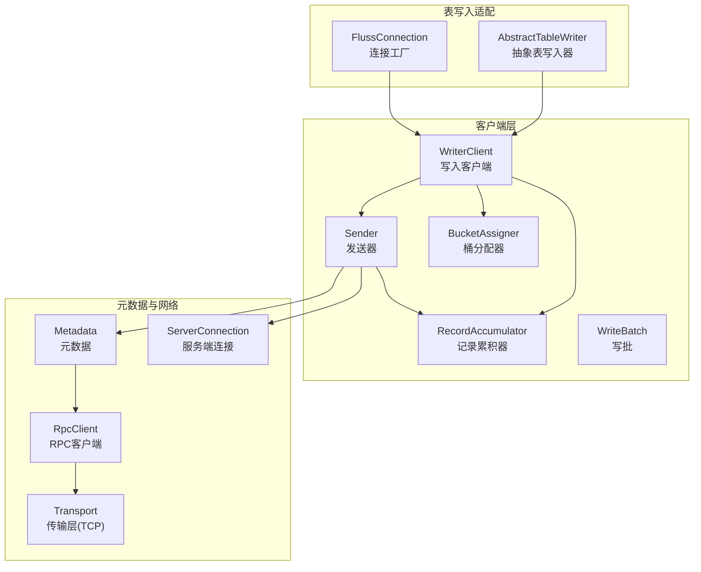
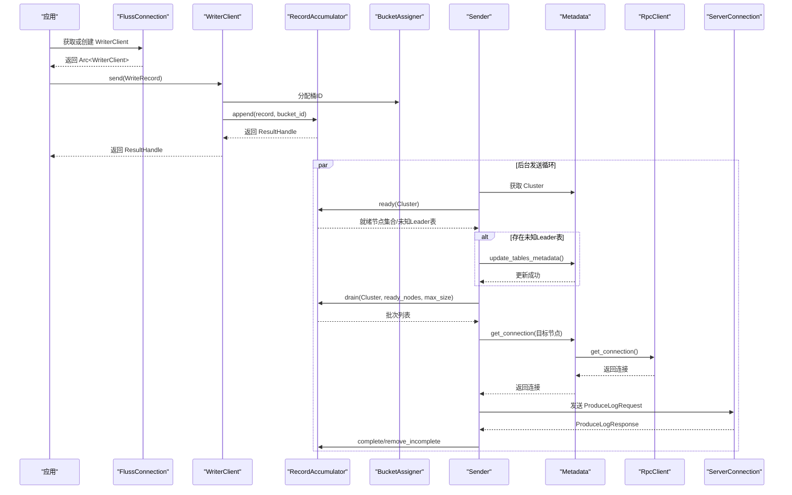
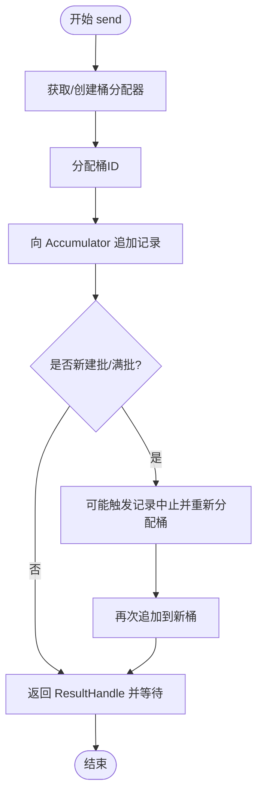
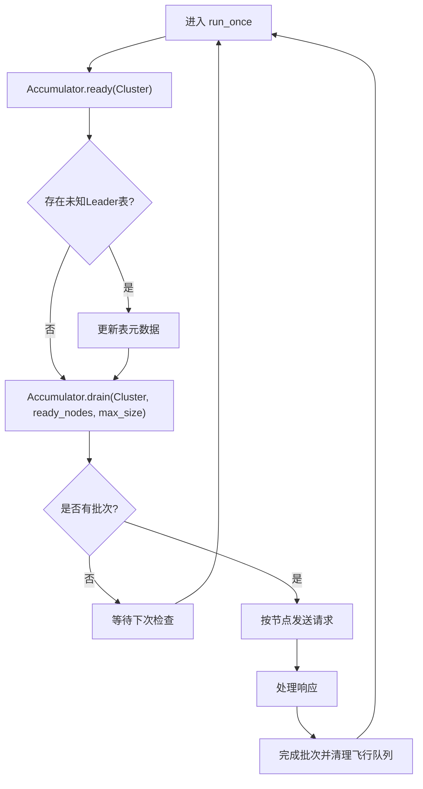
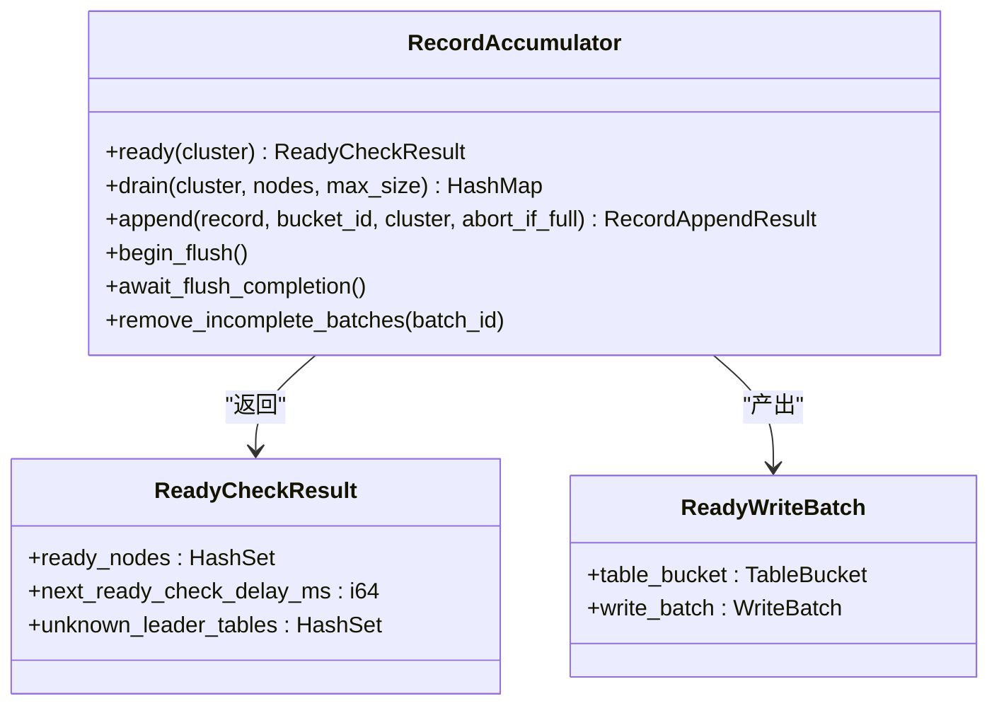
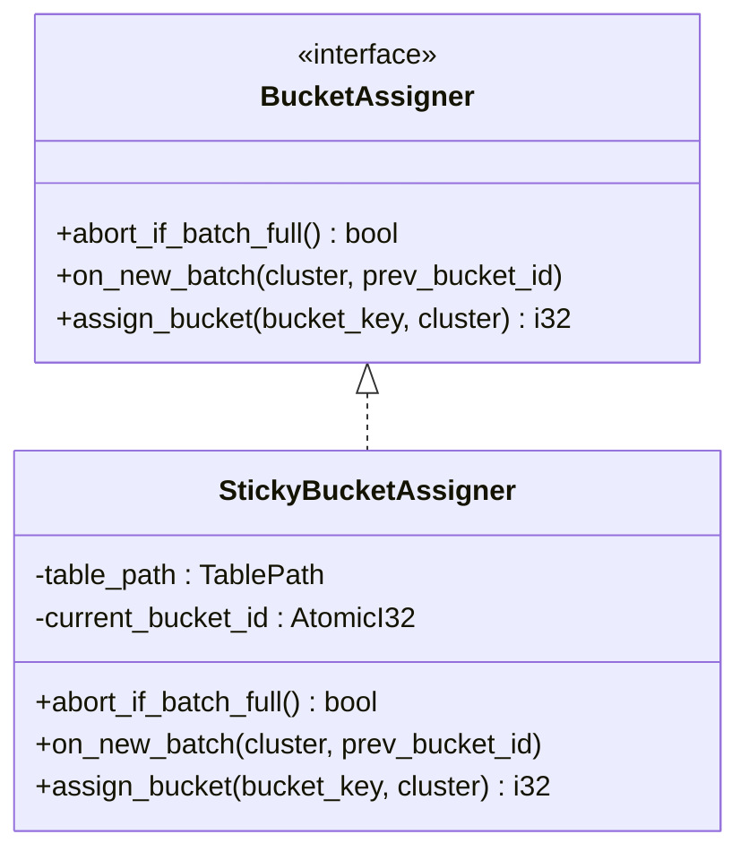
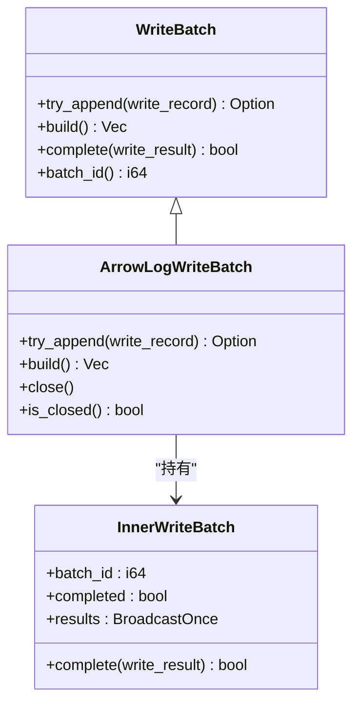
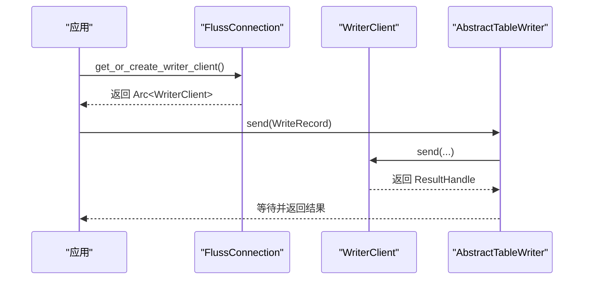
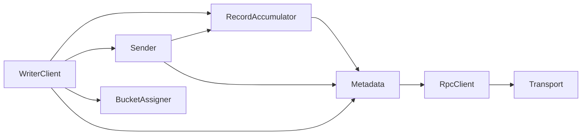

# 写入客户端

<cite>
**本文引用的文件**
- [writer_client.rs](file://crates/fluss/src/client/write/writer_client.rs)
- [sender.rs](file://crates/fluss/src/client/write/sender.rs)
- [accumulator.rs](file://crates/fluss/src/client/write/accumulator.rs)
- [bucket_assigner.rs](file://crates/fluss/src/client/write/bucket_assigner.rs)
- [batch.rs](file://crates/fluss/src/client/write/batch.rs)
- [mod.rs](file://crates/fluss/src/client/write/mod.rs)
- [writer.rs](file://crates/fluss/src/client/table/writer.rs)
- [connection.rs](file://crates/fluss/src/client/connection.rs)
- [metadata.rs](file://crates/fluss/src/client/metadata.rs)
- [transport.rs](file://crates/fluss/src/rpc/transport.rs)
- [config.rs](file://crates/fluss/src/config.rs)
- [lib.rs](file://crates/fluss/src/lib.rs)
</cite>

## 目录
1. [简介](#简介)
2. [项目结构](#项目结构)
3. [核心组件](#核心组件)
4. [架构总览](#架构总览)
5. [详细组件分析](#详细组件分析)
6. [依赖关系分析](#依赖关系分析)
7. [性能考虑](#性能考虑)
8. [故障排除指南](#故障排除指南)
9. [结论](#结论)
10. [附录](#附录)

## 简介
本文件系统性阐述写入客户端 WriterClient 的架构设计与实现细节，覆盖以下主题：
- 客户端生命周期管理：初始化、运行、关闭与刷新
- 连接池策略：基于元数据的连接复用与获取
- 负载均衡机制：桶分配器（StickyBucketAssigner）与节点选择
- Sender 实现原理：消息发送队列、异步处理循环、响应处理与批内飞行状态管理
- 配置项：并发连接、请求大小、确认策略、重试次数、批大小等
- 与服务器交互模式：元数据更新、请求构建与发送、错误处理
- 性能调优与故障排除：背压、批合并、延迟与吞吐权衡、常见问题定位

## 项目结构
写入客户端位于 crates/fluss/src/client/write 目录下，围绕 WriterClient、Sender、RecordAccumulator、BucketAssigner、Batch 等模块协作完成写入流程；上层通过 FlussConnection 提供统一入口，并由 Metadata 管理集群与连接。

图表来源
- [writer_client.rs](file://crates/fluss/src/client/write/writer_client.rs#L32-L147)
- [sender.rs](file://crates/fluss/src/client/write/sender.rs#L31-L207)
- [accumulator.rs](file://crates/fluss/src/client/write/accumulator.rs#L35-L442)
- [bucket_assigner.rs](file://crates/fluss/src/client/write/bucket_assigner.rs#L23-L102)
- [batch.rs](file://crates/fluss/src/client/write/batch.rs#L27-L176)
- [metadata.rs](file://crates/fluss/src/client/metadata.rs#L29-L109)
- [connection.rs](file://crates/fluss/src/client/connection.rs#L30-L82)
- [transport.rs](file://crates/fluss/src/rpc/transport.rs#L26-L83)

章节来源
- [lib.rs](file://crates/fluss/src/lib.rs#L18-L37)
- [mod.rs](file://crates/fluss/src/client/write/mod.rs#L18-L68)

## 核心组件
- WriterClient：对外暴露 send 接口，负责桶分配、记录累积、触发发送与结果等待；内部维护 Sender 的运行任务与关闭通道。
- Sender：后台循环驱动，从 Accumulator 拉取可发送批次，按目标 TabletServer 组织请求并发送，处理响应并完成批次。
- RecordAccumulator：按表路径与桶维度维护批次队列，负责就绪检查、节点分发、批大小与超时控制、刷新等待。
- BucketAssigner：为每张表维护“粘性”桶分配策略，避免频繁切换桶导致的跨桶发送。
- WriteBatch：封装 Arrow 日志批，支持追加、估计大小、完成回调广播。
- Metadata：维护 Cluster 与连接池，支持元数据更新与连接获取。
- FlussConnection：提供 WriterClient 单例化创建与表访问入口。

章节来源
- [writer_client.rs](file://crates/fluss/src/client/write/writer_client.rs#L32-L147)
- [sender.rs](file://crates/fluss/src/client/write/sender.rs#L31-L207)
- [accumulator.rs](file://crates/fluss/src/client/write/accumulator.rs#L35-L442)
- [bucket_assigner.rs](file://crates/fluss/src/client/write/bucket_assigner.rs#L23-L102)
- [batch.rs](file://crates/fluss/src/client/write/batch.rs#L27-L176)
- [metadata.rs](file://crates/fluss/src/client/metadata.rs#L29-L109)
- [connection.rs](file://crates/fluss/src/client/connection.rs#L30-L82)

## 架构总览
WriterClient 作为门面，协调桶分配与累积器；Sender 作为后台任务，周期性拉取就绪批次并发送；Metadata 负责集群信息与连接获取；Transport 提供底层 TCP 连接能力。

图表来源
- [writer_client.rs](file://crates/fluss/src/client/write/writer_client.rs#L89-L123)
- [sender.rs](file://crates/fluss/src/client/write/sender.rs#L63-L106)
- [accumulator.rs](file://crates/fluss/src/client/write/accumulator.rs#L164-L188)
- [metadata.rs](file://crates/fluss/src/client/metadata.rs#L66-L76)
- [connection.rs](file://crates/fluss/src/client/connection.rs#L66-L75)

## 详细组件分析

### WriterClient 生命周期与发送流程
- 初始化：创建 Accumulator、Sender，并在独立任务中运行；同时准备关闭通道。
- 发送：根据表路径获取/创建桶分配器，计算桶ID，向 Accumulator 追加记录；若触发新批或满批，可能触发唤醒逻辑（注释）。
- 关闭：向 Sender 发送关闭信号，等待 Sender 退出。
- 刷新：标记 flush 开始，等待所有未完成批次完成。

图表来源
- [writer_client.rs](file://crates/fluss/src/client/write/writer_client.rs#L89-L123)

章节来源
- [writer_client.rs](file://crates/fluss/src/client/write/writer_client.rs#L42-L77)
- [writer_client.rs](file://crates/fluss/src/client/write/writer_client.rs#L125-L141)

### Sender 异步发送循环与响应处理
- 循环：持续执行 run_once，直到停止标志为真。
- 就绪检查：查询 Accumulator 的就绪节点集合，必要时更新未知 Leader 的表元数据。
- 拉取与发送：按节点聚合批次，构造 ProduceLog 请求，逐个发送。
- 响应处理：遍历每个桶的响应，成功则完成批次并移除飞行队列与未完成映射；错误路径待实现。
- 关闭：设置运行标志为假，run 退出。

图表来源
- [sender.rs](file://crates/fluss/src/client/write/sender.rs#L63-L106)
- [sender.rs](file://crates/fluss/src/client/write/sender.rs#L120-L167)
- [sender.rs](file://crates/fluss/src/client/write/sender.rs#L169-L202)

章节来源
- [sender.rs](file://crates/fluss/src/client/write/sender.rs#L42-L70)
- [sender.rs](file://crates/fluss/src/client/write/sender.rs#L72-L106)
- [sender.rs](file://crates/fluss/src/client/write/sender.rs#L120-L167)
- [sender.rs](file://crates/fluss/src/client/write/sender.rs#L169-L202)

### RecordAccumulator 批次管理与就绪调度
- 数据结构：以表路径为键，值为桶到批次队列的映射；维护未完成批次映射用于结果广播。
- 就绪检查：遍历各桶首个批次，依据等待时间、是否已满、是否关闭、是否存在 Leader 等条件决定节点是否就绪。
- 节点分发：为每个就绪节点收集可发送批次，支持按节点轮询与大小限制。
- 刷新：begin_flush 增加计数，await_flush_completion 等待所有未完成批次完成。

图表来源
- [accumulator.rs](file://crates/fluss/src/client/write/accumulator.rs#L164-L188)
- [accumulator.rs](file://crates/fluss/src/client/write/accumulator.rs#L244-L264)
- [accumulator.rs](file://crates/fluss/src/client/write/accumulator.rs#L361-L372)
- [accumulator.rs](file://crates/fluss/src/client/write/accumulator.rs#L424-L442)
- [accumulator.rs](file://crates/fluss/src/client/write/accumulator.rs#L375-L378)

章节来源
- [accumulator.rs](file://crates/fluss/src/client/write/accumulator.rs#L48-L61)
- [accumulator.rs](file://crates/fluss/src/client/write/accumulator.rs#L164-L242)
- [accumulator.rs](file://crates/fluss/src/client/write/accumulator.rs#L244-L333)

### 桶分配器与负载均衡
- 接口：BucketAssigner 定义分配策略接口，包括是否在满批时中止、新批回调与分配函数。
- StickyBucketAssigner：为每张表维护当前桶 ID，首次分配随机或可用桶，后续在新批时切换，保证同一批内的连续性与粘性。

图表来源
- [bucket_assigner.rs](file://crates/fluss/src/client/write/bucket_assigner.rs#L23-L29)
- [bucket_assigner.rs](file://crates/fluss/src/client/write/bucket_assigner.rs#L31-L102)

章节来源
- [bucket_assigner.rs](file://crates/fluss/src/client/write/bucket_assigner.rs#L45-L82)
- [writer_client.rs](file://crates/fluss/src/client/write/writer_client.rs#L143-L146)

### 写批与结果广播
- WriteBatch：统一的批接口，内部持有 InnerWriteBatch 与 ArrowBuilder。
- InnerWriteBatch：封装批次元数据、结果广播器、完成状态与被拉取时间戳。
- 结果传播：通过 BroadcastOnce 在批次完成时广播给所有订阅者（ResultHandle）。

图表来源
- [batch.rs](file://crates/fluss/src/client/write/batch.rs#L27-L128)
- [batch.rs](file://crates/fluss/src/client/write/batch.rs#L130-L176)

章节来源
- [batch.rs](file://crates/fluss/src/client/write/batch.rs#L38-L65)
- [batch.rs](file://crates/fluss/src/client/write/batch.rs#L156-L176)

### 表写入适配与连接工厂
- AbstractTableWriter：封装表路径与 WriterClient，提供 send 方法，内部调用 WriterClient.send 并等待结果。
- FlussConnection：负责创建 Metadata、RpcClient，提供 get_or_create_writer_client 单例化 WriterClient。

图表来源
- [writer.rs](file://crates/fluss/src/client/table/writer.rs#L63-L67)
- [connection.rs](file://crates/fluss/src/client/connection.rs#L66-L75)

章节来源
- [writer.rs](file://crates/fluss/src/client/table/writer.rs#L49-L67)
- [connection.rs](file://crates/fluss/src/client/connection.rs#L66-L75)

## 依赖关系分析
- WriterClient 依赖：Config、Metadata、RecordAccumulator、BucketAssigner、Sender、ResultHandle。
- Sender 依赖：Metadata、RecordAccumulator、ServerConnection、ProduceLogRequest/Response。
- Accumulator 依赖：Config、Cluster、TableBucket、WriteBatch、ResultHandle。
- Metadata 依赖：Cluster、RpcClient、ServerConnection。
- Transport 提供底层 TCP 连接能力，被 RpcClient 使用。

图表来源
- [writer_client.rs](file://crates/fluss/src/client/write/writer_client.rs#L18-L29)
- [sender.rs](file://crates/fluss/src/client/write/sender.rs#L18-L28)
- [metadata.rs](file://crates/fluss/src/client/metadata.rs#L18-L32)
- [transport.rs](file://crates/fluss/src/rpc/transport.rs#L26-L83)

章节来源
- [config.rs](file://crates/fluss/src/config.rs#L21-L39)
- [lib.rs](file://crates/fluss/src/lib.rs#L18-L37)

## 性能考虑
- 批大小与超时：通过配置项 writer_batch_size 控制批大小，Accumulator 的 batch_timeout_ms 控制等待超时，影响吞吐与延迟。
- 请求大小上限：request_max_size 限制单次请求体积，避免过大导致压缩后仍超限的情况。
- 确认策略：writer_acks 支持 "all" 或数字，影响端到端一致性与延迟。
- 重试次数：writer_retries 控制 Sender 的重试上限，结合响应错误处理可提升稳定性。
- 背压与刷新：begin_flush/await_flush_completion 提供显式刷新能力，避免大量未完成批次阻塞。
- 负载均衡：StickyBucketAssigner 保证同一批内桶稳定，减少跨桶发送；节点轮询与大小限制确保公平与吞吐。

章节来源
- [config.rs](file://crates/fluss/src/config.rs#L28-L39)
- [accumulator.rs](file://crates/fluss/src/client/write/accumulator.rs#L54-L60)
- [accumulator.rs](file://crates/fluss/src/client/write/accumulator.rs#L361-L372)
- [sender.rs](file://crates/fluss/src/client/write/sender.rs#L43-L60)

## 故障排除指南
- 元数据缺失：当就绪检查发现未知 Leader 表时，Sender 会触发元数据更新；若仍失败，检查 bootstrap_server 配置与网络连通性。
- 连接失败：Metadata.get_connection 失败通常源于目标节点不可达或认证问题；可通过 Transport.connect_timeout 的超时行为定位。
- 响应错误：handle_produce_response 中对错误码的处理尚未实现，建议在生产环境补充具体错误分类与重试策略。
- 关闭卡顿：若 close 等待 Sender 退出，检查是否有未完成批次或 Sender 正常运行；必要时增大 writer_retries 与合理设置 flush。
- 性能退化：观察 batch_timeout_ms 与 request_max_size 的平衡，适当提高批大小或降低超时以提升吞吐。

章节来源
- [sender.rs](file://crates/fluss/src/client/write/sender.rs#L77-L81)
- [sender.rs](file://crates/fluss/src/client/write/sender.rs#L169-L186)
- [transport.rs](file://crates/fluss/src/rpc/transport.rs#L73-L82)
- [writer_client.rs](file://crates/fluss/src/client/write/writer_client.rs#L125-L135)

## 结论
WriterClient 通过“桶分配 + 批累积 + 后台发送”的架构实现了高吞吐、低延迟的写入路径。Sender 的循环调度与 Metadata 的连接管理共同保障了系统的稳定性与可扩展性。通过合理配置批大小、确认策略与重试参数，可在不同场景下取得最佳性能表现。

## 附录
- 配置项参考
  - bootstrap_server：协调器地址
  - request_max_size：请求最大字节
  - writer_acks：确认策略（"all" 或数字）
  - writer_retries：发送重试次数
  - writer_batch_size：批大小

章节来源
- [config.rs](file://crates/fluss/src/config.rs#L23-L39)