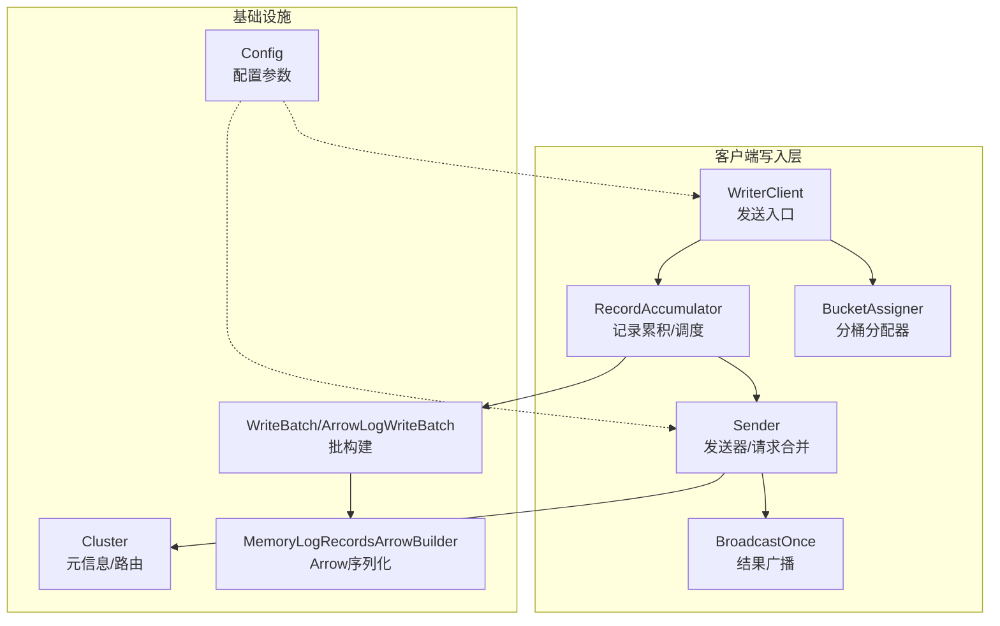
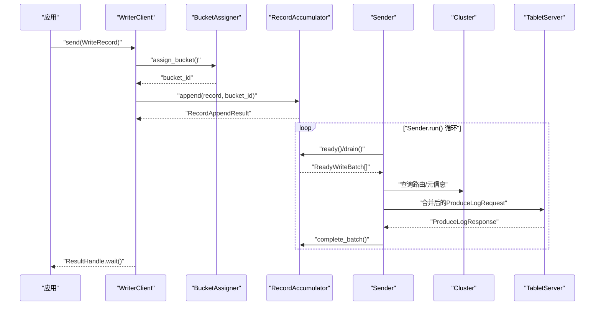
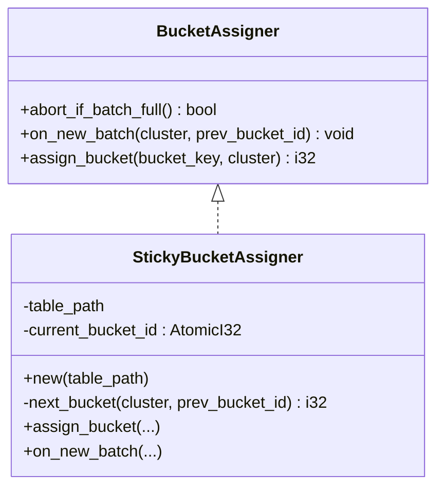
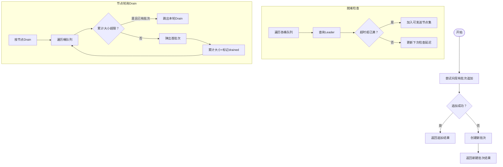
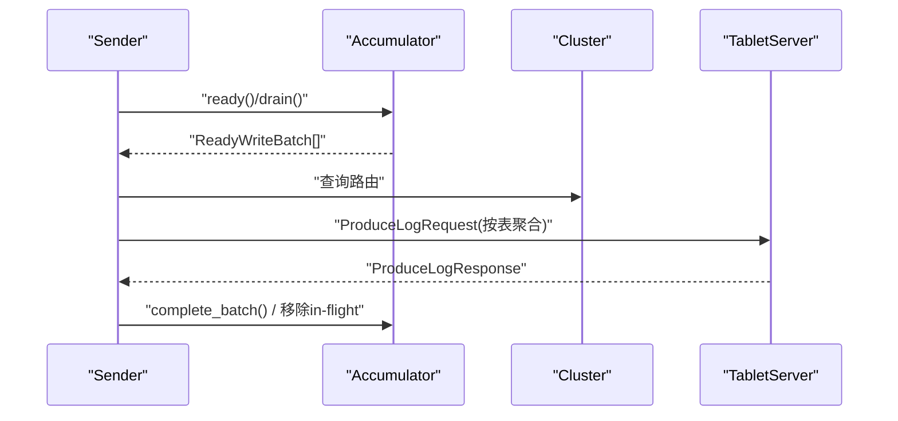
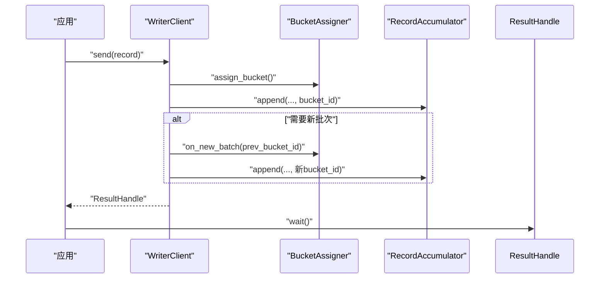
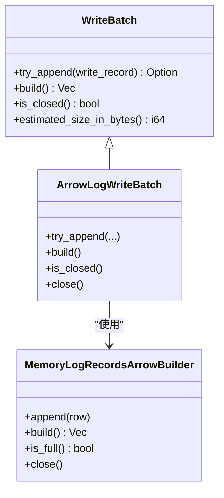
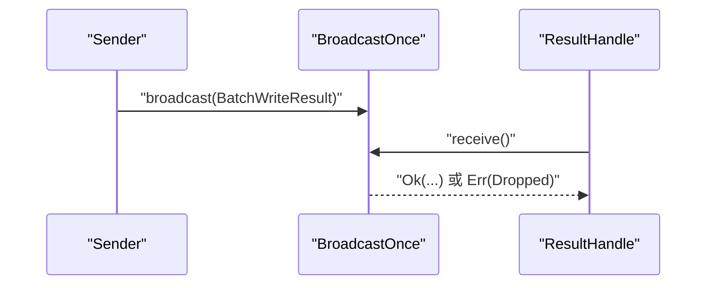
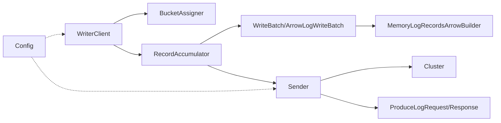

# 写入策略与优化

<cite>
**本文引用的文件**   
- [crates/fluss/src/client/write/mod.rs](file://crates/fluss/src/client/write/mod.rs)
- [crates/fluss/src/client/write/bucket_assigner.rs](file://crates/fluss/src/client/write/bucket_assigner.rs)
- [crates/fluss/src/client/write/broadcast.rs](file://crates/fluss/src/client/write/broadcast.rs)
- [crates/fluss/src/client/write/writer_client.rs](file://crates/fluss/src/client/write/writer_client.rs)
- [crates/fluss/src/client/write/sender.rs](file://crates/fluss/src/client/write/sender.rs)
- [crates/fluss/src/client/write/accumulator.rs](file://crates/fluss/src/client/write/accumulator.rs)
- [crates/fluss/src/client/write/batch.rs](file://crates/fluss/src/client/write/batch.rs)
- [crates/fluss/src/client/mod.rs](file://crates/fluss/src/client/mod.rs)
- [crates/fluss/src/cluster/cluster.rs](file://crates/fluss/src/cluster/cluster.rs)
- [crates/fluss/src/metadata/table.rs](file://crates/fluss/src/metadata/table.rs)
- [crates/fluss/src/record/arrow.rs](file://crates/fluss/src/record/arrow.rs)
- [crates/fluss/src/config.rs](file://crates/fluss/src/config.rs)
- [crates/fluss/src/lib.rs](file://crates/fluss/src/lib.rs)
</cite>

## 目录
1. [引言](#引言)
2. [项目结构](#项目结构)
3. [核心组件](#核心组件)
4. [架构总览](#架构总览)
5. [详细组件分析](#详细组件分析)
6. [依赖关系分析](#依赖关系分析)
7. [性能考量](#性能考量)
8. [故障排查指南](#故障排查指南)
9. [结论](#结论)
10. [附录：基准测试与调优](#附录基准测试与调优)

## 引言
本文件系统性阐述 Fluss 客户端侧的写入策略与优化，重点覆盖以下主题：
- 分桶分配器的工作原理：数据分布策略、键到桶映射、负载均衡与粘性策略
- 广播写入的实现机制：多分区写入、结果传播、一致性与性能权衡
- 写入策略选择标准：顺序写入、并行写入、批量写入的适用场景
- 写入性能优化技术：内存池与批构建、I/O 合并与压缩、网络请求合并
- 基准测试方法与调优工具使用指南
- 实战案例与最佳实践

## 项目结构
客户端写入路径位于 crates/fluss/src/client/write 下，围绕“记录累积 → 批构建 → 发送器 → 集群路由”的主链路组织模块化设计；同时配合集群元信息、表描述与 Arrow 序列化等基础设施。

图表来源
- [crates/fluss/src/client/write/writer_client.rs](file://crates/fluss/src/client/write/writer_client.rs#L32-L147)
- [crates/fluss/src/client/write/accumulator.rs](file://crates/fluss/src/client/write/accumulator.rs#L35-L443)
- [crates/fluss/src/client/write/sender.rs](file://crates/fluss/src/client/write/sender.rs#L31-L208)
- [crates/fluss/src/client/write/bucket_assigner.rs](file://crates/fluss/src/client/write/bucket_assigner.rs#L23-L103)
- [crates/fluss/src/client/write/batch.rs](file://crates/fluss/src/client/write/batch.rs#L27-L177)
- [crates/fluss/src/record/arrow.rs](file://crates/fluss/src/record/arrow.rs#L92-L230)
- [crates/fluss/src/cluster/cluster.rs](file://crates/fluss/src/cluster/cluster.rs#L29-L244)
- [crates/fluss/src/config.rs](file://crates/fluss/src/config.rs#L21-L40)

章节来源
- [crates/fluss/src/client/mod.rs](file://crates/fluss/src/client/mod.rs#L18-L27)
- [crates/fluss/src/lib.rs](file://crates/fluss/src/lib.rs#L18-L38)

## 核心组件
- 分桶分配器（BucketAssigner）：负责将记录映射到具体桶，并在新批次时维持粘性，避免频繁切换目标节点
- 记录累积器（RecordAccumulator）：按表/桶聚合记录，维护批次生命周期与就绪检查，支持跨节点轮询与大小限制
- 发送器（Sender）：从累积器拉取就绪批次，按目标 TabletServer 合并请求，处理响应并完成批次
- 写入客户端（WriterClient）：对外暴露 send 接口，协调分配器、累积器与发送器
- 批构建（WriteBatch/ArrowLogWriteBatch）：基于 Arrow 的内存批构建与序列化
- 结果广播（BroadcastOnce）：单次广播结果，供上层等待

章节来源
- [crates/fluss/src/client/write/mod.rs](file://crates/fluss/src/client/write/mod.rs#L18-L69)
- [crates/fluss/src/client/write/bucket_assigner.rs](file://crates/fluss/src/client/write/bucket_assigner.rs#L23-L103)
- [crates/fluss/src/client/write/accumulator.rs](file://crates/fluss/src/client/write/accumulator.rs#L35-L443)
- [crates/fluss/src/client/write/sender.rs](file://crates/fluss/src/client/write/sender.rs#L31-L208)
- [crates/fluss/src/client/write/batch.rs](file://crates/fluss/src/client/write/batch.rs#L27-L177)
- [crates/fluss/src/client/write/broadcast.rs](file://crates/fluss/src/client/write/broadcast.rs#L28-L120)

## 架构总览
写入主流程：应用调用 WriterClient.send → 分桶分配器决定桶 → 累积器追加或新建批次 → 发送器周期性拉取并合并请求 → 发往对应 TabletServer → 成功后完成批次并通知上层。

图表来源
- [crates/fluss/src/client/write/writer_client.rs](file://crates/fluss/src/client/write/writer_client.rs#L89-L123)
- [crates/fluss/src/client/write/accumulator.rs](file://crates/fluss/src/client/write/accumulator.rs#L164-L333)
- [crates/fluss/src/client/write/sender.rs](file://crates/fluss/src/client/write/sender.rs#L63-L167)
- [crates/fluss/src/cluster/cluster.rs](file://crates/fluss/src/cluster/cluster.rs#L177-L188)

## 详细组件分析

### 分桶分配器：数据分布、粘性与负载均衡
- 抽象接口：支持“批次满即中止”、“新批次回调”、“键到桶映射”
- 具体实现：StickyBucketAssigner 维护当前桶 ID，首次选择可用桶集合中的一个，后续保持不变，必要时在新批次回调时切换
- 负载均衡：当无可用桶时回退随机；可用桶为单个时直接复用；多个可用桶时随机但避免与前一次相同，降低抖动
- 键到桶映射：对外暴露 assign_bucket，当前实现未使用外部键参数，采用粘性策略

图表来源
- [crates/fluss/src/client/write/bucket_assigner.rs](file://crates/fluss/src/client/write/bucket_assigner.rs#L23-L103)

章节来源
- [crates/fluss/src/client/write/bucket_assigner.rs](file://crates/fluss/src/client/write/bucket_assigner.rs#L31-L103)
- [crates/fluss/src/cluster/cluster.rs](file://crates/fluss/src/cluster/cluster.rs#L207-L232)

### 记录累积器：批次生命周期与调度
- 按 TablePath → BucketId 维度维护批次队列，支持尝试追加、新建批次、关闭与估计大小
- 就绪检查：根据批次等待时间、是否已满、是否存在未知领导者等条件判定节点可发送
- 节点轮询：对每个节点维护游标，按桶列表循环取出批次，受请求最大尺寸约束
- 刷新与完成：支持 begin_flush 与 await_flush_completion，确保所有未完成批次完成

图表来源
- [crates/fluss/src/client/write/accumulator.rs](file://crates/fluss/src/client/write/accumulator.rs#L63-L162)
- [crates/fluss/src/client/write/accumulator.rs](file://crates/fluss/src/client/write/accumulator.rs#L164-L242)
- [crates/fluss/src/client/write/accumulator.rs](file://crates/fluss/src/client/write/accumulator.rs#L244-L333)

章节来源
- [crates/fluss/src/client/write/accumulator.rs](file://crates/fluss/src/client/write/accumulator.rs#L35-L443)

### 发送器：请求合并与响应处理
- 运行循环：周期性 ready/drain，按目标节点合并批次，构造请求并发送
- 请求合并：同一表的多个桶批次按表维度聚合成单个请求，减少网络往返
- 响应处理：解析 ProduceLogResponse，定位对应批次并完成，移除飞行批次与不完整登记

图表来源
- [crates/fluss/src/client/write/sender.rs](file://crates/fluss/src/client/write/sender.rs#L63-L167)

章节来源
- [crates/fluss/src/client/write/sender.rs](file://crates/fluss/src/client/write/sender.rs#L31-L208)

### 写入客户端：对外接口与协调
- 对外提供 send 接口：选择/缓存分桶分配器、分配桶 ID、累积记录、必要时触发新批次回调
- 关闭与刷新：通过 channel 触发 Sender 关闭，flush 等待未完成批次完成

图表来源
- [crates/fluss/src/client/write/writer_client.rs](file://crates/fluss/src/client/write/writer_client.rs#L89-L123)

章节来源
- [crates/fluss/src/client/write/writer_client.rs](file://crates/fluss/src/client/write/writer_client.rs#L32-L147)

### 批构建与序列化：Arrow 批与校验
- 批构建：ArrowLogWriteBatch 基于 MemoryLogRecordsArrowBuilder，按字段类型动态构建数组构建器
- 序列化：写入批次头（含长度、魔数、CRC、schema_id、记录数等），随后写入 Arrow RecordBatch
- 校验：计算 CRC32C 校验值并回填，提供基本有效性检查

图表来源
- [crates/fluss/src/client/write/batch.rs](file://crates/fluss/src/client/write/batch.rs#L27-L177)
- [crates/fluss/src/record/arrow.rs](file://crates/fluss/src/record/arrow.rs#L92-L230)

章节来源
- [crates/fluss/src/client/write/batch.rs](file://crates/fluss/src/client/write/batch.rs#L27-L177)
- [crates/fluss/src/record/arrow.rs](file://crates/fluss/src/record/arrow.rs#L92-L230)

### 广播写入与一致性：结果传播
- BroadcastOnce：单次广播，接收者 receive() 等待通知；若未广播而 Drop，会广播错误
- ResultHandle：封装 BroadcastOnceReceiver，提供 wait() 与 result() 两种上层等待方式
- 语义：每批写入完成后通过 BroadcastOnce 通知 ResultHandle，实现“每批一次”的结果传播

图表来源
- [crates/fluss/src/client/write/broadcast.rs](file://crates/fluss/src/client/write/broadcast.rs#L34-L120)
- [crates/fluss/src/client/write/mod.rs](file://crates/fluss/src/client/write/mod.rs#L47-L68)

章节来源
- [crates/fluss/src/client/write/broadcast.rs](file://crates/fluss/src/client/write/broadcast.rs#L28-L120)
- [crates/fluss/src/client/write/mod.rs](file://crates/fluss/src/client/write/mod.rs#L47-L68)

## 依赖关系分析
- 写入链路依赖：WriterClient → BucketAssigner/RecordAccumulator → Sender → Cluster → TabletServer
- 配置依赖：Config 提供请求大小、acks、重试次数、批大小等参数
- 表与桶元信息：Cluster 提供桶位置、Leader 映射、桶数量等
- 序列化依赖：ArrowBuilder 生成批次字节流，用于 RPC 请求体

图表来源
- [crates/fluss/src/client/write/writer_client.rs](file://crates/fluss/src/client/write/writer_client.rs#L32-L147)
- [crates/fluss/src/client/write/accumulator.rs](file://crates/fluss/src/client/write/accumulator.rs#L35-L443)
- [crates/fluss/src/client/write/sender.rs](file://crates/fluss/src/client/write/sender.rs#L31-L208)
- [crates/fluss/src/record/arrow.rs](file://crates/fluss/src/record/arrow.rs#L92-L230)
- [crates/fluss/src/cluster/cluster.rs](file://crates/fluss/src/cluster/cluster.rs#L29-L244)
- [crates/fluss/src/config.rs](file://crates/fluss/src/config.rs#L21-L40)

章节来源
- [crates/fluss/src/config.rs](file://crates/fluss/src/config.rs#L21-L40)
- [crates/fluss/src/cluster/cluster.rs](file://crates/fluss/src/cluster/cluster.rs#L177-L243)

## 性能考量
- 批量写入与 I/O 合并
  - Sender 按目标节点聚合批次，同一表内多桶合并为单请求，减少网络往返
  - 累积器按请求最大尺寸限制进行 Drain，避免过大请求被拒绝
- 内存与序列化
  - Arrow 批构建在内存中完成，序列化时一次性写入批次头与 Arrow 数据，减少多次拷贝
  - 默认最大记录条数作为批上限，避免单批过大导致压缩/传输异常
- 负载均衡与粘性
  - StickyBucketAssigner 在新批次回调时才切换桶，降低跨节点抖动
  - 可用桶集合为空时回退随机，保障可用性
- 一致性与吞吐
  - acks 参数控制“all”或指定副本数，影响确认延迟与吞吐
  - 广播单次结果，避免重复通知带来的额外开销

章节来源
- [crates/fluss/src/client/write/sender.rs](file://crates/fluss/src/client/write/sender.rs#L120-L167)
- [crates/fluss/src/client/write/accumulator.rs](file://crates/fluss/src/client/write/accumulator.rs#L244-L333)
- [crates/fluss/src/record/arrow.rs](file://crates/fluss/src/record/arrow.rs#L138-L148)
- [crates/fluss/src/config.rs](file://crates/fluss/src/config.rs#L28-L39)

## 故障排查指南
- 写入阻塞
  - 现象：ResultHandle.wait() 长时间不返回
  - 排查：检查 Sender.run 是否运行、累积器是否就绪、是否有未知领导者、请求大小是否过小导致迟迟不发送
- 广播未触发
  - 现象：ResultHandle.wait() 返回 Drop 错误
  - 排查：确认批次是否完成、Sender 是否正确处理响应并 complete_batch
- 节点不可达
  - 现象：发送失败或路由异常
  - 排查：检查 Cluster 元信息更新、TabletServer 是否存活、连接是否可用
- 性能异常
  - 现象：吞吐低或延迟高
  - 排查：调整请求最大尺寸、批大小、acks、重试次数；观察累积器就绪检查延迟与节点轮询效率

章节来源
- [crates/fluss/src/client/write/broadcast.rs](file://crates/fluss/src/client/write/broadcast.rs#L107-L120)
- [crates/fluss/src/client/write/sender.rs](file://crates/fluss/src/client/write/sender.rs#L169-L202)
- [crates/fluss/src/client/write/accumulator.rs](file://crates/fluss/src/client/write/accumulator.rs#L164-L242)

## 结论
本写入子系统以“粘性分桶 + 批构建 + 请求合并 + 单次广播”为核心设计，在保证一致性的同时兼顾吞吐与稳定性。通过合理配置与监控，可在不同场景下取得良好性能表现。

## 附录：基准测试与调优
- 基准测试方法
  - 场景拆分：纯写入吞吐、延迟分布、不同批大小、不同请求大小、不同 acks
  - 指标采集：QPS、P95/P99 延迟、CPU/内存占用、网络 I/O、磁盘 I/O
  - 工具建议：自定义压测脚本或使用异步 HTTP/自定义客户端压测框架
- 调优要点
  - 批大小与请求大小：增大批大小提升吞吐，但需平衡延迟与内存占用
  - acks：all 提升一致性但增加延迟；按需设置副本数
  - 重试次数：适度提高以应对瞬时网络波动
  - 粘性分桶：在热点不均场景下可结合业务键策略或引入键到桶映射扩展

[本节为通用指导，无需特定文件引用]