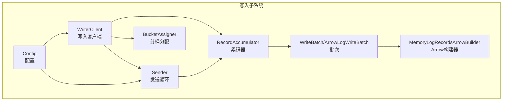
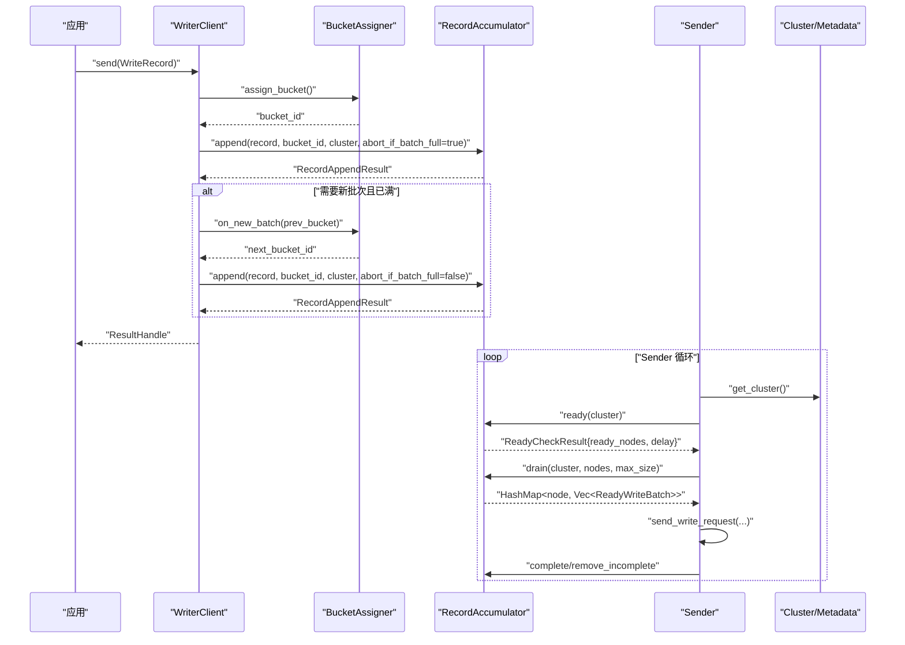
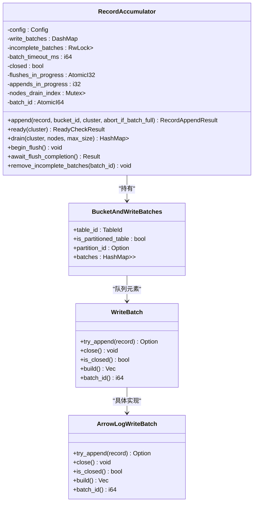
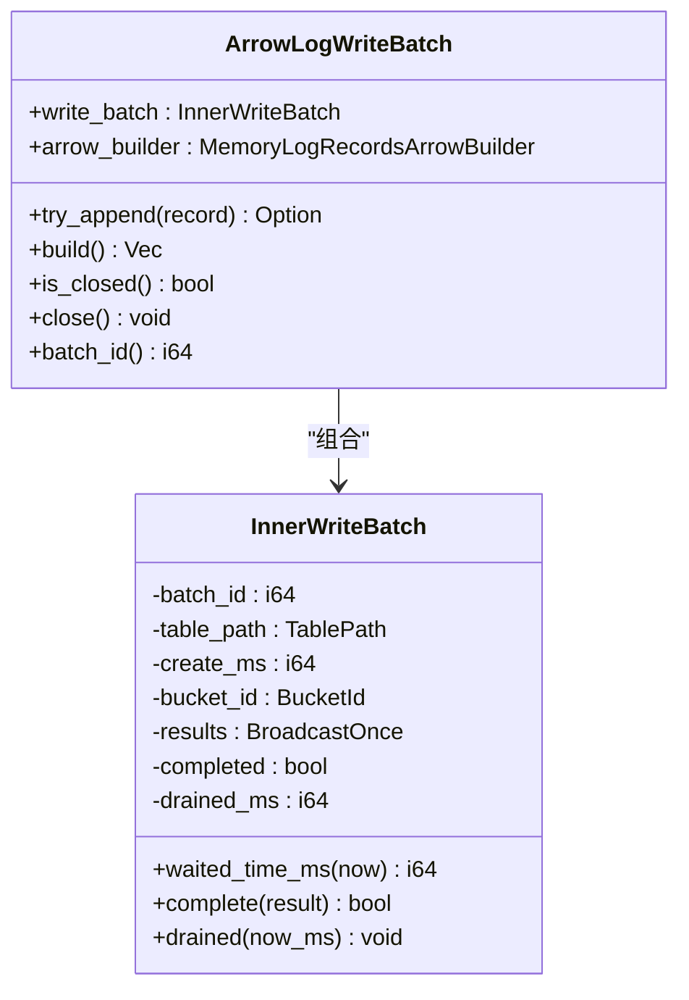
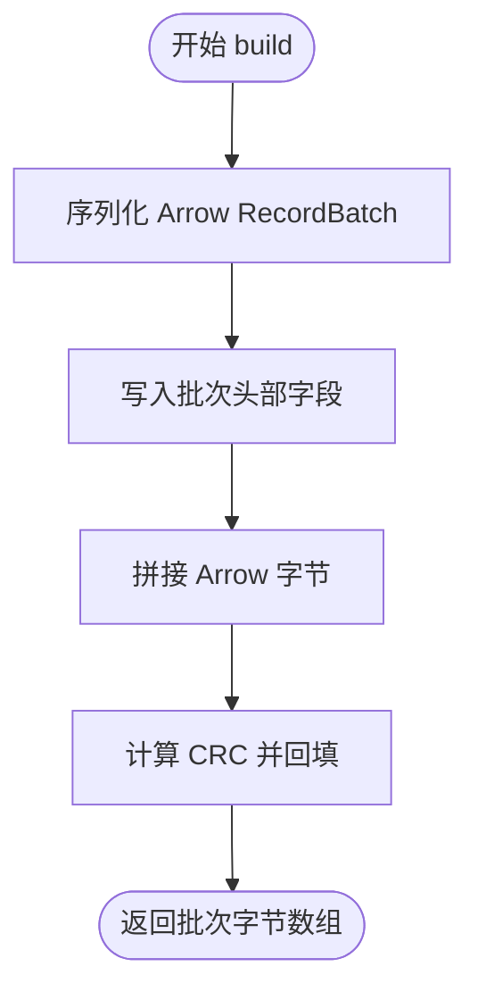
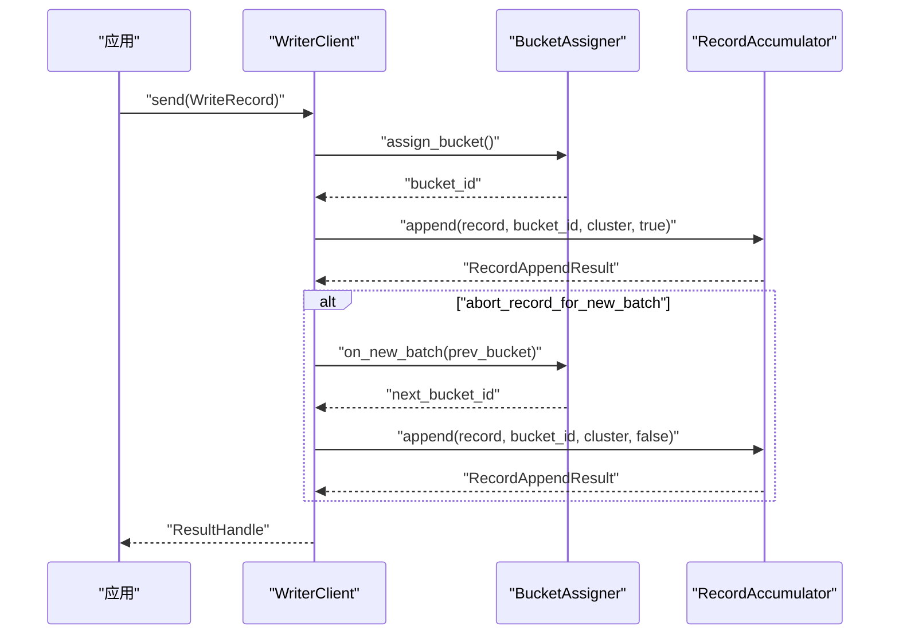
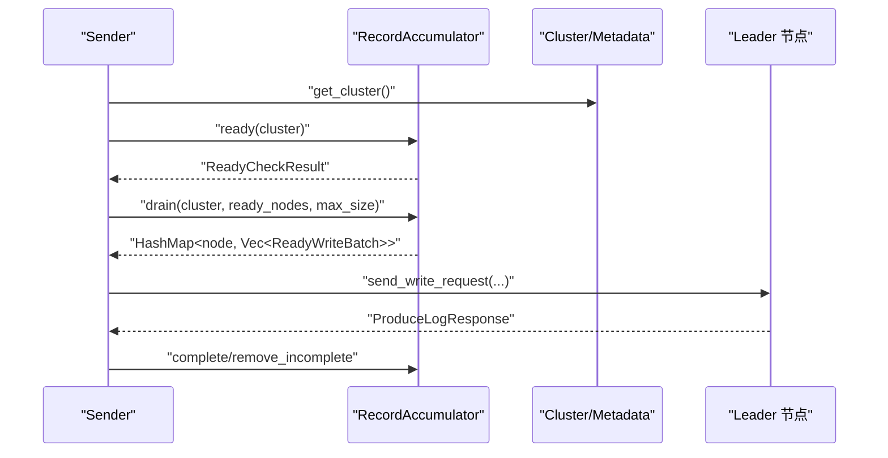
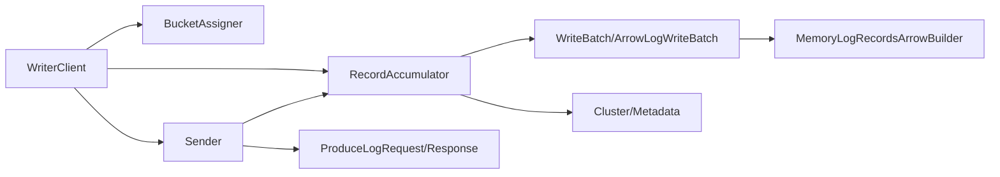

# 批量写入机制

<cite>
**本文引用的文件**
- [crates/fluss/src/client/write/accumulator.rs](file://crates/fluss/src/client/write/accumulator.rs)
- [crates/fluss/src/client/write/batch.rs](file://crates/fluss/src/client/write/batch.rs)
- [crates/fluss/src/client/write/mod.rs](file://crates/fluss/src/client/write/mod.rs)
- [crates/fluss/src/client/write/writer_client.rs](file://crates/fluss/src/client/write/writer_client.rs)
- [crates/fluss/src/client/write/sender.rs](file://crates/fluss/src/client/write/sender.rs)
- [crates/fluss/src/client/write/bucket_assigner.rs](file://crates/fluss/src/client/write/bucket_assigner.rs)
- [crates/fluss/src/config.rs](file://crates/fluss/src/config.rs)
- [crates/fluss/src/record/arrow.rs](file://crates/fluss/src/record/arrow.rs)
- [crates/examples/src/example_table.rs](file://crates/examples/src/example_table.rs)
</cite>

## 目录
1. [简介](#简介)
2. [项目结构](#项目结构)
3. [核心组件](#核心组件)
4. [架构总览](#架构总览)
5. [详细组件分析](#详细组件分析)
6. [依赖关系分析](#依赖关系分析)
7. [性能考量](#性能考量)
8. [故障排查指南](#故障排查指南)
9. [结论](#结论)
10. [附录：配置与使用示例](#附录配置与使用示例)

## 简介
本文件系统性阐述 Fluss 客户端的批量写入机制，重点围绕 BatchAccumulator（在代码中实现为 RecordAccumulator）的工作原理展开，包括：
- 如何收集与管理 WriteRecord
- 批次大小与动态调整策略
- Batch 的创建、填充、发送流程
- 内存管理与缓冲区优化
- 状态管理、容量控制与超时机制
- 批量写入与单条写入的性能差异与最佳实践
- 配置与使用示例路径

## 项目结构
批量写入相关代码主要位于客户端模块的 write 子模块中，核心文件如下：
- 累积器与结果句柄：accumulator.rs
- 批次与 Arrow 构建器：batch.rs、arrow.rs
- 写入客户端与发送循环：writer_client.rs、sender.rs
- 分桶分配策略：bucket_assigner.rs
- 配置项：config.rs
- 公共类型与记录封装：mod.rs

图表来源
- [crates/fluss/src/client/write/accumulator.rs](file://crates/fluss/src/client/write/accumulator.rs#L35-L443)
- [crates/fluss/src/client/write/batch.rs](file://crates/fluss/src/client/write/batch.rs#L67-L177)
- [crates/fluss/src/record/arrow.rs](file://crates/fluss/src/record/arrow.rs#L92-L230)
- [crates/fluss/src/client/write/writer_client.rs](file://crates/fluss/src/client/write/writer_client.rs#L32-L148)
- [crates/fluss/src/client/write/sender.rs](file://crates/fluss/src/client/write/sender.rs#L31-L208)
- [crates/fluss/src/client/write/bucket_assigner.rs](file://crates/fluss/src/client/write/bucket_assigner.rs#L23-L103)
- [crates/fluss/src/config.rs](file://crates/fluss/src/config.rs#L21-L40)

章节来源
- [crates/fluss/src/client/write/mod.rs](file://crates/fluss/src/client/write/mod.rs#L18-L69)

## 核心组件
- RecordAccumulator（累积器）
  - 负责按表与分桶聚合 WriteRecord，维护批次队列、未完成批次集合、超时与并发状态等
  - 提供 append、ready、drain 等关键方法
- WriteBatch 与 ArrowLogWriteBatch
  - 封装批次内部状态与 Arrow 构建器，支持尝试追加、关闭、估算大小、构建字节流
- MemoryLogRecordsArrowBuilder
  - 基于 Arrow 的内存构建器，负责将 GenericRow 追加到列式数组，并最终序列化为批次字节
- WriterClient
  - 对外暴露 send 接口，负责分桶分配、调用累积器、处理“新批次导致的重试”等
- Sender
  - 后台运行的发送循环，周期性检查 ready 节点、从累积器取出批次并发送
- BucketAssigner
  - 分桶分配策略接口，默认采用粘性分配，保证同一批次内记录尽量落在同一分桶
- Config
  - 包含请求最大尺寸、确认策略、重试次数、批大小等关键参数

章节来源
- [crates/fluss/src/client/write/accumulator.rs](file://crates/fluss/src/client/write/accumulator.rs#L35-L443)
- [crates/fluss/src/client/write/batch.rs](file://crates/fluss/src/client/write/batch.rs#L67-L177)
- [crates/fluss/src/record/arrow.rs](file://crates/fluss/src/record/arrow.rs#L92-L230)
- [crates/fluss/src/client/write/writer_client.rs](file://crates/fluss/src/client/write/writer_client.rs#L32-L148)
- [crates/fluss/src/client/write/sender.rs](file://crates/fluss/src/client/write/sender.rs#L31-L208)
- [crates/fluss/src/client/write/bucket_assigner.rs](file://crates/fluss/src/client/write/bucket_assigner.rs#L23-L103)
- [crates/fluss/src/config.rs](file://crates/fluss/src/config.rs#L21-L40)

## 架构总览
批量写入的整体流程如下：
- 应用通过 WriterClient.send 发送 WriteRecord
- WriterClient 使用 BucketAssigner 计算目标分桶，调用 RecordAccumulator.append 尝试追加到现有批次或创建新批次
- Sender 后台循环调用 RecordAccumulator.ready 检查可发送节点，再通过 drain 取出批次，组装请求并发送
- 发送完成后通过完成回调通知累积器移除未完成批次

图表来源
- [crates/fluss/src/client/write/writer_client.rs](file://crates/fluss/src/client/write/writer_client.rs#L89-L123)
- [crates/fluss/src/client/write/accumulator.rs](file://crates/fluss/src/client/write/accumulator.rs#L128-L162)
- [crates/fluss/src/client/write/sender.rs](file://crates/fluss/src/client/write/sender.rs#L72-L106)
- [crates/fluss/src/client/write/bucket_assigner.rs](file://crates/fluss/src/client/write/bucket_assigner.rs#L85-L102)

## 详细组件分析

### RecordAccumulator（累积器）
- 数据结构
  - 以 TablePath 为键，映射到每个表的分桶批次队列（VecDeque<WriteBatch>），并以分桶 ID 为键
  - 维护未完成批次集合（batch_id -> ResultHandle），用于 flush 等场景等待完成
  - 超时阈值、关闭标志、并发计数、节点轮询索引等
- 关键方法
  - append：尝试向当前队列尾部批次追加；若失败则创建新批次并插入队列
  - ready：遍历所有表/分桶，计算批次等待时间与是否已满，判定节点是否可发送
  - drain：按节点轮询策略从各分桶取出可发送批次，累计大小不超过请求上限
  - flush 相关：begin_flush、await_flush_completion、remove_incomplete_batches
- 动态调整与超时
  - 通过 waited_time_ms 与 batch_timeout_ms 判断是否到期触发发送
  - 支持“已满即发”和“到期即发”，以及关闭/正在刷新时的特殊处理

图表来源
- [crates/fluss/src/client/write/accumulator.rs](file://crates/fluss/src/client/write/accumulator.rs#L35-L443)
- [crates/fluss/src/client/write/batch.rs](file://crates/fluss/src/client/write/batch.rs#L67-L177)

章节来源
- [crates/fluss/src/client/write/accumulator.rs](file://crates/fluss/src/client/write/accumulator.rs#L48-L373)

### WriteBatch 与 ArrowLogWriteBatch
- WriteBatch 是枚举包装，统一对外接口（try_append、close、is_closed、build、batch_id 等）
- ArrowLogWriteBatch 内部持有 InnerWriteBatch 与 MemoryLogRecordsArrowBuilder
- try_append：当构建器未关闭且未满时追加记录并返回 ResultHandle；否则返回 None
- build：将列式数据序列化为批次字节流
- close/is_closed：控制批次生命周期

图表来源
- [crates/fluss/src/client/write/batch.rs](file://crates/fluss/src/client/write/batch.rs#L28-L177)
- [crates/fluss/src/record/arrow.rs](file://crates/fluss/src/record/arrow.rs#L92-L230)

章节来源
- [crates/fluss/src/client/write/batch.rs](file://crates/fluss/src/client/write/batch.rs#L67-L177)
- [crates/fluss/src/record/arrow.rs](file://crates/fluss/src/record/arrow.rs#L104-L177)

### MemoryLogRecordsArrowBuilder（内存批次构建器）
- 负责将 GenericRow 追加到列式数组构建器，达到上限后关闭
- build：先写出 Arrow RecordBatch，再拼接批次头与校验和，输出完整批次字节
- is_full：基于默认最大记录数判断是否满载
- close：标记批次关闭，后续无法再追加

图表来源
- [crates/fluss/src/record/arrow.rs](file://crates/fluss/src/record/arrow.rs#L150-L185)

章节来源
- [crates/fluss/src/record/arrow.rs](file://crates/fluss/src/record/arrow.rs#L92-L230)

### WriterClient（写入客户端）
- 对外提供 send 接口：选择/缓存 BucketAssigner，计算 bucket_id，调用累积器 append
- 若累积器返回“新批次且已满”，则触发 on_new_batch 并重新 append
- 返回 ResultHandle 以便上层等待写入结果

图表来源
- [crates/fluss/src/client/write/writer_client.rs](file://crates/fluss/src/client/write/writer_client.rs#L89-L123)
- [crates/fluss/src/client/write/bucket_assigner.rs](file://crates/fluss/src/client/write/bucket_assigner.rs#L85-L102)

章节来源
- [crates/fluss/src/client/write/writer_client.rs](file://crates/fluss/src/client/write/writer_client.rs#L32-L148)
- [crates/fluss/src/client/write/bucket_assigner.rs](file://crates/fluss/src/client/write/bucket_assigner.rs#L23-L103)

### Sender（发送循环）
- run_once：获取集群、调用累积器 ready，必要时更新元数据，按节点轮询 drain，发送请求并处理响应
- send_write_request：按表聚合批次，构造请求并发送
- handle_produce_response：根据响应完成批次，移除 in-flight 与未完成批次

图表来源
- [crates/fluss/src/client/write/sender.rs](file://crates/fluss/src/client/write/sender.rs#L72-L106)
- [crates/fluss/src/client/write/sender.rs](file://crates/fluss/src/client/write/sender.rs#L132-L167)
- [crates/fluss/src/client/write/sender.rs](file://crates/fluss/src/client/write/sender.rs#L169-L202)

章节来源
- [crates/fluss/src/client/write/sender.rs](file://crates/fluss/src/client/write/sender.rs#L31-L208)

### 分桶分配策略（BucketAssigner）
- 接口定义：abort_if_batch_full、on_new_batch、assign_bucket
- StickyBucketAssigner 实现：保持粘性，避免频繁切换分桶；在新批次时选择下一个可用分桶

章节来源
- [crates/fluss/src/client/write/bucket_assigner.rs](file://crates/fluss/src/client/write/bucket_assigner.rs#L23-L103)

## 依赖关系分析
- WriterClient 依赖 BucketAssigner、RecordAccumulator、Sender 与 Metadata
- RecordAccumulator 依赖 Cluster、Config、ResultHandle、WriteBatch/ArrowLogWriteBatch
- Sender 依赖 Metadata、RecordAccumulator、RPC 层（ProducerLogRequest/Response）
- ArrowLogWriteBatch 依赖 MemoryLogRecordsArrowBuilder
- MemoryLogRecordsArrowBuilder 依赖 Arrow 的 RecordBatch/StreamWriter

图表来源
- [crates/fluss/src/client/write/writer_client.rs](file://crates/fluss/src/client/write/writer_client.rs#L32-L77)
- [crates/fluss/src/client/write/sender.rs](file://crates/fluss/src/client/write/sender.rs#L31-L61)
- [crates/fluss/src/client/write/accumulator.rs](file://crates/fluss/src/client/write/accumulator.rs#L35-L46)
- [crates/fluss/src/client/write/batch.rs](file://crates/fluss/src/client/write/batch.rs#L130-L177)
- [crates/fluss/src/record/arrow.rs](file://crates/fluss/src/record/arrow.rs#L92-L125)

章节来源
- [crates/fluss/src/client/write/mod.rs](file://crates/fluss/src/client/write/mod.rs#L18-L69)

## 性能考量
- 批次大小与动态调整
  - 批次满载（Arrow 构建器达到上限）或到期（waited_time_ms >= batch_timeout_ms）即触发发送
  - 请求最大尺寸由配置决定，Sender 在 drain 时严格控制不超过 max_size
- 内存与缓冲区优化
  - Arrow 列式构建器按列追加，减少行式复制开销
  - build 时先序列化 Arrow 再拼接批次头与校验，避免重复拷贝
- 并发与吞吐
  - 使用 DashMap 与 Mutex 保护分桶队列，降低锁粒度
  - Sender 采用后台循环，按节点轮询 drain，提高整体吞吐
- 单条 vs 批量
  - 批量写入显著降低网络往返与协议开销，适合高 QPS 场景
  - 单条写入延迟更低但吞吐受限，适合低频或实时性要求极高的场景

[本节为通用性能讨论，不直接分析具体文件]

## 故障排查指南
- 常见问题
  - 未知主节点：ready 检查会收集 unknown_leader_tables，Sender 会在下一轮更新元数据
  - 发送失败：handle_produce_response 中对错误码进行处理（当前为占位），需结合实际错误码完善
  - flush 未完成：begin_flush 与 await_flush_completion 用于等待未完成批次完成
- 排查步骤
  - 检查 batch_timeout_ms 与请求大小是否合理
  - 观察 Sender 的 sleep 延迟与 ready_nodes 数量
  - 确认分桶分配策略是否导致热点分桶

章节来源
- [crates/fluss/src/client/write/sender.rs](file://crates/fluss/src/client/write/sender.rs#L72-L106)
- [crates/fluss/src/client/write/sender.rs](file://crates/fluss/src/client/write/sender.rs#L169-L186)
- [crates/fluss/src/client/write/accumulator.rs](file://crates/fluss/src/client/write/accumulator.rs#L361-L373)

## 结论
Fluss 的批量写入机制通过 RecordAccumulator 对 WriteRecord 进行高效累积，结合 Arrow 列式构建与 Sender 的后台发送循环，实现了高吞吐、低延迟的写入路径。通过超时与满载双重触发、请求大小限制与粘性分桶策略，系统在不同负载下均能保持稳定性能。建议在生产环境中根据数据特征与网络条件合理配置批大小与请求上限，并结合监控指标持续优化。

[本节为总结性内容，不直接分析具体文件]

## 附录：配置与使用示例

### 关键配置项
- request_max_size：请求最大字节数
- writer_acks：确认策略（如 all）
- writer_retries：重试次数
- writer_batch_size：批大小（影响 Arrow 构建器上限）

章节来源
- [crates/fluss/src/config.rs](file://crates/fluss/src/config.rs#L21-L40)

### 使用示例（路径）
- 示例程序展示了如何创建表、写入多行并刷写，可作为批量写入的参考入口
  - 示例路径：[crates/examples/src/example_table.rs](file://crates/examples/src/example_table.rs#L55-L68)

章节来源
- [crates/examples/src/example_table.rs](file://crates/examples/src/example_table.rs#L55-L68)