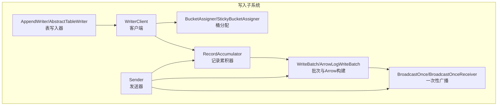
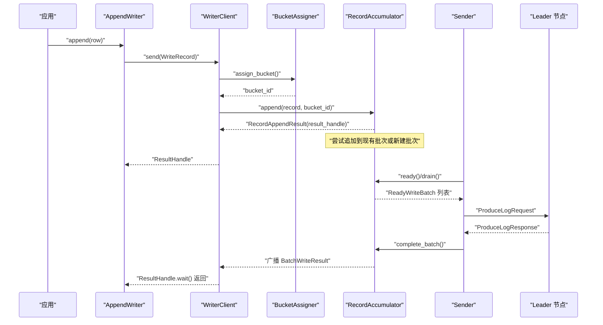
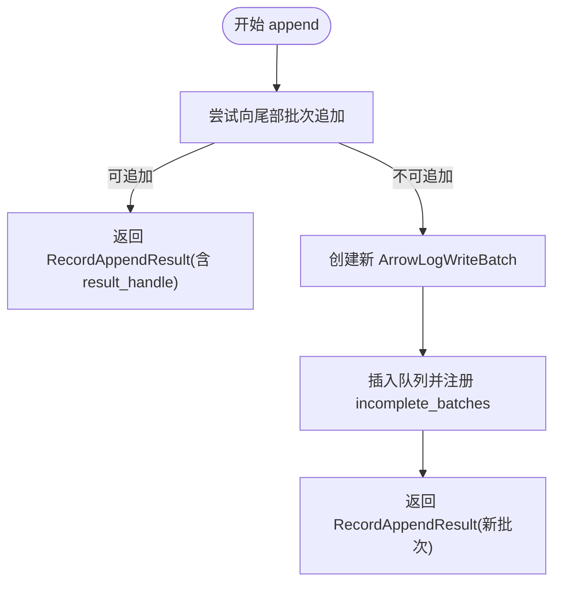
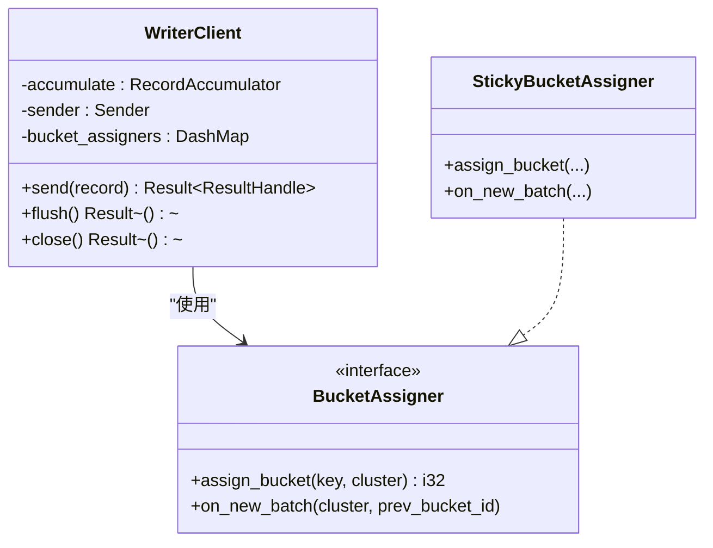
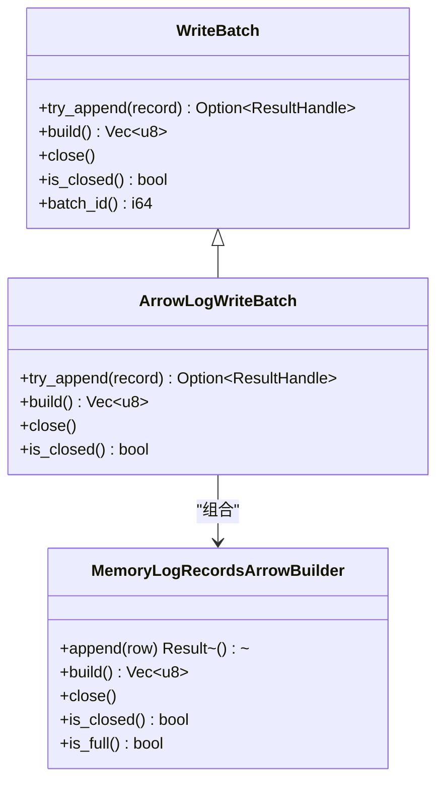
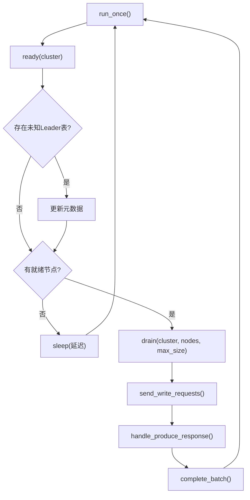
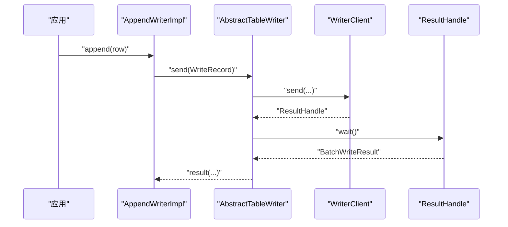
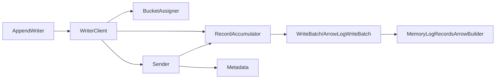

# 数据写入功能

<cite>
**本文引用的文件**
- [crates/fluss/src/client/write/mod.rs](file://crates/fluss/src/client/write/mod.rs)
- [crates/fluss/src/client/write/accumulator.rs](file://crates/fluss/src/client/write/accumulator.rs)
- [crates/fluss/src/client/write/writer_client.rs](file://crates/fluss/src/client/write/writer_client.rs)
- [crates/fluss/src/client/write/batch.rs](file://crates/fluss/src/client/write/batch.rs)
- [crates/fluss/src/client/write/sender.rs](file://crates/fluss/src/client/write/sender.rs)
- [crates/fluss/src/client/write/bucket_assigner.rs](file://crates/fluss/src/client/write/bucket_assigner.rs)
- [crates/fluss/src/client/write/broadcast.rs](file://crates/fluss/src/client/write/broadcast.rs)
- [crates/fluss/src/client/table/writer.rs](file://crates/fluss/src/client/table/writer.rs)
- [crates/fluss/src/record/arrow.rs](file://crates/fluss/src/record/arrow.rs)
- [crates/fluss/src/config.rs](file://crates/fluss/src/config.rs)
- [crates/fluss/src/error.rs](file://crates/fluss/src/error.rs)
- [crates/examples/src/example_table.rs](file://crates/examples/src/example_table.rs)
</cite>

## 目录
1. [简介](#简介)
2. [项目结构](#项目结构)
3. [核心组件](#核心组件)
4. [架构总览](#架构总览)
5. [详细组件分析](#详细组件分析)
6. [依赖关系分析](#依赖关系分析)
7. [性能考量](#性能考量)
8. [故障排查指南](#故障排查指南)
9. [结论](#结论)
10. [附录：使用示例与调优建议](#附录使用示例与调优建议)

## 简介
本文件系统性阐述 Fluss 客户端的数据写入能力，重点覆盖以下方面：
- 批量写入机制的实现原理：BatchAccumulator 的组织与调度、WriterClient 的调度策略
- AppendWriter 的使用方法：RecordBatch 的创建、写入执行与结果确认
- 性能优化策略：批大小、内存管理、并发控制
- 错误处理与重试机制：网络异常、服务器错误的处理路径
- 实际示例：单条写入、批量写入、事务性写入（基于现有能力的合理扩展说明）
- 基准测试与调优建议：结合配置参数与运行时行为进行指导

## 项目结构
写入子系统主要位于 crates/fluss/src/client/write 下，围绕“记录累积 → 批次构建 → 发送器调度 → 结果广播”这一流水线展开；同时通过表层抽象 AppendWriter 提供易用的写入接口。

**图表来源**
- [crates/fluss/src/client/write/accumulator.rs](file://crates/fluss/src/client/write/accumulator.rs#L35-L443)
- [crates/fluss/src/client/write/batch.rs](file://crates/fluss/src/client/write/batch.rs#L67-L177)
- [crates/fluss/src/client/write/broadcast.rs](file://crates/fluss/src/client/write/broadcast.rs#L35-L120)
- [crates/fluss/src/client/write/sender.rs](file://crates/fluss/src/client/write/sender.rs#L31-L208)
- [crates/fluss/src/client/write/writer_client.rs](file://crates/fluss/src/client/write/writer_client.rs#L32-L148)
- [crates/fluss/src/client/write/bucket_assigner.rs](file://crates/fluss/src/client/write/bucket_assigner.rs#L23-L103)
- [crates/fluss/src/client/table/writer.rs](file://crates/fluss/src/client/table/writer.rs#L26-L89)

**章节来源**
- [crates/fluss/src/client/write/mod.rs](file://crates/fluss/src/client/write/mod.rs#L18-L69)

## 核心组件
- RecordAccumulator：按表与桶维度维护批次队列，负责记录追加、批次关闭、就绪节点判定与批次抽取
- WriteBatch/ArrowLogWriteBatch：封装 Arrow 构建器，支持追加记录、批次序列化与完成回调
- Sender：周期性检查就绪节点，收集批次并发起 RPC 写入请求，处理响应并完成批次
- WriterClient：对外暴露 send 接口，内部协调桶分配、累积器与发送器
- BucketAssigner/StickyBucketAssigner：粘性桶分配策略，保证同一批次内记录尽量落到同一桶
- BroadcastOnce/BroadcastOnceReceiver：一次性广播通道，用于批次写入结果的异步通知
- AppendWriter/AbstractTableWriter：面向表的写入抽象，提供 append 等高层接口

**章节来源**
- [crates/fluss/src/client/write/accumulator.rs](file://crates/fluss/src/client/write/accumulator.rs#L35-L443)
- [crates/fluss/src/client/write/batch.rs](file://crates/fluss/src/client/write/batch.rs#L67-L177)
- [crates/fluss/src/client/write/sender.rs](file://crates/fluss/src/client/write/sender.rs#L31-L208)
- [crates/fluss/src/client/write/writer_client.rs](file://crates/fluss/src/client/write/writer_client.rs#L32-L148)
- [crates/fluss/src/client/write/bucket_assigner.rs](file://crates/fluss/src/client/write/bucket_assigner.rs#L23-L103)
- [crates/fluss/src/client/write/broadcast.rs](file://crates/fluss/src/client/write/broadcast.rs#L35-L120)
- [crates/fluss/src/client/table/writer.rs](file://crates/fluss/src/client/table/writer.rs#L26-L89)

## 架构总览
写入流程从应用侧的 AppendWriter 开始，经由 WriterClient 将记录分配到目标桶，交由 RecordAccumulator 累积为 WriteBatch，再由 Sender 周期性地将就绪批次发送至对应 Leader 节点，最终通过 BroadcastOnce 回传写入结果。

**图表来源**
- [crates/fluss/src/client/table/writer.rs](file://crates/fluss/src/client/table/writer.rs#L63-L88)
- [crates/fluss/src/client/write/writer_client.rs](file://crates/fluss/src/client/write/writer_client.rs#L89-L123)
- [crates/fluss/src/client/write/accumulator.rs](file://crates/fluss/src/client/write/accumulator.rs#L128-L162)
- [crates/fluss/src/client/write/sender.rs](file://crates/fluss/src/client/write/sender.rs#L120-L167)
- [crates/fluss/src/client/write/broadcast.rs](file://crates/fluss/src/client/write/broadcast.rs#L97-L105)

## 详细组件分析

### RecordAccumulator（批量累积器）
- 组织结构
  - 按 TablePath 分组，再按 BucketId 分桶，每个桶维护 VecDeque<WriteBatch>
  - 维护 incomplete_batches 映射，用于在发送完成后清理
- 追加逻辑
  - 先尝试向尾部批次追加；若满则新建批次并插入队列
  - 新建批次时生成唯一 batch_id，并注册 ResultHandle
- 就绪判定
  - 遍历各桶首个批次，依据等待时间、是否已满、是否关闭、是否存在待发送等条件判断节点就绪
- 抽取逻辑
  - 按节点轮询各桶，按最大请求大小聚合批次，标记为已抽取（drained）

**图表来源**
- [crates/fluss/src/client/write/accumulator.rs](file://crates/fluss/src/client/write/accumulator.rs#L63-L126)

**章节来源**
- [crates/fluss/src/client/write/accumulator.rs](file://crates/fluss/src/client/write/accumulator.rs#L35-L443)

### WriterClient（写入客户端）
- 角色与职责
  - 创建并持有 RecordAccumulator 与 Sender
  - 对外提供 send 接口，内部完成桶分配、累积与结果等待
  - 支持 flush：标记开始刷新并等待所有未完成批次完成
- 桶分配
  - 使用 StickyBucketAssigner，保证同一批次内记录尽量落在同一桶
- 发送触发
  - 当累积器报告批次已满或新建批次时，可触发后续发送器检查（当前代码中预留了触发位置）

**图表来源**
- [crates/fluss/src/client/write/writer_client.rs](file://crates/fluss/src/client/write/writer_client.rs#L32-L148)
- [crates/fluss/src/client/write/bucket_assigner.rs](file://crates/fluss/src/client/write/bucket_assigner.rs#L23-L103)

**章节来源**
- [crates/fluss/src/client/write/writer_client.rs](file://crates/fluss/src/client/write/writer_client.rs#L32-L148)

### WriteBatch 与 ArrowLogWriteBatch（批次与序列化）
- ArrowLogWriteBatch
  - 内部持有 MemoryLogRecordsArrowBuilder，支持追加记录、批次关闭、序列化为字节流
  - 提供 try_append 返回 ResultHandle，以便写入完成后回传结果
- WriteBatch 枚举
  - 当前仅 ArrowLog 分支，统一对外接口（追加、关闭、序列化、完成、批次ID等）

**图表来源**
- [crates/fluss/src/client/write/batch.rs](file://crates/fluss/src/client/write/batch.rs#L67-L177)
- [crates/fluss/src/record/arrow.rs](file://crates/fluss/src/record/arrow.rs#L92-L230)

**章节来源**
- [crates/fluss/src/client/write/batch.rs](file://crates/fluss/src/client/write/batch.rs#L67-L177)
- [crates/fluss/src/record/arrow.rs](file://crates/fluss/src/record/arrow.rs#L92-L230)

### Sender（发送器）
- 运行循环
  - ready：查询累积器就绪节点与下一次检查延迟
  - 若存在未知 Leader 表，先更新元数据
  - drain：按最大请求大小聚合批次
  - send_write_request：构造 ProduceLogRequest 并发送
- 响应处理
  - handle_produce_response：根据响应中的错误码处理失败，否则 complete_batch
  - complete_batch：完成批次广播、移除 in-flight 与 incomplete_batches

**图表来源**
- [crates/fluss/src/client/write/sender.rs](file://crates/fluss/src/client/write/sender.rs#L63-L167)

**章节来源**
- [crates/fluss/src/client/write/sender.rs](file://crates/fluss/src/client/write/sender.rs#L31-L208)

### AppendWriter（表写入器）
- AbstractTableWriter
  - send：调用 WriterClient.send，拿到 ResultHandle 后等待并校验结果
- AppendWriterImpl
  - append：将 GenericRow 包装为 WriteRecord 并委托 AbstractTableWriter.send

**图表来源**
- [crates/fluss/src/client/table/writer.rs](file://crates/fluss/src/client/table/writer.rs#L63-L88)

**章节来源**
- [crates/fluss/src/client/table/writer.rs](file://crates/fluss/src/client/table/writer.rs#L26-L89)

## 依赖关系分析
- WriterClient 依赖 BucketAssigner、RecordAccumulator、Sender、Metadata
- Sender 依赖 Metadata、RecordAccumulator、RPC 请求/响应类型
- RecordAccumulator 依赖 Cluster、Config、WriteBatch、ResultHandle
- WriteBatch 依赖 Arrow 构建器与广播通道
- AppendWriter 依赖 WriterClient 与 ResultHandle

**图表来源**
- [crates/fluss/src/client/write/writer_client.rs](file://crates/fluss/src/client/write/writer_client.rs#L32-L148)
- [crates/fluss/src/client/write/sender.rs](file://crates/fluss/src/client/write/sender.rs#L31-L208)
- [crates/fluss/src/client/write/accumulator.rs](file://crates/fluss/src/client/write/accumulator.rs#L35-L443)
- [crates/fluss/src/client/write/batch.rs](file://crates/fluss/src/client/write/batch.rs#L67-L177)
- [crates/fluss/src/record/arrow.rs](file://crates/fluss/src/record/arrow.rs#L92-L230)
- [crates/fluss/src/client/table/writer.rs](file://crates/fluss/src/client/table/writer.rs#L26-L89)

**章节来源**
- [crates/fluss/src/client/write/mod.rs](file://crates/fluss/src/client/write/mod.rs#L18-L69)

## 性能考量
- 批大小与压缩
  - ArrowLogWriteBatch 在 build 时序列化为 Arrow RecordBatch 并计算 CRC，整体吞吐受批次大小与压缩影响
  - 可通过配置 request_max_size 控制单次请求上限，避免单批次过大导致 RPC 超时
- 内存管理
  - MemoryLogRecordsArrowBuilder 按字段类型动态构建数组，记录数达到阈值后关闭批次
  - 建议根据表模式与数据分布选择合适的批次大小，平衡内存占用与序列化开销
- 并发控制
  - RecordAccumulator 使用 DashMap 与 Mutex 保护桶队列，Sender 以节点为单位聚合批次
  - 可通过并发写入任务数与桶数量协调，避免热点桶导致的争用
- 调度与延迟
  - 等待超时 batch_timeout_ms 决定提前发送的时机；过短可能频繁发送，过长会增加延迟
  - Sender 的 sleep 延迟由就绪检查结果决定，避免忙轮询

**章节来源**
- [crates/fluss/src/record/arrow.rs](file://crates/fluss/src/record/arrow.rs#L138-L148)
- [crates/fluss/src/client/write/accumulator.rs](file://crates/fluss/src/client/write/accumulator.rs#L164-L188)
- [crates/fluss/src/client/write/sender.rs](file://crates/fluss/src/client/write/sender.rs#L83-L89)
- [crates/fluss/src/config.rs](file://crates/fluss/src/config.rs#L28-L39)

## 故障排查指南
- 写入阻塞
  - 现象：ResultHandle.wait() 长时间不返回
  - 排查：检查 Sender 是否在运行、就绪节点是否可达、incomplete_batches 是否被清理
- 未知 Leader
  - 现象：ready 检查返回 unknown_leader_tables
  - 处理：Sender 会在下一轮自动更新元数据；若持续出现，检查集群状态与路由
- RPC 错误
  - 现象：handle_produce_response 中出现错误码
  - 处理：当前实现对错误码为待完善，建议在生产环境补充具体错误处理与重试
- 关闭与刷新
  - flush 会标记开始刷新并等待未完成批次完成；确保在退出前调用 flush 以避免数据丢失

**章节来源**
- [crates/fluss/src/client/write/sender.rs](file://crates/fluss/src/client/write/sender.rs#L77-L81)
- [crates/fluss/src/client/write/sender.rs](file://crates/fluss/src/client/write/sender.rs#L169-L186)
- [crates/fluss/src/client/write/writer_client.rs](file://crates/fluss/src/client/write/writer_client.rs#L137-L141)
- [crates/fluss/src/error.rs](file://crates/fluss/src/error.rs#L25-L50)

## 结论
该写入子系统采用“累积 + 批处理 + 异步广播”的设计，具备良好的可扩展性与可观测性。通过 RecordAccumulator 的就绪判定与 Sender 的周期调度，实现了高吞吐低延迟的写入路径。建议在生产环境中完善错误处理与重试策略，并结合配置参数进行针对性调优。

## 附录：使用示例与调优建议
- 单条写入
  - 使用 AppendWriterImpl.append(row)，内部通过 WriterClient.send 发送并等待结果
  - 示例参考：[示例程序](file://crates/examples/src/example_table.rs#L61-L67)
- 批量写入
  - 通过多次 append 并在最后调用 flush 等待全部完成
  - 示例参考：[示例程序](file://crates/examples/src/example_table.rs#L61-L67)
- 事务性写入
  - 当前实现未提供强一致事务语义；可通过“先写入临时表，再原子性切换”等方案模拟事务
- 调优建议
  - 批大小：结合数据类型与记录数，调整 writer_batch_size 与 request_max_size
  - 并发：根据桶数量与节点负载，合理设置并发写入任务数
  - 超时：根据网络状况与服务端延迟，适当调整 batch_timeout_ms 与 writer_retries

**章节来源**
- [crates/examples/src/example_table.rs](file://crates/examples/src/example_table.rs#L55-L67)
- [crates/fluss/src/config.rs](file://crates/fluss/src/config.rs#L28-L39)
- [crates/fluss/src/client/table/writer.rs](file://crates/fluss/src/client/table/writer.rs#L63-L88)