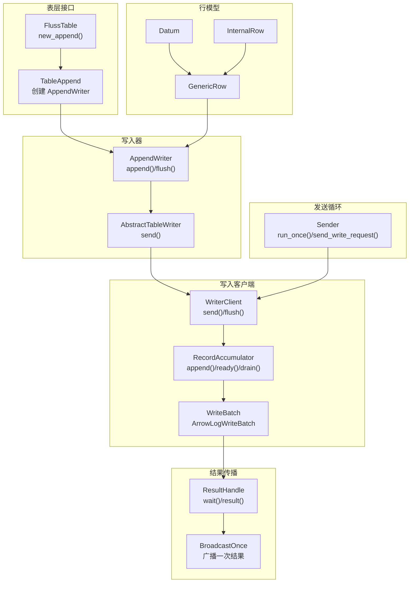
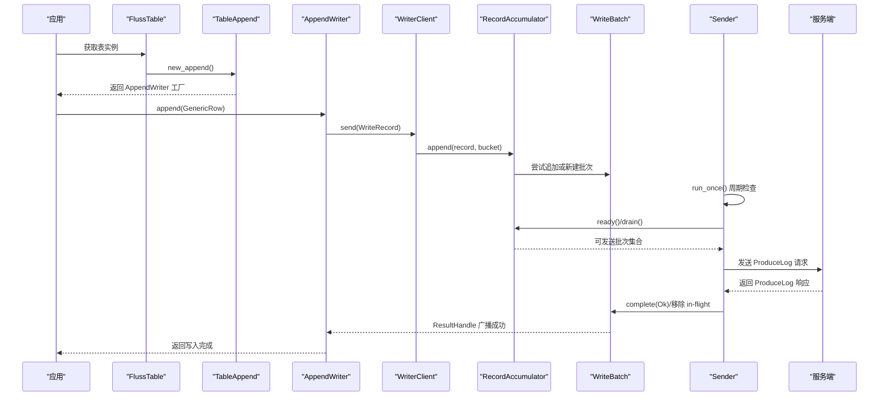
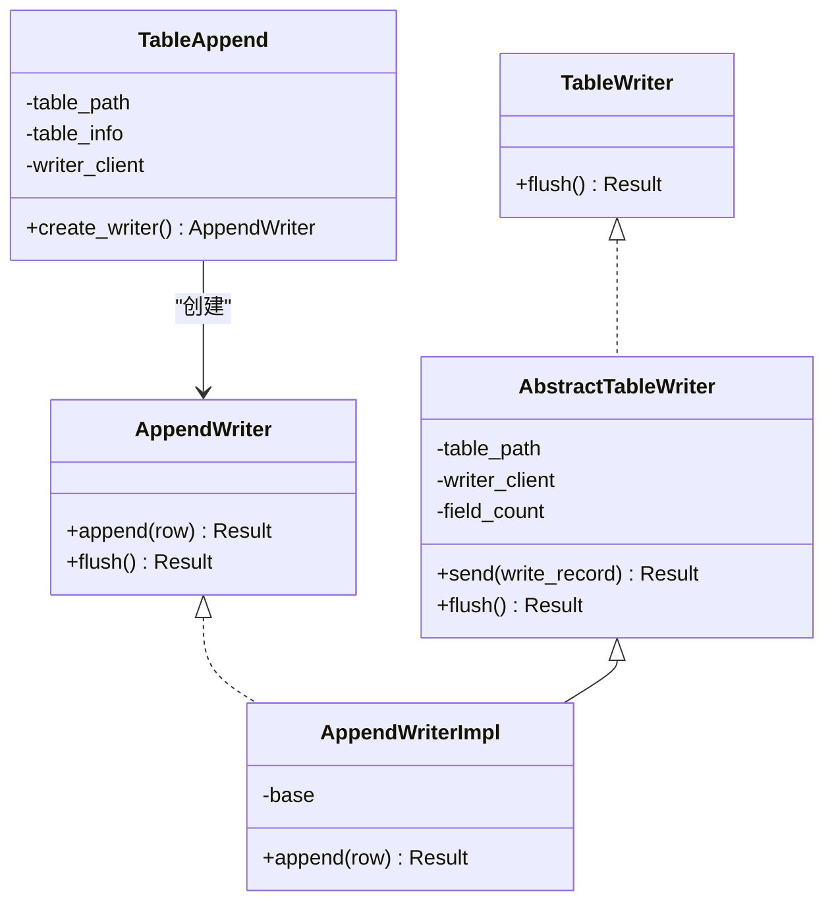
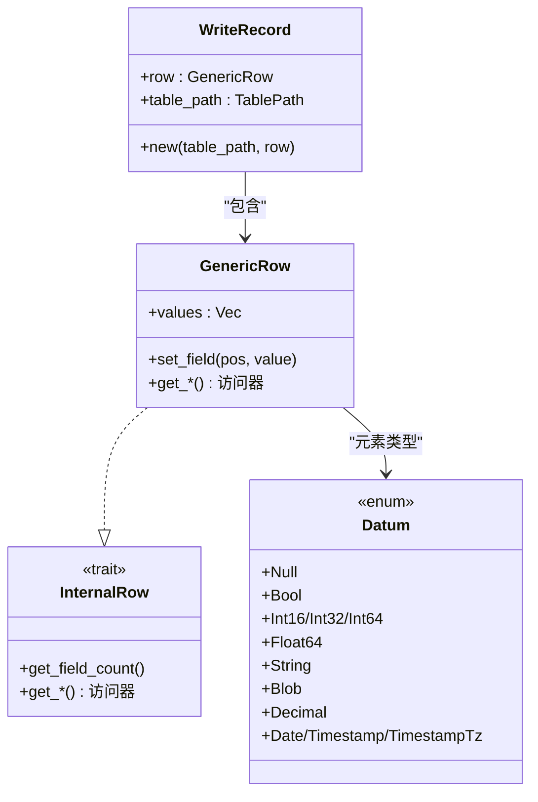
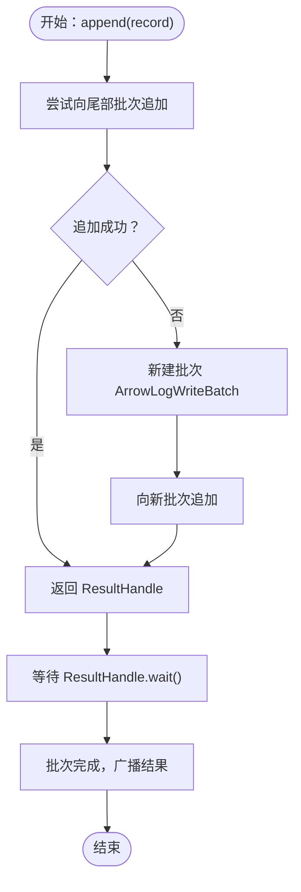
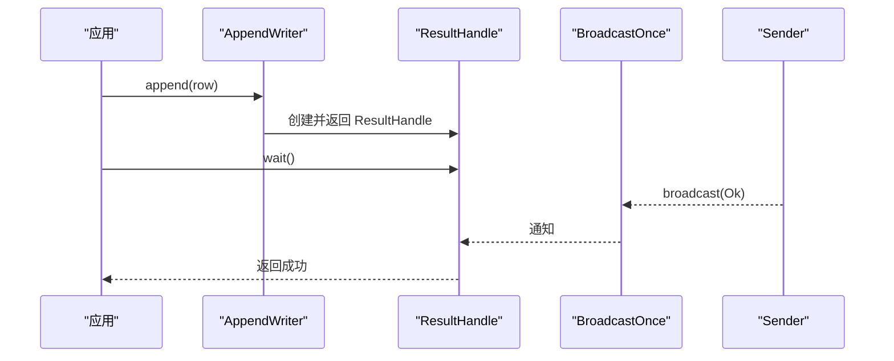
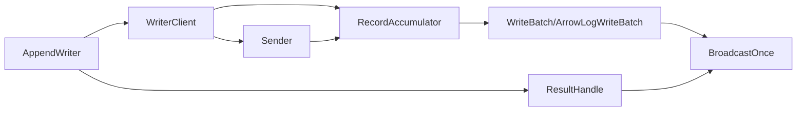

# 追加写入器

<cite>
**本文引用的文件**
- [crates/fluss/src/client/table/writer.rs](file://crates/fluss/src/client/table/writer.rs)
- [crates/fluss/src/client/table/append.rs](file://crates/fluss/src/client/table/append.rs)
- [crates/fluss/src/client/table/mod.rs](file://crates/fluss/src/client/table/mod.rs)
- [crates/fluss/src/client/write/mod.rs](file://crates/fluss/src/client/write/mod.rs)
- [crates/fluss/src/client/write/writer_client.rs](file://crates/fluss/src/client/write/writer_client.rs)
- [crates/fluss/src/client/write/accumulator.rs](file://crates/fluss/src/client/write/accumulator.rs)
- [crates/fluss/src/client/write/batch.rs](file://crates/fluss/src/client/write/batch.rs)
- [crates/fluss/src/client/write/sender.rs](file://crates/fluss/src/client/write/sender.rs)
- [crates/fluss/src/client/write/broadcast.rs](file://crates/fluss/src/client/write/broadcast.rs)
- [crates/fluss/src/row/mod.rs](file://crates/fluss/src/row/mod.rs)
- [crates/fluss/src/row/datum.rs](file://crates/fluss/src/row/datum.rs)
- [crates/fluss/src/row/column.rs](file://crates/fluss/src/row/column.rs)
- [crates/fluss/src/record/mod.rs](file://crates/fluss/src/record/mod.rs)
- [crates/examples/src/example_table.rs](file://crates/examples/src/example_table.rs)
</cite>

## 目录
1. [引言](#引言)
2. [项目结构](#项目结构)
3. [核心组件](#核心组件)
4. [架构总览](#架构总览)
5. [详细组件分析](#详细组件分析)
6. [依赖关系分析](#依赖关系分析)
7. [性能考虑](#性能考虑)
8. [故障排查指南](#故障排查指南)
9. [结论](#结论)
10. [附录：使用示例与最佳实践](#附录使用示例与最佳实践)

## 引言
本文件系统性阐述 Fluss 中“追加写入器”（AppendWriter）的设计与使用方法，覆盖以下关键主题：
- 单条记录写入流程：从创建 GenericRow 到写入完成确认的全链路
- 异步等待机制：ResultHandle 的等待与结果处理策略
- 写入生命周期：从记录创建、序列化、批累积、发送、响应确认的全过程
- flush 操作：强制刷新与批量提交的区别及使用场景
- 多种使用场景：简单追加、批量追加、事务性写入（基于现有能力的合理建议）
- 错误处理与性能优化建议

## 项目结构
围绕追加写入器的关键模块组织如下：
- 表级接口与工厂：table/mod.rs、table/append.rs
- 写入器抽象与实现：client/table/writer.rs、client/write/mod.rs
- 写入客户端与批管理：client/write/writer_client.rs、client/write/accumulator.rs、client/write/batch.rs
- 发送循环与网络交互：client/write/sender.rs
- 广播通知与结果传递：client/write/broadcast.rs
- 行模型与数据类型：row/mod.rs、row/datum.rs、row/column.rs
- 记录语义与变更类型：record/mod.rs
- 示例：examples/src/example_table.rs

图表来源
- [crates/fluss/src/client/table/mod.rs](file://crates/fluss/src/client/table/mod.rs#L56-L62)
- [crates/fluss/src/client/table/append.rs](file://crates/fluss/src/client/table/append.rs#L45-L70)
- [crates/fluss/src/client/table/writer.rs](file://crates/fluss/src/client/table/writer.rs#L70-L89)
- [crates/fluss/src/client/write/writer_client.rs](file://crates/fluss/src/client/write/writer_client.rs#L89-L141)
- [crates/fluss/src/client/write/accumulator.rs](file://crates/fluss/src/client/write/accumulator.rs#L128-L162)
- [crates/fluss/src/client/write/batch.rs](file://crates/fluss/src/client/write/batch.rs#L130-L177)
- [crates/fluss/src/client/write/sender.rs](file://crates/fluss/src/client/write/sender.rs#L63-L106)
- [crates/fluss/src/client/write/broadcast.rs](file://crates/fluss/src/client/write/broadcast.rs#L34-L105)
- [crates/fluss/src/row/mod.rs](file://crates/fluss/src/row/mod.rs#L76-L149)
- [crates/fluss/src/row/datum.rs](file://crates/fluss/src/row/datum.rs#L37-L125)

章节来源
- [crates/fluss/src/client/table/mod.rs](file://crates/fluss/src/client/table/mod.rs#L52-L66)
- [crates/fluss/src/client/table/append.rs](file://crates/fluss/src/client/table/append.rs#L26-L70)
- [crates/fluss/src/client/table/writer.rs](file://crates/fluss/src/client/table/writer.rs#L25-L89)
- [crates/fluss/src/client/write/mod.rs](file://crates/fluss/src/client/write/mod.rs#L36-L68)
- [crates/fluss/src/client/write/writer_client.rs](file://crates/fluss/src/client/write/writer_client.rs#L31-L147)
- [crates/fluss/src/client/write/accumulator.rs](file://crates/fluss/src/client/write/accumulator.rs#L34-L443)
- [crates/fluss/src/client/write/batch.rs](file://crates/fluss/src/client/write/batch.rs#L27-L177)
- [crates/fluss/src/client/write/sender.rs](file://crates/fluss/src/client/write/sender.rs#L30-L208)
- [crates/fluss/src/client/write/broadcast.rs](file://crates/fluss/src/client/write/broadcast.rs#L24-L120)
- [crates/fluss/src/row/mod.rs](file://crates/fluss/src/row/mod.rs#L76-L149)
- [crates/fluss/src/row/datum.rs](file://crates/fluss/src/row/datum.rs#L37-L125)

## 核心组件
- AppendWriter：面向用户的追加写入器，提供 append(row) 与 flush() 接口
- WriterClient：写入客户端，负责将 WriteRecord 累积为批次并发送
- RecordAccumulator：记录累积器，维护每个分桶的批次队列，调度 ready/drain
- WriteBatch/ArrowLogWriteBatch：批次容器，负责将 GenericRow 序列化为二进制
- ResultHandle/BroadcastOnce：一次性广播通知，用于异步等待写入结果
- GenericRow/Datum：通用行模型与数据类型，承载字段值
- Sender：发送循环，周期性检查 ready 节点并发起网络请求
- FlussTable/TableAppend：表级入口，创建 AppendWriter 工厂

章节来源
- [crates/fluss/src/client/table/append.rs](file://crates/fluss/src/client/table/append.rs#L53-L70)
- [crates/fluss/src/client/write/writer_client.rs](file://crates/fluss/src/client/write/writer_client.rs#L31-L147)
- [crates/fluss/src/client/write/accumulator.rs](file://crates/fluss/src/client/write/accumulator.rs#L34-L126)
- [crates/fluss/src/client/write/batch.rs](file://crates/fluss/src/client/write/batch.rs#L27-L177)
- [crates/fluss/src/client/write/broadcast.rs](file://crates/fluss/src/client/write/broadcast.rs#L34-L105)
- [crates/fluss/src/row/mod.rs](file://crates/fluss/src/row/mod.rs#L76-L149)
- [crates/fluss/src/client/write/sender.rs](file://crates/fluss/src/client/write/sender.rs#L63-L106)

## 架构总览
下图展示从应用调用到服务端确认的完整链路。

图表来源
- [crates/fluss/src/client/table/mod.rs](file://crates/fluss/src/client/table/mod.rs#L56-L62)
- [crates/fluss/src/client/table/append.rs](file://crates/fluss/src/client/table/append.rs#L58-L69)
- [crates/fluss/src/client/write/writer_client.rs](file://crates/fluss/src/client/write/writer_client.rs#L89-L123)
- [crates/fluss/src/client/write/accumulator.rs](file://crates/fluss/src/client/write/accumulator.rs#L128-L162)
- [crates/fluss/src/client/write/batch.rs](file://crates/fluss/src/client/write/batch.rs#L130-L177)
- [crates/fluss/src/client/write/sender.rs](file://crates/fluss/src/client/write/sender.rs#L63-L106)

## 详细组件分析

### 追加写入器（AppendWriter）与抽象基类
- 抽象基类 AbstractTableWriter 提供 send 方法，统一发送逻辑与结果处理
- AppendWriterImpl 实现 append(row)：构造 WriteRecord，调用 send 并等待结果
- TableAppend 提供 create_writer 工厂方法，返回可直接使用的 AppendWriter

图表来源
- [crates/fluss/src/client/table/writer.rs](file://crates/fluss/src/client/table/writer.rs#L25-L89)
- [crates/fluss/src/client/table/append.rs](file://crates/fluss/src/client/table/append.rs#L26-L70)

章节来源
- [crates/fluss/src/client/table/writer.rs](file://crates/fluss/src/client/table/writer.rs#L25-L89)
- [crates/fluss/src/client/table/append.rs](file://crates/fluss/src/client/table/append.rs#L26-L70)

### 写入记录与序列化（WriteRecord 与 GenericRow）
- WriteRecord：封装 table_path 与 GenericRow，作为写入单元
- GenericRow：内部持有 Datum 向量，实现 InternalRow 接口，支持字段访问
- Datum：统一的数据类型枚举，支持整型、字符串等基础类型，提供 ToArrow 能力

图表来源
- [crates/fluss/src/client/write/mod.rs](file://crates/fluss/src/client/write/mod.rs#L36-L45)
- [crates/fluss/src/row/mod.rs](file://crates/fluss/src/row/mod.rs#L76-L149)
- [crates/fluss/src/row/datum.rs](file://crates/fluss/src/row/datum.rs#L37-L125)

章节来源
- [crates/fluss/src/client/write/mod.rs](file://crates/fluss/src/client/write/mod.rs#L36-L45)
- [crates/fluss/src/row/mod.rs](file://crates/fluss/src/row/mod.rs#L76-L149)
- [crates/fluss/src/row/datum.rs](file://crates/fluss/src/row/datum.rs#L37-L125)

### 批次累积与发送（RecordAccumulator、WriteBatch、Sender）
- RecordAccumulator：按表路径与分桶维护批次队列，负责尝试追加、新建批次、ready/drain 调度
- WriteBatch/ArrowLogWriteBatch：批次容器，将 Datum 序列化为 Arrow 日志格式，提供 try_append/build/close 等能力
- Sender：运行循环，周期性检查 ready 节点，收集可发送批次，发起网络请求并处理响应

图表来源
- [crates/fluss/src/client/write/accumulator.rs](file://crates/fluss/src/client/write/accumulator.rs#L63-L162)
- [crates/fluss/src/client/write/batch.rs](file://crates/fluss/src/client/write/batch.rs#L130-L177)
- [crates/fluss/src/client/write/broadcast.rs](file://crates/fluss/src/client/write/broadcast.rs#L34-L105)

章节来源
- [crates/fluss/src/client/write/accumulator.rs](file://crates/fluss/src/client/write/accumulator.rs#L63-L162)
- [crates/fluss/src/client/write/batch.rs](file://crates/fluss/src/client/write/batch.rs#L130-L177)
- [crates/fluss/src/client/write/sender.rs](file://crates/fluss/src/client/write/sender.rs#L63-L106)

### 异步等待与结果处理（ResultHandle 与 BroadcastOnce）
- ResultHandle：包装 BroadcastOnceReceiver，提供异步等待与结果转换
- BroadcastOnce：一次性广播，确保每个 ResultHandle 只能接收一次结果
- 写入完成后，Sender 完成批次并移除 in-flight/incomplete，最终通过广播通知所有等待者

图表来源
- [crates/fluss/src/client/write/mod.rs](file://crates/fluss/src/client/write/mod.rs#L47-L68)
- [crates/fluss/src/client/write/broadcast.rs](file://crates/fluss/src/client/write/broadcast.rs#L34-L105)
- [crates/fluss/src/client/write/sender.rs](file://crates/fluss/src/client/write/sender.rs#L188-L202)

章节来源
- [crates/fluss/src/client/write/mod.rs](file://crates/fluss/src/client/write/mod.rs#L47-L68)
- [crates/fluss/src/client/write/broadcast.rs](file://crates/fluss/src/client/write/broadcast.rs#L34-L105)
- [crates/fluss/src/client/write/sender.rs](file://crates/fluss/src/client/write/sender.rs#L188-L202)

### flush 操作：强制刷新与批量提交
- WriterClient.flush：标记开始 flush，等待所有不完整批次完成
- AppendWriter.flush：委托给 WriterClient.flush
- 使用场景
  - 强制刷新：在退出前或切换订阅前，确保已提交
  - 批量提交：由 RecordAccumulator 的 ready/drain 自动触发；也可通过配置调整批次超时与大小

章节来源
- [crates/fluss/src/client/table/append.rs](file://crates/fluss/src/client/table/append.rs#L66-L68)
- [crates/fluss/src/client/write/writer_client.rs](file://crates/fluss/src/client/write/writer_client.rs#L137-L141)
- [crates/fluss/src/client/write/accumulator.rs](file://crates/fluss/src/client/write/accumulator.rs#L361-L372)

## 依赖关系分析
- 组件耦合
  - AppendWriter 依赖 WriterClient；WriterClient 依赖 RecordAccumulator 与 Sender
  - RecordAccumulator 依赖 WriteBatch；WriteBatch 依赖 ArrowLogWriteBatch
  - ResultHandle 依赖 BroadcastOnce；Sender 在完成批次后移除 in-flight/incomplete
- 关键外部依赖
  - Arrow：用于序列化批次数据
  - Tokio：异步运行时与任务管理
  - DashMap/parking_lot：并发容器与锁

图表来源
- [crates/fluss/src/client/table/append.rs](file://crates/fluss/src/client/table/append.rs#L53-L70)
- [crates/fluss/src/client/write/writer_client.rs](file://crates/fluss/src/client/write/writer_client.rs#L31-L147)
- [crates/fluss/src/client/write/accumulator.rs](file://crates/fluss/src/client/write/accumulator.rs#L34-L126)
- [crates/fluss/src/client/write/batch.rs](file://crates/fluss/src/client/write/batch.rs#L27-L177)
- [crates/fluss/src/client/write/broadcast.rs](file://crates/fluss/src/client/write/broadcast.rs#L34-L105)
- [crates/fluss/src/client/write/sender.rs](file://crates/fluss/src/client/write/sender.rs#L63-L106)

章节来源
- [crates/fluss/src/client/table/append.rs](file://crates/fluss/src/client/table/append.rs#L53-L70)
- [crates/fluss/src/client/write/writer_client.rs](file://crates/fluss/src/client/write/writer_client.rs#L31-L147)
- [crates/fluss/src/client/write/accumulator.rs](file://crates/fluss/src/client/write/accumulator.rs#L34-L126)
- [crates/fluss/src/client/write/batch.rs](file://crates/fluss/src/client/write/batch.rs#L27-L177)
- [crates/fluss/src/client/write/broadcast.rs](file://crates/fluss/src/client/write/broadcast.rs#L34-L105)
- [crates/fluss/src/client/write/sender.rs](file://crates/fluss/src/client/write/sender.rs#L63-L106)

## 性能考虑
- 批次大小与超时：通过 RecordAccumulator 的 ready/drain 与 Sender 的周期检查，自动平衡吞吐与延迟
- 分桶与粘性分配：WriterClient 使用 StickyBucketAssigner，减少跨桶写入开销
- 序列化成本：ArrowLogWriteBatch 将 Datum 转换为 Arrow 格式，建议尽量复用字段顺序与类型以降低转换成本
- 并发与锁：DashMap 与 Mutex 的使用保证并发安全，注意避免在热路径中进行昂贵的同步操作
- 刷新策略：频繁 flush 会增加网络往返与系统调用开销，建议结合业务需求合并提交

[本节为通用指导，无需列出具体文件来源]

## 故障排查指南
- 写入无响应
  - 检查 Sender 是否在运行，以及 ready/drain 是否被正确触发
  - 确认 ResultHandle.wait() 是否被调用且未提前丢弃
- 结果处理异常
  - BroadcastOnce 在 Drop 时会广播 Dropped 错误，确保 ResultHandle 生命周期内不被过早释放
- 网络错误
  - Sender.handle_produce_response 中对错误码的处理尚未实现，需关注上层错误传播
- 数据类型不匹配
  - Datum 与 Arrow Builder 的类型映射失败会导致转换错误，检查字段类型与顺序

章节来源
- [crates/fluss/src/client/write/sender.rs](file://crates/fluss/src/client/write/sender.rs#L169-L186)
- [crates/fluss/src/client/write/broadcast.rs](file://crates/fluss/src/client/write/broadcast.rs#L107-L119)
- [crates/fluss/src/row/datum.rs](file://crates/fluss/src/row/datum.rs#L171-L188)

## 结论
追加写入器通过“写入器—客户端—累积器—批次—发送循环”的分层设计，实现了高吞吐、低延迟的异步写入路径。其核心优势在于：
- 明确的异步等待与结果传播机制
- 基于分桶与粘性的批处理策略
- 可配置的 flush 与批量提交能力

在实际使用中，建议结合业务特性选择合适的 flush 策略与批处理参数，并关注数据类型一致性与序列化成本，以获得更优的性能表现。

[本节为总结性内容，无需列出具体文件来源]

## 附录：使用示例与最佳实践

### 简单追加
- 步骤
  - 获取表实例与 AppendWriter
  - 构造 GenericRow 并设置字段
  - 调用 append(row)，随后调用 flush 确保提交
- 示例参考
  - [crates/examples/src/example_table.rs](file://crates/examples/src/example_table.rs#L55-L68)

章节来源
- [crates/examples/src/example_table.rs](file://crates/examples/src/example_table.rs#L55-L68)

### 批量追加
- 步骤
  - 多次调用 append(row) 合并到同一批次
  - 在合适时机调用 flush，或等待 Sender 自动触发
- 注意事项
  - 避免单条记录过大导致单批超过请求上限
  - 合理设置批次超时与大小，平衡延迟与吞吐

章节来源
- [crates/fluss/src/client/write/accumulator.rs](file://crates/fluss/src/client/write/accumulator.rs#L164-L188)
- [crates/fluss/src/client/write/sender.rs](file://crates/fluss/src/client/write/sender.rs#L63-L106)

### 事务性写入
- 当前能力
  - 追加写入器不提供多记录原子提交；单条 append 为原子，但多条 append 不保证跨记录原子性
- 建议做法
  - 在应用层聚合多条记录后，使用单条 append 或在业务层实现幂等与补偿
  - 如需强一致，建议结合主键写入器（UpsertWriter）与服务端事务特性（视具体版本支持）

章节来源
- [crates/fluss/src/client/table/writer.rs](file://crates/fluss/src/client/table/writer.rs#L30-L39)
- [crates/fluss/src/record/mod.rs](file://crates/fluss/src/record/mod.rs#L28-L79)

### 错误处理与重试
- 建议
  - 对 ResultHandle.wait() 的错误进行分类处理（网络、序列化、服务端错误）
  - 在应用层对可重试错误进行指数退避重试
  - 对于不可恢复错误，及时回滚或上报监控

章节来源
- [crates/fluss/src/client/write/mod.rs](file://crates/fluss/src/client/write/mod.rs#L57-L67)
- [crates/fluss/src/client/write/sender.rs](file://crates/fluss/src/client/write/sender.rs#L169-L186)