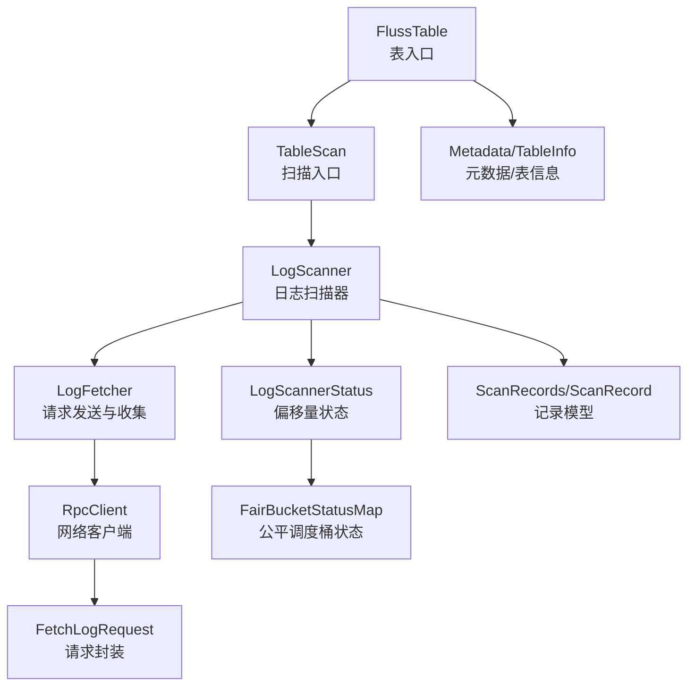
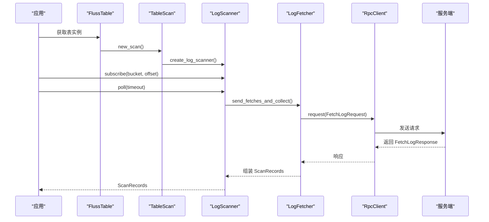
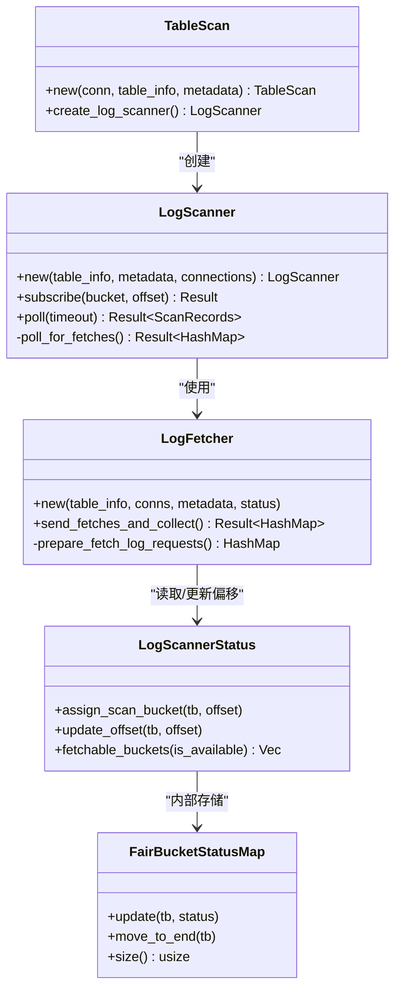
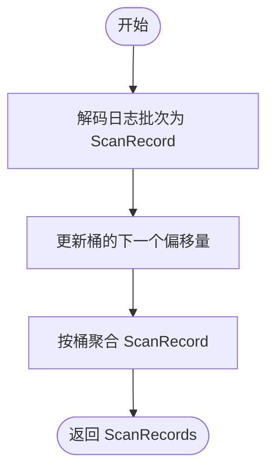
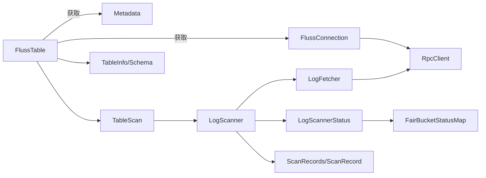

# 数据读取功能

<cite>
**本文引用的文件**
- [crates/fluss/src/client/table/scanner.rs](file://crates/fluss/src/client/table/scanner.rs)
- [crates/fluss/src/client/table/mod.rs](file://crates/fluss/src/client/table/mod.rs)
- [crates/fluss/src/client/connection.rs](file://crates/fluss/src/client/connection.rs)
- [crates/fluss/src/rpc/message/fetch.rs](file://crates/fluss/src/rpc/message/fetch.rs)
- [crates/fluss/src/rpc/message/header.rs](file://crates/fluss/src/rpc/message/header.rs)
- [crates/fluss/src/record/mod.rs](file://crates/fluss/src/record/mod.rs)
- [crates/fluss/src/metadata/table.rs](file://crates/fluss/src/metadata/table.rs)
- [crates/fluss/src/util/mod.rs](file://crates/fluss/src/util/mod.rs)
- [crates/examples/src/example_table.rs](file://crates/examples/src/example_table.rs)
</cite>

## 目录
1. [简介](#简介)
2. [项目结构](#项目结构)
3. [核心组件](#核心组件)
4. [架构总览](#架构总览)
5. [详细组件分析](#详细组件分析)
6. [依赖关系分析](#依赖关系分析)
7. [性能考量](#性能考量)
8. [故障排查指南](#故障排查指南)
9. [结论](#结论)
10. [附录：常见读取场景与最佳实践](#附录常见读取场景与最佳实践)

## 简介
本章节面向希望使用 Fluss 客户端进行数据读取的开发者，系统性阐述日志扫描机制（Scanner）的工作原理与使用方式，覆盖以下主题：
- Scanner 的创建与订阅管理
- 轮询策略与批量获取
- 流式处理与实时消费最佳实践
- 高级功能：过滤、排序、投影（当前实现状态）
- 与写入客户端的协调机制：偏移量管理与一致性
- 性能优化建议与监控指标

## 项目结构
围绕“数据读取”的关键模块组织如下：
- 表级入口：FlussTable 提供 new_scan 创建 TableScan
- 扫描器：TableScan.create_log_scanner 返回 LogScanner
- 偏移量与状态：LogScannerStatus + FairBucketStatusMap
- RPC 请求封装：FetchLogRequest
- 记录模型：ScanRecord、ScanRecords
- 元数据与表信息：TableInfo、Schema、TableBucket

图表来源
- [crates/fluss/src/client/table/mod.rs](file://crates/fluss/src/client/table/mod.rs#L32-L67)
- [crates/fluss/src/client/table/scanner.rs](file://crates/fluss/src/client/table/scanner.rs#L38-L108)
- [crates/fluss/src/rpc/message/fetch.rs](file://crates/fluss/src/rpc/message/fetch.rs#L35-L56)
- [crates/fluss/src/record/mod.rs](file://crates/fluss/src/record/mod.rs#L87-L175)
- [crates/fluss/src/util/mod.rs](file://crates/fluss/src/util/mod.rs#L32-L170)
- [crates/fluss/src/client/connection.rs](file://crates/fluss/src/client/connection.rs#L30-L82)
- [crates/fluss/src/metadata/table.rs](file://crates/fluss/src/metadata/table.rs#L634-L661)

章节来源
- [crates/fluss/src/client/table/mod.rs](file://crates/fluss/src/client/table/mod.rs#L32-L67)
- [crates/fluss/src/client/table/scanner.rs](file://crates/fluss/src/client/table/scanner.rs#L38-L108)
- [crates/fluss/src/client/connection.rs](file://crates/fluss/src/client/connection.rs#L30-L82)
- [crates/fluss/src/rpc/message/fetch.rs](file://crates/fluss/src/rpc/message/fetch.rs#L35-L56)
- [crates/fluss/src/record/mod.rs](file://crates/fluss/src/record/mod.rs#L87-L175)
- [crates/fluss/src/util/mod.rs](file://crates/fluss/src/util/mod.rs#L32-L170)
- [crates/fluss/src/metadata/table.rs](file://crates/fluss/src/metadata/table.rs#L634-L661)

## 核心组件
- FlussTable.new_scan：返回 TableScan，用于创建日志扫描器
- TableScan.create_log_scanner：创建 LogScanner 实例
- LogScanner.subscribe：为指定桶分配起始偏移量，开启订阅
- LogScanner.poll：发起一次拉取，返回 ScanRecords
- LogFetcher.prepare_fetch_log_requests/send_fetches_and_collect：按桶准备请求并收集响应
- LogScannerStatus/FairBucketStatusMap：维护每个桶的偏移量与调度顺序
- ScanRecord/ScanRecords：封装记录、偏移、时间戳、变更类型与聚合访问

章节来源
- [crates/fluss/src/client/table/mod.rs](file://crates/fluss/src/client/table/mod.rs#L64-L66)
- [crates/fluss/src/client/table/scanner.rs](file://crates/fluss/src/client/table/scanner.rs#L53-L108)
- [crates/fluss/src/record/mod.rs](file://crates/fluss/src/record/mod.rs#L87-L175)
- [crates/fluss/src/util/mod.rs](file://crates/fluss/src/util/mod.rs#L32-L170)

## 架构总览
下图展示了从应用到服务端的日志扫描调用链路与数据流转：

图表来源
- [crates/fluss/src/client/table/mod.rs](file://crates/fluss/src/client/table/mod.rs#L64-L66)
- [crates/fluss/src/client/table/scanner.rs](file://crates/fluss/src/client/table/scanner.rs#L53-L108)
- [crates/fluss/src/rpc/message/fetch.rs](file://crates/fluss/src/rpc/message/fetch.rs#L35-L56)

## 详细组件分析

### LogScanner 与 TableScan
- 创建流程：通过 FlussTable.new_scan() 获取 TableScan，再调用 create_log_scanner() 得到 LogScanner
- 订阅管理：subscribe(bucket, offset) 将桶与起始偏移量注册到 LogScannerStatus
- 轮询策略：poll(timeout) 内部委托给 LogFetcher.send_fetches_and_collect() 进行批量拉取
- 批量获取：prepare_fetch_log_requests() 会将多个桶的请求按 leader 聚合，统一发送以提升吞吐

图表来源
- [crates/fluss/src/client/table/scanner.rs](file://crates/fluss/src/client/table/scanner.rs#L38-L108)
- [crates/fluss/src/client/table/scanner.rs](file://crates/fluss/src/client/table/scanner.rs#L111-L244)
- [crates/fluss/src/client/table/scanner.rs](file://crates/fluss/src/client/table/scanner.rs#L246-L371)
- [crates/fluss/src/util/mod.rs](file://crates/fluss/src/util/mod.rs#L32-L170)

章节来源
- [crates/fluss/src/client/table/scanner.rs](file://crates/fluss/src/client/table/scanner.rs#L38-L108)
- [crates/fluss/src/client/table/scanner.rs](file://crates/fluss/src/client/table/scanner.rs#L111-L244)
- [crates/fluss/src/client/table/scanner.rs](file://crates/fluss/src/client/table/scanner.rs#L246-L371)
- [crates/fluss/src/util/mod.rs](file://crates/fluss/src/util/mod.rs#L32-L170)

### 记录模型与数据转换
- ScanRecord：封装一行数据、日志偏移、时间戳、变更类型
- ScanRecords：按桶聚合的记录集合，支持迭代与计数
- LogFetcher 在收到服务端响应后，将 Arrow/Indexed 格式的日志批次解码为 ScanRecord，并更新对应桶的下一个偏移量

图表来源
- [crates/fluss/src/record/mod.rs](file://crates/fluss/src/record/mod.rs#L87-L175)
- [crates/fluss/src/client/table/scanner.rs](file://crates/fluss/src/client/table/scanner.rs#L135-L173)

章节来源
- [crates/fluss/src/record/mod.rs](file://crates/fluss/src/record/mod.rs#L87-L175)
- [crates/fluss/src/client/table/scanner.rs](file://crates/fluss/src/client/table/scanner.rs#L135-L173)

### RPC 请求与响应
- FetchLogRequest：封装请求体，携带表/桶级别拉取参数（最大字节、最小字节、等待时间等）
- RequestHeader/ResponseHeader：定义请求头与响应头的序列化格式
- RpcClient：负责建立与服务端的连接并发送请求

章节来源
- [crates/fluss/src/rpc/message/fetch.rs](file://crates/fluss/src/rpc/message/fetch.rs#L35-L56)
- [crates/fluss/src/rpc/message/header.rs](file://crates/fluss/src/rpc/message/header.rs#L32-L73)
- [crates/fluss/src/client/connection.rs](file://cruss/src/client/connection.rs#L30-L82)

## 依赖关系分析
- FlussTable 依赖 Metadata 与 FlussConnection 获取表信息与网络客户端
- LogScanner 依赖 Metadata 获取集群拓扑与 TableInfo 获取表结构
- LogFetcher 依赖 RpcClient 发送 FetchLogRequest，并在响应中解析记录
- LogScannerStatus 通过 FairBucketStatusMap 维护桶的偏移量与调度顺序

图表来源
- [crates/fluss/src/client/table/mod.rs](file://crates/fluss/src/client/table/mod.rs#L32-L67)
- [crates/fluss/src/client/connection.rs](file://crates/fluss/src/client/connection.rs#L30-L82)
- [crates/fluss/src/client/table/scanner.rs](file://crates/fluss/src/client/table/scanner.rs#L38-L108)
- [crates/fluss/src/metadata/table.rs](file://crates/fluss/src/metadata/table.rs#L634-L661)

章节来源
- [crates/fluss/src/client/table/mod.rs](file://crates/fluss/src/client/table/mod.rs#L32-L67)
- [crates/fluss/src/client/connection.rs](file://crates/fluss/src/client/connection.rs#L30-L82)
- [crates/fluss/src/client/table/scanner.rs](file://crates/fluss/src/client/table/scanner.rs#L38-L108)
- [crates/fluss/src/metadata/table.rs](file://crates/fluss/src/metadata/table.rs#L634-L661)

## 性能考量
- 批量拉取参数
  - 单次请求最大字节数：常量定义于扫描器模块
  - 最小返回字节数、最大等待时间：常量定义于扫描器模块
  - 每桶最大拉取字节数：prepare_fetch_log_requests 中设置
- 公平调度
  - FairBucketStatusMap 通过 LinkedHashMap 保持桶的访问顺序，避免饥饿
  - move_to_end 将最近活跃的桶移动至末尾，提高局部性
- 并发与负载均衡
  - 按 leader 聚合桶请求，减少网络往返
  - 多桶并发拉取，充分利用带宽与服务端并行能力
- 偏移量更新
  - 每批记录处理后更新桶的下一个偏移量，确保不重复消费

章节来源
- [crates/fluss/src/client/table/scanner.rs](file://crates/fluss/src/client/table/scanner.rs#L32-L36)
- [crates/fluss/src/client/table/scanner.rs](file://crates/fluss/src/client/table/scanner.rs#L175-L233)
- [crates/fluss/src/util/mod.rs](file://crates/fluss/src/util/mod.rs#L32-L170)

## 故障排查指南
- 订阅失败或无数据
  - 确认已调用 subscribe(bucket, offset)，且桶 ID 与表分桶一致
  - 检查 Metadata 是否已更新表元数据
- 超时或空结果
  - 调整 poll 的 timeout 参数；检查服务端是否仍有新数据
  - 关注最小返回字节与最大等待时间配置
- 偏移量异常
  - 确保每批记录处理后偏移量正确推进
  - 若出现重复消费，检查业务侧是否在成功处理后再推进偏移
- RPC 错误
  - 检查 RpcClient 连接状态与服务端可达性
  - 关注请求头与响应头的版本匹配

章节来源
- [crates/fluss/src/client/table/scanner.rs](file://crates/fluss/src/client/table/scanner.rs#L95-L107)
- [crates/fluss/src/rpc/message/fetch.rs](file://crates/fluss/src/rpc/message/fetch.rs#L35-L56)
- [crates/fluss/src/rpc/message/header.rs](file://crates/fluss/src/rpc/message/header.rs#L32-L73)
- [crates/fluss/src/client/connection.rs](file://crates/fluss/src/client/connection.rs#L30-L82)

## 结论
Fluss 的数据读取路径清晰、职责分离明确：表入口负责创建扫描器，扫描器负责订阅与轮询，Fetcher 负责请求组装与响应收集，状态机负责偏移量与调度。该设计既保证了实时消费的低延迟，又通过批量与公平调度提升了吞吐与稳定性。结合示例程序可快速上手全量扫描与增量订阅等常见场景。

## 附录：常见读取场景与最佳实践

### 场景一：全量扫描
- 步骤
  - 使用 FlussTable.new_scan().create_log_scanner() 获取扫描器
  - 对每个桶调用 subscribe(bucket, 0) 以从头开始
  - 循环调用 poll(timeout) 直到 ScanRecords 为空
- 最佳实践
  - 为每个桶单独 subscribe，避免遗漏
  - 合理设置超时，避免长时间阻塞
  - 处理完一批后推进偏移量，防止重复消费

章节来源
- [crates/fluss/src/client/table/scanner.rs](file://crates/fluss/src/client/table/scanner.rs#L95-L107)
- [crates/examples/src/example_table.rs](file://crates/examples/src/example_table.rs#L69-L85)

### 场景二：增量订阅（基于上次偏移）
- 步骤
  - 订阅前先读取上次的桶偏移量
  - 调用 subscribe(bucket, last_offset) 开启订阅
  - 每次循环调用 poll(timeout)，处理完后将偏移量更新为最后一条记录的 offset+1
- 最佳实践
  - 将偏移量持久化到外部存储，重启后恢复
  - 采用幂等处理逻辑，避免重复处理

章节来源
- [crates/fluss/src/client/table/scanner.rs](file://crates/fluss/src/client/table/scanner.rs#L95-L107)
- [crates/fluss/src/client/table/scanner.rs](file://crates/fluss/src/client/table/scanner.rs#L163-L165)

### 场景三：时间范围查询
- 当前实现状态
  - 日志扫描接口未暴露时间范围参数；默认按偏移量范围扫描
- 替代方案
  - 在业务层对 ScanRecord.timestamp 进行过滤
  - 或在写入侧引入时间索引（需服务端/客户端扩展）

章节来源
- [crates/fluss/src/client/table/scanner.rs](file://crates/fluss/src/client/table/scanner.rs#L175-L233)
- [crates/fluss/src/record/mod.rs](file://crates/fluss/src/record/mod.rs#L87-L133)

### 场景四：流式处理与实时消费
- 流式处理模式
  - 设置较小的 poll 超时，持续轮询
  - 使用业务线程池异步处理 ScanRecord，避免阻塞扫描
- 实时消费最佳实践
  - 采用公平调度与多桶并发，提升整体吞吐
  - 对热点桶进行限速或拆分，避免单点过载

章节来源
- [crates/fluss/src/client/table/scanner.rs](file://crates/fluss/src/client/table/scanner.rs#L91-L107)
- [crates/fluss/src/util/mod.rs](file://crates/fluss/src/util/mod.rs#L32-L170)

### 高级功能：过滤、排序、投影
- 过滤
  - 可在业务层对 ScanRecord 进行条件过滤
- 排序
  - 可在业务层对 ScanRecords 进行排序（注意内存占用）
- 投影
  - 当前实现中，投影字段列表为空，表示未启用字段下推
  - 如需减少网络与内存开销，可在服务端启用字段下推（需服务端/协议支持）

章节来源
- [crates/fluss/src/client/table/scanner.rs](file://crates/fluss/src/client/table/scanner.rs#L215-L228)
- [crates/fluss/src/record/mod.rs](file://crates/fluss/src/record/mod.rs#L135-L175)

### 与写入客户端的协调机制
- 偏移量管理
  - 写入完成后，客户端持有最终提交的偏移量；读取侧通过 subscribe 指定起始偏移
- 一致性保证
  - 读取偏移量不得大于写入确认的高水位；可通过高水位与偏移量的配合保障不丢不重
- 协同建议
  - 写入方与读取方共享同一张表元数据，确保桶分布一致
  - 读取侧定期刷新元数据，应对动态扩容/迁移

章节来源
- [crates/fluss/src/client/table/scanner.rs](file://crates/fluss/src/client/table/scanner.rs#L274-L284)
- [crates/fluss/src/metadata/table.rs](file://crates/fluss/src/metadata/table.rs#L634-L661)

### 性能优化建议与监控指标
- 性能优化
  - 调整每次请求的最大字节数与最小字节数，平衡延迟与吞吐
  - 合理设置最大等待时间，避免空转
  - 使用多桶并发与公平调度，提升整体利用率
- 监控指标
  - 每秒拉取记录数、平均延迟、请求失败率
  - 每桶偏移量进度、堆积时长
  - 网络往返时间、RPC 调用耗时

章节来源
- [crates/fluss/src/client/table/scanner.rs](file://crates/fluss/src/client/table/scanner.rs#L32-L36)
- [crates/fluss/src/client/table/scanner.rs](file://crates/fluss/src/client/table/scanner.rs#L175-L233)
- [crates/fluss/src/util/mod.rs](file://crates/fluss/src/util/mod.rs#L32-L170)