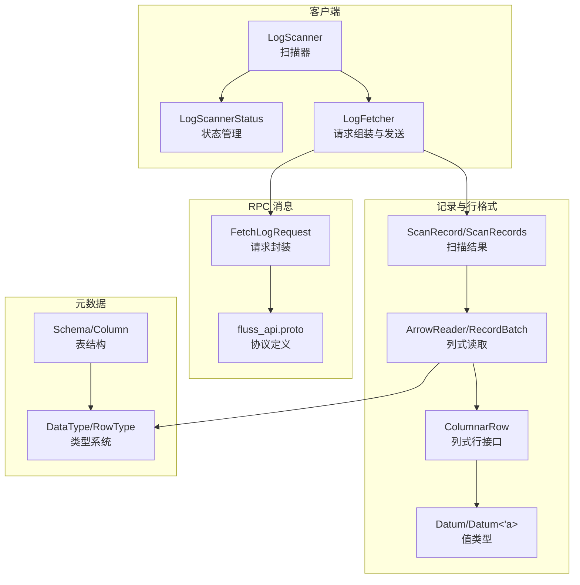
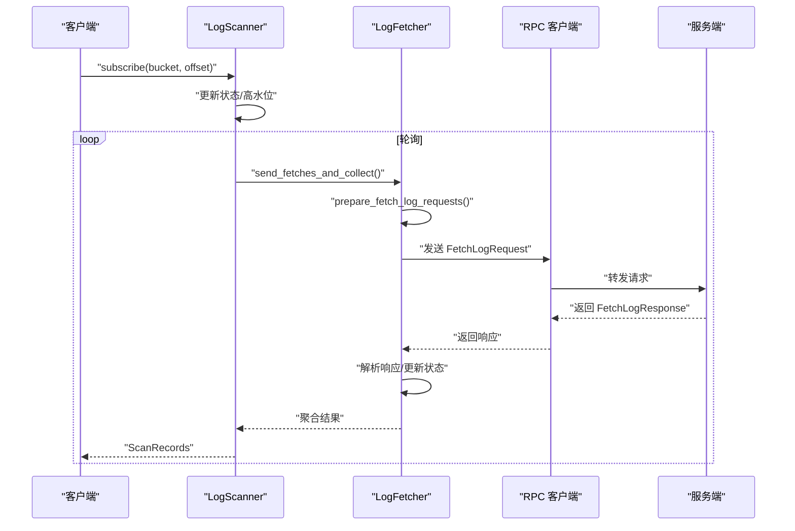
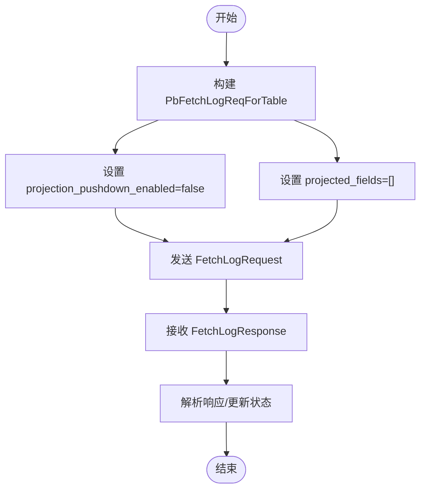
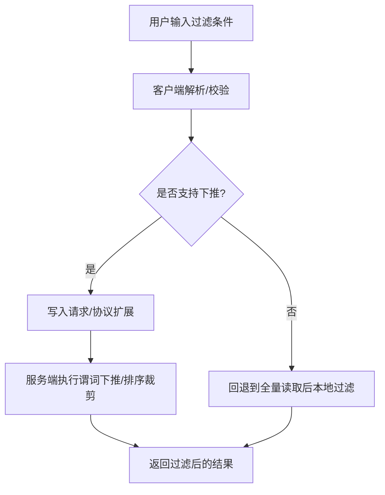
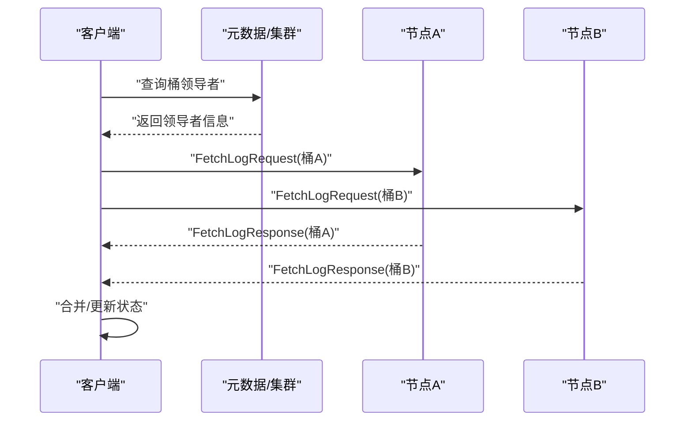
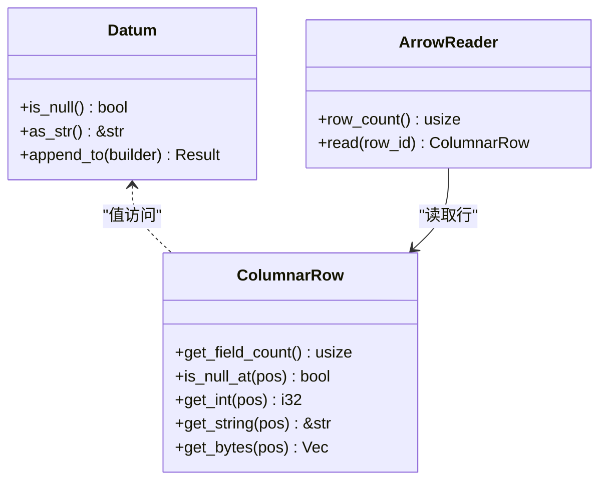
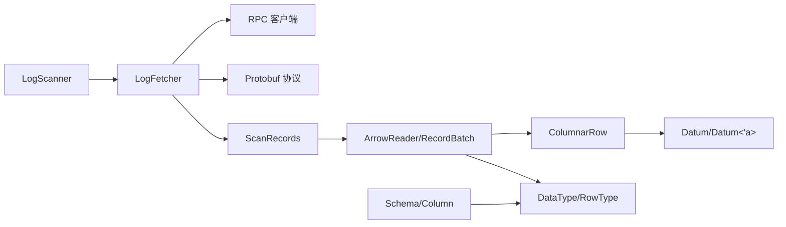

# 数据过滤

<cite>
**本文引用的文件**
- [lib.rs](file://crates/fluss/src/lib.rs)
- [mod.rs](file://crates/fluss/src/client/mod.rs)
- [scanner.rs](file://crates/fluss/src/client/table/scanner.rs)
- [fetch.rs](file://crates/fluss/src/rpc/message/fetch.rs)
- [fluss_api.proto](file://crates/fluss/src/proto/fluss_api.proto)
- [mod.rs](file://crates/fluss/src/row/mod.rs)
- [column.rs](file://crates/fluss/src/row/column.rs)
- [datum.rs](file://crates/fluss/src/row/datum.rs)
- [mod.rs](file://crates/fluss/src/record/mod.rs)
- [arrow.rs](file://crates/fluss/src/record/arrow.rs)
- [datatype.rs](file://crates/fluss/src/metadata/datatype.rs)
- [table.rs](file://crates/fluss/src/metadata/table.rs)
</cite>

## 目录
1. [简介](#简介)
2. [项目结构](#项目结构)
3. [核心组件](#核心组件)
4. [架构总览](#架构总览)
5. [详细组件分析](#详细组件分析)
6. [依赖关系分析](#依赖关系分析)
7. [性能考量](#性能考量)
8. [故障排查指南](#故障排查指南)
9. [结论](#结论)
10. [附录](#附录)

## 简介
本文件围绕 Fluss 的“数据过滤”能力进行系统化说明，重点覆盖以下方面：
- 投影下推（字段选择）与条件过滤、计算下推的实现现状与扩展点
- FetchLogRequest 中的过滤参数配置：投影字段列表、过滤条件表达式、排序规则设置
- 分布式环境下的过滤执行：节点本地过滤、跨节点协调、结果合并策略
- 不同数据类型的过滤支持：数值、字符串、复杂类型等
- 典型过滤场景示例（精确匹配、范围查询、正则表达式匹配等）的代码路径指引
- 过滤性能优化技术：索引利用、缓存策略、并行处理
- 过滤功能的限制与最佳实践建议

## 项目结构
Fluss 的过滤能力主要由客户端扫描器、RPC 请求消息、记录读取与 Arrow 行格式、元数据类型体系共同构成。下图给出与“数据过滤”相关的模块关系概览。

**图表来源**
- [scanner.rs](file://crates/fluss/src/client/table/scanner.rs#L38-L108)
- [fetch.rs](file://crates/fluss/src/rpc/message/fetch.rs#L35-L56)
- [fluss_api.proto](file://crates/fluss/src/proto/fluss_api.proto#L140-L183)
- [mod.rs](file://crates/fluss/src/record/mod.rs#L87-L174)
- [arrow.rs](file://crates/fluss/src/record/arrow.rs#L236-L400)
- [column.rs](file://crates/fluss/src/row/column.rs#L25-L169)
- [datum.rs](file://crates/fluss/src/row/datum.rs#L37-L169)
- [datatype.rs](file://crates/fluss/src/metadata/datatype.rs#L24-L44)
- [table.rs](file://crates/fluss/src/metadata/table.rs#L94-L144)

**章节来源**
- [lib.rs](file://crates/fluss/src/lib.rs#L18-L37)
- [mod.rs](file://crates/fluss/src/client/mod.rs#L18-L26)

## 核心组件
- 扫描器与状态管理
  - LogScanner：负责订阅桶、轮询拉取、更新高水位与偏移
  - LogScannerStatus：维护每个桶的扫描状态（偏移、高水位）
  - LogFetcher：根据状态组装 FetchLogRequest 并向各节点发送请求
- RPC 请求与协议
  - FetchLogRequest：客户端侧的请求封装；协议中包含投影下推开关、投影字段列表、桶级请求等
  - fluss_api.proto：定义了 FetchLogRequest/FetchLogResponse 及其嵌套消息
- 记录与行格式
  - ScanRecord/ScanRecords：扫描结果容器
  - ArrowReader/RecordBatch：基于 Arrow 的列式读取
  - ColumnarRow：列式行访问接口
  - Datum/Datum<'a>：统一的值类型表示，支撑不同数据类型的读取
- 类型系统与模式
  - DataType/RowType：描述表结构与字段类型
  - Schema/Column：表结构定义，用于投影下推与过滤的字段解析

**章节来源**
- [scanner.rs](file://crates/fluss/src/client/table/scanner.rs#L38-L108)
- [scanner.rs](file://crates/fluss/src/client/table/scanner.rs#L119-L244)
- [fetch.rs](file://crates/fluss/src/rpc/message/fetch.rs#L35-L56)
- [fluss_api.proto](file://crates/fluss/src/proto/fluss_api.proto#L140-L183)
- [mod.rs](file://crates/fluss/src/record/mod.rs#L87-L174)
- [arrow.rs](file://crates/fluss/src/record/arrow.rs#L236-L400)
- [column.rs](file://crates/fluss/src/row/column.rs#L25-L169)
- [datum.rs](file://crates/fluss/src/row/datum.rs#L37-L169)
- [datatype.rs](file://crates/fluss/src/metadata/datatype.rs#L24-L44)
- [table.rs](file://crates/fluss/src/metadata/table.rs#L94-L144)

## 架构总览
下图展示了从客户端扫描到服务端响应的整体流程，以及投影下推参数在请求中的位置。

**图表来源**
- [scanner.rs](file://crates/fluss/src/client/table/scanner.rs#L91-L107)
- [scanner.rs](file://crates/fluss/src/client/table/scanner.rs#L135-L173)
- [scanner.rs](file://crates/fluss/src/client/table/scanner.rs#L175-L233)
- [fetch.rs](file://crates/fluss/src/rpc/message/fetch.rs#L35-L56)
- [fluss_api.proto](file://crates/fluss/src/proto/fluss_api.proto#L140-L183)

## 详细组件分析

### 投影下推与过滤参数配置
- 协议层
  - 在协议中，PbFetchLogReqForTable 包含 projection_pushdown_enabled 与 projected_fields 字段，用于指示是否启用投影下推以及指定投影字段索引列表
  - FetchLogRequest 顶层包含 follower_server_id、max_bytes、tables_req、max_wait_ms、min_bytes 等
- 客户端层
  - 当前客户端在组装请求时，projection_pushdown_enabled 被固定为 false，且 projected_fields 为空列表
  - 因此，当前版本未实际执行投影下推，所有字段均被返回
- 扩展点
  - 若需启用投影下推，应在客户端构建 PbFetchLogReqForTable 时将 projection_pushdown_enabled 设为 true，并填充 projected_fields（字段索引）

**图表来源**
- [scanner.rs](file://crates/fluss/src/client/table/scanner.rs#L216-L228)
- [fluss_api.proto](file://crates/fluss/src/proto/fluss_api.proto#L153-L158)
- [fluss_api.proto](file://crates/fluss/src/proto/fluss_api.proto#L140-L147)

**章节来源**
- [scanner.rs](file://crates/fluss/src/client/table/scanner.rs#L175-L233)
- [fluss_api.proto](file://crates/fluss/src/proto/fluss_api.proto#L140-L183)

### 条件过滤与计算下推
- 现状
  - 客户端当前未在请求中携带过滤条件表达式或排序规则字段
  - 服务端也未实现条件过滤与计算下推逻辑
- 扩展建议
  - 在协议中新增过滤条件与排序规则字段（例如布尔表达式、排序键列表）
  - 在客户端层解析用户输入，生成对应字段并写入请求
  - 在服务端层对接存储引擎，实现谓词下推与排序裁剪

[本图为概念性流程，不直接映射具体源码，故无图表来源]

### 分布式环境下的过滤执行
- 节点本地过滤
  - 服务端在桶级别执行过滤（若实现），减少网络传输
- 跨节点协调
  - 客户端按桶分发请求，聚合来自多个节点的响应
- 结果合并策略
  - 客户端将各桶结果合并为统一的 ScanRecords，供上层消费

**图表来源**
- [scanner.rs](file://crates/fluss/src/client/table/scanner.rs#L135-L173)
- [scanner.rs](file://crates/fluss/src/client/table/scanner.rs#L240-L244)

**章节来源**
- [scanner.rs](file://crates/fluss/src/client/table/scanner.rs#L135-L173)

### 不同数据类型的过滤支持
- 数值类型
  - 支持整型、浮点、日期时间等类型的读取与比较
- 字符串类型
  - 支持字符串与定长二进制读取，可用于精确匹配与前缀匹配
- 复杂类型
  - 数组、映射、嵌套行等类型在当前代码中尚未完全展开，过滤支持有限

**图表来源**
- [datum.rs](file://crates/fluss/src/row/datum.rs#L37-L169)
- [column.rs](file://crates/fluss/src/row/column.rs#L50-L169)
- [arrow.rs](file://crates/fluss/src/record/arrow.rs#L528-L544)

**章节来源**
- [datum.rs](file://crates/fluss/src/row/datum.rs#L37-L169)
- [column.rs](file://crates/fluss/src/row/column.rs#L50-L169)
- [arrow.rs](file://crates/fluss/src/record/arrow.rs#L402-L447)

### 典型过滤场景与代码路径
- 精确匹配
  - 使用 ColumnarRow 的字符串/整数读取方法进行比较
  - 示例路径：[column.rs](file://crates/fluss/src/row/column.rs#L141-L148), [column.rs](file://crates/fluss/src/row/column.rs#L84-L91)
- 范围查询
  - 基于数值类型读取后进行区间判断
  - 示例路径：[column.rs](file://crates/fluss/src/row/column.rs#L84-L100)
- 正则表达式匹配
  - 基于字符串读取后使用正则库进行匹配
  - 示例路径：[column.rs](file://crates/fluss/src/row/column.rs#L141-L148), [datum.rs](file://crates/fluss/src/row/datum.rs#L111-L121)

[注意：以上为场景说明与路径指引，不包含具体代码内容]

## 依赖关系分析
- 组件耦合
  - LogScanner 依赖 LogFetcher 与 Metadata 获取桶领导者
  - LogFetcher 依赖 RPC 客户端发送请求
  - 记录读取依赖 ArrowReader/RecordBatch 与 ColumnarRow/Datum
- 外部依赖
  - Arrow 用于列式存储与读取
  - Protobuf 用于 RPC 请求/响应序列化

**图表来源**
- [scanner.rs](file://crates/fluss/src/client/table/scanner.rs#L38-L108)
- [scanner.rs](file://crates/fluss/src/client/table/scanner.rs#L119-L244)
- [mod.rs](file://crates/fluss/src/record/mod.rs#L87-L174)
- [arrow.rs](file://crates/fluss/src/record/arrow.rs#L236-L400)
- [column.rs](file://crates/fluss/src/row/column.rs#L25-L169)
- [datum.rs](file://crates/fluss/src/row/datum.rs#L37-L169)
- [datatype.rs](file://crates/fluss/src/metadata/datatype.rs#L24-L44)
- [table.rs](file://crates/fluss/src/metadata/table.rs#L94-L144)

**章节来源**
- [lib.rs](file://crates/fluss/src/lib.rs#L18-L37)
- [mod.rs](file://crates/fluss/src/client/mod.rs#L18-L26)

## 性能考量
- 投影下推
  - 减少网络与内存拷贝，降低序列化开销
- 列式读取
  - Arrow 的列式布局有利于向量化比较与过滤
- 并行处理
  - 多桶并发拉取，提升吞吐
- 缓存策略
  - 元数据缓存可减少查询开销
- 索引利用
  - 建议在服务端引入索引以支持高效谓词下推（当前未实现）

[本节为通用性能讨论，不直接分析具体文件]

## 故障排查指南
- 偏移与高水位异常
  - 检查 LogScannerStatus 的偏移更新逻辑与高水位设置
  - 关注状态更新与桶分配的线程安全
- RPC 请求失败
  - 核对 leader 查询与连接池可用性
  - 检查请求体构造与序列化
- 记录读取异常
  - 校验 Arrow Schema 与 RecordBatch 的一致性
  - 确认字段索引与类型转换正确

**章节来源**
- [scanner.rs](file://crates/fluss/src/client/table/scanner.rs#L246-L371)
- [arrow.rs](file://crates/fluss/src/record/arrow.rs#L367-L400)
- [column.rs](file://crates/fluss/src/row/column.rs#L50-L169)

## 结论
- 当前版本的 Fluss 在客户端侧已具备完整的扫描与聚合框架，但未启用投影下推与条件/计算下推
- 投影下推参数已在协议中定义，可在客户端层扩展启用
- 条件过滤与计算下推需要在服务端与存储层协同实现
- 建议优先实现投影下推与列式过滤，再逐步引入谓词下推与索引

[本节为总结性内容，不直接分析具体文件]

## 附录

### FetchLogRequest 参数说明（基于协议）
- 字段
  - follower_server_id：发起方服务器标识
  - max_bytes：单次最大字节数
  - tables_req：按表组织的请求列表
  - max_wait_ms/min_bytes：等待与最小返回字节
- 表级请求字段
  - table_id：表标识
  - projection_pushdown_enabled：是否启用投影下推
  - projected_fields：投影字段索引列表
  - buckets_req：桶级请求列表

**章节来源**
- [fluss_api.proto](file://crates/fluss/src/proto/fluss_api.proto#L140-L183)