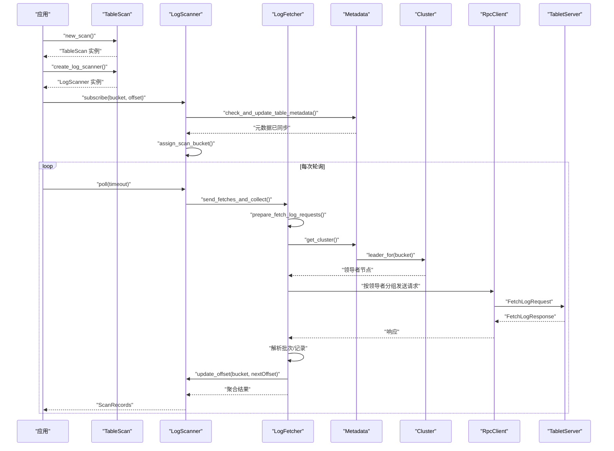
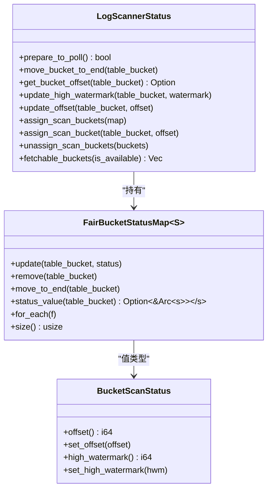
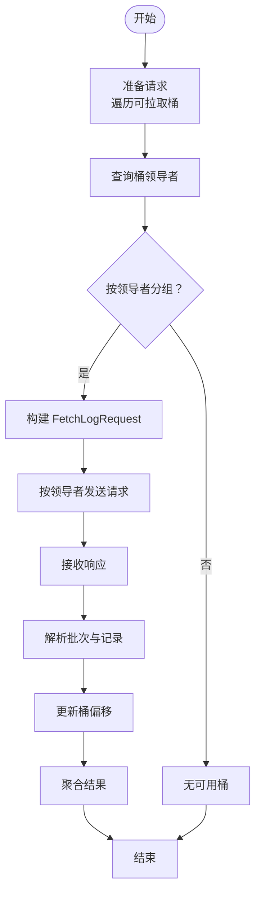
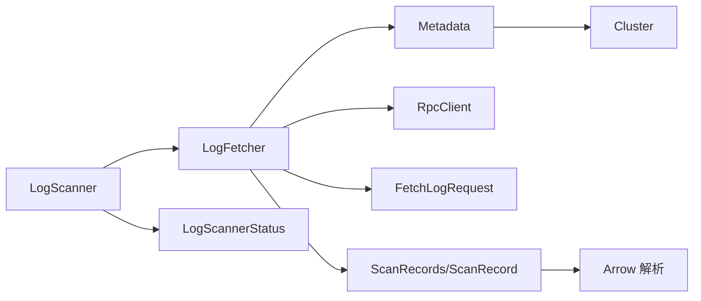

# 日志扫描机制

<cite>
**本文引用的文件**
- [crates/fluss/src/client/table/scanner.rs](file://crates/fluss/src/client/table/scanner.rs)
- [crates/fluss/src/client/table/mod.rs](file://crates/fluss/src/client/table/mod.rs)
- [crates/fluss/src/client/metadata.rs](file://crates/fluss/src/client/metadata.rs)
- [crates/fluss/src/util/mod.rs](file://crates/fluss/src/util/mod.rs)
- [crates/fluss/src/cluster/cluster.rs](file://crates/fluss/src/cluster/cluster.rs)
- [crates/fluss/src/rpc/message/fetch.rs](file://crates/fluss/src/rpc/message/fetch.rs)
- [crates/fluss/src/metadata/table.rs](file://crates/fluss/src/metadata/table.rs)
- [crates/fluss/src/record/mod.rs](file://crates/fluss/src/record/mod.rs)
- [crates/fluss/src/record/arrow.rs](file://crates/fluss/src/record/arrow.rs)
- [crates/fluss/src/lib.rs](file://crates/fluss/src/lib.rs)
</cite>

## 目录
1. [简介](#简介)
2. [项目结构](#项目结构)
3. [核心组件](#核心组件)
4. [架构总览](#架构总览)
5. [详细组件分析](#详细组件分析)
6. [依赖关系分析](#依赖关系分析)
7. [性能考量](#性能考量)
8. [故障排查指南](#故障排查指南)
9. [结论](#结论)
10. [附录：使用示例与最佳实践](#附录使用示例与最佳实践)

## 简介
本文件系统性阐述 Fluss 日志扫描机制，重点围绕以下主题：
- LogScanner 的初始化、状态管理与偏移量跟踪策略
- TableScan::create_log_scanner() 的使用方式与返回对象生命周期
- LogScannerStatus 的作用（桶状态映射、公平调度、偏移量更新）
- LogFetcher 的实现细节（请求构建、批量获取、响应处理）
- 与元数据系统的交互（表信息校验、桶领导者查找、集群状态同步）
- 性能优化建议与错误处理策略

## 项目结构
日志扫描相关代码主要位于客户端模块中，围绕“表扫描”“元数据”“集群”“RPC 请求/响应”“记录解析”等子模块协同工作。

```mermaid
graph TB
subgraph "客户端"
TS["TableScan<br/>创建 LogScanner"]
LS["LogScanner<br/>扫描入口"]
LFS["LogFetcher<br/>请求构建与分发"]
STAT["LogScannerStatus<br/>桶状态与偏移量"]
end
subgraph "元数据与集群"
META["Metadata<br/>检查/更新表元数据"]
CLU["Cluster<br/>桶领导者/可用位置"]
end
subgraph "RPC"
REQ["FetchLogRequest<br/>消息封装"]
RPC["RpcClient<br/>连接池/请求发送"]
end
subgraph "记录处理"
REC["ScanRecords/ScanRecord<br/>聚合与单条记录"]
ARW["Arrow 解析<br/>批次读取/迭代"]
end
TS --> LS
LS --> LFS
LFS --> META
META --> CLU
LFS --> RPC
RPC --> REQ
REQ --> RPC
RPC --> LFS
LFS --> REC
REC --> ARW
LS --> STAT
LFS --> STAT
```

图表来源
- [crates/fluss/src/client/table/scanner.rs](file://crates/fluss/src/client/table/scanner.rs#L38-L108)
- [crates/fluss/src/client/metadata.rs](file://crates/fluss/src/client/metadata.rs#L35-L104)
- [crates/fluss/src/cluster/cluster.rs](file://crates/fluss/src/cluster/cluster.rs#L177-L188)
- [crates/fluss/src/rpc/message/fetch.rs](file://crates/fluss/src/rpc/message/fetch.rs#L35-L56)
- [crates/fluss/src/record/mod.rs](file://crates/fluss/src/record/mod.rs#L135-L174)
- [crates/fluss/src/record/arrow.rs](file://crates/fluss/src/record/arrow.rs#L236-L400)

章节来源
- [crates/fluss/src/client/table/mod.rs](file://crates/fluss/src/client/table/mod.rs#L32-L67)
- [crates/fluss/src/client/table/scanner.rs](file://crates/fluss/src/client/table/scanner.rs#L38-L108)

## 核心组件
- TableScan：负责基于已知表信息创建 LogScanner 实例，作为扫描入口。
- LogScanner：对外暴露 poll/subscribe 等接口，内部持有 LogFetcher 和 LogScannerStatus。
- LogFetcher：负责准备 FetchLog 请求、按桶领导者分组并发拉取、解析响应并更新偏移量。
- LogScannerStatus：维护每个桶的扫描偏移量与高水位，支持公平调度（LinkedHashMap 迭代顺序）。
- Metadata/Cluster：提供表元数据、桶领导者定位、集群状态更新能力。
- 记录层：ScanRecords/ScanRecord 聚合与单条记录抽象；Arrow 解析用于从批次中迭代读取列存行。

章节来源
- [crates/fluss/src/client/table/scanner.rs](file://crates/fluss/src/client/table/scanner.rs#L38-L108)
- [crates/fluss/src/util/mod.rs](file://crates/fluss/src/util/mod.rs#L32-L170)
- [crates/fluss/src/client/metadata.rs](file://crates/fluss/src/client/metadata.rs#L35-L104)
- [crates/fluss/src/cluster/cluster.rs](file://crates/fluss/src/cluster/cluster.rs#L177-L188)
- [crates/fluss/src/record/mod.rs](file://crates/fluss/src/record/mod.rs#L87-L174)
- [crates/fluss/src/record/arrow.rs](file://crates/fluss/src/record/arrow.rs#L236-L400)

## 架构总览
下图展示了从应用侧调用到服务端响应的完整链路，以及状态更新与记录解析的关键节点。



图表来源
- [crates/fluss/src/client/table/scanner.rs](file://crates/fluss/src/client/table/scanner.rs#L53-L107)
- [crates/fluss/src/client/metadata.rs](file://crates/fluss/src/client/metadata.rs#L83-L94)
- [crates/fluss/src/cluster/cluster.rs](file://crates/fluss/src/cluster/cluster.rs#L177-L188)
- [crates/fluss/src/rpc/message/fetch.rs](file://crates/fluss/src/rpc/message/fetch.rs#L35-L56)
- [crates/fluss/src/record/arrow.rs](file://crates/fluss/src/record/arrow.rs#L159-L166)

## 详细组件分析

### TableScan 与 LogScanner 生命周期
- 创建方式：通过 TableScan::create_log_scanner() 返回一个 LogScanner 实例，该实例持有：
  - 表路径与表 ID
  - 元数据引用（用于表信息校验与集群状态查询）
  - RPC 客户端引用（用于向不同领导者节点发送请求）
  - LogScannerStatus（桶状态与偏移量）
  - LogFetcher（实际的拉取逻辑）
- 生命周期：LogScanner 以 Arc 包裹的状态共享给 LogFetcher 使用，确保多处并发访问时状态一致且无需重复初始化。

章节来源
- [crates/fluss/src/client/table/mod.rs](file://crates/fluss/src/client/table/mod.rs#L64-L66)
- [crates/fluss/src/client/table/scanner.rs](file://crates/fluss/src/client/table/scanner.rs#L53-L89)

### LogScanner 初始化与订阅
- 初始化：LogScanner::new() 构造 LogScannerStatus 与 LogFetcher，并复制表路径与表 ID。
- 订阅：subscribe() 接收桶 ID 与起始偏移，先校验并更新表元数据，再在状态中登记该桶的扫描起点。

章节来源
- [crates/fluss/src/client/table/scanner.rs](file://crates/fluss/src/client/table/scanner.rs#L70-L103)

### LogScannerStatus：桶状态映射与公平调度
- 数据结构：基于 FairBucketStatusMap，内部使用 LinkedHashMap 维护桶到状态的映射，并保持插入/移动顺序，便于公平调度。
- 关键操作：
  - assign_scan_bucket()/assign_scan_buckets()：登记或批量登记桶及其初始偏移
  - get_bucket_offset()/update_offset()/update_high_watermark()：读取/更新偏移与高水位
  - fetchable_buckets()：根据可用性谓词筛选可拉取桶
  - move_bucket_to_end()：将桶移动至迭代末尾，实现“最近使用”式公平调度



图表来源
- [crates/fluss/src/client/table/scanner.rs](file://crates/fluss/src/client/table/scanner.rs#L246-L331)
- [crates/fluss/src/util/mod.rs](file://crates/fluss/src/util/mod.rs#L32-L170)

章节来源
- [crates/fluss/src/client/table/scanner.rs](file://crates/fluss/src/client/table/scanner.rs#L246-L331)
- [crates/fluss/src/util/mod.rs](file://crates/fluss/src/util/mod.rs#L32-L170)

### LogFetcher：请求构建、批量获取与响应处理
- 请求构建：
  - 遍历可拉取桶（由 LogScannerStatus 提供），按桶查询当前偏移
  - 查询桶领导者（Cluster::leader_for），将桶按领导者分组
  - 构建 FetchLogRequest（包含表级与桶级请求体），设置最大字节、最小字节、等待时间等参数
- 批量获取：
  - 对每个领导者节点建立连接，发送请求
  - 收集响应后，按表/桶聚合结果
- 响应处理：
  - 反序列化批次（LogRecordsBatchs），逐条记录转换为 ScanRecord
  - 更新对应桶的下一个偏移（last_offset + 1）



图表来源
- [crates/fluss/src/client/table/scanner.rs](file://crates/fluss/src/client/table/scanner.rs#L135-L173)
- [crates/fluss/src/client/table/scanner.rs](file://crates/fluss/src/client/table/scanner.rs#L175-L233)
- [crates/fluss/src/record/arrow.rs](file://crates/fluss/src/record/arrow.rs#L159-L166)

章节来源
- [crates/fluss/src/client/table/scanner.rs](file://crates/fluss/src/client/table/scanner.rs#L119-L244)
- [crates/fluss/src/rpc/message/fetch.rs](file://crates/fluss/src/rpc/message/fetch.rs#L35-L56)
- [crates/fluss/src/record/arrow.rs](file://crates/fluss/src/record/arrow.rs#L236-L400)

### 与元数据系统的交互
- 表信息校验：subscribe() 中调用 Metadata::check_and_update_table_metadata()，若本地缓存缺失则向任一可用服务器发起更新元数据请求，刷新 Cluster。
- 桶领导者查找：LogFetcher 通过 Metadata::get_cluster() 获取 Cluster，再调用 Cluster::leader_for() 获取桶领导者节点 ID，随后从 RpcClient 获取连接并发送请求。
- 集群状态同步：Metadata::update() 将新元数据响应转换为新的 Cluster 并替换旧实例，保证后续领导者查询与桶分布准确。

章节来源
- [crates/fluss/src/client/table/scanner.rs](file://crates/fluss/src/client/table/scanner.rs#L96-L99)
- [crates/fluss/src/client/metadata.rs](file://crates/fluss/src/client/metadata.rs#L83-L94)
- [crates/fluss/src/client/metadata.rs](file://crates/fluss/src/client/metadata.rs#L57-L64)
- [crates/fluss/src/cluster/cluster.rs](file://crates/fluss/src/cluster/cluster.rs#L177-L188)

### 记录解析与输出
- 批次解析：LogRecordsBatchs 迭代每个批次，计算批次大小并校验 CRC
- Arrow 读取：将批次中的 Arrow 元数据与数据拼接，使用 StreamReader 读取 RecordBatch，再通过 ArrowReader 迭代行
- 结果聚合：每条记录携带基础偏移、时间戳与变更类型，最终封装为 ScanRecords，按桶聚合

章节来源
- [crates/fluss/src/record/arrow.rs](file://crates/fluss/src/record/arrow.rs#L236-L400)
- [crates/fluss/src/record/mod.rs](file://crates/fluss/src/record/mod.rs#L87-L174)

## 依赖关系分析
- 组件耦合
  - LogScanner 依赖 Metadata/Cluster 以进行元数据校验与领导者查询
  - LogFetcher 依赖 Metadata/Cluster/RpcClient/FetchLogRequest/响应消息
  - LogScannerStatus 与 LogFetcher 共享状态，避免重复初始化
- 外部依赖
  - RPC 层负责网络传输与请求/响应编解码
  - Arrow 用于高性能列存记录读取与迭代



图表来源
- [crates/fluss/src/client/table/scanner.rs](file://crates/fluss/src/client/table/scanner.rs#L70-L108)
- [crates/fluss/src/client/metadata.rs](file://crates/fluss/src/client/metadata.rs#L35-L104)
- [crates/fluss/src/cluster/cluster.rs](file://crates/fluss/src/cluster/cluster.rs#L177-L188)
- [crates/fluss/src/rpc/message/fetch.rs](file://crates/fluss/src/rpc/message/fetch.rs#L35-L56)
- [crates/fluss/src/record/mod.rs](file://crates/fluss/src/record/mod.rs#L135-L174)
- [crates/fluss/src/record/arrow.rs](file://crates/fluss/src/record/arrow.rs#L236-L400)

章节来源
- [crates/fluss/src/client/table/scanner.rs](file://crates/fluss/src/client/table/scanner.rs#L38-L108)
- [crates/fluss/src/client/metadata.rs](file://crates/fluss/src/client/metadata.rs#L35-L104)
- [crates/fluss/src/cluster/cluster.rs](file://crates/fluss/src/cluster/cluster.rs#L177-L188)

## 性能考量
- 批量与等待参数
  - 单表请求最大字节数、最小字节数、最大等待时间在请求构建阶段集中配置，有助于平衡吞吐与延迟
- 公平调度
  - 通过将桶移动至 LinkedHashMap 末尾，避免某些桶长期被优先处理，提升整体均衡性
- 偏移更新粒度
  - 按批次最后一条记录的偏移+1 更新，减少重复拉取与空轮询
- Arrow 列存读取
  - 使用 RecordBatch 与迭代器，降低内存拷贝与解析成本

章节来源
- [crates/fluss/src/client/table/scanner.rs](file://crates/fluss/src/client/table/scanner.rs#L175-L233)
- [crates/fluss/src/util/mod.rs](file://crates/fluss/src/util/mod.rs#L46-L64)
- [crates/fluss/src/record/arrow.rs](file://crates/fluss/src/record/arrow.rs#L367-L400)

## 故障排查指南
- 元数据缺失导致无法拉取
  - 现象：prepare_fetch_log_requests() 中找不到桶偏移或领导者为空
  - 处理：确认 subscribe() 已调用并完成元数据校验；必要时再次触发 check_and_update_table_metadata()
- 领导者节点不可达
  - 现象：按领导者分组发送请求时报错
  - 处理：检查 Metadata::get_cluster() 是否已更新；确认 Cluster::leader_for() 返回有效节点
- 偏移未前进
  - 现象：多次 poll 返回相同记录
  - 处理：确认 LogFetcher 在解析批次后调用了 update_offset()；检查批次 CRC 与长度是否合法
- 记录解析异常
  - 现象：Arrow 读取失败或空结果
  - 处理：核对批次头字段（schema_id、checksum、record_count）；确认 Arrow 元数据与数据拼接正确

章节来源
- [crates/fluss/src/client/table/scanner.rs](file://crates/fluss/src/client/table/scanner.rs#L175-L233)
- [crates/fluss/src/client/metadata.rs](file://crates/fluss/src/client/metadata.rs#L83-L94)
- [crates/fluss/src/record/arrow.rs](file://crates/fluss/src/record/arrow.rs#L314-L323)

## 结论
日志扫描机制通过“表扫描入口 + 状态驱动 + 元数据感知 + 公平调度”的设计，在保证低延迟与高吞吐的同时，提供了清晰的状态边界与可扩展的请求构建能力。LogFetcher 将桶按领导者分组并行拉取，结合 Arrow 列存解析，实现了高效的记录消费路径。配合 Metadata/Cluster 的动态更新，系统能够适应集群拓扑变化与表结构演进。

## 附录：使用示例与最佳实践
- 创建扫描器与订阅
  - 通过 TableScan::create_log_scanner() 获取 LogScanner
  - 调用 subscribe() 指定桶与起始偏移，内部会自动校验并更新表元数据
- 配置扫描参数
  - 请求构建阶段已内置最大/最小字节与等待时间，可根据场景调整（如更长等待以提升吞吐）
- 处理扫描结果
  - poll() 返回 ScanRecords，按桶聚合；可进一步迭代单条 ScanRecord 获取行、偏移、时间戳与变更类型
- 最佳实践
  - 合理设置订阅桶集合，避免一次性订阅过多桶导致请求膨胀
  - 利用公平调度特性，避免热点桶饥饿
  - 定期检查并更新元数据，确保领导者信息与桶分布最新

章节来源
- [crates/fluss/src/client/table/mod.rs](file://crates/fluss/src/client/table/mod.rs#L64-L66)
- [crates/fluss/src/client/table/scanner.rs](file://crates/fluss/src/client/table/scanner.rs#L95-L107)
- [crates/fluss/src/record/mod.rs](file://crates/fluss/src/record/mod.rs#L135-L174)