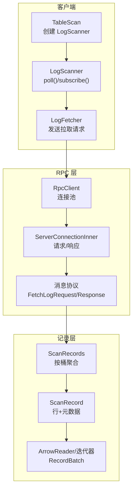
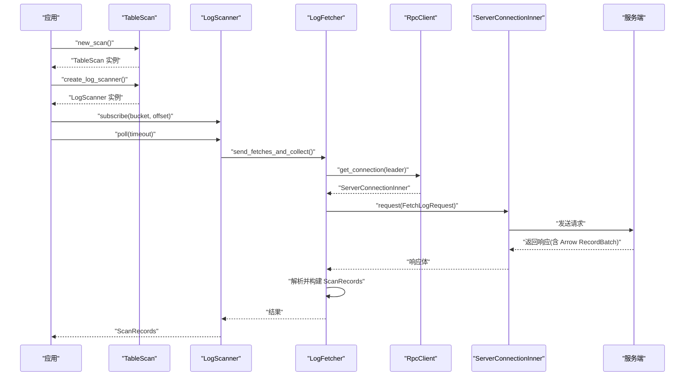
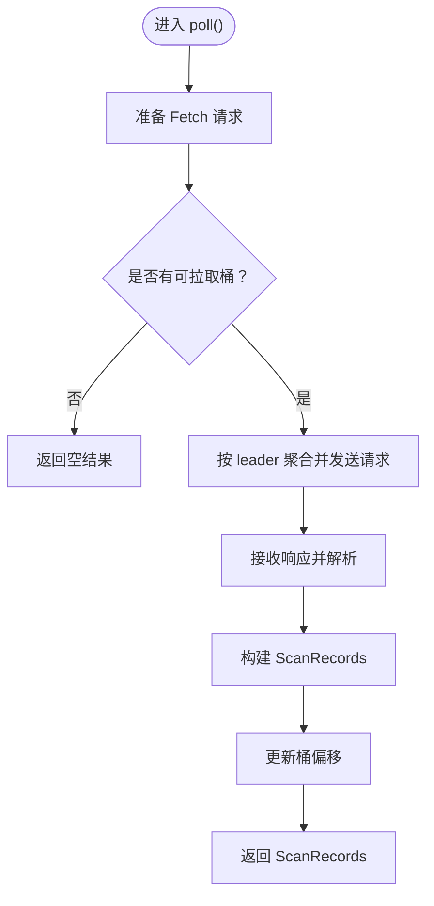
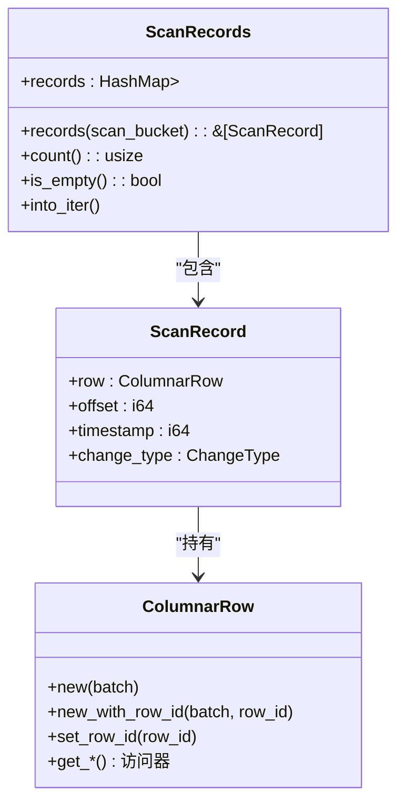
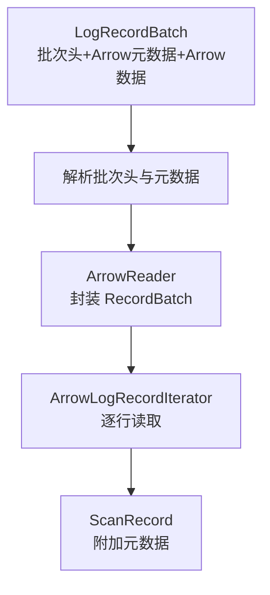
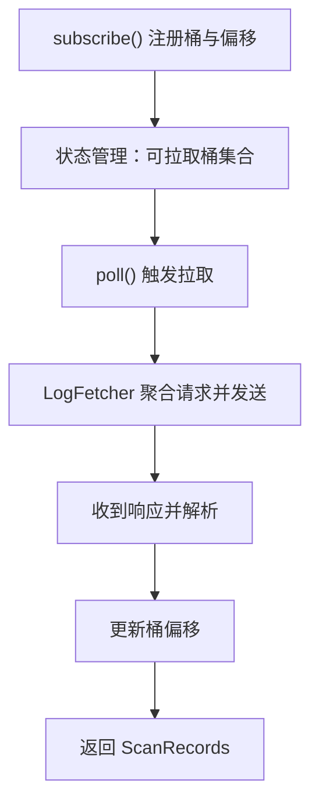
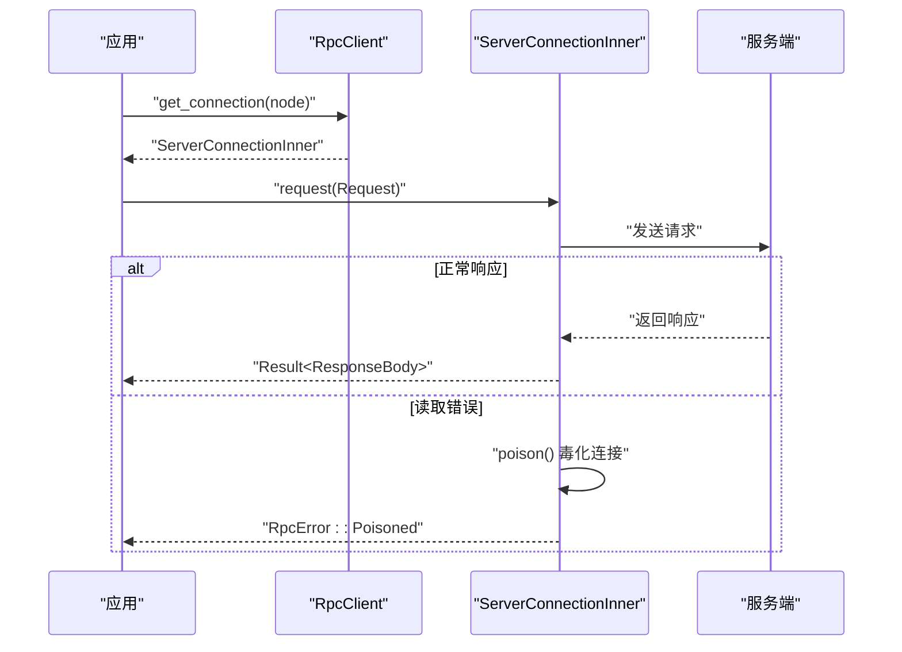
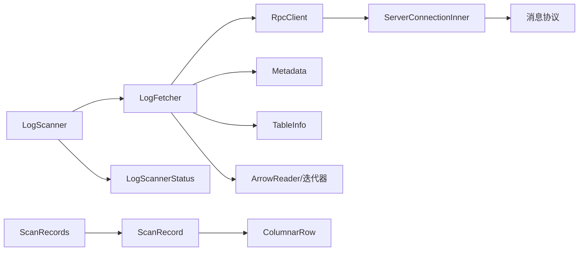

# 流式处理

<cite>
**本文引用的文件**
- [crates/fluss/src/client/table/scanner.rs](file://crates/fluss/src/client/table/scanner.rs)
- [crates/fluss/src/record/mod.rs](file://crates/fluss/src/record/mod.rs)
- [crates/fluss/src/record/arrow.rs](file://crates/fluss/src/record/arrow.rs)
- [crates/fluss/src/row/column.rs](file://crates/fluss/src/row/column.rs)
- [crates/fluss/src/util/mod.rs](file://crates/fluss/src/util/mod.rs)
- [crates/fluss/src/rpc/server_connection.rs](file://crates/fluss/src/rpc/server_connection.rs)
- [crates/fluss/src/rpc/message/mod.rs](file://crates/fluss/src/rpc/message/mod.rs)
- [crates/fluss/src/client/table/mod.rs](file://crates/fluss/src/client/table/mod.rs)
- [crates/examples/src/example_table.rs](file://crates/examples/src/example_table.rs)
</cite>

## 目录
1. [简介](#简介)
2. [项目结构](#项目结构)
3. [核心组件](#核心组件)
4. [架构总览](#架构总览)
5. [组件详解](#组件详解)
6. [依赖关系分析](#依赖关系分析)
7. [性能考量](#性能考量)
8. [故障排查指南](#故障排查指南)
9. [结论](#结论)
10. [附录：示例与用法](#附录示例与用法)

## 简介
本文件围绕流式处理能力进行系统化说明，重点覆盖以下方面：
- LogScanner::poll() 的工作机制：轮询策略、超时处理、批量获取逻辑
- ScanRecords 数据结构与使用：记录批次、元数据、Arrow 格式转换
- 流式消费模式：持续扫描、增量处理、背压控制
- Arrow 在流式处理中的应用：内存管理、零拷贝优化、向量化处理
- 异步编程与并发控制：Future 处理、错误传播
- 性能优化技巧与监控指标建议

## 项目结构
与流式处理直接相关的模块主要集中在 client/table、record、row、rpc 以及 util 中：
- client/table/scanner.rs：流式扫描器 LogScanner 及其状态管理
- record/mod.rs 与 record/arrow.rs：ScanRecord、ScanRecords、Arrow 转换与迭代器
- row/column.rs：列存行 ColumnarRow 的读取接口
- util/mod.rs：公平桶状态映射 FairBucketStatusMap，用于轮询与背压
- rpc/server_connection.rs 与 rpc/message/mod.rs：RPC 客户端与请求/响应消息协议
- examples/example_table.rs：示例程序，演示实时流式消费

图表来源
- [crates/fluss/src/client/table/scanner.rs](file://crates/fluss/src/client/table/scanner.rs#L38-L108)
- [crates/fluss/src/rpc/server_connection.rs](file://crates/fluss/src/rpc/server_connection.rs#L47-L97)
- [crates/fluss/src/rpc/message/mod.rs](file://crates/fluss/src/rpc/message/mod.rs#L37-L51)
- [crates/fluss/src/record/mod.rs](file://crates/fluss/src/record/mod.rs#L87-L161)
- [crates/fluss/src/record/arrow.rs](file://crates/fluss/src/record/arrow.rs#L236-L400)
- [crates/fluss/src/row/column.rs](file://crates/fluss/src/row/column.rs#L25-L48)

章节来源
- [crates/fluss/src/client/table/mod.rs](file://crates/fluss/src/client/table/mod.rs#L32-L66)
- [crates/fluss/src/client/table/scanner.rs](file://crates/fluss/src/client/table/scanner.rs#L38-L108)
- [crates/fluss/src/rpc/server_connection.rs](file://crates/fluss/src/rpc/server_connection.rs#L47-L97)
- [crates/fluss/src/rpc/message/mod.rs](file://crates/fluss/src/rpc/message/mod.rs#L37-L51)
- [crates/fluss/src/record/mod.rs](file://crates/fluss/src/record/mod.rs#L87-L161)
- [crates/fluss/src/record/arrow.rs](file://crates/fluss/src/record/arrow.rs#L236-L400)
- [crates/fluss/src/row/column.rs](file://crates/fluss/src/row/column.rs#L25-L48)

## 核心组件
- LogScanner：负责订阅桶、维护偏移、发起拉取请求并返回 ScanRecords
- LogFetcher：准备 FetchLog 请求、按 leader 聚合、调用 RPC 并解析响应
- LogScannerStatus：维护每个桶的偏移与高水位，支持公平轮询
- ScanRecord/ScanRecords：封装单条记录及其元数据，以及按桶聚合的结果集
- ArrowReader/迭代器：从 Arrow RecordBatch 中逐行读取，实现向量化处理
- RpcClient/ServerConnectionInner：异步 RPC 客户端，支持请求排队、响应分发与错误传播

章节来源
- [crates/fluss/src/client/table/scanner.rs](file://crates/fluss/src/client/table/scanner.rs#L62-L108)
- [crates/fluss/src/client/table/scanner.rs](file://crates/fluss/src/client/table/scanner.rs#L111-L244)
- [crates/fluss/src/client/table/scanner.rs](file://crates/fluss/src/client/table/scanner.rs#L246-L370)
- [crates/fluss/src/record/mod.rs](file://crates/fluss/src/record/mod.rs#L87-L161)
- [crates/fluss/src/record/arrow.rs](file://crates/fluss/src/record/arrow.rs#L236-L400)
- [crates/fluss/src/rpc/server_connection.rs](file://crates/fluss/src/rpc/server_connection.rs#L47-L97)

## 架构总览
下图展示了从应用侧到服务端的完整链路：应用通过 TableScan 创建 LogScanner，后者基于订阅的桶集合构造 FetchLog 请求，经由 RpcClient 与 ServerConnectionInner 发送到对应 leader 节点，服务端返回 Arrow 序列化的 RecordBatch，最终由 LogFetcher 解析并生成 ScanRecords。

图表来源
- [crates/fluss/src/client/table/scanner.rs](file://crates/fluss/src/client/table/scanner.rs#L53-L108)
- [crates/fluss/src/client/table/scanner.rs](file://crates/fluss/src/client/table/scanner.rs#L135-L173)
- [crates/fluss/src/rpc/server_connection.rs](file://crates/fluss/src/rpc/server_connection.rs#L233-L287)
- [crates/fluss/src/rpc/server_connection.rs](file://crates/fluss/src/rpc/server_connection.rs#L47-L97)

## 组件详解

### LogScanner::poll() 工作机制
- 入口：poll() 接收一个超时参数（当前实现中未直接使用），返回 ScanRecords 包装的异步结果
- 内部流程：内部委托给 poll_for_fetches()，后者由 LogFetcher 执行实际的 RPC 拉取与聚合
- 轮询策略：通过 LogScannerStatus 的公平桶映射 FairBucketStatusMap，按顺序遍历可拉取桶，避免饥饿
- 背压控制：当无可用桶或无订阅桶时，prepare_fetch_log_requests() 返回空映射，从而不发送请求
- 增量处理：每次成功拉取后更新桶的下一个偏移，确保只消费新增数据

图表来源
- [crates/fluss/src/client/table/scanner.rs](file://crates/fluss/src/client/table/scanner.rs#L91-L107)
- [crates/fluss/src/client/table/scanner.rs](file://crates/fluss/src/client/table/scanner.rs#L175-L233)
- [crates/fluss/src/client/table/scanner.rs](file://crates/fluss/src/client/table/scanner.rs#L135-L173)

章节来源
- [crates/fluss/src/client/table/scanner.rs](file://crates/fluss/src/client/table/scanner.rs#L91-L107)
- [crates/fluss/src/client/table/scanner.rs](file://crates/fluss/src/client/table/scanner.rs#L105-L107)
- [crates/fluss/src/client/table/scanner.rs](file://crates/fluss/src/client/table/scanner.rs#L175-L233)
- [crates/fluss/src/util/mod.rs](file://crates/fluss/src/util/mod.rs#L32-L170)

### ScanRecords 数据结构与使用
- ScanRecord：封装一行数据（ColumnarRow）、日志偏移、时间戳、变更类型
- ScanRecords：以 TableBucket 为键聚合多条 ScanRecord，提供按桶查询、总数统计、迭代器等
- 使用方式：
  - 订阅桶：subscribe() 将桶与初始偏移注册到状态管理
  - 拉取：poll() 返回 ScanRecords，可整体迭代或按桶访问
  - 增量：每次成功拉取后，LogFetcher 更新桶的下一个偏移

图表来源
- [crates/fluss/src/record/mod.rs](file://crates/fluss/src/record/mod.rs#L87-L161)
- [crates/fluss/src/row/column.rs](file://crates/fluss/src/row/column.rs#L25-L48)

章节来源
- [crates/fluss/src/record/mod.rs](file://crates/fluss/src/record/mod.rs#L87-L161)
- [crates/fluss/src/row/column.rs](file://crates/fluss/src/row/column.rs#L25-L48)

### Arrow 格式在流式处理中的应用
- Schema 映射：to_arrow_schema() 将 Fluss 表结构映射为 Arrow Schema
- 批次解析：LogRecordBatch 从二进制批次中提取 Arrow 元数据与 RecordBatch，再由 ArrowReader 提供行级访问
- 迭代器：ArrowLogRecordIterator 逐行生成 ScanRecord，携带 base_offset、commit_timestamp、change_type 等元数据
- 内存管理：RecordBatch 生命周期由 Arc 管理；ColumnarRow 仅保存引用，避免复制
- 零拷贝与向量化：列式存储与批量读取，减少 CPU 缓存抖动与分支预测失败

图表来源
- [crates/fluss/src/record/arrow.rs](file://crates/fluss/src/record/arrow.rs#L280-L400)
- [crates/fluss/src/record/arrow.rs](file://crates/fluss/src/record/arrow.rs#L487-L526)
- [crates/fluss/src/row/column.rs](file://crates/fluss/src/row/column.rs#L50-L169)

章节来源
- [crates/fluss/src/record/arrow.rs](file://crates/fluss/src/record/arrow.rs#L402-L447)
- [crates/fluss/src/record/arrow.rs](file://crates/fluss/src/record/arrow.rs#L280-L400)
- [crates/fluss/src/row/column.rs](file://crates/fluss/src/row/column.rs#L50-L169)

### 流式消费模式与背压控制
- 持续扫描：应用侧循环调用 poll()，形成“拉取-处理-更新偏移”的闭环
- 增量处理：LogFetcher 在解析批次时计算 last_log_offset，并将下一个偏移写入状态，保证只消费新增数据
- 背压控制：
  - 桶级公平轮询：FairBucketStatusMap 保持插入顺序，move_to_end() 将活跃桶移到末尾，避免饥饿
  - 请求粒度：prepare_fetch_log_requests() 仅对有订阅且可拉取的桶发送请求
  - 服务端限流：FetchLogRequest 支持 max_bytes、min_bytes、max_wait_ms 参数（当前实现固定常量）

图表来源
- [crates/fluss/src/client/table/scanner.rs](file://crates/fluss/src/client/table/scanner.rs#L95-L103)
- [crates/fluss/src/client/table/scanner.rs](file://crates/fluss/src/client/table/scanner.rs#L175-L233)
- [crates/fluss/src/util/mod.rs](file://crates/fluss/src/util/mod.rs#L32-L170)

章节来源
- [crates/fluss/src/client/table/scanner.rs](file://crates/fluss/src/client/table/scanner.rs#L95-L103)
- [crates/fluss/src/client/table/scanner.rs](file://crates/fluss/src/client/table/scanner.rs#L175-L233)
- [crates/fluss/src/util/mod.rs](file://crates/fluss/src/util/mod.rs#L32-L170)

### 异步编程与并发控制
- Future 与并发：poll()、send_fetches_and_collect()、get_connection() 均为异步方法，支持并发拉取多个桶
- 错误传播：RpcClient.request() 返回 Result，内部通过 oneshot 渠道传递错误；ServerConnectionInner 在读取失败时毒化连接，后续请求立即失败
- 连接复用：RpcClient 维护按节点的连接缓存，避免重复握手
- 取消安全：CancellationSafeFuture 与 CleanupRequestStateOnCancel 确保取消不会破坏请求状态一致性

图表来源
- [crates/fluss/src/rpc/server_connection.rs](file://crates/fluss/src/rpc/server_connection.rs#L64-L96)
- [crates/fluss/src/rpc/server_connection.rs](file://crates/fluss/src/rpc/server_connection.rs#L233-L287)
- [crates/fluss/src/rpc/server_connection.rs](file://crates/fluss/src/rpc/server_connection.rs#L122-L144)

章节来源
- [crates/fluss/src/rpc/server_connection.rs](file://crates/fluss/src/rpc/server_connection.rs#L64-L96)
- [crates/fluss/src/rpc/server_connection.rs](file://crates/fluss/src/rpc/server_connection.rs#L233-L287)
- [crates/fluss/src/rpc/server_connection.rs](file://crates/fluss/src/rpc/server_connection.rs#L122-L144)

## 依赖关系分析
- LogScanner 依赖 Metadata、RpcClient、LogFetcher、LogScannerStatus
- LogFetcher 依赖 Metadata、RpcClient、TableInfo、LogScannerStatus
- ScanRecords 依赖 TableBucket、ScanRecord
- ArrowReader/迭代器 依赖 Arrow RecordBatch 与 ColumnarRow
- RpcClient/ServerConnectionInner 依赖消息协议与传输层

图表来源
- [crates/fluss/src/client/table/scanner.rs](file://crates/fluss/src/client/table/scanner.rs#L62-L108)
- [crates/fluss/src/client/table/scanner.rs](file://crates/fluss/src/client/table/scanner.rs#L111-L244)
- [crates/fluss/src/record/mod.rs](file://crates/fluss/src/record/mod.rs#L87-L161)
- [crates/fluss/src/record/arrow.rs](file://crates/fluss/src/record/arrow.rs#L236-L400)
- [crates/fluss/src/rpc/server_connection.rs](file://crates/fluss/src/rpc/server_connection.rs#L47-L97)
- [crates/fluss/src/rpc/message/mod.rs](file://crates/fluss/src/rpc/message/mod.rs#L37-L51)

章节来源
- [crates/fluss/src/client/table/scanner.rs](file://crates/fluss/src/client/table/scanner.rs#L62-L108)
- [crates/fluss/src/record/mod.rs](file://crates/fluss/src/record/mod.rs#L87-L161)
- [crates/fluss/src/record/arrow.rs](file://crates/fluss/src/record/arrow.rs#L236-L400)
- [crates/fluss/src/rpc/server_connection.rs](file://crates/fluss/src/rpc/server_connection.rs#L47-L97)

## 性能考量
- 批量大小与等待时间：FetchLogRequest 支持 max_bytes、min_bytes、max_wait_ms，可根据延迟与吞吐目标调整
- 列式与向量化：Arrow RecordBatch 提供列式访问，适合向量化计算与 SIMD 优化
- 内存管理：RecordBatch 与 ColumnarRow 采用 Arc 引用，避免不必要的数据复制
- 公平轮询：FairBucketStatusMap 降低部分桶饥饿风险，提升整体吞吐稳定性
- RPC 层面：连接复用、取消安全、毒化恢复，减少网络开销与错误扩散

## 故障排查指南
- 无结果或长时间阻塞
  - 检查是否已调用 subscribe() 并正确传入桶号与起始偏移
  - 确认 LogFetcher.prepare_fetch_log_requests() 是否返回非空映射
- 偏移未前进
  - 检查 LogFetcher 是否在解析后调用 LogScannerStatus.update_offset()
- RPC 错误
  - 查看 RpcClient.request() 的返回值，关注 RpcError::Poisoned
  - 检查 ServerConnectionInner 的毒化状态与错误日志
- Arrow 解析异常
  - 核对批次校验和与批次头字段，确认 Arrow 元数据与数据拼接正确

章节来源
- [crates/fluss/src/client/table/scanner.rs](file://crates/fluss/src/client/table/scanner.rs#L175-L233)
- [crates/fluss/src/client/table/scanner.rs](file://crates/fluss/src/client/table/scanner.rs#L135-L173)
- [crates/fluss/src/rpc/server_connection.rs](file://crates/fluss/src/rpc/server_connection.rs#L233-L287)
- [crates/fluss/src/record/arrow.rs](file://crates/fluss/src/record/arrow.rs#L309-L323)

## 结论
该流式处理子系统以 LogScanner 为核心，结合 RPC 拉取、Arrow 向量化与公平桶调度，实现了低延迟、高吞吐的增量消费能力。通过 ScanRecords 抽象与异步 RPC，系统在易用性与性能之间取得平衡。建议在生产环境中根据业务特征调整批量与等待参数，并配合监控指标（如拉取延迟、批次大小、偏移滞后）进行持续优化。

## 附录：示例与用法
- 示例程序展示了如何创建表、写入数据、订阅桶并循环拉取流式记录
- 关键步骤：new_scan() → create_log_scanner() → subscribe() → poll() 循环

章节来源
- [crates/examples/src/example_table.rs](file://crates/examples/src/example_table.rs#L69-L85)