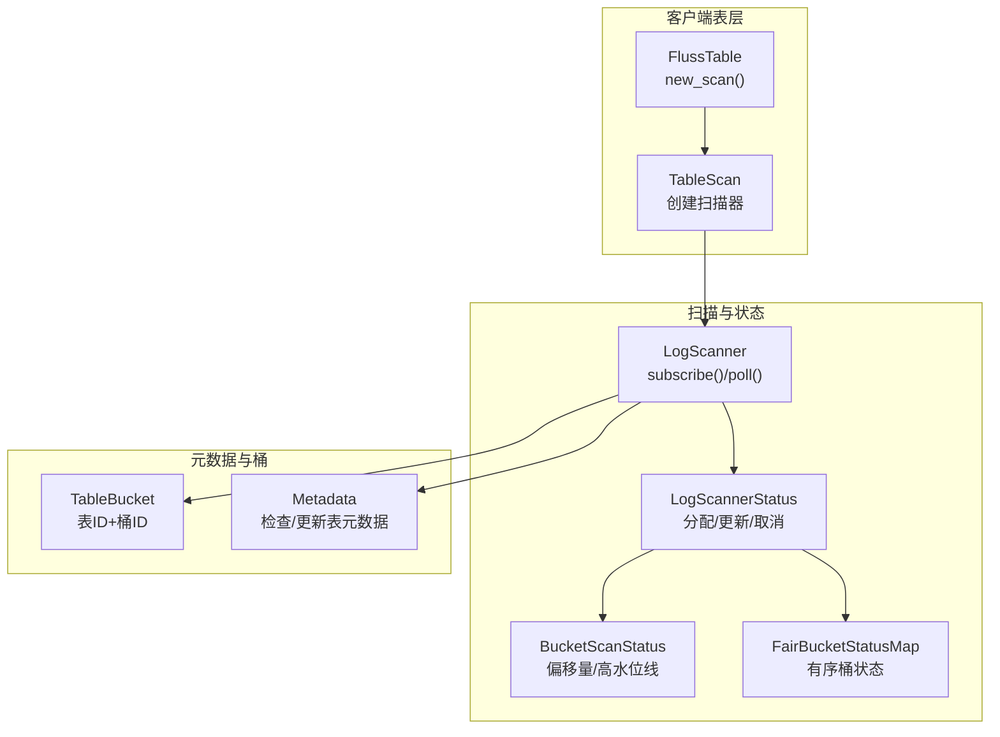
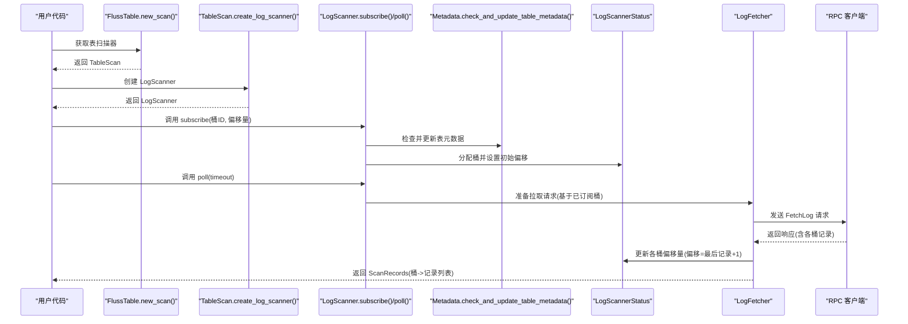
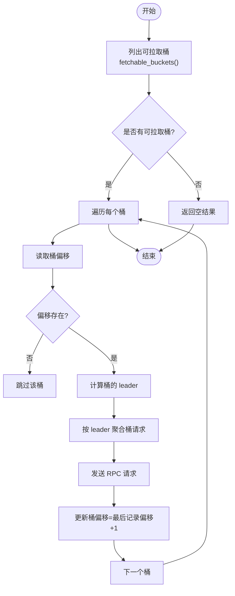
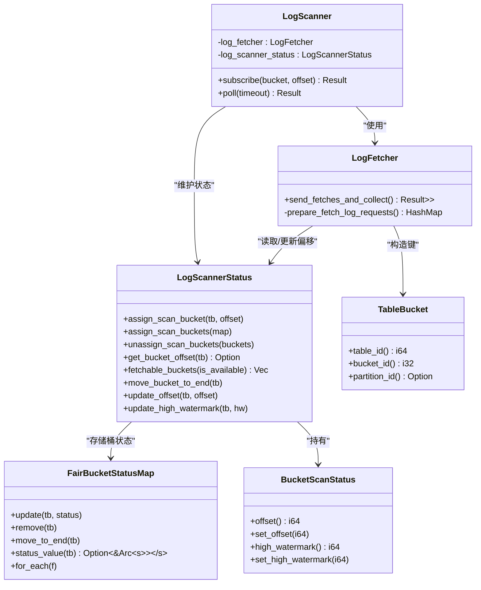
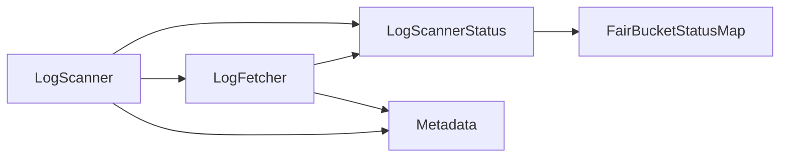

# 订阅管理

<cite>
**本文引用的文件**
- [crates/fluss/src/client/table/scanner.rs](file://crates/fluss/src/client/table/scanner.rs)
- [crates/fluss/src/client/table/mod.rs](file://crates/fluss/src/client/table/mod.rs)
- [crates/fluss/src/metadata/table.rs](file://crates/fluss/src/metadata/table.rs)
- [crates/fluss/src/client/metadata.rs](file://crates/fluss/src/client/metadata.rs)
- [crates/fluss/src/util/mod.rs](file://crates/fluss/src/util/mod.rs)
</cite>

## 目录
1. [简介](#简介)
2. [项目结构](#项目结构)
3. [核心组件](#核心组件)
4. [架构总览](#架构总览)
5. [详细组件分析](#详细组件分析)
6. [依赖关系分析](#依赖关系分析)
7. [性能考量](#性能考量)
8. [故障排查指南](#故障排查指南)
9. [结论](#结论)
10. [附录：使用示例与最佳实践](#附录使用示例与最佳实践)

## 简介
本章节面向“订阅管理”能力，聚焦于 LogScanner::subscribe() 的使用方式与内部机制，解释以下关键点：
- 桶订阅与偏移量设置
- 订阅生命周期管理（分配、状态更新、取消）
- TableBucket 的概念与组合标识（表 ID + 桶 ID）
- 多桶并发扫描的实现原理（桶选择策略、负载均衡、资源竞争）
- 订阅与扫描器状态的协调（偏移量同步、高水位线管理、一致性）
- 常见订阅场景与最佳实践

## 项目结构
围绕订阅管理的相关模块分布如下：
- 表级扫描入口：TableScan::create_log_scanner() 提供 LogScanner 实例
- 扫描器与状态：LogScanner、LogScannerStatus、BucketScanStatus
- 桶与元数据：TableBucket、Metadata（用于检查/更新表元数据）
- 公平桶状态映射：FairBucketStatusMap（有序、公平的桶状态容器）

图表来源
- [crates/fluss/src/client/table/mod.rs](file://crates/fluss/src/client/table/mod.rs#L64-L66)
- [crates/fluss/src/client/table/scanner.rs](file://crates/fluss/src/client/table/scanner.rs#L53-L59)
- [crates/fluss/src/client/table/scanner.rs](file://crates/fluss/src/client/table/scanner.rs#L62-L89)
- [crates/fluss/src/client/table/scanner.rs](file://crates/fluss/src/client/table/scanner.rs#L246-L331)
- [crates/fluss/src/metadata/table.rs](file://crates/fluss/src/metadata/table.rs#L893-L920)
- [crates/fluss/src/client/metadata.rs](file://crates/fluss/src/client/metadata.rs#L83-L94)

章节来源
- [crates/fluss/src/client/table/mod.rs](file://crates/fluss/src/client/table/mod.rs#L64-L66)
- [crates/fluss/src/client/table/scanner.rs](file://crates/fluss/src/client/table/scanner.rs#L53-L59)
- [crates/fluss/src/metadata/table.rs](file://crates/fluss/src/metadata/table.rs#L893-L920)
- [crates/fluss/src/client/metadata.rs](file://crates/fluss/src/client/metadata.rs#L83-L94)

## 核心组件
- LogScanner：对外暴露 subscribe() 与 poll()，负责订阅桶、准备请求、发送拉取并聚合结果
- LogScannerStatus：维护每个 TableBucket 的扫描状态（偏移量、高水位线），支持批量分配、单个分配、取消、查询可拉取桶
- BucketScanStatus：单桶的偏移量与高水位线
- FairBucketStatusMap：以 LinkedHashMap 为基础的有序状态映射，支持移动到末尾、按表分组插入等，保障公平性
- TableBucket：由表 ID 与桶 ID 组合而成的唯一标识
- Metadata：在订阅前检查并必要时更新表元数据，确保集群视图最新

章节来源
- [crates/fluss/src/client/table/scanner.rs](file://crates/fluss/src/client/table/scanner.rs#L62-L108)
- [crates/fluss/src/client/table/scanner.rs](file://crates/fluss/src/client/table/scanner.rs#L246-L331)
- [crates/fluss/src/metadata/table.rs](file://crates/fluss/src/metadata/table.rs#L893-L920)
- [crates/fluss/src/util/mod.rs](file://crates/fluss/src/util/mod.rs#L32-L170)
- [crates/fluss/src/client/metadata.rs](file://crates/fluss/src/client/metadata.rs#L83-L94)

## 架构总览
订阅管理的端到端流程如下：

图表来源
- [crates/fluss/src/client/table/mod.rs](file://crates/fluss/src/client/table/mod.rs#L64-L66)
- [crates/fluss/src/client/table/scanner.rs](file://crates/fluss/src/client/table/scanner.rs#L53-L59)
- [crates/fluss/src/client/table/scanner.rs](file://crates/fluss/src/client/table/scanner.rs#L95-L103)
- [crates/fluss/src/client/table/scanner.rs](file://crates/fluss/src/client/table/scanner.rs#L105-L107)
- [crates/fluss/src/client/table/scanner.rs](file://crates/fluss/src/client/table/scanner.rs#L135-L173)
- [crates/fluss/src/client/metadata.rs](file://crates/fluss/src/client/metadata.rs#L83-L94)

## 详细组件分析

### LogScanner::subscribe() 使用详解
- 功能：为指定桶设置初始扫描偏移，完成订阅
- 关键步骤
  - 构造 TableBucket：使用当前表 ID 与传入桶 ID
  - 检查并更新表元数据：确保集群视图包含该表
  - 将桶与偏移写入 LogScannerStatus，完成订阅分配
- 注意事项
  - 偏移量通常从 0 开始，或从上次消费位置继续
  - 若表元数据缺失，会触发一次更新后再进行订阅

章节来源
- [crates/fluss/src/client/table/scanner.rs](file://crates/fluss/src/client/table/scanner.rs#L95-L103)
- [crates/fluss/src/client/metadata.rs](file://crates/fluss/src/client/metadata.rs#L83-L94)
- [crates/fluss/src/metadata/table.rs](file://crates/fluss/src/metadata/table.rs#L893-L920)

### TableBucket：组合标识与语义
- 结构：包含表 ID、分区 ID（可选）与桶 ID
- 用途：作为扫描状态与请求调度的最小单位，唯一标识某表的某个桶
- 生成：通过 TableBucket::new(table_id, bucket) 构造

章节来源
- [crates/fluss/src/metadata/table.rs](file://crates/fluss/src/metadata/table.rs#L893-L920)

### 订阅状态维护机制
- 分配订阅
  - 单桶：assign_scan_bucket(table_bucket, offset)
  - 批量：assign_scan_buckets(map: TableBucket -> offset)
- 查询与过滤
  - get_bucket_offset(&table_bucket)：查询当前偏移
  - fetchable_buckets(is_available)：根据可用性谓词筛选可拉取桶
  - move_bucket_to_end(table_bucket)：将桶移动至迭代末尾，实现公平轮转
- 取消订阅
  - unassign_scan_buckets(&[TableBucket])：移除指定桶的状态
- 高水位线
  - update_high_watermark(table_bucket, watermark)：更新逻辑上的“水位线”，便于上层做空闲检测或限流

章节来源
- [crates/fluss/src/client/table/scanner.rs](file://crates/fluss/src/client/table/scanner.rs#L286-L331)

### 偏移量同步与高水位线管理
- 偏移量同步
  - 每次成功拉取后，LogFetcher 会遍历各桶记录，将偏移更新为“最后记录偏移 + 1”
  - 这保证下一次拉取从正确位置继续，避免重复或跳过
- 高水位线
  - 由上层业务或系统维护，用于判断是否到达最新位置
  - 可配合 fetchable_buckets 的可用性谓词，控制拉取节奏

章节来源
- [crates/fluss/src/client/table/scanner.rs](file://crates/fluss/src/client/table/scanner.rs#L159-L167)
- [crates/fluss/src/client/table/scanner.rs](file://crates/fluss/src/client/table/scanner.rs#L274-L284)

### 多桶并发扫描与负载均衡
- 桶选择策略
  - fetchable_buckets(|tb| is_available(tb))：允许上层传入可用性谓词，实现按条件筛选
  - 默认实现直接返回所有已订阅桶
- 负载均衡
  - FairBucketStatusMap 内部使用 LinkedHashMap，支持 move_to_end，可将最近使用的桶移到末尾，实现“相对公平”的轮询
  - set() 支持按表 ID 分组插入，减少跨表争用
- 资源竞争处理
  - prepare_fetch_log_requests() 将桶按 leader 节点聚合，降低跨节点竞争
  - 每次只对有偏移且可分配的桶发起请求，避免无效 IO

图表来源
- [crates/fluss/src/client/table/scanner.rs](file://crates/fluss/src/client/table/scanner.rs#L175-L233)
- [crates/fluss/src/client/table/scanner.rs](file://crates/fluss/src/client/table/scanner.rs#L235-L244)
- [crates/fluss/src/util/mod.rs](file://crates/fluss/src/util/mod.rs#L32-L170)

章节来源
- [crates/fluss/src/client/table/scanner.rs](file://crates/fluss/src/client/table/scanner.rs#L175-L233)
- [crates/fluss/src/util/mod.rs](file://crates/fluss/src/util/mod.rs#L32-L170)

### 类关系与职责

图表来源
- [crates/fluss/src/client/table/scanner.rs](file://crates/fluss/src/client/table/scanner.rs#L62-L108)
- [crates/fluss/src/client/table/scanner.rs](file://crates/fluss/src/client/table/scanner.rs#L119-L173)
- [crates/fluss/src/client/table/scanner.rs](file://crates/fluss/src/client/table/scanner.rs#L246-L331)
- [crates/fluss/src/metadata/table.rs](file://crates/fluss/src/metadata/table.rs#L893-L920)
- [crates/fluss/src/util/mod.rs](file://crates/fluss/src/util/mod.rs#L32-L170)

## 依赖关系分析
- 组件耦合
  - LogScanner 依赖 Metadata 以确保表元数据最新；依赖 LogFetcher 发起 RPC 拉取
  - LogFetcher 依赖 LogScannerStatus 读取/更新偏移，依赖 Metadata 获取 leader 节点
  - LogScannerStatus 依赖 FairBucketStatusMap 存储桶状态
- 外部依赖
  - RPC 客户端用于与 TabletServer 通信
  - 元数据服务用于获取集群拓扑与表信息

图表来源
- [crates/fluss/src/client/table/scanner.rs](file://crates/fluss/src/client/table/scanner.rs#L62-L108)
- [crates/fluss/src/client/table/scanner.rs](file://crates/fluss/src/client/table/scanner.rs#L119-L173)
- [crates/fluss/src/client/metadata.rs](file://crates/fluss/src/client/metadata.rs#L83-L94)

章节来源
- [crates/fluss/src/client/table/scanner.rs](file://crates/fluss/src/client/table/scanner.rs#L62-L108)
- [crates/fluss/src/client/metadata.rs](file://crates/fluss/src/client/metadata.rs#L83-L94)

## 性能考量
- 并发拉取
  - 按 leader 聚合请求，减少网络往返与服务器压力
- 公平轮询
  - 通过 move_to_end 与 LinkedHashMap，避免某些桶长期被忽略
- 请求大小与等待时间
  - 拉取请求包含最大/最小字节数与最大等待时间，平衡吞吐与延迟
- 偏移更新粒度
  - 每批记录处理后即时更新偏移，减少重复拉取

章节来源
- [crates/fluss/src/client/table/scanner.rs](file://crates/fluss/src/client/table/scanner.rs#L175-L233)
- [crates/fluss/src/util/mod.rs](file://crates/fluss/src/util/mod.rs#L32-L170)

## 故障排查指南
- 订阅后 poll 无数据
  - 检查是否调用了 subscribe() 并设置了正确的桶 ID 与偏移
  - 确认 Metadata.check_and_update_table_metadata() 已成功更新表元数据
  - 使用 LogScannerStatus::prepare_to_poll() 判断是否存在已订阅桶
- 偏移未前进
  - 确认 LogFetcher 是否收到响应并执行了 update_offset
  - 检查是否有异常导致提前返回
- 高水位线与空闲判定
  - 使用 update_high_watermark 设置逻辑水位线，结合 fetchable_buckets 的可用性谓词控制拉取节奏

章节来源
- [crates/fluss/src/client/table/scanner.rs](file://crates/fluss/src/client/table/scanner.rs#L95-L103)
- [crates/fluss/src/client/table/scanner.rs](file://crates/fluss/src/client/table/scanner.rs#L135-L173)
- [crates/fluss/src/client/table/scanner.rs](file://crates/fluss/src/client/table/scanner.rs#L258-L261)
- [crates/fluss/src/client/table/scanner.rs](file://crates/fluss/src/client/table/scanner.rs#L274-L284)

## 结论
- 订阅管理以 TableBucket 为核心标识，通过 LogScanner::subscribe() 完成初始偏移设置
- LogScannerStatus 负责状态持久化与公平调度，BucketScanStatus 提供细粒度的偏移与水位线
- 多桶并发扫描通过按 leader 聚合与 LinkedHashMap 的公平迭代实现负载均衡
- 偏移量与高水位线的协同确保了消费进度的一致性与可预期的空闲行为

## 附录：使用示例与最佳实践

### 场景一：全表订阅（默认所有桶）
- 步骤
  - 通过 FlussTable::new_scan() 获取 TableScan
  - 通过 TableScan::create_log_scanner() 获取 LogScanner
  - 对每个桶调用 subscribe(bucket_id, offset)，offset 通常为 0
  - 循环调用 poll() 获取 ScanRecords
- 最佳实践
  - 在启动时一次性 subscribe 所有桶，避免中途动态增删
  - 使用 move_bucket_to_end 控制公平轮询，避免热点桶饥饿

章节来源
- [crates/fluss/src/client/table/mod.rs](file://crates/fluss/src/client/table/mod.rs#L64-L66)
- [crates/fluss/src/client/table/scanner.rs](file://crates/fluss/src/client/table/scanner.rs#L53-L59)
- [crates/fluss/src/client/table/scanner.rs](file://crates/fluss/src/client/table/scanner.rs#L95-L103)
- [crates/fluss/src/client/table/scanner.rs](file://crates/fluss/src/client/table/scanner.rs#L263-L266)

### 场景二：指定桶订阅
- 步骤
  - 仅对目标桶调用 subscribe(bucket_id, offset)
  - poll() 将仅返回该桶的数据
- 最佳实践
  - 与业务分片策略结合，按桶路由到不同消费者实例

章节来源
- [crates/fluss/src/client/table/scanner.rs](file://crates/fluss/src/client/table/scanner.rs#L95-L103)

### 场景三：动态订阅调整
- 步骤
  - 新增订阅：assign_scan_buckets 或 assign_scan_bucket
  - 取消订阅：unassign_scan_buckets 移除不再需要的桶
  - 调整顺序：move_bucket_to_end 将活跃桶移到末尾
- 最佳实践
  - 在扩容/缩容时，先新增再删除，避免数据丢失
  - 结合 fetchable_buckets 的可用性谓词，实现按需拉取

章节来源
- [crates/fluss/src/client/table/scanner.rs](file://crates/fluss/src/client/table/scanner.rs#L286-L310)
- [crates/fluss/src/client/table/scanner.rs](file://crates/fluss/src/client/table/scanner.rs#L311-L324)
- [crates/fluss/src/client/table/scanner.rs](file://crates/fluss/src/client/table/scanner.rs#L263-L266)

### 订阅与扫描器状态协调
- 偏移量同步
  - 每次拉取成功后，LogFetcher 将各桶偏移更新为“最后记录偏移 + 1”
- 高水位线管理
  - 上层业务可根据实时消费速率设置高水位线，用于空闲检测或限流
- 一致性保证
  - 通过“先更新偏移，再返回结果”的顺序，避免重复消费

章节来源
- [crates/fluss/src/client/table/scanner.rs](file://crates/fluss/src/client/table/scanner.rs#L159-L167)
- [crates/fluss/src/client/table/scanner.rs](file://crates/fluss/src/client/table/scanner.rs#L274-L284)