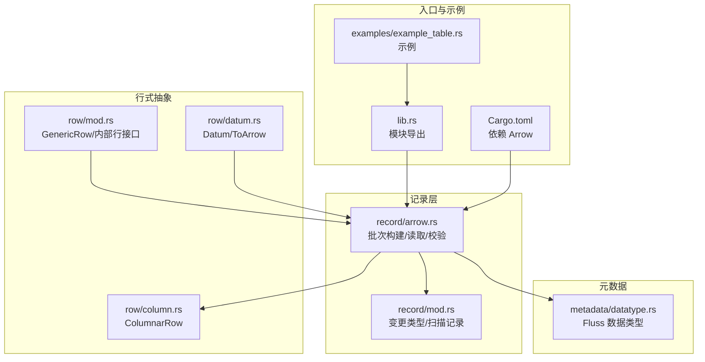
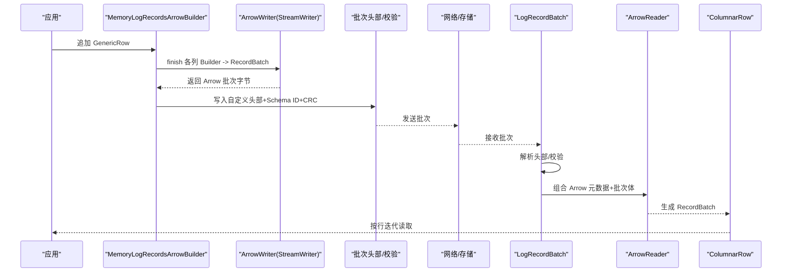
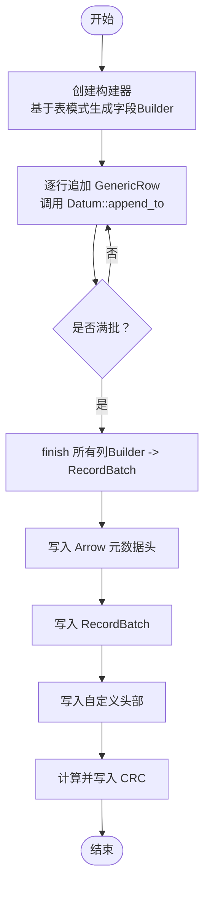
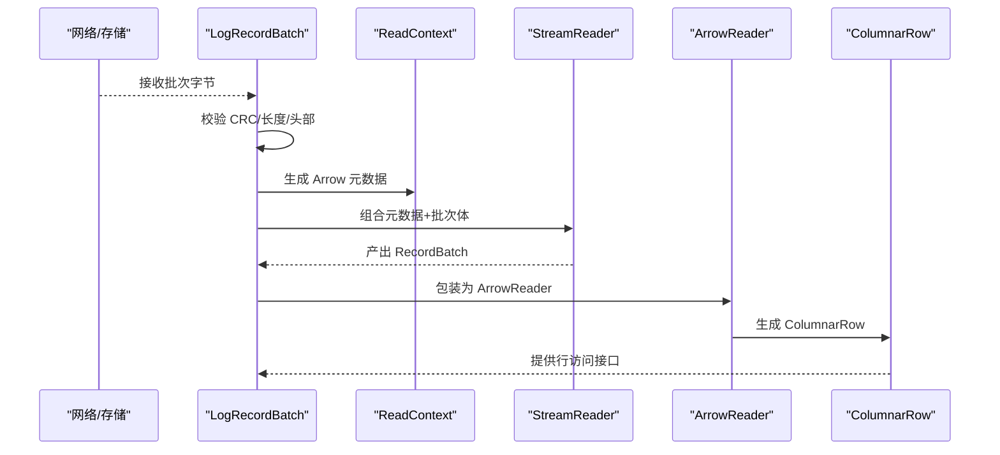
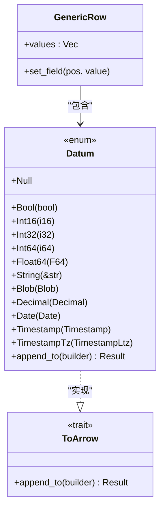
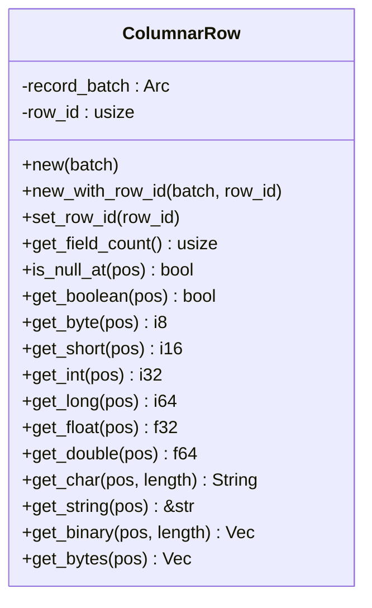
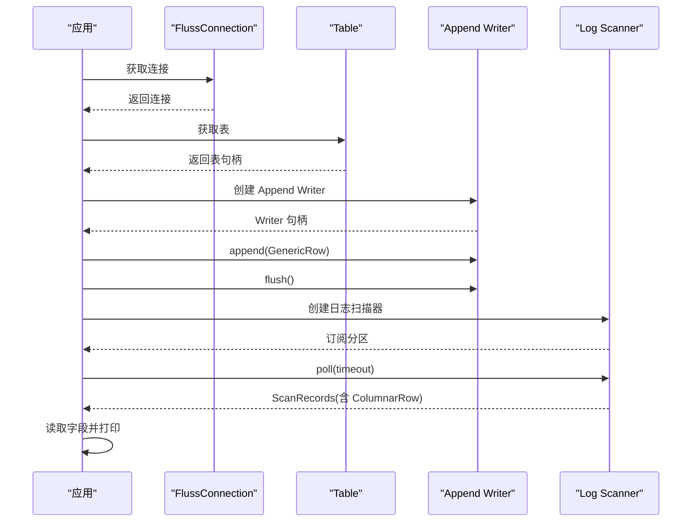
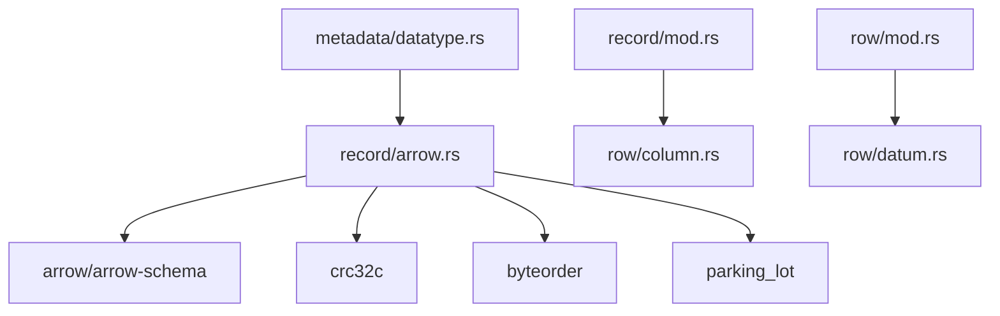

# Arrow 格式介绍

<cite>
**本文引用的文件**
- [crates/fluss/src/record/arrow.rs](file://crates/fluss/src/record/arrow.rs)
- [crates/fluss/src/row/mod.rs](file://crates/fluss/src/row/mod.rs)
- [crates/fluss/src/row/column.rs](file://crates/fluss/src/row/column.rs)
- [crates/fluss/src/row/datum.rs](file://crates/fluss/src/row/datum.rs)
- [crates/fluss/src/metadata/datatype.rs](file://crates/fluss/src/metadata/datatype.rs)
- [crates/fluss/src/record/mod.rs](file://crates/fluss/src/record/mod.rs)
- [crates/fluss/src/lib.rs](file://crates/fluss/src/lib.rs)
- [crates/fluss/Cargo.toml](file://crates/fluss/Cargo.toml)
- [crates/examples/src/example_table.rs](file://crates/examples/src/example_table.rs)
</cite>

## 目录
1. [引言](#引言)
2. [项目结构](#项目结构)
3. [核心组件](#核心组件)
4. [架构总览](#架构总览)
5. [组件详解](#组件详解)
6. [依赖关系分析](#依赖关系分析)
7. [性能考量](#性能考量)
8. [故障排查指南](#故障排查指南)
9. [结论](#结论)
10. [附录](#附录)

## 引言
本文件系统性介绍 Fluss Rust 客户端中 Arrow 列式数据格式的应用与实现。内容覆盖 Arrow 在 Fluss 中的使用动机（内存效率、向量化操作、零拷贝传输）、核心组件设计（GenericRow、ArrowConvert、ArrowReader 等）、数据类型映射、序列化与反序列化流程，并通过示例路径展示写入与读取的典型用法。同时给出与传统行式格式的对比与分布式传输优化策略，帮助读者快速理解并正确使用 Arrow 格式。

## 项目结构
Fluss 的 Arrow 集成主要集中在以下模块：
- 记录层：记录批次的头部、序列化与反序列化逻辑，以及 Arrow 批次的读取器
- 行式抽象：通用行 GenericRow 与列存行 ColumnarRow 的统一访问接口
- 数据类型：Fluss 自身的数据类型体系与 Arrow 类型映射
- 示例与入口：对外暴露的库模块与示例程序

**图表来源**
- [crates/fluss/src/record/arrow.rs](file://crates/fluss/src/record/arrow.rs#L1-L546)
- [crates/fluss/src/record/mod.rs](file://crates/fluss/src/record/mod.rs#L1-L175)
- [crates/fluss/src/row/mod.rs](file://crates/fluss/src/row/mod.rs#L1-L149)
- [crates/fluss/src/row/column.rs](file://crates/fluss/src/row/column.rs#L1-L170)
- [crates/fluss/src/row/datum.rs](file://crates/fluss/src/row/datum.rs#L1-L288)
- [crates/fluss/src/metadata/datatype.rs](file://crates/fluss/src/metadata/datatype.rs#L1-L815)
- [crates/fluss/src/lib.rs](file://crates/fluss/src/lib.rs#L1-L38)
- [crates/fluss/Cargo.toml](file://crates/fluss/Cargo.toml#L25-L47)
- [crates/examples/src/example_table.rs](file://crates/examples/src/example_table.rs#L1-L87)

**章节来源**
- [crates/fluss/src/lib.rs](file://crates/fluss/src/lib.rs#L18-L31)
- [crates/fluss/Cargo.toml](file://crates/fluss/Cargo.toml#L25-L47)

## 核心组件
- Arrow 批次构建器：负责将 GenericRow 写入 Arrow 列式数组，最终生成带自定义头部的二进制批次
- Arrow 批次读取器：从自定义批次中解析头部、CRC 校验、Schema ID，再结合 Arrow 元数据流读取 RecordBatch
- 列存行访问器：ColumnarRow 提供按列数组访问的统一接口，支持布尔、整数、浮点、字符串、字节等类型
- 通用行与 Datum：GenericRow 作为行容器，Datum 作为值载体，实现 ToArrow 将 Rust 值写入 Arrow Builder
- 数据类型映射：Fluss DataType 到 Arrow DataType 的转换函数

**章节来源**
- [crates/fluss/src/record/arrow.rs](file://crates/fluss/src/record/arrow.rs#L92-L230)
- [crates/fluss/src/record/arrow.rs](file://crates/fluss/src/record/arrow.rs#L280-L400)
- [crates/fluss/src/row/column.rs](file://crates/fluss/src/row/column.rs#L25-L170)
- [crates/fluss/src/row/mod.rs](file://crates/fluss/src/row/mod.rs#L76-L149)
- [crates/fluss/src/row/datum.rs](file://crates/fluss/src/row/datum.rs#L37-L169)
- [crates/fluss/src/metadata/datatype.rs](file://crates/fluss/src/metadata/datatype.rs#L24-L44)

## 架构总览
下图展示了 Arrow 在 Fluss 中的端到端流程：写入时将 GenericRow 转换为 Arrow 列式数组，封装为带自定义头部的批次；读取时先解析头部与校验，再组合 Arrow 元数据与批次体进行流式读取。

**图表来源**
- [crates/fluss/src/record/arrow.rs](file://crates/fluss/src/record/arrow.rs#L150-L211)
- [crates/fluss/src/record/arrow.rs](file://crates/fluss/src/record/arrow.rs#L367-L400)
- [crates/fluss/src/row/column.rs](file://crates/fluss/src/row/column.rs#L50-L170)

## 组件详解

### Arrow 批次构建与序列化
- 构建器职责：根据表模式创建 Arrow 字段数组的 Builder 列表，逐列追加值，达到阈值后完成批次
- 序列化流程：先写入 Arrow 元数据头，再写入 RecordBatch，最后回填 CRC
- 头部字段：基础偏移、长度、魔数、提交时间戳、Schema ID、属性、最后偏移增量、写者ID、批次序号、记录数等

**图表来源**
- [crates/fluss/src/record/arrow.rs](file://crates/fluss/src/record/arrow.rs#L104-L185)

**章节来源**
- [crates/fluss/src/record/arrow.rs](file://crates/fluss/src/record/arrow.rs#L92-L230)
- [crates/fluss/src/record/arrow.rs](file://crates/fluss/src/record/arrow.rs#L150-L211)

### Arrow 批次读取与反序列化
- 批次解析：从字节流中解析自定义头部，验证长度与 CRC
- 流式读取：将 Arrow 元数据与批次体拼接，使用 StreamReader 读取 RecordBatch
- 行迭代：通过 ArrowReader 与 ColumnarRow 提供的统一接口按行遍历

**图表来源**
- [crates/fluss/src/record/arrow.rs](file://crates/fluss/src/record/arrow.rs#L280-L400)
- [crates/fluss/src/row/column.rs](file://crates/fluss/src/row/column.rs#L50-L170)

**章节来源**
- [crates/fluss/src/record/arrow.rs](file://crates/fluss/src/record/arrow.rs#L236-L400)
- [crates/fluss/src/row/column.rs](file://crates/fluss/src/row/column.rs#L25-L170)

### GenericRow 与 Datum：值的统一表示与写入
- GenericRow：行容器，内部由 Datum 列表组成
- Datum：Rust 值的统一枚举，支持布尔、整数、浮点、字符串、日期、时间戳、十进制等
- ToArrow：将 Datum 写入 Arrow Builder 的统一接口，按类型分派到具体 Builder

**图表来源**
- [crates/fluss/src/row/mod.rs](file://crates/fluss/src/row/mod.rs#L76-L149)
- [crates/fluss/src/row/datum.rs](file://crates/fluss/src/row/datum.rs#L37-L169)

**章节来源**
- [crates/fluss/src/row/mod.rs](file://crates/fluss/src/row/mod.rs#L76-L149)
- [crates/fluss/src/row/datum.rs](file://crates/fluss/src/row/datum.rs#L122-L169)

### ColumnarRow：列式行的统一访问接口
- 提供统一的 InternalRow 接口，按列数组访问各字段
- 支持空值判断、布尔、字节、短整型、整型、长整型、单精度、双精度、定长/变长字符串、字节等类型读取

**图表来源**
- [crates/fluss/src/row/column.rs](file://crates/fluss/src/row/column.rs#L25-L170)

**章节来源**
- [crates/fluss/src/row/column.rs](file://crates/fluss/src/row/column.rs#L50-L170)

### 数据类型映射：Fluss → Arrow
- Fluss 的 DataType 枚举与 Arrow 的 DataType 之间存在一一映射关系，用于将表模式转换为 Arrow Schema
- 当前已覆盖布尔、整型系列、浮点、字符串、日期等；部分复杂类型（如 Decimal、Timestamp、Time、Bytes、Binary、Array、Map）标记为待实现

**图表来源**
- [crates/fluss/src/metadata/datatype.rs](file://crates/fluss/src/metadata/datatype.rs#L24-L44)
- [crates/fluss/src/record/arrow.rs](file://crates/fluss/src/record/arrow.rs#L425-L447)

**章节来源**
- [crates/fluss/src/metadata/datatype.rs](file://crates/fluss/src/metadata/datatype.rs#L24-L44)
- [crates/fluss/src/record/arrow.rs](file://crates/fluss/src/record/arrow.rs#L402-L447)

### 写入与读取示例（代码路径）
- 写入：通过 GenericRow 构造数据，使用 Append Writer 追加，最终 flush 发送
- 读取：创建日志扫描器订阅分区，轮询 ScanRecord，按行访问字段

**图表来源**
- [crates/examples/src/example_table.rs](file://crates/examples/src/example_table.rs#L55-L85)

**章节来源**
- [crates/examples/src/example_table.rs](file://crates/examples/src/example_table.rs#L27-L87)

## 依赖关系分析
- Arrow 依赖：使用 arrow 与 arrow-schema 版本 55.1.0，提供 RecordBatch、StreamWriter、StreamReader 等能力
- 校验与字节序：使用 crc32c 进行校验，byteorder 提供小端序读写
- 并发与锁：使用 parking_lot::Mutex 保护列 Builder 的并发写入
- 类型系统：Datum 与 InternalRow 抽象确保跨格式的统一访问

**图表来源**
- [crates/fluss/src/record/arrow.rs](file://crates/fluss/src/record/arrow.rs#L18-L36)
- [crates/fluss/src/record/mod.rs](file://crates/fluss/src/record/mod.rs#L18-L26)
- [crates/fluss/src/row/mod.rs](file://crates/fluss/src/row/mod.rs#L18-L24)
- [crates/fluss/src/row/column.rs](file://crates/fluss/src/row/column.rs#L18-L23)
- [crates/fluss/src/row/datum.rs](file://crates/fluss/src/row/datum.rs#L18-L30)
- [crates/fluss/Cargo.toml](file://crates/fluss/Cargo.toml#L25-L47)

**章节来源**
- [crates/fluss/Cargo.toml](file://crates/fluss/Cargo.toml#L25-L47)

## 性能考量
- 内存效率：列式存储按列连续布局，减少指针开销与缓存不命中
- 向量化操作：Arrow 的数组原生支持 SIMD 指令集，适合批量计算
- 零拷贝传输：RecordBatch 与数组可共享内存，避免不必要的复制
- 批量写入：构建器按固定上限批量输出，降低网络与磁盘碎片
- 校验与头部：自定义头部与 CRC 校验在保证可靠性的同时尽量减少额外分配

[本节为通用性能讨论，无需特定文件来源]

## 故障排查指南
- 校验失败：检查批次 CRC 是否匹配，确认头部字段与批次体长度一致
- 类型不匹配：确保 Fluss DataType 与 Arrow DataType 映射正确，避免 Builder 类型不兼容
- 空值处理：Datum::Null 与列空值需保持一致语义，避免读取异常
- 并发问题：列 Builder 写入需受锁保护，避免竞态条件

**章节来源**
- [crates/fluss/src/record/arrow.rs](file://crates/fluss/src/record/arrow.rs#L309-L323)
- [crates/fluss/src/row/datum.rs](file://crates/fluss/src/row/datum.rs#L128-L168)

## 结论
Fluss 通过 Arrow 列式格式显著提升了数据写入与读取的性能与可扩展性。借助统一的 GenericRow/Datum 抽象与 ColumnarRow 接口，系统实现了从行式到列式的高效转换，并通过自定义批次头部与 CRC 校验保障了可靠性。未来可进一步完善复杂类型的映射与序列化，以覆盖更丰富的业务场景。

[本节为总结性内容，无需特定文件来源]

## 附录

### Arrow 与行式格式对比
- 列式优势：向量化、压缩友好、分析查询高效
- 行式优势：插入/更新局部性强、随机访问快
- 在 Fluss 中，列式更适合批量写入与扫描分析，行式更适合交互式查询（当前实现以列式为主）

[本节为概念性对比，无需特定文件来源]

### 分布式传输优化策略
- 批量发送：利用 DEFAULT_MAX_RECORD 控制批次大小，平衡延迟与吞吐
- 元数据复用：通过 ReadContext 缓存 Arrow Schema，减少重复序列化
- 校验前置：在发送前计算 CRC，接收端快速失败，降低无效解码成本

**章节来源**
- [crates/fluss/src/record/arrow.rs](file://crates/fluss/src/record/arrow.rs#L90-L91)
- [crates/fluss/src/record/arrow.rs](file://crates/fluss/src/record/arrow.rs#L458-L463)