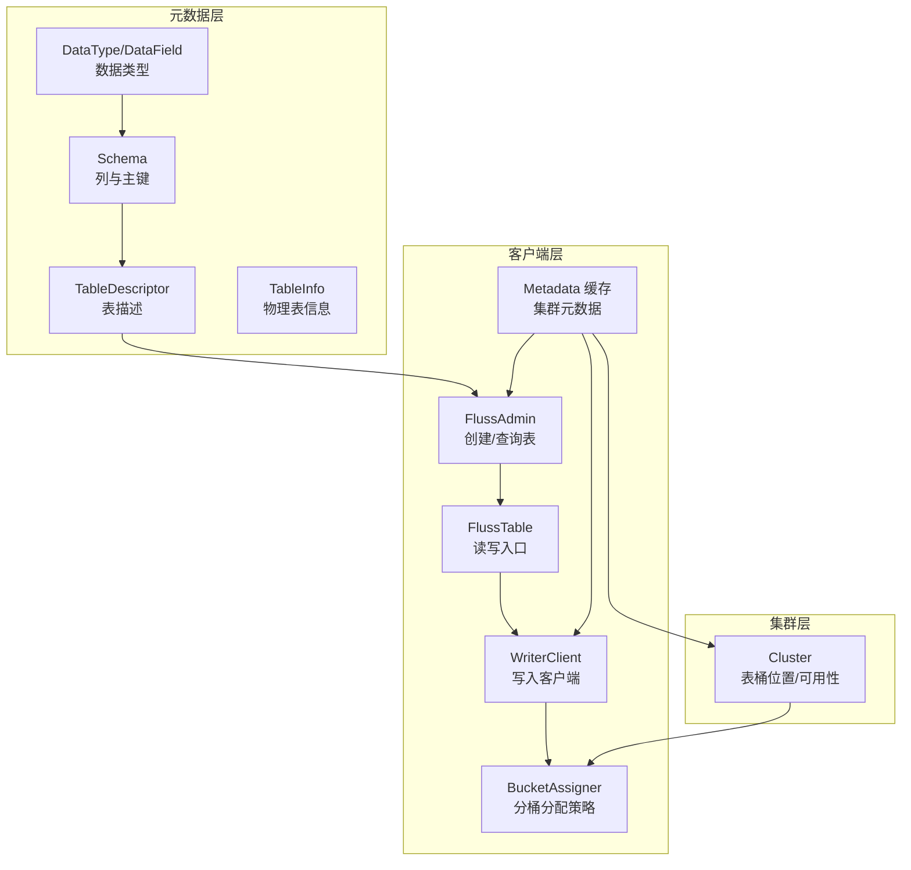
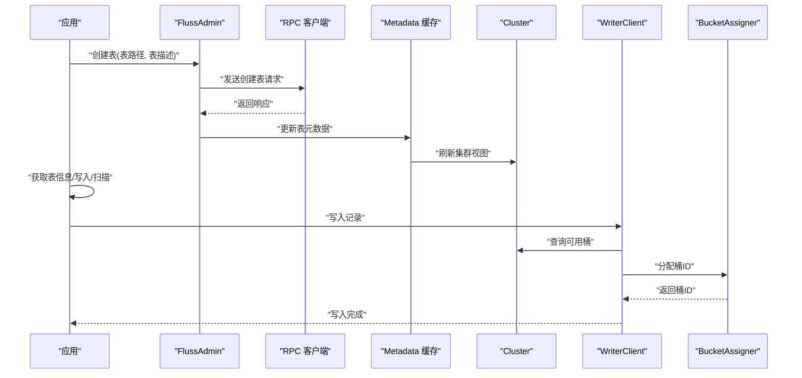
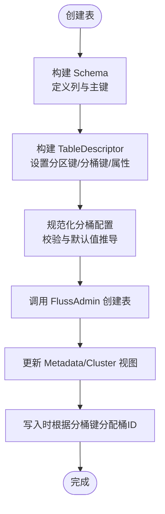
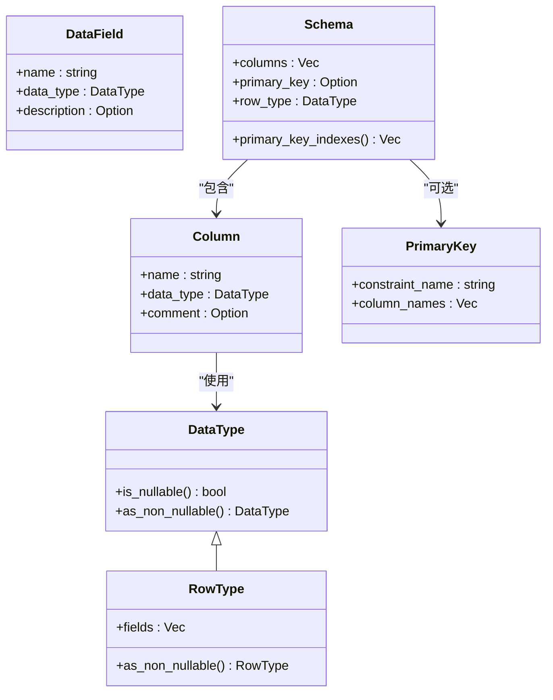
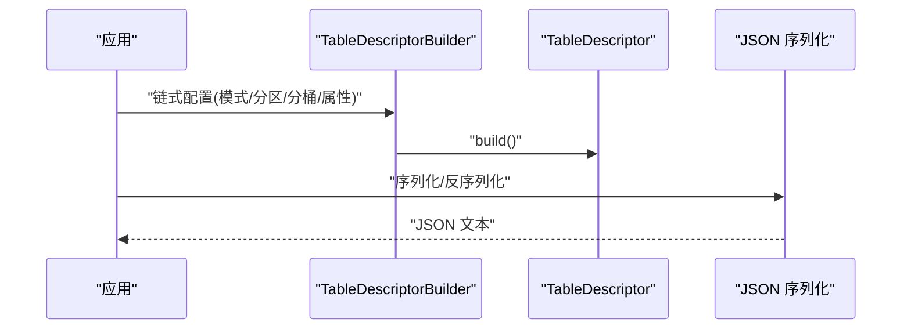
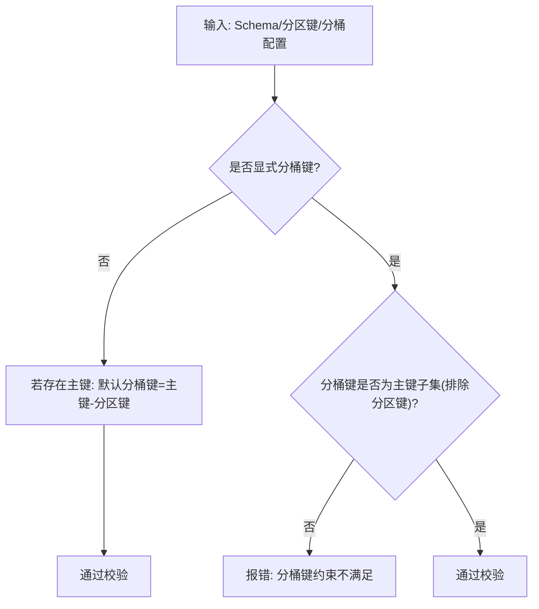
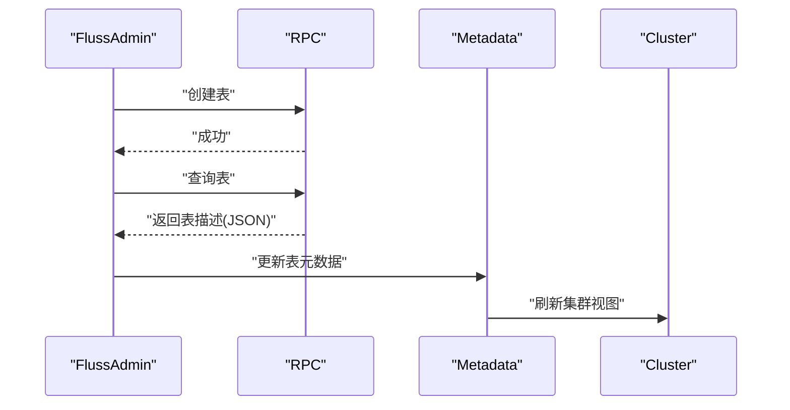
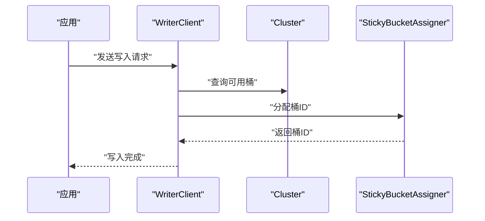
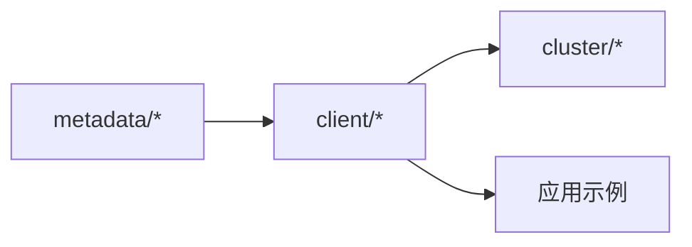

# 分布式表概念

<cite>
**本文引用的文件**
- [crates/fluss/src/metadata/table.rs](file://crates/fluss/src/metadata/table.rs)
- [crates/fluss/src/metadata/datatype.rs](file://crates/fluss/src/metadata/datatype.rs)
- [crates/fluss/src/metadata/json_serde.rs](file://crates/fluss/src/metadata/json_serde.rs)
- [crates/fluss/src/client/admin.rs](file://crates/fluss/src/client/admin.rs)
- [crates/fluss/src/client/table/mod.rs](file://crates/fluss/src/client/table/mod.rs)
- [crates/fluss/src/client/write/bucket_assigner.rs](file://crates/fluss/src/client/write/bucket_assigner.rs)
- [crates/fluss/src/client/write/writer_client.rs](file://crates/fluss/src/client/write/writer_client.rs)
- [crates/fluss/src/client/metadata.rs](file://crates/fluss/src/client/metadata.rs)
- [crates/fluss/src/cluster/cluster.rs](file://crates/fluss/src/cluster/cluster.rs)
- [crates/fluss/src/lib.rs](file://crates/fluss/src/lib.rs)
- [crates/examples/src/example_table.rs](file://crates/examples/src/example_table.rs)
</cite>

## 目录
1. [引言](#引言)
2. [项目结构](#项目结构)
3. [核心组件](#核心组件)
4. [架构总览](#架构总览)
5. [详细组件分析](#详细组件分析)
6. [依赖分析](#依赖分析)
7. [性能考虑](#性能考虑)
8. [故障排查指南](#故障排查指南)
9. [结论](#结论)
10. [附录：创建与配置分布式表示例](#附录创建与配置分布式表示例)

## 引言
本文件系统性阐述 Fluss Rust 客户端中的“分布式表”概念，围绕表、分区、分桶三者的关系与作用机制展开，解释 TableDescriptor、Schema、TableInfo 等核心数据结构的设计原理与使用方式；阐明主键约束、分区键、分桶键的作用与相互关系；覆盖表的生命周期管理、属性配置、复制因子等高级主题，并提供可直接定位到源码的示例路径，帮助初学者建立清晰概念，同时为有经验的开发者提供深入的技术细节与最佳实践。

## 项目结构
Fluss 的分布式表能力主要由以下模块协同实现：
- 元数据与类型定义：metadata 子模块负责表结构、数据类型、序列化/反序列化等
- 客户端 API：client 子模块提供管理员接口、表操作、写入客户端、元数据缓存等
- 集群视图：cluster 子模块维护集群拓扑、表桶位置与可用性
- 示例：examples 提供创建与使用分布式表的完整流程示例

**图表来源**
- [crates/fluss/src/metadata/table.rs](file://crates/fluss/src/metadata/table.rs#L94-L144)
- [crates/fluss/src/metadata/datatype.rs](file://crates/fluss/src/metadata/datatype.rs#L21-L44)
- [crates/fluss/src/client/admin.rs](file://crates/fluss/src/client/admin.rs#L52-L92)
- [crates/fluss/src/client/table/mod.rs](file://crates/fluss/src/client/table/mod.rs#L33-L66)
- [crates/fluss/src/client/write/writer_client.rs](file://crates/fluss/src/client/write/writer_client.rs#L32-L147)
- [crates/fluss/src/client/write/bucket_assigner.rs](file://crates/fluss/src/client/write/bucket_assigner.rs#L23-L102)
- [crates/fluss/src/client/metadata.rs](file://crates/fluss/src/client/metadata.rs#L29-L109)
- [crates/fluss/src/cluster/cluster.rs](file://crates/fluss/src/cluster/cluster.rs#L29-L86)

**章节来源**
- [crates/fluss/src/lib.rs](file://crates/fluss/src/lib.rs#L18-L37)
- [crates/fluss/src/metadata/table.rs](file://crates/fluss/src/metadata/table.rs#L94-L144)
- [crates/fluss/src/metadata/datatype.rs](file://crates/fluss/src/metadata/datatype.rs#L21-L44)
- [crates/fluss/src/client/admin.rs](file://crates/fluss/src/client/admin.rs#L52-L92)
- [crates/fluss/src/client/table/mod.rs](file://crates/fluss/src/client/table/mod.rs#L33-L66)
- [crates/fluss/src/client/write/writer_client.rs](file://crates/fluss/src/client/write/writer_client.rs#L32-L147)
- [crates/fluss/src/client/write/bucket_assigner.rs](file://crates/fluss/src/client/write/bucket_assigner.rs#L23-L102)
- [crates/fluss/src/client/metadata.rs](file://crates/fluss/src/client/metadata.rs#L29-L109)
- [crates/fluss/src/cluster/cluster.rs](file://crates/fluss/src/cluster/cluster.rs#L29-L86)

## 核心组件
- Schema：定义表的列集合、主键约束以及行类型（RowType）
- TableDescriptor：表的逻辑描述，包含 Schema、分区键、分桶配置、属性与注释等
- TableInfo：表的物理信息，包含分桶键、分区键、复制因子、表配置等
- DataType/DataField：统一的数据类型体系，支持标量、数组、映射、行类型等
- FlussAdmin：管理员接口，负责创建/查询表
- FlussTable：表的读写入口，封装 Append/Scan 等操作
- WriterClient/BucketAssigner：写入客户端与分桶分配器，负责记录写入与桶选择
- Metadata/Cluster：客户端侧的元数据缓存与集群视图，提供表桶位置与可用性

**章节来源**
- [crates/fluss/src/metadata/table.rs](file://crates/fluss/src/metadata/table.rs#L94-L144)
- [crates/fluss/src/metadata/table.rs](file://crates/fluss/src/metadata/table.rs#L376-L565)
- [crates/fluss/src/metadata/datatype.rs](file://crates/fluss/src/metadata/datatype.rs#L21-L44)
- [crates/fluss/src/client/admin.rs](file://crates/fluss/src/client/admin.rs#L52-L92)
- [crates/fluss/src/client/table/mod.rs](file://crates/fluss/src/client/table/mod.rs#L33-L66)
- [crates/fluss/src/client/write/writer_client.rs](file://crates/fluss/src/client/write/writer_client.rs#L32-L147)
- [crates/fluss/src/client/write/bucket_assigner.rs](file://crates/fluss/src/client/write/bucket_assigner.rs#L23-L102)
- [crates/fluss/src/client/metadata.rs](file://crates/fluss/src/client/metadata.rs#L29-L109)
- [crates/fluss/src/cluster/cluster.rs](file://crates/fluss/src/cluster/cluster.rs#L29-L86)

## 架构总览
下图展示了从应用发起创建表请求，到写入与扫描的关键交互路径。

**图表来源**
- [crates/fluss/src/client/admin.rs](file://crates/fluss/src/client/admin.rs#L52-L92)
- [crates/fluss/src/client/metadata.rs](file://crates/fluss/src/client/metadata.rs#L57-L94)
- [crates/fluss/src/cluster/cluster.rs](file://crates/fluss/src/cluster/cluster.rs#L88-L171)
- [crates/fluss/src/client/write/writer_client.rs](file://crates/fluss/src/client/write/writer_client.rs#L89-L123)
- [crates/fluss/src/client/write/bucket_assigner.rs](file://crates/fluss/src/client/write/bucket_assigner.rs#L85-L102)

## 详细组件分析

### 表、分区与分桶的关系与作用
- 表（Table）：由 Schema 描述结构，TableDescriptor 决定逻辑配置（如分区键、分桶键、属性），TableInfo 描述物理执行参数（如分桶数量、复制因子、物理主键等）
- 分区（Partition）：用于水平拆分表数据，通常基于分区键进行路由，提升查询与扫描的局部性
- 分桶（Bucket）：在分区内部进一步细粒度拆分，用于并行写入与负载均衡；默认情况下，若存在主键，分桶键通常取主键除去分区键的部分

**图表来源**
- [crates/fluss/src/metadata/table.rs](file://crates/fluss/src/metadata/table.rs#L386-L565)
- [crates/fluss/src/client/admin.rs](file://crates/fluss/src/client/admin.rs#L52-L67)
- [crates/fluss/src/client/metadata.rs](file://crates/fluss/src/client/metadata.rs#L57-L94)
- [crates/fluss/src/cluster/cluster.rs](file://crates/fluss/src/cluster/cluster.rs#L207-L232)
- [crates/fluss/src/client/write/bucket_assigner.rs](file://crates/fluss/src/client/write/bucket_assigner.rs#L45-L82)

**章节来源**
- [crates/fluss/src/metadata/table.rs](file://crates/fluss/src/metadata/table.rs#L386-L565)
- [crates/fluss/src/client/write/bucket_assigner.rs](file://crates/fluss/src/client/write/bucket_assigner.rs#L45-L82)

### 数据类型与 Schema 设计
- DataType 统一抽象了标量、数组、映射、行类型等，支持可空性标记与派生非空类型
- Schema 通过 Builder 模式构建，自动将 RowType 字段映射为列，支持主键约束与重复列检查
- 主键列在 Schema 层面被强制非空，以保证唯一性与可寻址性

**图表来源**
- [crates/fluss/src/metadata/datatype.rs](file://crates/fluss/src/metadata/datatype.rs#L21-L44)
- [crates/fluss/src/metadata/datatype.rs](file://crates/fluss/src/metadata/datatype.rs#L625-L647)
- [crates/fluss/src/metadata/table.rs](file://crates/fluss/src/metadata/table.rs#L26-L91)
- [crates/fluss/src/metadata/table.rs](file://crates/fluss/src/metadata/table.rs#L94-L144)

**章节来源**
- [crates/fluss/src/metadata/datatype.rs](file://crates/fluss/src/metadata/datatype.rs#L21-L44)
- [crates/fluss/src/metadata/table.rs](file://crates/fluss/src/metadata/table.rs#L94-L144)

### 表描述与序列化
- TableDescriptor 包含 Schema、分区键、分桶键/数量、属性与自定义属性
- JSON 序列化/反序列化支持 Schema、TableDescriptor 的跨进程传输与持久化
- 属性中包含复制因子等高级配置项，可通过工具方法读取与更新

**图表来源**
- [crates/fluss/src/metadata/table.rs](file://crates/fluss/src/metadata/table.rs#L287-L374)
- [crates/fluss/src/metadata/json_serde.rs](file://crates/fluss/src/metadata/json_serde.rs#L297-L464)

**章节来源**
- [crates/fluss/src/metadata/table.rs](file://crates/fluss/src/metadata/table.rs#L287-L374)
- [crates/fluss/src/metadata/json_serde.rs](file://crates/fluss/src/metadata/json_serde.rs#L297-L464)

### 主键、分区键与分桶键的约束与默认规则
- 主键约束：Schema 中定义，主键列在 Schema 层面必须非空；若未显式指定分桶键，对于有主键的表，默认分桶键为“主键减去分区键”
- 分区键：用于表级水平拆分，不能与分桶键重叠
- 分桶键：必须是主键的子集（去除分区键后），否则会触发校验错误
- 复制因子：通过属性“table.replication.factor”配置，用于控制写入一致性与容灾

**图表来源**
- [crates/fluss/src/metadata/table.rs](file://crates/fluss/src/metadata/table.rs#L510-L564)

**章节来源**
- [crates/fluss/src/metadata/table.rs](file://crates/fluss/src/metadata/table.rs#L510-L564)

### 表生命周期管理与属性配置
- 创建：通过 FlussAdmin 发起创建请求，携带 TableDescriptor
- 查询：通过 FlussAdmin 获取表信息，得到 TableInfo
- 更新：通过属性方法更新复制因子、分桶数量等
- 生命周期：由客户端 Metadata 缓存与 Cluster 视图维护，支持增量更新

**图表来源**
- [crates/fluss/src/client/admin.rs](file://crates/fluss/src/client/admin.rs#L52-L92)
- [crates/fluss/src/client/metadata.rs](file://crates/fluss/src/client/metadata.rs#L57-L94)
- [crates/fluss/src/cluster/cluster.rs](file://crates/fluss/src/cluster/cluster.rs#L88-L171)

**章节来源**
- [crates/fluss/src/client/admin.rs](file://crates/fluss/src/client/admin.rs#L52-L92)
- [crates/fluss/src/client/metadata.rs](file://crates/fluss/src/client/metadata.rs#L57-L94)
- [crates/fluss/src/cluster/cluster.rs](file://crates/fluss/src/cluster/cluster.rs#L88-L171)

### 写入路径与分桶分配
- WriterClient 负责批量累积与发送，内部持有 BucketAssigner
- StickyBucketAssigner 基于当前桶 ID 保持粘性，必要时随机切换可用桶
- 分配策略结合 Cluster 的可用桶列表与桶数量，确保高可用与负载均衡

**图表来源**
- [crates/fluss/src/client/write/writer_client.rs](file://crates/fluss/src/client/write/writer_client.rs#L89-L123)
- [crates/fluss/src/client/write/bucket_assigner.rs](file://crates/fluss/src/client/write/bucket_assigner.rs#L85-L102)
- [crates/fluss/src/cluster/cluster.rs](file://crates/fluss/src/cluster/cluster.rs#L207-L232)

**章节来源**
- [crates/fluss/src/client/write/writer_client.rs](file://crates/fluss/src/client/write/writer_client.rs#L89-L123)
- [crates/fluss/src/client/write/bucket_assigner.rs](file://crates/fluss/src/client/write/bucket_assigner.rs#L85-L102)
- [crates/fluss/src/cluster/cluster.rs](file://crates/fluss/src/cluster/cluster.rs#L207-L232)

## 依赖分析
- 元数据层：Schema/DataType/JsonSerde 为上层提供稳定的表结构与序列化契约
- 客户端层：Admin/Table/WriterClient/BucketAssigner 串联起创建、使用与写入流程
- 集群层：Cluster 提供表桶位置与可用性，支撑写入与扫描的路由决策

**图表来源**
- [crates/fluss/src/metadata/table.rs](file://crates/fluss/src/metadata/table.rs#L94-L144)
- [crates/fluss/src/client/admin.rs](file://crates/fluss/src/client/admin.rs#L52-L92)
- [crates/fluss/src/cluster/cluster.rs](file://crates/fluss/src/cluster/cluster.rs#L88-L171)

**章节来源**
- [crates/fluss/src/metadata/table.rs](file://crates/fluss/src/metadata/table.rs#L94-L144)
- [crates/fluss/src/client/admin.rs](file://crates/fluss/src/client/admin.rs#L52-L92)
- [crates/fluss/src/cluster/cluster.rs](file://crates/fluss/src/cluster/cluster.rs#L88-L171)

## 性能考虑
- 分桶数量：合理设置分桶数以平衡并行度与资源占用；可通过工具方法动态更新
- 分桶键选择：优先选择高基数且写入热点分散的字段，避免写入倾斜
- 分区键选择：面向查询过滤与扫描局部性，建议选择高选择性的维度字段
- 复制因子：更高的复制因子提升可靠性但增加写放大，需结合业务 SLA 权衡
- 写入批处理：利用 WriterClient 的累积与批发送策略降低网络开销

[本节为通用指导，无需列出具体文件来源]

## 故障排查指南
- 分桶键约束错误：当分桶键不是主键子集或与分区键重叠时会报错，检查 TableDescriptor 的构建逻辑
- 复制因子缺失：读取复制因子属性失败时需先设置“table.replication.factor”
- 元数据不一致：通过 Metadata 的增量更新接口刷新 Cluster 视图
- 写入无响应：确认可用桶列表是否存在，检查 BucketAssigner 的粘性策略与随机回退

**章节来源**
- [crates/fluss/src/metadata/table.rs](file://crates/fluss/src/metadata/table.rs#L510-L564)
- [crates/fluss/src/metadata/table.rs](file://crates/fluss/src/metadata/table.rs#L441-L451)
- [crates/fluss/src/client/metadata.rs](file://crates/fluss/src/client/metadata.rs#L83-L94)
- [crates/fluss/src/client/write/bucket_assigner.rs](file://crates/fluss/src/client/write/bucket_assigner.rs#L45-L82)

## 结论
Fluss 的分布式表通过 Schema/Descriptor/Info 三层抽象清晰地分离了“表结构—表描述—物理执行”，辅以严格的分区/分桶约束与灵活的属性配置，既满足初学者快速上手，又为高级用户提供深度定制空间。配合客户端的元数据缓存与写入分桶策略，可在保证一致性的同时实现高吞吐与高可用。

[本节为总结性内容，无需列出具体文件来源]

## 附录：创建与配置分布式表示例
以下示例展示了如何创建一个基础分布式表并进行写入与扫描。请参考示例文件中的步骤与 API 调用路径：

- 创建表与获取表信息
  - 参考路径：[示例程序](file://crates/examples/src/example_table.rs#L34-L53)
- 写入记录
  - 参考路径：[示例程序](file://crates/examples/src/example_table.rs#L60-L67)
- 扫描日志
  - 参考路径：[示例程序](file://crates/examples/src/example_table.rs#L70-L85)

此外，以下源码文件提供了更底层的实现细节与 API 使用方式：
- 表描述构建与序列化：[表与模式定义](file://crates/fluss/src/metadata/table.rs#L287-L374)，[JSON 序列化](file://crates/fluss/src/metadata/json_serde.rs#L297-L464)
- 管理员接口：[创建/查询表](file://crates/fluss/src/client/admin.rs#L52-L92)
- 写入客户端与分桶分配：[写入客户端](file://crates/fluss/src/client/write/writer_client.rs#L89-L123)，[分桶分配器](file://crates/fluss/src/client/write/bucket_assigner.rs#L85-L102)
- 元数据与集群视图：[元数据缓存](file://crates/fluss/src/client/metadata.rs#L57-L94)，[集群视图](file://crates/fluss/src/cluster/cluster.rs#L88-L171)

**章节来源**
- [crates/examples/src/example_table.rs](file://crates/examples/src/example_table.rs#L34-L85)
- [crates/fluss/src/metadata/table.rs](file://crates/fluss/src/metadata/table.rs#L287-L374)
- [crates/fluss/src/metadata/json_serde.rs](file://crates/fluss/src/metadata/json_serde.rs#L297-L464)
- [crates/fluss/src/client/admin.rs](file://crates/fluss/src/client/admin.rs#L52-L92)
- [crates/fluss/src/client/write/writer_client.rs](file://crates/fluss/src/client/write/writer_client.rs#L89-L123)
- [crates/fluss/src/client/write/bucket_assigner.rs](file://crates/fluss/src/client/write/bucket_assigner.rs#L85-L102)
- [crates/fluss/src/client/metadata.rs](file://crates/fluss/src/client/metadata.rs#L57-L94)
- [crates/fluss/src/cluster/cluster.rs](file://crates/fluss/src/cluster/cluster.rs#L88-L171)