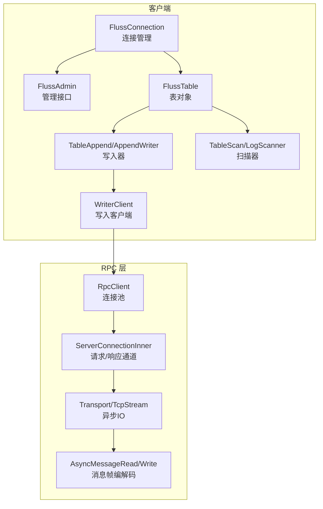
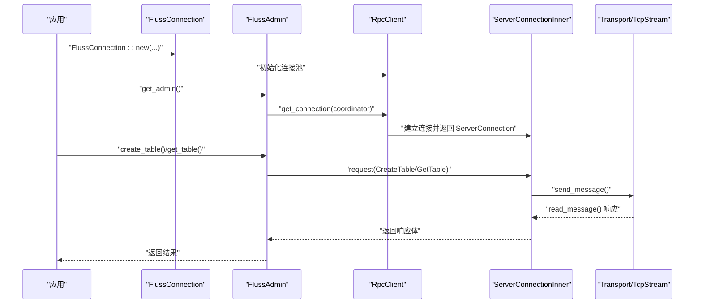
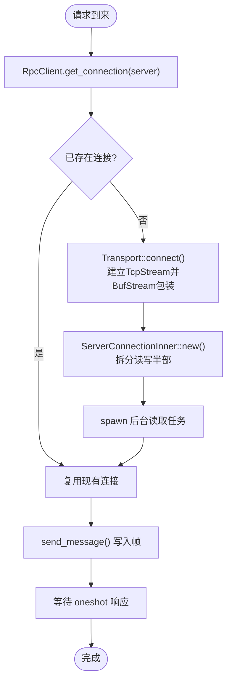
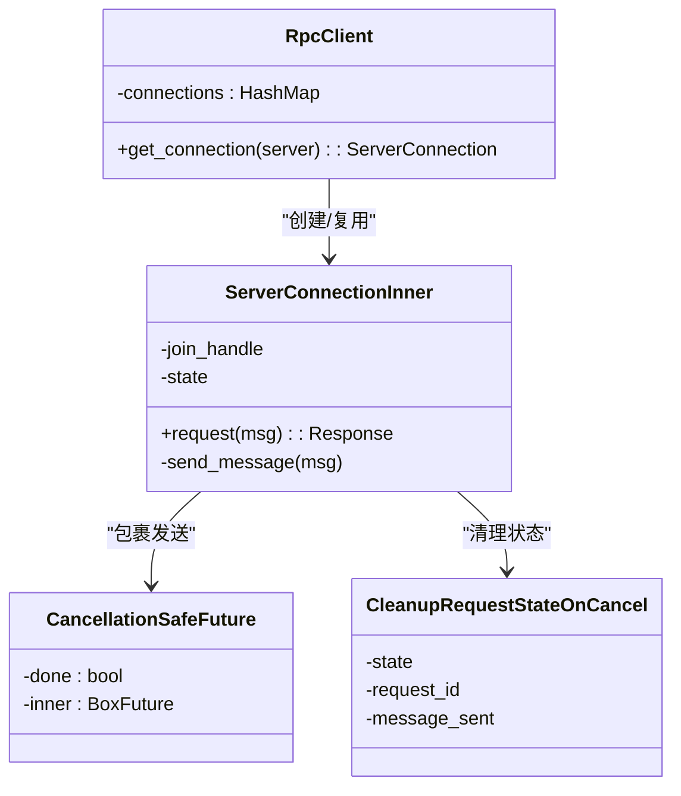
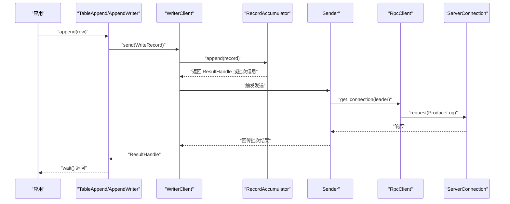
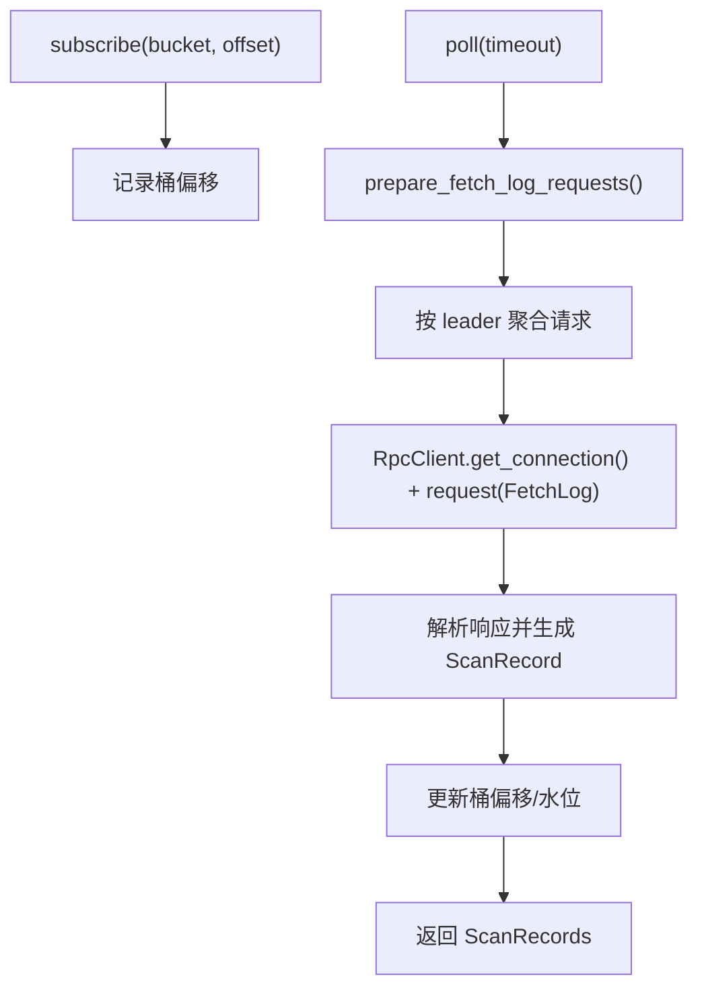
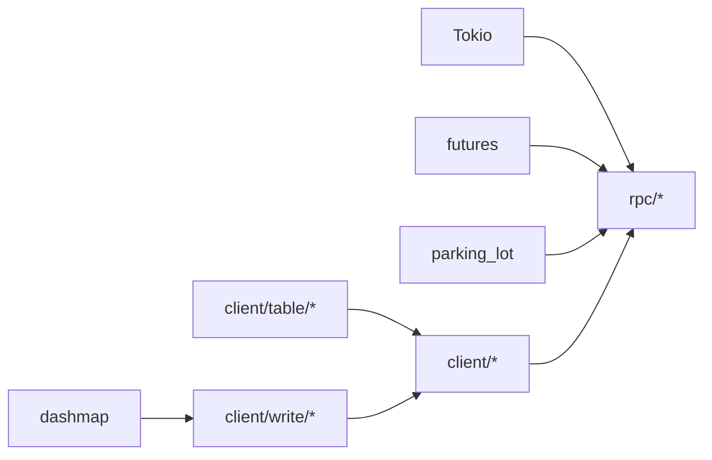

# 异步编程模型

<cite>
**本文引用的文件**
- [lib.rs](file://crates/fluss/src/lib.rs)
- [Cargo.toml](file://crates/fluss/Cargo.toml)
- [client/mod.rs](file://crates/fluss/src/client/mod.rs)
- [connection.rs](file://crates/fluss/src/client/connection.rs)
- [table/mod.rs](file://crates/fluss/src/client/table/mod.rs)
- [table/append.rs](file://crates/fluss/src/client/table/append.rs)
- [table/scanner.rs](file://crates/fluss/src/client/table/scanner.rs)
- [write/mod.rs](file://crates/fluss/src/client/write/mod.rs)
- [writer_client.rs](file://crates/fluss/src/client/write/writer_client.rs)
- [rpc/mod.rs](file://crates/fluss/src/rpc/mod.rs)
- [server_connection.rs](file://crates/fluss/src/rpc/server_connection.rs)
- [transport.rs](file://crates/fluss/src/rpc/transport.rs)
- [frame.rs](file://crates/fluss/src/rpc/frame.rs)
- [example_table.rs](file://crates/examples/src/example_table.rs)
</cite>

## 目录
1. [简介](#简介)
2. [项目结构](#项目结构)
3. [核心组件](#核心组件)
4. [架构总览](#架构总览)
5. [组件详解](#组件详解)
6. [依赖关系分析](#依赖关系分析)
7. [性能与并发特性](#性能与并发特性)
8. [故障排查指南](#故障排查指南)
9. [结论](#结论)
10. [附录：异步最佳实践与示例路径](#附录异步最佳实践与示例路径)

## 简介
本文件系统性阐述 Fluss Rust 客户端的异步编程模型，围绕基于 Tokio 的异步 I/O 架构，解释 Fluss 如何通过 async/await、Future 与 Stream 实现高性能的网络通信与并发写入/读取。内容覆盖异步连接管理、并发请求处理、任务调度、背压与错误传播、资源管理等关键主题，并提供可直接定位到源码的示例路径，帮助初学者快速上手，同时为有经验的开发者提供深入的架构理解与优化建议。

## 项目结构
Fluss 客户端采用模块化组织，核心异步逻辑集中在 client 与 rpc 子模块中：
- client：对外暴露连接、表操作（写入/扫描）、写入器、元数据访问等接口
- rpc：实现基于 Tokio 的传输层抽象、帧编解码、请求-响应通道与后台读取任务
- examples：提供完整的异步使用示例，包含连接、建表、写入、订阅与轮询读取

**图表来源**
- [client/mod.rs](file://crates/fluss/src/client/mod.rs#L18-L27)
- [connection.rs](file://crates/fluss/src/client/connection.rs#L30-L82)
- [table/mod.rs](file://crates/fluss/src/client/table/mod.rs#L33-L74)
- [table/append.rs](file://crates/fluss/src/client/table/append.rs#L26-L70)
- [table/scanner.rs](file://crates/fluss/src/client/table/scanner.rs#L38-L108)
- [write/mod.rs](file://crates/fluss/src/client/write/mod.rs#L34-L69)
- [writer_client.rs](file://crates/fluss/src/client/write/writer_client.rs#L32-L148)
- [rpc/mod.rs](file://crates/fluss/src/rpc/mod.rs#L18-L32)
- [server_connection.rs](file://crates/fluss/src/rpc/server_connection.rs#L47-L97)
- [transport.rs](file://crates/fluss/src/rpc/transport.rs#L27-L84)
- [frame.rs](file://crates/fluss/src/rpc/frame.rs#L34-L107)

**章节来源**
- [lib.rs](file://crates/fluss/src/lib.rs#L18-L38)
- [Cargo.toml](file://crates/fluss/Cargo.toml#L25-L48)

## 核心组件
- FlussConnection：负责初始化元数据、维护连接池、提供 Admin 与表句柄；支持按需创建 WriterClient
- FlussAdmin：面向管理操作（建表、查表），内部通过 RpcClient 获取协调者节点连接
- FlussTable：封装表级操作入口，提供 TableAppend 与 TableScan
- WriterClient：写入侧的核心异步组件，负责记录累积、批处理、桶分配、发送与结果回传
- RpcClient/ServerConnection：连接池与请求-响应通道，后台任务持续读取响应，请求侧通过 oneshot 等待响应
- Transport/Frame：基于 Tokio 的异步 TCP 流与消息帧编解码，确保消息边界与大小限制

**章节来源**
- [connection.rs](file://crates/fluss/src/client/connection.rs#L30-L82)
- [admin.rs](file://crates/fluss/src/client/admin.rs#L28-L94)
- [table/mod.rs](file://crates/fluss/src/client/table/mod.rs#L33-L74)
- [write/mod.rs](file://crates/fluss/src/client/write/mod.rs#L34-L69)
- [writer_client.rs](file://crates/fluss/src/client/write/writer_client.rs#L32-L148)
- [server_connection.rs](file://crates/fluss/src/rpc/server_connection.rs#L47-L97)
- [transport.rs](file://crates/fluss/src/rpc/transport.rs#L27-L84)
- [frame.rs](file://crates/fluss/src/rpc/frame.rs#L34-L107)

## 架构总览
下图展示了从应用发起异步请求到收到响应的完整链路，以及写入侧的后台发送循环与结果回传机制。

**图表来源**
- [connection.rs](file://crates/fluss/src/client/connection.rs#L38-L64)
- [admin.rs](file://crates/fluss/src/client/admin.rs#L35-L92)
- [server_connection.rs](file://crates/fluss/src/rpc/server_connection.rs#L64-L96)
- [transport.rs](file://crates/fluss/src/rpc/transport.rs#L68-L82)
- [frame.rs](file://crates/fluss/src/rpc/frame.rs#L45-L77)

## 组件详解

### 异步连接管理与连接池
- RpcClient 维护服务器节点到 ServerConnection 的映射，按需建立连接并缓存复用
- ServerConnectionInner 在后台启动一个读取任务，持续从流中读取消息并根据 request_id 分发给对应等待者
- 连接建立通过 Transport::connect 封装超时控制，底层使用 Tokio 的 TcpStream

**图表来源**
- [server_connection.rs](file://crates/fluss/src/rpc/server_connection.rs#L64-L96)
- [transport.rs](file://crates/fluss/src/rpc/transport.rs#L68-L82)
- [frame.rs](file://crates/fluss/src/rpc/frame.rs#L93-L106)

**章节来源**
- [server_connection.rs](file://crates/fluss/src/rpc/server_connection.rs#L47-L97)
- [transport.rs](file://crates/fluss/src/rpc/transport.rs#L27-L84)

### 并发请求处理与任务调度
- 请求侧使用 oneshot 通道等待响应，避免阻塞
- 后台读取任务独立运行，使用 tokio::spawn，不依赖请求线程
- 发送侧通过 CancellationSafeFuture 包裹写入，防止取消导致半写入
- 请求状态清理：CleanupRequestStateOnCancel 在取消前未发送时自动清理请求映射

**图表来源**
- [server_connection.rs](file://crates/fluss/src/rpc/server_connection.rs#L47-L97)
- [server_connection.rs](file://crates/fluss/src/rpc/server_connection.rs#L321-L367)
- [server_connection.rs](file://crates/fluss/src/rpc/server_connection.rs#L370-L402)

**章节来源**
- [server_connection.rs](file://crates/fluss/src/rpc/server_connection.rs#L233-L287)

### 写入器与背压控制
- WriterClient 负责记录累积、批处理与发送，内部通过 mpsc 控制关闭信号
- 发送循环在独立任务中运行，接收来自 RecordAccumulator 的批次，调用 RpcClient 发送
- 结果通过 ResultHandle 回传，支持异步等待与错误转换
- 背压：当批次满或需要新建批次时，写入器会触发发送，避免无界增长

**图表来源**
- [table/append.rs](file://crates/fluss/src/client/table/append.rs#L59-L68)
- [writer_client.rs](file://crates/fluss/src/client/write/writer_client.rs#L89-L123)
- [write/mod.rs](file://crates/fluss/src/client/write/mod.rs#L57-L68)
- [server_connection.rs](file://crates/fluss/src/rpc/server_connection.rs#L233-L287)

**章节来源**
- [table/append.rs](file://crates/fluss/src/client/table/append.rs#L26-L70)
- [writer_client.rs](file://crates/fluss/src/client/write/writer_client.rs#L32-L148)
- [write/mod.rs](file://crates/fluss/src/client/write/mod.rs#L36-L69)

### 扫描器与流式读取
- LogScanner 通过订阅桶与偏移，周期性向各桶的领导者节点发起 FetchLog 请求
- 使用 FairBucketStatusMap 管理桶的可用性与偏移，保证公平调度
- 读取过程通过 ServerConnection.request 发起请求，解析响应后更新状态

**图表来源**
- [table/scanner.rs](file://crates/fluss/src/client/table/scanner.rs#L95-L107)
- [table/scanner.rs](file://crates/fluss/src/client/table/scanner.rs#L135-L173)
- [table/scanner.rs](file://crates/fluss/src/client/table/scanner.rs#L175-L244)

**章节来源**
- [table/scanner.rs](file://crates/fluss/src/client/table/scanner.rs#L38-L108)

### 错误传播与资源管理
- 连接异常通过 ConnectionState::Poison 标记，所有等待中的请求收到统一错误
- 读取错误触发毒化，后续请求立即失败，避免帧错位
- 资源释放：ServerConnectionInner Drop 中中止后台读取任务；WriterClient::close 通过 mpsc 关闭发送循环并等待任务结束

**章节来源**
- [server_connection.rs](file://crates/fluss/src/rpc/server_connection.rs#L122-L144)
- [server_connection.rs](file://crates/fluss/src/rpc/server_connection.rs#L314-L319)
- [writer_client.rs](file://crates/fluss/src/client/write/writer_client.rs#L125-L135)

## 依赖关系分析
- 外部依赖：Tokio 提供异步运行时、任务调度与 I/O；futures 提供 Future 工具；parking_lot/dashmap 提供同步原语
- 内部耦合：client 依赖 rpc；table 与 write 模块通过 WriterClient 协作；rpc 层通过 Transport/Frame 抽象底层 I/O

**图表来源**
- [Cargo.toml](file://crates/fluss/Cargo.toml#L25-L48)
- [server_connection.rs](file://crates/fluss/src/rpc/server_connection.rs#L36-L40)
- [writer_client.rs](file://crates/fluss/src/client/write/writer_client.rs#L24-L27)

**章节来源**
- [Cargo.toml](file://crates/fluss/Cargo.toml#L25-L48)

## 性能与并发特性
- 异步 I/O：基于 Tokio 的 BufStream 与 split 的读写半部，减少锁竞争，提升吞吐
- 连接复用：RpcClient 缓存连接，降低握手开销
- 后台读取：ServerConnection 后台任务持续读取，避免请求线程阻塞
- 批处理与背压：WriterClient 通过 RecordAccumulator 与 Sender 控制批次大小与发送节奏
- 公平调度：扫描器使用 FairBucketStatusMap，避免某些桶饥饿

[本节为通用性能讨论，无需具体文件分析]

## 故障排查指南
- 连接超时：检查 Transport::connect_timeout 的超时配置与目标地址可达性
- 消息过大：Frame::read_message 对超过 max_message_size 的消息进行丢弃并报错，需调整服务端/客户端限制
- 请求未达：若出现“Got response for unknown request”，检查请求 ID 与状态清理逻辑
- 连接毒化：一旦发生读取错误，所有活动请求会收到 Poisoned 错误，需重建连接
- 写入卡住：确认 ResultHandle.wait 是否被正确 await，以及 Sender 任务是否仍在运行

**章节来源**
- [transport.rs](file://crates/fluss/src/rpc/transport.rs#L73-L82)
- [frame.rs](file://crates/fluss/src/rpc/frame.rs#L45-L77)
- [server_connection.rs](file://crates/fluss/src/rpc/server_connection.rs#L188-L221)
- [server_connection.rs](file://crates/fluss/src/rpc/server_connection.rs#L216-L220)

## 结论
Fluss Rust 客户端以 Tokio 为核心，构建了高内聚、低耦合的异步架构：通过连接池与后台读取任务实现高效的请求-响应处理；通过写入器与批处理实现稳定的背压控制；通过帧编解码与超时控制保障可靠性。该设计既适合初学者循序渐进学习异步编程，也为高级用户提供了深入优化的空间。

[本节为总结性内容，无需具体文件分析]

## 附录：异步最佳实践与示例路径
- 基础使用示例（连接、建表、写入、扫描）：参见示例程序
  - [示例入口](file://crates/examples/src/example_table.rs#L27-L86)
  - [连接与管理](file://crates/examples/src/example_table.rs#L32-L49)
  - [写入与等待结果](file://crates/examples/src/example_table.rs#L60-L68)
  - [订阅与轮询](file://crates/examples/src/example_table.rs#L70-L85)
- 异步语法与并发要点
  - 使用 async/await 进行非阻塞等待，结合 try_join! 并发执行多个写入任务
  - 通过 ResultHandle.wait 异步等待写入结果，避免阻塞主线程
  - 使用 RpcClient.get_connection 按需获取连接，避免重复握手
- 错误处理与超时控制
  - 通过 Transport::connect_timeout 设置连接超时
  - 捕获 RpcError 并区分 Poisoned、ReadMessageError 等不同场景
- 并发限制与资源管理
  - 通过 mpsc 控制 WriterClient 生命周期，确保优雅关闭
  - 合理设置批次大小与重试次数，平衡延迟与吞吐

**章节来源**
- [example_table.rs](file://crates/examples/src/example_table.rs#L27-L86)
- [transport.rs](file://crates/fluss/src/rpc/transport.rs#L68-L82)
- [server_connection.rs](file://crates/fluss/src/rpc/server_connection.rs#L233-L287)
- [writer_client.rs](file://crates/fluss/src/client/write/writer_client.rs#L125-L135)