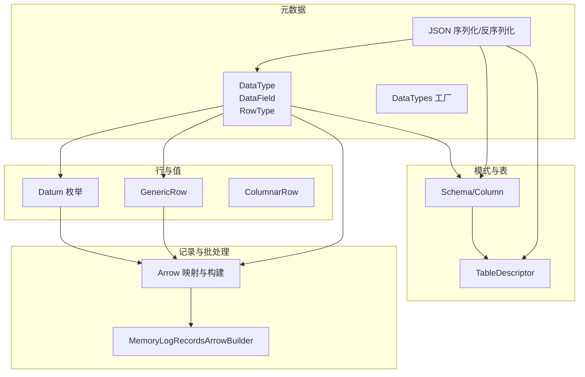
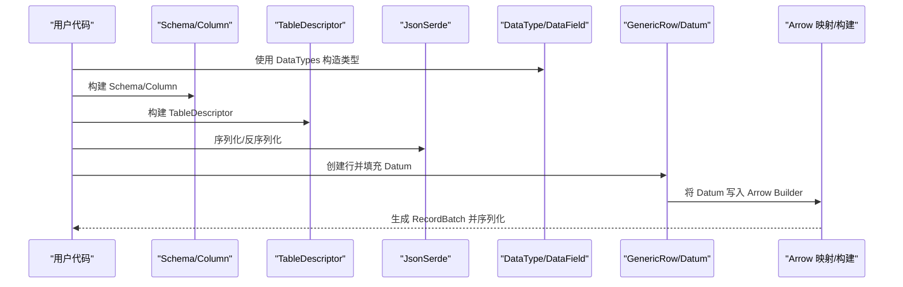
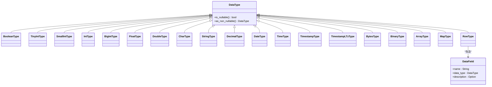
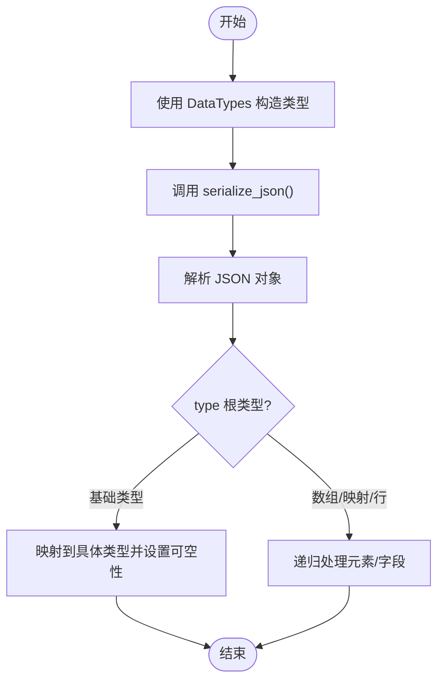
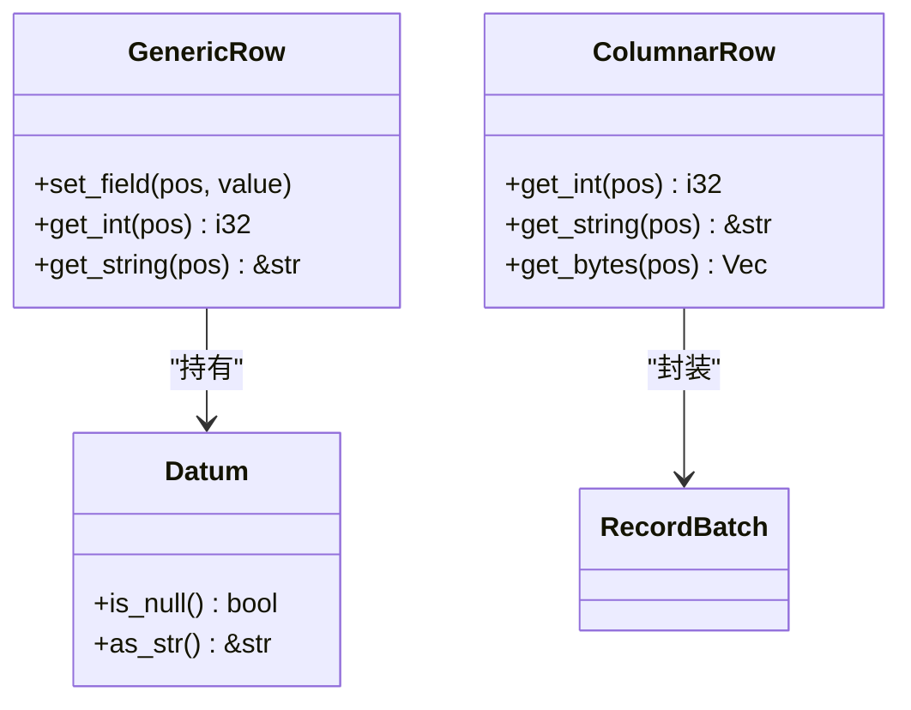
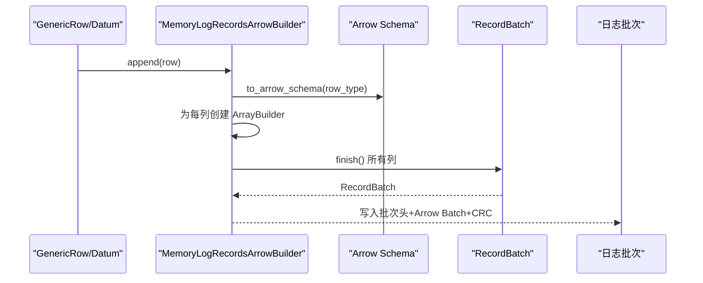
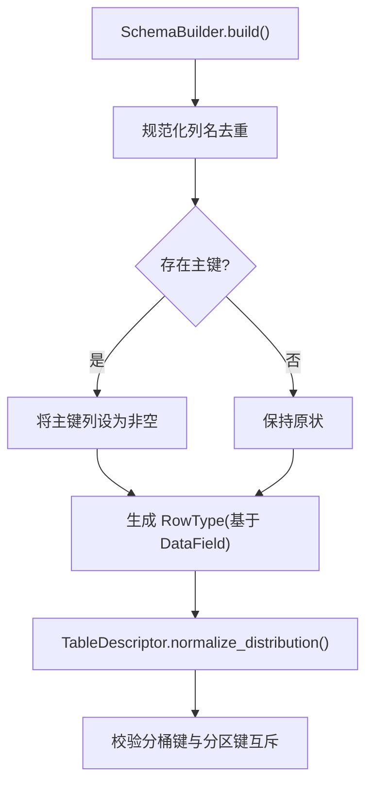
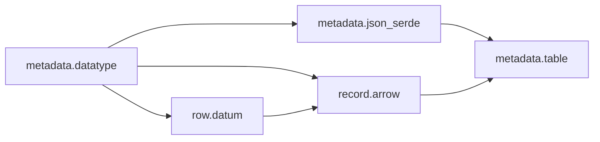

# 数据类型系统

<cite>
**本文引用的文件**
- [datatype.rs](file://crates/fluss/src/metadata/datatype.rs)
- [json_serde.rs](file://crates/fluss/src/metadata/json_serde.rs)
- [datum.rs](file://crates/fluss/src/row/datum.rs)
- [column.rs](file://crates/fluss/src/row/column.rs)
- [arrow.rs](file://crates/fluss/src/record/arrow.rs)
- [table.rs](file://crates/fluss/src/metadata/table.rs)
- [example_table.rs](file://crates/examples/src/example_table.rs)
- [lib.rs](file://crates/fluss/src/lib.rs)
</cite>

## 目录
1. [简介](#简介)
2. [项目结构](#项目结构)
3. [核心组件](#核心组件)
4. [架构总览](#架构总览)
5. [详细组件分析](#详细组件分析)
6. [依赖分析](#依赖分析)
7. [性能考虑](#性能考虑)
8. [故障排查指南](#故障排查指南)
9. [结论](#结论)
10. [附录：数据类型参考与使用示例](#附录数据类型参考与使用示例)

## 简介
本章节概述 Fluss Rust 客户端的数据类型系统目标与范围：定义并统一表结构中的数据类型（基本类型、时间类型、复合类型），提供类型序列化/反序列化能力，确保与 Arrow 格式在分布式写入/读取路径中的一致性，并通过表模式与字段元信息保障数据完整性。

## 项目结构
围绕数据类型系统的关键模块如下：
- 元数据层：定义 DataType、DataField、RowType 及其工厂方法，负责类型声明与 JSON 序列化/反序列化
- 行与值层：定义 Datum 枚举及通用行 GenericRow，支撑运行时值表示与 Arrow 写入桥接
- 记录与批处理层：将 Fluss 的 DataType 映射到 Arrow 类型，构建 RecordBatch 并进行序列化/反序列化
- 模式与表层：Schema/Column/TableDescriptor 将类型系统与表结构绑定，执行约束校验（如主键非空）

**图表来源**
- [datatype.rs](file://crates/fluss/src/metadata/datatype.rs#L21-L815)
- [json_serde.rs](file://crates/fluss/src/metadata/json_serde.rs#L25-L465)
- [datum.rs](file://crates/fluss/src/row/datum.rs#L37-L288)
- [column.rs](file://crates/fluss/src/row/column.rs#L25-L170)
- [arrow.rs](file://crates/fluss/src/record/arrow.rs#L402-L463)
- [table.rs](file://crates/fluss/src/metadata/table.rs#L26-L144)

**章节来源**
- [lib.rs](file://crates/fluss/src/lib.rs#L18-L37)

## 核心组件
- DataType：统一的数据类型枚举，覆盖布尔、整数、浮点、字符串、二进制、定点数、日期/时间/带时区时间戳、数组、映射、行等；支持可空性标记与非空转换
- DataField：字段定义，包含名称、类型、描述
- RowType：行类型，由一组 DataField 组成
- DataTypes：类型工厂，提供便捷构造器（如 boolean/int/string/array/map/row 等）
- Datum：运行时值的统一表示，支持空值、基础标量、字符串、Blob、Decimal、Date、Timestamp、TimestampTz 等
- ColumnarRow/GenericRow：面向列式与通用行的访问接口，用于读取 Arrow RecordBatch 中的值
- Arrow 映射与构建：将 Fluss DataType 转换为 Arrow 类型/Schema，并构建 RecordBatch
- Schema/Column/TableDescriptor：将类型系统与表结构绑定，执行列名去重、主键约束、分桶键/分区键一致性检查等

**章节来源**
- [datatype.rs](file://crates/fluss/src/metadata/datatype.rs#L21-L815)
- [datum.rs](file://crates/fluss/src/row/datum.rs#L37-L288)
- [column.rs](file://crates/fluss/src/row/column.rs#L25-L170)
- [arrow.rs](file://crates/fluss/src/record/arrow.rs#L402-L463)
- [table.rs](file://crates/fluss/src/metadata/table.rs#L26-L144)

## 架构总览
Fluss 的数据类型系统贯穿“声明—序列化—运行时—写入/读取”的全链路：
- 声明阶段：通过 DataTypes 工厂定义 Schema/Column/RowType
- 序列化阶段：DataType/Schema/TableDescriptor 实现 JSON 序列化/反序列化，便于跨进程/跨版本传输
- 运行时阶段：Datum 提供统一值表示，GenericRow/ColumnarRow 提供读写接口
- 写入/读取阶段：Arrow 映射将 Fluss 类型转为 Arrow 类型，MemoryLogRecordsArrowBuilder 构建 RecordBatch 并序列化为日志批次

**图表来源**
- [json_serde.rs](file://crates/fluss/src/metadata/json_serde.rs#L82-L176)
- [table.rs](file://crates/fluss/src/metadata/table.rs#L101-L215)
- [arrow.rs](file://crates/fluss/src/record/arrow.rs#L104-L185)
- [datum.rs](file://crates/fluss/src/row/datum.rs#L37-L169)

## 详细组件分析

### DataType 与 DataField
- DataType 枚举覆盖：布尔、整数（TinyInt/SmallInt/Int/BigInt）、浮点（Float/Double）、字符/字符串（Char/String）、二进制（Bytes/Binary）、定点数（Decimal）、日期/时间/带时区时间戳（Date/Time/Timestamp/TimestampLTz）、数组（Array）、映射（Map）、行（Row）
- 每个具体类型均包含可空标志位，支持 is_nullable/as_non_nullable 切换
- DataField 包含字段名、类型、可选描述
- RowType 由一组 DataField 组成，支持获取字段列表

**图表来源**
- [datatype.rs](file://crates/fluss/src/metadata/datatype.rs#L21-L815)

**章节来源**
- [datatype.rs](file://crates/fluss/src/metadata/datatype.rs#L21-L815)

### DataTypes 工厂与 JSON 序列化
- DataTypes 提供便捷构造器：boolean/int/tinyint/smallint/bigint/float/double/char/string/decimal/date/time/timestamp/timestamp_ltz/array/map/row/row_from_types 等
- DataType/Schema/Column/TableDescriptor 实现 JsonSerde trait，支持序列化为 JSON 和从 JSON 反序列化
- 反序列化时根据 type 字段识别根类型，并应用可空性、长度、精度/刻度等属性

**图表来源**
- [json_serde.rs](file://crates/fluss/src/metadata/json_serde.rs#L82-L176)

**章节来源**
- [json_serde.rs](file://crates/fluss/src/metadata/json_serde.rs#L25-L465)

### Datum 与行访问接口
- Datum 枚举统一表示空值与各类标量/复合值，支持空值判断与部分类型转换
- GenericRow 作为通用行，通过 set_field 注入 Datum，提供基本访问接口
- ColumnarRow 面向 Arrow RecordBatch，按列读取基础类型、字符串、二进制等

**图表来源**
- [datum.rs](file://crates/fluss/src/row/datum.rs#L37-L169)
- [column.rs](file://crates/fluss/src/row/column.rs#L50-L170)

**章节来源**
- [datum.rs](file://crates/fluss/src/row/datum.rs#L37-L288)
- [column.rs](file://crates/fluss/src/row/column.rs#L25-L170)

### Arrow 集成与批处理
- to_arrow_type/to_arrow_schema 将 Fluss DataType 映射为 Arrow 类型/Schema
- MemoryLogRecordsArrowBuilder 根据 Schema 创建对应 ArrayBuilder，逐列追加 Datum 值，最终写入 RecordBatch 并序列化为日志批次
- 日志批次包含头部与 CRC 校验，读取时通过 ReadContext 提供 Arrow Schema 元数据，结合批次体数据流式读取

**图表来源**
- [arrow.rs](file://crates/fluss/src/record/arrow.rs#L104-L185)
- [arrow.rs](file://crates/fluss/src/record/arrow.rs#L402-L463)

**章节来源**
- [arrow.rs](file://crates/fluss/src/record/arrow.rs#L92-L230)
- [arrow.rs](file://crates/fluss/src/record/arrow.rs#L232-L546)

### 模式与表结构约束
- Schema/Column：构建表结构，支持主键约束、列名去重、注释等
- TableDescriptor：封装 Schema、注释、分区键、分桶配置、属性等
- 构建流程中对主键非空性进行规范化（主键列必须非空），并校验分桶键与分区键的互斥关系

**图表来源**
- [table.rs](file://crates/fluss/src/metadata/table.rs#L198-L268)
- [table.rs](file://crates/fluss/src/metadata/table.rs#L510-L564)

**章节来源**
- [table.rs](file://crates/fluss/src/metadata/table.rs#L94-L144)
- [table.rs](file://crates/fluss/src/metadata/table.rs#L146-L268)
- [table.rs](file://crates/fluss/src/metadata/table.rs#L287-L374)
- [table.rs](file://crates/fluss/src/metadata/table.rs#L376-L565)

## 依赖分析
- 元数据层依赖 serde 进行 JSON 序列化，依赖 chrono/rust_decimal 等处理时间/数值
- 行与值层依赖 Arrow 的数组类型与 RecordBatch，实现高性能列式读取
- 记录与批处理层依赖 Arrow IPC 流式读写，配合 CRC 校验与批次头
- 模式与表层依赖元数据层的 DataType/DataField，完成表结构与约束校验

**图表来源**
- [datatype.rs](file://crates/fluss/src/metadata/datatype.rs#L18-L20)
- [json_serde.rs](file://crates/fluss/src/metadata/json_serde.rs#L20-L22)
- [datum.rs](file://crates/fluss/src/row/datum.rs#L20-L28)
- [arrow.rs](file://crates/fluss/src/record/arrow.rs#L18-L28)
- [table.rs](file://crates/fluss/src/metadata/table.rs#L18-L24)

**章节来源**
- [datatype.rs](file://crates/fluss/src/metadata/datatype.rs#L18-L20)
- [json_serde.rs](file://crates/fluss/src/metadata/json_serde.rs#L18-L24)
- [datum.rs](file://crates/fluss/src/row/datum.rs#L18-L31)
- [arrow.rs](file://crates/fluss/src/record/arrow.rs#L18-L36)
- [table.rs](file://crates/fluss/src/metadata/table.rs#L18-L25)

## 性能考虑
- 列式存储与 Arrow 架构：通过 RecordBatch 与 ArrayBuilder 实现零拷贝或低拷贝的批量写入与读取
- Builder 复用：MemoryLogRecordsArrowBuilder 在单批次内复用列构建器，减少分配开销
- CRC 校验与批次头：采用固定偏移与长度字段，便于快速解析与校验
- 类型映射：to_arrow_type 映射覆盖常用基础类型，避免动态反射带来的额外成本

[本节为通用性能讨论，不直接分析具体文件]

## 故障排查指南
- JSON 反序列化错误：确认 JSON 中包含 type 字段且值合法；对于 TIME/TIMESTAMP/TIMESTAMP_LTZ/DECIMAL/ARRAY/MAP/ROW 等类型，需补充精度/刻度/长度/元素类型等附加字段
- 主键非空异常：当 Schema 含主键时，主键列必须非空；若反序列化后仍为可空，需显式调用 as_non_nullable
- 分桶键/分区键冲突：分桶键不可包含分区键；若出现冲突，构建 TableDescriptor 会报错
- Arrow 类型不匹配：Datum 写入时需与 Arrow Builder 类型一致；否则会抛出 RowConvertError

**章节来源**
- [json_serde.rs](file://crates/fluss/src/metadata/json_serde.rs#L133-L176)
- [table.rs](file://crates/fluss/src/metadata/table.rs#L240-L250)
- [table.rs](file://crates/fluss/src/metadata/table.rs#L514-L564)
- [datum.rs](file://crates/fluss/src/row/datum.rs#L171-L188)

## 结论
Fluss 的数据类型系统以 DataType/DataField/RowType 为核心，结合 DataTypes 工厂与 JSON 序列化，实现了从表结构声明到跨进程传输的完整闭环；通过 Datum 与 Arrow 的桥接，确保了高性能的列式读写；借助 Schema/TableDescriptor 的约束校验，保障了主键、分桶键、分区键等关键属性的一致性与正确性。该体系为分布式场景下的类型一致性提供了坚实基础。

[本节为总结性内容，不直接分析具体文件]

## 附录：数据类型参考与使用示例

### 基本数据类型
- 布尔：boolean()
- 整数：tinyint()/smallint()/int()/bigint()
- 浮点：float()/double()
- 字符串：char(n)/string()
- 二进制：bytes()/binary(n)
- 定点数：decimal(precision, scale)
- 日期/时间/时间戳：date()/time()/timestamp()/timestamp_ltz()

**章节来源**
- [datatype.rs](file://crates/fluss/src/metadata/datatype.rs#L649-L787)

### 复合数据类型
- 数组：array(element_type)
- 映射：map(key_type, value_type)
- 行：row(fields)/row_from_types(types)

**章节来源**
- [datatype.rs](file://crates/fluss/src/metadata/datatype.rs#L570-L623)
- [datatype.rs](file://crates/fluss/src/metadata/datatype.rs#L773-L787)

### 时间相关类型
- Time：支持精度参数（0-9）
- Timestamp：支持精度参数（0-9）
- TimestampLTz：支持精度参数（0-9）
- Date：无时区日期

**章节来源**
- [datatype.rs](file://crates/fluss/src/metadata/datatype.rs#L398-L480)
- [datatype.rs](file://crates/fluss/src/metadata/datatype.rs#L437-L474)
- [datatype.rs](file://crates/fluss/src/metadata/datatype.rs#L476-L513)
- [datum.rs](file://crates/fluss/src/row/datum.rs#L250-L258)

### 空值处理与类型转换
- 可空性：所有类型均支持 nullable 标记；可通过 as_non_nullable 强制非空
- 空值：Datum::Null 表示空值；Datum 提供 is_null 与类型转换尝试
- 类型转换：Datum 提供部分类型转换实现（如 i32/&str），失败返回错误

**章节来源**
- [datatype.rs](file://crates/fluss/src/metadata/datatype.rs#L46-L94)
- [datum.rs](file://crates/fluss/src/row/datum.rs#L65-L121)

### 序列化与反序列化
- DataType/Schema/Column/TableDescriptor 均实现 JsonSerde
- 反序列化时依据 type 根类型映射到具体类型，并应用可空性、长度、精度/刻度等属性

**章节来源**
- [json_serde.rs](file://crates/fluss/src/metadata/json_serde.rs#L25-L176)

### 与 Arrow 的集成
- to_arrow_type/to_arrow_schema：将 Fluss 类型映射为 Arrow 类型/Schema
- MemoryLogRecordsArrowBuilder：按 Schema 创建 ArrayBuilder，写入 RecordBatch
- 读取侧通过 ReadContext 提供 Arrow Schema 元数据，结合批次体数据流式读取

**章节来源**
- [arrow.rs](file://crates/fluss/src/record/arrow.rs#L402-L463)
- [arrow.rs](file://crates/fluss/src/record/arrow.rs#L104-L185)

### 示例：定义与使用表结构
- 使用 DataTypes 定义列类型
- 构建 Schema/Column
- 构建 TableDescriptor
- 写入/扫描示例见示例程序

**章节来源**
- [example_table.rs](file://crates/examples/src/example_table.rs#L34-L67)