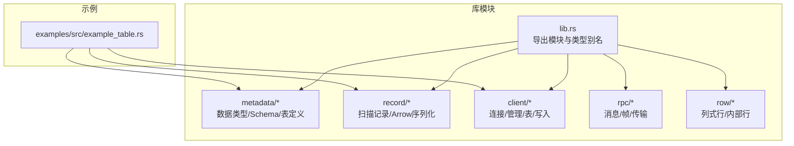
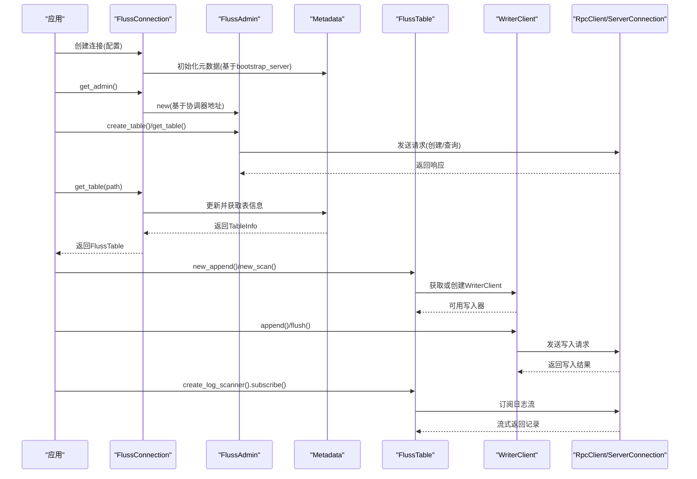
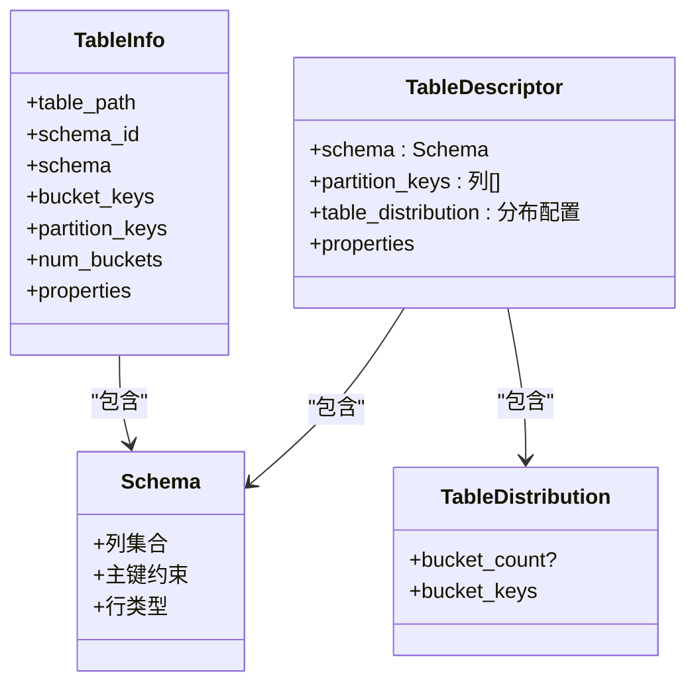
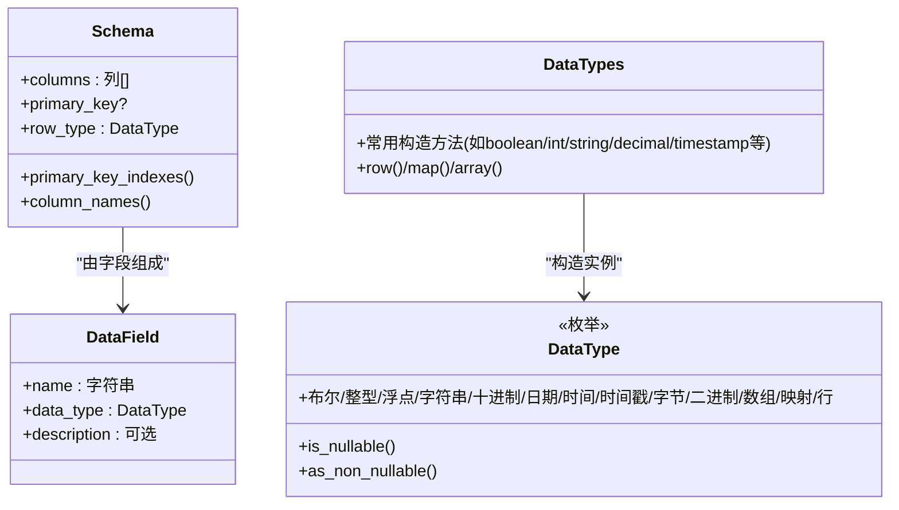
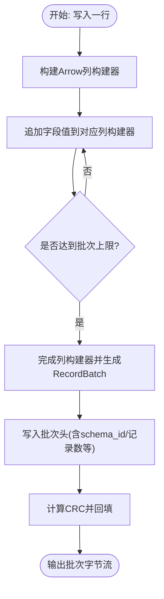
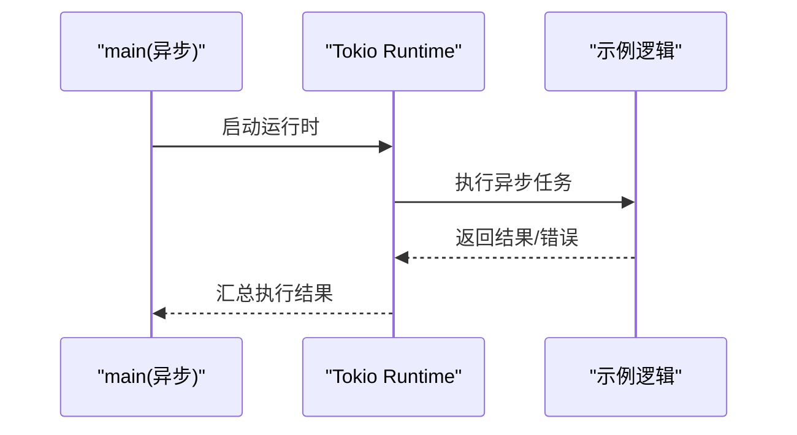
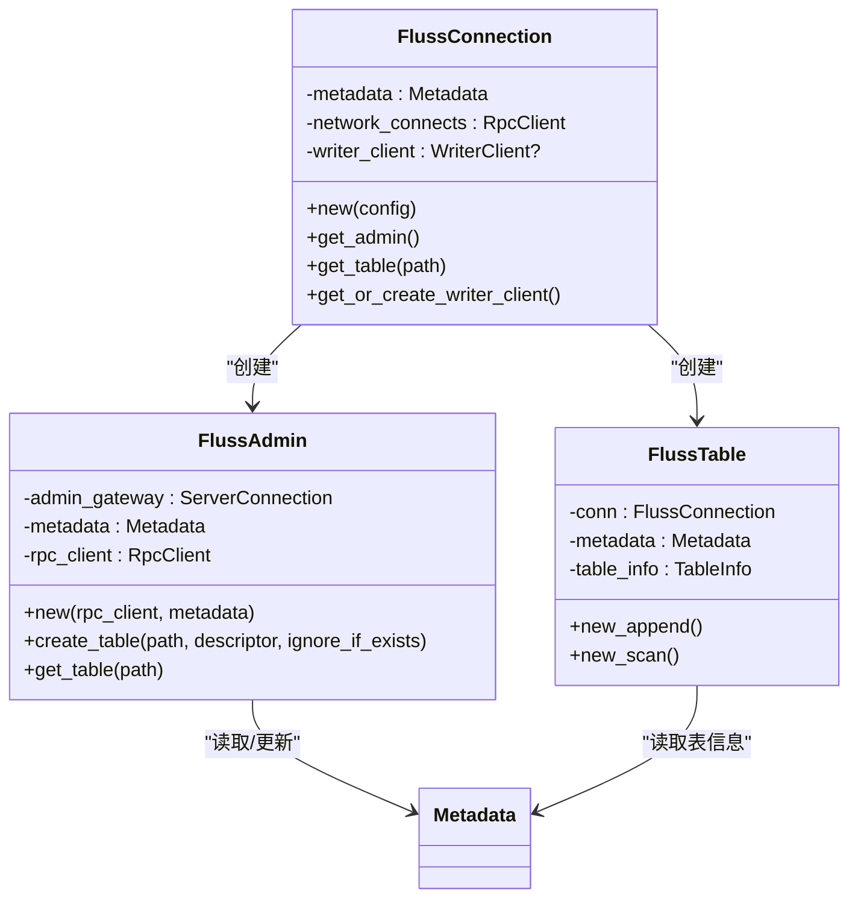
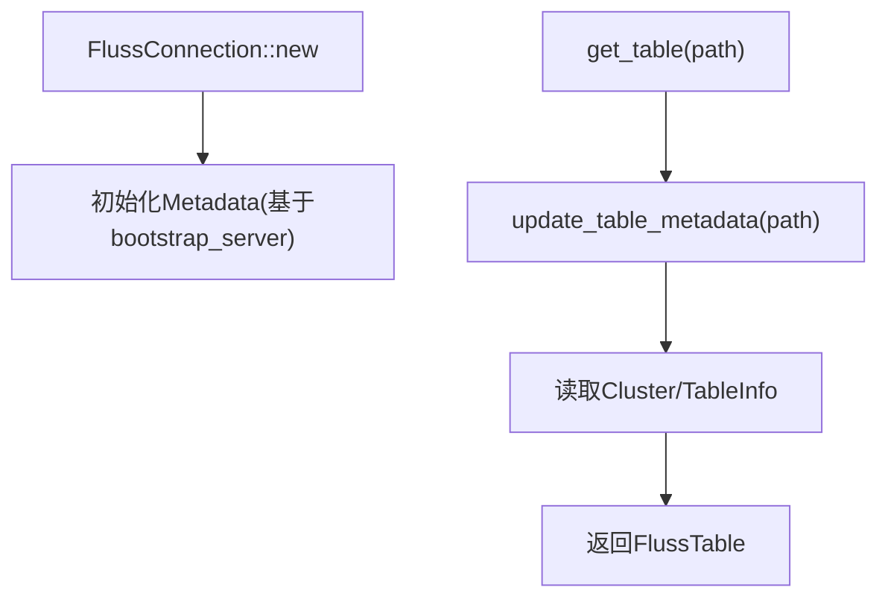
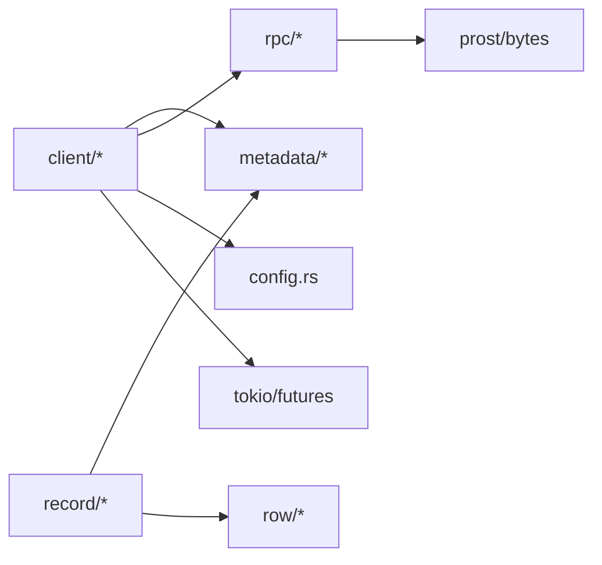

# 核心概念

<cite>
**本文引用的文件**
- [README.md](file://README.md)
- [lib.rs](file://crates/fluss/src/lib.rs)
- [Cargo.toml](file://crates/fluss/Cargo.toml)
- [client/mod.rs](file://crates/fluss/src/client/mod.rs)
- [client/connection.rs](file://crates/fluss/src/client/connection.rs)
- [client/admin.rs](file://crates/fluss/src/client/admin.rs)
- [client/table/mod.rs](file://crates/fluss/src/client/table/mod.rs)
- [client/write/mod.rs](file://crates/fluss/src/client/write/mod.rs)
- [metadata/mod.rs](file://crates/fluss/src/metadata/mod.rs)
- [metadata/datatype.rs](file://crates/fluss/src/metadata/datatype.rs)
- [metadata/table.rs](file://crates/fluss/src/metadata/table.rs)
- [record/mod.rs](file://crates/fluss/src/record/mod.rs)
- [record/arrow.rs](file://crates/fluss/src/record/arrow.rs)
- [config.rs](file://crates/fluss/src/config.rs)
- [rpc/mod.rs](file://crates/fluss/src/rpc/mod.rs)
- [examples/src/example_table.rs](file://crates/examples/src/example_table.rs)
</cite>

## 目录
1. [引言](#引言)
2. [项目结构](#项目结构)
3. [核心组件](#核心组件)
4. [架构总览](#架构总览)
5. [详细组件分析](#详细组件分析)
6. [依赖分析](#依赖分析)
7. [性能考虑](#性能考虑)
8. [故障排查指南](#故障排查指南)
9. [结论](#结论)
10. [附录](#附录)

## 引言
本文件面向希望理解 Fluss Rust 客户端“核心概念”的读者：既为初学者提供清晰易懂的分布式表、分区、分桶与 Arrow 格式的入门讲解，也为有经验的开发者提供深入的技术细节与代码级参考。内容覆盖以下主题：
- 分布式表：表、分区、分桶的关系与作用
- Arrow 格式：优势与在 Fluss 中的应用场景
- 异步编程模型与 Tokio 运行时基础
- 核心组件：FlussConnection、FlussAdmin、FlussTable 的职责与交互
- 数据类型系统、Schema 管理、元数据缓存等关键概念
- 使用真实示例路径说明概念应用

## 项目结构
Fluss Rust 客户端采用模块化组织，核心模块包括客户端（client）、元数据（metadata）、记录（record）、行（row）、RPC（rpc）等。顶层入口通过库模块导出，示例程序位于 examples。

**图表来源**
- [lib.rs](file://crates/fluss/src/lib.rs#L18-L37)
- [client/mod.rs](file://crates/fluss/src/client/mod.rs#L18-L26)
- [metadata/mod.rs](file://crates/fluss/src/metadata/mod.rs#L18-L24)
- [record/mod.rs](file://crates/fluss/src/record/mod.rs#L18-L26)
- [examples/src/example_table.rs](file://crates/examples/src/example_table.rs#L18-L25)

**章节来源**
- [lib.rs](file://crates/fluss/src/lib.rs#L18-L37)
- [Cargo.toml](file://crates/fluss/Cargo.toml#L25-L47)

## 核心组件
- FlussConnection：负责建立与集群的网络连接、维护元数据缓存、提供 FlussAdmin 与 FlussTable 获取能力，并按需创建 WriterClient。
- FlussAdmin：封装管理操作（如建表、查表），通过 RPC 与协调器通信。
- FlussTable：封装对表的读写操作，提供 Append 写入与日志扫描能力。
- WriterClient：负责将数据以批处理形式写入对应分桶，支持结果回传与重试策略。
- Metadata：集中管理表元信息、Schema、分桶与分区配置，支撑客户端行为。
- Record/Arrow：负责将列式数据编码为 Arrow 记录批次，以及从日志中解码为扫描记录。

**章节来源**
- [client/connection.rs](file://crates/fluss/src/client/connection.rs#L30-L82)
- [client/admin.rs](file://crates/fluss/src/client/admin.rs#L28-L93)
- [client/table/mod.rs](file://crates/fluss/src/client/table/mod.rs#L33-L66)
- [client/write/mod.rs](file://crates/fluss/src/client/write/mod.rs#L34-L68)
- [metadata/table.rs](file://crates/fluss/src/metadata/table.rs#L634-L800)
- [record/arrow.rs](file://crates/fluss/src/record/arrow.rs#L92-L230)

## 架构总览
下图展示了客户端从连接到写入/扫描的关键交互流程。

**图表来源**
- [client/connection.rs](file://crates/fluss/src/client/connection.rs#L37-L81)
- [client/admin.rs](file://crates/fluss/src/client/admin.rs#L34-L92)
- [client/table/mod.rs](file://crates/fluss/src/client/table/mod.rs#L41-L66)
- [client/write/mod.rs](file://crates/fluss/src/client/write/mod.rs#L34-L68)
- [rpc/mod.rs](file://crates/fluss/src/rpc/mod.rs#L18-L31)

## 详细组件分析

### 分布式表：表、分区、分桶
- 表（Table）：由 Schema 描述字段与主键，配合属性与注释构成完整表定义。
- 分区（Partition）：用于按列值划分物理存储，提升查询与写入局部性。
- 分桶（Bucket）：用于将同一分区内的数据进一步按分桶键分布到不同分桶，提高并行写入与扫描效率；默认情况下，无主键表可不设置分桶键，有主键表默认分桶键为物理主键（排除分区键后）。
- 关系与作用：
  - 分区键决定“水平切分”的边界；
  - 分桶键决定“细粒度分布”的边界；
  - 主键用于唯一性约束与更新语义（在具备主键的表上，分桶键通常包含主键列，但不与分区键冲突）。

**图表来源**
- [metadata/table.rs](file://crates/fluss/src/metadata/table.rs#L94-L144)
- [metadata/table.rs](file://crates/fluss/src/metadata/table.rs#L270-L285)
- [metadata/table.rs](file://crates/fluss/src/metadata/table.rs#L376-L431)
- [metadata/table.rs](file://crates/fluss/src/metadata/table.rs#L634-L754)

**章节来源**
- [metadata/table.rs](file://crates/fluss/src/metadata/table.rs#L94-L144)
- [metadata/table.rs](file://crates/fluss/src/metadata/table.rs#L270-L285)
- [metadata/table.rs](file://crates/fluss/src/metadata/table.rs#L376-L431)
- [metadata/table.rs](file://crates/fluss/src/metadata/table.rs#L634-L754)

### 数据类型系统与 Schema 管理
- DataType：覆盖布尔、整数、浮点、字符串、日期时间、十进制、数组、映射、行等类型，并支持可空性标记与构造辅助方法。
- DataField：字段名、类型与描述。
- Schema：由列集合与可选主键组成，自动生成行类型（RowType）。
- TableDescriptor/TableInfo：表定义与最终落盘后的表信息，包含分桶键、分区键、属性等。

**图表来源**
- [metadata/datatype.rs](file://crates/fluss/src/metadata/datatype.rs#L24-L94)
- [metadata/datatype.rs](file://crates/fluss/src/metadata/datatype.rs#L649-L787)
- [metadata/table.rs](file://crates/fluss/src/metadata/table.rs#L94-L144)

**章节来源**
- [metadata/datatype.rs](file://crates/fluss/src/metadata/datatype.rs#L24-L94)
- [metadata/datatype.rs](file://crates/fluss/src/metadata/datatype.rs#L649-L787)
- [metadata/table.rs](file://crates/fluss/src/metadata/table.rs#L94-L144)

### Arrow 格式的优势与在 Fluss 中的应用
- 优势：
  - 列式存储，便于向量化计算与批量处理；
  - 跨语言生态成熟，序列化/反序列化高效；
  - 支持零拷贝读取与内存映射，降低 GC 压力。
- 在 Fluss 中的应用：
  - 写入侧：将 GenericRow/ColumnarRow 编码为 Arrow RecordBatch，拼接批次头与 CRC，形成日志批次；
  - 读取侧：从日志中解析批次头，结合 Arrow 元数据流式读取 RecordBatch，转换为 ScanRecord 供上层消费。

**图表来源**
- [record/arrow.rs](file://crates/fluss/src/record/arrow.rs#L104-L185)

**章节来源**
- [record/arrow.rs](file://crates/fluss/src/record/arrow.rs#L104-L185)
- [record/arrow.rs](file://crates/fluss/src/record/arrow.rs#L402-L447)

### 异步编程模型与 Tokio 运行时
- Rust 客户端广泛使用 async/await 与 Tokio 运行时进行并发 I/O 操作（如 RPC 请求、写入批处理、日志扫描）。
- 示例程序通过 #[tokio::main] 启动异步运行时，演示了创建连接、建表、写入与扫描的完整流程。

**图表来源**
- [examples/src/example_table.rs](file://crates/examples/src/example_table.rs#L27-L28)
- [examples/src/example_table.rs](file://crates/examples/src/example_table.rs#L28-L86)

**章节来源**
- [examples/src/example_table.rs](file://crates/examples/src/example_table.rs#L27-L28)
- [examples/src/example_table.rs](file://crates/examples/src/example_table.rs#L28-L86)

### FlussConnection、FlussAdmin、FlussTable 的职责与交互
- FlussConnection
  - 负责初始化 Metadata 与 RpcClient；
  - 提供 get_admin() 获取管理接口；
  - 提供 get_table() 获取表对象，并按需创建 WriterClient。
- FlussAdmin
  - 通过协调器地址建立 ServerConnection；
  - 提供 create_table()/get_table() 等管理操作。
- FlussTable
  - 封装 new_append()/new_scan()；
  - 通过 WriterClient 执行写入，通过日志扫描器订阅并消费记录。

**图表来源**
- [client/connection.rs](file://crates/fluss/src/client/connection.rs#L30-L82)
- [client/admin.rs](file://crates/fluss/src/client/admin.rs#L28-L93)
- [client/table/mod.rs](file://crates/fluss/src/client/table/mod.rs#L33-L66)

**章节来源**
- [client/connection.rs](file://crates/fluss/src/client/connection.rs#L30-L82)
- [client/admin.rs](file://crates/fluss/src/client/admin.rs#L28-L93)
- [client/table/mod.rs](file://crates/fluss/src/client/table/mod.rs#L33-L66)

### 元数据缓存与配置
- 元数据缓存：FlussConnection 在初始化时创建 Metadata，并在获取表时调用其更新与读取表元信息，避免重复拉取。
- 配置项：包括 bootstrap_server、请求大小限制、写入确认策略、重试次数、批大小等，影响连接、写入与扫描行为。

**图表来源**
- [client/connection.rs](file://crates/fluss/src/client/connection.rs#L37-L81)
- [config.rs](file://crates/fluss/src/config.rs#L21-L39)

**章节来源**
- [client/connection.rs](file://crates/fluss/src/client/connection.rs#L37-L81)
- [config.rs](file://crates/fluss/src/config.rs#L21-L39)

## 依赖分析
- 外部依赖：arrow、arrow-schema、tokio、futures、serde、prost、parking_lot、dashmap 等。
- 模块耦合：
  - client 依赖 metadata、rpc、config；
  - record 依赖 metadata、row；
  - rpc 提供消息与传输抽象，被 client/admin/table 使用。

**图表来源**
- [Cargo.toml](file://crates/fluss/Cargo.toml#L25-L47)
- [client/mod.rs](file://crates/fluss/src/client/mod.rs#L18-L26)
- [record/mod.rs](file://crates/fluss/src/record/mod.rs#L18-L26)
- [rpc/mod.rs](file://crates/fluss/src/rpc/mod.rs#L18-L31)

**章节来源**
- [Cargo.toml](file://crates/fluss/Cargo.toml#L25-L47)
- [client/mod.rs](file://crates/fluss/src/client/mod.rs#L18-L26)
- [record/mod.rs](file://crates/fluss/src/record/mod.rs#L18-L26)
- [rpc/mod.rs](file://crates/fluss/src/rpc/mod.rs#L18-L31)

## 性能考虑
- Arrow 列式序列化：减少序列化开销，提升吞吐；批次大小与记录数应结合业务数据特征调整。
- 分桶与分区：合理设置分桶键与分区键，避免热点；主键表默认分桶键为物理主键（剔除分区键）。
- 异步 I/O：利用 Tokio 并发模型，避免阻塞；写入批处理与结果回传采用广播通道，降低同步等待。
- 元数据缓存：减少频繁查询协调器，提升表访问性能。

## 故障排查指南
- 建表失败：检查 TableDescriptor 的分桶键与分区键是否冲突，主键表的分桶键是否为主键子集且不含分区键。
- 写入异常：确认 WriterClient 的配置（acks、retries、batch_size），查看 ResultHandle.wait() 返回的错误。
- 扫描无数据：确认订阅参数（分区/起始偏移）正确，检查日志是否已提交。
- 类型不匹配：确保写入的 GenericRow 与 Schema 的字段顺序与类型一致。

**章节来源**
- [metadata/table.rs](file://crates/fluss/src/metadata/table.rs#L510-L564)
- [client/write/mod.rs](file://crates/fluss/src/client/write/mod.rs#L57-L68)
- [record/arrow.rs](file://crates/fluss/src/record/arrow.rs#L314-L317)

## 结论
Fluss Rust 客户端通过清晰的模块划分与异步运行时，提供了从表管理到日志写入与扫描的完整能力。理解表、分区、分桶的关系，掌握 Arrow 格式在列式处理中的优势，以及合理运用 FlussConnection、FlussAdmin、FlussTable 的职责分工，是高效使用该客户端的关键。建议在生产环境中结合业务特征优化分桶键、批大小与并发策略，并充分利用元数据缓存与异步 I/O 提升整体性能。

## 附录
- 快速开始与示例：参见示例程序，展示连接、建表、写入与扫描的完整流程。

**章节来源**
- [README.md](file://README.md#L66-L124)
- [examples/src/example_table.rs](file://crates/examples/src/example_table.rs#L27-L86)