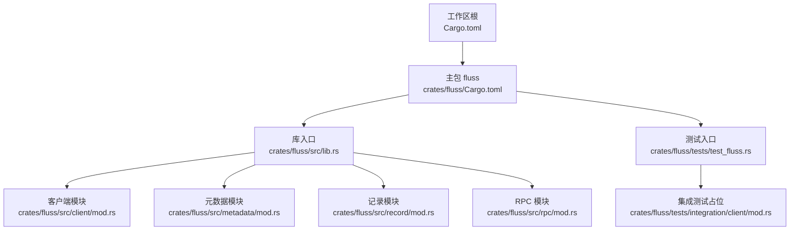
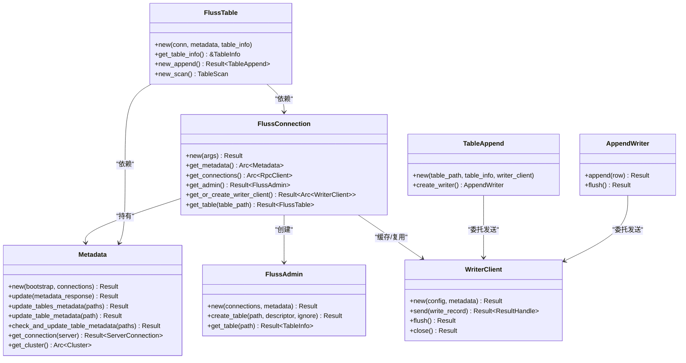
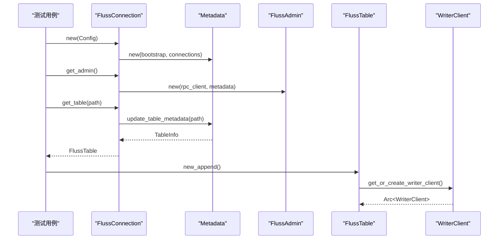
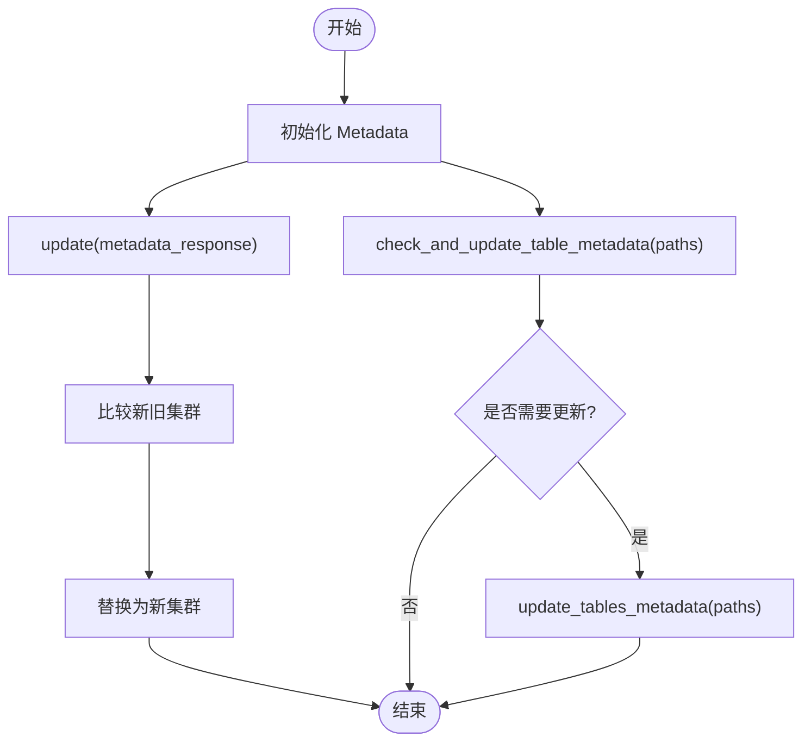
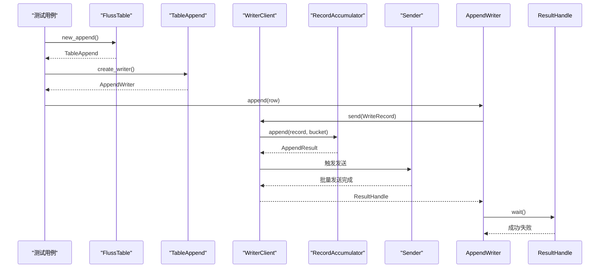
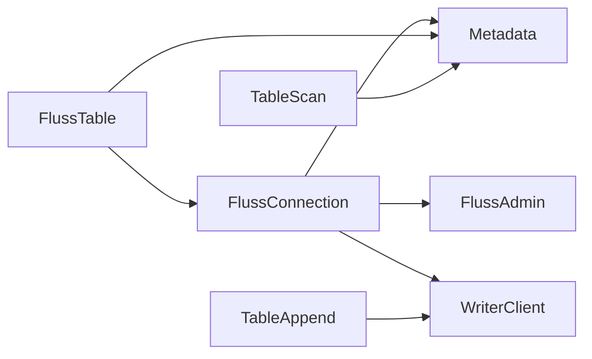

# 单元测试

<cite>
**本文引用的文件**
- [Cargo.toml](file://Cargo.toml)
- [crates/fluss/Cargo.toml](file://crates/fluss/Cargo.toml)
- [crates/fluss/src/lib.rs](file://crates/fluss/src/lib.rs)
- [crates/fluss/tests/test_fluss.rs](file://crates/fluss/tests/test_fluss.rs)
- [crates/fluss/tests/integration/client/mod.rs](file://crates/fluss/tests/integration/client/mod.rs)
- [crates/fluss/src/client/mod.rs](file://crates/fluss/src/client/mod.rs)
- [crates/fluss/src/client/admin.rs](file://crates/fluss/src/client/admin.rs)
- [crates/fluss/src/client/connection.rs](file://crates/fluss/src/client/connection.rs)
- [crates/fluss/src/client/metadata.rs](file://crates/fluss/src/client/metadata.rs)
- [crates/fluss/src/client/table/mod.rs](file://crates/fluss/src/client/table/mod.rs)
- [crates/fluss/src/client/table/append.rs](file://crates/fluss/src/client/table/append.rs)
- [crates/fluss/src/client/table/scanner.rs](file://crates/fluss/src/client/table/scanner.rs)
- [crates/fluss/src/client/write/mod.rs](file://crates/fluss/src/client/write/mod.rs)
- [crates/fluss/src/client/write/writer_client.rs](file://crates/fluss/src/client/write/writer_client.rs)
</cite>

## 目录
1. [引言](#引言)
2. [项目结构](#项目结构)
3. [核心组件](#核心组件)
4. [架构总览](#架构总览)
5. [详细组件分析](#详细组件分析)
6. [依赖关系分析](#依赖关系分析)
7. [性能考量](#性能考量)
8. [故障排查指南](#故障排查指南)
9. [结论](#结论)
10. [附录](#附录)

## 引言
本文件面向 Fluss-Rust 项目的单元测试实践，系统阐述测试用例设计原则、Mock 对象使用方法、断言策略与测试数据准备，并针对客户端模块、元数据模块、记录处理模块等进行分层测试方法说明。同时给出异步测试处理、测试命名约定、测试组织结构以及覆盖率建议，帮助开发者在不引入外部服务的前提下完成高质量的单元测试。

## 项目结构
- 工作区采用 Rust 多包结构，主包位于 crates/fluss，examples 作为示例子包。
- 测试目录位于 crates/fluss/tests，当前包含集成测试占位文件与 client 子目录。
- 客户端 API 通过 crates/fluss/src/client/* 提供，涵盖连接、元数据、表操作（写入/扫描）、写入器等。

图表来源
- [Cargo.toml](file://Cargo.toml#L29-L36)
- [crates/fluss/Cargo.toml](file://crates/fluss/Cargo.toml#L18-L55)
- [crates/fluss/src/lib.rs](file://crates/fluss/src/lib.rs#L18-L37)
- [crates/fluss/tests/test_fluss.rs](file://crates/fluss/tests/test_fluss.rs#L18-L25)
- [crates/fluss/tests/integration/client/mod.rs](file://crates/fluss/tests/integration/client/mod.rs#L18-L21)

章节来源
- [Cargo.toml](file://Cargo.toml#L29-L36)
- [crates/fluss/Cargo.toml](file://crates/fluss/Cargo.toml#L18-L55)
- [crates/fluss/src/lib.rs](file://crates/fluss/src/lib.rs#L18-L37)
- [crates/fluss/tests/test_fluss.rs](file://crates/fluss/tests/test_fluss.rs#L18-L25)
- [crates/fluss/tests/integration/client/mod.rs](file://crates/fluss/tests/integration/client/mod.rs#L18-L21)

## 核心组件
- 客户端连接与管理：FlussConnection 负责初始化元数据、维护 RpcClient 连接池、提供 Admin 与 Table 访问入口。
- 元数据管理：Metadata 负责从协调者服务器拉取集群信息、更新表元数据、提供表桶到 Leader 的映射查询。
- 表操作：FlussTable 封装表级读写能力；TableAppend 提供 AppendWriter 写入接口；TableScan 提供日志扫描与订阅。
- 写入器：WriterClient 负责记录累积、桶分配、发送与结果等待；ResultHandle 提供异步结果等待与错误转换。
- 管理接口：FlussAdmin 提供建表、查表等管理能力。

章节来源
- [crates/fluss/src/client/connection.rs](file://crates/fluss/src/client/connection.rs#L30-L82)
- [crates/fluss/src/client/metadata.rs](file://crates/fluss/src/client/metadata.rs#L29-L109)
- [crates/fluss/src/client/table/mod.rs](file://crates/fluss/src/client/table/mod.rs#L32-L73)
- [crates/fluss/src/client/table/append.rs](file://crates/fluss/src/client/table/append.rs#L25-L69)
- [crates/fluss/src/client/table/scanner.rs](file://crates/fluss/src/client/table/scanner.rs#L38-L108)
- [crates/fluss/src/client/write/writer_client.rs](file://crates/fluss/src/client/write/writer_client.rs#L31-L147)
- [crates/fluss/src/client/admin.rs](file://crates/fluss/src/client/admin.rs#L27-L93)

## 架构总览
下图展示了客户端模块在单元测试中的交互关系，重点体现连接、元数据、写入器与表操作之间的依赖与调用链。

图表来源
- [crates/fluss/src/client/connection.rs](file://crates/fluss/src/client/connection.rs#L30-L82)
- [crates/fluss/src/client/metadata.rs](file://crates/fluss/src/client/metadata.rs#L29-L109)
- [crates/fluss/src/client/admin.rs](file://crates/fluss/src/client/admin.rs#L27-L93)
- [crates/fluss/src/client/table/mod.rs](file://crates/fluss/src/client/table/mod.rs#L32-L73)
- [crates/fluss/src/client/table/append.rs](file://crates/fluss/src/client/table/append.rs#L25-L69)
- [crates/fluss/src/client/write/writer_client.rs](file://crates/fluss/src/client/write/writer_client.rs#L31-L147)

## 详细组件分析

### 客户端模块测试
目标
- 验证 FlussConnection 初始化、连接获取、Admin 与 Table 获取流程。
- 验证 WriterClient 发送路径、结果等待与关闭流程。
- 验证 Metadata 更新与表元数据检查逻辑。

测试要点
- 使用 Mock RpcClient 与 Mock Metadata，模拟网络请求与元数据响应。
- 断言连接建立、请求构造、错误传播与资源释放。
- 针对 WriterClient 的 send/flush/close 进行异步断言。

图表来源
- [crates/fluss/src/client/connection.rs](file://crates/fluss/src/client/connection.rs#L37-L81)
- [crates/fluss/src/client/admin.rs](file://crates/fluss/src/client/admin.rs#L34-L92)
- [crates/fluss/src/client/table/mod.rs](file://crates/fluss/src/client/table/mod.rs#L56-L66)
- [crates/fluss/src/client/write/writer_client.rs](file://crates/fluss/src/client/write/writer_client.rs#L66-L75)

章节来源
- [crates/fluss/src/client/connection.rs](file://crates/fluss/src/client/connection.rs#L37-L81)
- [crates/fluss/src/client/admin.rs](file://crates/fluss/src/client/admin.rs#L34-L92)
- [crates/fluss/src/client/table/mod.rs](file://crates/fluss/src/client/table/mod.rs#L56-L66)
- [crates/fluss/src/client/write/writer_client.rs](file://crates/fluss/src/client/write/writer_client.rs#L66-L75)

### 元数据模块测试
目标
- 验证 Metadata 初始化、更新、表元数据检查与连接获取。
- 验证 leader 查询占位逻辑与集群状态变更。

测试要点
- Mock ServerConnection 返回不同响应，验证 update 与 update_tables_metadata 的分支。
- 断言 check_and_update_table_metadata 在需要时触发更新。
- 验证 get_connection 正确转发到 RpcClient。

图表来源
- [crates/fluss/src/client/metadata.rs](file://crates/fluss/src/client/metadata.rs#L57-L94)

章节来源
- [crates/fluss/src/client/metadata.rs](file://crates/fluss/src/client/metadata.rs#L35-L109)

### 记录处理模块测试
目标
- 验证 TableAppend/AppendWriter 的写入流程与结果等待。
- 验证 TableScan 的订阅、轮询与日志抓取。
- 验证 WriterClient 的桶分配、批次累积与发送。

测试要点
- 使用 Mock RpcClient 返回 FetchLogResponse，验证日志解析与偏移更新。
- 断言订阅后可轮询到数据，且偏移正确推进。
- 验证 send 后 ResultHandle.wait 可返回成功或错误。

图表来源
- [crates/fluss/src/client/table/append.rs](file://crates/fluss/src/client/table/append.rs#L58-L64)
- [crates/fluss/src/client/write/writer_client.rs](file://crates/fluss/src/client/write/writer_client.rs#L89-L123)
- [crates/fluss/src/client/table/scanner.rs](file://crates/fluss/src/client/table/scanner.rs#L91-L107)

章节来源
- [crates/fluss/src/client/table/append.rs](file://crates/fluss/src/client/table/append.rs#L58-L69)
- [crates/fluss/src/client/write/writer_client.rs](file://crates/fluss/src/client/write/writer_client.rs#L89-L141)
- [crates/fluss/src/client/table/scanner.rs](file://crates/fluss/src/client/table/scanner.rs#L91-L173)

### 管理接口模块测试
目标
- 验证 FlussAdmin 的建表与查表流程。
- 验证 RPC 请求构造与响应解析。

测试要点
- Mock ServerConnection 返回 CreateTableResponse 与 GetTableInfoResponse。
- 断言请求参数与响应字段映射正确。

章节来源
- [crates/fluss/src/client/admin.rs](file://crates/fluss/src/client/admin.rs#L52-L92)

## 依赖关系分析
- 客户端模块内部耦合度适中：FlussConnection 统一管理连接与元数据；WriterClient 作为写入核心被多处复用。
- 元数据模块对外仅暴露更新与查询接口，便于测试隔离。
- 表操作模块通过 WriterClient 与 Scanner 解耦网络层，利于单元测试。

图表来源
- [crates/fluss/src/client/connection.rs](file://crates/fluss/src/client/connection.rs#L30-L82)
- [crates/fluss/src/client/table/mod.rs](file://crates/fluss/src/client/table/mod.rs#L32-L73)
- [crates/fluss/src/client/table/append.rs](file://crates/fluss/src/client/table/append.rs#L25-L51)
- [crates/fluss/src/client/table/scanner.rs](file://crates/fluss/src/client/table/scanner.rs#L38-L68)

章节来源
- [crates/fluss/src/client/connection.rs](file://crates/fluss/src/client/connection.rs#L30-L82)
- [crates/fluss/src/client/table/mod.rs](file://crates/fluss/src/client/table/mod.rs#L32-L73)
- [crates/fluss/src/client/table/append.rs](file://crates/fluss/src/client/table/append.rs#L25-L51)
- [crates/fluss/src/client/table/scanner.rs](file://crates/fluss/src/client/table/scanner.rs#L38-L68)

## 性能考量
- 单元测试应避免真实网络 IO，优先使用 Mock 与内存态对象。
- 对 WriterClient 的发送循环与批处理逻辑，可通过控制消息队列长度与超时时间，缩短测试执行时间。
- 对于扫描流程，可限制最大抓取字节与桶数量，减少测试数据规模。

## 故障排查指南
常见问题
- 元数据未更新导致表操作失败：检查 Metadata.check_and_update_table_metadata 是否被调用。
- 写入无响应：确认 WriterClient.send 是否触发 Sender.run，以及 ResultHandle.wait 是否被消费。
- 扫描无数据：确认订阅的桶与偏移是否正确，以及日志抓取请求构造是否完整。

定位方法
- 使用断言验证各阶段返回值与错误类型。
- 通过 Mock 的 expect/verify 检查请求是否按预期发送。
- 对异步流程使用超时断言，避免测试悬挂。

章节来源
- [crates/fluss/src/client/metadata.rs](file://crates/fluss/src/client/metadata.rs#L83-L94)
- [crates/fluss/src/client/write/writer_client.rs](file://crates/fluss/src/client/write/writer_client.rs#L57-L66)
- [crates/fluss/src/client/table/scanner.rs](file://crates/fluss/src/client/table/scanner.rs#L95-L107)

## 结论
通过将网络层与业务逻辑解耦，结合 Mock 对象与清晰的断言策略，Fluss-Rust 的客户端、元数据与记录处理模块均可在单元测试层面得到充分覆盖。建议优先保证核心路径（连接、元数据更新、写入发送、扫描订阅）的稳定性，并逐步扩展边界条件与错误场景的测试。

## 附录

### 测试命名约定
- 测试函数以 test_ 前缀命名，语义化描述被测功能与输入输出。
- 异步测试以 async_ 前缀区分，如 async_write_flow。
- 错误场景以 err_ 前缀标识，如 err_invalid_config。

### 测试组织结构
- 按模块划分测试文件：client、metadata、write、table、rpc 等。
- 每个模块内按功能细分：如 table 下再分 append、scan。
- 公共工具集中放置在 tests/support 或同模块内。

### 异步测试处理
- 使用异步运行时（如 tokio::test），确保 await 调用链完整。
- 对可能阻塞的异步任务设置超时断言，避免测试卡死。
- 对并发场景使用 channel 或 notify 控制执行顺序。

### 测试覆盖率要求建议
- 关键路径（连接、元数据更新、写入发送、扫描订阅）覆盖率不低于 80%。
- 错误路径（非法配置、网络异常、元数据缺失）覆盖率不低于 70%。
- 使用 cargo-tarpaulin 或类似工具生成报告并持续跟踪。

### 示例参考路径（不含代码）
- 客户端连接初始化与 Admin 获取
  - [crates/fluss/src/client/connection.rs](file://crates/fluss/src/client/connection.rs#L37-L64)
- 元数据更新与表检查
  - [crates/fluss/src/client/metadata.rs](file://crates/fluss/src/client/metadata.rs#L57-L94)
- 表写入与结果等待
  - [crates/fluss/src/client/table/append.rs](file://crates/fluss/src/client/table/append.rs#L58-L64)
  - [crates/fluss/src/client/write/writer_client.rs](file://crates/fluss/src/client/write/writer_client.rs#L89-L123)
- 表扫描与订阅
  - [crates/fluss/src/client/table/scanner.rs](file://crates/fluss/src/client/table/scanner.rs#L95-L107)
  - [crates/fluss/src/client/table/scanner.rs](file://crates/fluss/src/client/table/scanner.rs#L135-L173)
- 管理接口建表与查表
  - [crates/fluss/src/client/admin.rs](file://crates/fluss/src/client/admin.rs#L52-L92)