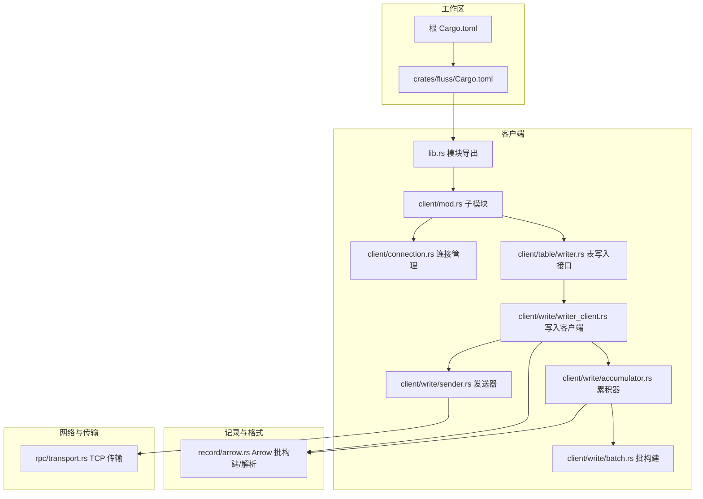
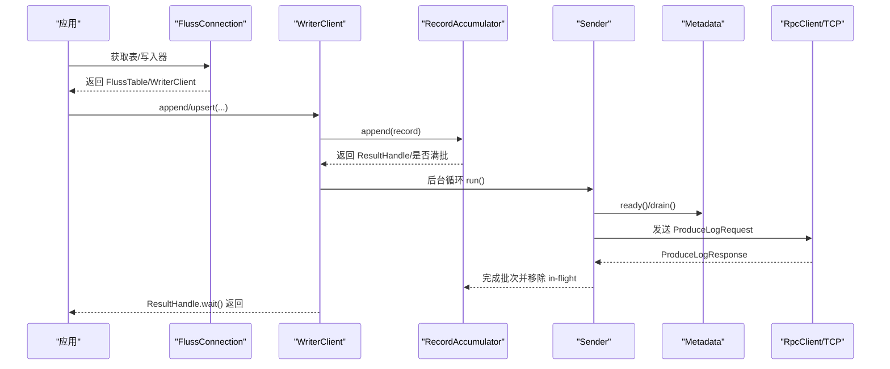
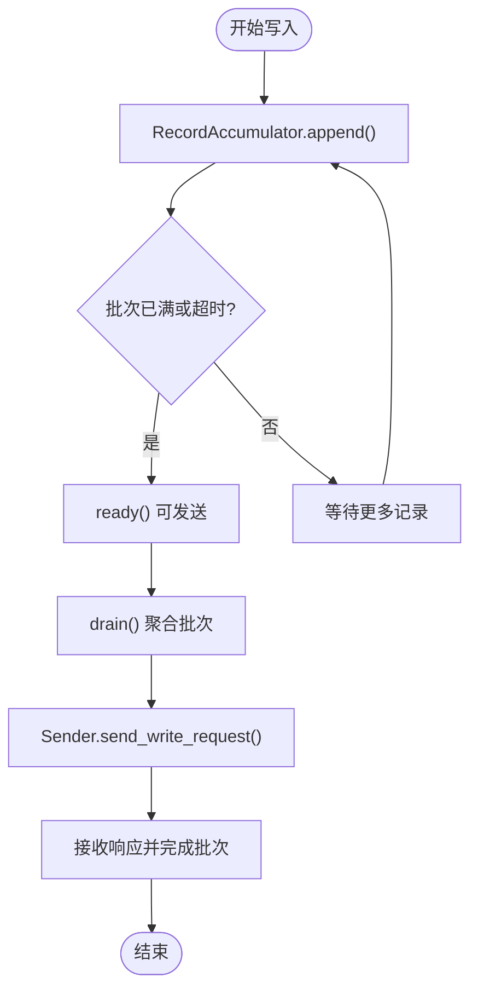
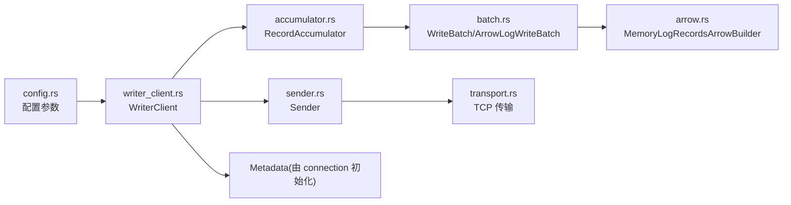

# 性能测试

<cite>
**本文引用的文件**
- [Cargo.toml](file://Cargo.toml)
- [crates/fluss/Cargo.toml](file://crates/fluss/Cargo.toml)
- [README.md](file://README.md)
- [crates/fluss/src/lib.rs](file://crates/fluss/src/lib.rs)
- [crates/fluss/src/config.rs](file://crates/fluss/src/config.rs)
- [crates/fluss/src/client/connection.rs](file://crates/fluss/src/client/connection.rs)
- [crates/fluss/src/client/mod.rs](file://crates/fluss/src/client/mod.rs)
- [crates/fluss/src/client/table/writer.rs](file://crates/fluss/src/client/table/writer.rs)
- [crates/fluss/src/client/write/writer_client.rs](file://crates/fluss/src/client/write/writer_client.rs)
- [crates/fluss/src/client/write/accumulator.rs](file://crates/fluss/src/client/write/accumulator.rs)
- [crates/fluss/src/client/write/batch.rs](file://crates/fluss/src/client/write/batch.rs)
- [crates/fluss/src/client/write/sender.rs](file://crates/fluss/src/client/write/sender.rs)
- [crates/fluss/src/record/arrow.rs](file://crates/fluss/src/record/arrow.rs)
- [crates/fluss/src/rpc/transport.rs](file://crates/fluss/src/rpc/transport.rs)
- [crates/fluss/tests/test_fluss.rs](file://crates/fluss/tests/test_fluss.rs)
</cite>

## 目录
1. [引言](#引言)
2. [项目结构](#项目结构)
3. [核心组件](#核心组件)
4. [架构总览](#架构总览)
5. [详细组件分析](#详细组件分析)
6. [依赖关系分析](#依赖关系分析)
7. [性能考虑](#性能考虑)
8. [故障排查指南](#故障排查指南)
9. [结论](#结论)
10. [附录](#附录)

## 引言
本文件面向 Fluss-Rust 客户端的性能测试实践，目标是帮助读者系统地设计与实施负载测试、压力测试与基准测试，并掌握吞吐量、延迟、内存与 CPU 等关键指标的测量方法。文档同时给出 Arrow 格式批处理、批量写入参数调优、连接池配置等关键技术点的实操建议，并提供性能测试报告生成与瓶颈定位的通用方法。

## 项目结构
该仓库采用多 crate 的工作区组织方式，核心客户端位于 crates/fluss。其模块化结构围绕“客户端—写入器—累积器—发送器—RPC 传输”展开，便于在不同层级进行性能调优与观测。

图表来源
- [Cargo.toml](file://Cargo.toml#L29-L36)
- [crates/fluss/Cargo.toml](file://crates/fluss/Cargo.toml#L25-L47)
- [crates/fluss/src/lib.rs](file://crates/fluss/src/lib.rs#L18-L37)
- [crates/fluss/src/client/mod.rs](file://crates/fluss/src/client/mod.rs#L18-L26)
- [crates/fluss/src/client/connection.rs](file://crates/fluss/src/client/connection.rs#L30-L82)
- [crates/fluss/src/client/table/writer.rs](file://crates/fluss/src/client/table/writer.rs#L42-L88)
- [crates/fluss/src/client/write/writer_client.rs](file://crates/fluss/src/client/write/writer_client.rs#L32-L147)
- [crates/fluss/src/client/write/accumulator.rs](file://crates/fluss/src/client/write/accumulator.rs#L35-L442)
- [crates/fluss/src/client/write/batch.rs](file://crates/fluss/src/client/write/batch.rs#L28-L176)
- [crates/fluss/src/client/write/sender.rs](file://crates/fluss/src/client/write/sender.rs#L31-L207)
- [crates/fluss/src/record/arrow.rs](file://crates/fluss/src/record/arrow.rs#L92-L230)
- [crates/fluss/src/rpc/transport.rs](file://crates/fluss/src/rpc/transport.rs#L27-L83)

章节来源
- [Cargo.toml](file://Cargo.toml#L29-L36)
- [crates/fluss/Cargo.toml](file://crates/fluss/Cargo.toml#L25-L47)

## 核心组件
- 配置层：通过 Config 提供请求大小、ACK 策略、重试次数、批大小等关键参数，直接影响吞吐与延迟。
- 连接层：FlussConnection 负责元数据与 RPC 客户端初始化，支持懒加载写入客户端。
- 写入层：WriterClient 组织 RecordAccumulator、Sender、BucketAssigner，实现批累积与发送。
- 批构建层：ArrowLogWriteBatch 使用 Arrow 架构构建列存批次，提升序列化效率。
- 记录层：MemoryLogRecordsArrowBuilder 将 GenericRow 转换为 Arrow RecordBatch 并写入自定义批次头。
- 发送层：Sender 周期性检查可发送节点，按最大请求大小聚合批次并发起请求。
- 传输层：Transport 基于 Tokio TCP 实现异步读写，作为 RPC 层基础。

章节来源
- [crates/fluss/src/config.rs](file://crates/fluss/src/config.rs#L21-L39)
- [crates/fluss/src/client/connection.rs](file://crates/fluss/src/client/connection.rs#L37-L81)
- [crates/fluss/src/client/write/writer_client.rs](file://crates/fluss/src/client/write/writer_client.rs#L42-L147)
- [crates/fluss/src/client/write/accumulator.rs](file://crates/fluss/src/client/write/accumulator.rs#L48-L373)
- [crates/fluss/src/client/write/batch.rs](file://crates/fluss/src/client/write/batch.rs#L130-L176)
- [crates/fluss/src/record/arrow.rs](file://crates/fluss/src/record/arrow.rs#L92-L230)
- [crates/fluss/src/client/write/sender.rs](file://crates/fluss/src/client/write/sender.rs#L42-L207)
- [crates/fluss/src/rpc/transport.rs](file://crates/fluss/src/rpc/transport.rs#L27-L83)

## 架构总览
下图展示从应用到服务端的关键路径：应用通过 WriterClient 发送写入请求；WriterClient 将记录累积到批中；Sender 周期性选择可发送节点并聚合批次；最终通过 RPC 传输发送至目标 TabletServer。

图表来源
- [crates/fluss/src/client/connection.rs](file://crates/fluss/src/client/connection.rs#L77-L81)
- [crates/fluss/src/client/write/writer_client.rs](file://crates/fluss/src/client/write/writer_client.rs#L89-L123)
- [crates/fluss/src/client/write/accumulator.rs](file://crates/fluss/src/client/write/accumulator.rs#L128-L162)
- [crates/fluss/src/client/write/sender.rs](file://crates/fluss/src/client/write/sender.rs#L72-L106)
- [crates/fluss/src/rpc/transport.rs](file://crates/fluss/src/rpc/transport.rs#L67-L83)

## 详细组件分析

### 写入流程与批构建（吞吐与延迟关键）
- 批构建：ArrowLogWriteBatch 使用 MemoryLogRecordsArrowBuilder 将多行记录写入 Arrow RecordBatch，并追加自定义批次头与 CRC 校验，减少序列化开销。
- 累积与调度：RecordAccumulator 按表/桶维护批次队列，基于超时与容量触发发送；Sender 周期性 ready() 检查，按最大请求大小聚合后发送。
- ACK 与重试：WriterClient 支持“all”或数字 ACK，结合 retries 控制可靠性与延迟权衡。

图表来源
- [crates/fluss/src/client/write/accumulator.rs](file://crates/fluss/src/client/write/accumulator.rs#L128-L162)
- [crates/fluss/src/client/write/accumulator.rs](file://crates/fluss/src/client/write/accumulator.rs#L164-L188)
- [crates/fluss/src/client/write/sender.rs](file://crates/fluss/src/client/write/sender.rs#L120-L130)
- [crates/fluss/src/client/write/sender.rs](file://crates/fluss/src/client/write/sender.rs#L132-L167)

章节来源
- [crates/fluss/src/client/write/batch.rs](file://crates/fluss/src/client/write/batch.rs#L130-L176)
- [crates/fluss/src/record/arrow.rs](file://crates/fluss/src/record/arrow.rs#L150-L185)
- [crates/fluss/src/client/write/accumulator.rs](file://crates/fluss/src/client/write/accumulator.rs#L164-L188)
- [crates/fluss/src/client/write/sender.rs](file://crates/fluss/src/client/write/sender.rs#L72-L106)

### Arrow 格式性能优化要点
- 列式存储：Arrow 以列式数组存储，适合批量序列化与反序列化，降低 CPU 开销。
- 批次头与 CRC：批次头包含长度、魔数、CRC 等字段，便于快速校验与分片解析。
- 最大记录数限制：默认最大记录数用于控制批次大小，避免单批过大导致延迟尖峰。
- 类型映射：将 Fluss 数据类型映射为 Arrow 类型，确保高效序列化。

章节来源
- [crates/fluss/src/record/arrow.rs](file://crates/fluss/src/record/arrow.rs#L18-L36)
- [crates/fluss/src/record/arrow.rs](file://crates/fluss/src/record/arrow.rs#L92-L230)
- [crates/fluss/src/record/arrow.rs](file://crates/fluss/src/record/arrow.rs#L402-L447)

### 批量写入性能调优
- 批大小（writer_batch_size）：增大可提升吞吐但增加尾延迟；需结合业务场景与服务端最大请求大小平衡。
- 请求上限（request_max_size）：Sender 会按此上限聚合批次，避免超过服务端限制。
- ACK 策略（writer_acks）：选择“all”可获得更强一致性但可能增加往返时间；数字 ACK 可降低延迟。
- 重试次数（writer_retries）：适度增加可提高稳定性，但会放大延迟与资源占用。
- 超时策略：累积器基于固定超时阈值触发发送，避免长时间等待。

章节来源
- [crates/fluss/src/config.rs](file://crates/fluss/src/config.rs#L28-L39)
- [crates/fluss/src/client/write/writer_client.rs](file://crates/fluss/src/client/write/writer_client.rs#L48-L55)
- [crates/fluss/src/client/write/accumulator.rs](file://crates/fluss/src/client/write/accumulator.rs#L54-L60)

### 连接池与传输性能
- 连接复用：WriterClient 与 Metadata 共享 RpcClient，减少连接建立开销。
- 传输抽象：Transport 基于 Tokio TCP，具备异步读写能力，适配高并发场景。
- 节点选择：Sender 依据 leader 信息选择目标节点，避免跨节点传输带来的额外延迟。

章节来源
- [crates/fluss/src/client/connection.rs](file://crates/fluss/src/client/connection.rs#L38-L51)
- [crates/fluss/src/client/write/writer_client.rs](file://crates/fluss/src/client/write/writer_client.rs#L48-L55)
- [crates/fluss/src/rpc/transport.rs](file://crates/fluss/src/rpc/transport.rs#L27-L83)

## 依赖关系分析
- 工作区与包依赖：根 Cargo.toml 定义工作区与成员 crate；fluss 包声明 arrow、tokio、prost 等关键依赖。
- 写入链路依赖：WriterClient 依赖 Accumulator、Sender、Metadata；Sender 依赖 RpcClient 与传输层；Arrow 批构建依赖 arrow-schema 与字节序、CRC 库。

图表来源
- [crates/fluss/Cargo.toml](file://crates/fluss/Cargo.toml#L25-L47)
- [crates/fluss/src/config.rs](file://crates/fluss/src/config.rs#L21-L39)
- [crates/fluss/src/client/write/writer_client.rs](file://crates/fluss/src/client/write/writer_client.rs#L32-L76)
- [crates/fluss/src/client/write/accumulator.rs](file://crates/fluss/src/client/write/accumulator.rs#L35-L61)
- [crates/fluss/src/client/write/batch.rs](file://crates/fluss/src/client/write/batch.rs#L67-L128)
- [crates/fluss/src/record/arrow.rs](file://crates/fluss/src/record/arrow.rs#L92-L125)
- [crates/fluss/src/client/write/sender.rs](file://crates/fluss/src/client/write/sender.rs#L31-L61)
- [crates/fluss/src/rpc/transport.rs](file://crates/fluss/src/rpc/transport.rs#L27-L30)

章节来源
- [crates/fluss/Cargo.toml](file://crates/fluss/Cargo.toml#L25-L47)

## 性能考虑
- 吞吐量（TPS/RPS）
  - 关键参数：writer_batch_size、request_max_size、writer_acks、writer_retries。
  - 观测点：Sender 成功发送批次数量、每秒请求数、服务端处理速率。
- 延迟（P50/P95/P99）
  - 关键参数：batch timeout、ACK 策略、网络 RTT、服务端处理耗时。
  - 观测点：ResultHandle.wait() 完成时间、批次排队等待时间、网络往返时间。
- 内存使用
  - 关注：Arrow 批构建缓冲、累积器队列、批次对象生命周期。
  - 优化：合理设置最大记录数、及时 flush、避免过长的 in-flight 队列。
- CPU 利用率
  - 关注：Arrow 序列化/反序列化、CRC 计算、Tokio 任务调度。
  - 优化：批量更大、更少的系统调用、减少不必要的拷贝。

## 故障排查指南
- 常见问题
  - 写入延迟高：检查 writer_acks 是否为“all”，适当降低 ACK 或增加批大小；确认 Sender 是否频繁等待超时。
  - 吞吐波动：检查 request_max_size 是否导致单批过大引发压缩/校验开销；观察批次是否频繁关闭。
  - OOM 风险：监控累积器队列长度与批次大小，必要时缩短 batch timeout 或减小批大小。
- 排查步骤
  - 启用日志与指标：在 Sender 中打印批次发送统计；在 WriterClient 中记录 ResultHandle 完成时间。
  - 复现最小化：使用单线程/单生产者验证参数组合，再逐步扩大并发。
  - 端到端验证：先本地集群验证，再迁移至更大规模环境。

## 结论
通过对 WriterClient、Accumulator、Sender、Arrow 批构建与传输层的协同分析，可以系统地进行 Fluss-Rust 客户端的性能测试与优化。建议以参数扫描（批大小、ACK、重试）为主线，结合吞吐、延迟、内存与 CPU 指标，形成闭环的性能测试与调优流程。

## 附录

### 性能测试设计与实施
- 负载测试
  - 设计：逐步提升并发写入速率，观察吞吐与延迟曲线，识别拐点。
  - 指标：QPS、平均/分位延迟、错误率、内存与 CPU。
- 压力测试
  - 设计：在极限条件下（最大批大小、最小 ACK 超时）持续运行，观察稳定性与恢复能力。
  - 指标：失败率、重启时间、堆积深度。
- 基准测试
  - 设计：固定参数组合，对比不同版本/配置的吞吐差异。
  - 指标：稳定期 TPS、P99 延迟、GC 次数与停顿时间。

### 性能指标测量方法
- 吞吐量
  - 方法：统计单位时间内成功写入的记录条数或批次数。
  - 工具：应用侧埋点 + 服务端指标采集。
- 延迟
  - 方法：记录每条记录进入 Accumulator 到 ResultHandle 完成的时间。
  - 工具：直方图/分位数统计。
- 内存使用
  - 方法：进程 RSS、堆大小、GC 指标。
  - 工具：操作系统采样、JVM/进程监控。
- CPU 利用率
  - 方法：用户态/系统态 CPU 时间占比。
  - 工具：perf、htop、火焰图。

### 性能测试工具使用指南
- wrk
  - 用途：HTTP/自定义协议压测（可扩展为 RPC 场景）。
  - 建议：多线程、多连接，预热后采集稳定期数据。
- ab（Apache Bench）
  - 用途：简单并发请求测试。
  - 建议：低并发验证正确性，高并发使用 wrk。
- JMeter
  - 用途：图形化脚本与分布式压测。
  - 建议：结合 CSV 输入与断言，输出聚合报告。

### Arrow 格式性能优化清单
- 使用列式批次（Arrow）替代行式，减少序列化成本。
- 控制批次大小，避免单批过大导致压缩与 CRC 峰值。
- 映射常用数据类型，减少动态类型转换。
- 在构建阶段一次性分配缓冲，避免频繁扩容。

### 批量写入性能调优清单
- 批大小：从较小值起步，逐步增大至吞吐饱和点。
- 请求上限：与服务端最大请求大小对齐，避免拆分。
- ACK 策略：根据一致性需求选择“all”或数字 ACK。
- 超时与重试：平衡延迟与稳定性，避免过度重试放大尾延迟。

### 连接池性能配置清单
- 连接复用：共享 RpcClient，减少握手与上下文切换。
- 超时设置：连接/读写超时与业务超时分离。
- 节点选择：优先本地/同机房节点，降低网络抖动。

### 性能测试报告生成与分析
- 报告要素
  - 测试场景、参数组合、硬件与网络环境。
  - 关键指标：吞吐、延迟分布、内存/CPU、错误率。
  - 建议：附带图表（延迟分布、吞吐趋势）与结论摘要。
- 分析方法
  - 对比不同参数下的指标变化，识别瓶颈来源（网络/序列化/CPU/内存）。
  - 结合日志与火焰图定位热点函数与异常路径。

### 性能瓶颈识别与优化建议
- 瓶颈识别
  - 序列化/反序列化：Arrow 构建与 CRC 计算。
  - 网络：RTT、带宽、丢包与拥塞。
  - 累积器：批次超时、队列过长、锁竞争。
- 优化建议
  - 参数调优：批大小、ACK、重试、超时。
  - 架构优化：连接池、批聚合策略、背压机制。
  - 监控增强：细化埋点、分层指标、告警阈值。