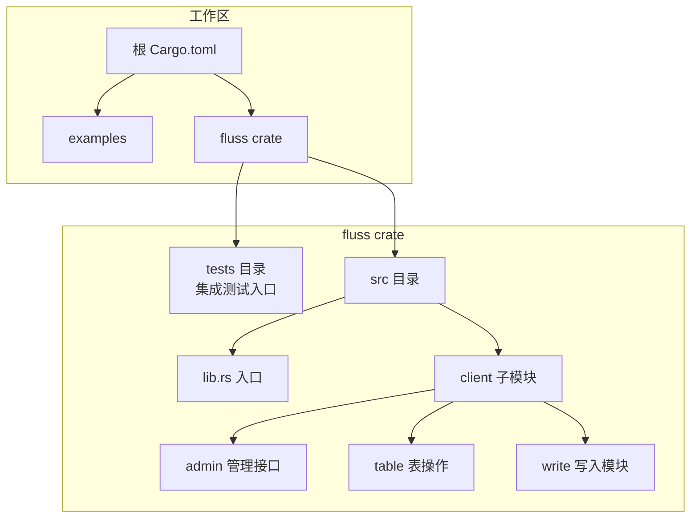
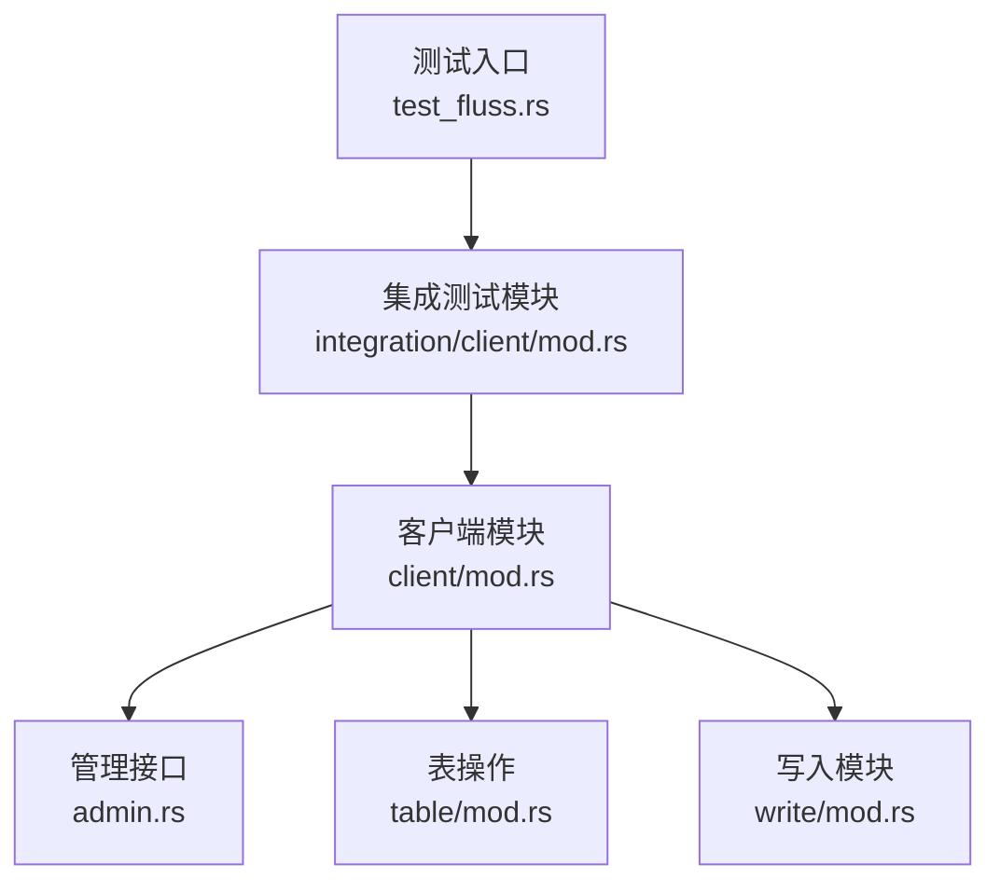
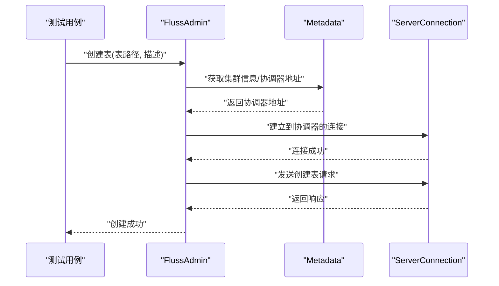
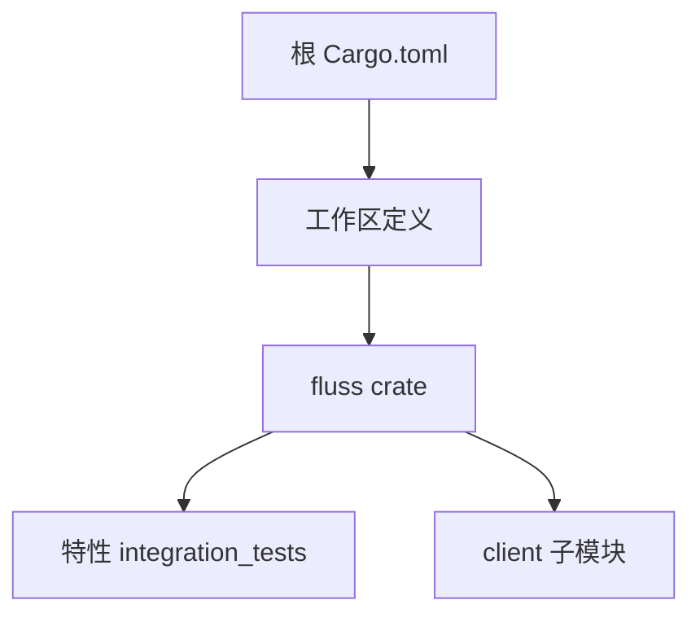

# 测试指南

<cite>
**本文引用的文件**
- [crates/fluss/tests/test_fluss.rs](file://crates/fluss/tests/test_fluss.rs)
- [crates/fluss/tests/integration/client/mod.rs](file://crates/fluss/tests/integration/client/mod.rs)
- [crates/fluss/Cargo.toml](file://crates/fluss/Cargo.toml)
- [Cargo.toml](file://Cargo.toml)
- [crates/fluss/src/lib.rs](file://crates/fluss/src/lib.rs)
- [crates/fluss/src/client/mod.rs](file://crates/fluss/src/client/mod.rs)
- [crates/fluss/src/client/table/mod.rs](file://crates/fluss/src/client/table/mod.rs)
- [crates/fluss/src/client/write/mod.rs](file://crates/fluss/src/client/write/mod.rs)
- [crates/fluss/src/client/admin.rs](file://crates/fluss/src/client/admin.rs)
</cite>

## 目录
1. [简介](#简介)
2. [项目结构](#项目结构)
3. [核心组件](#核心组件)
4. [架构总览](#架构总览)
5. [详细组件分析](#详细组件分析)
6. [依赖分析](#依赖分析)
7. [性能考虑](#性能考虑)
8. [故障排查指南](#故障排查指南)
9. [结论](#结论)
10. [附录](#附录)

## 简介
本测试指南面向 Fluss Rust 实现的测试与质量保障工作，覆盖单元测试、集成测试、性能测试与测试自动化流程。当前仓库已具备基础的集成测试框架（通过特性开关启用），并在客户端模块中提供了表操作、写入与管理接口，为测试场景提供了良好的切入点。本文将结合现有代码结构，给出可操作的测试设计建议、Mock 使用策略、断言方法、集成测试环境搭建要点、性能测试方法与自动化流水线建议。

## 项目结构
- 工作区采用多 crate 组织：根目录的 Cargo.toml 定义了工作区成员，其中 fluss 为主要实现 crate；examples 为示例。
- 测试位于 fluss crate 的 tests 目录下，当前包含一个空的集成测试入口与一个占位测试模块。
- 客户端 API 主要集中在 fluss/src/client 下，包含 admin（管理）、table（表操作）、write（写入）等子模块，是测试的重点对象。

**图表来源**
- [Cargo.toml](file://Cargo.toml#L29-L36)
- [crates/fluss/Cargo.toml](file://crates/fluss/Cargo.toml#L18-L55)
- [crates/fluss/src/lib.rs](file://crates/fluss/src/lib.rs#L18-L38)
- [crates/fluss/src/client/mod.rs](file://crates/fluss/src/client/mod.rs#L18-L27)
- [crates/fluss/src/client/admin.rs](file://crates/fluss/src/client/admin.rs#L27-L32)
- [crates/fluss/src/client/table/mod.rs](file://crates/fluss/src/client/table/mod.rs#L32-L39)
- [crates/fluss/src/client/write/mod.rs](file://crates/fluss/src/client/write/mod.rs#L34-L45)

**章节来源**
- [Cargo.toml](file://Cargo.toml#L29-L36)
- [crates/fluss/Cargo.toml](file://crates/fluss/Cargo.toml#L18-L55)

## 核心组件
- 集成测试入口与特性开关
  - 在测试入口文件中通过特性开关控制是否编译集成测试模块，便于在不同环境下选择性运行。
  - 参考路径：[crates/fluss/tests/test_fluss.rs](file://crates/fluss/tests/test_fluss.rs#L18-L25)
- 客户端模块
  - client 模块导出连接、元数据、表操作与写入能力，是测试的主要目标域。
  - 参考路径：[crates/fluss/src/client/mod.rs](file://crates/fluss/src/client/mod.rs#L18-L27)
- 表操作与写入
  - FlussTable 提供 append 与 scan 能力；WriteRecord、ResultHandle 等类型用于写入流程与结果等待。
  - 参考路径：
    - [crates/fluss/src/client/table/mod.rs](file://crates/fluss/src/client/table/mod.rs#L32-L67)
    - [crates/fluss/src/client/write/mod.rs](file://crates/fluss/src/client/write/mod.rs#L34-L68)
- 管理接口
  - FlussAdmin 提供创建表、查询表等管理能力，适合在集成测试中进行端到端验证。
  - 参考路径：[crates/fluss/src/client/admin.rs](file://crates/fluss/src/client/admin.rs#L27-L94)

**章节来源**
- [crates/fluss/tests/test_fluss.rs](file://crates/fluss/tests/test_fluss.rs#L18-L25)
- [crates/fluss/src/client/mod.rs](file://crates/fluss/src/client/mod.rs#L18-L27)
- [crates/fluss/src/client/table/mod.rs](file://crates/fluss/src/client/table/mod.rs#L32-L67)
- [crates/fluss/src/client/write/mod.rs](file://crates/fluss/src/client/write/mod.rs#L34-L68)
- [crates/fluss/src/client/admin.rs](file://crates/fluss/src/client/admin.rs#L27-L94)

## 架构总览
下图展示了测试相关的关键组件及其交互关系，重点体现“测试入口 → 集成测试模块 → 客户端 API → 管理与表操作”的调用链路。

**图表来源**
- [crates/fluss/tests/test_fluss.rs](file://crates/fluss/tests/test_fluss.rs#L18-L25)
- [crates/fluss/tests/integration/client/mod.rs](file://crates/fluss/tests/integration/client/mod.rs#L18-L21)
- [crates/fluss/src/client/mod.rs](file://crates/fluss/src/client/mod.rs#L18-L27)
- [crates/fluss/src/client/admin.rs](file://crates/fluss/src/client/admin.rs#L27-L32)
- [crates/fluss/src/client/table/mod.rs](file://crates/fluss/src/client/table/mod.rs#L32-L39)
- [crates/fluss/src/client/write/mod.rs](file://crates/fluss/src/client/write/mod.rs#L34-L45)

## 详细组件分析

### 单元测试编写方法
- 测试用例设计
  - 基于模块边界划分：对 admin、table、write 等模块分别设计独立的单元测试，确保职责单一、易于维护。
  - 输入输出清晰：针对每个函数或方法，明确输入参数、预期行为与期望输出，覆盖正常路径与异常路径。
- Mock 对象使用
  - 使用特性开关隔离外部依赖：通过特性开关启用/禁用网络或外部服务，使测试可在本地完成。
  - 接口抽象：对 RPC 客户端、元数据管理器等进行接口抽象，便于注入替身对象。
- 断言策略
  - 结果断言：对返回值、错误类型进行断言，确保业务逻辑正确。
  - 异步断言：对异步 API 使用 await 后断言，避免竞态条件。
  - 广播/接收：对 ResultHandle 的等待与结果处理进行断言，验证写入结果的可达性。

**章节来源**
- [crates/fluss/src/client/admin.rs](file://crates/fluss/src/client/admin.rs#L52-L92)
- [crates/fluss/src/client/table/mod.rs](file://crates/fluss/src/client/table/mod.rs#L56-L66)
- [crates/fluss/src/client/write/mod.rs](file://crates/fluss/src/client/write/mod.rs#L52-L68)

### 集成测试实现
- 测试环境搭建
  - 特性开关：通过特性 integration_tests 控制集成测试编译与运行，避免在无集群环境下误执行。
  - 参考路径：[crates/fluss/Cargo.toml](file://crates/fluss/Cargo.toml#L50-L51)
- Fluss 集群配置
  - 集群协调器与服务器地址：在 FlussAdmin 中通过 Metadata 获取协调器地址，确保请求路由正确。
  - 参考路径：[crates/fluss/src/client/admin.rs](file://crates/fluss/src/client/admin.rs#L35-L49)
- 测试数据准备
  - 表描述与模式：使用 TableDescriptor 描述表结构，结合 TableInfo 进行表创建与查询。
  - 参考路径：[crates/fluss/src/client/admin.rs](file://crates/fluss/src/client/admin.rs#L52-L92)
- 占位测试模块
  - 当前集成测试模块仅包含占位测试，建议在此基础上扩展具体场景（连接、表操作、数据读写）。
  - 参考路径：[crates/fluss/tests/integration/client/mod.rs](file://crates/fluss/tests/integration/client/mod.rs#L18-L21)

**图表来源**
- [crates/fluss/src/client/admin.rs](file://crates/fluss/src/client/admin.rs#L35-L67)

**章节来源**
- [crates/fluss/Cargo.toml](file://crates/fluss/Cargo.toml#L50-L51)
- [crates/fluss/src/client/admin.rs](file://crates/fluss/src/client/admin.rs#L35-L67)
- [crates/fluss/tests/integration/client/mod.rs](file://crates/fluss/tests/integration/client/mod.rs#L18-L21)

### 性能测试方法与工具
- 负载测试
  - 场景：模拟高并发写入、批量提交、扫描大表等。
  - 方法：使用异步任务池并发触发写入/扫描，记录吞吐量与延迟分布。
- 压力测试
  - 场景：逐步提升并发度与数据规模，观察系统在极限条件下的稳定性与资源占用。
  - 方法：以指数或线性方式增加负载，监控错误率、超时率与资源指标。
- 基准测试
  - 场景：对比不同写入策略（批大小、桶分配）对性能的影响。
  - 方法：固定输入规模，测量不同配置下的延迟与吞吐，形成基线数据。
- 工具建议
  - 基准测试：使用标准库的基准测试框架或第三方库进行微基准评估。
  - 负载与压力：结合异步运行时（如 tokio）与指标采集（如 prometheus）进行端到端评估。

[本节为通用指导，不直接分析具体文件，故无“章节来源”]

### 测试自动化流程
- CI/CD 集成
  - 分层执行：先执行单元测试，再按需执行集成测试（通过特性开关控制）。
  - 环境隔离：在 CI 中使用最小化集群或容器化服务，确保可重复性。
- 测试报告与覆盖率
  - 报告：使用支持的测试运行器生成 XML/JUnit 报告，便于 CI 展示。
  - 覆盖率：结合覆盖率工具统计代码分支覆盖，持续改进薄弱环节。
- 特性开关与条件编译
  - 利用特性开关控制集成测试的编译与执行，避免在常规开发环境中引入外部依赖。
  - 参考路径：[crates/fluss/Cargo.toml](file://crates/fluss/Cargo.toml#L50-L51)

**章节来源**
- [crates/fluss/Cargo.toml](file://crates/fluss/Cargo.toml#L50-L51)

### 常见测试场景实现方案
- 连接测试
  - 目标：验证客户端与协调器之间的连接建立与请求往返。
  - 方法：构造最小化的请求（如获取表信息），断言连接可用与响应正确。
  - 参考路径：[crates/fluss/src/client/admin.rs](file://crates/fluss/src/client/admin.rs#L69-L92)
- 表操作测试
  - 创建表：传入表路径与描述，断言创建成功且可查询。
  - 查询表：断言返回的表信息与描述一致。
  - 参考路径：[crates/fluss/src/client/admin.rs](file://crates/fluss/src/client/admin.rs#L52-L92)
- 数据读写测试
  - 写入：构造写记录，提交后通过 ResultHandle 等待结果，断言成功。
  - 扫描：使用表扫描器读取数据，断言读取结果与写入数据一致。
  - 参考路径：
    - [crates/fluss/src/client/write/mod.rs](file://crates/fluss/src/client/write/mod.rs#L34-L68)
    - [crates/fluss/src/client/table/mod.rs](file://crates/fluss/src/client/table/mod.rs#L56-L66)

**章节来源**
- [crates/fluss/src/client/admin.rs](file://crates/fluss/src/client/admin.rs#L52-L92)
- [crates/fluss/src/client/write/mod.rs](file://crates/fluss/src/client/write/mod.rs#L34-L68)
- [crates/fluss/src/client/table/mod.rs](file://crates/fluss/src/client/table/mod.rs#L56-L66)

## 依赖分析
- 工作区与 crate 关系
  - 根 Cargo.toml 定义了工作区成员，fluss 为主实现 crate，examples 为示例。
- 特性开关
  - fluss crate 定义了 integration_tests 特性，用于启用集成测试。
- 模块耦合
  - client 模块聚合 admin、table、write 等子模块，测试时可按需导入对应模块进行针对性测试。

**图表来源**
- [Cargo.toml](file://Cargo.toml#L29-L36)
- [crates/fluss/Cargo.toml](file://crates/fluss/Cargo.toml#L50-L51)
- [crates/fluss/src/client/mod.rs](file://crates/fluss/src/client/mod.rs#L18-L27)

**章节来源**
- [Cargo.toml](file://Cargo.toml#L29-L36)
- [crates/fluss/Cargo.toml](file://crates/fluss/Cargo.toml#L50-L51)

## 性能考虑
- 异步与并发
  - 写入与扫描均采用异步模型，测试时应合理设置并发度，避免过度竞争导致的抖动。
- 批处理与广播
  - 写入结果通过广播通道传递，测试应关注等待与接收的时序，避免阻塞。
- 资源与内存
  - 大数据量扫描与写入可能带来内存峰值，测试应监控内存与 GC 行为。

[本节为通用指导，不直接分析具体文件，故无“章节来源”]

## 故障排查指南
- 集成测试无法运行
  - 检查是否启用了 integration_tests 特性；确认测试入口与模块路径正确。
  - 参考路径：[crates/fluss/tests/test_fluss.rs](file://crates/fluss/tests/test_fluss.rs#L18-L25)
- 管理接口调用失败
  - 核对 Metadata 返回的协调器地址是否有效；检查连接建立与请求发送流程。
  - 参考路径：[crates/fluss/src/client/admin.rs](file://crates/fluss/src/client/admin.rs#L35-L49)
- 写入结果未达
  - 检查 ResultHandle 的等待逻辑与广播通道状态；确认写入客户端已正确初始化。
  - 参考路径：
    - [crates/fluss/src/client/write/mod.rs](file://crates/fluss/src/client/write/mod.rs#L52-L68)
    - [crates/fluss/src/client/table/mod.rs](file://crates/fluss/src/client/table/mod.rs#L56-L62)

**章节来源**
- [crates/fluss/tests/test_fluss.rs](file://crates/fluss/tests/test_fluss.rs#L18-L25)
- [crates/fluss/src/client/admin.rs](file://crates/fluss/src/client/admin.rs#L35-L49)
- [crates/fluss/src/client/write/mod.rs](file://crates/fluss/src/client/write/mod.rs#L52-L68)
- [crates/fluss/src/client/table/mod.rs](file://crates/fluss/src/client/table/mod.rs#L56-L62)

## 结论
本指南基于现有代码结构，给出了单元测试、集成测试、性能测试与自动化流程的实施建议。当前仓库已具备集成测试入口与特性开关，客户端模块提供了丰富的测试目标。建议在现有基础上完善集成测试场景（连接、表操作、数据读写），并引入性能与自动化工具，以构建完善的测试体系。

## 附录
- 快速开始
  - 启用集成测试特性并运行测试入口，参考：
    - [crates/fluss/Cargo.toml](file://crates/fluss/Cargo.toml#L50-L51)
    - [crates/fluss/tests/test_fluss.rs](file://crates/fluss/tests/test_fluss.rs#L18-L25)
- 参考实现位置
  - 管理接口与表操作：
    - [crates/fluss/src/client/admin.rs](file://crates/fluss/src/client/admin.rs#L27-L94)
    - [crates/fluss/src/client/table/mod.rs](file://crates/fluss/src/client/table/mod.rs#L32-L74)
  - 写入模块与结果处理：
    - [crates/fluss/src/client/write/mod.rs](file://crates/fluss/src/client/write/mod.rs#L34-L69)